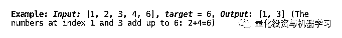
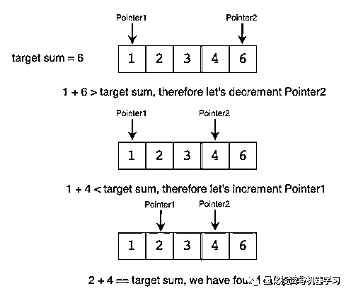
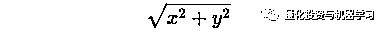
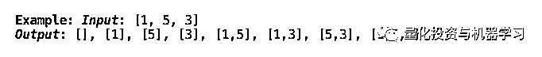
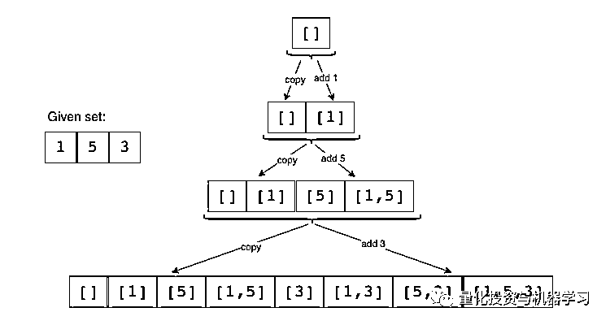
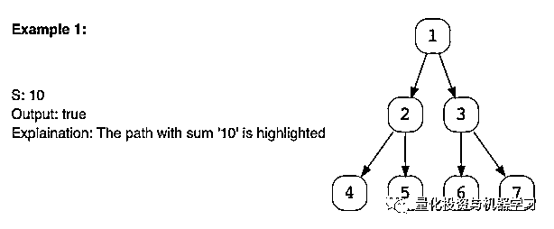

# 终极一战：为了编程面试！

> 原文：[`mp.weixin.qq.com/s?__biz=MzAxNTc0Mjg0Mg==&mid=2653294755&idx=1&sn=12aa18137846c039c25bf0f152140afb&chksm=802dd2b6b75a5ba0bf0f8fecb4f3c748cd5e265c24f146eb1f8cc8fc47cbae475bdd9a8db359&scene=27#wechat_redirect`](http://mp.weixin.qq.com/s?__biz=MzAxNTc0Mjg0Mg==&mid=2653294755&idx=1&sn=12aa18137846c039c25bf0f152140afb&chksm=802dd2b6b75a5ba0bf0f8fecb4f3c748cd5e265c24f146eb1f8cc8fc47cbae475bdd9a8db359&scene=27#wechat_redirect)


**标星★公众号     **爱你们♥

作者：Arslan Ahmad

编译：1+1=6

**近期原创文章：**

## ♥ [5 种机器学习算法在预测股价的应用（代码+数据）](https://mp.weixin.qq.com/s?__biz=MzAxNTc0Mjg0Mg==&mid=2653290588&idx=1&sn=1d0409ad212ea8627e5d5cedf61953ac&chksm=802dc249b75a4b5fa245433320a4cc9da1a2cceb22df6fb1a28e5b94ff038319ae4e7ec6941f&token=1298662931&lang=zh_CN&scene=21#wechat_redirect)

## ♥ [Two Sigma 用新闻来预测股价走势，带你吊打 Kaggle](https://mp.weixin.qq.com/s?__biz=MzAxNTc0Mjg0Mg==&mid=2653290456&idx=1&sn=b8d2d8febc599742e43ea48e3c249323&chksm=802e3dcdb759b4db9279c689202101b6b154fb118a1c1be12b52e522e1a1d7944858dbd6637e&token=1330520237&lang=zh_CN&scene=21#wechat_redirect)

## ♥ 2 万字干货：[利用深度学习最新前沿预测股价走势](https://mp.weixin.qq.com/s?__biz=MzAxNTc0Mjg0Mg==&mid=2653290080&idx=1&sn=06c50cefe78a7b24c64c4fdb9739c7f3&chksm=802e3c75b759b563c01495d16a638a56ac7305fc324ee4917fd76c648f670b7f7276826bdaa8&token=770078636&lang=zh_CN&scene=21#wechat_redirect)

## ♥ [机器学习在量化金融领域的误用！](http://mp.weixin.qq.com/s?__biz=MzAxNTc0Mjg0Mg==&mid=2653292984&idx=1&sn=3e7efe9fe9452c4a5492d2175b4159ef&chksm=802dcbadb75a42bbdce895c49070c3f552dc8c983afce5eeac5d7c25974b7753e670a0162c89&scene=21#wechat_redirect)

## ♥ [基于 RNN 和 LSTM 的股市预测方法](https://mp.weixin.qq.com/s?__biz=MzAxNTc0Mjg0Mg==&mid=2653290481&idx=1&sn=f7360ea8554cc4f86fcc71315176b093&chksm=802e3de4b759b4f2235a0aeabb6e76b3e101ff09b9a2aa6fa67e6e824fc4274f68f4ae51af95&token=1865137106&lang=zh_CN&scene=21#wechat_redirect)

## ♥ [如何鉴别那些用深度学习预测股价的花哨模型？](https://mp.weixin.qq.com/s?__biz=MzAxNTc0Mjg0Mg==&mid=2653290132&idx=1&sn=cbf1e2a4526e6e9305a6110c17063f46&chksm=802e3c81b759b597d3dd94b8008e150c90087567904a29c0c4b58d7be220a9ece2008956d5db&token=1266110554&lang=zh_CN&scene=21#wechat_redirect)

## ♥ [优化强化学习 Q-learning 算法进行股市](https://mp.weixin.qq.com/s?__biz=MzAxNTc0Mjg0Mg==&mid=2653290286&idx=1&sn=882d39a18018733b93c8c8eac385b515&chksm=802e3d3bb759b42d1fc849f96bf02ae87edf2eab01b0beecd9340112c7fb06b95cb2246d2429&token=1330520237&lang=zh_CN&scene=21#wechat_redirect)

## ♥ [WorldQuant 101 Alpha、国泰君安 191 Alpha](https://mp.weixin.qq.com/s?__biz=MzAxNTc0Mjg0Mg==&mid=2653290927&idx=1&sn=ecca60811da74967f33a00329a1fe66a&chksm=802dc3bab75a4aac2bb4ccff7010063cc08ef51d0bf3d2f71621cdd6adece11f28133a242a15&token=48775331&lang=zh_CN&scene=21#wechat_redirect)

## ♥ [基于回声状态网络预测股票价格（附代码）](https://mp.weixin.qq.com/s?__biz=MzAxNTc0Mjg0Mg==&mid=2653291171&idx=1&sn=485a35e564b45046ff5a07c42bba1743&chksm=802dc0b6b75a49a07e5b91c512c8575104f777b39d0e1d71cf11881502209dc399fd6f641fb1&token=48775331&lang=zh_CN&scene=21#wechat_redirect)

## ♥ [计量经济学应用投资失败的 7 个原因](https://mp.weixin.qq.com/s?__biz=MzAxNTc0Mjg0Mg==&mid=2653292186&idx=1&sn=87501434ae16f29afffec19a6884ee8d&chksm=802dc48fb75a4d99e0172bf484cdbf6aee86e36a95037847fd9f070cbe7144b4617c2d1b0644&token=48775331&lang=zh_CN&scene=21#wechat_redirect)

## ♥ [配对交易千千万，强化学习最 NB！（文档+代码）](http://mp.weixin.qq.com/s?__biz=MzAxNTc0Mjg0Mg==&mid=2653292915&idx=1&sn=13f4ddebcd209b082697a75544852608&chksm=802dcb66b75a4270ceb19fac90eb2a70dc05f5b6daa295a7d31401aaa8697bbb53f5ff7c05af&scene=21#wechat_redirect)

## ♥ [关于高盛在 Github 开源背后的真相！](https://mp.weixin.qq.com/s?__biz=MzAxNTc0Mjg0Mg==&mid=2653291594&idx=1&sn=7703403c5c537061994396e7e49e7ce5&chksm=802dc65fb75a4f49019cec951ac25d30ec7783738e9640ec108be95335597361c427258f5d5f&token=48775331&lang=zh_CN&scene=21#wechat_redirect)

## ♥ [新一代量化带货王诞生！Oh My God！](https://mp.weixin.qq.com/s?__biz=MzAxNTc0Mjg0Mg==&mid=2653291789&idx=1&sn=e31778d1b9372bc7aa6e57b82a69ec6e&chksm=802dc718b75a4e0ea4c022e70ea53f51c48d102ebf7e54993261619c36f24f3f9a5b63437e9e&token=48775331&lang=zh_CN&scene=21#wechat_redirect)

## ♥ [独家！关于定量/交易求职分享（附真实试题）](https://mp.weixin.qq.com/s?__biz=MzAxNTc0Mjg0Mg==&mid=2653291844&idx=1&sn=3fd8b57d32a0ebd43b17fa68ae954471&chksm=802dc751b75a4e4755fcbb0aa228355cebbbb6d34b292aa25b4f3fbd51013fcf7b17b91ddb71&token=48775331&lang=zh_CN&scene=21#wechat_redirect)

## ♥ [Quant 们的身份危机！](https://mp.weixin.qq.com/s?__biz=MzAxNTc0Mjg0Mg==&mid=2653291856&idx=1&sn=729b657ede2cb50c96e92193ab16102d&chksm=802dc745b75a4e53c5018cc1385214233ec4657a3479cd7193c95aaf65642f5f45fa0e465694&token=48775331&lang=zh_CN&scene=21#wechat_redirect)

## ♥ [AQR 最新研究 | 机器能“学习”金融吗？](http://mp.weixin.qq.com/s?__biz=MzAxNTc0Mjg0Mg==&mid=2653292710&idx=1&sn=e5e852de00159a96d5dcc92f349f5b58&chksm=802dcab3b75a43a5492bc98874684081eb5c5666aff32a36a0cdc144d74de0200cc0d997894f&scene=21#wechat_redirect)

**前言**

**我是如何在一份全职工作中每天练习 12 个以上的编程问题的？**

**我不是在解决编程问题，而是练习把问题映射到我已经解决的问题上。**

过去常常读一个问题，然后花几分钟把它映射到我以前见过的类似问题上。如果我可以映射它，我将只关注这个问题与父问题相比有哪些不同约束。如果这是一个新问题，那么我会尝试解决它。随着时间的推移，我开发了一组问题模式，这些模式帮助我快速地将问题映射到一个已知的问题。

今天，公众号带领大家掌握这种思路和方法，会让你更加得心应手，游刃有余！

**二分法检索样本问题**

**二分法检索（binary search）**又称折半检索，二分法检索的基本思想是设字典中的元素从小到大有序地存放在数组（array）中。

**▍问题陈述：**

**查找给定 Bitonic 数组中的最大值**。如果数组是单调递增然后单调递减的，则认为它是双调的。单调递增或递减意味着对于数组中的任何索引 i，arr[i] != arr[i+1]。


**▍解决方法：**

Bitonic 数组是一个排序数组，唯一的区别是它的第一部分按升序排序，第二部分按降序排序。我们可以用二分法检索的变体来解决这个问题。记住，在二分法检索中，我们有 start，end 和 middle，在每个步骤中，我们通过移动 start 或 end 来减少搜索空间。由于没有两个连续的数字是相同的（因为数组是单调递增或递减的），所以当我们计算二分法检索的 middle 索引时，我们可以将索引 middle 和 middle+1 所指出的数字进行比较，以确定我们是在升序还是降序部分。所以：

1、如果 arr[middle] > arr[middle + 1]，处于 bitonic 数组的第二（降序）部分。因此，我们需要的数字可以在 middle 指出，也可以在 middle 之前指出。这意味着我们要做 end = middle。

2、如果 arr[middle] <= arr[middle + 1]，处于 bitonic 数组的第一个（升序）部分。因此，所需的数字将在 middle 之后。这意味着 start = middle + 1。

我们可以在 start == end 时中断。由于上述两点，start 和 end 都指向 bitonic 数组的最大个数。

下面是解决这个问题的 Java 代码：

```py
class MaxInBitonicArray {

  public static int findMax(int[] arr) {
    int start = 0, end = arr.length - 1;
    while (start < end) {
      int mid = start + (end - start) / 2;
      if (arr[mid] > arr[mid + 1]) {
        end = mid;
      } else {
        start = mid + 1;
      }
    }

    // at the end of the while loop, 'start == end'
    return arr[start];
  }

  public static void main(String[] args) {
    System.out.println(MaxInBitonicArray.findMax(new int[] { 1, 3, 8, 12, 4, 2 }));
    System.out.println(MaxInBitonicArray.findMax(new int[] { 3, 8, 3, 1 }));
    System.out.println(MaxInBitonicArray.findMax(new int[] { 1, 3, 8, 12 }));
    System.out.println(MaxInBitonicArray.findMax(new int[] { 10, 9, 8 }));
  }
}
```

**双指针（Two Pointers）问题**

**▍问题陈述：**

给定一个有序数组和一个目标值，在数组中找到一对和等于给定目标的数组。编写一个函数来返回这两个数字的索引，使它们加起来等于给定的目标值。



**▍解决方法：**

由于给定的数组已经排序，一个蛮力解决方案可能是遍历数组，每次取一个数字，然后通过二分法检索查找第二个数字。**该算法的时间复杂度为 O(N*logN)，**我们能做得更好吗?

我们可以遵循双指针（Two Pointers）的方法。从一个指向数组开头的指针和另一个指向数组末尾的指针开始。在每一步中，我们都将看到两个指针所指向的数字加起来是否等于目标和。如果他们找到了，那我们也就得到了这个数。否则，我们将做两件事之的一件：

1、如果两个指针所指向的两个数的和大于目标和，那么我们需要一对和小的数。所以，为了尝试更多的对，我们可以减少末端指针。

2、如果两个指针所指向的两个数字的和小于目标和，这意味着我们需要一个和更大的对。所以，为了尝试更多对，我们可以增加开始指针。

下图是对这个算法的可视化：



代码如下：

```py
class PairWithTargetSum {

  public static int[] search(int[] arr, int targetSum) {
    int left = 0, right = arr.length - 1;
    while (left < right) {
      // comparing the sum of two numbers to the 'targetSum' can cause integer overflow
      // so, we will try to find a target difference instead
      int targetDiff = targetSum - arr[left];
      if (targetDiff == arr[right])
        return new int[] { left, right }; // found the pair

      if (targetDiff > arr[right])
        left++; // we need a pair with a bigger sum
      else
        right--; // we need a pair with a smaller sum
    }
    return new int[] { -1, -1 };
  }

  public static void main(String[] args) {
    int[] result = PairWithTargetSum.search(new int[] { 1, 2, 3, 4, 6 }, 6);
    System.out.println("Pair with target sum: [" + result[0] + ", " + result[1] + "]");
    result = PairWithTargetSum.search(new int[] { 2, 5, 9, 11 }, 11);
    System.out.println("Pair with target sum: [" + result[0] + ", " + result[1] + "]");
  }
}
```

**样本问题**

# **▍问题陈述：**

# 给定一个二维平面上的点数组，找出离原点最近的 K 点。


**▍解决方法：**

点 P(x,y) 到原点的欧氏距离可由下式计算：



我们可以使用最大堆（Max Heap）来找到离原点最近的 K 点。我们可以从堆中的 K 点开始。在遍历其余点时，如果一个点（比如 P）比 Max Heap 的顶点更接近原点，那么我们将从堆中删除顶点，并添加 P，始终保持堆中最近的点。

代码如下：

```py
import java.util.*;

class Point {
  int x;
  int y;

  public Point(int x, int y) {
    this.x = x;
    this.y = y;
  }

  public int distFromOrigin() {
    // ignoring sqrt
    return (x * x) + (y * y);
  }
}

class KClosestPointsToOrigin {

  public static List<Point> findClosestPoints(Point[] points, int k) {
    PriorityQueue<Point> maxHeap = new PriorityQueue<>(
              (p1, p2) -> p2.distFromOrigin() - p1.distFromOrigin());
    // put first 'k' points in the max heap
    for (int i = 0; i < k; i++)
      maxHeap.add(points[i]);

    // go through the remaining points of the input array, if a point is closer to
    // the origin than the top point of the max-heap, remove the top point from
    // heap and add the point from the input array
    for (int i = k; i < points.length; i++) {
      if (points[i].distFromOrigin() < maxHeap.peek().distFromOrigin()) {
        maxHeap.poll();
        maxHeap.add(points[i]);
      }
    }

    // the heap has 'k' points closest to the origin, return them in a list
    return new ArrayList<>(maxHeap);
  }

  public static void main(String[] args) {
    Point[] points = new Point[] { new Point(1, 3), new Point(3, 4), new Point(2, -1) };
    List<Point> result = KClosestPointsToOrigin.findClosestPoints(points, 2);
    System.out.print("Here are the k points closest the origin: ");
    for (Point p : result)
      System.out.print("[" + p.x + " , " + p.y + "] ");
  }
}
```

# **▍问题陈述：**

给定一个具有不同元素的集合，找到它所有不同的子集。



要生成给定集合的所有子集，可以使用**广度优先搜索（Breadth-First Search ）**方法。我们可以从一个空集开始，逐一遍历所有数字，然后将它们添加到现有集中，创建新的子集。

**广度优先搜索（BFS）**类似于二叉树的层序遍历算法，它的基本思想是：首先访问起始顶点 v，然后由 v 出发，依次访问 v 的各个未被访问过的邻接顶点 w1,w2,w3….wn，然后再依次访问 w1，w2,…,wi 的所有未被访问过的邻接顶点，再从这些访问过的顶点出发，再访问它们所有未被访问过的邻接顶点….以此类推，直到途中所有的顶点都被访问过为止。

**▍解决方法：**

让我们用上面的例子来看看算法的每个步骤：

给定集合：[1,5,3]

1、从空集开始：[[]]；

2、将第一个数字(1)添加到所有现有子集，以创建新的子集：[[]，[1]]；

3、将第二个数字(5)添加到所有现有子集：[[]，[1]，[5]，[1,5]]；

4、将第三个数(3)添加到所有现有的子集：[[], [1], [5], [1,5], [3], [1,3], [5,3], [1,5,3]]。

以下是上述步骤的可视化表示：



代码如下：

```py
import java.util.*;

class Subsets {

  public static List<List<Integer>> findSubsets(int[] nums) {
    List<List<Integer>> subsets = new ArrayList<>();
    // start by adding the empty subset
    subsets.add(new ArrayList<>());
    for (int currentNumber : nums) {
      // we will take all existing subsets and insert the current number in them to
      // create new subsets
      int n = subsets.size();
      for (int i = 0; i < n; i++) {
        // create a new subset from the existing subset and
        // insert the current element to it
        List<Integer> set = new ArrayList<>(subsets.get(i));
        set.add(currentNumber);
        subsets.add(set);
      }
    }
    return subsets;
  }

  public static void main(String[] args) {
    List<List<Integer>> result = Subsets.findSubsets(new int[] { 1, 3 });
    System.out.println("Here is the list of subsets: " + result);

    result = Subsets.findSubsets(new int[] { 1, 5, 3 });
    System.out.println("Here is the list of subsets: " + result);
  }
}
```

# **▍问题陈述：**

给定一个二叉树和一个数字 s，找出该树是否有一个从根到叶的路径，使得该路径的所有节点值之和等于 s。



当我们试图搜索根到叶的路径时，我们可以使用**深度优先搜索（Depth First Search ）**技术来解决这个问题。

要以 DFS 的方式递归遍历二叉树，我们可以从根开始，在每个步骤中执行两个递归调用，一个用于左边，一个用于右边。

以下是解决二叉树路径和问题的步骤：

1、从树的根开始 DFS。

2、如果当前节点不是叶节点，做两件事：

*   a. 从给定的数字中减去当前节点的值，得到一个新的 S = S - node.value。

*   b. 对当前节点的两个子节点进行两次递归调用，使用上一步计算的新编号。

3、在每一步中，查看当前被访问的节点是否为叶节点，以及它的值是否等于给定数字    S。

4、如果当前节点是一个叶节点，但它的值不等于给定的数字 S，则返回 false。

代码如下：

```py
class TreeNode {
  int val;
  TreeNode left;
  TreeNode right;

  TreeNode(int x) {
    val = x;
  }
};

class TreePathSum {
  public static boolean hasPath(TreeNode root, int sum) {
    if (root == null)
      return false;

    // if current node is a leaf and its value is equal to the sum, we've found a path
    if (root.val == sum && root.left == null && root.right == null)
      return true;

    // recursively call to traverse the left and right sub-tree
    // return true if any of the two recursive call return true
    return hasPath(root.left, sum - root.val) || hasPath(root.right, sum - root.val);
  }

  public static void main(String[] args) {
    TreeNode root = new TreeNode(12);
    root.left = new TreeNode(7);
    root.right = new TreeNode(1);
    root.left.left = new TreeNode(9);
    root.right.left = new TreeNode(10);
    root.right.right = new TreeNode(5);
    System.out.println("Tree has path: " + TreePathSum.hasPath(root, 23));
    System.out.println("Tree has path: " + TreePathSum.hasPath(root, 16));
  }
}
```

遵循这些模式可以极大地帮助我节省编码面试准备的时间！

*—End—*

量化投资与机器学习微信公众号，是业内垂直于**Quant**、**MFE**、**CST、AI**等专业的**主****流量化自媒体**。公众号拥有来自**公募、私募、券商、银行、海外**等众多圈内**18W+**关注者。每日发布行业前沿研究成果和最新量化资讯。

你点的每个“在看”，都是对我们最大的鼓励