# 二百、秒=1 万年，量子计算：对冲基金的未来！

> 原文：[`mp.weixin.qq.com/s?__biz=MzAxNTc0Mjg0Mg==&mid=2653294695&idx=1&sn=e672b260ca9dd6765def67b368c83023&chksm=802dd272b75a5b6438b1244c06db8fe79c38516eb7e8fe4e2c7522759b63da6d3439c3d3933c&scene=27#wechat_redirect`](http://mp.weixin.qq.com/s?__biz=MzAxNTc0Mjg0Mg==&mid=2653294695&idx=1&sn=e672b260ca9dd6765def67b368c83023&chksm=802dd272b75a5b6438b1244c06db8fe79c38516eb7e8fe4e2c7522759b63da6d3439c3d3933c&scene=27#wechat_redirect)

**标星★公众号     **爱你们♥

**近期原创文章：**

## ♥ [5 种机器学习算法在预测股价的应用（代码+数据）](https://mp.weixin.qq.com/s?__biz=MzAxNTc0Mjg0Mg==&mid=2653290588&idx=1&sn=1d0409ad212ea8627e5d5cedf61953ac&chksm=802dc249b75a4b5fa245433320a4cc9da1a2cceb22df6fb1a28e5b94ff038319ae4e7ec6941f&token=1298662931&lang=zh_CN&scene=21#wechat_redirect)

## ♥ [Two Sigma 用新闻来预测股价走势，带你吊打 Kaggle](https://mp.weixin.qq.com/s?__biz=MzAxNTc0Mjg0Mg==&mid=2653290456&idx=1&sn=b8d2d8febc599742e43ea48e3c249323&chksm=802e3dcdb759b4db9279c689202101b6b154fb118a1c1be12b52e522e1a1d7944858dbd6637e&token=1330520237&lang=zh_CN&scene=21#wechat_redirect)

## ♥ 2 万字干货：[利用深度学习最新前沿预测股价走势](https://mp.weixin.qq.com/s?__biz=MzAxNTc0Mjg0Mg==&mid=2653290080&idx=1&sn=06c50cefe78a7b24c64c4fdb9739c7f3&chksm=802e3c75b759b563c01495d16a638a56ac7305fc324ee4917fd76c648f670b7f7276826bdaa8&token=770078636&lang=zh_CN&scene=21#wechat_redirect)

## ♥ [机器学习在量化金融领域的误用！](http://mp.weixin.qq.com/s?__biz=MzAxNTc0Mjg0Mg==&mid=2653292984&idx=1&sn=3e7efe9fe9452c4a5492d2175b4159ef&chksm=802dcbadb75a42bbdce895c49070c3f552dc8c983afce5eeac5d7c25974b7753e670a0162c89&scene=21#wechat_redirect)

## ♥ [基于 RNN 和 LSTM 的股市预测方法](https://mp.weixin.qq.com/s?__biz=MzAxNTc0Mjg0Mg==&mid=2653290481&idx=1&sn=f7360ea8554cc4f86fcc71315176b093&chksm=802e3de4b759b4f2235a0aeabb6e76b3e101ff09b9a2aa6fa67e6e824fc4274f68f4ae51af95&token=1865137106&lang=zh_CN&scene=21#wechat_redirect)

## ♥ [如何鉴别那些用深度学习预测股价的花哨模型？](https://mp.weixin.qq.com/s?__biz=MzAxNTc0Mjg0Mg==&mid=2653290132&idx=1&sn=cbf1e2a4526e6e9305a6110c17063f46&chksm=802e3c81b759b597d3dd94b8008e150c90087567904a29c0c4b58d7be220a9ece2008956d5db&token=1266110554&lang=zh_CN&scene=21#wechat_redirect)

## ♥ [优化强化学习 Q-learning 算法进行股市](https://mp.weixin.qq.com/s?__biz=MzAxNTc0Mjg0Mg==&mid=2653290286&idx=1&sn=882d39a18018733b93c8c8eac385b515&chksm=802e3d3bb759b42d1fc849f96bf02ae87edf2eab01b0beecd9340112c7fb06b95cb2246d2429&token=1330520237&lang=zh_CN&scene=21#wechat_redirect)

## ♥ [WorldQuant 101 Alpha、国泰君安 191 Alpha](https://mp.weixin.qq.com/s?__biz=MzAxNTc0Mjg0Mg==&mid=2653290927&idx=1&sn=ecca60811da74967f33a00329a1fe66a&chksm=802dc3bab75a4aac2bb4ccff7010063cc08ef51d0bf3d2f71621cdd6adece11f28133a242a15&token=48775331&lang=zh_CN&scene=21#wechat_redirect)

## ♥ [基于回声状态网络预测股票价格（附代码）](https://mp.weixin.qq.com/s?__biz=MzAxNTc0Mjg0Mg==&mid=2653291171&idx=1&sn=485a35e564b45046ff5a07c42bba1743&chksm=802dc0b6b75a49a07e5b91c512c8575104f777b39d0e1d71cf11881502209dc399fd6f641fb1&token=48775331&lang=zh_CN&scene=21#wechat_redirect)

## ♥ [计量经济学应用投资失败的 7 个原因](https://mp.weixin.qq.com/s?__biz=MzAxNTc0Mjg0Mg==&mid=2653292186&idx=1&sn=87501434ae16f29afffec19a6884ee8d&chksm=802dc48fb75a4d99e0172bf484cdbf6aee86e36a95037847fd9f070cbe7144b4617c2d1b0644&token=48775331&lang=zh_CN&scene=21#wechat_redirect)

## ♥ [配对交易千千万，强化学习最 NB！（文档+代码）](http://mp.weixin.qq.com/s?__biz=MzAxNTc0Mjg0Mg==&mid=2653292915&idx=1&sn=13f4ddebcd209b082697a75544852608&chksm=802dcb66b75a4270ceb19fac90eb2a70dc05f5b6daa295a7d31401aaa8697bbb53f5ff7c05af&scene=21#wechat_redirect)

## ♥ [关于高盛在 Github 开源背后的真相！](https://mp.weixin.qq.com/s?__biz=MzAxNTc0Mjg0Mg==&mid=2653291594&idx=1&sn=7703403c5c537061994396e7e49e7ce5&chksm=802dc65fb75a4f49019cec951ac25d30ec7783738e9640ec108be95335597361c427258f5d5f&token=48775331&lang=zh_CN&scene=21#wechat_redirect)

## ♥ [新一代量化带货王诞生！Oh My God！](https://mp.weixin.qq.com/s?__biz=MzAxNTc0Mjg0Mg==&mid=2653291789&idx=1&sn=e31778d1b9372bc7aa6e57b82a69ec6e&chksm=802dc718b75a4e0ea4c022e70ea53f51c48d102ebf7e54993261619c36f24f3f9a5b63437e9e&token=48775331&lang=zh_CN&scene=21#wechat_redirect)

## ♥ [独家！关于定量/交易求职分享（附真实试题）](https://mp.weixin.qq.com/s?__biz=MzAxNTc0Mjg0Mg==&mid=2653291844&idx=1&sn=3fd8b57d32a0ebd43b17fa68ae954471&chksm=802dc751b75a4e4755fcbb0aa228355cebbbb6d34b292aa25b4f3fbd51013fcf7b17b91ddb71&token=48775331&lang=zh_CN&scene=21#wechat_redirect)

## ♥ [Quant 们的身份危机！](https://mp.weixin.qq.com/s?__biz=MzAxNTc0Mjg0Mg==&mid=2653291856&idx=1&sn=729b657ede2cb50c96e92193ab16102d&chksm=802dc745b75a4e53c5018cc1385214233ec4657a3479cd7193c95aaf65642f5f45fa0e465694&token=48775331&lang=zh_CN&scene=21#wechat_redirect)

## ♥ [AQR 最新研究 | 机器能“学习”金融吗？](http://mp.weixin.qq.com/s?__biz=MzAxNTc0Mjg0Mg==&mid=2653292710&idx=1&sn=e5e852de00159a96d5dcc92f349f5b58&chksm=802dcab3b75a43a5492bc98874684081eb5c5666aff32a36a0cdc144d74de0200cc0d997894f&scene=21#wechat_redirect)

量化投资与机器学习编辑部独家报道

昨天被《金融时报》的一则报道刷遍了朋友圈：谷歌声称已经打造出第一台能够超越当今最强大的超级计算机能力的量子计算机，**他们的处理器能够在 3 分 20 秒内执行一个计算，而假如用当今最强大的超级计算机 Summit 进行同样的计算，需要约 10000 年**。

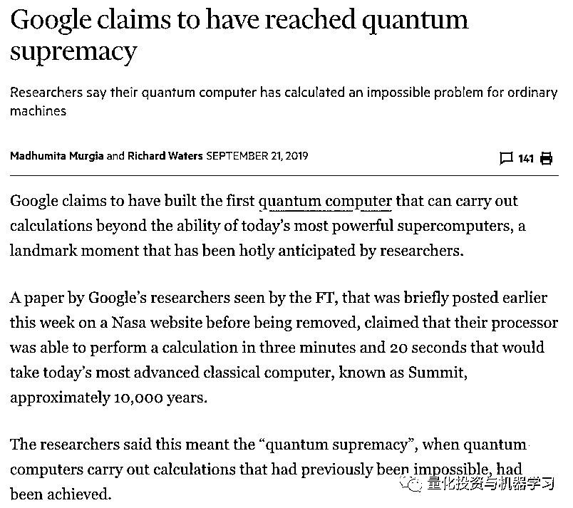

这意味着量子计算机实现了**“量子霸权”(quantum supremacy，亦称量子优势)**，即以前不可能实现的计算。(根据维基百科的释义，量子霸权是量子计算设备解决经典计算机实际上无法解决的问题的潜在能力)
为什么量子计算如此吸引人们，我们总结出以下几点：

*   今天的计算机以线性顺序处理数据，其中的数据被编码成 1 或 0 的二进制位。但是量子位，可以同时表示 1 和 0。

*   量子位元可以同时以两种状态存在，使得可以**同时处理多个计算**。这大致相当于一次读完图书馆里的每本书，而不是一次读完一本书。

*   从理论上讲，一台超级计算机需要几天甚至几周才能完成的计算任务可以用量子计算机**在几秒钟内解决**。

*   **量子计算可以执行看似不可能的计算**，并在眨眼间提供数千种选择。

*   量子计算机有可以解决目前被认为过于复杂和指数性的问题，而常规系统无法处理这些问题。

虽然，**NASA 没过多久便下架了这篇论文**，从摘要还是可以看出一些内容：

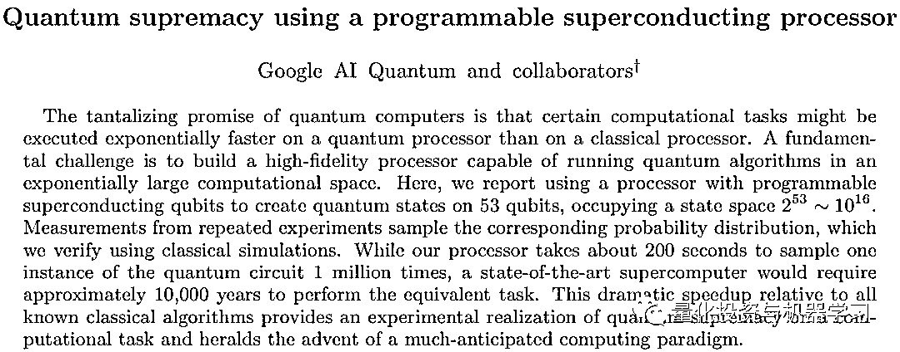

知乎**@少司命**有一段解读：**下面是文章最重要的部分，google 在多项式时间内实现了对一个随机量子电路的采样，而在已知的经典计算机上需要的时间则非常非常之久，像文中实现的最极端的例子是，对一个 53 比特 20 个 cycle 的电路采样一百万次，在量子计算机上需要 200 秒，而用目前人类最强的经典的超级计算机同样情况下则需要一万年。****亦即在这个问题上，量子实现了对经典的超越。**

论文中的图表：

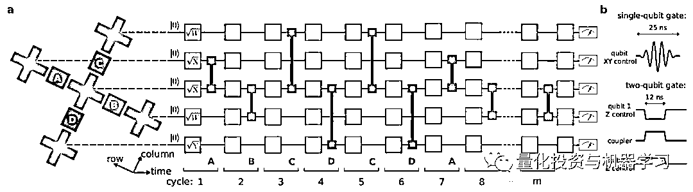quantum supremacy 电路的控制操作

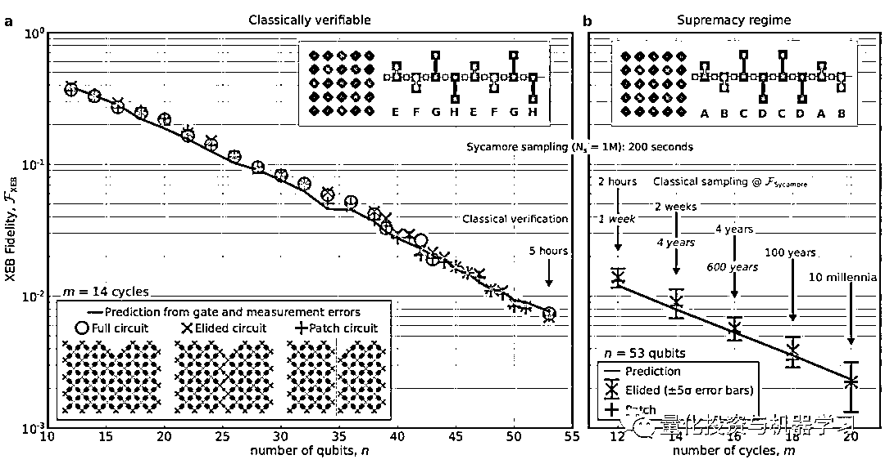

左边图 a 是经典计算机可以模拟的区域，右边图 b 则是量子有优势的区域。红色数据点为最复杂的电路，绿蓝代表两种稍作简化后的电路。

我们来看一个很生动形象关于量子计算的小动画：

[`mp.weixin.qq.com/mp/readtemplate?t=pages/video_player_tmpl&action=mpvideo&auto=0&vid=wxv_1000524028483960832`](https://mp.weixin.qq.com/mp/readtemplate?t=pages/video_player_tmpl&action=mpvideo&auto=0&vid=wxv_1000524028483960832)

OK，先不管消息是否属实，对于量化投资与机器学习公众号的小伙伴们，我们关心的是：**量子计算的研究和发展是否对我们的投资有所帮助？**答案：**有！**下面，让我们为大家来介绍一下**量子计算在对冲基金中的最新进展与应用**。****量子计算在**对冲基金行业的进展**

**我们的很多交易都是由算法执行的。使用量子计算方法将成倍地提高这些交易的速度，**使机构能够以更低的成本扩大处理规模，而不是雇佣更多的人力或 IT 资源。****

**为什么量子计算能让这种思想成为可能？**

**因为**在量子计算中，数据是用量子位表示的，而不是传统的二进制单位(0 和 1)**。随着量子位数目的增加，对于 n 个量子位而言，量子信息可以处于 2 种可能状态的叠加，配合量子力学演化的并行性，可以展现比传统计算机更快的处理速度。** 

****量子位（qubit）**是量子计算的理论基石。在常规计算机中，信息单元用二进制的 1 个位来表示，它不是处于“ 0” 态就是处于“ 1” 态. 在二进制量子计算机中，信息单元称为量子位，它除了处于“ 0” 态或“ 1” 态外，还可处于叠加态（superposed state）。**

**根据前 AQR 机器学习主管**Marcos Lopez de Prado**博士表示：**

**▍*“随着时间的推移，量子计算将变得越来越重要”，“在 20 年内，量子计算将不仅仅是一种选择。**从能源角度来看，这可能是我们唯一的选择，更不用说从计算角度来看了”。***

**▍*“量子计算将解决金融公司未来对增加计算能力的需求，同时比传统计算机消耗更少的能源”。***

**IBM Q 战略和生态系统副总裁**Bob Sutor**博士表示：**

**▍*“最先进的组织正在研究如何早期开发专有的混合经典量子算法来提供竞争优势”。***

**Morgan Stanley 前市场模型主管、现任纽约大学金融与风险工程系主任**Peter Carr**表示：**

**▍*“量子计算尚处于初级阶段，但概念证明已经存在。**有些计算可能会变得非常复杂，你需要蛮力来解决它们。** 当这一切成为现实时，我们可以解决各种各样的问题”。***

**但是，头部量化对冲基金公司和部分投行已经很早就开始布局这个事情。因为量子计算的多态量子比特可以解决一些金融领域最棘手的问题。早在 2 年前，包括**Renaissance**、**D.E.Shaw**和**Two Sigma**等一些头部量化对冲基金就已经对量子计算寄予了厚望，并预计**量子计算将帮助它们发现并利用市场中目前看不见的模式**。**

**D-wave 首席执行官**Vern Brownell**表示: **

**▍*“不管你组装多少台电脑，你都不会得到这种能力，这是在金融行业中一个新的领域”。***

**同时，D.E.Shaw 还投资了量子计算软件初创公司 QCWare。2018 年 7 月，在花旗和高盛牵头的一轮融资中，CQWare 又筹集了 650 万美元。**

**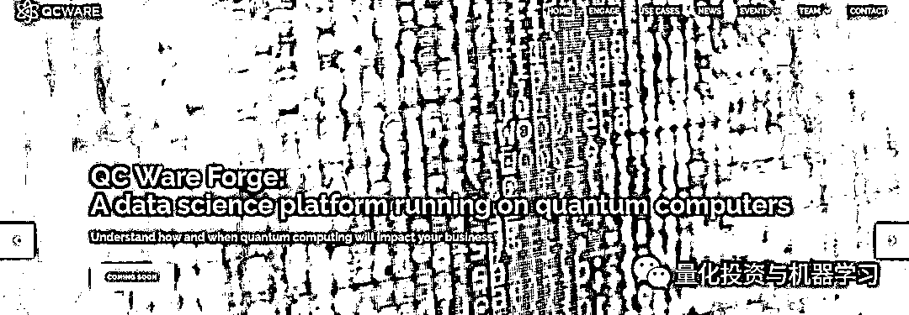**

**D.E.Shaw 董事总经理**Alex Wong**说:**

**▍*“我们一直在探索量子计算，因为我们对新的计算范式感兴趣。* *我们对任何有潜力的超越现有方法的技术都感兴趣，特别是如果它能在速度和可靠性上超过传统计算”。***

**当然，也有人对此持怀疑态度，一位对冲基金技术专家表示: “我们已经非常擅长用传统计算机做一些非常了不起的事情，这在 10 年前是我们梦都想不到的”。“更快并不总是更好。仅仅因为因为速度更快？它变得更容易理解吗？”**

****量子计算在对冲基金行业的应用****

****01****

****应用一****

**将量子计算和金融服务结合在一起的最有趣的网站：**Quantum for Quants**** 

**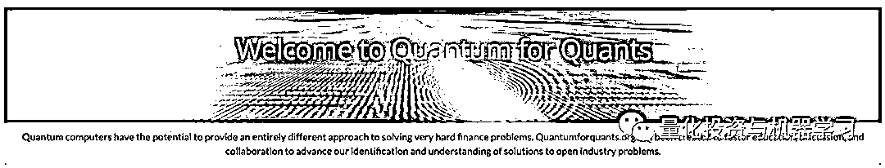**

**http://www.quantumforquants.org/blog/**

**里面有很多基于量子计算和金融结合的博客与论文：**

**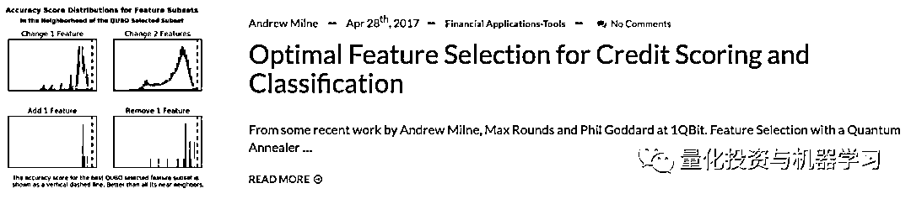**

**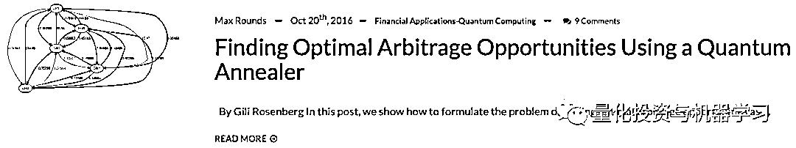**

**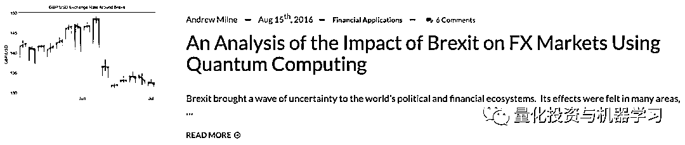**

****02****

****应用二****

**在今年早些时候，由 Roman Orus、Samuel Mugel、Enrique Lizaso 发表名为**《Quantum computing for finance: overview and prospects》**的论文对量子计算解金融领域问题做了很多说明。**

****

**该论文并揭示了量子退火如何用于优化投资组合、寻找套利机会和执行信用评分。还讨论了金融领域中的深度学习，以及通过量子机器学习改进这些方法的建议。最后，该论文还讨论了量子计算如何使蒙特卡罗采样的量子加速。这直接应用于许多当前的金融方法，包括衍生产品的定价和风险分析。**

**我们进行了总结，分析给大家：**

****a. 量子优化****

**最优化问题是许多金融问题的核心。例如，在**投资组合优化**中，我们最主要的问题在于选择最佳的投资资产，以平衡风险和预期收益。这是一个 NP-hard（non-deterministic polynomial）问题，这意味着对经典计算机来说，要有效地解决它是极其困难的。另一方面，**量子退火（Quantum Annealing）**为这类问题提供了更好的解决方案。**

****量子退火（Quantum Annealing）**是用于通过使用量子波动的过程在给定的一组候选解（候选状态）上找到给定目标函数的全局最小值的元启发式。量子退火主要用于搜索空间是离散的（组合优化问题）与许多局部最小值的问题。**

**用简而易懂的话来说，假设我们需要计算一枚炮弹的轨迹求出能否命中目标，我们有两种办法：**

 **一种是写出各种方程，考虑推力阻力引力自转等等，然后求解方程，得到运动轨迹。这就是现在用计算机做的事情。**

 **另一种奇妙的方法是，我造一个 1 比 1000 的微缩模型，控制好模型里的推力风速等等，砰的一声打一个迷你炮弹出去，直接用尺子量出落点。这就叫做“让大自然自然演化，给我们计算结果”。量子退火，就是类似第二种的方法。**

********a.**1 量子退火**具体应用场景：****

**********a.**1.1 ****最佳交易路线****

 执行大额交易指令会影响标的资产的价格，导致执行交易的投资者需付额外的执行成本。为了避免这种情况，并将交易成本降到最低，我们使用算法来控制大额订单的交易率，在快速交易和缓慢交易之间实现平衡，前者是为了将市场风险敞口降到最低，后者是为了将市场影响降到最低。该问题的离散多周期版本已经在 D-Wave 提供的商用量子退火器上得到了解决。在未来版本的 D-Wave 机器，会处理更大的问题实例，最终超越和取代传统方法。

********a.**1.2 ****最佳套利机会**

套利的概念是从同一资产在不同市场不同价格中赚取利润，同时不承担风险。例如，我们可以把欧元兑换成美元，美元兑换成日元，日元再兑换成欧元，在这个过程中我们还能赚取价差。这就是跨货币套利。虽然确定最优套利机会的问题是 NP-Hard 问题，但量子退火算法可以有效地检测到这些问题。具体地说，解决这个问题相当于在 directed graph 中找到成本最低的轨迹。这样我们在 D-Wave 2X 量子退火机上对小样本问题就可以进行求解，得到了与穷举经典解相同的最优解。

**b. 量子机器学习**

机器学习领域涉及到诸多算法的设计和实现，这些算法可以被训练来执行各种任务。包括模式识别、分类和其他许多方面。我们将训练称为优化算法参数以识别特定输入（训练数据）的过程。经过训练的算法可以用于评估新的输入。经典机器学习领域已经得到了极大的发展，主要得益于硬件和算法的发展。机器学习的基本原理是几个取得巨大成功的领域的基础，其中最突出的是神经网络。

虽然优化问题已经可以从第一代实验量子退火器中受益，但在技术进一步发展之前，某些量子机器学习（QML）算法的实现是不可能的。但是，以目前的实验进展速度，我们相信这将是迟早的事。

**b.1 量子主成分分析**

在**投资组合优化**中，对利率路径有一个全球视野是至关重要的。实现这一点的标准工具是主成分分析（PCA）方法。同样的工具也可以应用于资产选择和业绩预测，在这种情况下，了解什么样的特征是预测资产未来行为或相关利率的最佳方式是至关重要的。

在实际应用中，主成分分析法在数学上相当于在一个非常大的矩阵中寻找特征值和特征向量。正常情况下，这一成本是令人望而却步，而对于实际数据来说，可能存在数以百万计的股票，这一成本也是天文数字。

最近有研究表明，这种算法的一个版本：量**子 PCA 算法，可以在量子处理器上以指数速度运行**。具体地说，这种算法找到了一个相关矩阵主成分的近似值，其计算成本比传统计算机上成倍的降低。这一发展应极大地拓宽了主成分分析的适用范围，使我们能够在无法使用传统方法的情况下估计风险和最大利润。

****b.2 **神经网络及其相关模型**

虽然从已经训练过的机器学习算法进行预测是非常有效的，但训练本身可能在计算上会非常昂贵。通过使用量子退火器（D-Wave）对神经网络进行训练，可以显著减少这种开销。一旦经过训练，该算法可以在任何经典计算机上运行。比如：

*   D-Wave 量子计算机被用于概念验证，以训练一种特定类型的神经网络（玻尔兹曼机）

*   使用量子主成分分析法以指数方式加快训练过程，如前面所述。

另一种可能性是设计全新的、完全的量子神经网络算法，能够学习比传统神经网络更复杂的数据模式。**这在隐马尔可夫模型中尤其有用，这种模型通常用于金融预测（股价预测）。量子隐马尔可夫模型可以提供更好更快的预测。**

**c. 量子振幅估计与蒙特卡罗**

蒙特卡罗方法真正的亮点在于处理超大或复杂的系统，这些系统无法通过分析或其他方法处理。在金融领域，随机方法通常用于模拟影响金融对象的不确定性影响，这些金融对象可以是股票、投资组合或期权。这使得蒙特卡罗方法适用于投资组合评估、个人理财规划、风险评估和衍生品定价。

蒙特卡罗方法的问题是，如果我们想要获得一个基于广泛分布最有可能的结果，或者得到一个关联误差非常小的结果，所需的模拟次数可能会变得非常大。这是股票市场模拟的情况，可能是一整天的模拟。在这种情况下，获得量子加速可以产生显著的差异。

量子加速蒙特卡罗算法的一个重要组成部分是 Quantum Amplitude Estimation (QAE) 算法。QAE 可以比经典方法更快地对概率分布进行二次采样，从而非常有效地估计期望值。

**c.1 金融衍生品的定价**

金融衍生品合约的收益取决于某些资产的未来价格走势（可能具有随机性）。经纪商必须知道如何根据市场状况为衍生品定价。这就是**定价问题**。解决这个问题的经典方法是通过简化的场景，如布 lack-Scholes-Merton 模型和蒙特卡罗抽样。由于衍生品的数量越来越多，只有蒙特卡罗模拟是可行的，但计算成本高，执行时间长。我们提出的量子加速蒙特卡罗算法可以解决这一问题，提供二次加速。

**c.2 风险分析**

金融机构需要能够准确地管理和计算风险。数学上量化风险的一种方法是通过 VaR 方法(Value at Risk，简称 VaR），称为风险价值模型。在市场正常波动下，某一金融资产或证券组合的最大可能损失。更为确切的是指，**在一定概率水平（置信度）下，某一金融资产或证券组合价值在未来特定时期内的最大可能损失**。

另一个同样重要的是 CVaR(conditional value at risk) 条件风险价值。**CVaR 是指投资组合的损失大于某个给定的 VaR 值的条件下，该投资组合损失的平均值**。与 VaR 相比，CVaR 满足次可加性、正齐次性、单调性及传递不变性，因而 CVaR 是一种一致性的风险计量方法。另外。研究表明，CVaR 可以通过使用线性规划算法来进行优。

通常，在量化金融中，VaR 和 CVaR 是使用相关概率分布的蒙特卡洛抽样来估计的。通过 QAE 算法，可以快速获得精度较高的 VaR 和 CVaR 值。

**03**

**应用三**

渣打银行一直在密切关注这一学科技术可能给金融服务带来的进步；两年前，它与 USRA 开展一个联合项目。USRA 是一家总部位于马里兰州的非盈利研究公司。这个项目使用了位于加州 NASA 艾姆斯研究中心的量子计算硬件。

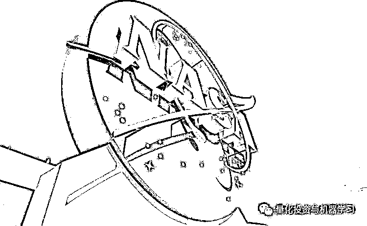

这项研究的负责人，也是 2019 的年度 Quant：Alexei Kondratyev。他在这项与 NASA 的合中，**把量子计算应用在一个包含 60 个资产的组合优化上，节省了一半的计算时间**。

为大家展示部门和投资组合相关的 PPT：

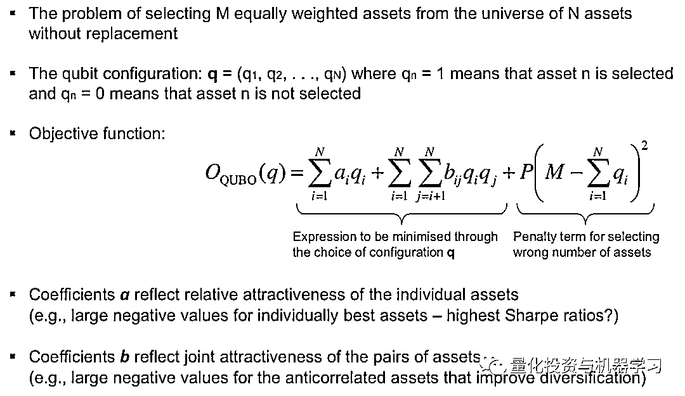

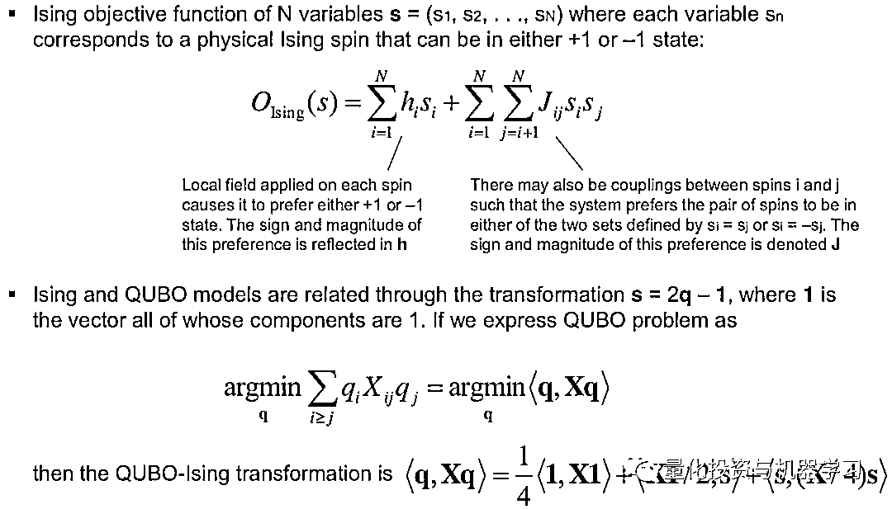

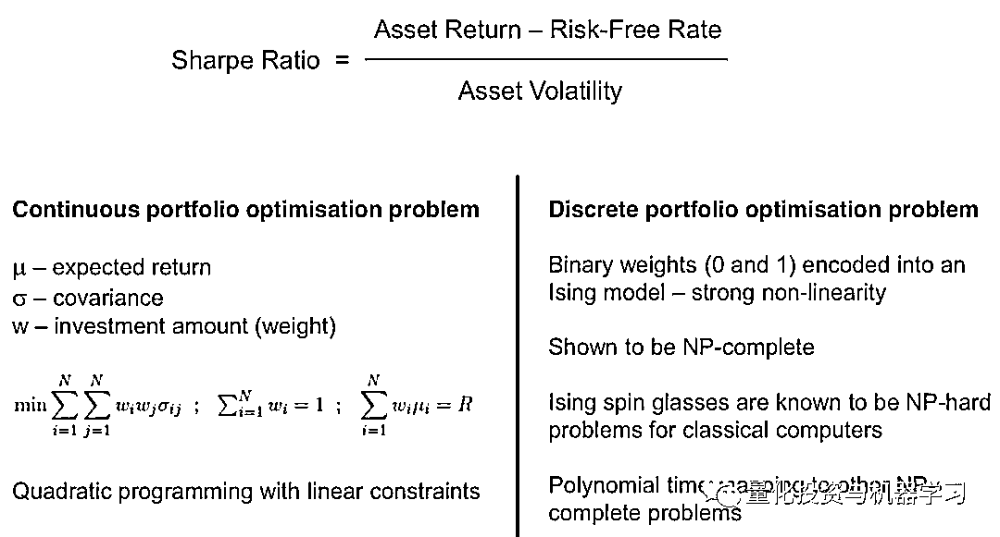

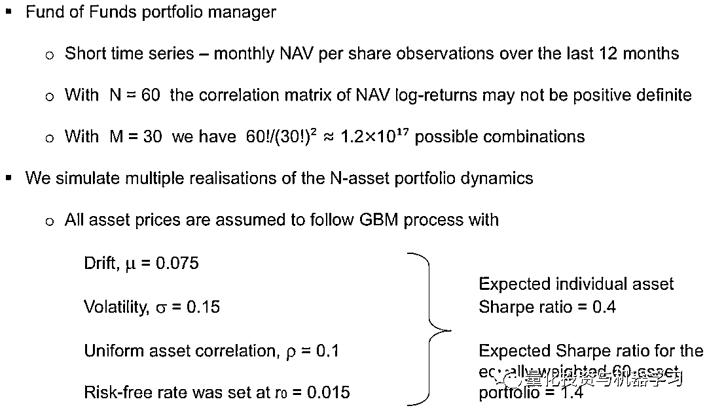

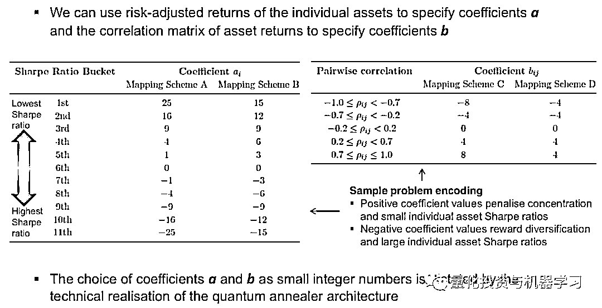

渣打银行在其第一个量子计算项目中使用了量子退火计算机，因为在该项目启动时，量子退火计算机比门模型（Gate Model）计算机要发达得多。Kondratyev 表示：

▍*“我们的目标是在门模型计算机上运行优化问题，这将是我们在量子计算领域的下一个重大项目，重点是构建投资组合优化中的最大风险”。*

**04**

**应用四**

IBM 研究所利用由数字门模型 Q 5-qubit 计算机驱动的量子算法，研究金融风险分析的方法，这些方法大大加快了传统计算算法的速度。例如，蒙特卡罗模拟被广泛用于金融服务中计算 VaR 和 cVaR 等指标。

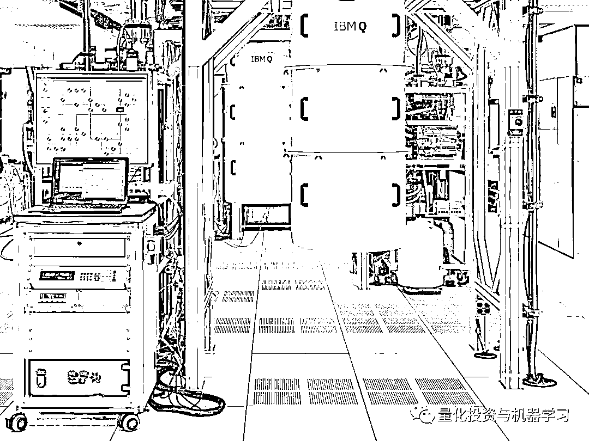

IBM 研究人员最近发现了如何在实际的量子计算机上进行简化风险计算

IBM 量子金融与优化领域的全球主管 Stefan Woerner 表示，他们团队的量子算法为涉及蒙特卡罗方法的解决方案提供了极大的速度提升：

▍*“使用蒙特卡罗模拟，大型投资组合的风险评估计算往往需要一整夜的时间。在最坏的情况下，计算时间可能会延长数天。量子计算提供的二次加速可以将计算时间从一夜缩短到接近实时，或者从几天缩短到几小时”。*

虽然可能需要几年的时间，硬件才能达到所需的速度与规模，但 Woerner 认为，这一发展的潜力将是巨大的。

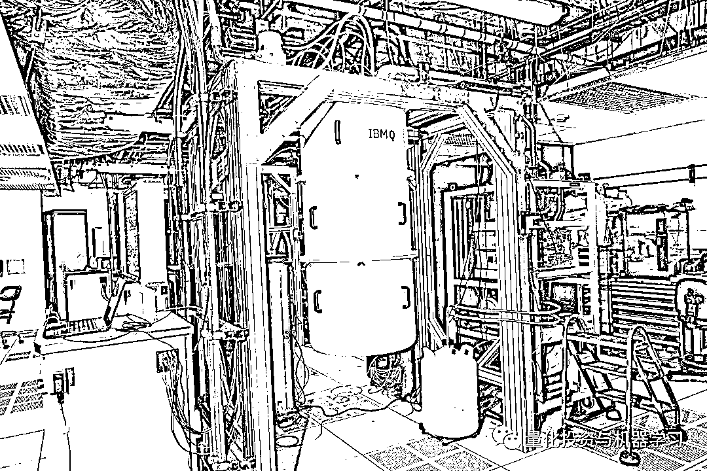

当冷却到工作温度时，整个装置隐藏在这个白色绝缘外壳中

BM Q 驻纽约战略与生态系统副总裁 BobSutor 同时表示：

▍*“尤其重要的是，我们正在与对冲基金界的量化分析师进行合作，帮助他们找到最容易实现的目标。我们需要这些人开始思考，在哪些领域存在将优化问题和风险分析映射到量子计算机的新方法”。*

该领域的专家表示：**量子技术可以用来不断对接近实时的期权进行重估，快速识别新的交易策略，大幅提高蒙特卡罗模拟和风险价值计算的速度，并使机器学习算法更加强大。**

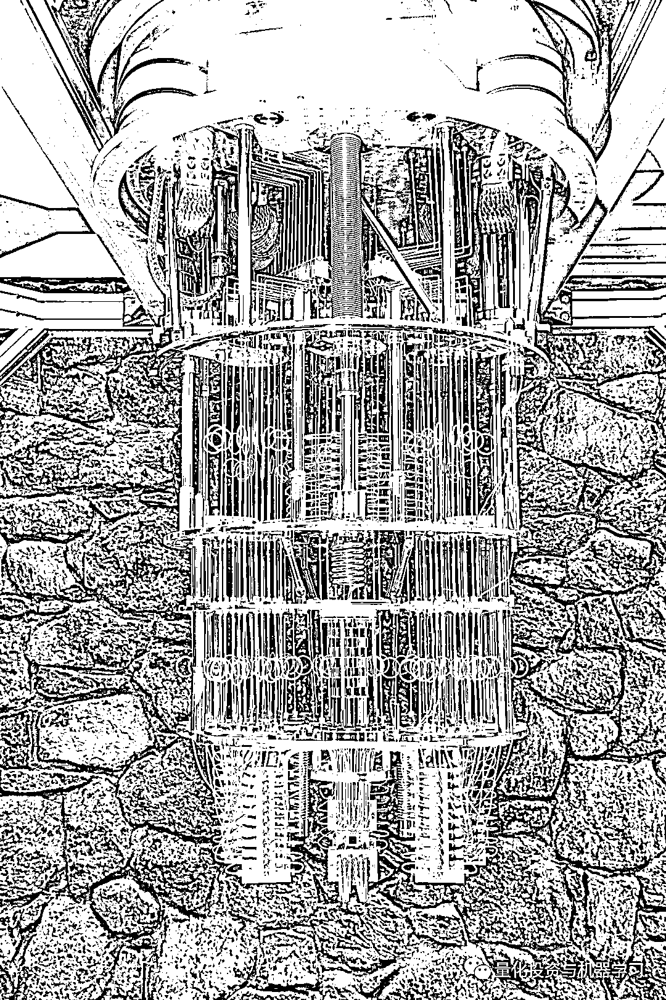

IBM 的一个量子计算芯片的冷却和支持结构

***If you’re trying to model an uncertain economic future, consider using a machine that runs on probability.***

在你阅读这句话的时间里，全世界的投行、对冲基金和投资者已经交易了大约 8000 万美元的股票。

根据世界银行数据显示，这相当于每天 2000 多亿美元。荷兰国家研究机构 Centrum Wiskunde & Informatica 的数学家 Cornelis Oosterlee 表示：“这是一大笔钱”。“一些单笔交易涉及的数字令人难以想象”。

研究人员使用 IBM 位于纽约 Yorktown Heights 的一台机器，研究人员演示了他们可以模拟期权的未来价值。

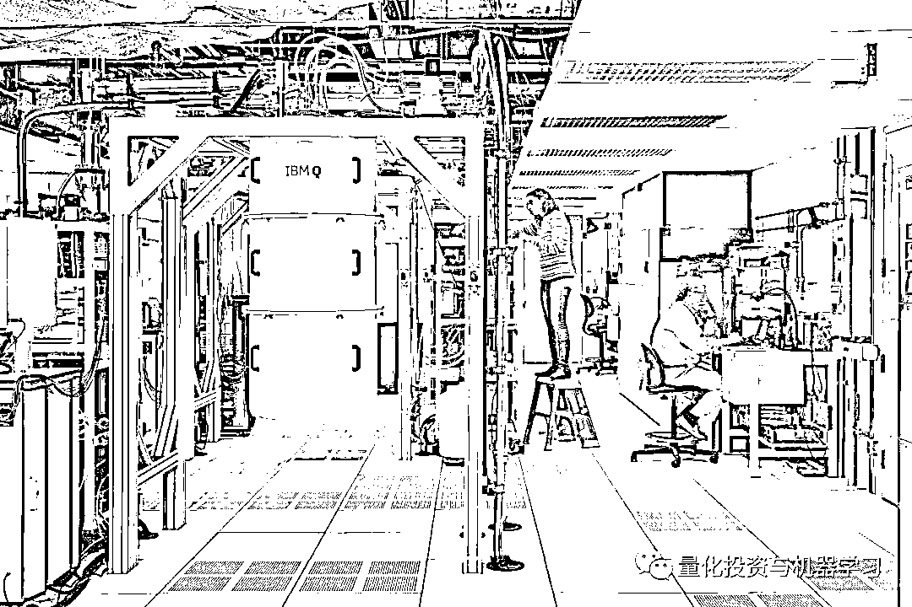

位于约克 Yorktown Heights 的 IBM Q Lab

目前，许多投行使用蒙特卡罗方法模型来模拟各种金融工具的价格。从本质上讲，蒙特卡罗方法将未来视为道路上的岔路口。一家公司可能会破产，也可能不会。特朗普总统可能会发动一场贸易战，也可能不会。一个分析师估计出这种情况的可能性，然后随机产生数百万种不同的未来。为了预测一项金融资产的价值，他们使用了数以百万计结果的加权平均数。

“现在他们正致力于通过使用更多的量子位来改进他们的算法”，Woerner 说道。他们可能会在这个过程中遇到硬件限制。目前最强大的量子计算机只有不到 200 个量子位，他预计要真正打败传统方法可能需要数千个量子位。

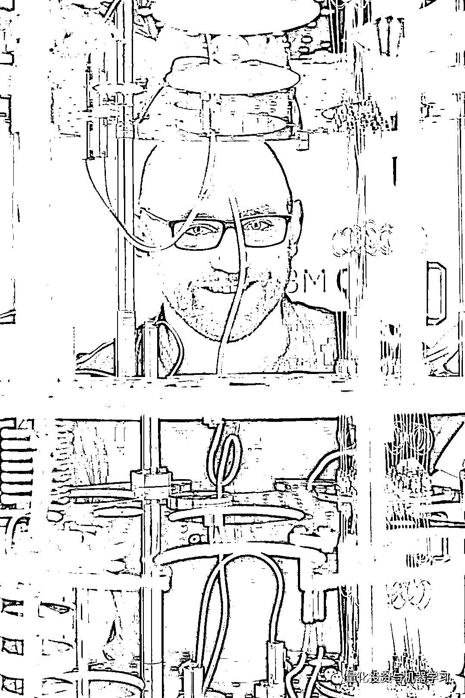

Woerner

自 2017 年以来，摩根大通（J.P.Morgan）、**巴克莱（Barclays）**也一直在测试 IBM 的量子计算软件，希望**通过蒙特卡洛模拟这样的优化来加速他们的投资组合**。去年 11 月，他们发布了一个功能更强大的新版本，可连接 50 个量子位，而不是之前的 20 个量子位。

**05**

**应用五**

近期一篇名为《Quantum Algorithms for Portfolio Optimization》的论文再一次将量子计算和投资组合优化联系在了一起。

出版日期：22/08/2019

引用论文：arXiv:1908.08040 [math.OC] 

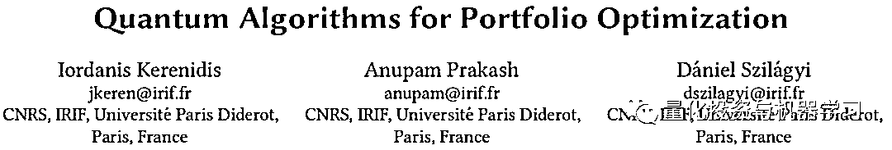

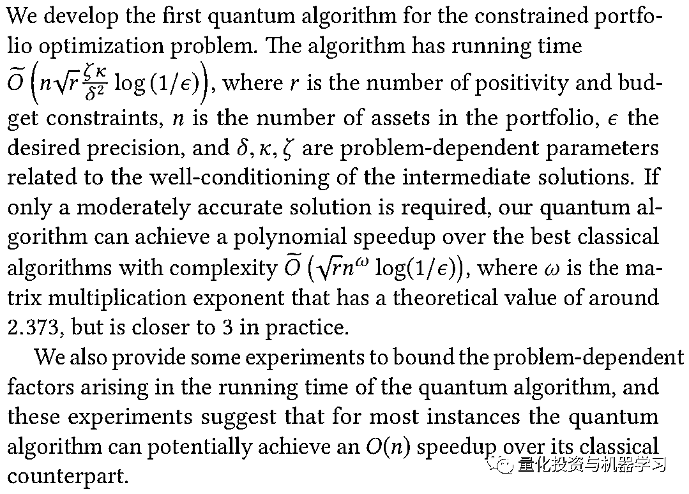

**06**

**应用六**

在欧洲银行中，CaixaBank 是最具创新性的银行之一，美国杂志《Global Finance》在 2019 年也对其进行了肯定。

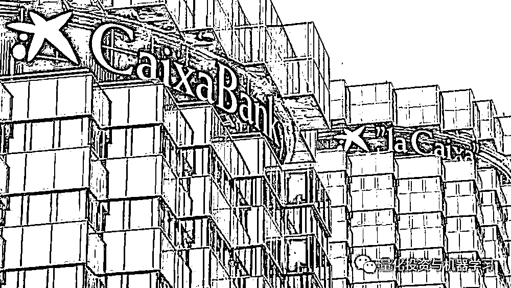

为了保持技术的领先地位，CaixaBank 被 IBM 说服，在两个具体的案例中测试量子计算的贡献。为了实现这一概念证明，即概念验证（英语：Proof of concept，简称 POC）， CaixaBank 的研发部门在真实数据的基础上构建了两个虚拟的投资组合。抵押贷款组合和国债组合。POC 的目的是验证使用量子算法来度量这些投资组合的风险，以及使用量子计算机来运行该算法，是否会改善风险评估过程。

计算是在传统系统上并行进行的。第一步是检查得到的结果。验证测试，因为两个系统计算的结论相同。第二步是计算速度。这里的结果令人印象深刻，因为同样的结果用量子技术可以更快地得到。从长远来看，有可能将计算时间从几天减少到几分钟！

因此，CaixaBank 使用的基础设施是 IBM 开放源码框架 Qiskit，它还提供了一个模拟器，以及对一台带有 16 个量子位处理器的量子计算机的远程访问。

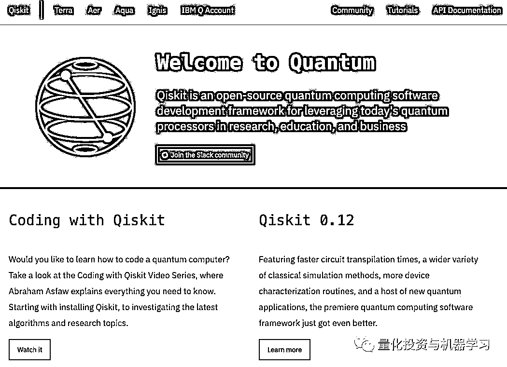

为了开发风险评估算法，CaixaBank 团队依赖与瑞士 IBM Research 和西班牙 IBM Research 合作完成的学术工作：Daniel J. Egger、Ricardo Garcia Gutierrez、Jordi Cahue Mestre 和 Stefan Woerner 合著的《Credit Risk Analysis using Quantum Computers》在今年 7 月发表。

CaixaBank 打算继续在量子计算、优化算法、机器学习和密码学方面的研究。

**07**

**应用七**

D-Wave 由 Gerordie Rose 于 1999 年创立，专注探究关于“量子计算”这一当时只有少数圈内人才懂的神秘问题。在 UBC 学攻读博士学位时，Rose 在他提交的一份作业中，概述了关于量子计算公司的想法。他当时的创业导师 Haig Farris 非常赏识他的这个想法，就赞助了 Rose1000 美元买了一台电脑和一台打印机，把他的商业计划打印出来。

2005 年，在向学术界咨询后，Rose 和团队决定集中精力用以打造可用的量子计算机。于是，2007 年，the Orion 横空出世了，被用在药物分子的分类和玩数读游戏上。这项业务目前为 D-Wave 创造了总计 1 千万美金以上的销售业绩，成功的获得了像 Google、微软和 Northrop Grumman 这类大公司的青睐。

目前 D-Wave 是量子计算系统、软件和服务领域的领导者，也是世界上第一家量子计算机的商业供应商。D-Wave 的系统正在被世界上最先进的组织使用，包括：Google、美国宇航局、大众、DENSO、USRA、USC 等一些知名实验室。D-Wave 已获得 160 多项美国专利，并在领先的科学期刊上发表了 100 多篇同行评议论文。

D-Wave 首席执行官 Vern Brownell 表示，它们已经在与一些头部投行和对冲基金合作，为他们的硬件开发应用程序，并表示**其系统的设计目的是为不需要精确答案的优化问题找到足够好的解决方案**。Brownell 说：“D -Wave 的系统非常善快速地得到好的答案，但可能不是完美的答案，特别是在处理不完整或不完美的数据集时”。

Brownell 说，D-Wave 的计算机解决的本地问题确实是一个优化问题，但是这个解决方案可以被设计成许多不同的应用程序。他指出，基本上是一遍又一遍地进行优化，这是蒙特卡罗模拟的核心，而且在投资组合评估和 VAR 计算中也有应用。

IBM 的 Sutor 也同意量子计算可以有效地应用于蒙特卡罗和 VAR 计算，他设想在未来几年，“那些由云计算或虚拟环境中的数百万台服务器所进行的模拟，可能会被数量少得多的量子计算机所取代”。

但 Brownell 也认为，D-Wave 系统可以用于生成机器学习，因为它可以使用比当前技术所需更少的数据进行训练。这将使它能够解决机器学习算法中最复杂部分的优化或采样问题。

**08**

**应用八**

总部位于硅谷的量子计算机软件开发商 QCware 首席执行官 Matt Johnson 与 D-Wave 有合作关系，并正在与包括量化对冲基金在内的数家金融机构开展试点项目。Johnson 表示，**QCware 正在编写量子算法，以提高量化交易和基金管理策略的风险调整收益，并优化资产定价和对冲。**

他表示：量子优势可以在三年内的交易中得到证明，这是乐观的，也是可以想象的。

**如何学习量子计算**

在这里，公众号还要教大家基于开源软件 Qiskit 进行编程，以图形方式构建和执行量子电路。

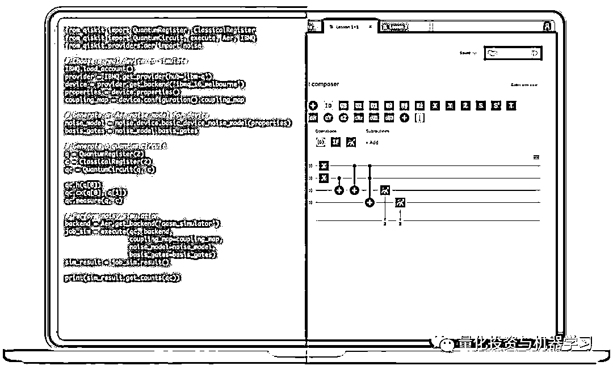

网页在这里：

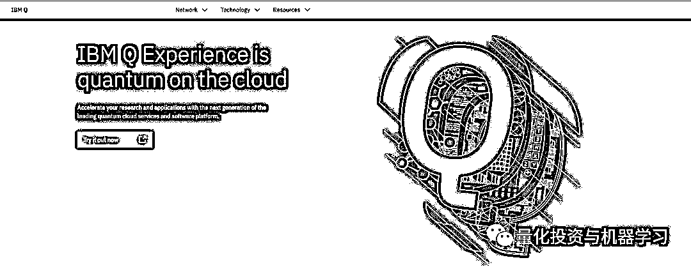

具体可视化页面：

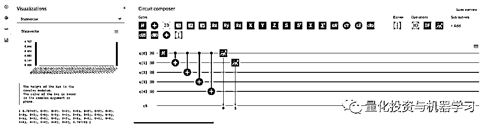

https://www.ibm.com/quantum-computing/technology/experience/

具体 notebook 页面：

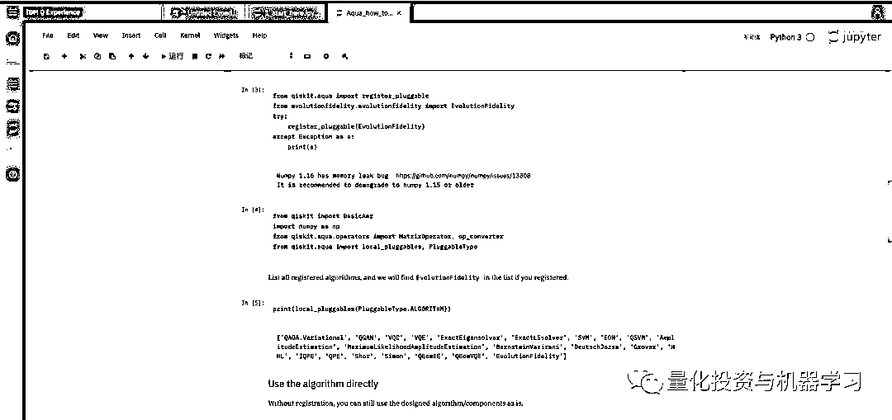

这里还给大家推荐一本开源教科书，叫做**《Learn Quantum Computation using Qiskit》**。该教科书旨在为量子爱好者们普及其知识和有关用 Qiskit 的使用。而且，此书会不断更新 Qiskit 的版本。

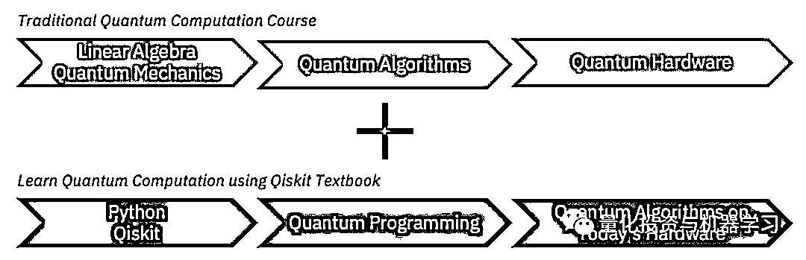量子计算课程概览

该书的第三章演示了标准教材量子算法是如何在 Qiskit 中实现的，然后在模拟器和真实的量子硬件上进行执行。**此书提供了详细的示例，基本覆盖了传统量子算法，重点是了解每个算法背后的数学含义。**

**样章展示**

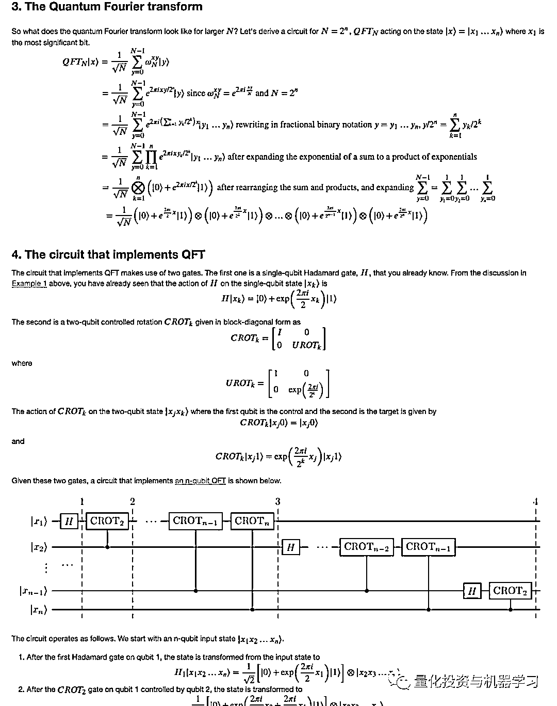

**第四章提供了量子算法的介绍，该章节精选了一系列常见算法，这些算法有助于大家在寻找新方法之前建立第一映像。在标准的量子算法课程中很少讲授这方面的内容，通常分散在几篇研究论文中。因此，对于那些打算进入这个领域的人来说，这是非常宝贵的！**

****样章展示****

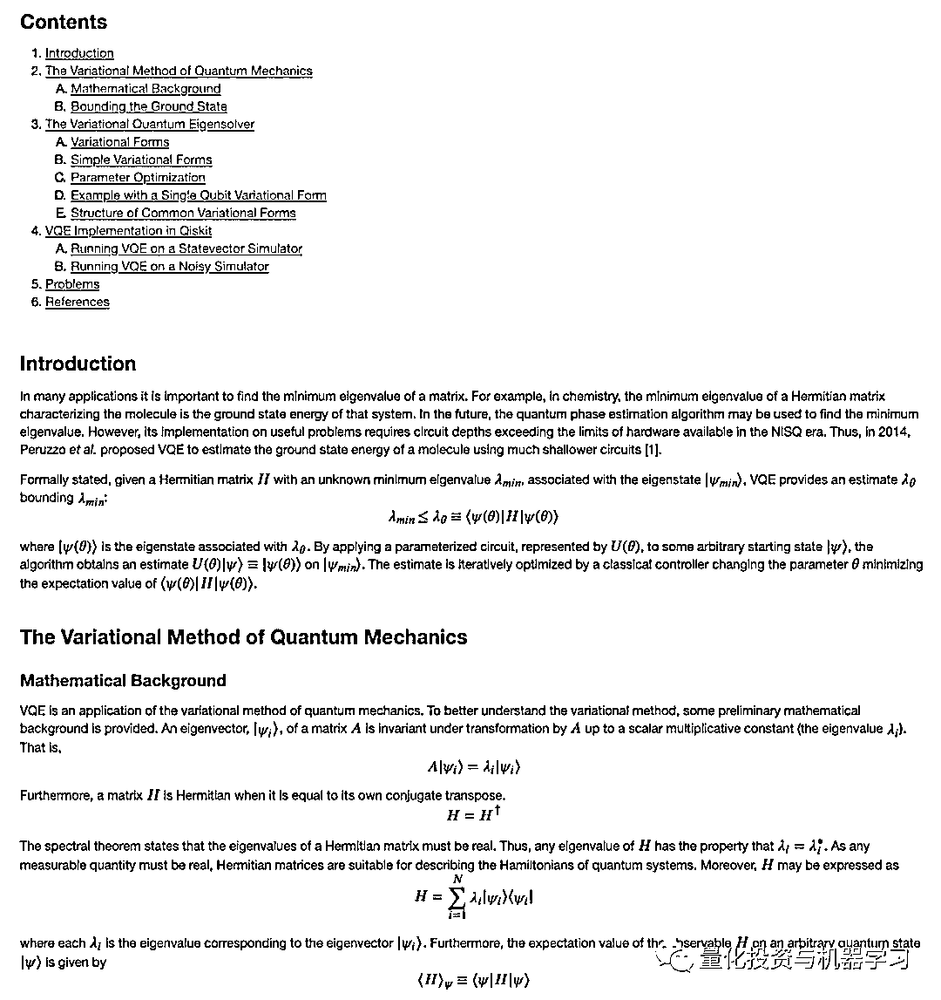

这本书是由该领域的几个专家编写而成，其中包括 IBM 研究中心的几位专家，以及以前在大学教授过这门课程的教授。** 公众号希望大家有所收获！**

书籍学习地址：

***https://community.qiskit.org/textbook/***

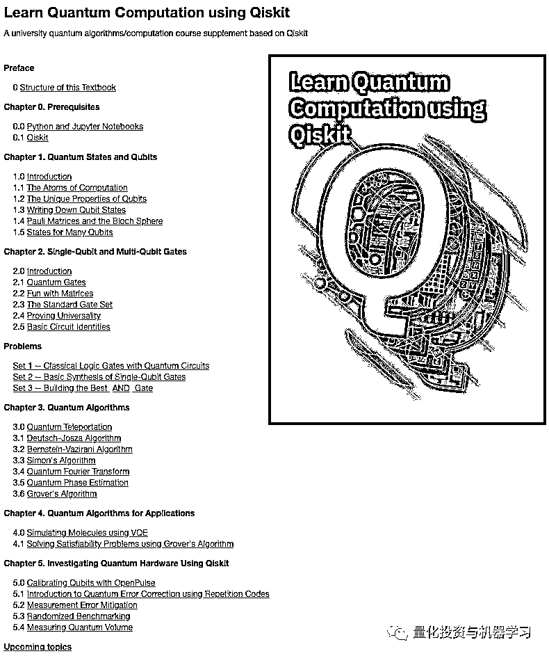

**总结**

Rigetti Computing 首席执行官 Chad Rigetti 表示，量子硬件和软件的发展，意味着量子计算正接近这一临界点，即量子优势(quantum advantage)。他指出了跨越这个门槛的三个重要步骤：

1、是提供更多的量子计算能力(或“量子位”)和更低的错误率。

2、开发更好的工具来为量子计算机编程。

3、为用户提供访问混合算法模型的机会，将经典计算和量子计算的优势结合起来。

**总之，量子计算对对冲基金行业的影响将是深远的！**

*—End—*

量化投资与机器学习微信公众号，是业内垂直于**Quant**、**MFE**、**CST、AI**等专业的**主****流量化自媒体**。公众号拥有来自**公募、私募、券商、银行、海外**等众多圈内**18W+**关注者。每日发布行业前沿研究成果和最新量化资讯。

你点的每个“在看”，都是对我们最大的鼓励