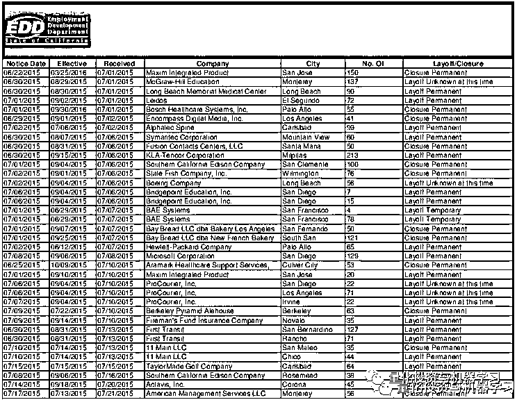

# 手把手教学：提取 PDF 各种表格文本数据（附代码）

> 原文：[`mp.weixin.qq.com/s?__biz=MzAxNTc0Mjg0Mg==&mid=2653294627&idx=1&sn=1de23491548a881638b2ae18a47479d9&chksm=802dd236b75a5b20b6fd53c0191d161c4943f0bd364a0878cec792c9db075a0491a1040a01b7&scene=27#wechat_redirect`](http://mp.weixin.qq.com/s?__biz=MzAxNTc0Mjg0Mg==&mid=2653294627&idx=1&sn=1de23491548a881638b2ae18a47479d9&chksm=802dd236b75a5b20b6fd53c0191d161c4943f0bd364a0878cec792c9db075a0491a1040a01b7&scene=27#wechat_redirect)


**标星★公众号     **爱你们♥

量化投资与机器学习编辑部报道

**近期原创文章：**

## ♥ [5 种机器学习算法在预测股价的应用（代码+数据）](https://mp.weixin.qq.com/s?__biz=MzAxNTc0Mjg0Mg==&mid=2653290588&idx=1&sn=1d0409ad212ea8627e5d5cedf61953ac&chksm=802dc249b75a4b5fa245433320a4cc9da1a2cceb22df6fb1a28e5b94ff038319ae4e7ec6941f&token=1298662931&lang=zh_CN&scene=21#wechat_redirect)

## ♥ [Two Sigma 用新闻来预测股价走势，带你吊打 Kaggle](https://mp.weixin.qq.com/s?__biz=MzAxNTc0Mjg0Mg==&mid=2653290456&idx=1&sn=b8d2d8febc599742e43ea48e3c249323&chksm=802e3dcdb759b4db9279c689202101b6b154fb118a1c1be12b52e522e1a1d7944858dbd6637e&token=1330520237&lang=zh_CN&scene=21#wechat_redirect)

## ♥ 2 万字干货：[利用深度学习最新前沿预测股价走势](https://mp.weixin.qq.com/s?__biz=MzAxNTc0Mjg0Mg==&mid=2653290080&idx=1&sn=06c50cefe78a7b24c64c4fdb9739c7f3&chksm=802e3c75b759b563c01495d16a638a56ac7305fc324ee4917fd76c648f670b7f7276826bdaa8&token=770078636&lang=zh_CN&scene=21#wechat_redirect)

## ♥ [机器学习在量化金融领域的误用！](http://mp.weixin.qq.com/s?__biz=MzAxNTc0Mjg0Mg==&mid=2653292984&idx=1&sn=3e7efe9fe9452c4a5492d2175b4159ef&chksm=802dcbadb75a42bbdce895c49070c3f552dc8c983afce5eeac5d7c25974b7753e670a0162c89&scene=21#wechat_redirect)

## ♥ [基于 RNN 和 LSTM 的股市预测方法](https://mp.weixin.qq.com/s?__biz=MzAxNTc0Mjg0Mg==&mid=2653290481&idx=1&sn=f7360ea8554cc4f86fcc71315176b093&chksm=802e3de4b759b4f2235a0aeabb6e76b3e101ff09b9a2aa6fa67e6e824fc4274f68f4ae51af95&token=1865137106&lang=zh_CN&scene=21#wechat_redirect)

## ♥ [如何鉴别那些用深度学习预测股价的花哨模型？](https://mp.weixin.qq.com/s?__biz=MzAxNTc0Mjg0Mg==&mid=2653290132&idx=1&sn=cbf1e2a4526e6e9305a6110c17063f46&chksm=802e3c81b759b597d3dd94b8008e150c90087567904a29c0c4b58d7be220a9ece2008956d5db&token=1266110554&lang=zh_CN&scene=21#wechat_redirect)

## ♥ [优化强化学习 Q-learning 算法进行股市](https://mp.weixin.qq.com/s?__biz=MzAxNTc0Mjg0Mg==&mid=2653290286&idx=1&sn=882d39a18018733b93c8c8eac385b515&chksm=802e3d3bb759b42d1fc849f96bf02ae87edf2eab01b0beecd9340112c7fb06b95cb2246d2429&token=1330520237&lang=zh_CN&scene=21#wechat_redirect)

## ♥ [WorldQuant 101 Alpha、国泰君安 191 Alpha](https://mp.weixin.qq.com/s?__biz=MzAxNTc0Mjg0Mg==&mid=2653290927&idx=1&sn=ecca60811da74967f33a00329a1fe66a&chksm=802dc3bab75a4aac2bb4ccff7010063cc08ef51d0bf3d2f71621cdd6adece11f28133a242a15&token=48775331&lang=zh_CN&scene=21#wechat_redirect)

## ♥ [基于回声状态网络预测股票价格（附代码）](https://mp.weixin.qq.com/s?__biz=MzAxNTc0Mjg0Mg==&mid=2653291171&idx=1&sn=485a35e564b45046ff5a07c42bba1743&chksm=802dc0b6b75a49a07e5b91c512c8575104f777b39d0e1d71cf11881502209dc399fd6f641fb1&token=48775331&lang=zh_CN&scene=21#wechat_redirect)

## ♥ [计量经济学应用投资失败的 7 个原因](https://mp.weixin.qq.com/s?__biz=MzAxNTc0Mjg0Mg==&mid=2653292186&idx=1&sn=87501434ae16f29afffec19a6884ee8d&chksm=802dc48fb75a4d99e0172bf484cdbf6aee86e36a95037847fd9f070cbe7144b4617c2d1b0644&token=48775331&lang=zh_CN&scene=21#wechat_redirect)

## ♥ [配对交易千千万，强化学习最 NB！（文档+代码）](http://mp.weixin.qq.com/s?__biz=MzAxNTc0Mjg0Mg==&mid=2653292915&idx=1&sn=13f4ddebcd209b082697a75544852608&chksm=802dcb66b75a4270ceb19fac90eb2a70dc05f5b6daa295a7d31401aaa8697bbb53f5ff7c05af&scene=21#wechat_redirect)

## ♥ [关于高盛在 Github 开源背后的真相！](https://mp.weixin.qq.com/s?__biz=MzAxNTc0Mjg0Mg==&mid=2653291594&idx=1&sn=7703403c5c537061994396e7e49e7ce5&chksm=802dc65fb75a4f49019cec951ac25d30ec7783738e9640ec108be95335597361c427258f5d5f&token=48775331&lang=zh_CN&scene=21#wechat_redirect)

## ♥ [新一代量化带货王诞生！Oh My God！](https://mp.weixin.qq.com/s?__biz=MzAxNTc0Mjg0Mg==&mid=2653291789&idx=1&sn=e31778d1b9372bc7aa6e57b82a69ec6e&chksm=802dc718b75a4e0ea4c022e70ea53f51c48d102ebf7e54993261619c36f24f3f9a5b63437e9e&token=48775331&lang=zh_CN&scene=21#wechat_redirect)

## ♥ [独家！关于定量/交易求职分享（附真实试题）](https://mp.weixin.qq.com/s?__biz=MzAxNTc0Mjg0Mg==&mid=2653291844&idx=1&sn=3fd8b57d32a0ebd43b17fa68ae954471&chksm=802dc751b75a4e4755fcbb0aa228355cebbbb6d34b292aa25b4f3fbd51013fcf7b17b91ddb71&token=48775331&lang=zh_CN&scene=21#wechat_redirect)

## ♥ [Quant 们的身份危机！](https://mp.weixin.qq.com/s?__biz=MzAxNTc0Mjg0Mg==&mid=2653291856&idx=1&sn=729b657ede2cb50c96e92193ab16102d&chksm=802dc745b75a4e53c5018cc1385214233ec4657a3479cd7193c95aaf65642f5f45fa0e465694&token=48775331&lang=zh_CN&scene=21#wechat_redirect)

## ♥ [AQR 最新研究 | 机器能“学习”金融吗？](http://mp.weixin.qq.com/s?__biz=MzAxNTc0Mjg0Mg==&mid=2653292710&idx=1&sn=e5e852de00159a96d5dcc92f349f5b58&chksm=802dcab3b75a43a5492bc98874684081eb5c5666aff32a36a0cdc144d74de0200cc0d997894f&scene=21#wechat_redirect)

**还在为抓取各种 PDF 格式的财务、数据报表而烦恼吗？**

**还在为自己手工操作导致的效率低下而**烦恼**吗？**

**还在担心没有趁手的兵器吗？**

今天，公众号为大家介绍一款神器：

***PDFPlumbe***

轻松玩转 PDF，痛快抓数据！**助你一臂之力！**


**获取全部代码，见文末**

**关于**PDFPlumbe****

PDFPlumb 最适合提取电脑生成的 PDF，而不是扫描的 PDF。 它是在 pdfminer 和 pdfmine.six 基础上设计的。

适用版本： **Python2.7、3.1、3.4、3.5 和 3.6。**

**安装 PDFPlumbe**

```py
pip install pdfplumber
```

要使用 pdfplumber 的可视化调试工具，还需要在计算机上安装 ImageMagick（*https://imagemagick.org/index.php*），说明如下：


*http://docs.wand-py.org/en/latest/guide/install.html#install-imagemagick-debian*

具体参数、提取流程与可视化我们将以案例进行展示，更详细的内容，请大家在**文末下载安装包**自行查看。

**案例一**

```py
import pdfplumber

pdf = pdfplumber.open("../pdfs/ca-warn-report.pdf")
p0 = pdf.pages[0]
im = p0.to_image()
im
```



使用 .extract_table 获取数据：

```py
table = p0.extract_table()
table[:3]
```


使用 pandas 将列表呈现为一个 DataFrame，并在某些日期内删除多余的空格。  

```py
import pandas as pd
df = pd.DataFrame(table[1:], columns=table[0])
for column in ["Effective", "Received"]:
    df[column] = df[column].str.replace(" ", "")
```


大功告成！

**具体是如何产生的呢?**

红线代表 pdfplumber 在页面上找到的线，蓝色圆圈表示这些线的交叉点，淡蓝色底纹表示从这些交叉点派生的单元格。


**案例二：从 PDF 中提取图形数据**

```py
import pdfplumber
report = pdfplumber.open("../pdfs/ag-energy-round-up-2017-02-24.pdf").pages[0]
im = report.to_image()
im
```


页面对象具有 .curves 属性，该属性包含在页面上找到的一个 curve 对象列表。本报告包含 12 条曲线，每图 4 条：

```py
len(report.curves)
12
report.curves[0]
```


将它们传递 .draw_lines 确定曲线的位置：

```py
im.draw_lines(report.curves, stroke="red", stroke_width=2)
```


我们通过循环使用四种颜色的调色板来获得更好的显示感：

```py
im.reset()
colors = [ "gray", "red", "blue", "green" ]
for i, curve in enumerate(report.curves):
    stroke = colors[i%len(colors)]
    im.draw_circles(curve["points"], radius=3, stroke=stroke, fill="white")
    im.draw_line(curve["points"], stroke=stroke, stroke_width=2)
im
```


**案例三**

```py
import pdfplumber

pdf = pdfplumber.open("../pdfs/background-checks.pd")
p0 = pdf.pages[0]
im = p0.to_image()
im
```


使用 PageImage.debug_tablefinder() 来检查表格：

```py
im.reset().debug_tablefinder()
```


默认设置正确地标识了表的垂直边界，但是没有捕获每组 5 个 states/territories 之间的水平边界。所以：

使用自定义 .extract_table ：

*   因为列由行分隔，所以我们使用 vertical_strategy="lines"

*   因为行主要由文本之间的沟槽分隔，所以我们使用 horizontal_strategy="text"

*   由于文本的左、右端与竖线不是很齐平，所以我们使用 intersection_tolerance: 15

```py
table_settings = {
    "vertical_strategy": "lines",
    "horizontal_strategy": "text",
    "intersection_x_tolerance": 15
}

im.reset().debug_tablefinder(table_settings)
```


```py
table = p0.extract_table(table_settings)

for row in table[:5]:
    print(row)
```


清理数据（页眉页脚等）：

```py
core_table = table[3:3+56]
" • ".join(core_table[0])
```


```py
" • ".join(core_table[-1])
```


```py
COLUMNS = [
    "state",
    "permit",
    "handgun",
    "long_gun",
    "other",
    "multiple",
    "admin",
    "prepawn_handgun",
    "prepawn_long_gun",
    "prepawn_other",
    "redemption_handgun",
    "redemption_long_gun",
    "redemption_other",
    "returned_handgun",
    "returned_long_gun",
    "returned_other",
    "rentals_handgun",
    "rentals_long_gun",
    "private_sale_handgun",
    "private_sale_long_gun",
    "private_sale_other",
    "return_to_seller_handgun",
    "return_to_seller_long_gun",
    "return_to_seller_other",
    "totals"
]
```

```py
def parse_value(i, x):
    if i == 0: return x
    if x == "": return None
    return int(x.replace(",", ""))

from collections import OrderedDict
def parse_row(row):
    return OrderedDict((COLUMNS[i], parse_value(i, cell))
        for i, cell in enumerate(row))

data = [ parse_row(row) for row in core_table ]
Now here's the first row, parsed:

data[0]
```


**案例四**

```py
import pdfplumber
import re
from collections import OrderedDict

pdf = pdfplumber.open("../pdfs/san-jose-pd-firearm-sample.pdf")
p0 = pdf.pages[0]
im = p0.to_image()
im
```


我们在 pdfplumber 检测到的每个 char 对象周围绘制矩形。通过这样做，我们可以看到报表主体的的每一行都有相同的宽度，并且每个字段都填充了空格(“”)字符。这意味着我们可以像解析标准的固定宽度数据文件一样解析这些行。

```py
im.reset().draw_rects(p0.chars)
```


使用 page .extract_text(…) 方法，逐行抓取页面上的每个字符（文本）:

```py
text = p0.extract_text()
print(text)
```


清理数据（页眉页脚等）：

```py
`core_pat = re.compile(r"LOCATION[\-\s]+(.*)\n\s+Flags = e", re.DOTALL)
core = re.search(core_pat, text).group(1)
print(core)`
```

****

**在这份报告中，每 f 一个 irearm 占了两行。下面的代码将表拆分为 two-line，然后根据每个字段中的字符数解析出字段：**

```py
`lines = core.split("\n")
line_groups = list(zip(lines[::2], lines[1::2]))
print(line_groups[0])`
```

****

```py
`def parse_row(first_line, second_line):
    return OrderedDict([
        ("type", first_line[:20].strip()),
        ("item", first_line[21:41].strip()),
        ("make", first_line[44:89].strip()),
        ("model", first_line[90:105].strip()),
        ("calibre", first_line[106:111].strip()),
        ("status", first_line[112:120].strip()),
        ("flags", first_line[124:129].strip()),
        ("serial_number", second_line[0:13].strip()),
        ("report_tag_number", second_line[21:41].strip()),
        ("case_file_number", second_line[44:64].strip()),
        ("storage_location", second_line[68:91].strip())
    ])

parsed = [ parse_row(first_line, second_line)
    for first_line, second_line in line_groups ]`
```

```py
`parsed[:2]`
```

**** 

**通过 DataFrame 进行展示：** 

```py
`mport pandas as pd
columns = list(parsed[0].keys())
pd.DataFrame(parsed)[columns]`
```

****

****获取代码****

**在**后台**输入（严格大小写）**

*****Pdfplumber_ 文件*****

***—End—***

**量化投资与机器学习微信公众号，是业内垂直于**Quant**、**MFE**、**CST、AI**等专业的**主****流量化自媒体**。公众号拥有来自**公募、私募、券商、银行、海外**等众多圈内**18W+**关注者。每日发布行业前沿研究成果和最新量化资讯。**

******你点的每个“在看”，都是对我们最大的鼓励**