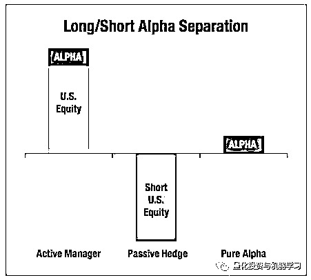
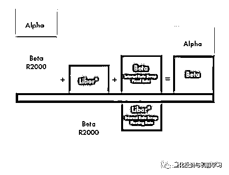
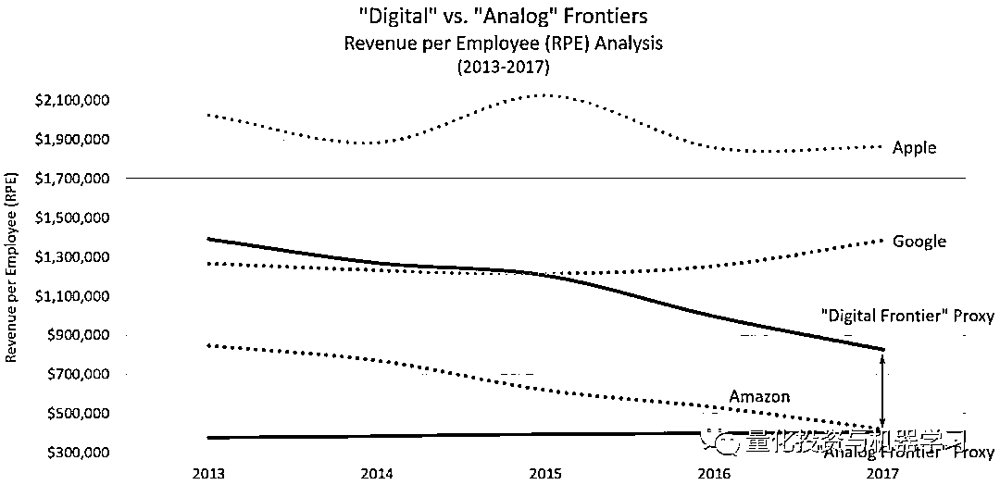
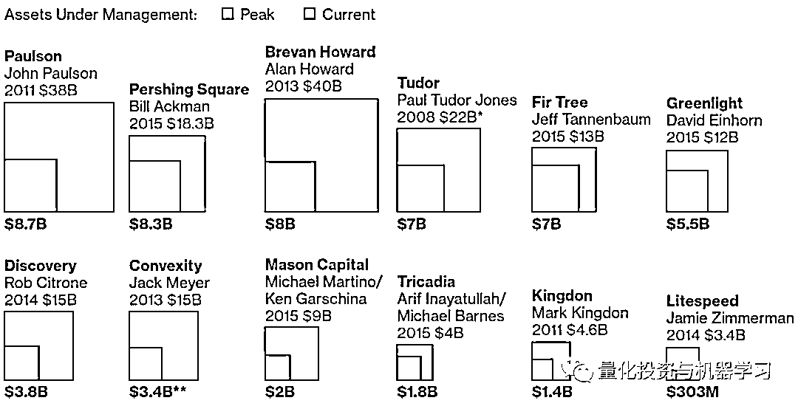
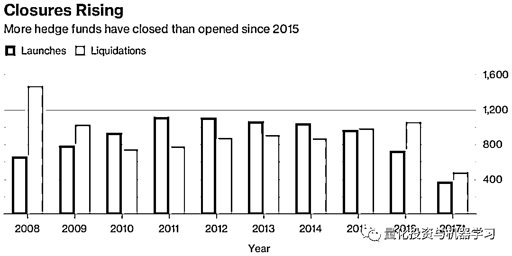
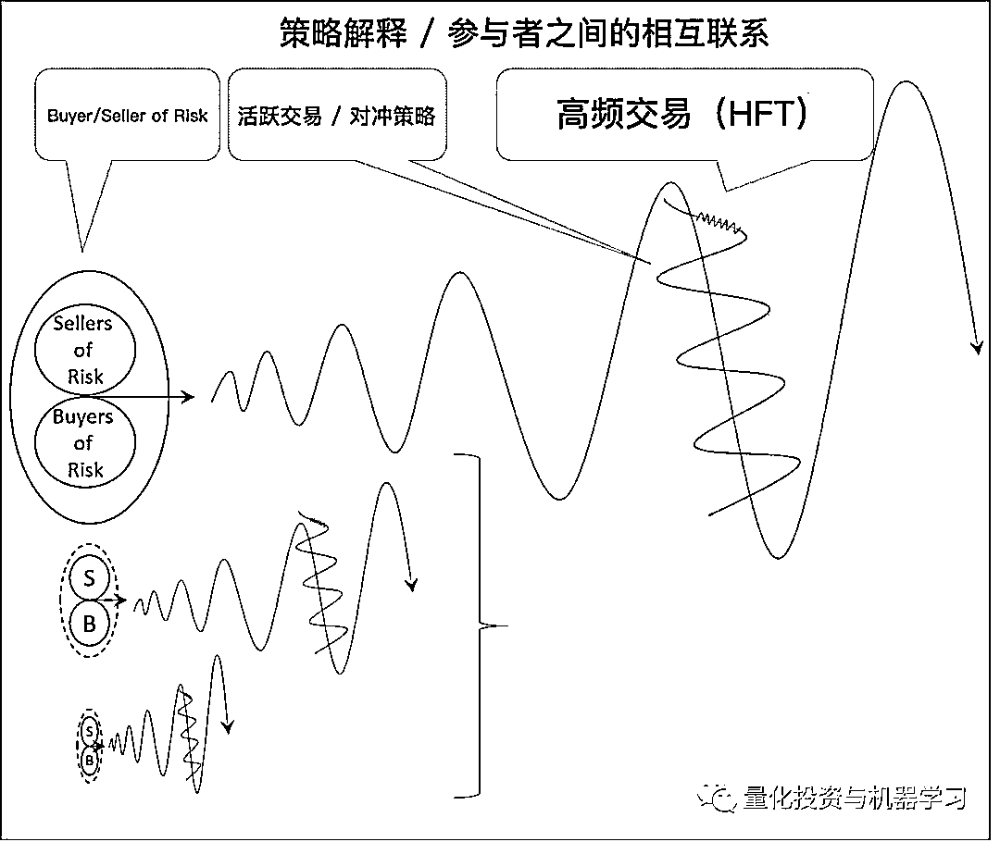
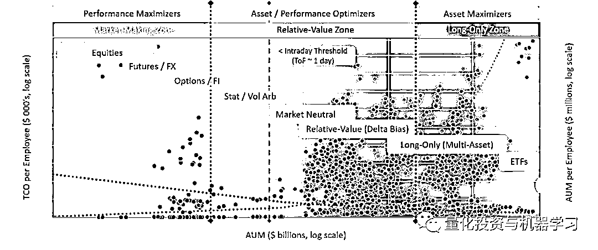
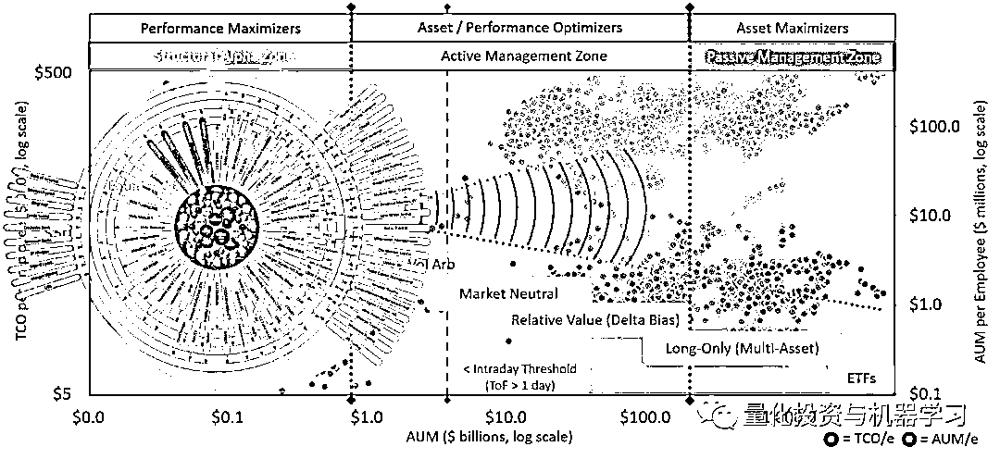
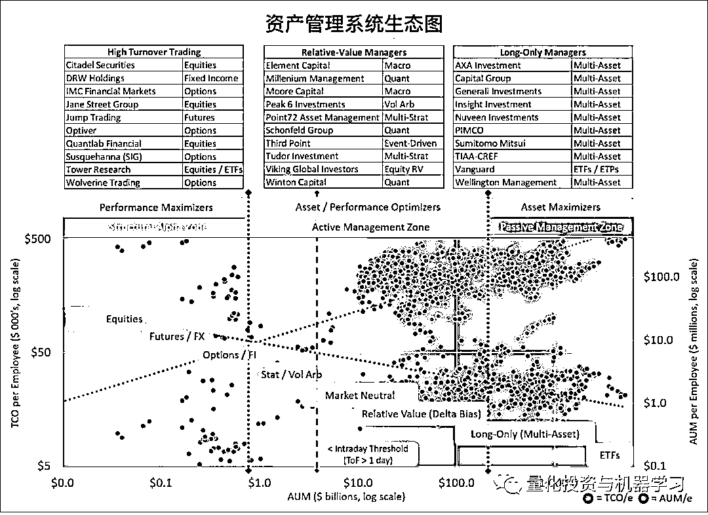

# Alpha 的容量是无限的吗？

> 原文：[`mp.weixin.qq.com/s?__biz=MzAxNTc0Mjg0Mg==&mid=2653294551&idx=1&sn=0d23f7353916a1e4529ec2b4e7679957&chksm=802dcdc2b75a44d419a9f46e9ecff0811f0a0dab20d771489be074826c160e40dec83f4138b3&scene=27#wechat_redirect`](http://mp.weixin.qq.com/s?__biz=MzAxNTc0Mjg0Mg==&mid=2653294551&idx=1&sn=0d23f7353916a1e4529ec2b4e7679957&chksm=802dcdc2b75a44d419a9f46e9ecff0811f0a0dab20d771489be074826c160e40dec83f4138b3&scene=27#wechat_redirect)

**标星★公众号     **爱你们♥

作者：Paul Rowady

编译：1+1=6 | 公众号海外部

**近期原创文章：**

## ♥ [5 种机器学习算法在预测股价的应用（代码+数据）](https://mp.weixin.qq.com/s?__biz=MzAxNTc0Mjg0Mg==&mid=2653290588&idx=1&sn=1d0409ad212ea8627e5d5cedf61953ac&chksm=802dc249b75a4b5fa245433320a4cc9da1a2cceb22df6fb1a28e5b94ff038319ae4e7ec6941f&token=1298662931&lang=zh_CN&scene=21#wechat_redirect)

## ♥ [Two Sigma 用新闻来预测股价走势，带你吊打 Kaggle](https://mp.weixin.qq.com/s?__biz=MzAxNTc0Mjg0Mg==&mid=2653290456&idx=1&sn=b8d2d8febc599742e43ea48e3c249323&chksm=802e3dcdb759b4db9279c689202101b6b154fb118a1c1be12b52e522e1a1d7944858dbd6637e&token=1330520237&lang=zh_CN&scene=21#wechat_redirect)

## ♥ 2 万字干货：[利用深度学习最新前沿预测股价走势](https://mp.weixin.qq.com/s?__biz=MzAxNTc0Mjg0Mg==&mid=2653290080&idx=1&sn=06c50cefe78a7b24c64c4fdb9739c7f3&chksm=802e3c75b759b563c01495d16a638a56ac7305fc324ee4917fd76c648f670b7f7276826bdaa8&token=770078636&lang=zh_CN&scene=21#wechat_redirect)

## ♥ [机器学习在量化金融领域的误用！](http://mp.weixin.qq.com/s?__biz=MzAxNTc0Mjg0Mg==&mid=2653292984&idx=1&sn=3e7efe9fe9452c4a5492d2175b4159ef&chksm=802dcbadb75a42bbdce895c49070c3f552dc8c983afce5eeac5d7c25974b7753e670a0162c89&scene=21#wechat_redirect)

## ♥ [基于 RNN 和 LSTM 的股市预测方法](https://mp.weixin.qq.com/s?__biz=MzAxNTc0Mjg0Mg==&mid=2653290481&idx=1&sn=f7360ea8554cc4f86fcc71315176b093&chksm=802e3de4b759b4f2235a0aeabb6e76b3e101ff09b9a2aa6fa67e6e824fc4274f68f4ae51af95&token=1865137106&lang=zh_CN&scene=21#wechat_redirect)

## ♥ [如何鉴别那些用深度学习预测股价的花哨模型？](https://mp.weixin.qq.com/s?__biz=MzAxNTc0Mjg0Mg==&mid=2653290132&idx=1&sn=cbf1e2a4526e6e9305a6110c17063f46&chksm=802e3c81b759b597d3dd94b8008e150c90087567904a29c0c4b58d7be220a9ece2008956d5db&token=1266110554&lang=zh_CN&scene=21#wechat_redirect)

## ♥ [优化强化学习 Q-learning 算法进行股市](https://mp.weixin.qq.com/s?__biz=MzAxNTc0Mjg0Mg==&mid=2653290286&idx=1&sn=882d39a18018733b93c8c8eac385b515&chksm=802e3d3bb759b42d1fc849f96bf02ae87edf2eab01b0beecd9340112c7fb06b95cb2246d2429&token=1330520237&lang=zh_CN&scene=21#wechat_redirect)

## ♥ [WorldQuant 101 Alpha、国泰君安 191 Alpha](https://mp.weixin.qq.com/s?__biz=MzAxNTc0Mjg0Mg==&mid=2653290927&idx=1&sn=ecca60811da74967f33a00329a1fe66a&chksm=802dc3bab75a4aac2bb4ccff7010063cc08ef51d0bf3d2f71621cdd6adece11f28133a242a15&token=48775331&lang=zh_CN&scene=21#wechat_redirect)

## ♥ [基于回声状态网络预测股票价格（附代码）](https://mp.weixin.qq.com/s?__biz=MzAxNTc0Mjg0Mg==&mid=2653291171&idx=1&sn=485a35e564b45046ff5a07c42bba1743&chksm=802dc0b6b75a49a07e5b91c512c8575104f777b39d0e1d71cf11881502209dc399fd6f641fb1&token=48775331&lang=zh_CN&scene=21#wechat_redirect)

## ♥ [计量经济学应用投资失败的 7 个原因](https://mp.weixin.qq.com/s?__biz=MzAxNTc0Mjg0Mg==&mid=2653292186&idx=1&sn=87501434ae16f29afffec19a6884ee8d&chksm=802dc48fb75a4d99e0172bf484cdbf6aee86e36a95037847fd9f070cbe7144b4617c2d1b0644&token=48775331&lang=zh_CN&scene=21#wechat_redirect)

## ♥ [配对交易千千万，强化学习最 NB！（文档+代码）](http://mp.weixin.qq.com/s?__biz=MzAxNTc0Mjg0Mg==&mid=2653292915&idx=1&sn=13f4ddebcd209b082697a75544852608&chksm=802dcb66b75a4270ceb19fac90eb2a70dc05f5b6daa295a7d31401aaa8697bbb53f5ff7c05af&scene=21#wechat_redirect)

## ♥ [关于高盛在 Github 开源背后的真相！](https://mp.weixin.qq.com/s?__biz=MzAxNTc0Mjg0Mg==&mid=2653291594&idx=1&sn=7703403c5c537061994396e7e49e7ce5&chksm=802dc65fb75a4f49019cec951ac25d30ec7783738e9640ec108be95335597361c427258f5d5f&token=48775331&lang=zh_CN&scene=21#wechat_redirect)

## ♥ [新一代量化带货王诞生！Oh My God！](https://mp.weixin.qq.com/s?__biz=MzAxNTc0Mjg0Mg==&mid=2653291789&idx=1&sn=e31778d1b9372bc7aa6e57b82a69ec6e&chksm=802dc718b75a4e0ea4c022e70ea53f51c48d102ebf7e54993261619c36f24f3f9a5b63437e9e&token=48775331&lang=zh_CN&scene=21#wechat_redirect)

## ♥ [独家！关于定量/交易求职分享（附真实试题）](https://mp.weixin.qq.com/s?__biz=MzAxNTc0Mjg0Mg==&mid=2653291844&idx=1&sn=3fd8b57d32a0ebd43b17fa68ae954471&chksm=802dc751b75a4e4755fcbb0aa228355cebbbb6d34b292aa25b4f3fbd51013fcf7b17b91ddb71&token=48775331&lang=zh_CN&scene=21#wechat_redirect)

## ♥ [Quant 们的身份危机！](https://mp.weixin.qq.com/s?__biz=MzAxNTc0Mjg0Mg==&mid=2653291856&idx=1&sn=729b657ede2cb50c96e92193ab16102d&chksm=802dc745b75a4e53c5018cc1385214233ec4657a3479cd7193c95aaf65642f5f45fa0e465694&token=48775331&lang=zh_CN&scene=21#wechat_redirect)

## ♥ [AQR 最新研究 | 机器能“学习”金融吗？](http://mp.weixin.qq.com/s?__biz=MzAxNTc0Mjg0Mg==&mid=2653292710&idx=1&sn=e5e852de00159a96d5dcc92f349f5b58&chksm=802dcab3b75a43a5492bc98874684081eb5c5666aff32a36a0cdc144d74de0200cc0d997894f&scene=21#wechat_redirect)

**前言**

Alpha 这个名词对于量化圈的我们太熟悉不过了，你可能在不同的场合和研究中听到过不同的 Alpha，我们为大家举一些版本：

**Achieving Alpha**

**Delivering Alpha**

**Portable Alpha（可转移**Alpha**）**

可转移 Alpha 这一术语最早是对的“股票加”（StockPLUS）策略的称呼，其是在“债券加”策略的基础上发展起来的一种投资策略。

可转移 Alpha 策略的运作可以分解为两个方面：一是利用衍生市场暴露给投资者提供所希望的市场或资产暴露；二是运用 Alpha 策略（包括 Alpha-Beta 分离和积极性管理产生的 Alpha）给投资者提供另外的增量收益(其可以或者不需要卖空期货头寸或卖空证券获得希望的风险收益特征)。

**可转移 Alpha 策略是将 Alpha-Beta 分离和积极性管理产生的 Alpha 从一种资产转移至另一种资产。可转移 Alpha 的外延比 Alpha-Beta 分离更广，其核心体现在 Alpha 在不同类资产之间的转移。**  

从 2002 年至 2006 年的几年里（鼎盛时期），基金管理人提供的基于衍生证券的市场暴露和投资策略相结合的方法以及投资者的使用呈爆发性增加。

我们也可以用图表的形式为大家解释一下：

Alpha-Beta 分离：这个策略是通过金融衍生品对现货组合做反向操作，让组合的 Beta=0，从而可以获得一个 Pure Alpha。这样就把 Alpha 从原有的组合中分离出来，获得绝对正收益。这个策略通常对冲基金用的多一些，如下图所示。

可转移 Alpha 是指通过金融衍生品的操作，实现 Alpha 在不同资产类别之间的转移。换言之，就是把一个资产类别的 Alpha 和另一个资产类别的 Beta 组合在一起，如下图所示。

这样通过两个 Swap 就可以把一个小盘股的 Alpha 和一个 Liability 的 Beta 结合到一起，形成一个新的 Alpha-Beta 组合。这个 Alpha 就叫做可转移 Alpha。

那这么做的好处是什么？**当一个基金经理想要获得一个市场的 Alpha，同时又想追求另外一个市场的 Beta 时，就需要用到**。比如说，新兴市场通常有较好的 Alpha，但是 Beta 可能波动也比较大；但是成熟市场的 Beta 又会比较好，但是因为其成熟，Alpha 又不会特别高。这样，基金经理可以把新兴市场的 Alpha 和成熟市场的 Beta 放在一起形成一个组合，就能够取得不错的收益。

**Tainted Alpha**

*An alpha return that cannot be attributed solely to the money manager due to consequential beta exposure. Tainted alpha is seen when money managers invest in individual equities, instead of using market neutral strategies such as arbitrage, and hedging*

**generating Alpha**

**Alpha 的容量是无限的吗？**

让我们用下面的数学公式表示我们想表达的：

**α < ∞**

就像正态分布一样，Alpha 是 tail ，而 tail 不可能是无限的。不存在流动性无限的单一市场。此外，所有市场的流动性总和也不是无限的。

因此，由于超额收益的最大值取决于流动性，而且不存在流动性无限的单一市场，那么：Alpha 不可能是无限的。

**∴ Alpha 一定是有限的**

让我们回到最开始说的，如果不存在 Achieving Alpha、Delivering Alpha、Portable Alpha 等。每一个版本都暗示着 Alpha 可以随意制造，但这种方式是根本行不通！

相反，我们应该这么想：**所有版本的 Alpha 都已存在。****因此，Alpha 首先要被发现，然后被捕获（一定要按照这个顺序）**。例如，没有被发现就被俘获，那只能算是偶然的 Alpha。我们甚至怀疑，一些资产管理公司、基金 BD 和金融媒体所宣传的 Alpha，实际上只是意外的 Alpha 或临时的 Alpha。这也是为什么一些对冲基金巨头关门大吉的原因之一。

**我们真正需要的是持续的 Alpha，持续的发现，持续的捕获。**

我们现在有一个想法，即在某一特定时间点测量全球 Alpha 的总容量，虽然全球 Alpha 的总容量将是很大的，而且会随着各个时期市场因素的影响增加或减少，但它永远不会是无限的。这是一种假设，一旦得到验证，就可以为所有资管、投资者、中介机构、解决方案提供商等提供新的、重要的预测方法。这特带来一个我们一直研究和讨论的问题：即在数字时代，**技术的应用导致一些市场呈现出“赢者通吃”的现场**。比如亚马逊、谷歌或 Facebook，包括国内的阿里巴巴、百度、腾讯等。这些公司往往在它们进入的市场中始终能占据主导地位。

在下面这张如中，展示了摩根大通和 Bank of America Merrill Lynch 以及三家最主要的科技公司亚马逊、谷歌和苹果的人均收入简单加权平均指数 。

数据来自：Alphacution

金融市场是否也会出现“赢者通吃”的场景呢？技术驱动型参与者：主要是量化对冲基金经理，能否在有限 Alpha 中占据越来越大的份额？如果一个系统可以保持一个持久的 Alpha 源，然后我们去进行捕捉，那么这个 Alpha 来源是否能够被一个单一市场参与者（或集中的市场参与者）全部捕获？如果是这样的话，这一现象对资产管理领域会构成怎样影的响？

根据 Institutional Investor 发布的 2017 年全球 100 家最大对冲基金公司排名：

*A handful of quantitative firms have* *continued to gobble up large sums of assets**, catapulting many of them to the top of [the rankings]. The four biggest hedge fund firms — and five of the six biggest — on this year’s ranking rely largely or* *fully on computers to make their investment decisions* *and have* *continued to attract assets in spite of underwhelming performance in some cases**. At the same time, many well-established, recognizable firms with long track records have once again suffered a sharp reduction in assets or are shutting down altogether.”*

这 5 家公司包括：

第一名：桥水（约 1250 亿美元）

第二名：AQR （约 900 亿美元)

第三名：文艺复兴（约 570 亿美元）

第四名：Two Sigma （约 520 亿美元)

第六名：D.E. Shaw & Co. （约 390 亿美元)

第九名：Marshall Wace （约 330 亿美元）

这份名单不包括 Citadel（约 300 亿美元）、 Millennium Management（约 360 亿美元）或 Man Group（约 1090 亿美元，其中约 290 亿美元用于绝对收益策略）以量化为导向的知名对冲基金公司。

这从侧面反映了“赢者通吃”的事实。

同样值得注意的是，正在缩减或消失的对冲基金经理名单中：他们中没有一个是以偏重于系统方法而著称：

Bloomberg 和 Hedge Fund Research 的数据显示，截至 2017 年底，对冲基金关闭的速度已连续第三年超过新基金的发行速度。其中包括 Greenlight Capital 的 David Einhorn、John Paulson、保 Paulson & Co 以及 Brevan Howard Asset Management 的 Alan Howard。

让我们先把刚才这些想法暂放一边，接下来：我们一个关于各种因子（包括市场结构演变）如何影响 Alpha 容量变化的概念框架。

波动性、利率、流动性等因子，一直是全球资产管理全貌下图（对冲基金和做市商）上策略和参与者定位的关键驱动因子。

但是因子分析和影响并不是我们在这里要讨论的。我们在这里要谈的是策略自动化的影响，它在促进持续发现和捕获 Alpha。

量化基金经理的成功和神话都不是什么新鲜事，因为这类基金经理中的一些神话已经运作了几十年；其中一些在过去的一二十年里一直被大家熟知。其中历史最悠久、规模最大的是达里奥成立于 1975 年的桥水基金。西蒙斯的文艺复兴科技成立于 1982 年。

这里的新鲜之处在于，他们的优势在我们的上图中，把它称为**“Relative-Value”**，与相邻类区域主要区别是，该区域的主要目标是优化所管理资产的规模和业绩，这一目标要求采用非常具体和定量的方法，以了解各种 Alpha 的来源。 

如果 Aalpha 的容量是有限的，那么，资产集中的原因和基金关闭的原因就有了联系。甚至不用看过往的记录，这两个事实就可以得出这样的结论：在现代金融市场，系统性策略比传统的、以基本面为导向的策略更具一致性，因此，它们能在资产配置中能更具竞争力。

简而言之：**不仅做市商在吃自己的，对冲基金也在吃自己的**。当然，这种影响是间接的。假设 Alpha 源很容易被发现，人们现在正以更快的速度和更大的规模被系统地发现和采集。

**Alpha 私有化**

你的视角需要去感知 Alpha 的来源，因为它已经存在。尽管这些来源可以发生变化，由于技术升级、新的产品、新数据源和新监管措施。信息的不对称和低效率的市场生态系统，在每个时点都存在。精明的玩家可以找到方法来利用这些机会。

因此，Alpha 首先要被发现，然后被捕获（一定要按照这个顺序），但是**永远不能 Generatin Alpha，因为 Generatin Alpha 意味着随意创建一些不存在的东西**（除了你做一些事情时，比如利用内幕消息，或者其他被禁止的不对称信息）。 同义词在任何情况下都是可以接受的，例如 Inding 和 Harvesting Alpha。

然而，在这种情况下，如果 Alpha 的容量在每个时间点都是有限的，那么参与者和策略就会显示出来，并受到相互依赖性的约束。**只要****存在相互依赖关系，就可以从不完整的信息中获得有关系统内部工作的情况。**

正如我们在上面提到的，我们用来分割这张生态图的第一个因素仅仅是管理规模。 **管理规模也在侧面反映了策略的类型，因为许多策略都有容量限制**。此外，在一定程度上，所有的基金管理人都会成为多策略、多资产的管理人，正是因为这个约束。

刚才我们说了“赢者通吃”的情况。我们又提出一个假设：在对冲基金领域，量化技术型对冲基金公司和程序化程度较低、基于基本面的策略对冲基金公司就像一枚硬币的两面，与同一个根本原因有关：**成功地利用策略自动化持续发现和捕获稀缺和有限的 Alpha。**  

此外，由于在生态图上活跃的管理区仍然是数千家对冲基金，随着这些顶级玩家想出如何扩大他们各种策略的容量 / 性能时，这种集中将变得更加明显。

我们所看到的这一趋势的主要阻力是，大多数积极的策略都依赖于参与者和策略的多样性。从这个意义上说，鲸鱼总是希望在赌桌上有一个稳定的鱼饵来源，因为它们更喜欢这样的场景，而不是与其他鲸鱼面对面的场景。有一件事是肯定的：对冲基金的黄金时代已经结束，特别是现在一些大的传统玩家推出基金产品，有效地推销他们进入 Alpha 和 Smart beta 领域的渠道（指剩下的一小部分 Alpha）。

虑一下那些顶级对冲基金的创始人及其主要高管的财富总和。 他们是一个非常小的团体，也许就两三百个人。想想 10 年后这个数字会是什么样子，以及外部投资者（他们本身就是大型机构配置者）是否会逐渐被挤到一边。

**有谁愿意打赌，在有限的 Alpha 容量中，有多少是由这些波动造成的？**至少，这是 Alpha 私有化程度不断提高和占主导地位的（赢家通吃）市场特征增长所带来的风险。这是非常值得关注的，因为它代表了一系列多米诺骨牌，影响着生态系统中的几乎所有其他事物。 **Alpha 在这个领域有助于量化，说明，解释和预测这些现象。**

不管接下来会发生什么，这可能是一个很好的时间来分配你更多的注意力和物质资源来**培养个人的 Alpha：****在这里能力是无限的……**

*—End—*

量化投资与机器学习微信公众号，是业内垂直于**Quant**、**MFE**、**CST、AI**等专业的**主****流量化自媒体**。公众号拥有来自**公募、私募、券商、银行、海外**等众多圈内**18W+**关注者。每日发布行业前沿研究成果和最新量化资讯。

你点的每个“在看”，都是对我们的鼓励