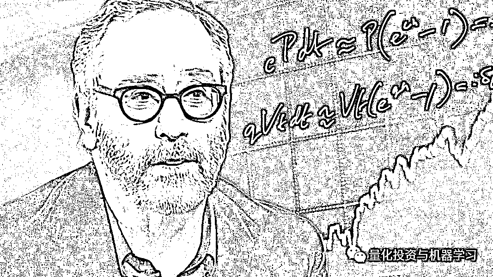
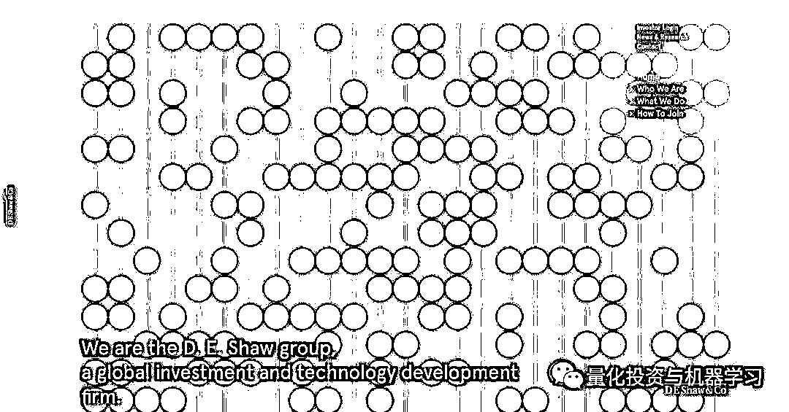
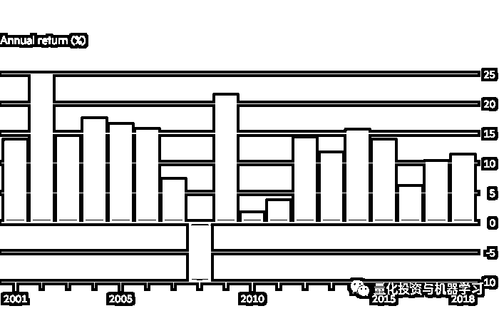
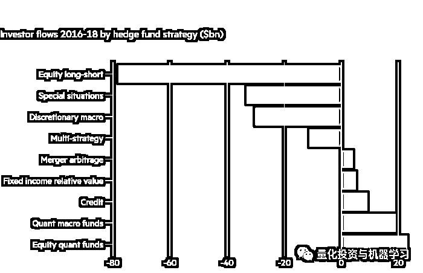
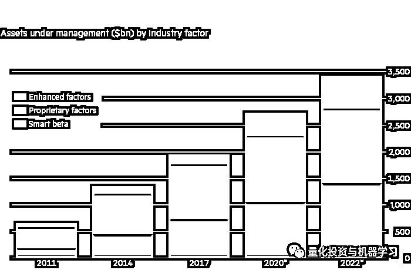

# D.E.Shaw：500 亿规模的优势与内幕！

> 原文：[`mp.weixin.qq.com/s?__biz=MzAxNTc0Mjg0Mg==&mid=2653294523&idx=1&sn=51c11fb8daea83abe56b506f3195bb24&chksm=802dcdaeb75a44b887e22c206ccaf8b69a9e632c58ca849199705a7c8b6b3dbc11578b460247&scene=27#wechat_redirect`](http://mp.weixin.qq.com/s?__biz=MzAxNTc0Mjg0Mg==&mid=2653294523&idx=1&sn=51c11fb8daea83abe56b506f3195bb24&chksm=802dcdaeb75a44b887e22c206ccaf8b69a9e632c58ca849199705a7c8b6b3dbc11578b460247&scene=27#wechat_redirect)

**标星★公众号     **爱你们♥

作者：Robin Wigglesworth | FT

编译：1+1=6 | 公众号海外部

**近期原创文章：**

## ♥ [5 种机器学习算法在预测股价的应用（代码+数据）](https://mp.weixin.qq.com/s?__biz=MzAxNTc0Mjg0Mg==&mid=2653290588&idx=1&sn=1d0409ad212ea8627e5d5cedf61953ac&chksm=802dc249b75a4b5fa245433320a4cc9da1a2cceb22df6fb1a28e5b94ff038319ae4e7ec6941f&token=1298662931&lang=zh_CN&scene=21#wechat_redirect)

## ♥ [Two Sigma 用新闻来预测股价走势，带你吊打 Kaggle](https://mp.weixin.qq.com/s?__biz=MzAxNTc0Mjg0Mg==&mid=2653290456&idx=1&sn=b8d2d8febc599742e43ea48e3c249323&chksm=802e3dcdb759b4db9279c689202101b6b154fb118a1c1be12b52e522e1a1d7944858dbd6637e&token=1330520237&lang=zh_CN&scene=21#wechat_redirect)

## ♥ 2 万字干货：[利用深度学习最新前沿预测股价走势](https://mp.weixin.qq.com/s?__biz=MzAxNTc0Mjg0Mg==&mid=2653290080&idx=1&sn=06c50cefe78a7b24c64c4fdb9739c7f3&chksm=802e3c75b759b563c01495d16a638a56ac7305fc324ee4917fd76c648f670b7f7276826bdaa8&token=770078636&lang=zh_CN&scene=21#wechat_redirect)

## ♥ [机器学习在量化金融领域的误用！](http://mp.weixin.qq.com/s?__biz=MzAxNTc0Mjg0Mg==&mid=2653292984&idx=1&sn=3e7efe9fe9452c4a5492d2175b4159ef&chksm=802dcbadb75a42bbdce895c49070c3f552dc8c983afce5eeac5d7c25974b7753e670a0162c89&scene=21#wechat_redirect)

## ♥ [基于 RNN 和 LSTM 的股市预测方法](https://mp.weixin.qq.com/s?__biz=MzAxNTc0Mjg0Mg==&mid=2653290481&idx=1&sn=f7360ea8554cc4f86fcc71315176b093&chksm=802e3de4b759b4f2235a0aeabb6e76b3e101ff09b9a2aa6fa67e6e824fc4274f68f4ae51af95&token=1865137106&lang=zh_CN&scene=21#wechat_redirect)

## ♥ [如何鉴别那些用深度学习预测股价的花哨模型？](https://mp.weixin.qq.com/s?__biz=MzAxNTc0Mjg0Mg==&mid=2653290132&idx=1&sn=cbf1e2a4526e6e9305a6110c17063f46&chksm=802e3c81b759b597d3dd94b8008e150c90087567904a29c0c4b58d7be220a9ece2008956d5db&token=1266110554&lang=zh_CN&scene=21#wechat_redirect)

## ♥ [优化强化学习 Q-learning 算法进行股市](https://mp.weixin.qq.com/s?__biz=MzAxNTc0Mjg0Mg==&mid=2653290286&idx=1&sn=882d39a18018733b93c8c8eac385b515&chksm=802e3d3bb759b42d1fc849f96bf02ae87edf2eab01b0beecd9340112c7fb06b95cb2246d2429&token=1330520237&lang=zh_CN&scene=21#wechat_redirect)

## ♥ [WorldQuant 101 Alpha、国泰君安 191 Alpha](https://mp.weixin.qq.com/s?__biz=MzAxNTc0Mjg0Mg==&mid=2653290927&idx=1&sn=ecca60811da74967f33a00329a1fe66a&chksm=802dc3bab75a4aac2bb4ccff7010063cc08ef51d0bf3d2f71621cdd6adece11f28133a242a15&token=48775331&lang=zh_CN&scene=21#wechat_redirect)

## ♥ [基于回声状态网络预测股票价格（附代码）](https://mp.weixin.qq.com/s?__biz=MzAxNTc0Mjg0Mg==&mid=2653291171&idx=1&sn=485a35e564b45046ff5a07c42bba1743&chksm=802dc0b6b75a49a07e5b91c512c8575104f777b39d0e1d71cf11881502209dc399fd6f641fb1&token=48775331&lang=zh_CN&scene=21#wechat_redirect)

## ♥ [计量经济学应用投资失败的 7 个原因](https://mp.weixin.qq.com/s?__biz=MzAxNTc0Mjg0Mg==&mid=2653292186&idx=1&sn=87501434ae16f29afffec19a6884ee8d&chksm=802dc48fb75a4d99e0172bf484cdbf6aee86e36a95037847fd9f070cbe7144b4617c2d1b0644&token=48775331&lang=zh_CN&scene=21#wechat_redirect)

## ♥ [配对交易千千万，强化学习最 NB！（文档+代码）](http://mp.weixin.qq.com/s?__biz=MzAxNTc0Mjg0Mg==&mid=2653292915&idx=1&sn=13f4ddebcd209b082697a75544852608&chksm=802dcb66b75a4270ceb19fac90eb2a70dc05f5b6daa295a7d31401aaa8697bbb53f5ff7c05af&scene=21#wechat_redirect)

## ♥ [关于高盛在 Github 开源背后的真相！](https://mp.weixin.qq.com/s?__biz=MzAxNTc0Mjg0Mg==&mid=2653291594&idx=1&sn=7703403c5c537061994396e7e49e7ce5&chksm=802dc65fb75a4f49019cec951ac25d30ec7783738e9640ec108be95335597361c427258f5d5f&token=48775331&lang=zh_CN&scene=21#wechat_redirect)

## ♥ [新一代量化带货王诞生！Oh My God！](https://mp.weixin.qq.com/s?__biz=MzAxNTc0Mjg0Mg==&mid=2653291789&idx=1&sn=e31778d1b9372bc7aa6e57b82a69ec6e&chksm=802dc718b75a4e0ea4c022e70ea53f51c48d102ebf7e54993261619c36f24f3f9a5b63437e9e&token=48775331&lang=zh_CN&scene=21#wechat_redirect)

## ♥ [独家！关于定量/交易求职分享（附真实试题）](https://mp.weixin.qq.com/s?__biz=MzAxNTc0Mjg0Mg==&mid=2653291844&idx=1&sn=3fd8b57d32a0ebd43b17fa68ae954471&chksm=802dc751b75a4e4755fcbb0aa228355cebbbb6d34b292aa25b4f3fbd51013fcf7b17b91ddb71&token=48775331&lang=zh_CN&scene=21#wechat_redirect)

## ♥ [Quant 们的身份危机！](https://mp.weixin.qq.com/s?__biz=MzAxNTc0Mjg0Mg==&mid=2653291856&idx=1&sn=729b657ede2cb50c96e92193ab16102d&chksm=802dc745b75a4e53c5018cc1385214233ec4657a3479cd7193c95aaf65642f5f45fa0e465694&token=48775331&lang=zh_CN&scene=21#wechat_redirect)

## ♥ [AQR 最新研究 | 机器能“学习”金融吗？](http://mp.weixin.qq.com/s?__biz=MzAxNTc0Mjg0Mg==&mid=2653292710&idx=1&sn=e5e852de00159a96d5dcc92f349f5b58&chksm=802dcab3b75a43a5492bc98874684081eb5c5666aff32a36a0cdc144d74de0200cc0d997894f&scene=21#wechat_redirect)

**正文**

*图片来自：网络

D.E.Shaw 由哥伦比亚大学前计算机科学教授 David Shaw 创立的对冲基金，现如今是全球最大的对冲基金之一，管理规模逾 500 亿美元。

如今，D.E.Shaw 在量化投资与传统基本面策略（如选股）结合方面处于领先地位。这种共生关系被资产管理公司戏称为：

**Quantamental**

**Quantamental**：它是 Quantitative 和 Fundamental 两者的结合，就是**“量化”+“基本面”**的意思，简称**量本投资**。

许多业内人士认为**这是量化行业未来的趋势！**

说道量本投资（Quantamental）。公众号需要多讲一些：

今年 1 月，摩根大通规模达 1.7 万亿美元的投资部门在其“智能数字解决方案”部门设立了一个新的数据实验室，试图改进其投资组合经理，而不是完全用算法取代他们。

摩根大通资产管理公司首席数据科学家 Ravit Mandell 表示: “它增强了现有的专业知识。我们并不只试图凭空想出一些策略”。

一些投资集团开始利用技术来发现众所周知的行为偏差。例如，Essentia Analytics 对个人交易数据进行分析，并寻找共同的弱点，比如基金经理在连续亏损时有过度交易的倾向等。当这种情况发生时，基金经理会收到一封电子邮件，署名为“未来的你”，提醒他们注意这些隐患。

谷歌前董事长 Eric Schmidt 持有 D.E.Shaw 公司 20% 的股份。他预计，这种方式将深刻地重塑投资管理行业。Eric Schmidt 表示: “人们已经为此疯狂了，但这是好事”。“我们正处于人工智能新时代的开端。这些技术也应有利于投资”。

但也有许多传统投资者对 Quantamental 表示怀疑称：这是一种过度炒作，是一种只注重短期效益的思维方式。其实，**行为的改变是最困难的部分**，在我们真正看到重大变化之前，整整一代基金经理都可能会退出这个行业。

D.E.Shaw 的表现加上对其所做事情的保密性，令竞争对手和交易对手既烦恼又着迷。一家投资银行的对冲基金交易部门负责人表示: “它们就像一台经过校准的机器，几乎可以对每个市场做出反应”。 

根据 LCH Investments 的数据显示，**D.E.Shaw 是有史****以来总收入排名第四的对冲基金公司。**自从在 Union Square 成立以来，D.E.Shaw 已为投资者赚取了逾 290 亿美元。

*图片来自：D. E. Shaw 官网

尽管去年金融市场出现动荡，但其规模 140 亿美元的旗舰基金（自 2013 年以来一直不对新投资者开放）的净回报率超过 11%。这是 D.E.Shaw 在过去 10 年里第 7 次实现两位数增长，而在此期间，D.E.Shaw 从未经历过亏损。其 76 亿美元的宏观基金 Oculus 在 2018 年的回报率为 5.9%，以股票为主的 70 亿美元基金 Valence 的回报率为 8%。

*图片来自：FT

即使是在华尔街的同行中，D.E.Shaw 在很大程度上也是一个未知数。一位量化对冲基金经理表示:“他们真的很聪明，但我从未完全理解他们”。“他们是那种你根本不知道他们在具体做什么，只知道它们是**量化投资和自主策略（Discretionary）的混合体**”

这种混合方法并不新鲜。D.E.Shaw 在其创立后不久就大胆地走出了量化的范围。现在，D.E.Shaw 管理着一系列策略，从完全由机器驱动、复杂得令人眼花缭乱的策略，到手工策略等，比如不良债权（Distressed Debt)）投资。**该基金管理的 500 亿美元资产中，约有一半投资于量化策略，其余投资于可**用在自主策略**或放在混合基金上。**

D.E.Shaw 执行委员会的五名成员之一 Max Stone 表示: **“全世界倾向于将量化投资和完全可自由支配的投资视（**自主策略**）为截然不同的、独立的投资，但（赚钱的）机会并没有完全分开”。**

一些竞争对手质疑 D.E.Shaw 偏离了本源。例如，由 D.E.Shaw 前高管创立的对冲基金 Two Sigma，就没有采用这种方法。

D.E.Shaw 的高管强调，他们唯一不变的就是全面采用数据驱动的“量化”方法，无论是在高速套利还是投资可再生能源领域。D.E.Shaw 投资者关系主管亚 Alexis Halaby 表示：**“我们的核心优势是对事物进行科学思考，因此我们不会觉得自己在偏离本源”。**

**D.E.Shaw 目前雇佣了大约 1300 名员工**，其中包括**80 多名博士**和**25 名国际数学奥林匹克奖牌获得者**。D.E.Shaw 的所有应聘者要都面临一系列的分析性问题，以证明自己是否适合在那里工作，就连美国前财长 Larry Summers 在 2006 年进入该公司之前，也不得不经历这些问题。观察人士表示，这种做法已渗透到企业文化中。

**目前 D.E.Shaw 的日常运营由五人组成的委员会负责，而不是由一个人全盘接管。**

2015 年， Mr Schmidt 收购了雷曼兄弟破产资产所持 D.E.Shaw20%的股份。他说：“感觉就像曼哈顿的硅谷”。“人们会被等级制度所消耗，但证据表明，**扁平化的结构和多样化的团队合作能产生更好的结果。****”**

当然也有例外。去年，在一项内部审查发现“严重违反公司规定和价值观”后，D.E.Shaw 解雇了高级基金经理 Daniel Michalow。  

*图片来自：FT

**我们的目标是找到金融市场可观测性模糊的边缘，这种模式非常微弱，以至于还没有被其他量化研究员所利用。然后他们尽可能多地储存这些信号，并系统地挖掘它们，直到它们耗尽——然后重复这个过程。从只有机器才能检测到微小、短暂的套利机会，到使用卫星地图等另类数据，是为了更好地了解一家公司的业绩。**

*图片来自：网络

然而，该对冲基金的高管们表示，**他们也经常利用常识来推翻自己的算法。**

其中一些人工干预是显而易见的。例如，当俄罗斯在 2014 年吞并乌克兰的克里米亚地区，并开始在其东部省份煽动骚乱时，D.E.Shaw 迅速减少了对莫斯科股市的投资。一年后，当大众汽车的碳排放欺诈丑闻爆发时，D.E.Shaw 降低了对这家汽车制造商的投资。

其他策略需要更有力的人手，比如利用腾讯与 Naspers 之间周期性的巨大差异。因为 Naspers 拥有腾讯近三分之一的股份，正常情况下，它们的交易步调应该一致，但有时会因为新兴市场的波动或南非政局而出现分歧，这为 D.E.Shaw 提供了一个宝贵的机会。在最佳建仓点建模，但最好与基金经理的人为判断相匹配。

然而，D.E.Shaw 仍在量化投资领域看到了大量机会，尤其是其“只做多头”的非对冲基金投资业务 DE Shaw Investment Management。自 2011 年以来，DESIM 的规模扩大了 4 倍，目前管理规模为 240 亿美元。为了进一步增长，该公司正在**Risk Premia（风险溢****价）策略**发力。

*图片来自：FT

“风险溢价”是经济学者们对某些投资方式的命名，这些投资方式的特征是：**随着时间的推移，它们会产生高于市场的回报。**例如，在债券市场中，收益率较高的风险债券往往表现优于更安全的债券；而在股票市场，人们倾向于选择富有吸引力的股票，而不是稳定表现的股票。

风险溢价是全球投资行业的热门话题。因为越来越多的养老基金，慈善基金，保险公司和主权财富基金都正在从更传统的债券，股票或对冲基金资产配置模式转化为具体的因子配置。

经过几年的研究，D.E.Shaw 在去年 8 月向 20 亿美元的 Orienteer 基金推出了一些新的股票风险溢价策略。D.E.Shaw 的策略体现了风险溢价策略的需求量，这些策略通常比寻求产生 Alpha 的资金收取更低的费用。

贝莱德估计各种因子导向策略的市场有 1.9 万亿美元，分为公募基金 “自主开发因子”（1 万亿美元），或者像 D.E.Shaw 这类对冲基金开发的“增强因子”（2090 亿美元），以及 7290 亿美元 “Smart Beta” ETF。

由 Clifford Asness 领导的对冲基金集团 AQR Capital Management 是因子投资的最大支持者之一，并且在风险溢价的支撑下建立了一个价值 2260 亿美元的投资帝国。

从历史上看，对冲基金可能会直接或间接利用这些因子，并为此收取高额的费用。但如今，AQR 和贝莱德等公司已将这些因素打包成更简单、更廉价的投资工具。

**D.E.Shaw 还在加大对计算机科学前沿领域的投资**，成立了一个由《The Master Algorithm》作者、计算机科学与工程学教授 Pedro Domingos 领导的机器学习研究小组，并投资于一家量子计算初创公司。

现在还为时尚早，D.E.Shaw 董事总经理 Cedo Crnkovic 表示，一台功能齐全的量子计算机可能具有革命性的意义。他说：**“算力驱动着一切，为我们所能做的事情设定了一个限度，因此，成倍增长的计算能力将是革命性的。”**

几乎所有的传统投资公司都在争先恐后地聘请数据科学家、程序员和技术人员，把自己变成人与机器的混合体。D.E.Shaw 在连接这两个方面十分成功！

**然而，许多学术派的量化研究员对传统资产管理公司是否具备成功所需的文化架构持怀疑态度。****他们辩称，企业不可能仅仅只雇佣一群计算机科学家，让他们与 50 岁的 MBAs 基金经理合作，然后寄希望于奇迹的发生。**另一些人则担心，如果不能充分理解这些局限性，他们甚至可能对自己和投资者造成伤害。  

Max Stone 办公室的橱柜上放着一只白化病孔雀标本，这提醒人们，**有时市场就像大自然一样，会提供意想不到的东西**。他对批评 Quantamental（量本投资）潮持谨慎态度，但也警告称，这可能会以眼泪收场。

Max Stone 表示：“在系统性投资和可自由支配投资的交叉领域，有一些不错的想法”。尽管如此，“如果你没有从噪音中分离信号的经验，你很容易被无关的数据引入歧途。”

Weiss Multi-Strategy Advisers 首席投资官 Visser 也曾表示，**并非所有对冲基金经理都对新的衡量标准、工具和预期感到兴奋，但他也表示，量化工具是公平、客观和必要的。****“他们要么想变得更好，接要么受它，要么与之抗争”。****“但这是一个要么适应，要么死亡的问题。****”**

**拥挤度的恐惧**

**量化投资者能安然度过下一场危机吗?**

对金融行业来说，1998 年的夏天将永远被人们铭记，因为在那个时期，华尔街最优秀的一批人才功败垂成。

由 Salomon Brothers 前明星交易员 John Meriwether 领导、诺贝尔奖得主 Myron Scholes 和 Robert Merton 担任顾问的对冲基金 Long-Term Capital Management 的倒闭成为新闻头条。 市场的漩涡几乎扼杀了 D.E.Shaw，其进行了许多相同的交易，杠杆率也相当高。“市场环境令人痛心”。现任 D.E.Shaw 执行委员会委员 Eddie Fishman 表示。“但在随后的危机中，这些教训对我们很有帮助。”

1998 年的金融危机和 2007 年 8 月的“quant quake”提醒我们，即使是最复杂的计算机策略也可能出现错误。历史表明，两大危机的主要原因是因为：**杠杆和拥挤度**。激进的杠杆（无论是债务还是衍生品）。过多的投资者涌入同一种证券或交易，尤其是在交易条件迅速恶化的情况下。

虽然大多数对冲基金使用的杠杆率远低于在 1998 年或 2007 年，但自金融危机以来量化基金筹集的资金规模，导致人们担心资金的拥挤度，降低了个人的收益率，并最终增加突然逆转的风险，这反过来又会导致崩盘，导致焦头烂额的投资者纷纷退出。

*—End—*

量化投资与机器学习微信公众号，是业内垂直于**Quant**、**MFE**、**CST、AI**等专业的**主****流量化自媒体**。公众号拥有来自**公募、私募、券商、银行、海外**等众多圈内**18W+**关注者。每日发布行业前沿研究成果和最新量化资讯。

你点的每个“在看”，都是对我们的鼓励