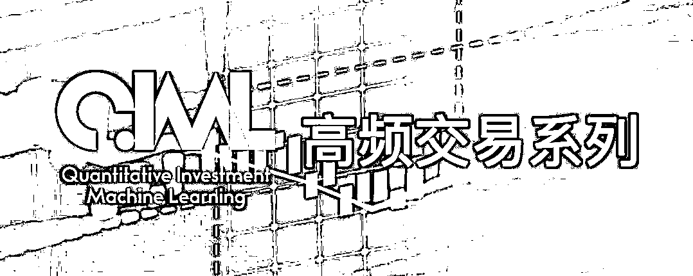
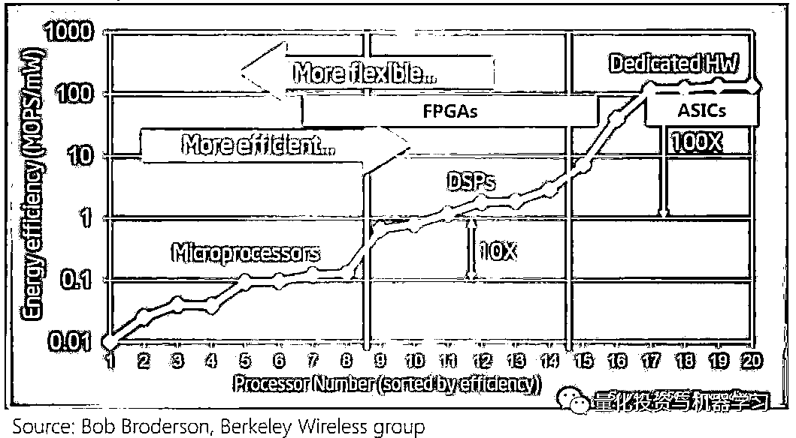
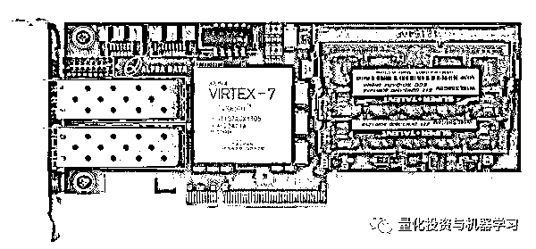

# 高频交易：数学重要？还是技术重要？

> 原文：[`mp.weixin.qq.com/s?__biz=MzAxNTc0Mjg0Mg==&mid=2653294464&idx=1&sn=087776b6fb43a5a8512af5f5b5ada6cd&chksm=802dcd95b75a448348b20b44f3ac67ace96096ada5d58dfdf4997aa5d40e843bfa548ff285b9&scene=27#wechat_redirect`](http://mp.weixin.qq.com/s?__biz=MzAxNTc0Mjg0Mg==&mid=2653294464&idx=1&sn=087776b6fb43a5a8512af5f5b5ada6cd&chksm=802dcd95b75a448348b20b44f3ac67ace96096ada5d58dfdf4997aa5d40e843bfa548ff285b9&scene=27#wechat_redirect)

**标星★公众号     **爱你们♥

作者：Nathan Doromal、1+1=6

**近期原创文章：**

## ♥ [5 种机器学习算法在预测股价的应用（代码+数据）](https://mp.weixin.qq.com/s?__biz=MzAxNTc0Mjg0Mg==&mid=2653290588&idx=1&sn=1d0409ad212ea8627e5d5cedf61953ac&chksm=802dc249b75a4b5fa245433320a4cc9da1a2cceb22df6fb1a28e5b94ff038319ae4e7ec6941f&token=1298662931&lang=zh_CN&scene=21#wechat_redirect)

## ♥ [Two Sigma 用新闻来预测股价走势，带你吊打 Kaggle](https://mp.weixin.qq.com/s?__biz=MzAxNTc0Mjg0Mg==&mid=2653290456&idx=1&sn=b8d2d8febc599742e43ea48e3c249323&chksm=802e3dcdb759b4db9279c689202101b6b154fb118a1c1be12b52e522e1a1d7944858dbd6637e&token=1330520237&lang=zh_CN&scene=21#wechat_redirect)

## ♥ 2 万字干货：[利用深度学习最新前沿预测股价走势](https://mp.weixin.qq.com/s?__biz=MzAxNTc0Mjg0Mg==&mid=2653290080&idx=1&sn=06c50cefe78a7b24c64c4fdb9739c7f3&chksm=802e3c75b759b563c01495d16a638a56ac7305fc324ee4917fd76c648f670b7f7276826bdaa8&token=770078636&lang=zh_CN&scene=21#wechat_redirect)

## ♥ [机器学习在量化金融领域的误用！](http://mp.weixin.qq.com/s?__biz=MzAxNTc0Mjg0Mg==&mid=2653292984&idx=1&sn=3e7efe9fe9452c4a5492d2175b4159ef&chksm=802dcbadb75a42bbdce895c49070c3f552dc8c983afce5eeac5d7c25974b7753e670a0162c89&scene=21#wechat_redirect)

## ♥ [基于 RNN 和 LSTM 的股市预测方法](https://mp.weixin.qq.com/s?__biz=MzAxNTc0Mjg0Mg==&mid=2653290481&idx=1&sn=f7360ea8554cc4f86fcc71315176b093&chksm=802e3de4b759b4f2235a0aeabb6e76b3e101ff09b9a2aa6fa67e6e824fc4274f68f4ae51af95&token=1865137106&lang=zh_CN&scene=21#wechat_redirect)

## ♥ [如何鉴别那些用深度学习预测股价的花哨模型？](https://mp.weixin.qq.com/s?__biz=MzAxNTc0Mjg0Mg==&mid=2653290132&idx=1&sn=cbf1e2a4526e6e9305a6110c17063f46&chksm=802e3c81b759b597d3dd94b8008e150c90087567904a29c0c4b58d7be220a9ece2008956d5db&token=1266110554&lang=zh_CN&scene=21#wechat_redirect)

## ♥ [优化强化学习 Q-learning 算法进行股市](https://mp.weixin.qq.com/s?__biz=MzAxNTc0Mjg0Mg==&mid=2653290286&idx=1&sn=882d39a18018733b93c8c8eac385b515&chksm=802e3d3bb759b42d1fc849f96bf02ae87edf2eab01b0beecd9340112c7fb06b95cb2246d2429&token=1330520237&lang=zh_CN&scene=21#wechat_redirect)

## ♥ [WorldQuant 101 Alpha、国泰君安 191 Alpha](https://mp.weixin.qq.com/s?__biz=MzAxNTc0Mjg0Mg==&mid=2653290927&idx=1&sn=ecca60811da74967f33a00329a1fe66a&chksm=802dc3bab75a4aac2bb4ccff7010063cc08ef51d0bf3d2f71621cdd6adece11f28133a242a15&token=48775331&lang=zh_CN&scene=21#wechat_redirect)

## ♥ [基于回声状态网络预测股票价格（附代码）](https://mp.weixin.qq.com/s?__biz=MzAxNTc0Mjg0Mg==&mid=2653291171&idx=1&sn=485a35e564b45046ff5a07c42bba1743&chksm=802dc0b6b75a49a07e5b91c512c8575104f777b39d0e1d71cf11881502209dc399fd6f641fb1&token=48775331&lang=zh_CN&scene=21#wechat_redirect)

## ♥ [计量经济学应用投资失败的 7 个原因](https://mp.weixin.qq.com/s?__biz=MzAxNTc0Mjg0Mg==&mid=2653292186&idx=1&sn=87501434ae16f29afffec19a6884ee8d&chksm=802dc48fb75a4d99e0172bf484cdbf6aee86e36a95037847fd9f070cbe7144b4617c2d1b0644&token=48775331&lang=zh_CN&scene=21#wechat_redirect)

## ♥ [配对交易千千万，强化学习最 NB！（文档+代码）](http://mp.weixin.qq.com/s?__biz=MzAxNTc0Mjg0Mg==&mid=2653292915&idx=1&sn=13f4ddebcd209b082697a75544852608&chksm=802dcb66b75a4270ceb19fac90eb2a70dc05f5b6daa295a7d31401aaa8697bbb53f5ff7c05af&scene=21#wechat_redirect)

## ♥ [关于高盛在 Github 开源背后的真相！](https://mp.weixin.qq.com/s?__biz=MzAxNTc0Mjg0Mg==&mid=2653291594&idx=1&sn=7703403c5c537061994396e7e49e7ce5&chksm=802dc65fb75a4f49019cec951ac25d30ec7783738e9640ec108be95335597361c427258f5d5f&token=48775331&lang=zh_CN&scene=21#wechat_redirect)

## ♥ [新一代量化带货王诞生！Oh My God！](https://mp.weixin.qq.com/s?__biz=MzAxNTc0Mjg0Mg==&mid=2653291789&idx=1&sn=e31778d1b9372bc7aa6e57b82a69ec6e&chksm=802dc718b75a4e0ea4c022e70ea53f51c48d102ebf7e54993261619c36f24f3f9a5b63437e9e&token=48775331&lang=zh_CN&scene=21#wechat_redirect)

## ♥ [独家！关于定量/交易求职分享（附真实试题）](https://mp.weixin.qq.com/s?__biz=MzAxNTc0Mjg0Mg==&mid=2653291844&idx=1&sn=3fd8b57d32a0ebd43b17fa68ae954471&chksm=802dc751b75a4e4755fcbb0aa228355cebbbb6d34b292aa25b4f3fbd51013fcf7b17b91ddb71&token=48775331&lang=zh_CN&scene=21#wechat_redirect)

## ♥ [Quant 们的身份危机！](https://mp.weixin.qq.com/s?__biz=MzAxNTc0Mjg0Mg==&mid=2653291856&idx=1&sn=729b657ede2cb50c96e92193ab16102d&chksm=802dc745b75a4e53c5018cc1385214233ec4657a3479cd7193c95aaf65642f5f45fa0e465694&token=48775331&lang=zh_CN&scene=21#wechat_redirect)

## ♥ [AQR 最新研究 | 机器能“学习”金融吗？](http://mp.weixin.qq.com/s?__biz=MzAxNTc0Mjg0Mg==&mid=2653292710&idx=1&sn=e5e852de00159a96d5dcc92f349f5b58&chksm=802dcab3b75a43a5492bc98874684081eb5c5666aff32a36a0cdc144d74de0200cc0d997894f&scene=21#wechat_redirect)

各位读者，如果让你回答这个问题：**高频交易：数学重要？还是技术重要？**你觉得哪个重要呢？在这里。我们给大家普及一些涉及高频交易的专业术语：

*   Co-location：主机托管

*   Flash Trading：闪电交易\指令

*   Low Latency：低延迟

*   Liquidity Rebates：流动性佣金返还

*   Matching Engine：撮合引擎

*   Pinging：试单

*   Point of Presence：接入点

*   Predatory Trading：捕食交易

*   Securities Information Processor：证券信息处理器

*   Smart Routers：智能路由

****公众号精选 HFT 文章****

*   **[高频交易报告](https://mp.weixin.qq.com/s?__biz=MzAxNTc0Mjg0Mg==&mid=2653288207&idx=1&sn=1dcf8444154d4d5fccf6c522519bd485&scene=21#wechat_redirect)**

*   **[HFT 的 18 篇论文+15 本书籍+9 篇研报](https://mp.weixin.qq.com/s?__biz=MzAxNTc0Mjg0Mg==&mid=2653290158&idx=1&sn=04553c46d35a8f5554356412017fa64e&scene=21#wechat_redirect)**

*   **[搭建入门级高频交易系统（架构细节分享）](https://mp.weixin.qq.com/s?__biz=MzAxNTc0Mjg0Mg==&mid=2653290615&idx=1&sn=ba1f774031b6dae519f614e7f5cf3141&scene=21#wechat_redirect)**

*   **[全球最知名的十五大高频交易公司大揭秘！](https://mp.weixin.qq.com/s?__biz=MzAxNTc0Mjg0Mg==&mid=2653290153&idx=1&sn=46b4a171d276d199a32faec5fa3fc9b7&scene=21#wechat_redirect)**

*   **[干货！如何获得一份高频交易的工作？](https://mp.weixin.qq.com/s?__biz=MzAxNTc0Mjg0Mg==&mid=2653292527&idx=1&sn=c0225effbc565bc6d82346860f9741b7&scene=21#wechat_redirect)**

*   **[比特币高频交易策略（项目+代码）](https://mp.weixin.qq.com/s?__biz=MzAxNTc0Mjg0Mg==&mid=2653288600&idx=1&sn=5d168ee620f1c91537807e34098acafc&scene=21#wechat_redirect)**

*   **[基于 ML 的动态高频限价订单簿框架（Tick 数据）](https://mp.weixin.qq.com/s?__biz=MzAxNTc0Mjg0Mg==&mid=2653288278&idx=1&sn=73c6749fa89384391031c78a55768681&scene=21#wechat_redirect)**

*   **[高频价格动态策略](https://mp.weixin.qq.com/s?__biz=MzAxNTc0Mjg0Mg==&mid=2653288413&idx=1&sn=cddb1fbdefbcbd470e539bc030be28df&scene=21#wechat_redirect)** 

****速度游戏****

**在高频交易（HFT）中，技术几乎是关键。当你在这场玩速度的游戏中，你需要**接近主机（Proximity）**、靠谱的**硬件**和高效的**算法**。**

******▍**Proximity****

**很重要！因为正如你想的那样，你离交易所越近，你就能更快地接收到最新的波动并对其做出反应。**

**巴黎证券交易所几年前搬到了伦敦，更准确地说搬到了巴塞尔登，搬进了一个巨大的仓库。你想知道为什么要这样做吗？因为巴黎证券交易所的主要赞助者都是英国人。在高频交易中，地理位置的临近是至关重要的：**事实上，离金融中心越近，交易的流通速度就越快**（是的，所有交易仍在纳米级上进行）。这就是**托管**的重要性。 **

**例如，有了 MoonX 的托管服务，高频交易将受益于 30 纳秒的优势:在高频交易中，计算机以异乎寻常的速度买卖股票。一些市场，比如纳斯达克，通常会在向这些“交易员”展示订单之前，让他们以 30 毫秒（0.03 秒）的时间快速浏览一下订单。这使得他们能够很快下订单，而且他们知道不久后需求将会强劲。每次操作可以赚几美分，有时一天能赚几百万次。一只行动缓慢的共同基金下了一份购买 5000 股 XYZ 股票的订单。**

**在 30 毫秒时间内：**

*   **订单在发送到整个金融中心之前，会先发送给高频交易员。**

*   **在 H + 50 毫秒的时间里，那些先入之见的高频交易员会以 21.00 美元的价格买进 XYZ 的所有股票，然后涌入购买订单市场。**

*   **在 H + 300 毫秒，执行共同基金的顺序;高频交易商以 21.01 美元的价格出售股票，每股获利 1%，在本案中总共获利 50 美元。**

*   **如果该场景是在 MoonX 托管中心实现的，那么就平均交易规模而言，在高频交易的最大执行性能方面看到有利结果的机会是可能的。**

******▍**硬件****

**非常重要！而且往往是 HFT 策略面临的一个非常复杂的问题。**

**在国内，每快一毫秒（ms）就意味着能够比别人获得更多的机会，同时意味着在这场“负和”的游戏中有更高生存下去的可能。所以这个领域需要的不仅仅是写过几万行高性能 C++编程的人，整个流程还需要很多 hardcore 的 IT 知识和经验，例如 linux kernel tuning，网络硬件延迟的优化，对于海量数据的接收、存贮和读写，并行算法，嵌入式系统，而且越来越多的 shop 采用定制的硬件，因此对于非 x86 系统和处理器的深入了解也是非常有帮助的，比如懂**FPGA**的人（**因为要用到低延迟技术**）：**

****FPGA（Field Programmable Gate Array）**是在 PAL、GAL 等可编程器件的基础上进一步发展的产物。它是作为专用集成电路（ASIC）领域中的一种半定制电路而出现的，既解决了定制电路的不足，又克服了原有可编程器件门电路数有限的缺点。**

****

**不同体系结构性能和灵活性的比较**

****▍FPGA 为什么快？****

**CPU、GPU 都属于冯·诺依曼结构，指令译码执行、共享内存。FPGA 之所以比 CPU 甚至 GPU 能效高，本质上是无指令、无需共享内存的体系结构带来的福利。**

****

**冯氏结构中，由于执行单元（如 CPU 核）可能执行任意指令，就需要有指令存储器、译码器、各种指令的运算器、分支跳转处理逻辑。由于指令流的控制逻辑复杂，不可能有太多条独立的指令流，因此 GPU 使用 SIMD（单指令流多数据流）来让多个执行单元以同样的步调处理不同的数据，CPU 也支持 SIMD 指令。**

**而 **FPGA 每个逻辑单元的功能在重编程（烧写）时就已经确定，不需要指令。****

**冯氏结构中使用内存有两种作用。一是保存状态，二是在执行单元间通信。**

**由于内存是共享的，就需要做访问仲裁；为了利用访问局部性，每个执行单元有一个私有的缓存，这就要维持执行部件间缓存的一致性。**

**对于保存状态的需求，FPGA 中的寄存器和片上内存（BRAM）是属于各自的控制逻辑的，无需不必要的仲裁和缓存。**

**对于通信的需求，FPGA 每个逻辑单元与周围逻辑单元的连接在重编程（烧写）时就已经确定，并不需要通过共享内存来通信。**

********▍****微波塔****

**它们已经变得越来越重要，特别是在跨国交易中。信号不是通过地下光缆发送，而是从一个塔发送到另一个塔，数据包在空气中的传播速度比光纤快（大多数情况下）。** 

**举一个欧美竞争白热化的例子：GetCo 是跟 Citadel 一样在高频领域少林武当级别的公司，他们有一块业务每年稳定盈利 50+ million，突然有段时间这块业务赚不到钱了，这是为什么呢？**原来有家公司花重金铺设了从芝加哥到纽约的微波塔，而微波在空气的转播速度快过光纤传输信号的速度，就这看似微乎其微的差别影响了一大块业务线**。**

**此外，**操作速度也是原始机器温度的函数，这一点也很重要！****

****▍算法效率****

**它是一个深层次的问题。你需要知道简单操作（如乘法和加法）的确切处理速度（除法非常昂贵，应该不惜一切代价避免）。此外，每个操作的累加意意味着你希望你的模型非常简单。**一个使用 500 个特征的模型常常会比一个只使用 3 个特征的模型表现得差**，即使这个模型“更具预测性”。这是因为，**如果你不能成功地根据这些预测采取行动，可预测性就没有任何意义。****

****数学游戏****

**高频交易中有大量的数学运算。请注意，复杂的数学通常包括研究和创建策略。虽然算法需要简单，但研究不必如此（可以很深入）。**

**在基础层面上，有古典统计学，你需要对所有假设进行彻底审核。**金融****数据噪声非常大，在前期研究分析时，需要非常小心！****

******▍**机器学习（Machine Learning）****

**通常，机器学习应用高频交易意味着线性模型上运行复杂的静态拟合。比如支持向量机（SVM）和神经网络通常很难应用，很大程度上是因为市场噪声太大。在样本内/样本外方法之外，围绕目标函数有很多可以研究的地方。**

****▍目标函数****

**几乎所有的机器学习算法最后都归结为求解最优化问题，以达到我们想让算法达到的目标。为了完成某一目标，需要构造出一个“目标函数”来，然后让该函数取极大值或极小值，从而得到机器学习算法的模型参数。如何构造出一个合理的目标函数，是建立机器学习算法的关键，一旦目标函数确定，接下来就是求解最优化问题。**

**关于目标，你必须知道你要预测什么。你是否选择在未来 5 分钟后买进某一期货合约？下 1 笔交易单，还是 10 笔？使用当日成交价格还是其他？等等······**

**目标函数是用于优化的函数。在经典 OLS 中，目标函数很简单：**

****

**然而 Lasso（回归模型）最后使用了这个目标函数：**

****

**目标函数在拟合、过拟合和欠拟合方面都非常重要。Lasso 很好，是因为它只能从你的特征集中挑出少量的特征，所以，如果你有 500 多个特征，也许返回 5 个返回非零值（这是因为绝对值在 0 时不可微）。然而，**如何处理离群值（Outliers）和高度相关的变量，也是我们需要面临的困难。****

****▍风险管理****

**在数学中，另一部分主要是涉及风险管理。风险管理通常可以分解为一个线性代数问题。作为一名交易员/量化研究员，你的目标不仅仅是最大化 PnL，还要确保你的投资组合在任何一天都不会爆仓。一个有用的策略是使用常见的市场指数对冲你的投资组合。**

****其他的游戏****

**市场上许多参与者的目标是利用各种各样的技术操纵市场。例如，一些经验丰富的投资者可能会意识到市场“过于脆弱”，因此买入一些股票，看到市场反应过度，然后以更高的价格卖出。更复杂的策略包括使用交易所提供的多样化订单类型，利用**交易所的微观结****构**等。**

**在这个微观结构里面，包括你的交易过程怎么做，交易成本，还有交易价格的发现，交易量的流动性等等，当然你还可以看出一些交易行为，包括内部交易、操作市场，另外是交易的监管信息披露。比如利用交易所的微观结构数据（每一次下单、执行和取消，从而可以基于历史数据做到几乎完全重建整个订单）、基于机器学习的订单簿高频交易策略等等。**

****总结****

**高频交易策略包括一定程度的速度、数学模型和市场博弈。一些策略是高度专注于快速交易，而另一些策略则利用了市场的特征，但总体而言，成功的高频交易机构对在些方面都非常精通。**

**看完此文，此刻，你有你心中的答案了吗？**欢迎留言！****

***—End—***

**量化投资与机器学习微信公众号，是业内垂直于**Quant**、**MFE**、**CST、AI**等专业的**主****流量化自媒体**。公众号拥有来自**公募、私募、券商、银行、海外**等众多圈内**18W+**关注者。每日发布行业前沿研究成果和最新量化资讯。**

******你点的每个“在看”，就是对我们的肯定**