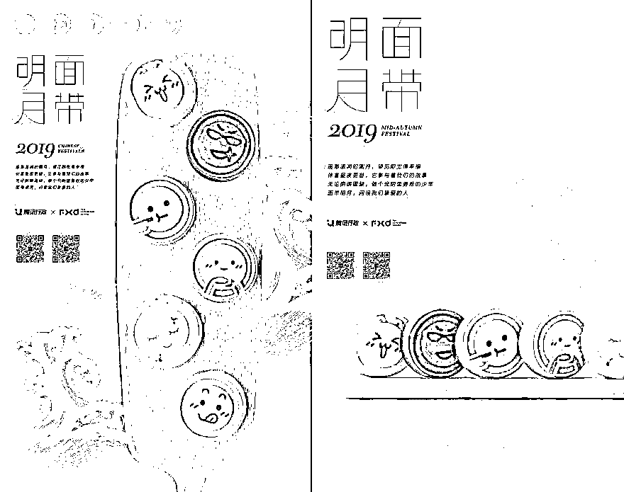
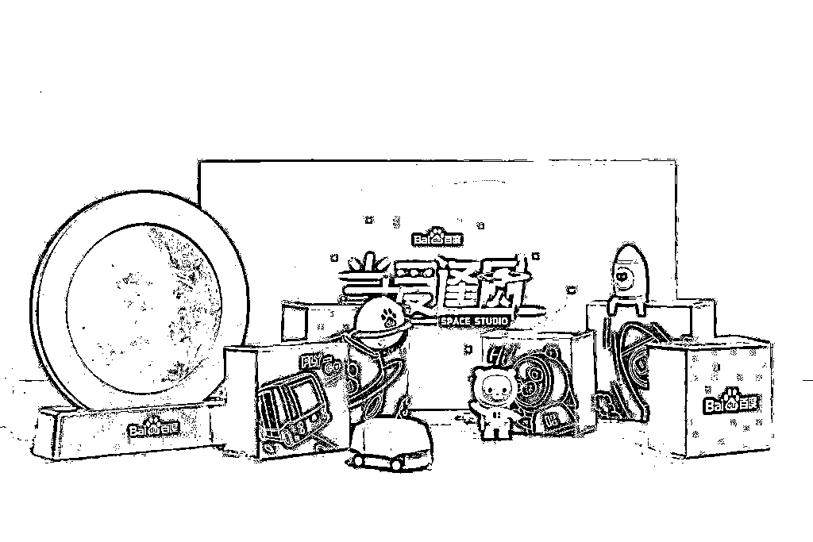
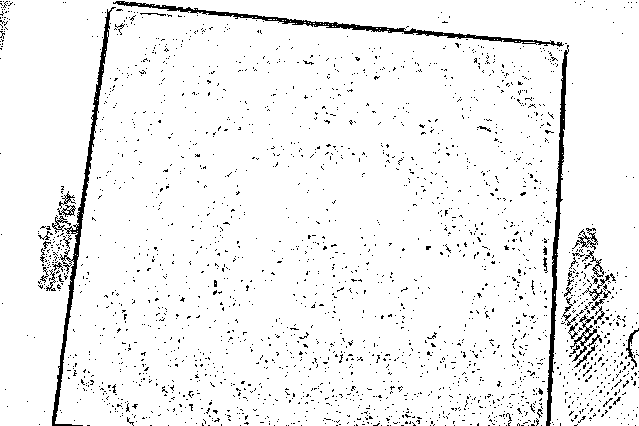
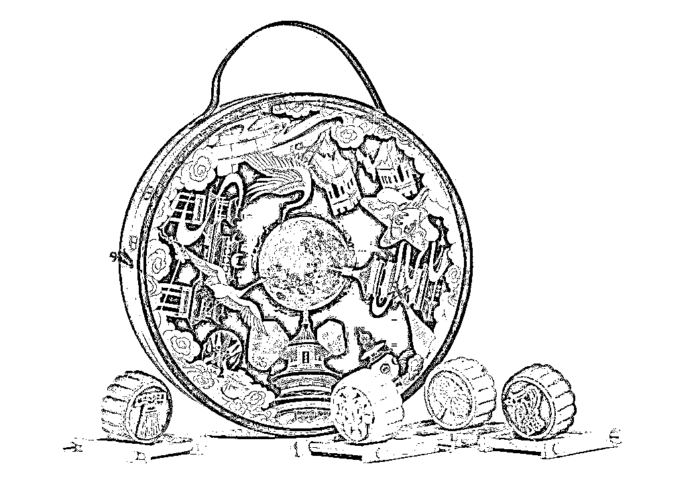
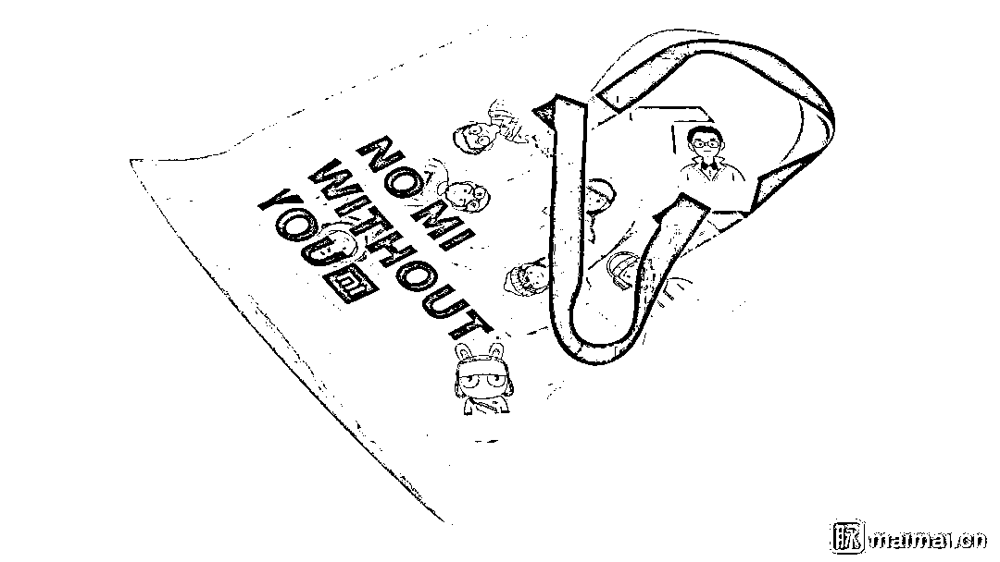
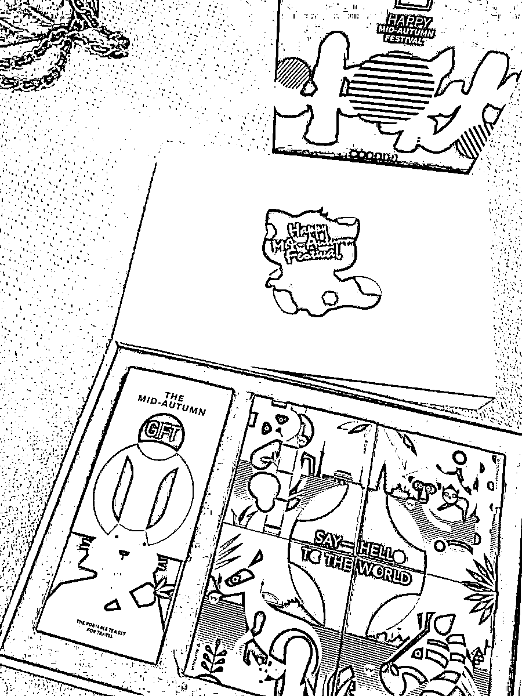
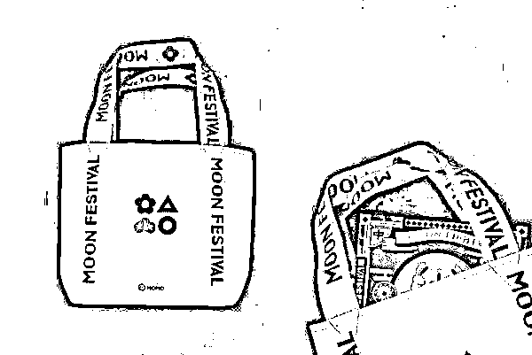
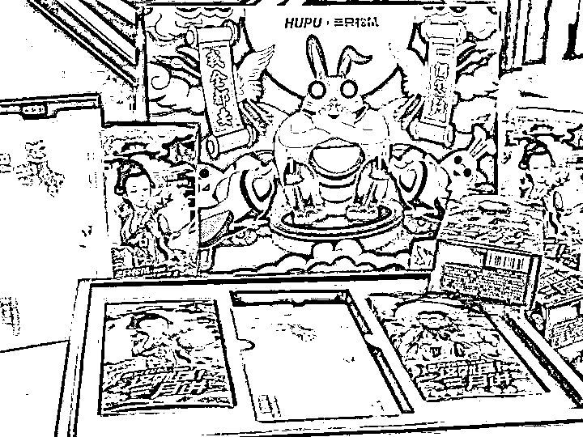
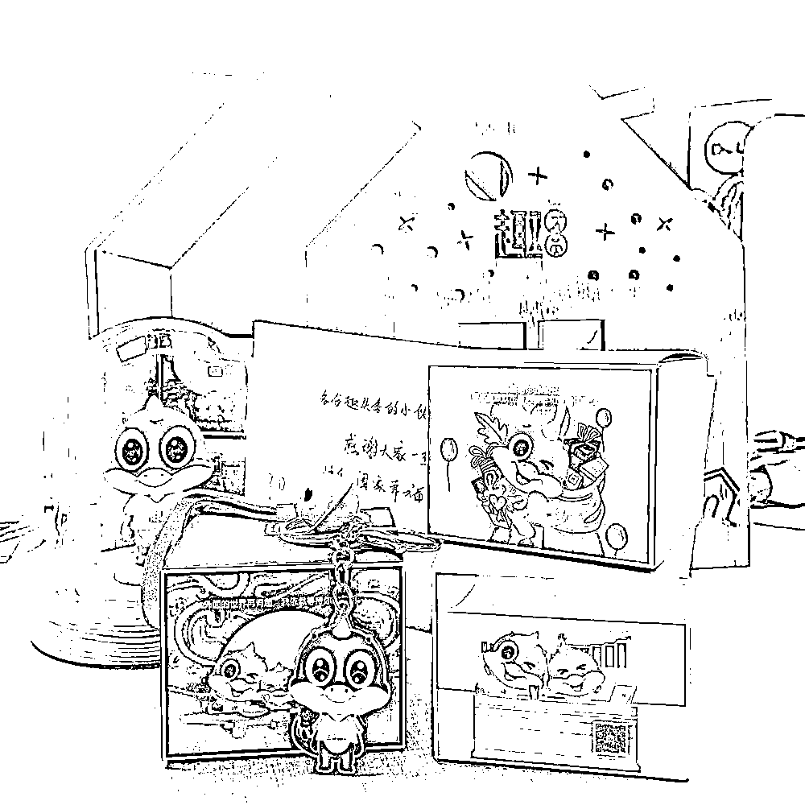
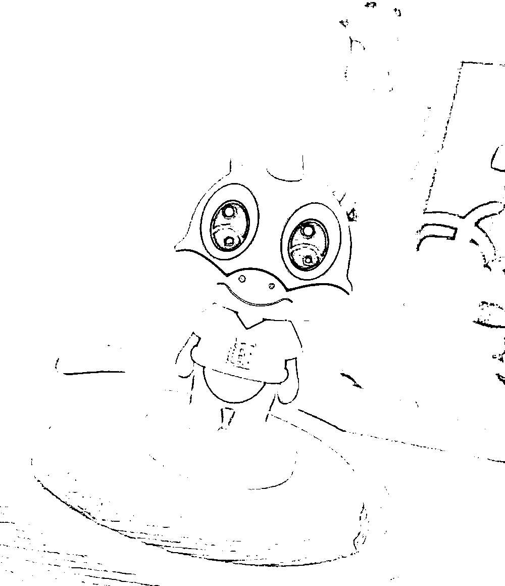

# 二千零一十九、互联网月饼哪家强？

> 原文：[`mp.weixin.qq.com/s?__biz=MzAxNTc0Mjg0Mg==&mid=2653294452&idx=1&sn=0542fbe7fec4af84b2789ca164217adb&chksm=802dcd61b75a4477411184ae4b7b7aee37ccce00e82de557163545a167d052a4c95358d506ae&scene=27#wechat_redirect`](http://mp.weixin.qq.com/s?__biz=MzAxNTc0Mjg0Mg==&mid=2653294452&idx=1&sn=0542fbe7fec4af84b2789ca164217adb&chksm=802dcd61b75a4477411184ae4b7b7aee37ccce00e82de557163545a167d052a4c95358d506ae&scene=27#wechat_redirect)

**标星★公众号     **爱你们♥

程序猿 | 整编

图片素材 | 脉脉、知乎、官方微博等

**近期原创文章：**

## ♥ [5 种机器学习算法在预测股价的应用（代码+数据）](https://mp.weixin.qq.com/s?__biz=MzAxNTc0Mjg0Mg==&mid=2653290588&idx=1&sn=1d0409ad212ea8627e5d5cedf61953ac&chksm=802dc249b75a4b5fa245433320a4cc9da1a2cceb22df6fb1a28e5b94ff038319ae4e7ec6941f&token=1298662931&lang=zh_CN&scene=21#wechat_redirect)

## ♥ [Two Sigma 用新闻来预测股价走势，带你吊打 Kaggle](https://mp.weixin.qq.com/s?__biz=MzAxNTc0Mjg0Mg==&mid=2653290456&idx=1&sn=b8d2d8febc599742e43ea48e3c249323&chksm=802e3dcdb759b4db9279c689202101b6b154fb118a1c1be12b52e522e1a1d7944858dbd6637e&token=1330520237&lang=zh_CN&scene=21#wechat_redirect)

## ♥ 2 万字干货：[利用深度学习最新前沿预测股价走势](https://mp.weixin.qq.com/s?__biz=MzAxNTc0Mjg0Mg==&mid=2653290080&idx=1&sn=06c50cefe78a7b24c64c4fdb9739c7f3&chksm=802e3c75b759b563c01495d16a638a56ac7305fc324ee4917fd76c648f670b7f7276826bdaa8&token=770078636&lang=zh_CN&scene=21#wechat_redirect)

## ♥ [机器学习在量化金融领域的误用！](http://mp.weixin.qq.com/s?__biz=MzAxNTc0Mjg0Mg==&mid=2653292984&idx=1&sn=3e7efe9fe9452c4a5492d2175b4159ef&chksm=802dcbadb75a42bbdce895c49070c3f552dc8c983afce5eeac5d7c25974b7753e670a0162c89&scene=21#wechat_redirect)

## ♥ [基于 RNN 和 LSTM 的股市预测方法](https://mp.weixin.qq.com/s?__biz=MzAxNTc0Mjg0Mg==&mid=2653290481&idx=1&sn=f7360ea8554cc4f86fcc71315176b093&chksm=802e3de4b759b4f2235a0aeabb6e76b3e101ff09b9a2aa6fa67e6e824fc4274f68f4ae51af95&token=1865137106&lang=zh_CN&scene=21#wechat_redirect)

## ♥ [如何鉴别那些用深度学习预测股价的花哨模型？](https://mp.weixin.qq.com/s?__biz=MzAxNTc0Mjg0Mg==&mid=2653290132&idx=1&sn=cbf1e2a4526e6e9305a6110c17063f46&chksm=802e3c81b759b597d3dd94b8008e150c90087567904a29c0c4b58d7be220a9ece2008956d5db&token=1266110554&lang=zh_CN&scene=21#wechat_redirect)

## ♥ [优化强化学习 Q-learning 算法进行股市](https://mp.weixin.qq.com/s?__biz=MzAxNTc0Mjg0Mg==&mid=2653290286&idx=1&sn=882d39a18018733b93c8c8eac385b515&chksm=802e3d3bb759b42d1fc849f96bf02ae87edf2eab01b0beecd9340112c7fb06b95cb2246d2429&token=1330520237&lang=zh_CN&scene=21#wechat_redirect)

## ♥ [WorldQuant 101 Alpha、国泰君安 191 Alpha](https://mp.weixin.qq.com/s?__biz=MzAxNTc0Mjg0Mg==&mid=2653290927&idx=1&sn=ecca60811da74967f33a00329a1fe66a&chksm=802dc3bab75a4aac2bb4ccff7010063cc08ef51d0bf3d2f71621cdd6adece11f28133a242a15&token=48775331&lang=zh_CN&scene=21#wechat_redirect)

## ♥ [基于回声状态网络预测股票价格（附代码）](https://mp.weixin.qq.com/s?__biz=MzAxNTc0Mjg0Mg==&mid=2653291171&idx=1&sn=485a35e564b45046ff5a07c42bba1743&chksm=802dc0b6b75a49a07e5b91c512c8575104f777b39d0e1d71cf11881502209dc399fd6f641fb1&token=48775331&lang=zh_CN&scene=21#wechat_redirect)

## ♥ [计量经济学应用投资失败的 7 个原因](https://mp.weixin.qq.com/s?__biz=MzAxNTc0Mjg0Mg==&mid=2653292186&idx=1&sn=87501434ae16f29afffec19a6884ee8d&chksm=802dc48fb75a4d99e0172bf484cdbf6aee86e36a95037847fd9f070cbe7144b4617c2d1b0644&token=48775331&lang=zh_CN&scene=21#wechat_redirect)

## ♥ [配对交易千千万，强化学习最 NB！（文档+代码）](http://mp.weixin.qq.com/s?__biz=MzAxNTc0Mjg0Mg==&mid=2653292915&idx=1&sn=13f4ddebcd209b082697a75544852608&chksm=802dcb66b75a4270ceb19fac90eb2a70dc05f5b6daa295a7d31401aaa8697bbb53f5ff7c05af&scene=21#wechat_redirect)

## ♥ [关于高盛在 Github 开源背后的真相！](https://mp.weixin.qq.com/s?__biz=MzAxNTc0Mjg0Mg==&mid=2653291594&idx=1&sn=7703403c5c537061994396e7e49e7ce5&chksm=802dc65fb75a4f49019cec951ac25d30ec7783738e9640ec108be95335597361c427258f5d5f&token=48775331&lang=zh_CN&scene=21#wechat_redirect)

## ♥ [新一代量化带货王诞生！Oh My God！](https://mp.weixin.qq.com/s?__biz=MzAxNTc0Mjg0Mg==&mid=2653291789&idx=1&sn=e31778d1b9372bc7aa6e57b82a69ec6e&chksm=802dc718b75a4e0ea4c022e70ea53f51c48d102ebf7e54993261619c36f24f3f9a5b63437e9e&token=48775331&lang=zh_CN&scene=21#wechat_redirect)

## ♥ [独家！关于定量/交易求职分享（附真实试题）](https://mp.weixin.qq.com/s?__biz=MzAxNTc0Mjg0Mg==&mid=2653291844&idx=1&sn=3fd8b57d32a0ebd43b17fa68ae954471&chksm=802dc751b75a4e4755fcbb0aa228355cebbbb6d34b292aa25b4f3fbd51013fcf7b17b91ddb71&token=48775331&lang=zh_CN&scene=21#wechat_redirect)

## ♥ [Quant 们的身份危机！](https://mp.weixin.qq.com/s?__biz=MzAxNTc0Mjg0Mg==&mid=2653291856&idx=1&sn=729b657ede2cb50c96e92193ab16102d&chksm=802dc745b75a4e53c5018cc1385214233ec4657a3479cd7193c95aaf65642f5f45fa0e465694&token=48775331&lang=zh_CN&scene=21#wechat_redirect)

## ♥ [AQR 最新研究 | 机器能“学习”金融吗？](http://mp.weixin.qq.com/s?__biz=MzAxNTc0Mjg0Mg==&mid=2653292710&idx=1&sn=e5e852de00159a96d5dcc92f349f5b58&chksm=802dcab3b75a43a5492bc98874684081eb5c5666aff32a36a0cdc144d74de0200cc0d997894f&scene=21#wechat_redirect)

**公众号祝大家中秋节快乐！**

今天，我们为大家收集了各大互联网企业的月饼，让我们一起来看看今年的月饼哪家强！

阿里巴巴

首先出场的是阿里巴巴，每年阿里的月饼包装都是橙色为主调，主题为“在一起”的情怀路线，而且今年还融入了阿里巴巴成立 20 周年的元素。

25 个动物形象棋子代表阿里旗下的每个品牌，寓意“其（棋）乐融融”，细心的人会发现棋盘上刚好有 102 步，代表当阿里巴巴 102 岁时，公司刚好跨越 3 个世纪。 

腾讯

腾讯今年的月饼主题为：“面带明月”，走的是简约路线，单从包装看，确实没啥看点。

打开之后还是挺惊喜的，每一个月饼的造型都是一个表情包，分别憧憬、馋、可爱、害羞、乐、得意。

都是快乐的表情呢？不过猿妹更想看到这个表情：

百度

百度的月饼主题“当爱逢圆”，爱意为“AI”，主打科技感呼应了百度往 AI 发展的战略。

不过百度的月饼可不止一款，比如月光宝盒系列，滚烫的金色封印，让人感觉真土豪。

还有送给合作伙伴音乐盒手办月饼，萌萌的玩偶，看起来也是很讨喜。 

京东

京东今年月饼的主题是：“喜乐常在，月满京东”，内置三种口味的月饼，一个钥匙链，一个音乐盒，里面是勃拉姆斯的摇篮曲，盒子上是京东狗。

浪潮

浪潮是今年的新朋友啦，他们的月饼礼盒延续了一贯的“黑又酷”风格。

礼盒表面是一道飘逸潇洒的金色海浪，海浪间一群翱翔其中的海燕，打开礼盒，会看到浪潮所在的城市的剪影和一樽明月。

礼盒包括六个月饼一盒白桃乌龙茶还有一个可爱的浪潮吉祥物手办， 可以说酷萌酷萌的。

月饼有精选蛋黄莲蓉月饼、桃山红酒蔓越莓月饼、粒粒红豆月饼、桃山抹茶月饼、巧克力流心月饼、加州紫薯月饼六种口味，甜而不腻。

白桃乌龙茶泡开后，可以吃到饱满的桃肉。

知乎

知乎今年月饼的主题是：去月球做客，六角登月舱的三个舱体，分别载有六块月饼。每个细节都在体现知乎的 slogan：有问题，上知乎。

享用完 4 种口味的月饼之后，舱体月饼盒还能当收纳盒，既贴心又环保。 

字节跳动

今年字节跳动的月饼礼盒真是把中国风体现的淋漓尽致，包含：仙鹤、祥云、脸谱、长城、古建筑、灯笼等元素的结合。

这品相真是深得猿妹喜爱。

小米

小米今年的主题是：NO MI WITHOUT YOU，外包装采用新潮的橙色透明手提包，月饼用铁盒装，5 种宇航员款式+1 种隐藏款，很有程序猿风格。

但是，限量版盲盒包含 6 款手办，每人只能有一个，都好想要的人怎么办呢？  

抖音

抖音中秋礼盒外包装采用镭射反光图案，拨动转盘就能看到玉兔奔月的场景，不愧是做短视频的，连细节都把握的这么酷。

西瓜视频

西瓜视频走的是大红的传统风，整体以红色为主色调，看上去非常喜庆。

YY 直播

YY 今年依然采用黑色和金色为主调，十分的高贵大气。

小红书

小红书今年月饼的主题是：“月发美好”，礼盒是采用白色透明袋作为外包装，打开会看到像抽屉的礼盒上放着一个大白圆球。

实际上，这个小圆球才是最令人惊喜的部分，它有啥用处呢？能带你赏月吖~

网易游戏

网易游戏的中秋礼盒设计成游戏机的造型，别有新意，而且这个月饼礼盒不仅可以玩游戏，还能吃月饼，吃完月饼还教你垃圾分类，这么贴心的公司哪里找。

网易严选

网易严选的包装青红搭配，内里月饼和小罐茶更配哦。

美团

美团今年中秋礼盒的主题是：最美的团圆，礼盒整体做成了自家 APP 的样式。

而且还有一封 CEO 王兴的信给你哦~。  

迅雷

今年迅雷的中秋礼盒，带上了迅雷大厦，内含 6 种口味香格里拉高定月饼。

携程

今年貌似好多企业都在强调科技感，向往外太空，携程也不例外，勋章、地球仪、望远万花筒和宇航员都有了。

OPPO

OPPO 今年月饼主题是：皓月当空，团圆中秋月，礼盒内包含三种不同口味的月饼和大麦茶。

vivo

vivo 今年的月饼礼盒未免太好看了吧，而且今年 vivo 不止一款月饼，除了下面你们看到的这款，还有一黑色礼盒包装的“月光礼盒”

另外一款是长这样的，中间的圆圈是可以发光的，是不是很酷：

Bilibili

哔哩哔哩今年搞了个变形飞船！有创意的同时兼具科技感，而且不忘广大女性同胞，贴心献上眼影键盘

陌陌

陌陌今年的月饼礼盒浓浓的几何画风，色彩丰富，现代与传统结合，长相普通却又耐用的手提袋，也是好评呢。

虎扑

虎扑今年的月饼是联合三只松鼠推出，据说除了月饼之外，还有螃蟹券呢！

虎牙

整体以黄色为主色调，虎牙的中秋礼盒很时尚很潮流。包装里不仅有月饼，还有一副国际象棋，很国际化。

快手

快手今年月饼的主题是：月过中秋，快人一步，靛蓝珠光纸上印着烫金的快手 logo，正中间装饰着传统的火漆印，月饼礼盒还算中规中矩。

爱奇艺

爱奇艺今年中秋送的是月饼扭蛋机，吃不吃月饼都无所谓，最要得好玩。

斗鱼

顺丰

今年顺丰就更牛逼了，中秋直接送车模。

酷狗音乐

滴滴

谁能想到滴滴今年的月饼，真的就只有月饼，还好滴滴图案的丝巾打包月饼礼盒，看起来还算好看。

站酷

站酷网 13 周年纪念中秋礼盒，黑金雕花，高贵不失优雅，点线成月。

猎聘网

猎聘网今年月饼的颜值也是十分可爱的，加州奶油提子、秘制牛肉、桂花龙井、蛋黄莲蓉看起来就很好。

趣头条

趣头条的礼盒造型是一个小房子，打开房门，你就能看到月饼、公仔还有钥匙扣。

WPS Office

WPS Office 今年的月饼真是宇宙第一大直男月饼，没有之一！！！

程序员必备的双肩包，传统红色金属礼盒装的月饼。

快看漫画

快看漫画的这个文案，猿妹看了咋有点小感动呢：一起走过的路，每一步都算数，好吧，其实让我感动的是这句话下面的购物卡。

西山居

西山居今年和稻香村出了剑网 3IP 合作款月饼，好吃好玩又实用，传统纸雕，仿唐宫灯好不创意。

4399

4399 今年月饼的主题是：星海之行，始于明月，乐享中秋，久久陪伴。

软通动力

软通动力的月饼也很精致，吉祥物造型的月饼加上乐高公仔，这下不仅有的吃，还有的玩了。

华为

华为今年的月饼不但精美还实用，收纳盒+高颜值星空碗，好赞~~~  

脉脉

今年脉脉其中一款月饼是“职场大富翁”，除了月饼外，里面还有一套职场桌游，互动性很强哦~

花椒直播

花椒的月饼设计有点新潮，但是瞧着咋有点不敢吃呢~

大厂们都在节日礼盒上下足了功夫，你觉得以上哪家公司的月饼礼盒最有创意？或者说说你们公司在中秋节都有哪些小惊喜吧。

**—*End—*

量化投资与机器学习微信公众号，是业内垂直于**Quant**、**MFE**、**CST、AI**等专业的**主****流量化自媒体**。公众号拥有来自**公募、私募、券商、银行、海外**等众多圈内**18W+**关注者。每日发布行业前沿研究成果和最新量化资讯。

你点的每个“在看”，就是对我们的肯定