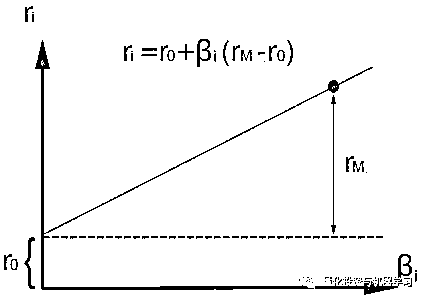
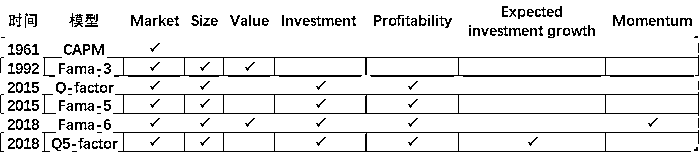
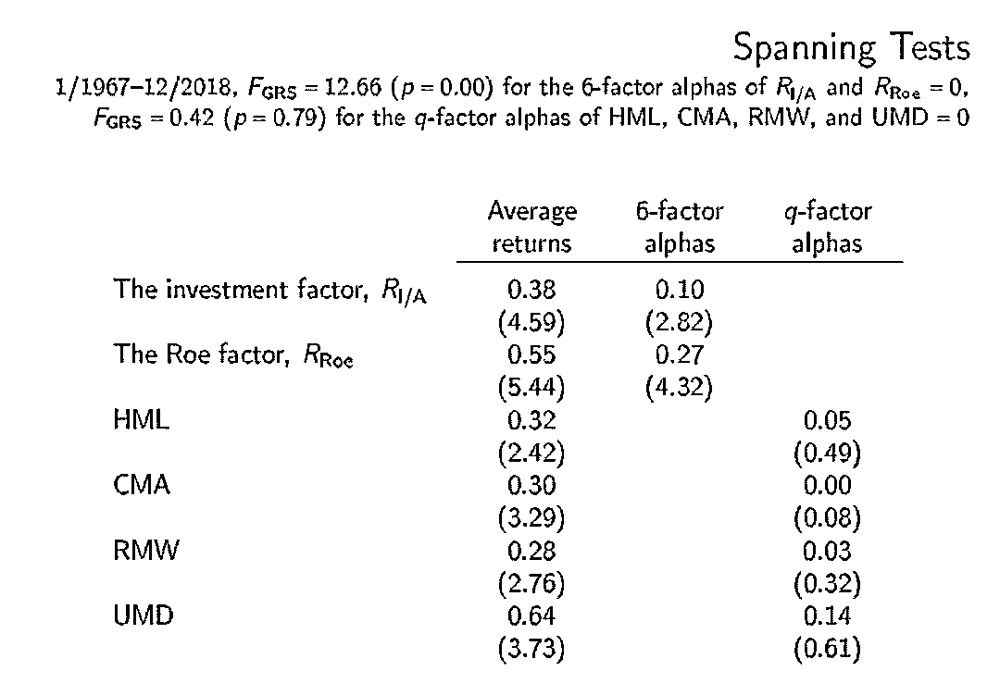
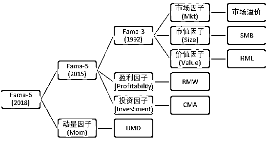
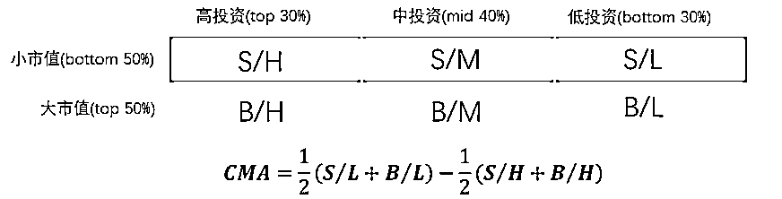
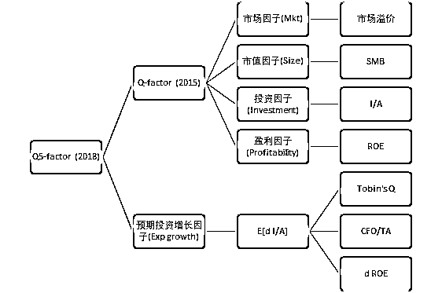
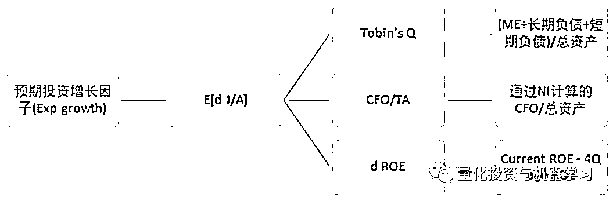
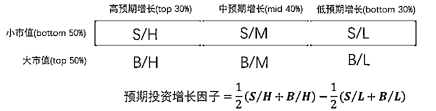
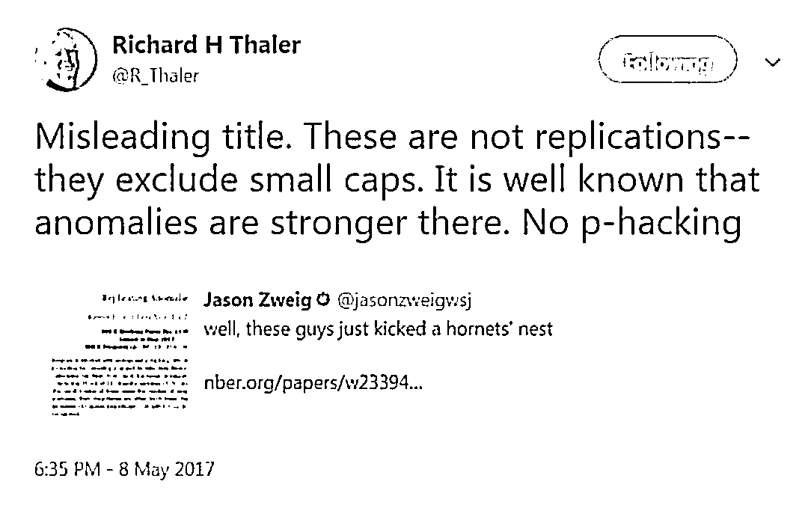
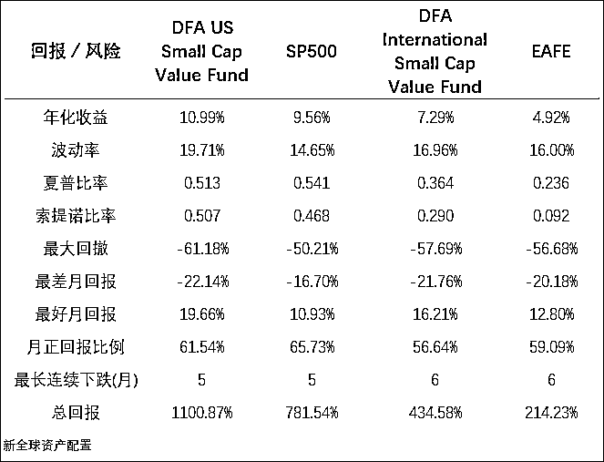

# 因子战国：q-factor 模型的五大讨论！

> 原文：[`mp.weixin.qq.com/s?__biz=MzAxNTc0Mjg0Mg==&mid=2653294446&idx=1&sn=6b55ea188989508c1785b4fa749da652&chksm=802dcd7bb75a446d1edd2570a6cee9e8d21894a74b6ada35edf2e61bcfa20cfa5135ee15c215&scene=27#wechat_redirect`](http://mp.weixin.qq.com/s?__biz=MzAxNTc0Mjg0Mg==&mid=2653294446&idx=1&sn=6b55ea188989508c1785b4fa749da652&chksm=802dcd7bb75a446d1edd2570a6cee9e8d21894a74b6ada35edf2e61bcfa20cfa5135ee15c215&scene=27#wechat_redirect)

**标星★公众号     **爱你们♥

编辑 | 徐杨   陈庆炜

**近期原创文章：**

## ♥ [5 种机器学习算法在预测股价的应用（代码+数据）](https://mp.weixin.qq.com/s?__biz=MzAxNTc0Mjg0Mg==&mid=2653290588&idx=1&sn=1d0409ad212ea8627e5d5cedf61953ac&chksm=802dc249b75a4b5fa245433320a4cc9da1a2cceb22df6fb1a28e5b94ff038319ae4e7ec6941f&token=1298662931&lang=zh_CN&scene=21#wechat_redirect)

## ♥ [Two Sigma 用新闻来预测股价走势，带你吊打 Kaggle](https://mp.weixin.qq.com/s?__biz=MzAxNTc0Mjg0Mg==&mid=2653290456&idx=1&sn=b8d2d8febc599742e43ea48e3c249323&chksm=802e3dcdb759b4db9279c689202101b6b154fb118a1c1be12b52e522e1a1d7944858dbd6637e&token=1330520237&lang=zh_CN&scene=21#wechat_redirect)

## ♥ 2 万字干货：[利用深度学习最新前沿预测股价走势](https://mp.weixin.qq.com/s?__biz=MzAxNTc0Mjg0Mg==&mid=2653290080&idx=1&sn=06c50cefe78a7b24c64c4fdb9739c7f3&chksm=802e3c75b759b563c01495d16a638a56ac7305fc324ee4917fd76c648f670b7f7276826bdaa8&token=770078636&lang=zh_CN&scene=21#wechat_redirect)

## ♥ [机器学习在量化金融领域的误用！](http://mp.weixin.qq.com/s?__biz=MzAxNTc0Mjg0Mg==&mid=2653292984&idx=1&sn=3e7efe9fe9452c4a5492d2175b4159ef&chksm=802dcbadb75a42bbdce895c49070c3f552dc8c983afce5eeac5d7c25974b7753e670a0162c89&scene=21#wechat_redirect)

## ♥ [基于 RNN 和 LSTM 的股市预测方法](https://mp.weixin.qq.com/s?__biz=MzAxNTc0Mjg0Mg==&mid=2653290481&idx=1&sn=f7360ea8554cc4f86fcc71315176b093&chksm=802e3de4b759b4f2235a0aeabb6e76b3e101ff09b9a2aa6fa67e6e824fc4274f68f4ae51af95&token=1865137106&lang=zh_CN&scene=21#wechat_redirect)

## ♥ [如何鉴别那些用深度学习预测股价的花哨模型？](https://mp.weixin.qq.com/s?__biz=MzAxNTc0Mjg0Mg==&mid=2653290132&idx=1&sn=cbf1e2a4526e6e9305a6110c17063f46&chksm=802e3c81b759b597d3dd94b8008e150c90087567904a29c0c4b58d7be220a9ece2008956d5db&token=1266110554&lang=zh_CN&scene=21#wechat_redirect)

## ♥ [优化强化学习 Q-learning 算法进行股市](https://mp.weixin.qq.com/s?__biz=MzAxNTc0Mjg0Mg==&mid=2653290286&idx=1&sn=882d39a18018733b93c8c8eac385b515&chksm=802e3d3bb759b42d1fc849f96bf02ae87edf2eab01b0beecd9340112c7fb06b95cb2246d2429&token=1330520237&lang=zh_CN&scene=21#wechat_redirect)

## ♥ [WorldQuant 101 Alpha、国泰君安 191 Alpha](https://mp.weixin.qq.com/s?__biz=MzAxNTc0Mjg0Mg==&mid=2653290927&idx=1&sn=ecca60811da74967f33a00329a1fe66a&chksm=802dc3bab75a4aac2bb4ccff7010063cc08ef51d0bf3d2f71621cdd6adece11f28133a242a15&token=48775331&lang=zh_CN&scene=21#wechat_redirect)

## ♥ [基于回声状态网络预测股票价格（附代码）](https://mp.weixin.qq.com/s?__biz=MzAxNTc0Mjg0Mg==&mid=2653291171&idx=1&sn=485a35e564b45046ff5a07c42bba1743&chksm=802dc0b6b75a49a07e5b91c512c8575104f777b39d0e1d71cf11881502209dc399fd6f641fb1&token=48775331&lang=zh_CN&scene=21#wechat_redirect)

## ♥ [计量经济学应用投资失败的 7 个原因](https://mp.weixin.qq.com/s?__biz=MzAxNTc0Mjg0Mg==&mid=2653292186&idx=1&sn=87501434ae16f29afffec19a6884ee8d&chksm=802dc48fb75a4d99e0172bf484cdbf6aee86e36a95037847fd9f070cbe7144b4617c2d1b0644&token=48775331&lang=zh_CN&scene=21#wechat_redirect)

## ♥ [配对交易千千万，强化学习最 NB！（文档+代码）](http://mp.weixin.qq.com/s?__biz=MzAxNTc0Mjg0Mg==&mid=2653292915&idx=1&sn=13f4ddebcd209b082697a75544852608&chksm=802dcb66b75a4270ceb19fac90eb2a70dc05f5b6daa295a7d31401aaa8697bbb53f5ff7c05af&scene=21#wechat_redirect)

## ♥ [关于高盛在 Github 开源背后的真相！](https://mp.weixin.qq.com/s?__biz=MzAxNTc0Mjg0Mg==&mid=2653291594&idx=1&sn=7703403c5c537061994396e7e49e7ce5&chksm=802dc65fb75a4f49019cec951ac25d30ec7783738e9640ec108be95335597361c427258f5d5f&token=48775331&lang=zh_CN&scene=21#wechat_redirect)

## ♥ [新一代量化带货王诞生！Oh My God！](https://mp.weixin.qq.com/s?__biz=MzAxNTc0Mjg0Mg==&mid=2653291789&idx=1&sn=e31778d1b9372bc7aa6e57b82a69ec6e&chksm=802dc718b75a4e0ea4c022e70ea53f51c48d102ebf7e54993261619c36f24f3f9a5b63437e9e&token=48775331&lang=zh_CN&scene=21#wechat_redirect)

## ♥ [独家！关于定量/交易求职分享（附真实试题）](https://mp.weixin.qq.com/s?__biz=MzAxNTc0Mjg0Mg==&mid=2653291844&idx=1&sn=3fd8b57d32a0ebd43b17fa68ae954471&chksm=802dc751b75a4e4755fcbb0aa228355cebbbb6d34b292aa25b4f3fbd51013fcf7b17b91ddb71&token=48775331&lang=zh_CN&scene=21#wechat_redirect)

## ♥ [Quant 们的身份危机！](https://mp.weixin.qq.com/s?__biz=MzAxNTc0Mjg0Mg==&mid=2653291856&idx=1&sn=729b657ede2cb50c96e92193ab16102d&chksm=802dc745b75a4e53c5018cc1385214233ec4657a3479cd7193c95aaf65642f5f45fa0e465694&token=48775331&lang=zh_CN&scene=21#wechat_redirect)

## ♥ [AQR 最新研究 | 机器能“学习”金融吗？](http://mp.weixin.qq.com/s?__biz=MzAxNTc0Mjg0Mg==&mid=2653292710&idx=1&sn=e5e852de00159a96d5dcc92f349f5b58&chksm=802dcab3b75a43a5492bc98874684081eb5c5666aff32a36a0cdc144d74de0200cc0d997894f&scene=21#wechat_redirect)

**采访前言**

金融圈里，大家一直在探索一个问题，那就是：什么因素能驱动股票带来长期回报？在市场有效的情况下，要想获得超额收益，就要承担更多的风险，但在承担风险之前，我们必须要搞清楚，承担这份风险为什么能带来超额收益。因而在学术界，研究者们也一直在探究：到底要承担什么风险，才能带来超额收益？

学术界里，第一个解释股票回报的驱动因子的模型是 CAPM（资本资产定价模型），CAPM 模型把市场上股票的风险都归结为一个风险因子——Beta。Beta 是由资产与市场的协方差和资产的波动率构成的函数，可以用来衡量某资产的报酬率与市场组合之间的相关性，简而言之，在股票市场，就是市场变动一个单位时，你手中股票的变动幅度，比如市场涨 1%，你的股票涨了 2%，那 Beta 就是 2。虽然 CAPM 模型非常简单，但却很好地揭示了市场风险与资产回报的关系。

CAPM 模型  

根据 CAPM 模型，如上图所示，高 Beta 的股票因为承担的市场风险更大，所以拥有超出市场收益的回报，即超额收益。尽管这个模型符合许多研究理论，但它却有个致命的问题：CAPM 模型在实践中不管用。实际上，高 Beta 股票的表现并没有超出市场回报。

90 年代初期，Eugene Fama 和 Ken French（Fama-French）发表了经典的三因子模型，在 CAPM 中加入了市值和价值两个维度作为风险因子。他们发现，小盘股和比较便宜的股票能长期产生超额收益，因为它们承担了更高的市场风险。三因子模型重新审视了 CAPM 模型，并且比 CAPM 更好地解释了长期股票收益的驱动因素。此后，Fama-French 继续改善三因子模型，又添加了投资和盈利两个因子。

许多学者一直在持续搜寻能更好解释股票长期回报的因子，希望能对 Fama-French 的研究进行改进。张橹教授及其团队，便是这些学者中的佼佼者。张橹教授毕业于中国人民银行总行研究生部 （现为清华大学五道口金融学院）与宾夕法尼亚大学沃顿商学院这两家中美最顶尖的金融学府，目前是俄亥俄州立大学费雪商学院 John W. Galbreath 讲席教授。

张橹教授研究团队的论文突破了传统金融的现状，找到了一种使人们能更好地理解资产的定价方式，他们陆续发表了挑战著名的 Fama-French 实证资产定价模型的 q 因子（**q-factor**）模型和**q⁵**模型，还发现投资者依赖的许多因子，在现实中不如我们想象中那么有效。

下图显示了资本资产定价模型的发展历程：

 资本资产定价模型的发展 | 新全球资产配置

Validea 金融研究博客的 Jack Forehand 在今年 4 月底对张橹教授进行了访谈，探讨对驱动股票回报的因子研究以及现实应用。经过张橹教授的授权，以下是我们对采访内容的翻译以及解析。

**1、q 因子模型的特点？**

**Jack：**对于哪些风险因子最能解释股票的长期收益，学术界一直在争论，从 CAPM 模型和 Beta 因子，到后来 Fama-French 改进的三因子模型（加入了价值和市值作为风险因子），以及之后 Fama-French 的五因子模型（在三因子模型上又加入投资和盈利作为风险因子）等。 

但是在您的研究中，您删去了价值和动量因子，并认为模型只需要使用投资和盈利因子就能够最好地解释股票回报。能讲讲您的 q 因子模型及模型用到的因子吗？

**张橹：**2015 年，我们在《Review of Financial Studies》期刊里发表了一份研究 (Digesting Anomalies: An Investment Approach)，提出了 q 因子模型，其中包含四个因子：市场因子，市值因子，投资因子，和会计收益率（ROE）因子。事实上，q 因子模型的建立早于 Fama-French 2015 年发表的五因子模型。尽管两个模型因子的具体构建有所不同，但都用了投资因子和盈利因子。

尽管 q 因子模型的实证设计以及实践检测都深受 Fama-French 三因子模型的影响，但我们建立 q 因子模型的目的是取代三因子模型，成为下一代资本资产定价的主导模型。我很欣慰地看到，在 q 因子模型发表之后，出现了以下与之相似的模型：

*   Fama-French (2015, 2018) 五因子模型和六因子模型

*   Stambaugh-Yuan (2017)“错误定价”因子模型

*   Daniel-Hirshleifer-Sun (2018)“行为金融”三因子模型

*   Barillas-Shanken (2018)六因子模型

以上研究都证明投资和 ROE 因子对股票长期回报有很强的解释能力，这些“不同”的因子模型和 q 因子模型都很接近。其中 Stambaugh-Yuan“错误定价”因子模型和 Daniel-Hirshleifer-Sun“行为金融”因子模型都把股票分组为 20-60-20，而不是用更常用的 30-40-30，将更高的权重分配给微市值股票（microcaps），以此证明他们的因子比 q-factor 更有效。

但是使用传统的构建方法重建的话，Stambaugh-Yuan 因子跟我们的投资和 ROE 因子的相关性高达 0.8 和 0.84。重建的 Daniel-Hirshleifer-Sun 因子跟我们的两个 q 因子的相关性也有 0.69。总的来说，无论是在概念上还是实践上，这些因子都和 q 因子很接近。这是我们今年在《Review of Finance》上发表的研究论文的关键论点。

基于对 Fama 的尊重，我们视 Fama-French 六因子模型为我们 q 因子模型的主要竞争对手。Fama-French 六因子模型在五因子模型中又加入了动量因子（UMD），共包含**市值**因子（即 SMB，small minus big）、**账面市值比**（即 HML，high minus low）因子、**盈利能力**（profitability）因子（即 RMW，robust minus weak）、**投资**（investment）因子（即 CMA，conservative minus aggressive）和**动量**因子（UMD，就是 Up minus down）。

下表更新了我们在《Review of Finance》上的论文中 q 因子和六因子模型基于 1967 年 1 月到 2018 年 12 月的对比回归分析：

q 因子模型和六因子模型对比

图片来源：《Five Questions: An Academic Look at Factors with Lu Zhang》

**上表显示，六因子模型不能解释 q 因子模型的超额收益，但我们的 q 因子模型却能解释六因子模型的超额收益。**红色字体能看到，我们的投资因子和 ROE 因子在六因子模型中的 alpha 平均每月在 0.1%和 0.27%，在置信区间为 5%的情况下非常显著。但六因子模型中的价值、投资、盈利和动量因子在 q 因子模型中的超额收益率不仅很小而且也不显著。 

另外，我们还使用了 Gibbons, Ross, Shanken (1989) 的 F 检验。结果拒绝了投资和 ROE 两个因子的 alpha 同时为零的原假设。也就是说，Fama-French 六因子模型不能同时解释我们投资和 ROE 两个因子的超额收益率。但是 F 检验却无法拒绝 Fama-French 六因子中(HML,CMA,RMW,UMD)超额收益同时为零的原假设。**也就是说，在 q 因子模型中，Fama-French 构建的价值、投资、盈利和动量因子在统计上和在经济意义上都不存在超额收益。** 

从概念性框架的角度来看，大多数因子模型都是纯粹数据挖掘的结果，包括 Fama-French 三因子，五因子，和六因子模型。尤其是三因子模型，是当时为了弥补 CAPM 模型缺陷的纯实证模型。六因子模型加入了没有传统金融学理论支撑的动量因子（UMD），我感觉 Fama 自己也不是很情愿的。

Fama-French 在 2018 年在 Journal of Financial Economics 的论文中写到：“我们不太情愿地加入了动量因子来满足市场的持续需求，但是我们担心加入这样一些虽然很实用但是缺乏理论依据的因子会带来毁灭性的结果。严谨做研究的时代结束，开启了数据挖掘大量因子的黑暗时代，而这样找出来的因子却很难从统计的角度去给它们一个满意的解释。”

但在我看来，数据挖掘的黑暗时代早在 1993 年已被 Fama-French 在《Journal of Finance》上的论文所开启。他们在 2018 年的六因子模型论文的发表更像是黎明前的黑暗，实际上象征着实证资产定价黑暗时代的结束。

q 因子模型不但为实证资产定价建立了新的实证标准，更重要的是，q 因子模型为实证资产定价提供了一个新的概念性框架，从而无声地质疑着整个 Fama-French 研究哲学背后的纯粹经验主义。与从数据挖掘开始的三因子模型不同，q 因子模型是从经济学理论出发的。

我第一次意识到投资和盈利因子是股票横截面数据的基本驱动因子时，是在 2005 年写的一篇名为“异常”（Anomalies）的理论文章（不幸的是，我从没能发表过这篇论文），投资因子和 ROE 因子自然而然地就从公式里被推导出来了。之后我便开始了用 Fama-French 的实证方法来建造因子模型，最后在 2015 年发表了 q 因子模型研究。

对于我这样理论出身的人，爬上陡峭的高质量实证研究的学习曲线是个巨大的挑战，这就是为什么 q 因子模型从开始到发表一共历时八年。**反观 Fama-French，他们从没有搞清楚他们因子模型的理论基础，我们在 2019 年在《Review of Finance》上发表的论文中解释过，Fama-French 从剩余收入估值模型推导出的五因子模型的理论基础，是有逻辑错误的。**

我在 2017 年欧洲金融管理杂志发表的文章中，阐述了投资 CAPM（ICAPM，以投资总额的 Beta，替换了股票市场的 Beta）的理论。该理论指出了，Tobin 的 q 比率越高的公司对外投资规模应该更大。因此，投资规模大的公司就倾向于被归为成长型公司，而投资规模小的公司就被归为价值型公司。这就解释了为什么价值因子在 q 因子模型中是多余的，因为 q 因子模型中已经有投资因子。

此外，会计收益率会对股票收益率产生与动量因子类似的影响。公司发布超出预期的财报后股价会涨，其来源为公司盈利水平的增强；公司发布不及预期的财报后股价会跌，其来源同样是公司盈利水平的减弱。因此动量因子可以被盈利因子取代。**总的来说，q 因子模型来源于经济学原理，客观有效且设计简约，是一个理论和实践的完美融合，将会成为未来主导实证资产定价的模型。**

相反，Fama-French 六因子模型还在沿用如化石般陈旧的研究方法，把难以解释的异象转化成因子。1993 年的三因子模型的发表，是金融科学的进步，与此相反，2018 年发表的六因子模型只是黎明前的黑暗。

**2、q 因子模型和 q⁵ 模型如何构建？**

以下为 Fama-French 实证资产定价模型以及张橹团队的 q 因子模型和 q⁵ 模型的演化与具体构建。

**Fama-French 系列模型的演化**

从 1992 年 Fama-French 首次发布 FF-3 因子模型开始，因子投资的形式逐渐深入人心。在 2013 年，Fama 更是获得了诺贝尔经济学奖，FF-3 因子模型也成为了后来因子投资人的基石。近些年来，Fama 也逐渐更新自己的三因子模型。在 2015 年，增加了盈利因子(RMW)和投资因子(CMA)，形成了 FF-5 因子模型。在 2018 年，再次加入了动量因子(UMD)，构成了现在的 Fama-French-6 因子模型。

Fama-French-6 因子模型 | 新全球资产配置

由于 Fama-3 因子中的三个因子已经广为流传，在这里就不过多介绍了。下面我们介绍盈利因子(RMW)、投资因子(CMA)和动量因子(UMD)的构建方法。 

*   **盈利因子(Robust MinusWeak)**

用财务指标[(total revenue - COGS - XSGA - interest expense)/book equity]量化公司的运营盈利能力，根据 NYSE 的上市公司，按照从小到大的顺序，区分最低的 30%，中间的 40%和最高的 30%，分别定义 low，mid 和 high 组；同时，独立地根据 NYSE 的上市公司的 size(market equity)的中位数，区分大市值和小市值。市值加权将整个市场分成了 6 组，如下图所示：

盈利因子构建方法 | 新全球资产配置

*   **投资因子(ConservativeMinus Aggressive)**

用 annual change in total assets / one-year-lagged total assets 衡量公司的投资情况；与 RMW 的方法相似，同样结合 size 因子，构建投资因子 CMA，如下图所示：

投资因子构建方法 | 新全球资产配置

*   **动量因子(UMD)**

用前(12-1)一共 11 个月的收益，来衡量动量因子，与之前相似，结合 size 因子，构建投资因子 UMD，如下图所示：

动量因子构建方法 | 新全球资产配置

**q 因子系列模型的演化**

2015 年，张橹团队在 Fama-French 之前构建了 q 因子模型，提出了市场、市值、投资和盈利四个因子，在 2018 年，又加入了预期投资增长因子，组建成现在的 q⁵ 模型。

q⁵ 模型

*   **q 因子模型的四因子**

市场因子就是普通的市场溢价，与 CAPM 和 FF 模型里面的保持一致，这里就不过多介绍了。下面具体介绍 q 因子模型中的市值 size、投资 investment 和盈利 ROE 三个因子的构建：

1、用 market equity(ME)衡量公司市值，按照 NYSE 中 ME 的中位数，划分大市值和小市值两组；

2、用总资产变化量(I) / 滞后一年的总资产(TA)，衡量投资因子(I/A)，在 NYSE 的上市公司中，按照最低 30%，中间 40%和最高 30%，分成 low、mid 和 high 三组；

3、用 income before extraordinaryitems/one-quarter-lagged book equity 计算 ROE，衡量盈利因子，同样按照最低 30%，中间 40%和最高 30%，分成 low、mid 和 high 三组；

4、以上三个步骤，将全股票池分成了 2×3×3 一共 18 组，市值加权其中的股票收益，得到 18 组的平均收益;

5、市值因子 = mean(9 个 small size) - mean(9 个 big size);

6、投资因子 = mean(6 个 low investment) - mean(6 个 high investment); 

7、盈利因子 = mean(6 个 high ROE) - mean(6 个 low ROE)。 

*   **q⁵ 模型中的预期投资增长因子**

在 q⁵ 模型中，张橹团队加入了第五个因子——预期投资增长因子。该因子通过 Tobin's q、营运现金流与总资产的比率(CFO/TA)、和 ROE 的变化三个指标的线性回归共同得到。

预期投资增长因子

通过最近 120 个月的数据，用 Tobin's q、CFO/TA 和 ROE 的变化三个指标作为自变量，用最近一期的 I/A 的变化作为因变量，对投资增长作回归分析。用斜率的平均值作为回归系数，来计算出当期的预期投资增长。然后结合 size 因子，与之前的方法类似，构建出预期投资因子，如下图所示：

预期投资增长因子构建方法

q 因子模型背后的理论基础是实体投资经济学中经济学家托宾的 q-理论，q 比率是公司实物资产与其重置成本的比值。当 q 大于 1 时，公司更倾向于投资购买新的实物资产获取经济效益；当 q 小于 1 时，公司的实物资产被市场低估，更倾向于减少投资。

**这个理论从公司金融的角度解释了相对于盈利率，投资越多的公司，折现率越低，股票预期未来的收益率也越低；而相对于投资，盈利率越高的公司，折现率越高，股票未来的收益率也越高，与传统资产定价模型从个人投资者最优投资组合的角度出发截然不同。投资和盈利率是股票预期收益率的决定因素。**

Fama-French 在张橹团队之后发表的五因子模型也延用了 q 模型中的投资因子。但在盈利因子的构建上，q 因子模型每个月计算最新季报中的 ROE 并进行排序，比 Fama-French 的 RMW 更能体现公司的最新信息。

**Jack：**学院派和实践派一直都在争论，到底超额收益是完全来自于风险的承担，还是可以被行为金融学部分解释。我认为大部分人都会觉得市场是有效的，意思就是超额回报的获得，一般是因为承担了相应的风险。

但还有一些人觉得，这里面还有“错误定价”的因素，比如说，一些人认为一些超额收益是来自于人们对坏消息的过度反应，因此这就让坏消息带来的影响会持续更长一段时间，公司的股价就会低于其内在价值。您怎么看这些行为金融学的观点？您觉得超额收益中有一部分能被行为金融学解释吗？

**张橹：**我尽量对行为金融学持开放性态度。我们团队最近在做一篇名为《证券分析：从投资角度的分析》（Security analysis: an investment perspective）的论文。我们在研究中发现，巴菲特的伯克希尔公司从 1969 年 2 月到 2018 年 12 月平均每个月赚 1.44%超额收益（t 值 = 4.96）。

**当我们用 q 因子模型去解释，发现 q 因子模型能解释大部分平均收益，但是还是有 0.64%的超额收益（t 值 = 2.45）无法解释，我们又带入 q⁵ 模型（在 q 因子模型中加入了预期增长因子），发现还有 0.77%的超额收益无法解释（t 值 = 2.68）。 **

我们将此归结于巴菲特卓越的投资技巧。尽管在实证上非常有效，我们的因子模型都是在市面上公开数据的基础上构建的，因此无法复制巴菲特的伟大成就。我们还引用了 Grossman-Stiglitz (1980)的理论来解释：Grossman-Stiglitz 认为，在竞争市场均衡中会有一些套利利润，因为一些套利者进行套利操作时会有一些成本，这些成本需要用套利获利来补偿。

EMH（Efficient market hypothesis 有效市场假说）和行为金融学的争论实际上是定量的争论。比如有多少超额利润来自于理性的驱动，错误的定价，还是错误的估算？当我还在读博士研究生的时候（1998-2002），人们普遍认为股票回报的异象只来源于错误定价。

最经典的例子是 De Bondt 和 Thaler (1985), Ritter (1991), Jegadeesh 和 Titman (1993), Lakonishok,Shleifer 和 Vishny (1994),  Sloan (1996)，Fama-French (1993, 1996)的研究，认为这些无法解释的异象都是像多期 CAPM(Intertemporal CAPM)或套利资产定价理论（APT，Arbitrage Asset Pricing Theory）里面说的那样，是承担了一定风险后获得的收益。然而这些风险的来源无论在理论上还是在数据中都从未解释清楚，Fama-French 的观点甚至对于我这种 EMH 的死忠粉来说都没有说服力。

我绝不是一个中立的观察者，但我感觉过去 15 年中 EMH 和行为金融的争论在慢慢偏向 EMH 一方。我的研究可能对这个巨大的转变有些推动作用。

EMH 和行为金融的争论传统上一直被框在消费 CAPM（CCAPM，以消费总额的 Beta，替换了股票市场的 Beta）框架里，这个消费 CAPM 框架也就是用现代经济学理论语言重新表述的 Sharpe-LintnerCAPM。在这个框架中，获得期望收益的关键因素是风险（有不同的定义）。由于消费 CAPM 不能解释各种异常现象，Fama-French 的实证三因子模型便成为实证研究的主流模型。

但三因子模型中的市值因子和价值因子的来源，是风险还是错误定价，是存在争议的。该争论的前提是，在有效市场中，取得回报的唯一方式是承担更大的风险，而如果在控制了风险后依然存在超额收益，市场定价必然出错了。

我则抛开所有的风险定义，从另外一个角度捍卫 EMH。我认为过去五十年的资产定价理论是极不完整的。CAPM 和消费 CAPM 方法在资产定价问题上只考虑了需求方，从风险资产的买方角度去想，但市场上还存在着风险资产的卖方。从卖方的角度，不用任何买方信息来进行资产定价，是我提出的投资 CAPM 模型的本质。

投资 CAPM 是公司金融中净现值规则（NPV Rule）的数学重述。其经济学原理十分清晰。我将 NPV 规则运用到资产定价中。从卖方风险资产供给的角度用 NPV 规则做资产定价。这和从买方风险资产需求的角度用永久收益理论做资产定价的逻辑其实是很类似的。值得注意的是，当从供给方的角度考虑资产定价时，会发现驱动公司预期回报的是公司财务数据，风险反而是次要的了。

EMH 只在和消费 CAPM 模型联姻时才会出问题，而和投资 CAPM 模型联姻时，EMH 的重要性就会彰显，就像之前给大家展示的 q 因子模型的实证表现。NPV 原则是标准的新古典经济学原则，没有任何错误定价。我喜欢简单的经济学原则，当我能用简单的模型去理解经济如何运行的时候，我会对加入类似投资者情绪、错误定价、反应迟滞或反应过激这些更复杂的元素产生犹豫。这些元素在理论上概念模糊，在数据中也很难量化。

举个例子，行为金融会认为专业投资者在过去 50 年里一直对收益公告犯着系统性的错误[Ball 和 Brown’s (1968)发现的盈余惯性，post-earnings-announcement drift]。对我来说，一个更完美的解释是，盈余惯性是在投资 CAPM 模型中的均衡现象。

**我完全认同 Fama 在 2017 年说的：“资产定价和市场有效性不可分离”。消费 CAPM 模型中有许多假设，比如存在代表投资者(a representative investor)，让整个模型没法去检验。但是投资 CAPM 模型就没这个问题。**因此，我认为投资 CAPM 模型会是下一代资产定价理论的主导框架。我也认同 Fama 在 1970 年提出的 EMH，我只是对 Fama 描述 EMH 所使用的实证模型有些不同意见。我们之间对于 EMH 理论没有根本分歧。事实上我认为，我可能是我这一代人中对捍卫 EMH 做的研究贡献是最多的。

**我从根本上反对塞勒与席勒的行为金融理论。我认为资本市场运作良好，十分有效，我的实证研究也证实了这一点。**话说回来，我意识到支持 EMH 的理性学术文献仍存在重要缺陷。举个例子，我们还没有一个一般均衡理论能够同时定量地解释价值因子和动量因子，或投资因子和盈利因子的超额收益；再举个例子，一大部分的因子超额收益在收益公告中才实现，给人们产生了市场预期有错误的印象。

投资 CAPM 模型有对收益公告收益率定性的描述，至于如何将其定量还需要更细致严谨的实证研究。如果你五年后再问我同样的问题，我或许会有更好的回答。

**3、452 个因子，哪些是有效的？**

投资 CAPM 模型应用的是公司金融学中的净现值规则(NPV Rule)，即判断一个项目是否值得投资的依据是项目现值是否大于投资成本。好的项目盈利率高，折现率低，项目现值高，但随着被投资的好项目越来越多，投资成本会逐渐被抬高，造成盈利率下降。于是，可投资的最后一个项目现值减去投资成本为零，这是经济学中的边际原则。

**Jack：**在您《Replicating Anomalies》研究里，您说在现有的学术研究里看了 400 多个因子，发现绝大部分因子在去掉市值小的微盘股（microcap）之后，就在统计学上变得不显著了。能给投资者们总结一下您这篇研究么？哪些因子是最有效的？

**张橹：**我们在 NBER 工作论文系列上发表了《Replicating anomalies》之后，Dick（塞勒）就在 2017 年 5 月 8 日发了条推特，声称我们的样本里排除了微盘股。Dick 自己可能犯了有限注意力偏差问题(limited attention bias)。事实上，我们从第一稿开始，从来没有把微盘股从数据样本中排除，我们在第一稿中对微盘股使用了市值加权，而在以后几稿中也加入了相等权重的结果。

图片来源：《Five Questions: An Academic Look at Factors with Lu Zhang》

我们在对 452 个因子复制的过程中，复制的成功率只有 35%（t 检验置信区间在 95%以上），微盘股也在样本里。在没有微盘股的样本里，复制的成功率下降为 30.5%。在不同类别的因子中，动量和投资因子的复制成功率最高，达到了 63.2%和 73.7%，价值因子和盈利因子的复制成功率也有 42%和 44.3%，交易摩擦因子的复制成功率最低，只有 3.8%。

大部分基于流动性的变量基本只在微盘股有效，即使用等权重，交易摩擦因子的复制成功率也只有不到 40%。因此这个类别因子的有效性值得怀疑。我们并不是说流动性、交易微观结构和其他交易摩擦变量（例如交易费）在实践中不重要，而是就驱动股票获得超额收益的因子而言，交易摩擦远远没有价值、动量、投资和盈利因子重要。

**《Replicating anomalies》指出，投资者必须对研究结果自己动手进行复制与回测，所谓“信任但要验证”。**现在我对任何感兴趣的研究成果，都只会在我的研究团队反复独立测试验证后才相信，对学术研究结果反复测试检验是很有必要的。**科学文献自我纠正的机制是有限的，一般也只会纠正最重要研究成果的偏差。**

**4、使用什么因子来选股？**

对于很多策略研究成果，我们必须自己动手先复制一下才能正确认识其有效性和局限性。现实中能经过市场检验的因子，都是符合经济常识或人类行为根源的因子。

**Jack：**我认为将学术研究应用到真实世界中的资金管理是非常有趣的。当我在读一些研究论文时，为了更好地理解它们，我会去想象这个研究在真实的世界里会怎样应用。假如您使用自己的研究成果去管理自己的投资组合，您会使用什么因子去选股？

**张橹：**我会用我们的 q 因子模型和加入了预期增长因子的 q⁵ 模型为基础构建策略，发行一只共同基金或者 ETF 产品。

著名基金 Dimensional Investing Advisors（DFA）基于 Fama-French 的市值和价值因子发行了一系列的投资产品。然而在过去 25 年里，我们对三因子模型的研究已经十分透彻了，现在无论是在经济理论还是实证表现上，三因子模型已经过时了，我记得刚才我还说三因子模型是“化石”来着。所以我认为在资管行业里，利用最新的研究成果改进投资策略的空间还很大。

**我认同 DFA 的投资哲学，我的理解是要能帮助投资者在多维因子的世界里，理性权衡投资组合的风险与收益。我们 q 因子和 q⁵ 的研究，从未将我们的因子解析为风险因子，而是把这些因子解析为股票横切面中共同波动的重要驱动因素。与 Fama-French（1993，1996）不同。**

我认为在对经济运行机制没有清晰地理解，以及没有证据证明我们因子和类似商业周期和经济内生性增长等宏观经济风险有关时，我们无法对我们因子背后的风险下一个确切的定义，不过在实践中，风险因子和共同因子的区别并不重要。

在实践中，投资 CAPM 模型给主动管理基金提供了一个均衡经济学的理论基础。投资 CAPM 模型的主动在于其倡导的最优投资不仅是市场投资组合，而且包括投资、盈利和预期增长这三个因子。

最近学术届在各种盈利因子和投资因子的构建方法上有争论，我们 q⁵ 模型是第一批提出预期增长因子的。Graham 和 Dodd (1934)曾经警告预测增长率所带来的风险，然而在理论上，预期增长是预期收益的一个重要组成部分。在寻找预期收益的驱动因素的道路上，无论是在学术研究还是资管实践中，我们都有很多工作要做。

**5、现在及未来的研究方向？**

张橹教授提到的 DFA 基金的 Fama-French 三因子模型基金在美国和国际市场的表现如下：

DFA 基金的表现  数据来源：Bloomberg  数据时间：1995/07-2019/04

在美国市场上，持有 Fama-French 三因子模型基金的表现跟直接买入持有标普 500 指数相差无几；但在国际市场上，持有三因子模型基金的表现还是能超过发达国家股票的表现。 

**Jack：**过去几十年学术界在因子投资领域上走了很长一段路，而我们也将会继续探究到底是什么因子驱动了股票的长期回报。作为目前新因子研究的先驱者，您目前还在研究什么课题？未来可能对哪个领域的研究感兴趣？

**张橹：**我现在同时在做好几个项目，不过有三条主线是最重要的：

一是“全球 q 因子”，我们在将 q 因子模型应用到全球市场数据中。初步结果显示，投资和 ROE 因子在大多数国家有效，我们希望最终研究结果能在今年年底出来。往大了说，我觉得在研究中应用全球市场数据，是未来实证金融学研究的方向。

**行为金融学和投资 CAPM 对异常现象的产生都有符合逻辑的经济学解释，但如果只用美国股市的数据，很难将这两个解释体系分开。**而跨国家的数据，或许更能体现在不同国家地区的投资者决策，有限套利空间和公司治理中的差异，有便于区分行为金融学和投资 CAPM 理论。

二是我们还在做一个叫“基本面资金成本”（The fundamental cost of capital）的文章。我们都知道因子回报的噪音很大，Fama-French（1997）曾指出因子回报在样本外的表现通常不如样本内。在实践中，大家通常直接用公司财务指标去预测收益率，而不用因子模型来估计预期收益率。

Gebhardt,Lee 和 Swaminathan (2001)的研究提出用剩余收益模型预测公司预期收益率。然而在过去二十多年中，这些预期收益率的估计并不能预测未来回报。我们认为，主要原因是这些估计实际上就是内部报酬率（IRR），是不随时间变化的，也就是说在时间序列上不能够预测未来收益率。

我们认为投资 CAPM 模型更能解释公司下一期的收益率，q 因子和 q⁵ 模型都基本是基于这个预期收益率的线性预测因子。**在我们的“基本面资金成本”研究项目中，我们会尝试通过对公司财务指标的层层筛选，构建一个预期收益率的非线性基准。**

最后，我正回到我擅长的理论领域，进行“因子的一般均衡理论”的研究。这个项目的目标是对我们最近发表的文章（The CAPM strikes back?2019 ）的框架进行延伸，在一般均衡理论中解释价值和动量因子以及投资和盈利因子的超额收益。

文章相关论文

1\. Kewei Hou, Haitao Mo, Chen Xue, Lu Zhang, 2019, q⁵.2\. Bai,Hang, Kewei Hou, Howard Kung, Erica X.N.Li, and Lu Zhang, 2019, The CAPM strikes back? An equilibrium model with disasters, Journal of Financial Economics 131, 269-298.3\. Kewei Hou, Haitao Mo, Chen Xue, and Lu Zhang, 2019, Which factors? Review of Finance 23, 1-35.4. Kewei Hou, Chen Xue, and Lu Zhang, 2019,  Replicating anomalies, forthcoming, Review of Financial Studies.5\. Lu Zhang, 2017, The Investment CAPM, European Financial Management 23, 545-603.6. Liu,Laura Xiaolei, Toni M.Whited, and Lu Zhang, 2009, Investment-based expected stock returns. Journal of Political Economy, Vol. 117(6), 1105 – 1139.7\. Fama,Eugene F., Kenneth R.French, 1993, Common risk factors in the returns on stocks and bonds, Journal of Financial Economics33, 3-56.

*—End—*

量化投资与机器学习微信公众号，是业内垂直于**Quant**、**MFE**、**CST、AI**等专业的**主****流量化自媒体**。公众号拥有来自**公募、私募、券商、银行、海外**等众多圈内**18W+**关注者。每日发布行业前沿研究成果和最新量化资讯。

你点的每个“在看”，就是对我们的肯定