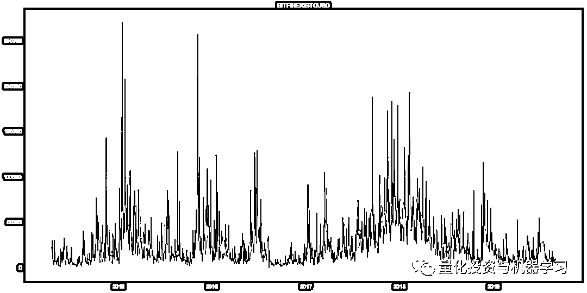

# 量价特征因子：基于 HMM 的多空策略（附代码）

> 原文：[`mp.weixin.qq.com/s?__biz=MzAxNTc0Mjg0Mg==&mid=2653294438&idx=1&sn=a6cafa645263f75ba7a64cacba47bb9b&chksm=802dcd73b75a4465b8a858e4b78b8bfea97758e93ad1acd3573e6a5dc9b52d772a5d502cd693&scene=27#wechat_redirect`](http://mp.weixin.qq.com/s?__biz=MzAxNTc0Mjg0Mg==&mid=2653294438&idx=1&sn=a6cafa645263f75ba7a64cacba47bb9b&chksm=802dcd73b75a4465b8a858e4b78b8bfea97758e93ad1acd3573e6a5dc9b52d772a5d502cd693&scene=27#wechat_redirect)

**标星★公众号     **爱你们♥

作者：Sergey Malchevskiy

编译：1+1=6 | 公众号海外部

**近期原创文章：**

## ♥ [5 种机器学习算法在预测股价的应用（代码+数据）](https://mp.weixin.qq.com/s?__biz=MzAxNTc0Mjg0Mg==&mid=2653290588&idx=1&sn=1d0409ad212ea8627e5d5cedf61953ac&chksm=802dc249b75a4b5fa245433320a4cc9da1a2cceb22df6fb1a28e5b94ff038319ae4e7ec6941f&token=1298662931&lang=zh_CN&scene=21#wechat_redirect)

## ♥ [Two Sigma 用新闻来预测股价走势，带你吊打 Kaggle](https://mp.weixin.qq.com/s?__biz=MzAxNTc0Mjg0Mg==&mid=2653290456&idx=1&sn=b8d2d8febc599742e43ea48e3c249323&chksm=802e3dcdb759b4db9279c689202101b6b154fb118a1c1be12b52e522e1a1d7944858dbd6637e&token=1330520237&lang=zh_CN&scene=21#wechat_redirect)

## ♥ 2 万字干货：[利用深度学习最新前沿预测股价走势](https://mp.weixin.qq.com/s?__biz=MzAxNTc0Mjg0Mg==&mid=2653290080&idx=1&sn=06c50cefe78a7b24c64c4fdb9739c7f3&chksm=802e3c75b759b563c01495d16a638a56ac7305fc324ee4917fd76c648f670b7f7276826bdaa8&token=770078636&lang=zh_CN&scene=21#wechat_redirect)

## ♥ [机器学习在量化金融领域的误用！](http://mp.weixin.qq.com/s?__biz=MzAxNTc0Mjg0Mg==&mid=2653292984&idx=1&sn=3e7efe9fe9452c4a5492d2175b4159ef&chksm=802dcbadb75a42bbdce895c49070c3f552dc8c983afce5eeac5d7c25974b7753e670a0162c89&scene=21#wechat_redirect)

## ♥ [基于 RNN 和 LSTM 的股市预测方法](https://mp.weixin.qq.com/s?__biz=MzAxNTc0Mjg0Mg==&mid=2653290481&idx=1&sn=f7360ea8554cc4f86fcc71315176b093&chksm=802e3de4b759b4f2235a0aeabb6e76b3e101ff09b9a2aa6fa67e6e824fc4274f68f4ae51af95&token=1865137106&lang=zh_CN&scene=21#wechat_redirect)

## ♥ [如何鉴别那些用深度学习预测股价的花哨模型？](https://mp.weixin.qq.com/s?__biz=MzAxNTc0Mjg0Mg==&mid=2653290132&idx=1&sn=cbf1e2a4526e6e9305a6110c17063f46&chksm=802e3c81b759b597d3dd94b8008e150c90087567904a29c0c4b58d7be220a9ece2008956d5db&token=1266110554&lang=zh_CN&scene=21#wechat_redirect)

## ♥ [优化强化学习 Q-learning 算法进行股市](https://mp.weixin.qq.com/s?__biz=MzAxNTc0Mjg0Mg==&mid=2653290286&idx=1&sn=882d39a18018733b93c8c8eac385b515&chksm=802e3d3bb759b42d1fc849f96bf02ae87edf2eab01b0beecd9340112c7fb06b95cb2246d2429&token=1330520237&lang=zh_CN&scene=21#wechat_redirect)

## ♥ [WorldQuant 101 Alpha、国泰君安 191 Alpha](https://mp.weixin.qq.com/s?__biz=MzAxNTc0Mjg0Mg==&mid=2653290927&idx=1&sn=ecca60811da74967f33a00329a1fe66a&chksm=802dc3bab75a4aac2bb4ccff7010063cc08ef51d0bf3d2f71621cdd6adece11f28133a242a15&token=48775331&lang=zh_CN&scene=21#wechat_redirect)

## ♥ [基于回声状态网络预测股票价格（附代码）](https://mp.weixin.qq.com/s?__biz=MzAxNTc0Mjg0Mg==&mid=2653291171&idx=1&sn=485a35e564b45046ff5a07c42bba1743&chksm=802dc0b6b75a49a07e5b91c512c8575104f777b39d0e1d71cf11881502209dc399fd6f641fb1&token=48775331&lang=zh_CN&scene=21#wechat_redirect)

## ♥ [计量经济学应用投资失败的 7 个原因](https://mp.weixin.qq.com/s?__biz=MzAxNTc0Mjg0Mg==&mid=2653292186&idx=1&sn=87501434ae16f29afffec19a6884ee8d&chksm=802dc48fb75a4d99e0172bf484cdbf6aee86e36a95037847fd9f070cbe7144b4617c2d1b0644&token=48775331&lang=zh_CN&scene=21#wechat_redirect)

## ♥ [配对交易千千万，强化学习最 NB！（文档+代码）](http://mp.weixin.qq.com/s?__biz=MzAxNTc0Mjg0Mg==&mid=2653292915&idx=1&sn=13f4ddebcd209b082697a75544852608&chksm=802dcb66b75a4270ceb19fac90eb2a70dc05f5b6daa295a7d31401aaa8697bbb53f5ff7c05af&scene=21#wechat_redirect)

## ♥ [关于高盛在 Github 开源背后的真相！](https://mp.weixin.qq.com/s?__biz=MzAxNTc0Mjg0Mg==&mid=2653291594&idx=1&sn=7703403c5c537061994396e7e49e7ce5&chksm=802dc65fb75a4f49019cec951ac25d30ec7783738e9640ec108be95335597361c427258f5d5f&token=48775331&lang=zh_CN&scene=21#wechat_redirect)

## ♥ [新一代量化带货王诞生！Oh My God！](https://mp.weixin.qq.com/s?__biz=MzAxNTc0Mjg0Mg==&mid=2653291789&idx=1&sn=e31778d1b9372bc7aa6e57b82a69ec6e&chksm=802dc718b75a4e0ea4c022e70ea53f51c48d102ebf7e54993261619c36f24f3f9a5b63437e9e&token=48775331&lang=zh_CN&scene=21#wechat_redirect)

## ♥ [独家！关于定量/交易求职分享（附真实试题）](https://mp.weixin.qq.com/s?__biz=MzAxNTc0Mjg0Mg==&mid=2653291844&idx=1&sn=3fd8b57d32a0ebd43b17fa68ae954471&chksm=802dc751b75a4e4755fcbb0aa228355cebbbb6d34b292aa25b4f3fbd51013fcf7b17b91ddb71&token=48775331&lang=zh_CN&scene=21#wechat_redirect)

## ♥ [Quant 们的身份危机！](https://mp.weixin.qq.com/s?__biz=MzAxNTc0Mjg0Mg==&mid=2653291856&idx=1&sn=729b657ede2cb50c96e92193ab16102d&chksm=802dc745b75a4e53c5018cc1385214233ec4657a3479cd7193c95aaf65642f5f45fa0e465694&token=48775331&lang=zh_CN&scene=21#wechat_redirect)

## ♥ [AQR 最新研究 | 机器能“学习”金融吗？](http://mp.weixin.qq.com/s?__biz=MzAxNTc0Mjg0Mg==&mid=2653292710&idx=1&sn=e5e852de00159a96d5dcc92f349f5b58&chksm=802dcab3b75a43a5492bc98874684081eb5c5666aff32a36a0cdc144d74de0200cc0d997894f&scene=21#wechat_redirect)

**前言**

我们通常使用股市的一手数据来创建一个策略模型，预测下一时刻价格的多少、走势的判断或其他。 今天，我们想结合多样的市场条件（波动性，交易量，价格变化等等）和结合隐马尔科夫（HMM）来构建我们的交易策略。

HMM 是一个统计模型，它用来描述一个含有隐含未知参数的马尔可夫过程。我们的观测数据就是的市场特征，隐藏状态是市场的行为。

**我们的目标是解释建模后的隐藏状态，并基于此建立交****易策略。**

**特征工程与模型构建**

先导入有关的包：

数据来自 quandl：

先看看价格和成交量的走势图：

现在我们开始正式的特征工程和建模：

训练集：01 / 01 / 2018 之前。下面的代码有关特征工程：

然后，我们得到了五个新的时间序列和训练模型：

特征序列

在上面的代码中，我们还创建了 future_return 列，它为 last_return 移动了一个 lag。**这是理解隐藏状态的****第一个关键**。我们把这个值画成每个状态的累加和。

正如我们看到的，状态#0 有下降的趋势。状态#1 没有一个明确的趋势。最后一个状态#2 有强烈的上行趋势。 这个带有累积和 future_return 的简单技巧使我们能够理解每个状态如何对应下一个价格波动。

**第二个关键**是通过特征来研究每个状态。在此之后，我们可以将这两个事件（未来走势和当前状态）联系起来。让我们为每个状态的特征编写代码和可视化。

每个状态的特征分布

现在你可以看到每个状态是如何描述当前状态的。例如，状态 #0 和#2 具有较大的成交量偏差，这意味着这些状态通常呈现在大成交量上，而状态#1 呈现在较小的成交量上。此外，状态#0 和#2 经常表现出高度的波动性。

有趣的是，状态#0 的 last_return 和 ma_ratio 的值都很低。也许，状态#0 对应的是当前的条件（目前）。状态#2 的情况是滞后的。

对上面的两个表述，我们可以总结为： 

*   **如果市场目前的状态是#0，那么在当前的情况下，我们主要处于下跌的市场状态，而这个趋势将会继续。**

*   **如果市场处于当前状态#1，趋势处于不确定性中。**

*   **如果市场目前的状态是#2，那么在当前的情况下，我们主要处于上升的市场状态，而这种趋势将会继续。**

**验证策略**

逻辑很简单：

*   **状态为#0 时：****做空**

*   **状态为#1 时：****空仓**

*   **状态为#2 时：****做多**

我们将使用 Catalyst 框架：

初始化函数：

handle_data 函数：

  

analyze 函数（绘制图形并打印结果）：

运行策略：

正如我们预期的，策略跑赢了基准。如果没有趋势期，则它的结果可能一般。

*   总收益: 1.49

*   Sortino coef: 1.88

*   Max drawdown: -0.31

*   alpha: 0.57

*   beta: -0.15

**总结**

如何改进策略：

1、向模型添加新特征。

2、尝试不同窗口长度。

3、建立具有不同隐藏状态数的模型。

4、对策略中的隐藏状态和使用规则做出新的解释。

5、添加简单的交易规则，如止损等。

*文章来自：https://twitter.com/TDataScience*

*—End—*

量化投资与机器学习微信公众号，是业内垂直于**Quant**、**MFE**、**CST、AI**等专业的**主****流量化自媒体**。公众号拥有来自**公募、私募、券商、银行、海外**等众多圈内**18W+**关注者。每日发布行业前沿研究成果和最新量化资讯。

你点的每个“在看”，我们都当成了喜欢