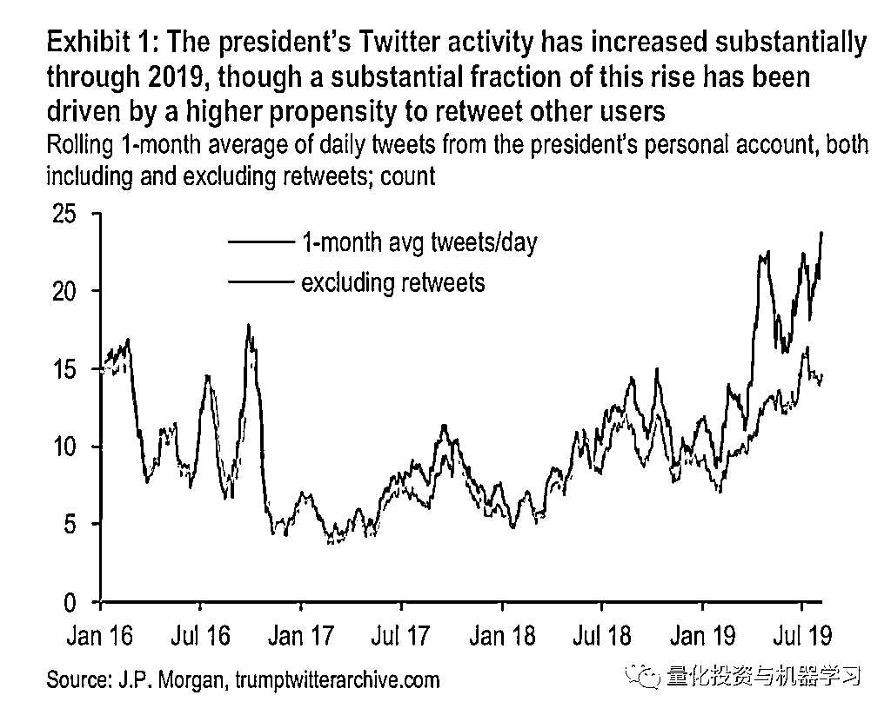

# J.P. Morgan 首发川普指数：效果如何？量化看看！

> 原文：[`mp.weixin.qq.com/s?__biz=MzAxNTc0Mjg0Mg==&mid=2653294409&idx=1&sn=b044d2647cc4f4d8b91e8a074df67003&chksm=802dcd5cb75a444a7aaea3af84dd98ad99184312379bfc7b0eb17d5f8962cdd4324dc9f6960d&scene=27#wechat_redirect`](http://mp.weixin.qq.com/s?__biz=MzAxNTc0Mjg0Mg==&mid=2653294409&idx=1&sn=b044d2647cc4f4d8b91e8a074df67003&chksm=802dcd5cb75a444a7aaea3af84dd98ad99184312379bfc7b0eb17d5f8962cdd4324dc9f6960d&scene=27#wechat_redirect)


**标星★公众号     **爱你们♥

作者：Nick Cochrane、JPMorgan、CNBC

编译：1+1=6 | 公众号海外部

**近期原创文章：**

## ♥ [5 种机器学习算法在预测股价的应用（代码+数据）](https://mp.weixin.qq.com/s?__biz=MzAxNTc0Mjg0Mg==&mid=2653290588&idx=1&sn=1d0409ad212ea8627e5d5cedf61953ac&chksm=802dc249b75a4b5fa245433320a4cc9da1a2cceb22df6fb1a28e5b94ff038319ae4e7ec6941f&token=1298662931&lang=zh_CN&scene=21#wechat_redirect)

## ♥ [Two Sigma 用新闻来预测股价走势，带你吊打 Kaggle](https://mp.weixin.qq.com/s?__biz=MzAxNTc0Mjg0Mg==&mid=2653290456&idx=1&sn=b8d2d8febc599742e43ea48e3c249323&chksm=802e3dcdb759b4db9279c689202101b6b154fb118a1c1be12b52e522e1a1d7944858dbd6637e&token=1330520237&lang=zh_CN&scene=21#wechat_redirect)

## ♥ 2 万字干货：[利用深度学习最新前沿预测股价走势](https://mp.weixin.qq.com/s?__biz=MzAxNTc0Mjg0Mg==&mid=2653290080&idx=1&sn=06c50cefe78a7b24c64c4fdb9739c7f3&chksm=802e3c75b759b563c01495d16a638a56ac7305fc324ee4917fd76c648f670b7f7276826bdaa8&token=770078636&lang=zh_CN&scene=21#wechat_redirect)

## ♥ [机器学习在量化金融领域的误用！](http://mp.weixin.qq.com/s?__biz=MzAxNTc0Mjg0Mg==&mid=2653292984&idx=1&sn=3e7efe9fe9452c4a5492d2175b4159ef&chksm=802dcbadb75a42bbdce895c49070c3f552dc8c983afce5eeac5d7c25974b7753e670a0162c89&scene=21#wechat_redirect)

## ♥ [基于 RNN 和 LSTM 的股市预测方法](https://mp.weixin.qq.com/s?__biz=MzAxNTc0Mjg0Mg==&mid=2653290481&idx=1&sn=f7360ea8554cc4f86fcc71315176b093&chksm=802e3de4b759b4f2235a0aeabb6e76b3e101ff09b9a2aa6fa67e6e824fc4274f68f4ae51af95&token=1865137106&lang=zh_CN&scene=21#wechat_redirect)

## ♥ [如何鉴别那些用深度学习预测股价的花哨模型？](https://mp.weixin.qq.com/s?__biz=MzAxNTc0Mjg0Mg==&mid=2653290132&idx=1&sn=cbf1e2a4526e6e9305a6110c17063f46&chksm=802e3c81b759b597d3dd94b8008e150c90087567904a29c0c4b58d7be220a9ece2008956d5db&token=1266110554&lang=zh_CN&scene=21#wechat_redirect)

## ♥ [优化强化学习 Q-learning 算法进行股市](https://mp.weixin.qq.com/s?__biz=MzAxNTc0Mjg0Mg==&mid=2653290286&idx=1&sn=882d39a18018733b93c8c8eac385b515&chksm=802e3d3bb759b42d1fc849f96bf02ae87edf2eab01b0beecd9340112c7fb06b95cb2246d2429&token=1330520237&lang=zh_CN&scene=21#wechat_redirect)

## ♥ [WorldQuant 101 Alpha、国泰君安 191 Alpha](https://mp.weixin.qq.com/s?__biz=MzAxNTc0Mjg0Mg==&mid=2653290927&idx=1&sn=ecca60811da74967f33a00329a1fe66a&chksm=802dc3bab75a4aac2bb4ccff7010063cc08ef51d0bf3d2f71621cdd6adece11f28133a242a15&token=48775331&lang=zh_CN&scene=21#wechat_redirect)

## ♥ [基于回声状态网络预测股票价格（附代码）](https://mp.weixin.qq.com/s?__biz=MzAxNTc0Mjg0Mg==&mid=2653291171&idx=1&sn=485a35e564b45046ff5a07c42bba1743&chksm=802dc0b6b75a49a07e5b91c512c8575104f777b39d0e1d71cf11881502209dc399fd6f641fb1&token=48775331&lang=zh_CN&scene=21#wechat_redirect)

## ♥ [计量经济学应用投资失败的 7 个原因](https://mp.weixin.qq.com/s?__biz=MzAxNTc0Mjg0Mg==&mid=2653292186&idx=1&sn=87501434ae16f29afffec19a6884ee8d&chksm=802dc48fb75a4d99e0172bf484cdbf6aee86e36a95037847fd9f070cbe7144b4617c2d1b0644&token=48775331&lang=zh_CN&scene=21#wechat_redirect)

## ♥ [配对交易千千万，强化学习最 NB！（文档+代码）](http://mp.weixin.qq.com/s?__biz=MzAxNTc0Mjg0Mg==&mid=2653292915&idx=1&sn=13f4ddebcd209b082697a75544852608&chksm=802dcb66b75a4270ceb19fac90eb2a70dc05f5b6daa295a7d31401aaa8697bbb53f5ff7c05af&scene=21#wechat_redirect)

## ♥ [关于高盛在 Github 开源背后的真相！](https://mp.weixin.qq.com/s?__biz=MzAxNTc0Mjg0Mg==&mid=2653291594&idx=1&sn=7703403c5c537061994396e7e49e7ce5&chksm=802dc65fb75a4f49019cec951ac25d30ec7783738e9640ec108be95335597361c427258f5d5f&token=48775331&lang=zh_CN&scene=21#wechat_redirect)

## ♥ [新一代量化带货王诞生！Oh My God！](https://mp.weixin.qq.com/s?__biz=MzAxNTc0Mjg0Mg==&mid=2653291789&idx=1&sn=e31778d1b9372bc7aa6e57b82a69ec6e&chksm=802dc718b75a4e0ea4c022e70ea53f51c48d102ebf7e54993261619c36f24f3f9a5b63437e9e&token=48775331&lang=zh_CN&scene=21#wechat_redirect)

## ♥ [独家！关于定量/交易求职分享（附真实试题）](https://mp.weixin.qq.com/s?__biz=MzAxNTc0Mjg0Mg==&mid=2653291844&idx=1&sn=3fd8b57d32a0ebd43b17fa68ae954471&chksm=802dc751b75a4e4755fcbb0aa228355cebbbb6d34b292aa25b4f3fbd51013fcf7b17b91ddb71&token=48775331&lang=zh_CN&scene=21#wechat_redirect)

## ♥ [Quant 们的身份危机！](https://mp.weixin.qq.com/s?__biz=MzAxNTc0Mjg0Mg==&mid=2653291856&idx=1&sn=729b657ede2cb50c96e92193ab16102d&chksm=802dc745b75a4e53c5018cc1385214233ec4657a3479cd7193c95aaf65642f5f45fa0e465694&token=48775331&lang=zh_CN&scene=21#wechat_redirect)

## ♥ [AQR 最新研究 | 机器能“学习”金融吗？](http://mp.weixin.qq.com/s?__biz=MzAxNTc0Mjg0Mg==&mid=2653292710&idx=1&sn=e5e852de00159a96d5dcc92f349f5b58&chksm=802dcab3b75a43a5492bc98874684081eb5c5666aff32a36a0cdc144d74de0200cc0d997894f&scene=21#wechat_redirect)

CP（川普）在 Tw（Twitter）真的是：  

**一顿分析猛如虎，涨跌全看特朗普。**

**夜里挑灯看线，开盘一看白练。**

这也诞生了一个新词：

**一推就倒**

▍形容一条 Tw 就吓得屁滚尿流，崩溃倒下的东西，多用于股市。

**必看!**

[**一顿操作猛如虎，**](https://mp.weixin.qq.com/s?__biz=MzAxNTc0Mjg0Mg==&mid=2653293918&idx=1&sn=957c919a3f6446a0dee57b59380cbf17&scene=21#wechat_redirect)**万字长文基于 python****正文**9 月 8 日，CNBC 报道称，为了量化 CP 的推文对金融市场特别是债券市场的影响，摩根大通率先设计了一个“Volfefe 指数”，**来分析 CP 的推文是如何影响 MG 利率波动的。**


为什么叫 Volfefe。其来源于 CP 的自创词**Covfefe：**

2017 年 5 月 30 日，CP 在 Tw 上创造了一个新词“Covfefe”，引发了推特上三千万粉丝的关注。正常人的反应是，“我怀疑他的的手滑了一下。

就在 Covfefe 一词在 Tw 上被炒得沸沸扬扬的时候，CP 悄悄把那条推文给删除了。取而代之的是一条新的推文。

2017 年 5 月 31 日凌晨，CP 在社交平台推特上写道：“尽管持续的负面媒体 Covfefe”（Despite the constant negative press Covfefe）。


2017 年 5 月 31 日上午 6 时左右，CP 发现自己一不小心成了全民话题之后，再次发声：“谁能猜到 covfefe 的真实含义？？？玩得开心！”


摩根大通发现，**该指数解释了 2 年期和 5 年期 MG 国债隐含利率波动的一个可测量部分。**报告的概览：
具体我们来看看：1、CP 的的大部分推文都集中在 Federal Reserve 身上，而且人们普遍认为，MY 紧张首先会对短期经济表现产生影响，同样，也会影响 Federal Reserve 对此类事态发展的反应。2、CP 的市场动向信息通常涉及 MY 和货币政策，但这些推文在其支持者中的转发量、点赞数却越来越少。


3、以下是 CP 使用最频繁的几个词：4、自 2016 年当选以来，CP**平均每天**对近**6400 万粉丝****发布 10 条以上的推文**，这期间与他个人账户相关的推文总数约为 1.4 万条，其中 1 万条发生在 2017 年就职典礼之后。

然而，从 2018 年末开始，活动大幅增加。事实上，过去四年来推特的最高数量出现在最近几个月。


此外，**CP 的****推****文大多在中午到下午 2 点之间发****布，下午 1 点发布的推文大约是下午或晚上其他时间发布的推文的 3 倍。**

研究发现：CP**凌晨 3:00 的推文比下午 3:00 的推文更多，这对 MG 利率市场来说是个麻烦，因为隔夜市场的流动性令人担忧**。 

根据 Bank of America Merrill Lynch 在 9 月初编制的数据显示：  

在过去 3 年里，CP 每天发布超过 35 条 Tw 的日子里，市场平均下跌了 9 个基点。 在 CP 每天发布 Tw 不到 5 条的日子里，市场平均上涨了 5 个基点。


**当****CP****在****Tw****上更加活跃的时候，市场通常会下跌。** **当****CP 推****文减少时，市场往往会上涨！**

还有一个有趣的发现：**CP****大概是从早上 5:00 睡到上午 10:00，因为在这段时间里他的****Twter 没有****什么动静。**

5、尽管 CP 的 Tw 活跃度有很大的上升，但很多来自于转发他人 Tw。尽管如此，摩根大通的结论任然表示，CP 的 Tw 对市场的波动性有很大的统计意义。



下面我们来做一个简单的策略：

**利用主题模型和情感分析，****基****于****C****P****Tw****，****构建标普 500 指数交易策略**

标普 500 指数交易策略能否利用 CP 的推文来预测市场的短期波动呢？我们今天就从**主题模型**和**情感分析**来寻找答案。

**数据收集和预处理**

时间：**2017 年 1 月 21 日上任第一天到 2019 年 8 月 14 日**。

共收集了**7779****条 CP**的推文。 

使用 **Gensim** 和 **nltk** Python 库执行了以下预处理步骤：

1、少于 20 个字符（总共 375 条推文）的推文被视为噪音数据，进行删除操作。

2、推文被标记化，句子被分割成单个的单词，单词全部小写，标点符号被删除。

3、使用 nltk 的默认 Stop Words（停用词），及自定义停用词。确定自定义停用词的过程是可以反复进行的，包括诸如“fake, news, James Comey, Puerto Rico 等”的词语。这些词主导着与主题无关的推文。

4、词被进行简化，将每个单词缩减到它最基本的形式。

5、后来为主题建模制作了 Bigrams。选择 Bigrams 来捕捉围绕单个词组的上下文。

Bigrams 是为了自动探测出文本中的新词，基于词汇之间的共现关系—如果两个词经常一起毗邻出现，那么这两个词可以结合成一个新词，比如“数据”、“产品经理”经常一起出现在不同的段落里，那么，“数据 _ 产品经理”则是二者合成出来的新词，只不过二者之间包含着下划线。

6、最后，为了使数据更友好，创建了一个单词字典包，其中详细描述了一个单词在所有 Tw 中出现的次数。Gensim 还需要一个语料库：为每条 Tw 创建一个词典，其中包含在 Tw 中出现的单词数量和每个单词在 Tw 中出现的次数。

预处理 Tw 的例子，经过 lemmmization 和 bigram 阶段：


**基于 LDA 的主题模型**

经过预处理后，将语料库和词包字典传递给一个 LDA 模型。简单地说，**LDA 可以用来为给定的推文主题建立概率分布模型**。

例如，考虑这样一个例子：LDA 认为一条 Tw 有 50%的可能与 trade 有关，25%的可能与移民有关，25% 的可能与医疗保健有关。考虑到这条推文的主题概率分布，以及与 trade 话题的相关性最大，这条推文可以被归类为与 trade 有关的。

为 LDA 模型指定的主要超参数是主题的数量。经过多次测试和一些对主题适当分离的主观判断，30 个主题产生了最好的结果。

```py
lda_model = gensim.models.ldamodel.LdaModel(corpus=corpus,id2word=id2word,
num_topics=30, passes = 10)
```

我们使用 pyLDAvis 来可视化模型分离主题的能力。下面的主题间距离图显示了一些主题之间的轻微重叠，但总的来说，该模型表现出了令人满意的分离程度。


一旦我们找到了与主题 9 对应的先关 Tw，最后只剩下 590 条。上面的例子和推文的子集表明，LDA 模型在识别与 MY 有关的推文方面是十分准确的。下面我们进行情感分析的建模。

**基于 VADER 的情感分析**

我们使用 Valence Aware Dictionary 和 Sentiment Reasoner （VADER）分析来生成情绪的交易信号。 Vader 是一个预先训练好的情感模型，在社交媒体文本上特别有效。 建立 Vader 模型并下载现有的词典简直就是小菜一碟。 

Vader 是一种基于词库和语法规则来进行文本情感识别的方法，发表于 2014 年的 AAAI 会议。

Github 地址：

*https://github.com/cjhutto/vaderSentiment* 

```py
from nltk.sentiment.vader import SentimentIntensityAnalyzer
analyser = SentimentIntensityAnalyzer()
nltk.download('vader_lexicon')
sia = SentimentIntensityAnalyzer()
```

Vader 接受一个文本字符串作为输入，并返回正、中性、负和复合的情感得分。**重点放在检查复合得分上**，它很好地包装了文档的总体情绪。复合分数范围从 -1(极度负值)到 1(极度正值)。在下面的例子中，Vader 给出了 0.8439 的综合得分。

收集了所有与 MY 有关推文的综合得分。为了识别那些在短期内对市场有最大影响力的推文，我们将具有大量证明或消负面情绪的推文拎出来。

*   正面：复合得分 0.7

*   负面：复合得分-0.7

没有达到情绪分界线的推文会被删除，因此最终的数据子集只有 194 条推文，这些推文的情绪得分都很高。

**基于标普 500 指数的回测**

# 我们开发了一个简单的自定义交易情绪策略，用于对标普 500 指数进行回测。在深入研究交易逻辑的细节之前，我们首先做出一些**假设**：

*   回测仅限于在市场开盘或收盘时进行。理想的情况是，一旦 CP 的推特账号进行分析后触发买卖信号，则立马进行交易。

*   如果一天内产生多个信号，信号的平均值决定交易的方向。

*   手续费没有考虑。

*   比较基准是一个简单的买入并持有 SPY 策略。

在实际中，我们一定是要考虑交易成本的（手续费等）。

每日交易策略逻辑的基本情况如下：

**基本情况：**

没有交易信号

**正面情绪信号：**

信号出现在开盘前：开盘时买进，收盘时卖出

信号出现在交易时段：收盘时买进，明天收盘时卖出

信号出现在收盘后：明天开盘时买进，明天收盘时卖出

**负面情绪信号：**

信号出现在开盘前：开盘时卖出

信号出现在交易时段：收盘时卖出

信号出现在收盘后：明天开盘时卖出

让我们看看交易策略在 2017 年 1 月 21 日至 2019 年 8 月 14 日的回测表现。在下图中，策略用蓝线表示，基准用灰线表示。此外，绿色箭头表示触发买入信号的日期，红色箭头表示触发卖出信号的日期。


在回测期间，该**策略的收益率为 85.3%** ，而在同一时期，基准为 56.7% ！虽然回测的结果是 OK 的，但让我们花点时间来考虑为什么该策略优于其基准，并讨论回测的局限性。

**总结**

大多数买入信号是在市场上涨趋势中产生的，而卖出信号则是在小幅抛售时产生的，然而，这种策略也有可能只是运气好。

CP 的情绪是否真的导致了市场的波动？或者这些推文只是与其他市场变动事件如经济数据发布或 Federal Reserve 的讲话有关？ 我们刚才的策略是为了看看利用 CP 的情绪是否有可以在二级市场进行一些有效的投资。**目前，我们只能说，****CP 的情绪****很有可能与市场收益正相关。**  

**回测的一个更明显的局限性是，它只是对过去的一个验证。找到一个有利可图的回测是一项很辛苦的工作，任何交易策略的真正成功在于它未来在实时数据上的表现。**

总的来说，使用 LDA 和 VADER 情绪分析进行主题建模是可行的解决方案，利用回测期间产生的情绪信号进行交易是有利可图的，“买入并持有”策略的优异表现足以说明这一点。在未来的研究中，我们可以加入格兰杰因果关系检验和事件研究，以分离出 CP Tw 中的实际市场效应，可能会有更好的表现！

*—End—*

量化投资与机器学习微信公众号，是业内垂直于**Quant**、**MFE**、**CST、AI**等专业的**主****流量化自媒体**。公众号拥有来自**公募、私募、券商、银行、海外**等众多圈内**18W+**关注者。每日发布行业前沿研究成果和最新量化资讯。

你点的每个“在看”，我们都认真当成了喜欢