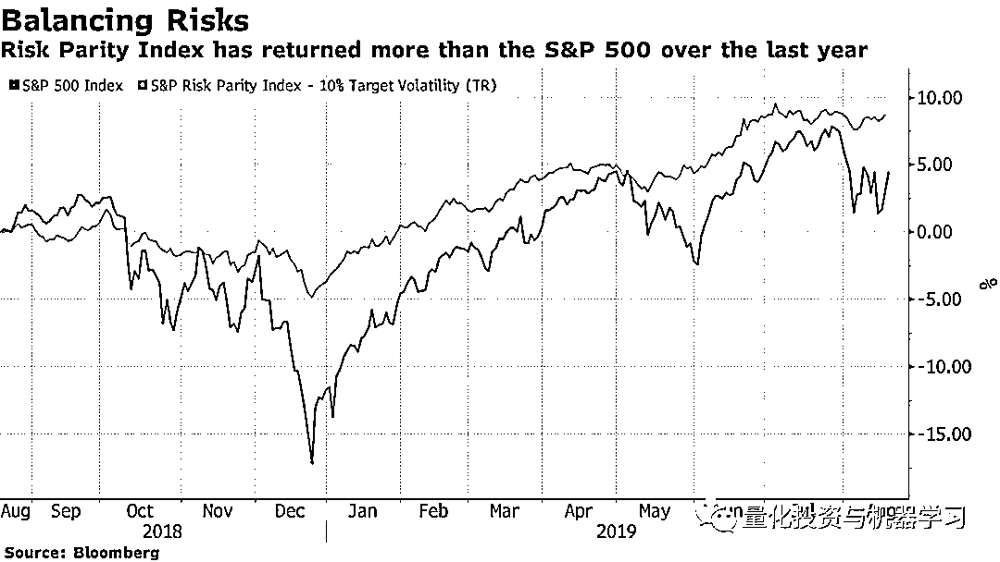
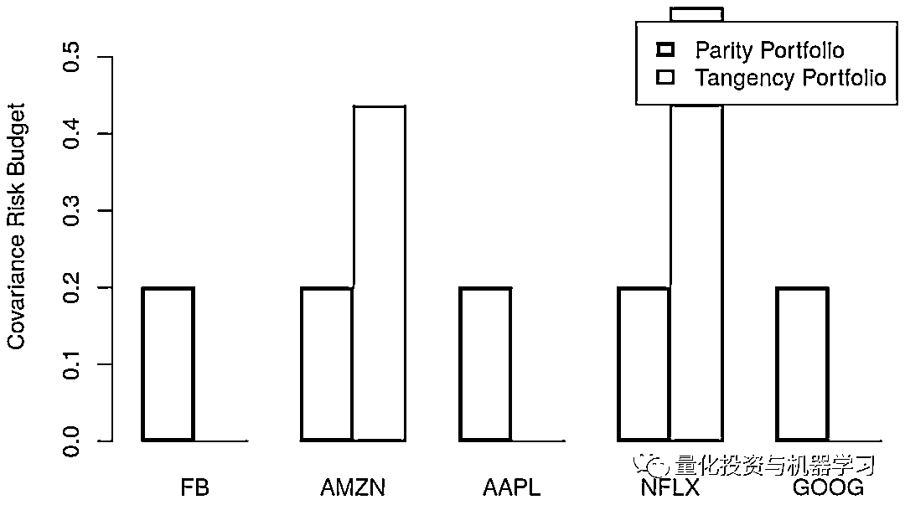

# 利用风险平价投资组合构建自己的对冲基金策略

> 原文：[`mp.weixin.qq.com/s?__biz=MzAxNTc0Mjg0Mg==&mid=2653294344&idx=1&sn=c4e1c25a73a1cf537bdd306ec801eced&chksm=802dcd1db75a440bfb904d837f587a2941cb43b9b8fe0b204e18dc212ce14f0d0cd85d339f8f&scene=27#wechat_redirect`](http://mp.weixin.qq.com/s?__biz=MzAxNTc0Mjg0Mg==&mid=2653294344&idx=1&sn=c4e1c25a73a1cf537bdd306ec801eced&chksm=802dcd1db75a440bfb904d837f587a2941cb43b9b8fe0b204e18dc212ce14f0d0cd85d339f8f&scene=27#wechat_redirect)

**标星★公众号     **爱你们♥

作者：Thársis Souza

编译：方的馒头

**近期原创文章：**

## ♥ [5 种机器学习算法在预测股价的应用（代码+数据）](https://mp.weixin.qq.com/s?__biz=MzAxNTc0Mjg0Mg==&mid=2653290588&idx=1&sn=1d0409ad212ea8627e5d5cedf61953ac&chksm=802dc249b75a4b5fa245433320a4cc9da1a2cceb22df6fb1a28e5b94ff038319ae4e7ec6941f&token=1298662931&lang=zh_CN&scene=21#wechat_redirect)

## ♥ [Two Sigma 用新闻来预测股价走势，带你吊打 Kaggle](https://mp.weixin.qq.com/s?__biz=MzAxNTc0Mjg0Mg==&mid=2653290456&idx=1&sn=b8d2d8febc599742e43ea48e3c249323&chksm=802e3dcdb759b4db9279c689202101b6b154fb118a1c1be12b52e522e1a1d7944858dbd6637e&token=1330520237&lang=zh_CN&scene=21#wechat_redirect)

## ♥ 2 万字干货：[利用深度学习最新前沿预测股价走势](https://mp.weixin.qq.com/s?__biz=MzAxNTc0Mjg0Mg==&mid=2653290080&idx=1&sn=06c50cefe78a7b24c64c4fdb9739c7f3&chksm=802e3c75b759b563c01495d16a638a56ac7305fc324ee4917fd76c648f670b7f7276826bdaa8&token=770078636&lang=zh_CN&scene=21#wechat_redirect)

## ♥ [机器学习在量化金融领域的误用！](http://mp.weixin.qq.com/s?__biz=MzAxNTc0Mjg0Mg==&mid=2653292984&idx=1&sn=3e7efe9fe9452c4a5492d2175b4159ef&chksm=802dcbadb75a42bbdce895c49070c3f552dc8c983afce5eeac5d7c25974b7753e670a0162c89&scene=21#wechat_redirect)

## ♥ [基于 RNN 和 LSTM 的股市预测方法](https://mp.weixin.qq.com/s?__biz=MzAxNTc0Mjg0Mg==&mid=2653290481&idx=1&sn=f7360ea8554cc4f86fcc71315176b093&chksm=802e3de4b759b4f2235a0aeabb6e76b3e101ff09b9a2aa6fa67e6e824fc4274f68f4ae51af95&token=1865137106&lang=zh_CN&scene=21#wechat_redirect)

## ♥ [如何鉴别那些用深度学习预测股价的花哨模型？](https://mp.weixin.qq.com/s?__biz=MzAxNTc0Mjg0Mg==&mid=2653290132&idx=1&sn=cbf1e2a4526e6e9305a6110c17063f46&chksm=802e3c81b759b597d3dd94b8008e150c90087567904a29c0c4b58d7be220a9ece2008956d5db&token=1266110554&lang=zh_CN&scene=21#wechat_redirect)

## ♥ [优化强化学习 Q-learning 算法进行股市](https://mp.weixin.qq.com/s?__biz=MzAxNTc0Mjg0Mg==&mid=2653290286&idx=1&sn=882d39a18018733b93c8c8eac385b515&chksm=802e3d3bb759b42d1fc849f96bf02ae87edf2eab01b0beecd9340112c7fb06b95cb2246d2429&token=1330520237&lang=zh_CN&scene=21#wechat_redirect)

## ♥ [WorldQuant 101 Alpha、国泰君安 191 Alpha](https://mp.weixin.qq.com/s?__biz=MzAxNTc0Mjg0Mg==&mid=2653290927&idx=1&sn=ecca60811da74967f33a00329a1fe66a&chksm=802dc3bab75a4aac2bb4ccff7010063cc08ef51d0bf3d2f71621cdd6adece11f28133a242a15&token=48775331&lang=zh_CN&scene=21#wechat_redirect)

## ♥ [基于回声状态网络预测股票价格（附代码）](https://mp.weixin.qq.com/s?__biz=MzAxNTc0Mjg0Mg==&mid=2653291171&idx=1&sn=485a35e564b45046ff5a07c42bba1743&chksm=802dc0b6b75a49a07e5b91c512c8575104f777b39d0e1d71cf11881502209dc399fd6f641fb1&token=48775331&lang=zh_CN&scene=21#wechat_redirect)

## ♥ [计量经济学应用投资失败的 7 个原因](https://mp.weixin.qq.com/s?__biz=MzAxNTc0Mjg0Mg==&mid=2653292186&idx=1&sn=87501434ae16f29afffec19a6884ee8d&chksm=802dc48fb75a4d99e0172bf484cdbf6aee86e36a95037847fd9f070cbe7144b4617c2d1b0644&token=48775331&lang=zh_CN&scene=21#wechat_redirect)

## ♥ [配对交易千千万，强化学习最 NB！（文档+代码）](http://mp.weixin.qq.com/s?__biz=MzAxNTc0Mjg0Mg==&mid=2653292915&idx=1&sn=13f4ddebcd209b082697a75544852608&chksm=802dcb66b75a4270ceb19fac90eb2a70dc05f5b6daa295a7d31401aaa8697bbb53f5ff7c05af&scene=21#wechat_redirect)

## ♥ [关于高盛在 Github 开源背后的真相！](https://mp.weixin.qq.com/s?__biz=MzAxNTc0Mjg0Mg==&mid=2653291594&idx=1&sn=7703403c5c537061994396e7e49e7ce5&chksm=802dc65fb75a4f49019cec951ac25d30ec7783738e9640ec108be95335597361c427258f5d5f&token=48775331&lang=zh_CN&scene=21#wechat_redirect)

## ♥ [新一代量化带货王诞生！Oh My God！](https://mp.weixin.qq.com/s?__biz=MzAxNTc0Mjg0Mg==&mid=2653291789&idx=1&sn=e31778d1b9372bc7aa6e57b82a69ec6e&chksm=802dc718b75a4e0ea4c022e70ea53f51c48d102ebf7e54993261619c36f24f3f9a5b63437e9e&token=48775331&lang=zh_CN&scene=21#wechat_redirect)

## ♥ [独家！关于定量/交易求职分享（附真实试题）](https://mp.weixin.qq.com/s?__biz=MzAxNTc0Mjg0Mg==&mid=2653291844&idx=1&sn=3fd8b57d32a0ebd43b17fa68ae954471&chksm=802dc751b75a4e4755fcbb0aa228355cebbbb6d34b292aa25b4f3fbd51013fcf7b17b91ddb71&token=48775331&lang=zh_CN&scene=21#wechat_redirect)

## ♥ [Quant 们的身份危机！](https://mp.weixin.qq.com/s?__biz=MzAxNTc0Mjg0Mg==&mid=2653291856&idx=1&sn=729b657ede2cb50c96e92193ab16102d&chksm=802dc745b75a4e53c5018cc1385214233ec4657a3479cd7193c95aaf65642f5f45fa0e465694&token=48775331&lang=zh_CN&scene=21#wechat_redirect)

## ♥ [拿起 Python，防御特朗普的 Twitter](https://mp.weixin.qq.com/s?__biz=MzAxNTc0Mjg0Mg==&mid=2653291977&idx=1&sn=01f146e9a88bf130ca1b479573e6d158&chksm=802dc7dcb75a4ecadfdbdace877ed948f56b72bc160952fd1e4bcde27260f823c999a65a0d6d&token=48775331&lang=zh_CN&scene=21#wechat_redirect)

## ♥ [AQR 最新研究 | 机器能“学习”金融吗？](http://mp.weixin.qq.com/s?__biz=MzAxNTc0Mjg0Mg==&mid=2653292710&idx=1&sn=e5e852de00159a96d5dcc92f349f5b58&chksm=802dcab3b75a43a5492bc98874684081eb5c5666aff32a36a0cdc144d74de0200cc0d997894f&scene=21#wechat_redirect)

**前言**

本周三，公众号推送了一篇名为：

[**桥水达里奥：****全球首只风险平价 ETF 即将问世！**](http://mp.weixin.qq.com/s?__biz=MzAxNTc0Mjg0Mg==&mid=2653294253&idx=1&sn=78b8e5c468ffe851ff950990466fe6b6&chksm=802dccb8b75a45aec5b87b082c27ac9341c6798e346d39005997a0f98875f306413e3c4ffca1&scene=21#wechat_redirect)

的文章，在文末，我们做出预告：公众号将引入了风险平价投资组合的概念，并与均值-方差模型进行比较。通过构造一个 FAANG 风险平价指数来优化投资组合策略。

今天让我们来具体看看这篇文章吧~

**正文**

风险平价（Risk Parity），又称为风险均衡，是磐安资产管理公司（PanAgora）首席投资官钱恩平博士（Edward Qian）在 2005 年提出来的，因此他又被称为风险均衡理论之父。钱博士拥有北京大学数学学士学位和佛罗里达州立大学应用数学博士学位，于 1996 年开始了他的投资生涯，2005 年起一直都在磐安资管工作。他创造了“风险均衡”一词，还对定量股权投资组合管理做出了重要贡献。

查看公众号历史热们文章： 

[**风险平价这 10 年！**](http://mp.weixin.qq.com/s?__biz=MzAxNTc0Mjg0Mg==&mid=2653294049&idx=1&sn=3146f52658cd1e593614c9142d1d5a02&chksm=802dcff4b75a46e21df1f01fc21fa5f8c1db099816dcfe457f0a9670e8c0a5669d4757cb83e1&scene=21#wechat_redirect)

然而，自 2018 年以来市场波动加剧，地缘政治和贸易战风险的紧急出现，以及黄金等避险资产的增长，为多元化投资组合创造了有利条件。下图显示，**标普风险平价策略在过去 12 个月（2018 年 8 月至 2019 年 8 月）已经回升了近 10% **，是标普 500 美国股票指数 2 倍多。

*图片来自：彭博

我们如何构建一个风险平价投资组合呢？与传统的均值-方差模型相比，它将如何表现？

**风险平价投资组合：Ray Dalio**

风险平价投资组合是指其资产证明以下等价的一类投资组合（Vinicius 和 Palomar 2019 年）：

其中 f 是衡量投资组合总风险的一阶正齐次函数，w 是投资组合权重向量。换言之，风险平价组合中每种资产的边际风险贡献是相等的。

其中Σ是资产的协方差矩阵。

在实际应用中，风险和投资组合经理在资产、国家、区域或行业层面上有他们遵循的风险授权或边际风险贡献的界限。因此，风险平价投资组合的自然延伸是所谓的风险预算投资组合，其中边际风险贡献与预先指定的数量相匹配（Vinicius 和 Palomar 2019 年）。从数学上讲：

**切向（Tangency）投资组合：****Markowitz 方法**

均值方差优化是现代投资组合理论常用的量化手段，它允许投资者通过考虑风险与收益之间的权衡来进行配置。

1990 年，Harry M.Markowitz 博士因投资组合理论而获得诺贝尔经济学

在均值-方差框架中，目标是根据基准预期收益率最小化投资组合风险，如下所示：

其中 m 是投资组合资产的预期收益向量。

我们将为每个目标收益率获得最佳（最小风险）投资组合，从而形成一个有效边界。下图中有效边界的每个点都是具有最佳证券组合的投资组合，可以在给定风险水平（标准差）的情况下，将风险最小化。有效边界下的点是表现较差的投资组合。它们要么提供相同的收益但风险较高，要么为相同风险提供较少的收益。

有效边界：ShuBraque（CC 协议 3.0 版本）

但是我们**如何从有效边界中选择一个投资组合？**一个方法是从风险/收益角度选择最有效的投资组合，即夏普比率（超额收益与投资组合标准差之比）最高的投资组合。该投资组合称为切向投资组合，位于资本配置线和有限边界的切点。

**优化 FAANG：Ray Dalio 相较于 Markowitz**

**单一投资组合**

**FAANG：**使用复权价格的对数收益率（FaceBook、AMZN、AAPL、NFLX 和 GOOG）。

我们可以使用**riskParityPortfolio**和**fPortfolio**包分别构建 FAANG 风险平价和切向投资组合。首先考虑 FAANG 从 2018 年开始的收益以构建以下投资组合：

下图显示了平价投资组合和切向投资组合所获得的投资组合权重。我们观察到，切向投资组合将权重集中在 Amazon 和 Netflix 之间，两家公司的权重几乎相同，而 Facebook、Apple 和 Google 则被排除在投资组合之外。另一方面，平价投资组合在 FAANG 公司中呈现均衡的权重分布，所有公司的权重约在 20%左右。Apple 和 Google 的权重略高于 20%，而 Netflix 则是权重最低的公司（15%）。

考虑到 2018 年收益的平价和相切 FAANG 投资组合的投资组合权重

下图比较了平价和切向投资组合的（协方差）风险预算。正如预期的那样，我们观察到平价投资组合的风险预算在投资组合中平均分配。另一方面，相切投资组合将 Amazon 和 Netflix 之间的风险集中起来，后者相当于投资组合风险预算的 56%以上。

考虑 2018 年收益的平价和相切 FAANG 投资组合的投资组合协方差风险预算

**RayDalio FAANG 指数**

“Ray Dalio FAANG 指数”由 FAANG 公司组成的投资组合，经过重新平衡与相应的风险平价投资组合相匹配，其表现如何？ 它会击败相应的切向投资组合吗？

为回答这些问题，我们将考虑 2014-01-01 和 2019-09-01 期间的 FAANG 公司投资组合，并构建两个指数：

**1、风险平价指数：**根据风险平价投资组合重新平衡投资组合权重，按季度设定权重；

**2、切向投资组合指数：**根据切向投资组合重新平衡投资组合权重，按季度设定权重。

我们首先通过构建一个 12 个月宽度、3 个月步长的滚动窗口来定义重新平衡日期，如下所示：

重新平衡日期如下：

接下来，我们计算每个重新平衡日期的风险平价投资组合权重，考虑 12 个月窗口内的收益，如下所示：

我们现在计算 FAANG 切向投资组合的季度权重。我们利用 fPortfplio 包计算滚动切向投资组合，如下所示：

下图显示了平价风险和切向投资组合所获得的投资组合权重。我们观察到，**风险平价权重随着时间的推移相当稳定**，Netflix 的权重与其他投资组合成分相比略低。另一方面，切向投资组合权重在考虑的整个时间段内变化很大，这可能会对其维护带来挑战，因为其营业额可能相当高。切向投资组合在许多重新平衡日期超过了 Apple 和 Amazon，并在所有重新平衡日期都低于 Google。

我们将使用 FAANG 公司的时间序列以及风险平价和切向投资组合的时间序列来**计算风险平价和切向投资组合指数的收益**，如下所示：

下图显示了风险平价指数相较于切向投资组合指数的表现概况。令人惊讶的是，FAANG 风险平价指数的累计收益率为 169.48%，远高于 FAANG 相切投资组合指数的 109.65%。在所分析的大部分时间内，FAANG 风险平价指数的跌幅也相对较低。

风险平价指数相较于切向投资组合指数的表现概况

下面两个表分别显示了风险平价和切向投资组合指数的月度收益率。有趣的是，**在切向投资组合指数具有正累计收益的年份中，风险平价指数产生的收益低于切向投资组合指数。相反，在切向投资组合指数具有负累计收益的年份中，风险平价指数的表现优于切向投资组合指数**。通过这种方式，与切向投资组合相比，风险平价指数显示出“不那么好”但也“不那么糟糕”的年收益率。

下图显示了滚动 252 天窗口中的表现概况。再次，我们观察到，风险平价指数与切向投资组合指数相比具有更好的表现。与切向投资组合指数相比，风险平价指数在分析的大部分时间段具有较高的年化收益率、较低的标准差和较高的夏普比率。如下表所示，风险平价指数的年化收益率为 23.7%、标准差为 22.55%以及夏普比率为 1.051，切向投资组合指数的年化收益率为 17.22%、标准差为 26.42%以及夏普比率为 0.652。

风险平价指数相较于切向投资组合指数在滚动 252 天窗口中的表现概况

**结论**

**在所有经济环境中，哪种资产组合最有可能在一段时间内带来良好的收益？**  

这是桥水在创建全天候基金之前提出的问题，其概念如今在风险平价策略中得到普及。

传统的资产配置方法往往容忍更高的风险集中度，目标是产生更高的长期收益。桥水认为这种方法存在一个**严重的缺陷**：

如果短期风险的来源是单一类型资产的高度集中，这种方法会带来长期收益率不佳的重大风险，从而威胁到履行未来债务的能力。这是因为每项资产都容易受到表现不佳的影响，由经济环境的持续转变导致的这种情况可能持续十年或更长时间。

在本文中，我们引入了风险平价投资组合的概念，并将其与均值-方差模型进行比较。我们通过构建一个 FAANG 风险平价指数并将其表现与 FAANG 相切指数进行比较，提供了一个简单的实例，**该指数选择了具有最佳夏普比率的均值-方差有效边界。**

与切向投资组合指数相比，风险平价指数在分析的大部分时间内都表现出较高的年化收益率、较低的标准差和较高的夏普比率。当然，要慎重对待结果。

在实践中，风险平价和均值-方差方法都适用于可能跨越多个资产类别的较大投资组合。当投资组合中存在不相关的资产时，这些方法会努力提高多样化的潜力。此外，现代投资组合优化策略可以通过多种目标函数和约束条件来变得更加复杂，本文的目标是为你提供一个良好的开端。加油！

**参考**

Vinicius, Ze, and Daniel P. Palomar. 2019. RiskParityPortfolio: Design of Risk Parity Portfolios

*—End—*

量化投资与机器学习微信公众号，是业内垂直于**Quant**、**MFE**、**CST、AI**等专业的**主****流量化自媒体**。公众号拥有来自**公募、私募、券商、银行、海外**等众多圈内**18W+**关注者。每日发布行业前沿研究成果和最新量化资讯。

你点的每个“在看”，我们都认真当成了喜欢