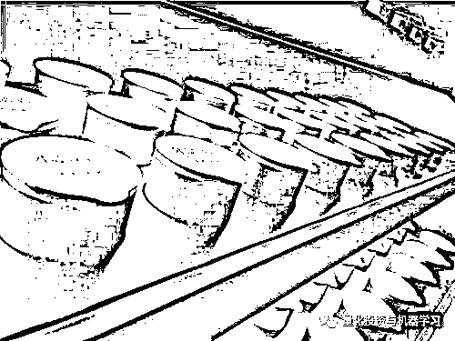

# 不是谁都可以成为喜茶、瑞幸、小罐茶！

> 原文：[`mp.weixin.qq.com/s?__biz=MzAxNTc0Mjg0Mg==&mid=2653294297&idx=1&sn=de7d76472510f4eb1b92463a2c52131d&chksm=802dccccb75a45da879d9f472097f5c24077244eba181311bb5bde02115894593aa6bba656c9&scene=27#wechat_redirect`](http://mp.weixin.qq.com/s?__biz=MzAxNTc0Mjg0Mg==&mid=2653294297&idx=1&sn=de7d76472510f4eb1b92463a2c52131d&chksm=802dccccb75a45da879d9f472097f5c24077244eba181311bb5bde02115894593aa6bba656c9&scene=27#wechat_redirect)

**标星★公众号     **爱你们♥

来 源：新消费内参

作 者：龙猫君

**近期原创文章：**

## ♥ [5 种机器学习算法在预测股价的应用（代码+数据）](https://mp.weixin.qq.com/s?__biz=MzAxNTc0Mjg0Mg==&mid=2653290588&idx=1&sn=1d0409ad212ea8627e5d5cedf61953ac&chksm=802dc249b75a4b5fa245433320a4cc9da1a2cceb22df6fb1a28e5b94ff038319ae4e7ec6941f&token=1298662931&lang=zh_CN&scene=21#wechat_redirect)

## ♥ [Two Sigma 用新闻来预测股价走势，带你吊打 Kaggle](https://mp.weixin.qq.com/s?__biz=MzAxNTc0Mjg0Mg==&mid=2653290456&idx=1&sn=b8d2d8febc599742e43ea48e3c249323&chksm=802e3dcdb759b4db9279c689202101b6b154fb118a1c1be12b52e522e1a1d7944858dbd6637e&token=1330520237&lang=zh_CN&scene=21#wechat_redirect)

## ♥ 2 万字干货：[利用深度学习最新前沿预测股价走势](https://mp.weixin.qq.com/s?__biz=MzAxNTc0Mjg0Mg==&mid=2653290080&idx=1&sn=06c50cefe78a7b24c64c4fdb9739c7f3&chksm=802e3c75b759b563c01495d16a638a56ac7305fc324ee4917fd76c648f670b7f7276826bdaa8&token=770078636&lang=zh_CN&scene=21#wechat_redirect)

## ♥ [机器学习在量化金融领域的误用！](http://mp.weixin.qq.com/s?__biz=MzAxNTc0Mjg0Mg==&mid=2653292984&idx=1&sn=3e7efe9fe9452c4a5492d2175b4159ef&chksm=802dcbadb75a42bbdce895c49070c3f552dc8c983afce5eeac5d7c25974b7753e670a0162c89&scene=21#wechat_redirect)

## ♥ [基于 RNN 和 LSTM 的股市预测方法](https://mp.weixin.qq.com/s?__biz=MzAxNTc0Mjg0Mg==&mid=2653290481&idx=1&sn=f7360ea8554cc4f86fcc71315176b093&chksm=802e3de4b759b4f2235a0aeabb6e76b3e101ff09b9a2aa6fa67e6e824fc4274f68f4ae51af95&token=1865137106&lang=zh_CN&scene=21#wechat_redirect)

## ♥ [如何鉴别那些用深度学习预测股价的花哨模型？](https://mp.weixin.qq.com/s?__biz=MzAxNTc0Mjg0Mg==&mid=2653290132&idx=1&sn=cbf1e2a4526e6e9305a6110c17063f46&chksm=802e3c81b759b597d3dd94b8008e150c90087567904a29c0c4b58d7be220a9ece2008956d5db&token=1266110554&lang=zh_CN&scene=21#wechat_redirect)

## ♥ [优化强化学习 Q-learning 算法进行股市](https://mp.weixin.qq.com/s?__biz=MzAxNTc0Mjg0Mg==&mid=2653290286&idx=1&sn=882d39a18018733b93c8c8eac385b515&chksm=802e3d3bb759b42d1fc849f96bf02ae87edf2eab01b0beecd9340112c7fb06b95cb2246d2429&token=1330520237&lang=zh_CN&scene=21#wechat_redirect)

## ♥ [WorldQuant 101 Alpha、国泰君安 191 Alpha](https://mp.weixin.qq.com/s?__biz=MzAxNTc0Mjg0Mg==&mid=2653290927&idx=1&sn=ecca60811da74967f33a00329a1fe66a&chksm=802dc3bab75a4aac2bb4ccff7010063cc08ef51d0bf3d2f71621cdd6adece11f28133a242a15&token=48775331&lang=zh_CN&scene=21#wechat_redirect)

## ♥ [基于回声状态网络预测股票价格（附代码）](https://mp.weixin.qq.com/s?__biz=MzAxNTc0Mjg0Mg==&mid=2653291171&idx=1&sn=485a35e564b45046ff5a07c42bba1743&chksm=802dc0b6b75a49a07e5b91c512c8575104f777b39d0e1d71cf11881502209dc399fd6f641fb1&token=48775331&lang=zh_CN&scene=21#wechat_redirect)

## ♥ [计量经济学应用投资失败的 7 个原因](https://mp.weixin.qq.com/s?__biz=MzAxNTc0Mjg0Mg==&mid=2653292186&idx=1&sn=87501434ae16f29afffec19a6884ee8d&chksm=802dc48fb75a4d99e0172bf484cdbf6aee86e36a95037847fd9f070cbe7144b4617c2d1b0644&token=48775331&lang=zh_CN&scene=21#wechat_redirect)

## ♥ [配对交易千千万，强化学习最 NB！（文档+代码）](http://mp.weixin.qq.com/s?__biz=MzAxNTc0Mjg0Mg==&mid=2653292915&idx=1&sn=13f4ddebcd209b082697a75544852608&chksm=802dcb66b75a4270ceb19fac90eb2a70dc05f5b6daa295a7d31401aaa8697bbb53f5ff7c05af&scene=21#wechat_redirect)

## ♥ [关于高盛在 Github 开源背后的真相！](https://mp.weixin.qq.com/s?__biz=MzAxNTc0Mjg0Mg==&mid=2653291594&idx=1&sn=7703403c5c537061994396e7e49e7ce5&chksm=802dc65fb75a4f49019cec951ac25d30ec7783738e9640ec108be95335597361c427258f5d5f&token=48775331&lang=zh_CN&scene=21#wechat_redirect)

## ♥ [新一代量化带货王诞生！Oh My God！](https://mp.weixin.qq.com/s?__biz=MzAxNTc0Mjg0Mg==&mid=2653291789&idx=1&sn=e31778d1b9372bc7aa6e57b82a69ec6e&chksm=802dc718b75a4e0ea4c022e70ea53f51c48d102ebf7e54993261619c36f24f3f9a5b63437e9e&token=48775331&lang=zh_CN&scene=21#wechat_redirect)

## ♥ [独家！关于定量/交易求职分享（附真实试题）](https://mp.weixin.qq.com/s?__biz=MzAxNTc0Mjg0Mg==&mid=2653291844&idx=1&sn=3fd8b57d32a0ebd43b17fa68ae954471&chksm=802dc751b75a4e4755fcbb0aa228355cebbbb6d34b292aa25b4f3fbd51013fcf7b17b91ddb71&token=48775331&lang=zh_CN&scene=21#wechat_redirect)

## ♥ [Quant 们的身份危机！](https://mp.weixin.qq.com/s?__biz=MzAxNTc0Mjg0Mg==&mid=2653291856&idx=1&sn=729b657ede2cb50c96e92193ab16102d&chksm=802dc745b75a4e53c5018cc1385214233ec4657a3479cd7193c95aaf65642f5f45fa0e465694&token=48775331&lang=zh_CN&scene=21#wechat_redirect)

## ♥ [拿起 Python，防御特朗普的 Twitter](https://mp.weixin.qq.com/s?__biz=MzAxNTc0Mjg0Mg==&mid=2653291977&idx=1&sn=01f146e9a88bf130ca1b479573e6d158&chksm=802dc7dcb75a4ecadfdbdace877ed948f56b72bc160952fd1e4bcde27260f823c999a65a0d6d&token=48775331&lang=zh_CN&scene=21#wechat_redirect)

## ♥ [AQR 最新研究 | 机器能“学习”金融吗？](http://mp.weixin.qq.com/s?__biz=MzAxNTc0Mjg0Mg==&mid=2653292710&idx=1&sn=e5e852de00159a96d5dcc92f349f5b58&chksm=802dcab3b75a43a5492bc98874684081eb5c5666aff32a36a0cdc144d74de0200cc0d997894f&scene=21#wechat_redirect)

**前言**

这是一篇不吐不快的文章。

最近在后台收到一个私信，私信很长，是一位苦心的创始人写给龙猫君的一篇文章：

文章大概意思是这样的：他是一位小老板，最近听说拼多多很火，自己因为以前做水果生意的时候，积累了 100 多个微信群友的资源，然后他想做一个水果行业的拼多多，问我可不可以给他介绍一些行业资源投资他。

当然，我没有给他介绍行业资源，因为没办法介绍。

无独有偶，我几个月前参加了一个饭局，席间，一位屡战屡败创始人，又在谋划一个大项目：我认识 XX 谁，有很多流量资源，我也认识好多 KOL，XX 是我的好哥们，有他的流量加持，我的生意马上就估值一个亿，你们投我肯定不亏的。

过了几个月，看看这个朋友的朋友圈，好像开始整起了私域流量，开始卖起了货，之前的大项目已经忘之脑后了。

我把这些人统统称之为：**生意过度简单定律**。

**别人红了，都是靠资本烧起来的？**

首先，想讲一个问题，做消费品，做生意难吗？

当然很难。全中国有 13 亿人口，但是全中国只有 3000 多家上市公司，而即使做到所谓上市还有公司完蛋的时候，今年还只过了一半，就有 10 多个老板进去了。

所以，生意很难的。

但是生意为什么在前几年给人感觉突然变得简单了？

其实不是真的变得简单的，而是大家得了一种病，叫做认为一个事情很简单定律。

也就是轻易否定他人综合征，把别人的成功误以为很简单。

很多人的口头禅就是：**这有什么难的，给我钱，我也给你烧出一个瑞幸。**

**我跟瑞幸比，就差了一笔钱******

说这句话的人，让我想起来一篇文章，叫对有一种力量，你一无所知。

有一种没有耐心的喷子，看到别人成了作家，就觉得人家写稿很容易，于是决定发奋当作家，结果坚持写了三天就写不下去了。

同样，嘴里说别人红了，只是因为钱多烧起来的，永远不愿意承认若干事实：

**事实一：****当你创业做生意的时候，永远也不会有人给你这么多钱。**

瑞幸为什么钱多？为什么资本愿意给瑞幸钱去扩大规模，而不是把钱给你这个只能在文章下喷的喷子，因为你不行啊！因为你能力差啊！

这个世界上，资本永远最聪明，钱是世界上相对公正投票的事物。

你给社会贡献更大价值，那你就应该赚更多钱，意味着你给世界创造了更大劳动价值，只是钱有很多表达方式，比如可能钱不多，但赚得名誉，或者被后世记住，以及永远活在人们心中也是一种财富获得和表达方式。

所以钱，永远会向更能创造价值的人手上集中，从而让他们创造更大社会价值以及商业价值。

比如我创业和一个成功上市团队，钱肯定会给成功上市团队，因为把钱给我赔掉概率一定更大。

同样，那些整天说只要给你钱，你就可以烧出一家瑞幸的，我想问你几个问题：

**给你钱，你就能找到一个又懂线下，又懂线上的团队吗？瑞幸团队曾经经营的神州专车的租车生意肯定是当年难度最大的生意之一。**

因为管理这么多租车重资产，同时还要经营几百个门店是非常困难的。

而瑞幸陆正耀团队做到过，反而今天来经营瑞幸几千家门店相对容易一些。

我有一个当年总爱喷别人生意很容易做的朋友，最近遇到了一个烦心的事情。

他在一个小商场里开了一家小咖啡厅，租金还没到期，商业地产要把他赶走，不给退租金，他欲哭无泪，天天愁眉苦脸。

我说，你当初不是说线下开几百个咖啡厅算啥的吗？怎么碰到个商场不给你退租金，就愁眉苦脸，一筹不展了。

咖啡厅开了三个月，25 块钱一杯咖啡，结果一天也卖不出去一杯咖啡。

亏损了几十万，再也不吐槽瑞幸咖啡亏损了，因为自己也亏了。找亲戚朋友借钱，想要东山再起，结果并没有人借钱给他。

**事实二：给你一大笔钱，你真的就会花吗？**

很多人没见过钱，以为只要给自己一笔钱就会做公司，或者给自己一大笔钱就会做公司。

所以，往往很多人公司倒闭都会归结为融资失败，才导致公司失败，真是可笑。如果一个公司，因为没有融到资而失败，我感觉给钱了也不大可能成功。

所以，很多根本连商业感觉和商业格局都没有的人，却在那里嘲笑瑞幸只会烧钱。

给你一大笔钱，你就能开 1000 多家店，每家店都可以管理的井井有条？怕估计光是供应链和开店装修都搞不定吧？

给你一笔钱，你就可以招聘几千人，管的什么事情都不发生？经常看一个店都没管过的人，在那里嘲笑瑞幸，结果估计自己下面四个员工都离职一半了。

给你一笔钱，就能把公司运营到纳斯达克？没见到大批公司 C 轮倒闭吗？

总有无知者，用容易定律否定他人。我不太懂商业大道理，我隐隐觉得，做很多人都知道的品牌非常之困难。

以前当记者的时候，非常自负和自我膨胀，这是记者看客通病。自己没有下场做过的人，批评其他人来，都是手到擒来，后来自己下场创业，才发现，管理一个 10 人团队都不容易。

如果一个公司违法违背职业道德，应该批评，而抓住一个公司，就用失败的 OFO 类比，非常不合适，这个社会的人容忍创新和失败的能力都太低。

所以，有些公司，不是有钱就能做起来的，给一个不会花钱的人，你可能更快把自己的公司干垮。

一个公司能做起来，既有运气，但是归根结底是靠实力。

我也鄙视欺骗用户，侵害用户利益，侵害社会公德，或者无底线炒作的公司。

但我同样厌恶，对创新轻易否定的事情。

所以一个公司擅于融资，并且利用资本快速发展，本来就是一种能力。

在我看好瑞幸的理由中，隐含着我对新商业的期待。

首先，咖啡产业，过去在中国绝对没有太大声量，在瑞幸这样后来者进入之前，除了星巴克，你知道哪些民族品牌。

很多人认为不好喝，中国 13 亿人口，有多少人知道咖啡也好喝？

那些高高在上谈什么咖啡好喝的人，也没见你把咖啡从小众圈推广到人尽皆知。

咖啡首选需要解决的是从毫无认知，或者是让中国人每个人起码都尝一次咖啡，才有资格让国人谈谈什么是好喝的咖啡问题。

所以，第一阶段必然需要大量花钱做用户普及，就像你现在使用滴滴打车，没有资本普及，你知道还有打车 APP 方便自己？

花钱打品牌，是一个品牌正常行为。何况这个品牌每一块钱都有用户转化。

后面我不太想继续写，免得大家认为我只是夸瑞幸。我认为大家看一家公司，不要轻易否定，以及单独认为人家只是某个原因成功的。

作为创业者，最重要的是，从每个商业案例中学习，吸取营业，而不是看人云亦云，结果反而阻止了自己的成长，让自己成为一个坐井观天的角色。

**别人红了，真的只是靠排队？**

我见过一堆自己茶饮店做的差的人士，整天在那里愤愤不平，觉得喜茶红了都是靠排队。

我还发现一个有趣的定律，凡是做的不怎么好的，都爱通过攻击别人，来证明自己。

但是让自己雇人排队让自己火，却好像并没有什么信心。

所以喜茶这样据传这一轮估值到 90 亿的公司，真的只是靠雇人排队火的吗？

所以，如果让你天天雇人排队，可以把自己的品牌也同样做火吗？

答案当然是否定的，只有缺乏常识的人，才往往认为某个餐厅火主要是靠雇人排队。

一个品牌火一天你可以说靠营销，但是一个餐厅火很久，一定是有自己独特的做对了的地方。

看遍整个餐饮圈，Neo（喜茶创始人）是少有而罕见的，能对自己的产品有深刻洞察的人。

过去做茶行业的人，我也见过一波有一波。

一上来就给我大谈茶文化，结果不谈用户需求，也不谈如何做一个满足用户需求的产品。

要不就是前面还在说用匠心做一个产品，后脚就在思考怎么多找个加盟商，多赚五块钱。

之后看见人家火了，跳起脚来骂人家就只靠排队，这种格局的生意人，做不大太正常。

做成一个伟大的品牌，一定是有坚韧不拔的初心。找个世界上说想做个好产品的人很多，但真正把大量时间花在产品上的人，很少。据说，喜茶创始人大部分时间都花在自己的产品琢磨上。

所以，喜茶的成功，其实没那么复杂，既不是排队，也不是营销，而是有一个好的产品系统。

更一步来说，好喝。且可以满足品牌装逼需求。

那些口里说，我也可以跟喜茶做一样口感的人，无论怎么努力，最后都没有喜茶火，或者做成喜茶，原因是什么？少了自己真正沉下来打造产品的努力。

喜茶的产品真的这么容易做？有多少做产品的人都有谦卑之心，细下来想想自己的产品。

产品当然不只是口感这一步，还包括店面的产品，包括品牌感受的产品。

我现在对任何产品都多了敬畏之心，每一个把公司，把品牌做的很好的公司，都是系统的胜利。

也就是好品牌好公司，是一个组织系统，产品系统，资本系统完美结合。

而不是像无知者的结论，它只是钱多，只是雇佣人排队。

这大概跟想象皇帝用金锄头吃饭是一个道理，只有井底之蛙才会认为皇帝跟自己一样用金锄头吃饭。

以后千万不要用单一结论，去否定一个公司。就像我没喝过喜茶之前，我总觉得好像就是排队才火一样。

喝过喜茶产品之后，我才明白，是因为产品好，才排队。

产品好，很多人都觉得只要有个研发配方就好。这让我想起了，早期很多火锅店去学海底捞一样，以为挖几个海底捞的人就能做成海底捞一样，忽略了人家整个公司的系统，人的组织系统，文化系统。

哪一条都做起来都是非常困难的。

就像你做成喜茶，也不只是挖了喜茶配方就可以做成喜茶的。一个现象或者一个好公司，往往都是系统的成功。

一个公司失败，也不是突然就失败的。往往都是系统的失败。

**别人红了，真的就只是靠营销？**

这里又要说一个误解很深的案例，小罐茶这家公司

因为其老板过往做过很经典的营销，大家就对这个渠道铺得深，营销做的好的产品而忽略。

我对好产品的定义跟大家往往不一样，什么样的产品是好产品？就是恰到好处满足用户需求的产品就是好产品。

就像起初很多人抨击拼多多，觉得卖的产品太 low 了，就像很多人抨击快手的人太 low 一样。

好像在这群人眼里，必须要像自己一样才行。却不知道世界是多元分层的。

有人就是要用拼多多上一块钱的卫生纸，你去用消费升级的 50 块的纸，都无可厚非。

而很多人总是爱用自己的消费习惯去定义他人。

小罐茶产品本来就是定义于送礼为主社交货币型产品，这群人翻来覆去好像一句话，就是靠营销。

那哪个美妆产品不是靠营销？营销和资本一样都是商业的重要手段，营销也是产品重要的一环。

营销本质就是满足用户需求并且获得自己的商业价值，总有人爱用自己的道德优越感去评价商业行为。

再从我的角度谈谈，为什么小罐茶是一个好的产品。

中国过去茶行业，都是有品类与无品牌。同时喜欢大谈产地和传统，往往导致传统供应链供给优先。

同时茶行业价格信息不透明，同样产品，不同价格，整个社会认知是混乱的。

所以喜茶打破茶的品类概念，比如乌龙还是铁观音。

而对于大众消费者而言，其实根本不需要了解茶是什么品类，茶就是茶，只要好喝就行。

所以喜茶脱离原产地概念以后，反而迅速普及茶的概念。

而我猜测小罐茶，未来大概率会大举进入快消领域。

我在小罐茶办公室和创始人长谈过一次，给我印象深刻。创始人为了做这个产品，先从供应端开始起步，前后花了几年时间去改造产品供应链，起步就是大手笔。

也就是前面今年都是在仔细做自己的产品，而外界对这个产品充满了认知偏见。

在他们心中好的产品一定就是他们视野的好产品。

比如越是传统产品人，越爱不停的讲功能这个产品基础卖点。

却不知道，**今天好的产品，核心是满足用户场景和需求。**

社交货币产品就是需要营销来营造品牌感，你去跟茅台谈论，你不就是个酒吗？为啥卖这么贵，不是一个可笑的事情吗？

再比如老有人在讲眼镜行业是暴利，其实也是个认知偏见。

很多不理解商业的人，总是把产品成本就是理解为产品材料成本。

但是产品还附加营销和交付成本的。眼镜作为低频消费产品，没有加价率根本支撑不起持续商业交付。

所以很多产品成本，是一个综合成本考虑，包括知识产权，附加价值。

也有很多产品，还有设计高价值。

所以一个产品价格高，往往是因为有大量隐性成本。离开了这一点去批驳一个产品是毫无意义的。

小罐茶在产品创新和营销，以及对茶产业供应链的创新都是很多人不愿意学习和研究的，反而容易人云亦云，只是靠营销。

很少用系统思考视角，去想想一个产品做起来，我们到底去学什么。

**偏见，是如何阻碍我们的？**

我们最后再来谈谈，一个好的产品到底是什么？

麦当劳好吃吗？肯定不那么好吃。

但是麦当劳核心产品是快餐，快餐核心是什么？是快。

你会要求你中餐快餐多好吃吗？实话说，我吃过的某个大家眼中好吃的快餐，真的在我心中实在难吃。

但是我还是在吃，因为附近区域只有这一家供给，而且配送速度也非常之快。

所以快餐核心就不是让你好吃，他们也很难做到好吃。

我在成都吃的任意一家小苍蝇馆都好吃，为什么他们却没有做大。

而不好吃的快餐却可以开几百家店铺？

那是因为不同产品对应不同需求的。同样，很多创新的产品也是对应不同需求的。

一双球鞋不一定是来穿的，而是用来炫耀的。

**多用不同角度去思考，一个产品为什么做得好，满足什么需求。**

你会慢慢改变自己狭隘的视角和偏见的，试着不要人云亦云，这是有好处的。

所以，我们有些品牌为什么做不成这些品牌这么好，因为自己的偏见阻碍了自己的学习，或者是嫉妒阻碍了自己进步。

一看别人做的好，就习惯性否定别人，这样才能获得自尊感。

如果大家都在讨论一个东西，就还是认真听听，认真看看。

就像看到这篇文章，先不要骂我是不是收了软文费，而是先看看，我写的文章是否可以学习。

所以，每一个生意，都没有那么容易。

别人都不是轻易成功，而不只是你认为的那个简单的理由。

这才是我们正确的生存和思考之道。

只有这样，我们才会成长进步，越来越好。学会不要简单否定他人。

一个好的创始人一定是擅于学习的创始人，学习就从不轻易否定他人创新开始。

这是一个好习惯，反之就是坏习惯。

否定别人除了获得至尊优越感，毫无好处。

选择相信，才能不断获得更多东西。

*—End—*

量化投资与机器学习微信公众号，是业内垂直于**Quant**、**MFE**、**CST、AI**等专业的**主****流量化自媒体**。公众号拥有来自**公募、私募、券商、银行、海外**等众多圈内**18W+**关注者。每日发布行业前沿研究成果和最新量化资讯。

你点的每个“在看”，我们都认真当成了喜欢