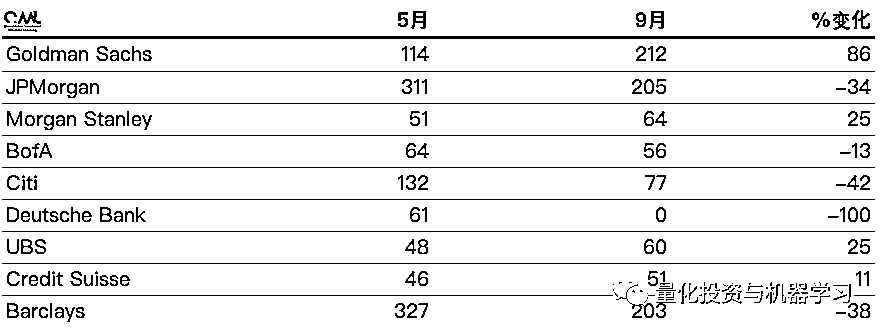
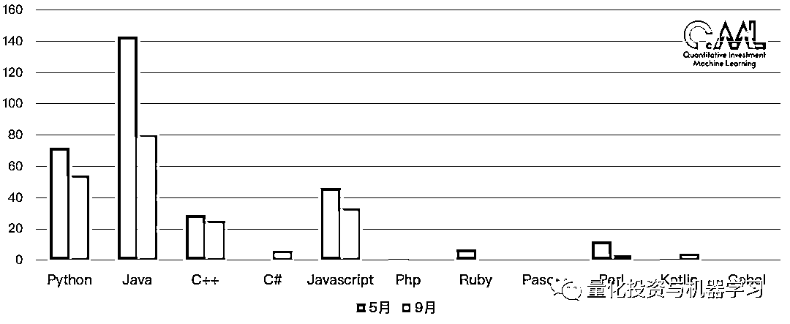
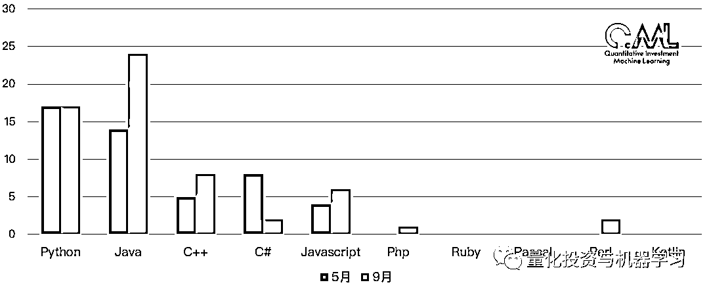
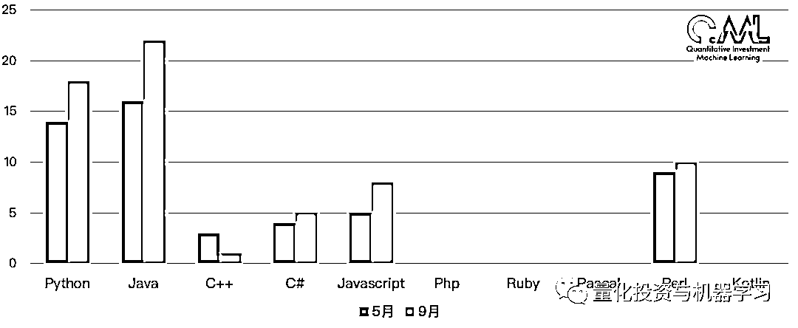
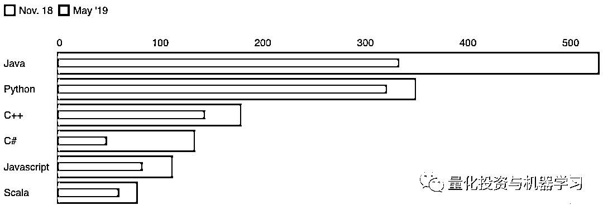
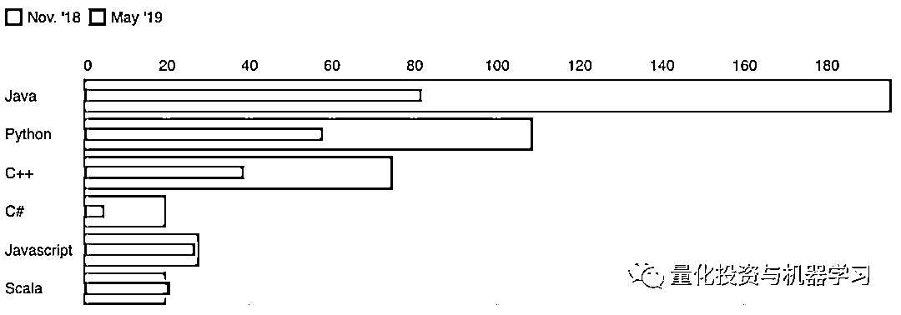
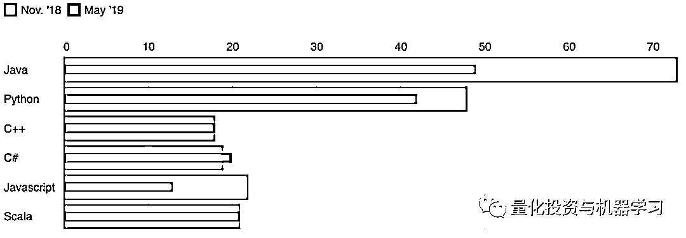

# 最新：国际顶尖投行排名第一的编程语言，你会吗？

> 原文：[`mp.weixin.qq.com/s?__biz=MzAxNTc0Mjg0Mg==&mid=2653294282&idx=1&sn=7d1cef3687bf5bac37fd3b7934a3fcdd&chksm=802dccdfb75a45c9380e40c7123011abf0743c1d6639f642de5678d7acc4a300a589531db44e&scene=27#wechat_redirect`](http://mp.weixin.qq.com/s?__biz=MzAxNTc0Mjg0Mg==&mid=2653294282&idx=1&sn=7d1cef3687bf5bac37fd3b7934a3fcdd&chksm=802dccdfb75a45c9380e40c7123011abf0743c1d6639f642de5678d7acc4a300a589531db44e&scene=27#wechat_redirect)

**标星★公众号     **爱你们♥

**近期原创文章：**

## ♥ [5 种机器学习算法在预测股价的应用（代码+数据）](https://mp.weixin.qq.com/s?__biz=MzAxNTc0Mjg0Mg==&mid=2653290588&idx=1&sn=1d0409ad212ea8627e5d5cedf61953ac&chksm=802dc249b75a4b5fa245433320a4cc9da1a2cceb22df6fb1a28e5b94ff038319ae4e7ec6941f&token=1298662931&lang=zh_CN&scene=21#wechat_redirect)

## ♥ [Two Sigma 用新闻来预测股价走势，带你吊打 Kaggle](https://mp.weixin.qq.com/s?__biz=MzAxNTc0Mjg0Mg==&mid=2653290456&idx=1&sn=b8d2d8febc599742e43ea48e3c249323&chksm=802e3dcdb759b4db9279c689202101b6b154fb118a1c1be12b52e522e1a1d7944858dbd6637e&token=1330520237&lang=zh_CN&scene=21#wechat_redirect)

## ♥ 2 万字干货：[利用深度学习最新前沿预测股价走势](https://mp.weixin.qq.com/s?__biz=MzAxNTc0Mjg0Mg==&mid=2653290080&idx=1&sn=06c50cefe78a7b24c64c4fdb9739c7f3&chksm=802e3c75b759b563c01495d16a638a56ac7305fc324ee4917fd76c648f670b7f7276826bdaa8&token=770078636&lang=zh_CN&scene=21#wechat_redirect)

## ♥ [机器学习在量化金融领域的误用！](http://mp.weixin.qq.com/s?__biz=MzAxNTc0Mjg0Mg==&mid=2653292984&idx=1&sn=3e7efe9fe9452c4a5492d2175b4159ef&chksm=802dcbadb75a42bbdce895c49070c3f552dc8c983afce5eeac5d7c25974b7753e670a0162c89&scene=21#wechat_redirect)

## ♥ [基于 RNN 和 LSTM 的股市预测方法](https://mp.weixin.qq.com/s?__biz=MzAxNTc0Mjg0Mg==&mid=2653290481&idx=1&sn=f7360ea8554cc4f86fcc71315176b093&chksm=802e3de4b759b4f2235a0aeabb6e76b3e101ff09b9a2aa6fa67e6e824fc4274f68f4ae51af95&token=1865137106&lang=zh_CN&scene=21#wechat_redirect)

## ♥ [如何鉴别那些用深度学习预测股价的花哨模型？](https://mp.weixin.qq.com/s?__biz=MzAxNTc0Mjg0Mg==&mid=2653290132&idx=1&sn=cbf1e2a4526e6e9305a6110c17063f46&chksm=802e3c81b759b597d3dd94b8008e150c90087567904a29c0c4b58d7be220a9ece2008956d5db&token=1266110554&lang=zh_CN&scene=21#wechat_redirect)

## ♥ [优化强化学习 Q-learning 算法进行股市](https://mp.weixin.qq.com/s?__biz=MzAxNTc0Mjg0Mg==&mid=2653290286&idx=1&sn=882d39a18018733b93c8c8eac385b515&chksm=802e3d3bb759b42d1fc849f96bf02ae87edf2eab01b0beecd9340112c7fb06b95cb2246d2429&token=1330520237&lang=zh_CN&scene=21#wechat_redirect)

## ♥ [WorldQuant 101 Alpha、国泰君安 191 Alpha](https://mp.weixin.qq.com/s?__biz=MzAxNTc0Mjg0Mg==&mid=2653290927&idx=1&sn=ecca60811da74967f33a00329a1fe66a&chksm=802dc3bab75a4aac2bb4ccff7010063cc08ef51d0bf3d2f71621cdd6adece11f28133a242a15&token=48775331&lang=zh_CN&scene=21#wechat_redirect)

## ♥ [基于回声状态网络预测股票价格（附代码）](https://mp.weixin.qq.com/s?__biz=MzAxNTc0Mjg0Mg==&mid=2653291171&idx=1&sn=485a35e564b45046ff5a07c42bba1743&chksm=802dc0b6b75a49a07e5b91c512c8575104f777b39d0e1d71cf11881502209dc399fd6f641fb1&token=48775331&lang=zh_CN&scene=21#wechat_redirect)

## ♥ [计量经济学应用投资失败的 7 个原因](https://mp.weixin.qq.com/s?__biz=MzAxNTc0Mjg0Mg==&mid=2653292186&idx=1&sn=87501434ae16f29afffec19a6884ee8d&chksm=802dc48fb75a4d99e0172bf484cdbf6aee86e36a95037847fd9f070cbe7144b4617c2d1b0644&token=48775331&lang=zh_CN&scene=21#wechat_redirect)

## ♥ [配对交易千千万，强化学习最 NB！（文档+代码）](http://mp.weixin.qq.com/s?__biz=MzAxNTc0Mjg0Mg==&mid=2653292915&idx=1&sn=13f4ddebcd209b082697a75544852608&chksm=802dcb66b75a4270ceb19fac90eb2a70dc05f5b6daa295a7d31401aaa8697bbb53f5ff7c05af&scene=21#wechat_redirect)

## ♥ [关于高盛在 Github 开源背后的真相！](https://mp.weixin.qq.com/s?__biz=MzAxNTc0Mjg0Mg==&mid=2653291594&idx=1&sn=7703403c5c537061994396e7e49e7ce5&chksm=802dc65fb75a4f49019cec951ac25d30ec7783738e9640ec108be95335597361c427258f5d5f&token=48775331&lang=zh_CN&scene=21#wechat_redirect)

## ♥ [新一代量化带货王诞生！Oh My God！](https://mp.weixin.qq.com/s?__biz=MzAxNTc0Mjg0Mg==&mid=2653291789&idx=1&sn=e31778d1b9372bc7aa6e57b82a69ec6e&chksm=802dc718b75a4e0ea4c022e70ea53f51c48d102ebf7e54993261619c36f24f3f9a5b63437e9e&token=48775331&lang=zh_CN&scene=21#wechat_redirect)

## ♥ [独家！关于定量/交易求职分享（附真实试题）](https://mp.weixin.qq.com/s?__biz=MzAxNTc0Mjg0Mg==&mid=2653291844&idx=1&sn=3fd8b57d32a0ebd43b17fa68ae954471&chksm=802dc751b75a4e4755fcbb0aa228355cebbbb6d34b292aa25b4f3fbd51013fcf7b17b91ddb71&token=48775331&lang=zh_CN&scene=21#wechat_redirect)

## ♥ [Quant 们的身份危机！](https://mp.weixin.qq.com/s?__biz=MzAxNTc0Mjg0Mg==&mid=2653291856&idx=1&sn=729b657ede2cb50c96e92193ab16102d&chksm=802dc745b75a4e53c5018cc1385214233ec4657a3479cd7193c95aaf65642f5f45fa0e465694&token=48775331&lang=zh_CN&scene=21#wechat_redirect)

## ♥ [拿起 Python，防御特朗普的 Twitter](https://mp.weixin.qq.com/s?__biz=MzAxNTc0Mjg0Mg==&mid=2653291977&idx=1&sn=01f146e9a88bf130ca1b479573e6d158&chksm=802dc7dcb75a4ecadfdbdace877ed948f56b72bc160952fd1e4bcde27260f823c999a65a0d6d&token=48775331&lang=zh_CN&scene=21#wechat_redirect)

## ♥ [AQR 最新研究 | 机器能“学习”金融吗？](http://mp.weixin.qq.com/s?__biz=MzAxNTc0Mjg0Mg==&mid=2653292710&idx=1&sn=e5e852de00159a96d5dcc92f349f5b58&chksm=802dcab3b75a43a5492bc98874684081eb5c5666aff32a36a0cdc144d74de0200cc0d997894f&scene=21#wechat_redirect)

作者：公众号海外部

让我们先来看看热门编程语言的岗位竞争力：  

**Java：每个岗位对应 11.7 名求职者**

尽管最近在某些方面输给了 Python，**Java 目前出现在全球超过 2000 个金融岗位上**，仍然是投行的最佳之选。更重要的是，我们统计到的每一份资料都**将编程语言列为一项必备技能**。

**C#：每个岗位对应 13.9 名求职者**

由于当前交易环境中的新要求，C#的需求有所下降。Tigerspike 负责技术和策略的副总裁 Christian Glover Wilson 表示：它仍在使用，但目前基本上只用于数量较多的低延迟的项目。每一个包含 C#的岗位都提到了 Java。竞争越来越少，可获得的工作机会也越来越少。

**Python: **每个岗位对应**14.6 个求职者**

Python 曾经主要用于定价、风险管理和交易管理平台，在过去一年里，它在美国各大投银中逐渐变得更受欢迎。增长的部分原因可能是非开发人员也开始使用 Python，因为**Python 具有开源且多功能的库并上手很快****。 交****易员、分析师和研究员现在都在自己的工作中使用它**。 花旗甚至为非工程师提供 Python 课程。

虽然 Python 看起来不像 Java 那样提供同样的优势，但是有 Python 经验可能会带来更高的薪水，至少在纽约是这样。 

**C++：每个岗位对应 24.5 个求职者**

与 C#一样，几乎所有简历都提到 Java 和 Python，但都将 C++列为可选的技能。**目前在国内，由于高频交易的兴起与流行，C++工程师很缺！**

**Cobol：每个岗位对应 58.3 个求职者**

Cobol 曾被法国软件工程师 Bertrand Besnard 称为“最讨厌的语言”和“每个人都想摆脱的语言”，30 年来它似乎一直处于灭绝的边缘。大多数候选人不太可能是 Cobol 专家。COBOL Cowboys 是一家专门从事这门语言的人力资源和咨询公司，该公司创始人 Bill Hinshaw 说：有这种能力的人有望比专攻 Java 的人多挣 20%左右。它充其量是一种专业的编程语言。

**英国投行举例**

我们拿英国来做具体分析，我们对 2019 年 9 月和 2019 年 5 月在英国各大投行网站上发布的工作岗位进行了分析。在这两个时期**Java 和 Python 主导**了招聘列表，C++，Javascript 和 C#紧随其后。

*英国地区

我们研究了**高盛（Goldman Sachs）、摩根大通（JPMorgan）、摩根士丹利（Morgan Stanley）、美国银行（Bank of America）、花旗（Citi）、德意志银行（Deutsche Bank）、瑞银（UBS）、瑞士信贷（Credit Suisse）和巴克莱银行（Barclays**）这几家顶尖的投行。

**整体概括**

并非所有投行都在 5 月至 9 月期间削减了对编程人才的需求。在高盛、摩根士丹利和瑞银 ，需求大幅增长。然而，在德意志银行，这个数字跌至 0，原因大家都知道的。巴克莱银行目前是英国最大的技术人员招聘机构，但同期巴克莱银行对编程语言人才的需求下降了近 40% 。

英国地区 

**高盛**

**摩根大通**

**UBS**

**巴克莱银行**

**摩根士丹利**

···

**投行编程岗位空缺数据**

过去半年，纽约投资银行与科技相关的职位空缺数量大幅下降。例如，与去年秋季相比，摩根士丹利和花旗目前的岗位空缺远少于去年秋季的一半。与此同时，摩根大通在纽约的科技类职位空缺较去年 11 月减少了 55%。

下面这张图是一个整体的数据情况：

正如你所看到的，仅仅 6 个月之后，**Ja****va 就几乎被 Python 取代，成为纽约投行最受欢迎的编程语言**。就在去年秋天，纽约提到 Java 的职位空缺比需要 Python 的职位空缺多了 180 个。现在这一差距已被削减至 12 个。

过去的一段时间，有关 Python 的职位数量几乎没有变化。Python 使用率的上升就向前面说的，**非开发人员的使用等**。C#的百分比降幅最大，目前仍在使用，但主要用于一些低延迟项目。

自去年 11 月以来，高盛与编程相关的岗位空缺减少了一半以上。范围所有部门。高盛可能自称是一家技术公司，但其对限制成本的控制似乎缩减了工程师的数量，至少在纽约是这样。

高盛岗位空缺数据截止 5 月 

与此同时，摩根大通似乎有一些变化，Python 的使用度比去年明显增多。

摩根大通岗位空缺数据截止 5 月

最反常的是美国银行，Java、Python 和 C++的缺口都增加了一倍多。 过去六个月里，美国银行在纽约地区的技术工作岗位数量有所下降。通过梳理该行网站上的职位描述，很可能新的职位介绍加入了额外的编程语言，以便在搜索中更具包容性。虽然有重叠部分，但总体结果与去年一样：**美国银行似乎并不偏爱 Java 或 Python。**

美国银行岗位空缺数据截止 5 月

摩根士丹利和花旗的 Java 和 Python 职位空缺数量均大幅减少，不过它们似乎都更愿意**考虑在不太受欢迎的编程语言方面招聘具有专业知识的求职者**。

摩根士丹利岗位空缺数据截止 5 月

花旗岗位空缺数据截止 5 月

**全网编程排名视角**

这也和 PYPL 的排名结果类似。让我们来看看 2019 年 9 月最新的编程语言流行指数排名：

**Python 当之无愧**

全球范围内，Python 目前还是最流行的语言，它在过 5 年中份额增长最多，达到了 18.2%，而 Java 在过去 5 年中失去了最多的份额（-6.9%）。

**PYPL**（PopularitY of Programming Language，编程语言流行指数）是非常流行的参考指标，其榜单数据的排名均是根据榜单对象在 Google 上相关的搜索频率进行统计排名，原始数据来自 Google Trends，也就是说某项语言或者某款 IDE 在 Google 搜索频率越高，表示它越受欢迎。

再来看看 TIOBE：

其排名规则：

TOP10 编程语言走势图

TIOBE 排行榜是根据互联网上有经验的程序员、课程和第三方厂商的数量，并使用搜索引擎（如 Google、Bing、Yahoo!）以及 Wikipedia、Amazon、YouTube 统计出排名数据，只是反映某个编程语言的热门程度，并不能说明一门编程语言好不好，或者一门语言所编写的代码数量多少。

*—End—*

量化投资与机器学习微信公众号，是业内垂直于**Quant**、**MFE**、**CST、AI**等专业的**主****流量化自媒体**。公众号拥有来自**公募、私募、券商、银行、海外**等众多圈内**18W+**关注者。每日发布行业前沿研究成果和最新量化资讯。

你点的每个“在看”，我们都认真当成了喜欢