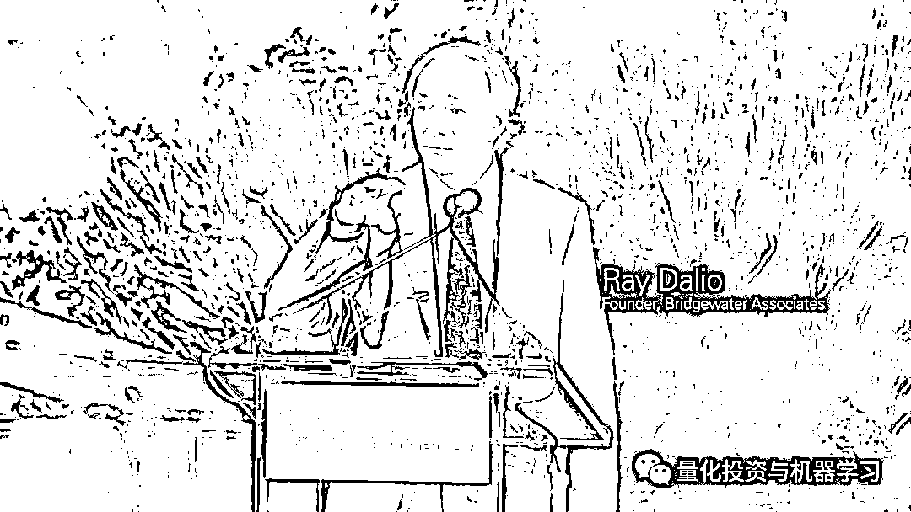

# 桥水达里奥：全球首只风险平价 ETF 即将问世！

> 原文：[`mp.weixin.qq.com/s?__biz=MzAxNTc0Mjg0Mg==&mid=2653294253&idx=1&sn=78b8e5c468ffe851ff950990466fe6b6&chksm=802dccb8b75a45aec5b87b082c27ac9341c6798e346d39005997a0f98875f306413e3c4ffca1&scene=27#wechat_redirect`](http://mp.weixin.qq.com/s?__biz=MzAxNTc0Mjg0Mg==&mid=2653294253&idx=1&sn=78b8e5c468ffe851ff950990466fe6b6&chksm=802dccb8b75a45aec5b87b082c27ac9341c6798e346d39005997a0f98875f306413e3c4ffca1&scene=27#wechat_redirect)

**标星★公众号     **爱你们♥

**近期原创文章：**

## ♥ [5 种机器学习算法在预测股价的应用（代码+数据）](https://mp.weixin.qq.com/s?__biz=MzAxNTc0Mjg0Mg==&mid=2653290588&idx=1&sn=1d0409ad212ea8627e5d5cedf61953ac&chksm=802dc249b75a4b5fa245433320a4cc9da1a2cceb22df6fb1a28e5b94ff038319ae4e7ec6941f&token=1298662931&lang=zh_CN&scene=21#wechat_redirect)

## ♥ [Two Sigma 用新闻来预测股价走势，带你吊打 Kaggle](https://mp.weixin.qq.com/s?__biz=MzAxNTc0Mjg0Mg==&mid=2653290456&idx=1&sn=b8d2d8febc599742e43ea48e3c249323&chksm=802e3dcdb759b4db9279c689202101b6b154fb118a1c1be12b52e522e1a1d7944858dbd6637e&token=1330520237&lang=zh_CN&scene=21#wechat_redirect)

## ♥ 2 万字干货：[利用深度学习最新前沿预测股价走势](https://mp.weixin.qq.com/s?__biz=MzAxNTc0Mjg0Mg==&mid=2653290080&idx=1&sn=06c50cefe78a7b24c64c4fdb9739c7f3&chksm=802e3c75b759b563c01495d16a638a56ac7305fc324ee4917fd76c648f670b7f7276826bdaa8&token=770078636&lang=zh_CN&scene=21#wechat_redirect)

## ♥ [机器学习在量化金融领域的误用！](http://mp.weixin.qq.com/s?__biz=MzAxNTc0Mjg0Mg==&mid=2653292984&idx=1&sn=3e7efe9fe9452c4a5492d2175b4159ef&chksm=802dcbadb75a42bbdce895c49070c3f552dc8c983afce5eeac5d7c25974b7753e670a0162c89&scene=21#wechat_redirect)

## ♥ [基于 RNN 和 LSTM 的股市预测方法](https://mp.weixin.qq.com/s?__biz=MzAxNTc0Mjg0Mg==&mid=2653290481&idx=1&sn=f7360ea8554cc4f86fcc71315176b093&chksm=802e3de4b759b4f2235a0aeabb6e76b3e101ff09b9a2aa6fa67e6e824fc4274f68f4ae51af95&token=1865137106&lang=zh_CN&scene=21#wechat_redirect)

## ♥ [如何鉴别那些用深度学习预测股价的花哨模型？](https://mp.weixin.qq.com/s?__biz=MzAxNTc0Mjg0Mg==&mid=2653290132&idx=1&sn=cbf1e2a4526e6e9305a6110c17063f46&chksm=802e3c81b759b597d3dd94b8008e150c90087567904a29c0c4b58d7be220a9ece2008956d5db&token=1266110554&lang=zh_CN&scene=21#wechat_redirect)

## ♥ [优化强化学习 Q-learning 算法进行股市](https://mp.weixin.qq.com/s?__biz=MzAxNTc0Mjg0Mg==&mid=2653290286&idx=1&sn=882d39a18018733b93c8c8eac385b515&chksm=802e3d3bb759b42d1fc849f96bf02ae87edf2eab01b0beecd9340112c7fb06b95cb2246d2429&token=1330520237&lang=zh_CN&scene=21#wechat_redirect)

## ♥ [WorldQuant 101 Alpha、国泰君安 191 Alpha](https://mp.weixin.qq.com/s?__biz=MzAxNTc0Mjg0Mg==&mid=2653290927&idx=1&sn=ecca60811da74967f33a00329a1fe66a&chksm=802dc3bab75a4aac2bb4ccff7010063cc08ef51d0bf3d2f71621cdd6adece11f28133a242a15&token=48775331&lang=zh_CN&scene=21#wechat_redirect)

## ♥ [基于回声状态网络预测股票价格（附代码）](https://mp.weixin.qq.com/s?__biz=MzAxNTc0Mjg0Mg==&mid=2653291171&idx=1&sn=485a35e564b45046ff5a07c42bba1743&chksm=802dc0b6b75a49a07e5b91c512c8575104f777b39d0e1d71cf11881502209dc399fd6f641fb1&token=48775331&lang=zh_CN&scene=21#wechat_redirect)

## ♥ [计量经济学应用投资失败的 7 个原因](https://mp.weixin.qq.com/s?__biz=MzAxNTc0Mjg0Mg==&mid=2653292186&idx=1&sn=87501434ae16f29afffec19a6884ee8d&chksm=802dc48fb75a4d99e0172bf484cdbf6aee86e36a95037847fd9f070cbe7144b4617c2d1b0644&token=48775331&lang=zh_CN&scene=21#wechat_redirect)

## ♥ [配对交易千千万，强化学习最 NB！（文档+代码）](http://mp.weixin.qq.com/s?__biz=MzAxNTc0Mjg0Mg==&mid=2653292915&idx=1&sn=13f4ddebcd209b082697a75544852608&chksm=802dcb66b75a4270ceb19fac90eb2a70dc05f5b6daa295a7d31401aaa8697bbb53f5ff7c05af&scene=21#wechat_redirect)

## ♥ [关于高盛在 Github 开源背后的真相！](https://mp.weixin.qq.com/s?__biz=MzAxNTc0Mjg0Mg==&mid=2653291594&idx=1&sn=7703403c5c537061994396e7e49e7ce5&chksm=802dc65fb75a4f49019cec951ac25d30ec7783738e9640ec108be95335597361c427258f5d5f&token=48775331&lang=zh_CN&scene=21#wechat_redirect)

## ♥ [新一代量化带货王诞生！Oh My God！](https://mp.weixin.qq.com/s?__biz=MzAxNTc0Mjg0Mg==&mid=2653291789&idx=1&sn=e31778d1b9372bc7aa6e57b82a69ec6e&chksm=802dc718b75a4e0ea4c022e70ea53f51c48d102ebf7e54993261619c36f24f3f9a5b63437e9e&token=48775331&lang=zh_CN&scene=21#wechat_redirect)

## ♥ [独家！关于定量/交易求职分享（附真实试题）](https://mp.weixin.qq.com/s?__biz=MzAxNTc0Mjg0Mg==&mid=2653291844&idx=1&sn=3fd8b57d32a0ebd43b17fa68ae954471&chksm=802dc751b75a4e4755fcbb0aa228355cebbbb6d34b292aa25b4f3fbd51013fcf7b17b91ddb71&token=48775331&lang=zh_CN&scene=21#wechat_redirect)

## ♥ [Quant 们的身份危机！](https://mp.weixin.qq.com/s?__biz=MzAxNTc0Mjg0Mg==&mid=2653291856&idx=1&sn=729b657ede2cb50c96e92193ab16102d&chksm=802dc745b75a4e53c5018cc1385214233ec4657a3479cd7193c95aaf65642f5f45fa0e465694&token=48775331&lang=zh_CN&scene=21#wechat_redirect)

## ♥ [拿起 Python，防御特朗普的 Twitter](https://mp.weixin.qq.com/s?__biz=MzAxNTc0Mjg0Mg==&mid=2653291977&idx=1&sn=01f146e9a88bf130ca1b479573e6d158&chksm=802dc7dcb75a4ecadfdbdace877ed948f56b72bc160952fd1e4bcde27260f823c999a65a0d6d&token=48775331&lang=zh_CN&scene=21#wechat_redirect)

## ♥ [AQR 最新研究 | 机器能“学习”金融吗？](http://mp.weixin.qq.com/s?__biz=MzAxNTc0Mjg0Mg==&mid=2653292710&idx=1&sn=e5e852de00159a96d5dcc92f349f5b58&chksm=802dcab3b75a43a5492bc98874684081eb5c5666aff32a36a0cdc144d74de0200cc0d997894f&scene=21#wechat_redirect)

作者：公众号海外部、彭博  

本月早些时候，彭博发表了一篇关于在美国推出新风险平价 ETF 的新报道。**RPAR Risk Parity ETF**计划根据风险分配不同的资产类别。该 ETF 是桥水基金前客户关系经理、前美国银行机构投资者顾问 Alex Shahidi 的创意。

监管备案文件显示，RPAR Risk Parity ETF 计划**基于风险进行跨资产类别配****置**。目前 RPAR 已向美国证交会（SEC）提出了申请，并有望在今年 11 月获得批准。根据该基金的申请材料，**Inflation Protected Securities**可能将在该基金中**占据最大权重**，此外，该基金在全球股票、大宗商品、美国国债和现金方面的配置则会减少。该申请材料没有披露管理费。

一旦成功，这将是：

**全球首只运用风险平价策略的主动管理 ETF**

将更多资金分配给波动性较低的证券。

*Risk Parity is about Balance. The best way to achieve reliable balance is to design a portfolio based on a fundamental understanding of the environmental sensitivities inherent in the pricing structure of asset classes. This is the foundation of the All Weather approach *

***— Bridgewater.***

*图片来自：网络

近年来(2010-2017 年) ，由于牛市将股市推高至创纪录高位，股票投资组合受到青睐，风险平价策略遭受重创。 

风险平价（Risk Parity），又称为风险均衡，是磐安资产管理公司（PanAgora）首席投资官钱恩平博士（Edward Qian）在 2005 年提出来的，因此他又被称为风险均衡理论之父。钱博士拥有北京大学数学学士学位和佛罗里达州立大学应用数学博士学位，于 1996 年开始了他的投资生涯，2005 年起一直都在磐安资管工作。他创造了“风险均衡”一词，还对定量股权投资组合管理做出了重要贡献。

百度百科：

**有关风险平价的词条和公式推导就是我们公众号编辑部成员 Wally 所写**，平时大家借鉴的公式就是我们的整的哟

公众号编辑部贡献此词条及公式推导

查看公众号历史热们文章： 

[**风险平价这 10 年！**](http://mp.weixin.qq.com/s?__biz=MzAxNTc0Mjg0Mg==&mid=2653294049&idx=1&sn=3146f52658cd1e593614c9142d1d5a02&chksm=802dcff4b75a46e21df1f01fc21fa5f8c1db099816dcfe457f0a9670e8c0a5669d4757cb83e1&scene=21#wechat_redirect)  

然而，自 2018 年以来市场波动加剧，地缘政治和贸易战风险的紧急出现，以及黄金等避险资产的增长，为多元化投资组合创造了有利条件。下图显示，**标普风险平价策略在过去 12 个月（2018 年 8 月至 2019 年 8 月）已经回升了近 10%** ，是标普 500 美国股票指数 2 倍多。

*图片来自：彭博

Advanced Research Investment Solutions 驻洛杉矶联合创始人 Alex Shahidi 表示：“过去几年，风险平价一直面临挑战，所以我们认为，从这个角度来看，现在是推出的好时机”。Shahidi 在 Merrill Lynch 部门工作了 15 年，于 2014 年与前桥水基金投资顾问 Damien Bisserier 联合成立了 ARIS，到目前为止，ARIS 提供顾问服务的资金体量已达到 120 亿美元。“长期国债和黄金表现非常好，而近期股市表现不佳，这就是我们试图实现的多样化。”

**后续**

**在所有经济环境中，什么样的资产组合最有可能在一段时间内产生良好的回报？**这是桥水在创建全天候基金之前提出的问题。  

在过几天的推文中，公众号将引入了风险平价投资组合的概念，并与均值-方差模型进行比较。通过构造一个 FAANG 风险平价指数来进行优化的投资组合策略。敬请期待！

*—End—*

量化投资与机器学习微信公众号，是业内垂直于**Quant**、**MFE**、**CST、AI**等专业的**主****流量化自媒体**。公众号拥有来自**公募、私募、券商、银行、海外**等众多圈内**18W+**关注者。每日发布行业前沿研究成果和最新量化资讯。

你点的每个“在看”，我们都认真当成了喜欢