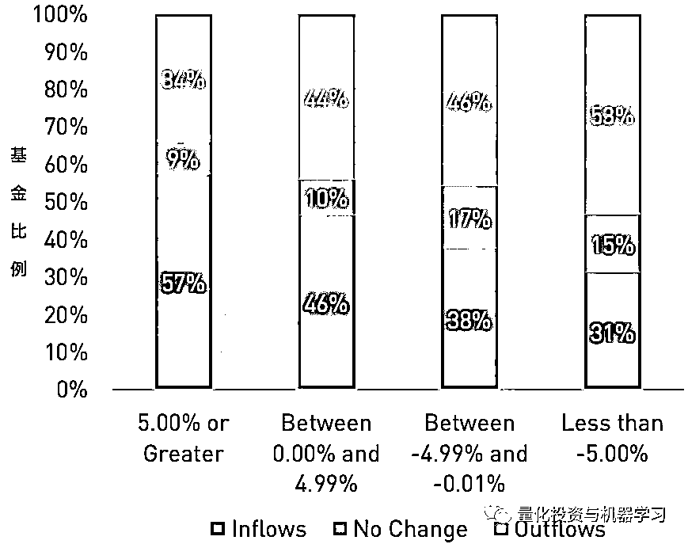
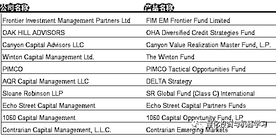
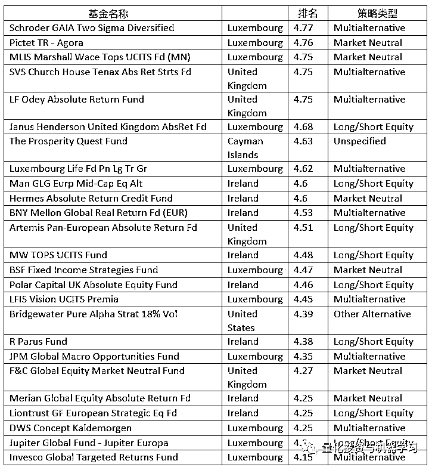

# 二千零一十九、上半年：全球量化对冲基金的风云变幻

> 原文：[`mp.weixin.qq.com/s?__biz=MzAxNTc0Mjg0Mg==&mid=2653294241&idx=1&sn=ce060b966a86fcab5ecacbd19b16e308&chksm=802dccb4b75a45a2fead8f62b984323f2bdfd71010357d70722a0bdd4e9d2d02986a730a155c&scene=27#wechat_redirect`](http://mp.weixin.qq.com/s?__biz=MzAxNTc0Mjg0Mg==&mid=2653294241&idx=1&sn=ce060b966a86fcab5ecacbd19b16e308&chksm=802dccb4b75a45a2fead8f62b984323f2bdfd71010357d70722a0bdd4e9d2d02986a730a155c&scene=27#wechat_redirect)

**标星★公众号     **爱你们♥

**近期原创文章：**

## ♥ [5 种机器学习算法在预测股价的应用（代码+数据）](https://mp.weixin.qq.com/s?__biz=MzAxNTc0Mjg0Mg==&mid=2653290588&idx=1&sn=1d0409ad212ea8627e5d5cedf61953ac&chksm=802dc249b75a4b5fa245433320a4cc9da1a2cceb22df6fb1a28e5b94ff038319ae4e7ec6941f&token=1298662931&lang=zh_CN&scene=21#wechat_redirect)

## ♥ [Two Sigma 用新闻来预测股价走势，带你吊打 Kaggle](https://mp.weixin.qq.com/s?__biz=MzAxNTc0Mjg0Mg==&mid=2653290456&idx=1&sn=b8d2d8febc599742e43ea48e3c249323&chksm=802e3dcdb759b4db9279c689202101b6b154fb118a1c1be12b52e522e1a1d7944858dbd6637e&token=1330520237&lang=zh_CN&scene=21#wechat_redirect)

## ♥ 2 万字干货：[利用深度学习最新前沿预测股价走势](https://mp.weixin.qq.com/s?__biz=MzAxNTc0Mjg0Mg==&mid=2653290080&idx=1&sn=06c50cefe78a7b24c64c4fdb9739c7f3&chksm=802e3c75b759b563c01495d16a638a56ac7305fc324ee4917fd76c648f670b7f7276826bdaa8&token=770078636&lang=zh_CN&scene=21#wechat_redirect)

## ♥ [机器学习在量化金融领域的误用！](http://mp.weixin.qq.com/s?__biz=MzAxNTc0Mjg0Mg==&mid=2653292984&idx=1&sn=3e7efe9fe9452c4a5492d2175b4159ef&chksm=802dcbadb75a42bbdce895c49070c3f552dc8c983afce5eeac5d7c25974b7753e670a0162c89&scene=21#wechat_redirect)

## ♥ [基于 RNN 和 LSTM 的股市预测方法](https://mp.weixin.qq.com/s?__biz=MzAxNTc0Mjg0Mg==&mid=2653290481&idx=1&sn=f7360ea8554cc4f86fcc71315176b093&chksm=802e3de4b759b4f2235a0aeabb6e76b3e101ff09b9a2aa6fa67e6e824fc4274f68f4ae51af95&token=1865137106&lang=zh_CN&scene=21#wechat_redirect)

## ♥ [如何鉴别那些用深度学习预测股价的花哨模型？](https://mp.weixin.qq.com/s?__biz=MzAxNTc0Mjg0Mg==&mid=2653290132&idx=1&sn=cbf1e2a4526e6e9305a6110c17063f46&chksm=802e3c81b759b597d3dd94b8008e150c90087567904a29c0c4b58d7be220a9ece2008956d5db&token=1266110554&lang=zh_CN&scene=21#wechat_redirect)

## ♥ [优化强化学习 Q-learning 算法进行股市](https://mp.weixin.qq.com/s?__biz=MzAxNTc0Mjg0Mg==&mid=2653290286&idx=1&sn=882d39a18018733b93c8c8eac385b515&chksm=802e3d3bb759b42d1fc849f96bf02ae87edf2eab01b0beecd9340112c7fb06b95cb2246d2429&token=1330520237&lang=zh_CN&scene=21#wechat_redirect)

## ♥ [WorldQuant 101 Alpha、国泰君安 191 Alpha](https://mp.weixin.qq.com/s?__biz=MzAxNTc0Mjg0Mg==&mid=2653290927&idx=1&sn=ecca60811da74967f33a00329a1fe66a&chksm=802dc3bab75a4aac2bb4ccff7010063cc08ef51d0bf3d2f71621cdd6adece11f28133a242a15&token=48775331&lang=zh_CN&scene=21#wechat_redirect)

## ♥ [基于回声状态网络预测股票价格（附代码）](https://mp.weixin.qq.com/s?__biz=MzAxNTc0Mjg0Mg==&mid=2653291171&idx=1&sn=485a35e564b45046ff5a07c42bba1743&chksm=802dc0b6b75a49a07e5b91c512c8575104f777b39d0e1d71cf11881502209dc399fd6f641fb1&token=48775331&lang=zh_CN&scene=21#wechat_redirect)

## ♥ [计量经济学应用投资失败的 7 个原因](https://mp.weixin.qq.com/s?__biz=MzAxNTc0Mjg0Mg==&mid=2653292186&idx=1&sn=87501434ae16f29afffec19a6884ee8d&chksm=802dc48fb75a4d99e0172bf484cdbf6aee86e36a95037847fd9f070cbe7144b4617c2d1b0644&token=48775331&lang=zh_CN&scene=21#wechat_redirect)

## ♥ [配对交易千千万，强化学习最 NB！（文档+代码）](http://mp.weixin.qq.com/s?__biz=MzAxNTc0Mjg0Mg==&mid=2653292915&idx=1&sn=13f4ddebcd209b082697a75544852608&chksm=802dcb66b75a4270ceb19fac90eb2a70dc05f5b6daa295a7d31401aaa8697bbb53f5ff7c05af&scene=21#wechat_redirect)

## ♥ [关于高盛在 Github 开源背后的真相！](https://mp.weixin.qq.com/s?__biz=MzAxNTc0Mjg0Mg==&mid=2653291594&idx=1&sn=7703403c5c537061994396e7e49e7ce5&chksm=802dc65fb75a4f49019cec951ac25d30ec7783738e9640ec108be95335597361c427258f5d5f&token=48775331&lang=zh_CN&scene=21#wechat_redirect)

## ♥ [新一代量化带货王诞生！Oh My God！](https://mp.weixin.qq.com/s?__biz=MzAxNTc0Mjg0Mg==&mid=2653291789&idx=1&sn=e31778d1b9372bc7aa6e57b82a69ec6e&chksm=802dc718b75a4e0ea4c022e70ea53f51c48d102ebf7e54993261619c36f24f3f9a5b63437e9e&token=48775331&lang=zh_CN&scene=21#wechat_redirect)

## ♥ [独家！关于定量/交易求职分享（附真实试题）](https://mp.weixin.qq.com/s?__biz=MzAxNTc0Mjg0Mg==&mid=2653291844&idx=1&sn=3fd8b57d32a0ebd43b17fa68ae954471&chksm=802dc751b75a4e4755fcbb0aa228355cebbbb6d34b292aa25b4f3fbd51013fcf7b17b91ddb71&token=48775331&lang=zh_CN&scene=21#wechat_redirect)

## ♥ [Quant 们的身份危机！](https://mp.weixin.qq.com/s?__biz=MzAxNTc0Mjg0Mg==&mid=2653291856&idx=1&sn=729b657ede2cb50c96e92193ab16102d&chksm=802dc745b75a4e53c5018cc1385214233ec4657a3479cd7193c95aaf65642f5f45fa0e465694&token=48775331&lang=zh_CN&scene=21#wechat_redirect)

## ♥ [拿起 Python，防御特朗普的 Twitter](https://mp.weixin.qq.com/s?__biz=MzAxNTc0Mjg0Mg==&mid=2653291977&idx=1&sn=01f146e9a88bf130ca1b479573e6d158&chksm=802dc7dcb75a4ecadfdbdace877ed948f56b72bc160952fd1e4bcde27260f823c999a65a0d6d&token=48775331&lang=zh_CN&scene=21#wechat_redirect)

## ♥ [AQR 最新研究 | 机器能“学习”金融吗？](http://mp.weixin.qq.com/s?__biz=MzAxNTc0Mjg0Mg==&mid=2653292710&idx=1&sn=e5e852de00159a96d5dcc92f349f5b58&chksm=802dcab3b75a43a5492bc98874684081eb5c5666aff32a36a0cdc144d74de0200cc0d997894f&scene=21#wechat_redirect)

**作者：公众号海外部**

**正文**

2019 年上半年，全球对冲基金持续出现资金净流出，连续第五个季度出现资本流出，亏损 253 亿美元。2019 年上半年的资本流出总额达到 474 亿美元，这将是自 2016 年上半年以来规模最大的半年度资本流出。即使出现这种负面的资本流动，但**自 2018 年底以来，对冲基金的资产管理规模（AUM）仍然增长了 4.4%** ，这主要归功于 2019 年第二季度的业绩增长。截至 2019 年 6 月，AUM 已达 3.6 万亿美元。

**2015-2019 年上半年对冲基金资产流动按主流策略划分**

数据来源：Preqin

北美地区在 2019 年上半年经历了大反转。在 2018 年所有季度的资本流动均为正值之后，2019 年第一季度和第二季度的撤资规模分别达到 308 亿美元和 150 亿美元。欧洲（- 72 亿美元）和亚太地区（- 79 亿美元）的对冲基金在第二季度也出现了撤资。在其它地区，投资者的持续兴趣导致第二季度资本流入（+ 49 亿美元） ，帮助 AUM 增至 482 亿美元。

**2015-2019 年上半年对冲基金资产流动按地区划分**

数据来源：Preqin

与以往一样，过往的业绩对于基金公司吸引未来投资至关重要。如下图所示：

**2019 年上半年对冲基金资产流动与 2018 年下半年对比**

数据来源：Preqin

**2015-2019 年上半年对冲基金资产流动（$bn）**

数据来源：Preqin

**2019 年上半年对冲基金资产流动**按主流策略****

数据来源：Preqin

**2019 年上半年对冲基金资产流动**按规模****

数据来源：Preqin

**2019 年上半年对冲基金资产流动**按地区****

数据来源：Preqin

**2019 上半年全球最佳对冲基金**

# 根据彭博报道，总部设在新加坡的**Vanda**是今年全球表现最佳的对冲基金，截至 7 月上涨了 278%。这个以新加坡国花命名的基金自成立以来平均年化回报率为 40%。

Vanda 目前所管理资产规模达 1.94 亿美元，在 Swiss-Asia Asset Management Ltd.的平台上交易。它投资于交易所交易期货，拥有超过 100 种跨资产类别，从大宗商品到政府债券再到股票指数等。

****2019 上半年 eVestment 头部对冲基金最新排名****

截止 7 月底，根据 eVestment 的数据，**Frontier Investment Management** 旗下的 EM Frontier Fund 成为最受关注的对冲基金。Oak Hill Advisors 的多元化 Credit 策略基金和 Canyon Capital 的 Value achieve Master Fund 位居前三。

数据来源：eVestment

公司层面，**AQR 位居榜首**，它的 DELTA 策略是 AQR 今年 7 月的主打产品。**桥水和太平洋投资管理公司（PIMCO）**分列第二和第三。

数据来源：eVestment

策略层面，**基本面多/空策略**胜出，其次是**多策略/全市场策略**。

数据来源：eVestment

**2019 上半年头部对冲基金 Alpha 贡献最新排名**

截止 7 月，Schroder GAIA 旗下的 Two Sigma Diversified Fund 从 Pictet 手中夺回了榜首位置，这两只基金从 6 月起互换了位置。Marshall Wace 旗下位于 Montlake UCITS 平台的 Tops 基金上升两位至第三位；Odey 的绝对收益基金从 6 月份的第三位跌至 7 月份的第五位；Church House Investment Management 旗下的 Tenax 绝对收益基金从 7 月份的第五位升至第四位。上月新推出的 Prosperity Quest 基金保持了第七名的位置，Janus Henderson 的绝对收益基金保持在第六位。

数据来源：ALPHA

**2019 上半年北欧对冲基金**

截至 6 月底，北欧对冲指数有 170 个成员：**瑞典有 100 家对冲基金，丹麦有 40 家，芬兰有 12 家，挪威有 18 家。**

Estlander & Partners Alpha Trend II 是系统趋势跟踪基金 Estlander & Partners Alpha Trend 的高杠杆版本，是 2019 年上半年北欧对冲指数中表现最好的成员，上涨了 15.7% 。今年 6 月，芬兰基金连续第二个月成为 NHX CTA 表现最佳的成员。RPM 衍生 CTA 基金是表现最好的瑞典基金。Nykredit EVIRA 对冲基金上半年上涨 9.1% ，在丹麦对冲基金中排名第一。泰加基金是北欧对冲指数中表现最好的挪威对冲基金，前一季度上涨了 5.5% 。

**2019 英国最有钱的对冲基金经理**

最近在《The Sunday Times》上公布了 2019 年全球富豪榜：

排在第一位的是 BlueCrest Capital Management 的联合创始人 Michael Platt，他的身家估计为 37 亿英镑，高于一年前的 30 亿英镑。

Search Investment Group 的 Robert Miller 和 Princess Marie-Chantal 以 22 亿英镑排名第二。

与此同时，CQS 的 Sir Michael hinze 巩固了自己在全美第三大对冲基金经理的地位。 现在个人财富达到 15 亿英镑。

**基本面多/空策略、多策略/全市场**

也是国内量化对冲基金应该大力发展的方向！

*—End—*

量化投资与机器学习微信公众号，是业内垂直于**Quant**、**MFE**、**CST、AI**等专业的**主****流量化自媒体**。公众号拥有来自**公募、私募、券商、银行、海外**等众多圈内**18W+**关注者。每日发布行业前沿研究成果和最新量化资讯。

你点的每个“在看”，我们都认真当成了喜欢