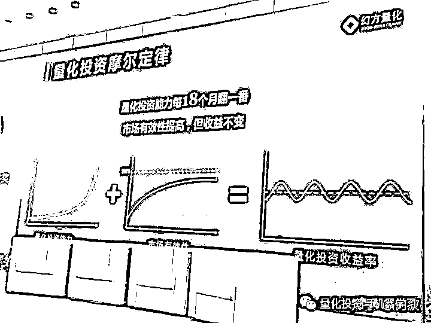
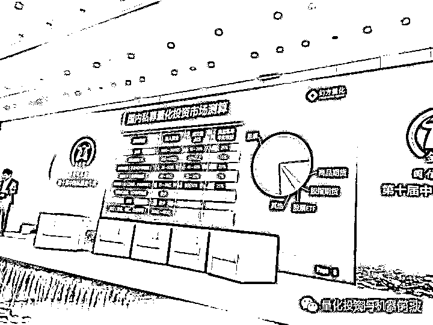
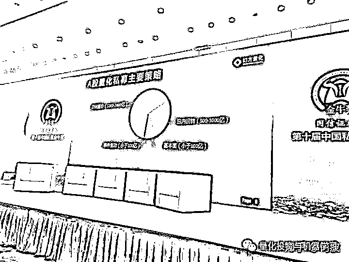
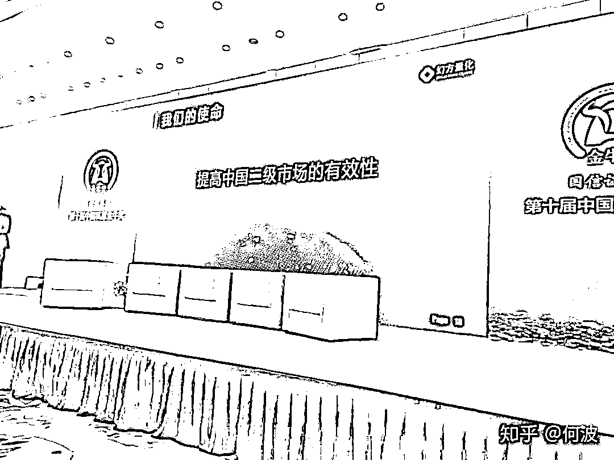

# 如何看待幻方在金牛奖上的发言？

> 原文：[`mp.weixin.qq.com/s?__biz=MzAxNTc0Mjg0Mg==&mid=2653294221&idx=1&sn=bc23af6643a111f4a6aa42adf32b26c6&chksm=802dcc98b75a458e3d7eefd2cc79172369d1e2fb1056542aaf8bd477e27ff0a1ce46fd6a1026&scene=27#wechat_redirect`](http://mp.weixin.qq.com/s?__biz=MzAxNTc0Mjg0Mg==&mid=2653294221&idx=1&sn=bc23af6643a111f4a6aa42adf32b26c6&chksm=802dcc98b75a458e3d7eefd2cc79172369d1e2fb1056542aaf8bd477e27ff0a1ce46fd6a1026&scene=27#wechat_redirect)

**标星★公众号     **爱你们♥

来自：https://www.zhihu.com/question/343708467

# **本文仅作行业交流，如有侵权，会删文处理**

**近期原创文章：**

## ♥ [5 种机器学习算法在预测股价的应用（代码+数据）](https://mp.weixin.qq.com/s?__biz=MzAxNTc0Mjg0Mg==&mid=2653290588&idx=1&sn=1d0409ad212ea8627e5d5cedf61953ac&chksm=802dc249b75a4b5fa245433320a4cc9da1a2cceb22df6fb1a28e5b94ff038319ae4e7ec6941f&token=1298662931&lang=zh_CN&scene=21#wechat_redirect)

## ♥ [Two Sigma 用新闻来预测股价走势，带你吊打 Kaggle](https://mp.weixin.qq.com/s?__biz=MzAxNTc0Mjg0Mg==&mid=2653290456&idx=1&sn=b8d2d8febc599742e43ea48e3c249323&chksm=802e3dcdb759b4db9279c689202101b6b154fb118a1c1be12b52e522e1a1d7944858dbd6637e&token=1330520237&lang=zh_CN&scene=21#wechat_redirect)

## ♥ 2 万字干货：[利用深度学习最新前沿预测股价走势](https://mp.weixin.qq.com/s?__biz=MzAxNTc0Mjg0Mg==&mid=2653290080&idx=1&sn=06c50cefe78a7b24c64c4fdb9739c7f3&chksm=802e3c75b759b563c01495d16a638a56ac7305fc324ee4917fd76c648f670b7f7276826bdaa8&token=770078636&lang=zh_CN&scene=21#wechat_redirect)

## ♥ [机器学习在量化金融领域的误用！](http://mp.weixin.qq.com/s?__biz=MzAxNTc0Mjg0Mg==&mid=2653292984&idx=1&sn=3e7efe9fe9452c4a5492d2175b4159ef&chksm=802dcbadb75a42bbdce895c49070c3f552dc8c983afce5eeac5d7c25974b7753e670a0162c89&scene=21#wechat_redirect)

## ♥ [基于 RNN 和 LSTM 的股市预测方法](https://mp.weixin.qq.com/s?__biz=MzAxNTc0Mjg0Mg==&mid=2653290481&idx=1&sn=f7360ea8554cc4f86fcc71315176b093&chksm=802e3de4b759b4f2235a0aeabb6e76b3e101ff09b9a2aa6fa67e6e824fc4274f68f4ae51af95&token=1865137106&lang=zh_CN&scene=21#wechat_redirect)

## ♥ [如何鉴别那些用深度学习预测股价的花哨模型？](https://mp.weixin.qq.com/s?__biz=MzAxNTc0Mjg0Mg==&mid=2653290132&idx=1&sn=cbf1e2a4526e6e9305a6110c17063f46&chksm=802e3c81b759b597d3dd94b8008e150c90087567904a29c0c4b58d7be220a9ece2008956d5db&token=1266110554&lang=zh_CN&scene=21#wechat_redirect)

## ♥ [优化强化学习 Q-learning 算法进行股市](https://mp.weixin.qq.com/s?__biz=MzAxNTc0Mjg0Mg==&mid=2653290286&idx=1&sn=882d39a18018733b93c8c8eac385b515&chksm=802e3d3bb759b42d1fc849f96bf02ae87edf2eab01b0beecd9340112c7fb06b95cb2246d2429&token=1330520237&lang=zh_CN&scene=21#wechat_redirect)

## ♥ [WorldQuant 101 Alpha、国泰君安 191 Alpha](https://mp.weixin.qq.com/s?__biz=MzAxNTc0Mjg0Mg==&mid=2653290927&idx=1&sn=ecca60811da74967f33a00329a1fe66a&chksm=802dc3bab75a4aac2bb4ccff7010063cc08ef51d0bf3d2f71621cdd6adece11f28133a242a15&token=48775331&lang=zh_CN&scene=21#wechat_redirect)

## ♥ [基于回声状态网络预测股票价格（附代码）](https://mp.weixin.qq.com/s?__biz=MzAxNTc0Mjg0Mg==&mid=2653291171&idx=1&sn=485a35e564b45046ff5a07c42bba1743&chksm=802dc0b6b75a49a07e5b91c512c8575104f777b39d0e1d71cf11881502209dc399fd6f641fb1&token=48775331&lang=zh_CN&scene=21#wechat_redirect)

## ♥ [计量经济学应用投资失败的 7 个原因](https://mp.weixin.qq.com/s?__biz=MzAxNTc0Mjg0Mg==&mid=2653292186&idx=1&sn=87501434ae16f29afffec19a6884ee8d&chksm=802dc48fb75a4d99e0172bf484cdbf6aee86e36a95037847fd9f070cbe7144b4617c2d1b0644&token=48775331&lang=zh_CN&scene=21#wechat_redirect)

## ♥ [配对交易千千万，强化学习最 NB！（文档+代码）](http://mp.weixin.qq.com/s?__biz=MzAxNTc0Mjg0Mg==&mid=2653292915&idx=1&sn=13f4ddebcd209b082697a75544852608&chksm=802dcb66b75a4270ceb19fac90eb2a70dc05f5b6daa295a7d31401aaa8697bbb53f5ff7c05af&scene=21#wechat_redirect)

## ♥ [关于高盛在 Github 开源背后的真相！](https://mp.weixin.qq.com/s?__biz=MzAxNTc0Mjg0Mg==&mid=2653291594&idx=1&sn=7703403c5c537061994396e7e49e7ce5&chksm=802dc65fb75a4f49019cec951ac25d30ec7783738e9640ec108be95335597361c427258f5d5f&token=48775331&lang=zh_CN&scene=21#wechat_redirect)

## ♥ [新一代量化带货王诞生！Oh My God！](https://mp.weixin.qq.com/s?__biz=MzAxNTc0Mjg0Mg==&mid=2653291789&idx=1&sn=e31778d1b9372bc7aa6e57b82a69ec6e&chksm=802dc718b75a4e0ea4c022e70ea53f51c48d102ebf7e54993261619c36f24f3f9a5b63437e9e&token=48775331&lang=zh_CN&scene=21#wechat_redirect)

## ♥ [独家！关于定量/交易求职分享（附真实试题）](https://mp.weixin.qq.com/s?__biz=MzAxNTc0Mjg0Mg==&mid=2653291844&idx=1&sn=3fd8b57d32a0ebd43b17fa68ae954471&chksm=802dc751b75a4e4755fcbb0aa228355cebbbb6d34b292aa25b4f3fbd51013fcf7b17b91ddb71&token=48775331&lang=zh_CN&scene=21#wechat_redirect)

## ♥ [Quant 们的身份危机！](https://mp.weixin.qq.com/s?__biz=MzAxNTc0Mjg0Mg==&mid=2653291856&idx=1&sn=729b657ede2cb50c96e92193ab16102d&chksm=802dc745b75a4e53c5018cc1385214233ec4657a3479cd7193c95aaf65642f5f45fa0e465694&token=48775331&lang=zh_CN&scene=21#wechat_redirect)

## ♥ [拿起 Python，防御特朗普的 Twitter](https://mp.weixin.qq.com/s?__biz=MzAxNTc0Mjg0Mg==&mid=2653291977&idx=1&sn=01f146e9a88bf130ca1b479573e6d158&chksm=802dc7dcb75a4ecadfdbdace877ed948f56b72bc160952fd1e4bcde27260f823c999a65a0d6d&token=48775331&lang=zh_CN&scene=21#wechat_redirect)

## ♥ [AQR 最新研究 | 机器能“学习”金融吗？](http://mp.weixin.qq.com/s?__biz=MzAxNTc0Mjg0Mg==&mid=2653292710&idx=1&sn=e5e852de00159a96d5dcc92f349f5b58&chksm=802dcab3b75a43a5492bc98874684081eb5c5666aff32a36a0cdc144d74de0200cc0d997894f&scene=21#wechat_redirect)

**前言**

# 上周，量化圈被一篇名为**《一名程序员眼里中国量化投资的未来》**的微信推文刷屏。截止今日发文已有 7.3 万的阅读量。如果满打满算国内有 20 万人搞量化的话，那么，已有 1/3 的人看过这篇文章了。

原文：

[**一名程序员眼里中国量化投资的未来**](https://mp.weixin.qq.com/s?__biz=MzI2OTgwODc1MQ==&mid=2247483708&idx=1&sn=ba7bdcdf4be5ecb21141b9f315ded710&scene=21#wechat_redirect) 

在知乎上，已经有很多业界人士对此发表了不同的观点与看法。公众号选择了几个评论点赞较高的回答，做一分享，供大家交流。

**评论 1**

▍作者：**匿名用户**

▍*https://www.zhihu.com/question/343708467/answer/809492670*

比较客观的发言，对中国的量化市场是非常有洞见的，很多观点跟我是非常一致的。

**一、关于自营还是资管**

自营、私募、大资管，本身是三种不同的商业模式。不能光看业绩来论谁好谁差，也不能光看规模。好比你拿爱马仕和优衣库比质量，没意义，比销量，也没意义。对从业人员来说，最重要的是落到自己口袋里的钱。

有幸跟英仕曼的 ceo 聊过，他们每年的收入里面管理费和业绩提成是一半一半，他们以前也考虑过做自营，但是现在还是选择了纯资管。理由其实也很简单，自营赚的钱一方面不稳定，另一方面天花板是看得见，而做资管，收入相对稳定，天花板也非常高。

**二、关于策略融合**

这一块其实梁总的思路跟 wq 或者 2c 都是类似的，那就是一起做 mom/fof，不如直接穿透到底层，自己可以直接享受 netting 带来的额外收益提升和成本降低。这很大程度上也是国内很多私募不愿意走 mom 模式的原因。

但是做内部 netting 也不是万灵药，其带来最大的缺陷并不是技术上的，而是管理上的。因为这种做法，很难把每个人的贡献都清清楚楚的算出来，导致了人才流失的问题。

**三、关于量化的马太效应和摩尔定律**

上面提到了人才流失，而对各位大老板最有利的消息就是，这个行业马太效应正在加强，数据、服务器的成本上涨非常快，小机构由于信息劣势想找到 alpha 会越来越难。所以，如果看国外的对冲基金排行榜，会发现头部的量化机构，来来回回就那么几家，很多年没有新的了。

量化的摩尔定律很多人理解不了，觉得说怎么可能每 18 个月翻一番？其实，可以这么想，量化的本质是信息+算力，既然算力可以 18 个月翻一番，那自然量化投资的能力也是类似的。更何况，信息爆炸时代，叠上信息的增长速度，量化的摩尔定律甚至会快于 18 个月。

**四、关于公募基金的定位**

梁总有个很好的观察：美国的资产管理有两个趋势：一个是共同基金的逐渐指数化，另外一个趋势是对冲基金的逐渐走向量化。然后又引用了 blackrock 的例子，其实国内的公募基金，现在也都意识到这个问题了，开始做越来越多的工具化、指数化的产品，主动管理型的公募已经很多很多年没怎么增长了。

在这个野蛮生长的过程中，也不乏一些有趣的现象，比如某公募基金的量化部总监是市场/销售出身，并不会写代码。比如某公募基金的互联网和军工基金里面买了不少医药股。

**五、关于竞业与劝退**

梁总没提这块，但其实是非常重要的一块。他关乎了每个员工的待遇，也关系到了中国的量化行业能不能健康发展。严苛的竞业限制一定会扼杀行业流动，并且变相逼迫从业人员走一些灰色的方式来谋求生路。没有竞业协议又损害了老板的利益，毕竟自己的秘籍不想被人学去了反过来砸自己的饭碗。

这里面没有均衡，只有屁股。无论哪个行业，员工都会希望自己现在的工作能学到知识，为自己未来跳槽增加筹码。公司因为员工学到了知识就限制跳槽，从法律上讲，毫无问题，从道义上讲，大大地坏。

这么说吧，中国有很多 wq 出来的私募创始人，有几个不是背着竞业偷偷干的？国外也一样，2c 的老板也是 deshaw 出来，其实老板们都很聪明，员工那些小心思看得一清二楚，想学到东西就跳槽或者自立门户？不可能的，都是这条路走过来的，防员工必然跟防贼一样，比如 2c 会把偷学到东西的员工关进大牢一样。所以，入这行一定要慎重。这就回到我说的，竞业是扼杀量化行业长期健康发展的。

**评论 2**

▍作者：**何波** 

▍*https://www.zhihu.com/question/343708467/answer/809332299*

有幸在现场听了幻方董事长梁文锋的演讲，关于量化摩尔定律，接在“每 18 个月投资能力翻一倍”后面的是“市场有效性提高，但是收益不变”。表达的意思是大家都在投研技术上投入越来越多，竞争越来越激烈，我觉得这应该也是大家的共识吧。

这也是梁文锋第一次公开场合的路演。作为中证金牛颁奖典礼上的发言，他的报告里没有关于策略的东西，也没有幻方相关的内容，更多是梁总关于量化投资在国内发展的思考，也是在重要媒体上做的一次量化投资的普及，虽然组织形式上落入俗套，也是从美国发展推及中国，但是里面很多数据非常用心的，比如下面这些数据，应该没有官方的渠道，还是需要花一些心思去估算。

报告的最后一页，**“我们的使命：提高中国二级市场的有效性”**，选择在中证金牛发布会上给量化投资做一个这样的定位，是有非常大的积极意义。个中甘苦，大多从 15 年到现在的量化交易或者程序化交易从业人员自会理解吧。

**评论 3**

▍作者：**搬山** 

▍*https://www.zhihu.com/question/343708467/answer/809420095*

客观的说，我认为他讲的很中肯，具体摩尔定律、18 个月啥的只是个类比，别太当真。但量化策略在不断衰减是客观事实，需要它的升级速度赶上衰减速度，这一点经历过的人自然深有体会。

**幻方在基本面研究上应该确实有大力投入，看到他们两年前就在招基本面研究员了，最近貌似加大了招聘力度**。我个人也觉得随着 a 股财务数据更加透明合理，而且市场逐渐有效，alpha 越来越稀有，现在基差这么大，要管大资金，叠加基本面做指数增强类产品几乎是必然的。

知乎上有一批人看不惯自封的四大天王这个名声，爱吹高收益的自营团队、贬资管，我觉得也能理解，毕竟一个小团队几年时间在一个小领域搞出来的东西，你说他优秀可以，但说到天王的称号就惹人生厌了。抛开这个层面不说，幻方这个演讲确实指出了国内股票 alpha 研究的变化趋势，管理几百万、几千万、几个亿、几十个亿的难度和策略方向大不相同。股票不能加杠杆，投入大收益低，策略没到一定强度做不出几个点的绝对收益，资管小团队做它性价比很低，马太效应会非常强。未来股票方面可能只存在两种公司，一种是做小规模自营，千万级别；另一种是几十亿级别或以上的资管或自营。**只要各家高频 alpha 再横盘半年，市场的声音就会完全变了，到时候大家都会往复合策略、基本面、指数增强方向走。**

*—End—*

量化投资与机器学习微信公众号，是业内垂直于**Quant**、**MFE**、**CST、AI**等专业的**主****流量化自媒体**。公众号拥有来自**公募、私募、券商、银行、海外**等众多圈内**18W+**关注者。每日发布行业前沿研究成果和最新量化资讯。

你点的每个“在看”，我们都认真当成了喜欢