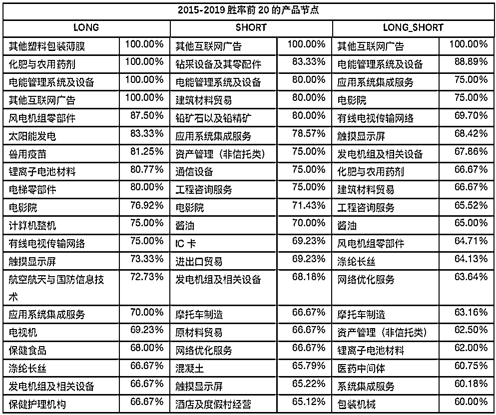

# 另类 Alpha：基于产业节点联动效应的量化交易策略

> 原文：[`mp.weixin.qq.com/s?__biz=MzAxNTc0Mjg0Mg==&mid=2653294191&idx=1&sn=8d5e3c40a498c5fbcb7f6c7a561b3348&chksm=802dcc7ab75a456c9550270a49b3506a425f0fa558bece8e3a79c22e0e5822f0e21b6546a534&scene=27#wechat_redirect`](http://mp.weixin.qq.com/s?__biz=MzAxNTc0Mjg0Mg==&mid=2653294191&idx=1&sn=8d5e3c40a498c5fbcb7f6c7a561b3348&chksm=802dcc7ab75a456c9550270a49b3506a425f0fa558bece8e3a79c22e0e5822f0e21b6546a534&scene=27#wechat_redirect)

**标星★公众号     **爱你们♥

作者：数库科技

**近期原创文章：**

## ♥ [5 种机器学习算法在预测股价的应用（代码+数据）](https://mp.weixin.qq.com/s?__biz=MzAxNTc0Mjg0Mg==&mid=2653290588&idx=1&sn=1d0409ad212ea8627e5d5cedf61953ac&chksm=802dc249b75a4b5fa245433320a4cc9da1a2cceb22df6fb1a28e5b94ff038319ae4e7ec6941f&token=1298662931&lang=zh_CN&scene=21#wechat_redirect)

## ♥ [Two Sigma 用新闻来预测股价走势，带你吊打 Kaggle](https://mp.weixin.qq.com/s?__biz=MzAxNTc0Mjg0Mg==&mid=2653290456&idx=1&sn=b8d2d8febc599742e43ea48e3c249323&chksm=802e3dcdb759b4db9279c689202101b6b154fb118a1c1be12b52e522e1a1d7944858dbd6637e&token=1330520237&lang=zh_CN&scene=21#wechat_redirect)

## ♥ 2 万字干货：[利用深度学习最新前沿预测股价走势](https://mp.weixin.qq.com/s?__biz=MzAxNTc0Mjg0Mg==&mid=2653290080&idx=1&sn=06c50cefe78a7b24c64c4fdb9739c7f3&chksm=802e3c75b759b563c01495d16a638a56ac7305fc324ee4917fd76c648f670b7f7276826bdaa8&token=770078636&lang=zh_CN&scene=21#wechat_redirect)

## ♥ [机器学习在量化金融领域的误用！](http://mp.weixin.qq.com/s?__biz=MzAxNTc0Mjg0Mg==&mid=2653292984&idx=1&sn=3e7efe9fe9452c4a5492d2175b4159ef&chksm=802dcbadb75a42bbdce895c49070c3f552dc8c983afce5eeac5d7c25974b7753e670a0162c89&scene=21#wechat_redirect)

## ♥ [基于 RNN 和 LSTM 的股市预测方法](https://mp.weixin.qq.com/s?__biz=MzAxNTc0Mjg0Mg==&mid=2653290481&idx=1&sn=f7360ea8554cc4f86fcc71315176b093&chksm=802e3de4b759b4f2235a0aeabb6e76b3e101ff09b9a2aa6fa67e6e824fc4274f68f4ae51af95&token=1865137106&lang=zh_CN&scene=21#wechat_redirect)

## ♥ [如何鉴别那些用深度学习预测股价的花哨模型？](https://mp.weixin.qq.com/s?__biz=MzAxNTc0Mjg0Mg==&mid=2653290132&idx=1&sn=cbf1e2a4526e6e9305a6110c17063f46&chksm=802e3c81b759b597d3dd94b8008e150c90087567904a29c0c4b58d7be220a9ece2008956d5db&token=1266110554&lang=zh_CN&scene=21#wechat_redirect)

## ♥ [优化强化学习 Q-learning 算法进行股市](https://mp.weixin.qq.com/s?__biz=MzAxNTc0Mjg0Mg==&mid=2653290286&idx=1&sn=882d39a18018733b93c8c8eac385b515&chksm=802e3d3bb759b42d1fc849f96bf02ae87edf2eab01b0beecd9340112c7fb06b95cb2246d2429&token=1330520237&lang=zh_CN&scene=21#wechat_redirect)

## ♥ [WorldQuant 101 Alpha、国泰君安 191 Alpha](https://mp.weixin.qq.com/s?__biz=MzAxNTc0Mjg0Mg==&mid=2653290927&idx=1&sn=ecca60811da74967f33a00329a1fe66a&chksm=802dc3bab75a4aac2bb4ccff7010063cc08ef51d0bf3d2f71621cdd6adece11f28133a242a15&token=48775331&lang=zh_CN&scene=21#wechat_redirect)

## ♥ [基于回声状态网络预测股票价格（附代码）](https://mp.weixin.qq.com/s?__biz=MzAxNTc0Mjg0Mg==&mid=2653291171&idx=1&sn=485a35e564b45046ff5a07c42bba1743&chksm=802dc0b6b75a49a07e5b91c512c8575104f777b39d0e1d71cf11881502209dc399fd6f641fb1&token=48775331&lang=zh_CN&scene=21#wechat_redirect)

## ♥ [计量经济学应用投资失败的 7 个原因](https://mp.weixin.qq.com/s?__biz=MzAxNTc0Mjg0Mg==&mid=2653292186&idx=1&sn=87501434ae16f29afffec19a6884ee8d&chksm=802dc48fb75a4d99e0172bf484cdbf6aee86e36a95037847fd9f070cbe7144b4617c2d1b0644&token=48775331&lang=zh_CN&scene=21#wechat_redirect)

## ♥ [配对交易千千万，强化学习最 NB！（文档+代码）](http://mp.weixin.qq.com/s?__biz=MzAxNTc0Mjg0Mg==&mid=2653292915&idx=1&sn=13f4ddebcd209b082697a75544852608&chksm=802dcb66b75a4270ceb19fac90eb2a70dc05f5b6daa295a7d31401aaa8697bbb53f5ff7c05af&scene=21#wechat_redirect)

## ♥ [关于高盛在 Github 开源背后的真相！](https://mp.weixin.qq.com/s?__biz=MzAxNTc0Mjg0Mg==&mid=2653291594&idx=1&sn=7703403c5c537061994396e7e49e7ce5&chksm=802dc65fb75a4f49019cec951ac25d30ec7783738e9640ec108be95335597361c427258f5d5f&token=48775331&lang=zh_CN&scene=21#wechat_redirect)

## ♥ [新一代量化带货王诞生！Oh My God！](https://mp.weixin.qq.com/s?__biz=MzAxNTc0Mjg0Mg==&mid=2653291789&idx=1&sn=e31778d1b9372bc7aa6e57b82a69ec6e&chksm=802dc718b75a4e0ea4c022e70ea53f51c48d102ebf7e54993261619c36f24f3f9a5b63437e9e&token=48775331&lang=zh_CN&scene=21#wechat_redirect)

## ♥ [独家！关于定量/交易求职分享（附真实试题）](https://mp.weixin.qq.com/s?__biz=MzAxNTc0Mjg0Mg==&mid=2653291844&idx=1&sn=3fd8b57d32a0ebd43b17fa68ae954471&chksm=802dc751b75a4e4755fcbb0aa228355cebbbb6d34b292aa25b4f3fbd51013fcf7b17b91ddb71&token=48775331&lang=zh_CN&scene=21#wechat_redirect)

## ♥ [Quant 们的身份危机！](https://mp.weixin.qq.com/s?__biz=MzAxNTc0Mjg0Mg==&mid=2653291856&idx=1&sn=729b657ede2cb50c96e92193ab16102d&chksm=802dc745b75a4e53c5018cc1385214233ec4657a3479cd7193c95aaf65642f5f45fa0e465694&token=48775331&lang=zh_CN&scene=21#wechat_redirect)

## ♥ [拿起 Python，防御特朗普的 Twitter](https://mp.weixin.qq.com/s?__biz=MzAxNTc0Mjg0Mg==&mid=2653291977&idx=1&sn=01f146e9a88bf130ca1b479573e6d158&chksm=802dc7dcb75a4ecadfdbdace877ed948f56b72bc160952fd1e4bcde27260f823c999a65a0d6d&token=48775331&lang=zh_CN&scene=21#wechat_redirect)

## ♥ [AQR 最新研究 | 机器能“学习”金融吗？](http://mp.weixin.qq.com/s?__biz=MzAxNTc0Mjg0Mg==&mid=2653292710&idx=1&sn=e5e852de00159a96d5dcc92f349f5b58&chksm=802dcab3b75a43a5492bc98874684081eb5c5666aff32a36a0cdc144d74de0200cc0d997894f&scene=21#wechat_redirect)

**一、数据说明**

**1、产品节点标准化处理**

**产业链是由不同产品节点通过上下游关系连接起来的网状数据**。数库以 GICS 行业分类为标准，通过对上市公司财务报告上的主营业务分项数据的标准化处理，将财报上数以万计的非标准化产品标准化为近 4000 个产品节点，并在这些产品节点之间定义了以下关系：

• A：生产设备：上游生产制造时所需要的工业机械、电气设备等

• D：销售渠道：购买原材料或者销售成品的环节

• F：辅助设备：产品后续正常运转所需的辅助设备

• M：生产原料：上游生产制造时所需要的原材料等

• P：主体：一般是生产流程产出的成品，或待销售 的产品、服务 

• R：辅助材料：产品后续正常运转所需的辅助材料

• T：技术服务：生产时所需要的专业技术、商业服务或为相关产品提供的后续服务

如下图所示，为“半导体”上下游的关系图，其中上游有如“生产设备”相关的“半导体设备”及真空镀膜设备，下游有如“技术服务”的“半导体产品安装服务”。

图 1：半导体产品上下游关系图

上市公司在年报及半年报会披露该报告期的主营业务收入的分项数据，通过匹配这些非标准的产品与数库产业链的标准产品节点，我们可以把上市公司根据其主营业务把他们串联在一起。如图 2 所示，美的集团在 17 年的年报上披露了其主营业务收入的明细情况，我们通过标准化处理把“暖通空调”标准化为“空调器”、“机器人及自动化系统”标准化为“工业机器人”等。

图 2：美的集团 2017 年主营业务收入

当有了每家上市公司的标准化主营业务收入数据后，不同的上市公司自然就可以通过这些标准的产品节点串联在一起，如下图 3 所示为空调产业链的部分数据，空调器的下游有白色家电销售，而相关的公司有“苏宁易购”；空调器的上游有“铜矿及其精矿”，相关的公司有“华钰矿业”等。

图 3：空调产业链

**2、产品层级与唯一主营业务**

正如行业分类有级别之分，数据的产业链数据中产品节点也有层级之分，数库产品的一级科目对应的是数库行业分类的四级行业，**产品最深可以到 9 级（也就是行业的 12 级）**，每家上市公司的唯一主营业务定义为在某个产品层级上的收入占其总收入的 50%以上，我们就以该产品节点作为这家上市公司该报告期的主营业务。

如下图 4 所示，在玻璃容器这个 4 级的产品节点上，相关的上市公司有“山东华鹏”、“德力股份”等 6 家上市公司，但其中只有前两家上市公司在该产品节点的收入占比超过 50%，所以我们就以“玻璃容器”作为“山东华鹏”及“德力股份”的唯一主营业务。

图 4：产品层级及业务收入占比

**二、策略研究**

**1、策略逻辑**

根据数库的产业链数据，我们可以定义每家 A 股上市公司的唯一主营业务。当唯一主营业务相同的公司里，大部分公司的股价出现同向涨跌，而剩下的没有出现同向涨跌的公司的股价是否会在后面的交易日里出现联动效应呢？这就是本章我们探讨的基于产业链数据的股价联动的交易策略。

具体的策略逻辑做如下定义：

**首先，根据每家公司的唯一主营业务，找出唯一主营业务且公司数量大于等于 4 家上市公司的产品节点。统计在上一个交易日，这 N 家上市公司股价的涨跌情况，如果有超过 75%的公司的股价同涨（收益率均大于 0），则在第二个交易日买入剩余的未上涨的股票。如果有超过 75%的公司的股价同跌（收益率均小于 0），则在第二个交易日做空剩余的未下跌的股票。**

**2、回测研究**

回测区间 2015 年 1 月份至 2019 年 7 月份，由于考虑到主营业务必须要反应同一个财报期的情况，对于财报数据我们没有做 Point in Time 的处理。而是采用以下对其规则：1-4 月份使用上一年度的半年报数据，5-8 月份使用上一年度的年报数据，9-12 月份使用本年度的半年报数据。

**2.1 数据统计**

在数库提供产业链数据表中，有一张数据表[fin_secu_primary_product]专门提供每个报告期各上市公司唯一主营业务的数据。该表的相关字段说明如下表：

我们统计了 2015-2019 每个报告期涉及的唯一主营产品的数量，以及唯一主营产品相同且公司数量超过四家的公司的产品节点覆盖的所有 A 股上市公司的数量。从下图可以看出，**A 股上市公司所有主营产品的种类大约在 1200-1500 之间**；同样，**唯一主营产品相同且超过四家公司的产品节点总共覆盖的 A 股上市公司的数量在 1000-1600 之间**。所以该策略在监测同一产品节点股价的联动性时，大概覆盖了全市场一半的股票。

图 5：各财报期唯一主营业务产品数量

图 6：各财报期唯一主营业务产品公司数量大于 4 家的产品节点覆盖的上市公司数量

**2.2 回测结果**  

如下图所示，**在 2015.01-2019.07 月份，该策略大幅跑赢了买入持有策略**，其中空头、多头和多空策略的累积收益分别为 32%、27%及 69%，胜率分别为 49%、47%及 55%。详细的收益率的统计指标如表格 8 所示。

pai'x

图 7：2015-2019 收益曲线图

表 1：策略收益指标

我们还统计了每日交易的股票的数量，如下图所示，其中买入最多的一个交易日是买入了 158 只股票，平均每天买入的股票为 49 只；卖出最多的一个交易日也是卖出了 158 只股票，平**均每天卖出的股票为 35 只。**  

图 8：2015-2019 年每交易日交易股票数量箱型图

以上的回测中，我们监测了所有的产品节点，但并不是所有的产品节点都有明显的联动效应，下图给出了所有产品节点的收益表现的分布图，我们可以看出有相当一部分的产品节点在 2015-2019 的 4 年多时间没有产生正收益。

图 9：所有产品节点的收益分布图

既然有大部分产品的联动效应无法获取正收益，势必会降低整个策略的收益。所以我们考虑，在监测产品节点的联动效应到最终交易的过程中，我们可以对产品进行筛选。可以用滚动窗口的形式，每次选取前一段时间联动效应最明显的产品节点进行交易。

所以我们又进行了如下测试，**每一周根据前一周的表现（平均收益），****选取收益最高的前 20 个产品进行联动效应的监测并交易，当扣除双边千分之三的交易成本之后**，回测效果如下图所示，可以发现该策略的收益优于上述包含所有产品节点的策略。其中红色的线为每个滚动窗口做多上一个窗口中多头策略表现最好的产品节点，同时做空的是上一个窗口中空头策略表现最好的产品节点。而绿色线表示每个滚动窗口选取的是上一个窗口中多空策略表现最好的产品节点。我们可以发现该策略的主要收益的贡献来源于多头策略，下表给出了具体的收益指标，其中**多****头、空头和多空策略的累积收益分别为 85%、9.4%及 119.90%，年化收益分别为 15.2%，2.1%及 19.8%。**

图 10：滚动筛选前 20 最优产品节点策略收益

表 2：滚动筛选前 20 最优产品节点策略收益指标

图 11：滚动选取前 20 个产品节点，每日交易的股票数量

以下是滚动筛选前 10 个表现最好的产品节点的收益，从下至上其年化收益分别为 6.3%，25%，33%及 34%：

图 12：滚动筛选前 10 个表现最好产品节点收益图

图 13：滚动筛选前 10 最优产品节点策略收益指标

我们对所有产品节点的策略胜率及收益进行排序，选出了整个回测区间收益最高的前 20 个产品及 胜率最高的前 20 个产品节点。

**三、总结**

数库产业链数据给我们提供了对于公司主营业务更标准化的视角。本篇报告研究了**同一产品节点下股价的联动效应，无论当前处于熊市或牛市，当公司主营业务相同时，其受到的外界对于股价的影响因素也非常相似**。回测结果也显示，我们可以对各产品节点进行监测，以捕捉股价联动效应带来的超额收益。后续的研究中，我们会继续关注不同产品上下游之间的价格传导效应。

如获取报告原文或数库产业链数据请联系：*business@chinascope.com*

*—End—*

量化投资与机器学习微信公众号，是业内垂直于**Quant**、**MFE**、**CST、AI**等专业的**主****流量化自媒体**。公众号拥有来自**公募、私募、券商、银行、海外**等众多圈内**10W+**关注者。每日发布行业前沿研究成果和最新量化资讯。

你点的每个“在看”，我们都认真当成了喜欢