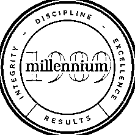
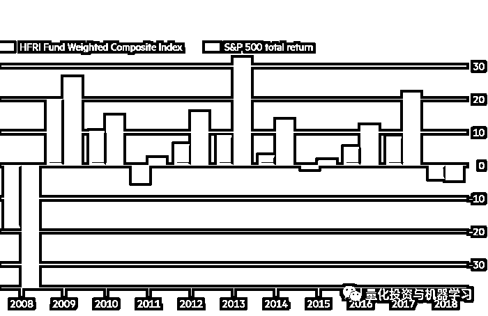

# 想去千禧年吗？

> 原文：[`mp.weixin.qq.com/s?__biz=MzAxNTc0Mjg0Mg==&mid=2653294153&idx=1&sn=2e950f896972dd24812bbf0585ba519b&chksm=802dcc5cb75a454a56146e52054156931b898580cc852f778b45d2365670f195df2a05a0d516&scene=27#wechat_redirect`](http://mp.weixin.qq.com/s?__biz=MzAxNTc0Mjg0Mg==&mid=2653294153&idx=1&sn=2e950f896972dd24812bbf0585ba519b&chksm=802dcc5cb75a454a56146e52054156931b898580cc852f778b45d2365670f195df2a05a0d516&scene=27#wechat_redirect)

**标星★公众号     **爱你们♥

作者：公众号编辑部

**近期原创文章：**

## ♥ [5 种机器学习算法在预测股价的应用（代码+数据）](https://mp.weixin.qq.com/s?__biz=MzAxNTc0Mjg0Mg==&mid=2653290588&idx=1&sn=1d0409ad212ea8627e5d5cedf61953ac&chksm=802dc249b75a4b5fa245433320a4cc9da1a2cceb22df6fb1a28e5b94ff038319ae4e7ec6941f&token=1298662931&lang=zh_CN&scene=21#wechat_redirect)

## ♥ [Two Sigma 用新闻来预测股价走势，带你吊打 Kaggle](https://mp.weixin.qq.com/s?__biz=MzAxNTc0Mjg0Mg==&mid=2653290456&idx=1&sn=b8d2d8febc599742e43ea48e3c249323&chksm=802e3dcdb759b4db9279c689202101b6b154fb118a1c1be12b52e522e1a1d7944858dbd6637e&token=1330520237&lang=zh_CN&scene=21#wechat_redirect)

## ♥ 2 万字干货：[利用深度学习最新前沿预测股价走势](https://mp.weixin.qq.com/s?__biz=MzAxNTc0Mjg0Mg==&mid=2653290080&idx=1&sn=06c50cefe78a7b24c64c4fdb9739c7f3&chksm=802e3c75b759b563c01495d16a638a56ac7305fc324ee4917fd76c648f670b7f7276826bdaa8&token=770078636&lang=zh_CN&scene=21#wechat_redirect)

## ♥ [机器学习在量化金融领域的误用！](http://mp.weixin.qq.com/s?__biz=MzAxNTc0Mjg0Mg==&mid=2653292984&idx=1&sn=3e7efe9fe9452c4a5492d2175b4159ef&chksm=802dcbadb75a42bbdce895c49070c3f552dc8c983afce5eeac5d7c25974b7753e670a0162c89&scene=21#wechat_redirect)

## ♥ [基于 RNN 和 LSTM 的股市预测方法](https://mp.weixin.qq.com/s?__biz=MzAxNTc0Mjg0Mg==&mid=2653290481&idx=1&sn=f7360ea8554cc4f86fcc71315176b093&chksm=802e3de4b759b4f2235a0aeabb6e76b3e101ff09b9a2aa6fa67e6e824fc4274f68f4ae51af95&token=1865137106&lang=zh_CN&scene=21#wechat_redirect)

## ♥ [如何鉴别那些用深度学习预测股价的花哨模型？](https://mp.weixin.qq.com/s?__biz=MzAxNTc0Mjg0Mg==&mid=2653290132&idx=1&sn=cbf1e2a4526e6e9305a6110c17063f46&chksm=802e3c81b759b597d3dd94b8008e150c90087567904a29c0c4b58d7be220a9ece2008956d5db&token=1266110554&lang=zh_CN&scene=21#wechat_redirect)

## ♥ [优化强化学习 Q-learning 算法进行股市](https://mp.weixin.qq.com/s?__biz=MzAxNTc0Mjg0Mg==&mid=2653290286&idx=1&sn=882d39a18018733b93c8c8eac385b515&chksm=802e3d3bb759b42d1fc849f96bf02ae87edf2eab01b0beecd9340112c7fb06b95cb2246d2429&token=1330520237&lang=zh_CN&scene=21#wechat_redirect)

## ♥ [WorldQuant 101 Alpha、国泰君安 191 Alpha](https://mp.weixin.qq.com/s?__biz=MzAxNTc0Mjg0Mg==&mid=2653290927&idx=1&sn=ecca60811da74967f33a00329a1fe66a&chksm=802dc3bab75a4aac2bb4ccff7010063cc08ef51d0bf3d2f71621cdd6adece11f28133a242a15&token=48775331&lang=zh_CN&scene=21#wechat_redirect)

## ♥ [基于回声状态网络预测股票价格（附代码）](https://mp.weixin.qq.com/s?__biz=MzAxNTc0Mjg0Mg==&mid=2653291171&idx=1&sn=485a35e564b45046ff5a07c42bba1743&chksm=802dc0b6b75a49a07e5b91c512c8575104f777b39d0e1d71cf11881502209dc399fd6f641fb1&token=48775331&lang=zh_CN&scene=21#wechat_redirect)

## ♥ [计量经济学应用投资失败的 7 个原因](https://mp.weixin.qq.com/s?__biz=MzAxNTc0Mjg0Mg==&mid=2653292186&idx=1&sn=87501434ae16f29afffec19a6884ee8d&chksm=802dc48fb75a4d99e0172bf484cdbf6aee86e36a95037847fd9f070cbe7144b4617c2d1b0644&token=48775331&lang=zh_CN&scene=21#wechat_redirect)

## ♥ [配对交易千千万，强化学习最 NB！（文档+代码）](http://mp.weixin.qq.com/s?__biz=MzAxNTc0Mjg0Mg==&mid=2653292915&idx=1&sn=13f4ddebcd209b082697a75544852608&chksm=802dcb66b75a4270ceb19fac90eb2a70dc05f5b6daa295a7d31401aaa8697bbb53f5ff7c05af&scene=21#wechat_redirect)

## ♥ [关于高盛在 Github 开源背后的真相！](https://mp.weixin.qq.com/s?__biz=MzAxNTc0Mjg0Mg==&mid=2653291594&idx=1&sn=7703403c5c537061994396e7e49e7ce5&chksm=802dc65fb75a4f49019cec951ac25d30ec7783738e9640ec108be95335597361c427258f5d5f&token=48775331&lang=zh_CN&scene=21#wechat_redirect)

## ♥ [新一代量化带货王诞生！Oh My God！](https://mp.weixin.qq.com/s?__biz=MzAxNTc0Mjg0Mg==&mid=2653291789&idx=1&sn=e31778d1b9372bc7aa6e57b82a69ec6e&chksm=802dc718b75a4e0ea4c022e70ea53f51c48d102ebf7e54993261619c36f24f3f9a5b63437e9e&token=48775331&lang=zh_CN&scene=21#wechat_redirect)

## ♥ [独家！关于定量/交易求职分享（附真实试题）](https://mp.weixin.qq.com/s?__biz=MzAxNTc0Mjg0Mg==&mid=2653291844&idx=1&sn=3fd8b57d32a0ebd43b17fa68ae954471&chksm=802dc751b75a4e4755fcbb0aa228355cebbbb6d34b292aa25b4f3fbd51013fcf7b17b91ddb71&token=48775331&lang=zh_CN&scene=21#wechat_redirect)

## ♥ [Quant 们的身份危机！](https://mp.weixin.qq.com/s?__biz=MzAxNTc0Mjg0Mg==&mid=2653291856&idx=1&sn=729b657ede2cb50c96e92193ab16102d&chksm=802dc745b75a4e53c5018cc1385214233ec4657a3479cd7193c95aaf65642f5f45fa0e465694&token=48775331&lang=zh_CN&scene=21#wechat_redirect)

## ♥ [拿起 Python，防御特朗普的 Twitter](https://mp.weixin.qq.com/s?__biz=MzAxNTc0Mjg0Mg==&mid=2653291977&idx=1&sn=01f146e9a88bf130ca1b479573e6d158&chksm=802dc7dcb75a4ecadfdbdace877ed948f56b72bc160952fd1e4bcde27260f823c999a65a0d6d&token=48775331&lang=zh_CN&scene=21#wechat_redirect)

## ♥ [AQR 最新研究 | 机器能“学习”金融吗？](http://mp.weixin.qq.com/s?__biz=MzAxNTc0Mjg0Mg==&mid=2653292710&idx=1&sn=e5e852de00159a96d5dcc92f349f5b58&chksm=802dcab3b75a43a5492bc98874684081eb5c5666aff32a36a0cdc144d74de0200cc0d997894f&scene=21#wechat_redirect)

**如何加入千禧年**

千禧年基金（Millennium Management）是一家成立于 1989 年的全球性投资管理公司，截至 2019 年 8 月 1 日，**管理规模达 392 亿美元**。在美国、欧洲和亚洲办事处有**超过 2900 名员工**。

仅去年一年，该公司就雇佣了 300 人，其中 180 人被大致归类为投资人员。这并不意味着进入千禧年是件容易的事。** 他们不招收没有业绩的专业投资人士。**

如果你是一名**基金经理**：

**你需要有成熟的策略，还需证明你可以很快赚到钱。****而且只能通过交易高流动性的产品来实现。**

如果你是一名**分析师**：

**你需要说服千禧年的一位基金经理聘请你加入他/她的团队。**** 每个团队通常由七八个人组成。**

**▍****金融时报**在年初报道：

对冲基金经历了 7 年来最糟糕的一年，2018 年第四季度的金融市场动荡让许多人措手不及。 但对于陷入困境的行业来说，这并不全是坏消息：它们也十年来首次击败了标普 500。

*图片来自：金融时报

知情人士表示，Point72 上涨约 0.7% ，Exodus Point 上涨 0.6% ，**千禧年上涨 4.88%** 。

千禧年团队的策略五花八门，有相对价值、统计套利、合并套利，或者纯粹的固收和大宗商品投资，但都有一个共同点：**他们只投资流动性高的产品**。这和前面说的如出一辙！

因此，加入千禧年的基金经理要么需要加入现有团队中的一个，要么提出一个全新的策略。如果选择后者，你会被详细询问该想法的有效性。那些曾经有过此经历人说：这个过程非常、非常给力。**如果千禧年喜欢你，它将为你建立一个充满数据、分析和世界级的办公室环境**。这可能是你最接近于管理自己的基金的方式。

这可能就是为什么前高盛董事总经理 Ankit Raj、前 hutchinson Hill 创始人 Neil christs、前高盛交易员兼投资组合经理 Uberto Palomba 等人选择去千禧年的原因。FCA 的数据显示，千禧年去年在伦敦总共雇佣了约 35 人（并非全部为 PMs)），包括最近从 Citadel 出来的 Diego Megia，以及前汇丰（HSBC）高收益和投资企业信贷分析主管 Julien Raffelsbauer 等。

即便如此，千禧年并不适合每个人。2018 年，大约有 35 人离开了千禧的伦敦办事处，根据 FCA 的数据，其中 25 人还没有在英国的注册职位上重新露面。

**你能在千禧年赚多少钱？**

千禧年对冲基金在全球范围内被分为 200 个独立运营团队，每个团队的**收益与其自身业绩成正比**。 而千禧年的薪酬结构更加细化：**如果你的团队的策略做得好，你就会得到奖励，即使该基金其他团队都出现了亏损。**

这对你的工资和奖金意味着什么？千禧年没有在全球公布薪酬，但该基金的两家英国实体：Millennium Capital Management ltd.（英国控股公司，包括所有行政和投资人员）和 Millennium Capital Partners LLP（主要由投资人员组成）刚刚公布了截至 2018 年 12 月 31 日的年度薪酬信息。

Millennium Capital Partners 的薪酬最高。2018 年，12 名合伙人的平均利润分配为 130 万英镑（高于前一年的 110 万英镑），**收入最高的合伙人获得 650 万英镑**（低于前一年的 700 万英镑）。

除了 12 名合伙人，Millennium Capital Partners 在 2018 年聘用了**127 名专业投资人员**，向他们支付了总计 6900 万英镑的薪资，**平均每人 54.3 万英镑**。

如果加上行政人员，平均薪酬就会下降。Millennium Capital Management 在英国的 279 名员工（142 名专业人士和 137 名管理人员）2018 年的平均薪资为 9200 万英镑，**平均每人 33****万英镑**。

去年，千禧年旗下两家英国公司的营业额都增长了 19%左右，达到 2.26 亿英镑。然而，每个注册实体的成本几乎成比例增加，结果是利润基本停滞不前。

*—End—*

*量化投资与机器学习微信公众号，是业内垂直于**Quant**、**MFE**、**CST、AI**等专业的**主****流量化自媒体**。公众号拥有来自**公募、私募、券商、银行、海外**等众多圈内**10W+**关注者。每日发布行业前沿研究成果和最新量化资讯。*

***你点的每个“在看”，我们都认真当成了喜欢*