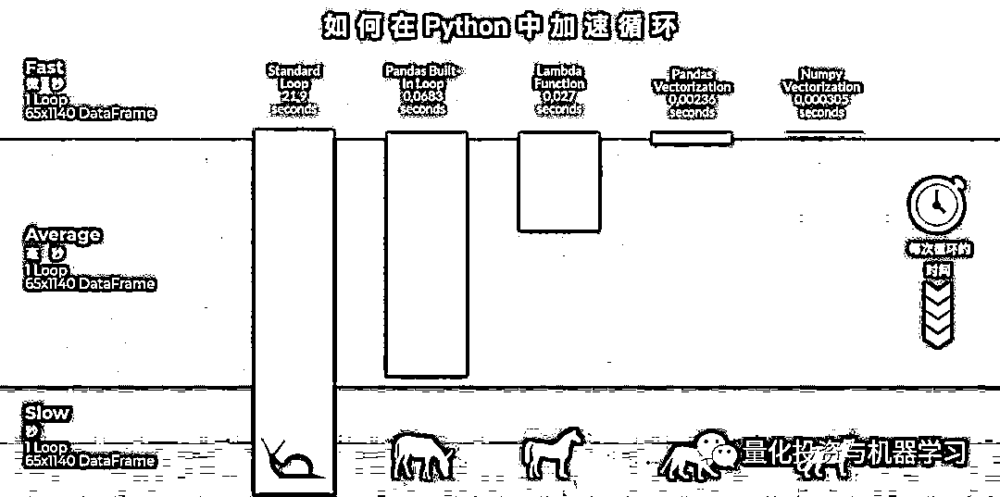
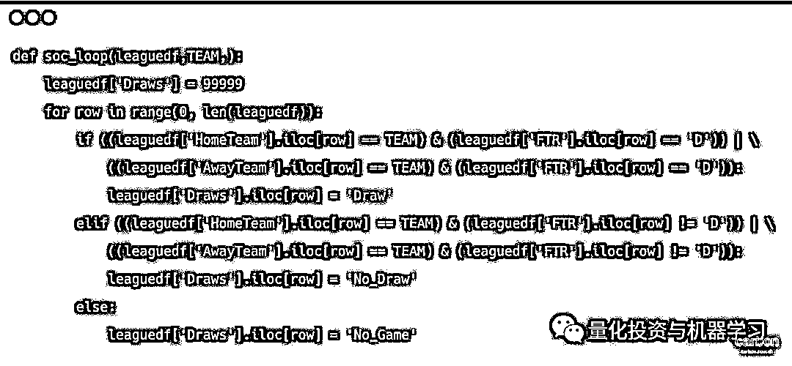
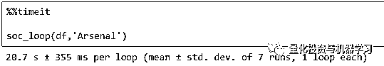
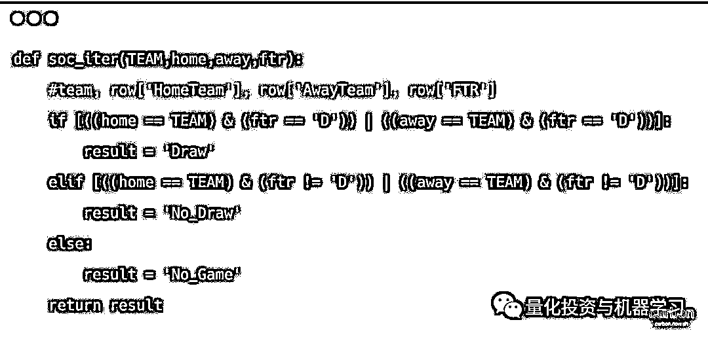
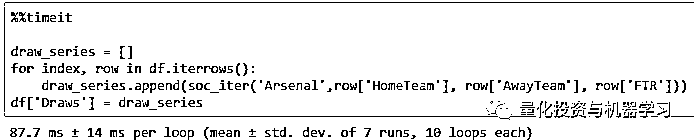
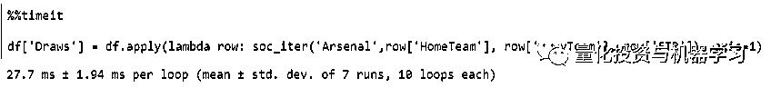
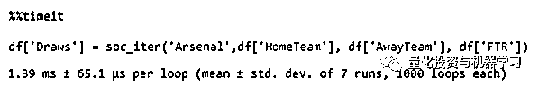
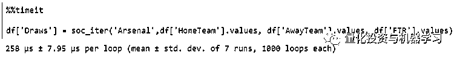
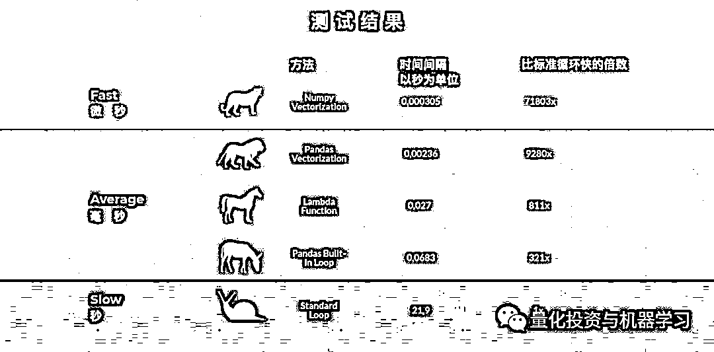

# 一千八百零三、倍！超强 Pandas 循环提速攻略

> 原文：[`mp.weixin.qq.com/s?__biz=MzAxNTc0Mjg0Mg==&mid=2653294130&idx=1&sn=42756891c73ab8b1ecbd6395efef4aba&chksm=802dcc27b75a4531d81719002ac6e62affe4c8e19b56347200bff0502ea44f6edddbbfdffdba&scene=27#wechat_redirect`](http://mp.weixin.qq.com/s?__biz=MzAxNTc0Mjg0Mg==&mid=2653294130&idx=1&sn=42756891c73ab8b1ecbd6395efef4aba&chksm=802dcc27b75a4531d81719002ac6e62affe4c8e19b56347200bff0502ea44f6edddbbfdffdba&scene=27#wechat_redirect)

**标星★公众号     **爱你们♥

作者：Benedikt Droste

编译：1+1=6

**近期原创文章：**

## ♥ [5 种机器学习算法在预测股价的应用（代码+数据）](https://mp.weixin.qq.com/s?__biz=MzAxNTc0Mjg0Mg==&mid=2653290588&idx=1&sn=1d0409ad212ea8627e5d5cedf61953ac&chksm=802dc249b75a4b5fa245433320a4cc9da1a2cceb22df6fb1a28e5b94ff038319ae4e7ec6941f&token=1298662931&lang=zh_CN&scene=21#wechat_redirect)

## ♥ [Two Sigma 用新闻来预测股价走势，带你吊打 Kaggle](https://mp.weixin.qq.com/s?__biz=MzAxNTc0Mjg0Mg==&mid=2653290456&idx=1&sn=b8d2d8febc599742e43ea48e3c249323&chksm=802e3dcdb759b4db9279c689202101b6b154fb118a1c1be12b52e522e1a1d7944858dbd6637e&token=1330520237&lang=zh_CN&scene=21#wechat_redirect)

## ♥ 2 万字干货：[利用深度学习最新前沿预测股价走势](https://mp.weixin.qq.com/s?__biz=MzAxNTc0Mjg0Mg==&mid=2653290080&idx=1&sn=06c50cefe78a7b24c64c4fdb9739c7f3&chksm=802e3c75b759b563c01495d16a638a56ac7305fc324ee4917fd76c648f670b7f7276826bdaa8&token=770078636&lang=zh_CN&scene=21#wechat_redirect)

## ♥ [机器学习在量化金融领域的误用！](http://mp.weixin.qq.com/s?__biz=MzAxNTc0Mjg0Mg==&mid=2653292984&idx=1&sn=3e7efe9fe9452c4a5492d2175b4159ef&chksm=802dcbadb75a42bbdce895c49070c3f552dc8c983afce5eeac5d7c25974b7753e670a0162c89&scene=21#wechat_redirect)

## ♥ [基于 RNN 和 LSTM 的股市预测方法](https://mp.weixin.qq.com/s?__biz=MzAxNTc0Mjg0Mg==&mid=2653290481&idx=1&sn=f7360ea8554cc4f86fcc71315176b093&chksm=802e3de4b759b4f2235a0aeabb6e76b3e101ff09b9a2aa6fa67e6e824fc4274f68f4ae51af95&token=1865137106&lang=zh_CN&scene=21#wechat_redirect)

## ♥ [如何鉴别那些用深度学习预测股价的花哨模型？](https://mp.weixin.qq.com/s?__biz=MzAxNTc0Mjg0Mg==&mid=2653290132&idx=1&sn=cbf1e2a4526e6e9305a6110c17063f46&chksm=802e3c81b759b597d3dd94b8008e150c90087567904a29c0c4b58d7be220a9ece2008956d5db&token=1266110554&lang=zh_CN&scene=21#wechat_redirect)

## ♥ [优化强化学习 Q-learning 算法进行股市](https://mp.weixin.qq.com/s?__biz=MzAxNTc0Mjg0Mg==&mid=2653290286&idx=1&sn=882d39a18018733b93c8c8eac385b515&chksm=802e3d3bb759b42d1fc849f96bf02ae87edf2eab01b0beecd9340112c7fb06b95cb2246d2429&token=1330520237&lang=zh_CN&scene=21#wechat_redirect)

## ♥ [WorldQuant 101 Alpha、国泰君安 191 Alpha](https://mp.weixin.qq.com/s?__biz=MzAxNTc0Mjg0Mg==&mid=2653290927&idx=1&sn=ecca60811da74967f33a00329a1fe66a&chksm=802dc3bab75a4aac2bb4ccff7010063cc08ef51d0bf3d2f71621cdd6adece11f28133a242a15&token=48775331&lang=zh_CN&scene=21#wechat_redirect)

## ♥ [基于回声状态网络预测股票价格（附代码）](https://mp.weixin.qq.com/s?__biz=MzAxNTc0Mjg0Mg==&mid=2653291171&idx=1&sn=485a35e564b45046ff5a07c42bba1743&chksm=802dc0b6b75a49a07e5b91c512c8575104f777b39d0e1d71cf11881502209dc399fd6f641fb1&token=48775331&lang=zh_CN&scene=21#wechat_redirect)

## ♥ [计量经济学应用投资失败的 7 个原因](https://mp.weixin.qq.com/s?__biz=MzAxNTc0Mjg0Mg==&mid=2653292186&idx=1&sn=87501434ae16f29afffec19a6884ee8d&chksm=802dc48fb75a4d99e0172bf484cdbf6aee86e36a95037847fd9f070cbe7144b4617c2d1b0644&token=48775331&lang=zh_CN&scene=21#wechat_redirect)

## ♥ [配对交易千千万，强化学习最 NB！（文档+代码）](http://mp.weixin.qq.com/s?__biz=MzAxNTc0Mjg0Mg==&mid=2653292915&idx=1&sn=13f4ddebcd209b082697a75544852608&chksm=802dcb66b75a4270ceb19fac90eb2a70dc05f5b6daa295a7d31401aaa8697bbb53f5ff7c05af&scene=21#wechat_redirect)

## ♥ [关于高盛在 Github 开源背后的真相！](https://mp.weixin.qq.com/s?__biz=MzAxNTc0Mjg0Mg==&mid=2653291594&idx=1&sn=7703403c5c537061994396e7e49e7ce5&chksm=802dc65fb75a4f49019cec951ac25d30ec7783738e9640ec108be95335597361c427258f5d5f&token=48775331&lang=zh_CN&scene=21#wechat_redirect)

## ♥ [新一代量化带货王诞生！Oh My God！](https://mp.weixin.qq.com/s?__biz=MzAxNTc0Mjg0Mg==&mid=2653291789&idx=1&sn=e31778d1b9372bc7aa6e57b82a69ec6e&chksm=802dc718b75a4e0ea4c022e70ea53f51c48d102ebf7e54993261619c36f24f3f9a5b63437e9e&token=48775331&lang=zh_CN&scene=21#wechat_redirect)

## ♥ [独家！关于定量/交易求职分享（附真实试题）](https://mp.weixin.qq.com/s?__biz=MzAxNTc0Mjg0Mg==&mid=2653291844&idx=1&sn=3fd8b57d32a0ebd43b17fa68ae954471&chksm=802dc751b75a4e4755fcbb0aa228355cebbbb6d34b292aa25b4f3fbd51013fcf7b17b91ddb71&token=48775331&lang=zh_CN&scene=21#wechat_redirect)

## ♥ [Quant 们的身份危机！](https://mp.weixin.qq.com/s?__biz=MzAxNTc0Mjg0Mg==&mid=2653291856&idx=1&sn=729b657ede2cb50c96e92193ab16102d&chksm=802dc745b75a4e53c5018cc1385214233ec4657a3479cd7193c95aaf65642f5f45fa0e465694&token=48775331&lang=zh_CN&scene=21#wechat_redirect)

## ♥ [拿起 Python，防御特朗普的 Twitter](https://mp.weixin.qq.com/s?__biz=MzAxNTc0Mjg0Mg==&mid=2653291977&idx=1&sn=01f146e9a88bf130ca1b479573e6d158&chksm=802dc7dcb75a4ecadfdbdace877ed948f56b72bc160952fd1e4bcde27260f823c999a65a0d6d&token=48775331&lang=zh_CN&scene=21#wechat_redirect)

## ♥ [AQR 最新研究 | 机器能“学习”金融吗？](http://mp.weixin.qq.com/s?__biz=MzAxNTc0Mjg0Mg==&mid=2653292710&idx=1&sn=e5e852de00159a96d5dcc92f349f5b58&chksm=802dcab3b75a43a5492bc98874684081eb5c5666aff32a36a0cdc144d74de0200cc0d997894f&scene=21#wechat_redirect)

**前言**

如果你使用 Python 和 Pandas 进行数据分析，循环是不可避免要使用的。然而，即使对于较小的 DataFrame 来说，使用标准循环也是非常耗时的，对于较大的 DataFrame 来说，你懂的。今天，公众号为大家分享一个关于 Pandas 提速的小攻略，助你一臂之力！

****相关文章****

****[1、30 倍！使用 Cython 加速 Python 代码](http://mp.weixin.qq.com/s?__biz=MzAxNTc0Mjg0Mg==&mid=2653293723&idx=1&sn=8fcb3effaffd583882d5ffe13b330fe2&chksm=802dce8eb75a4798bcb14f9f9cb19b1333c2e31d78fc837448b8a4c8990da9ad083c7fe5ecee&scene=21#wechat_redirect)****

****2、[CuPy：将 Numpy 提速 700 倍！](http://mp.weixin.qq.com/s?__biz=MzAxNTc0Mjg0Mg==&mid=2653294102&idx=1&sn=5dc9d21b3497fe6e1c8df98ee61e02c7&chksm=802dcc03b75a4515a630076cbbe4d116ba1897f4fbb961b0811a888272f9e12953c3ca967c3c&scene=21#wechat_redirect)****

****3[、10 个提高工作效率的 Pandas 小技巧](http://mp.weixin.qq.com/s?__biz=MzAxNTc0Mjg0Mg==&mid=2653293923&idx=2&sn=3c344ab8661a2d9d6b79caa6f253f35d&chksm=802dcf76b75a466080145f290dc01ddc5775906e16e04cec5d48a10f1356b37b2644fd67a38a&scene=21#wechat_redirect)****

****4[、高逼格使用 Pandas 加速代码，向 for 循环说拜拜！](http://mp.weixin.qq.com/s?__biz=MzAxNTc0Mjg0Mg==&mid=2653292258&idx=1&sn=d5d79cecb461eab3591ab8e3c2c03ce0&chksm=802dc4f7b75a4de195bcd6211ac8532d68096bef4d7ca0e5a4fcd792d1e2c7dd5bbea85f91cf&scene=21#wechat_redirect)****

******标准循环******

****Dataframe 是 Pandas 对象，具有行和列。如果使用循环，你将遍历整个对象。Python 不能利用任何内置函数，而且速度非常慢。 我们创建了一个包含 65 列和 1140 行的 Dataframe。它包含了 2016-2019 赛季的足球比赛结果。我们希望创建一个新列，用于标注某个特定球队是否打了平局。****

********

 ******** 

****正如你看到的，这个循环非常慢，花了**20.7 秒**。让我们看看如何才能更有效率。****

******iterrows()：快 321 倍******

# ****在第一个例子中，我们循环遍历了整个 DataFrame。Iterrows()**为每一行返回一个 Series，因此它以索引对的形式遍历 DataFram****e，以 Series 的形式遍历目标列**。这使得它比标准循环更快：****

********

********

****该代码运行时间为**87****毫秒**，**比标准循环快 321 倍**。 ****

****但是，我们建议不要使用它，因为有更快的选择，而且**iterrows()不能保留行之间的 dtype**。这意味着，如果你在 dataframe dtypes 上使用 iterrows() ，它会被更改，这可能会导致很多问题。如果一定要保留 dtypes，也可以使用 itertuple()。这里我们不详细讨论，你可以在这里找到官方文件：****

*****https://pandas.pydata.org/pandas-docs/stable/reference/api/pandas.DataFrame.itertuples.html?source=post_page-----805030df4f06----------------------*****

******Apply()：快 811 倍******

# ****apply 本身并不快，但与 DataFrame 结合使用时，它具有很大的优势。这取决于 apply 表达式的内容。 如果它可以在 Cython 中执行，那么 apply 要快得多。****

# ****我们可以在 Lambda 函数中使用 apply。 所要做的就是指定轴，使用 axis=1，因为我们希望执行按列操作：****

********

****这段代码甚至比以前的方法更快，时间为**27 毫秒**。****

******Pandas Vectorization：******快 9280 倍********

# ********我们利用向量化的优势来创建真正高效的代码。关键是要避免案例 1 中那样的循环代码：********

****************

********我们再次使用了开始时构建的函数。我们所要做的就是改变输入。我们直接将 Pandas Series 传递给我们的功能，这使我们获得了巨大的速度提升。********

**********Nump Vectorization：******快 71803 倍************

************在前面的示例中，我们将 Pandas Series 传递给函数。通过 adding.values，我们得到一个 Numpy 数组：************

************************

************Numpy 数组是如此之快，因为我们引用了局部性的好处：************

**************访问局部性（locality of reference）**************

************在计算机科学中，访问局部性，也称为局部性原理，是取决于存储器访问模式频繁访问相同值或相关存储位置的现象的术语。访问局部性有两种基本类型——时间和空间局部性。时间局部性是指在相对较小的持续时间内对特定数据和/或资源的重用。空间局部性是指在相对靠近的存储位置内使用数据元素。当数据元素被线性地排列和访问时，例如遍历一维数组中的元素，发生顺序局部性，即空间局部性的特殊情况。************

************局部性只是计算机系统中发生的一种可预测的行为。展示强访问局部性的系统是通过使用诸如在处理器核心的流水线级处的高速缓存，用于存储器的预取和高级分支预测器的技术的性能优化的良好候选者。************

************代码运行了**0.305 毫秒**，比开始时使用的标准循环快了 **71803 倍！**************

**************总结**************

************我们比较了五种不同的方法，并根据一些计算将一个新列添加到我们的 DataFrame 中。我们注意到了速度方面的巨大差异：************ 

************************

************请记住：************

**************1、如果确定需要使用循环，则应始终选择 apply 方法。**************

**************2、否则，vectorization 总是更好的，因为它更快！**************

**************文章参考**************

************[1] https://stackoverflow.com/questions/52673285/performance-of-pandas-apply-vs-np-vectorize-to-create-new-column-from-existing-c************

************[2 ] https://en.wikipedia.org/wiki/Locality_of_reference************

*************—End—*************

************量化投资与机器学习微信公众号，是业内垂直于**Quant**、**MFE**、**CST、AI**等专业的**主****流量化自媒体**。公众号拥有来自**公募、私募、券商、银行、海外**等众多圈内**10W+**关注者。每日发布行业前沿研究成果和最新量化资讯。************

************************************你点的每个“在看”，我们都认真当成了喜欢************