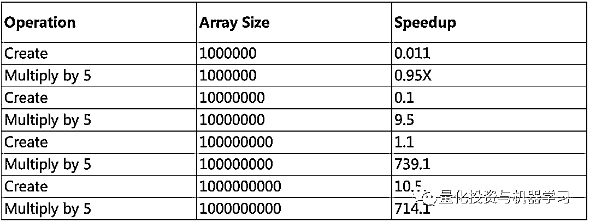

# CuPy：将 Numpy 提速 700 倍！

> 原文：[`mp.weixin.qq.com/s?__biz=MzAxNTc0Mjg0Mg==&mid=2653294102&idx=1&sn=5dc9d21b3497fe6e1c8df98ee61e02c7&chksm=802dcc03b75a4515a630076cbbe4d116ba1897f4fbb961b0811a888272f9e12953c3ca967c3c&scene=27#wechat_redirect`](http://mp.weixin.qq.com/s?__biz=MzAxNTc0Mjg0Mg==&mid=2653294102&idx=1&sn=5dc9d21b3497fe6e1c8df98ee61e02c7&chksm=802dcc03b75a4515a630076cbbe4d116ba1897f4fbb961b0811a888272f9e12953c3ca967c3c&scene=27#wechat_redirect)


**标星★公众号     **爱你们♥

作者：George Seif

编译：1+1=6

**近期原创文章：**

## ♥ [5 种机器学习算法在预测股价的应用（代码+数据）](https://mp.weixin.qq.com/s?__biz=MzAxNTc0Mjg0Mg==&mid=2653290588&idx=1&sn=1d0409ad212ea8627e5d5cedf61953ac&chksm=802dc249b75a4b5fa245433320a4cc9da1a2cceb22df6fb1a28e5b94ff038319ae4e7ec6941f&token=1298662931&lang=zh_CN&scene=21#wechat_redirect)

## ♥ [Two Sigma 用新闻来预测股价走势，带你吊打 Kaggle](https://mp.weixin.qq.com/s?__biz=MzAxNTc0Mjg0Mg==&mid=2653290456&idx=1&sn=b8d2d8febc599742e43ea48e3c249323&chksm=802e3dcdb759b4db9279c689202101b6b154fb118a1c1be12b52e522e1a1d7944858dbd6637e&token=1330520237&lang=zh_CN&scene=21#wechat_redirect)

## ♥ 2 万字干货：[利用深度学习最新前沿预测股价走势](https://mp.weixin.qq.com/s?__biz=MzAxNTc0Mjg0Mg==&mid=2653290080&idx=1&sn=06c50cefe78a7b24c64c4fdb9739c7f3&chksm=802e3c75b759b563c01495d16a638a56ac7305fc324ee4917fd76c648f670b7f7276826bdaa8&token=770078636&lang=zh_CN&scene=21#wechat_redirect)

## ♥ [机器学习在量化金融领域的误用！](http://mp.weixin.qq.com/s?__biz=MzAxNTc0Mjg0Mg==&mid=2653292984&idx=1&sn=3e7efe9fe9452c4a5492d2175b4159ef&chksm=802dcbadb75a42bbdce895c49070c3f552dc8c983afce5eeac5d7c25974b7753e670a0162c89&scene=21#wechat_redirect)

## ♥ [基于 RNN 和 LSTM 的股市预测方法](https://mp.weixin.qq.com/s?__biz=MzAxNTc0Mjg0Mg==&mid=2653290481&idx=1&sn=f7360ea8554cc4f86fcc71315176b093&chksm=802e3de4b759b4f2235a0aeabb6e76b3e101ff09b9a2aa6fa67e6e824fc4274f68f4ae51af95&token=1865137106&lang=zh_CN&scene=21#wechat_redirect)

## ♥ [如何鉴别那些用深度学习预测股价的花哨模型？](https://mp.weixin.qq.com/s?__biz=MzAxNTc0Mjg0Mg==&mid=2653290132&idx=1&sn=cbf1e2a4526e6e9305a6110c17063f46&chksm=802e3c81b759b597d3dd94b8008e150c90087567904a29c0c4b58d7be220a9ece2008956d5db&token=1266110554&lang=zh_CN&scene=21#wechat_redirect)

## ♥ [优化强化学习 Q-learning 算法进行股市](https://mp.weixin.qq.com/s?__biz=MzAxNTc0Mjg0Mg==&mid=2653290286&idx=1&sn=882d39a18018733b93c8c8eac385b515&chksm=802e3d3bb759b42d1fc849f96bf02ae87edf2eab01b0beecd9340112c7fb06b95cb2246d2429&token=1330520237&lang=zh_CN&scene=21#wechat_redirect)

## ♥ [WorldQuant 101 Alpha、国泰君安 191 Alpha](https://mp.weixin.qq.com/s?__biz=MzAxNTc0Mjg0Mg==&mid=2653290927&idx=1&sn=ecca60811da74967f33a00329a1fe66a&chksm=802dc3bab75a4aac2bb4ccff7010063cc08ef51d0bf3d2f71621cdd6adece11f28133a242a15&token=48775331&lang=zh_CN&scene=21#wechat_redirect)

## ♥ [基于回声状态网络预测股票价格（附代码）](https://mp.weixin.qq.com/s?__biz=MzAxNTc0Mjg0Mg==&mid=2653291171&idx=1&sn=485a35e564b45046ff5a07c42bba1743&chksm=802dc0b6b75a49a07e5b91c512c8575104f777b39d0e1d71cf11881502209dc399fd6f641fb1&token=48775331&lang=zh_CN&scene=21#wechat_redirect)

## ♥ [计量经济学应用投资失败的 7 个原因](https://mp.weixin.qq.com/s?__biz=MzAxNTc0Mjg0Mg==&mid=2653292186&idx=1&sn=87501434ae16f29afffec19a6884ee8d&chksm=802dc48fb75a4d99e0172bf484cdbf6aee86e36a95037847fd9f070cbe7144b4617c2d1b0644&token=48775331&lang=zh_CN&scene=21#wechat_redirect)

## ♥ [配对交易千千万，强化学习最 NB！（文档+代码）](http://mp.weixin.qq.com/s?__biz=MzAxNTc0Mjg0Mg==&mid=2653292915&idx=1&sn=13f4ddebcd209b082697a75544852608&chksm=802dcb66b75a4270ceb19fac90eb2a70dc05f5b6daa295a7d31401aaa8697bbb53f5ff7c05af&scene=21#wechat_redirect)

## ♥ [关于高盛在 Github 开源背后的真相！](https://mp.weixin.qq.com/s?__biz=MzAxNTc0Mjg0Mg==&mid=2653291594&idx=1&sn=7703403c5c537061994396e7e49e7ce5&chksm=802dc65fb75a4f49019cec951ac25d30ec7783738e9640ec108be95335597361c427258f5d5f&token=48775331&lang=zh_CN&scene=21#wechat_redirect)

## ♥ [新一代量化带货王诞生！Oh My God！](https://mp.weixin.qq.com/s?__biz=MzAxNTc0Mjg0Mg==&mid=2653291789&idx=1&sn=e31778d1b9372bc7aa6e57b82a69ec6e&chksm=802dc718b75a4e0ea4c022e70ea53f51c48d102ebf7e54993261619c36f24f3f9a5b63437e9e&token=48775331&lang=zh_CN&scene=21#wechat_redirect)

## ♥ [独家！关于定量/交易求职分享（附真实试题）](https://mp.weixin.qq.com/s?__biz=MzAxNTc0Mjg0Mg==&mid=2653291844&idx=1&sn=3fd8b57d32a0ebd43b17fa68ae954471&chksm=802dc751b75a4e4755fcbb0aa228355cebbbb6d34b292aa25b4f3fbd51013fcf7b17b91ddb71&token=48775331&lang=zh_CN&scene=21#wechat_redirect)

## ♥ [Quant 们的身份危机！](https://mp.weixin.qq.com/s?__biz=MzAxNTc0Mjg0Mg==&mid=2653291856&idx=1&sn=729b657ede2cb50c96e92193ab16102d&chksm=802dc745b75a4e53c5018cc1385214233ec4657a3479cd7193c95aaf65642f5f45fa0e465694&token=48775331&lang=zh_CN&scene=21#wechat_redirect)

## ♥ [拿起 Python，防御特朗普的 Twitter](https://mp.weixin.qq.com/s?__biz=MzAxNTc0Mjg0Mg==&mid=2653291977&idx=1&sn=01f146e9a88bf130ca1b479573e6d158&chksm=802dc7dcb75a4ecadfdbdace877ed948f56b72bc160952fd1e4bcde27260f823c999a65a0d6d&token=48775331&lang=zh_CN&scene=21#wechat_redirect)

## ♥ [AQR 最新研究 | 机器能“学习”金融吗？](http://mp.weixin.qq.com/s?__biz=MzAxNTc0Mjg0Mg==&mid=2653292710&idx=1&sn=e5e852de00159a96d5dcc92f349f5b58&chksm=802dcab3b75a43a5492bc98874684081eb5c5666aff32a36a0cdc144d74de0200cc0d997894f&scene=21#wechat_redirect)

**前言**

Numpy 是 Python 社区的一份礼物。它允许数据科学家、机器学习实践者和统计学家以一种简单有效的方式处理矩阵式的海量数据。

当你发现 Python 代码运行缓慢时，特别是看到许多 for-loop 循环时，那么将数据处理迁移到 Numpy 并让其向量化以最快的速度完成工作总是一个好主意！

尽管如此，即使这样加速 Numpy 也只能在 CPU 上运行。由于使用者的 CPU 通常有 8 个或更少的内核，因此可以加速的速度是有限的。

如何解决这个问题，CuPy 来啦！

**相关文章**

[1、30 倍！使用 Cython 加速 Python 代码](http://mp.weixin.qq.com/s?__biz=MzAxNTc0Mjg0Mg==&mid=2653293723&idx=1&sn=8fcb3effaffd583882d5ffe13b330fe2&chksm=802dce8eb75a4798bcb14f9f9cb19b1333c2e31d78fc837448b8a4c8990da9ad083c7fe5ecee&scene=21#wechat_redirect)

[2、10 个提高工作效率的 Pandas 小技巧](http://mp.weixin.qq.com/s?__biz=MzAxNTc0Mjg0Mg==&mid=2653293923&idx=2&sn=3c344ab8661a2d9d6b79caa6f253f35d&chksm=802dcf76b75a466080145f290dc01ddc5775906e16e04cec5d48a10f1356b37b2644fd67a38a&scene=21#wechat_redirect)[3、高逼格使用 Pandas 加速代码，向 for 循环说拜拜！](http://mp.weixin.qq.com/s?__biz=MzAxNTc0Mjg0Mg==&mid=2653292258&idx=1&sn=d5d79cecb461eab3591ab8e3c2c03ce0&chksm=802dc4f7b75a4de195bcd6211ac8532d68096bef4d7ca0e5a4fcd792d1e2c7dd5bbea85f91cf&scene=21#wechat_redirect)
**什么是 CuPy？**

**CuPy 是一个通过利用 CUDA GPU 库在 Nvidia GPU 上实现 Numpy 数组的库**。通过这种实现，由于拥有许多 CUDA 核心 GPU，可以实现更好的并行加速。


*官网：**https://github.com/cupy/cupy*

CuPy 的接口是 Numpy 的镜像，在大多数情况下，它可以被直接替代。**只要用兼容的 CuPy 代码替换你的 Numpy 代码，你就可以加快 GPU 的运行速度**。CuPy 将支持 Numpy 的大多数数组操作，包括索引、广播和各种矩阵转换。

你也可以编写自定义 Python 代码，利用 CUDA 和 GPU 加速，如果你有一些特定的东西还不支持的话。 只需要一小段 C++格式的代码，CuPy 就会自动执行 GPU 转换，非常类似于使用 Cython。

我们可以通过 pip 安装这个库：

```py
pip install cupy
```

**运行 GPU 基于 CuPy**

对于这些基准测试，我们将使用 PC 机进行以下设置：

*   i7–8700k CPU

*   1080 Ti GPU

*   32 GB of DDR4 3000MHz RAM

*   CUDA 9.0

一旦安装了 CuPy，我们可以像 Numpy 一样导入它：

```py
import numpy as np
import cupy as cp
import time
```

对于剩下的代码，在 Numpy 和 CuPy 之间切换就像用 CuPy 的 cp 替换 Numpy 中的 np 一样简单。下面的代码为 Numpy 和 CuPy 创建了一个 3D 数组，其中包含 10 亿个 1。 为了测试创建数组的速度，使用了 Python 的本地 time 库：

```py
### Numpy and CPU
s = time.time()
x_cpu = np.ones((1000,1000,1000))
e = time.time()
print(e - s)
### CuPy and GPU
s = time.time()
x_gpu = cp.ones((1000,1000,1000))
e = time.time()
print(e - s)
```

令人难以置信的是，即使只是创建数组，CuPy 仍然要快得多。 **Numpy 在 1.68 秒内创建了 10 亿个 1 的数组，而 CuPy 只花了 0.16 秒，这是 10.5 倍的加速！**

让我们尝试对数组进行一些数学运算。这次我们将整个数组乘以 5，再次查看 Numpy 与 CuPy 的速度。

```py
### Numpy and CPU
s = time.time()
x_cpu *= 5
e = time.time()
print(e - s)
### CuPy and GPU
s = time.time()
x_gpu *= 5
e = time.time()
print(e - s)
```

在本例中，CuPy 完胜 Numpy。Numpy 花了 0.507 秒，而 CuPy 只花了 0.000710 秒。**714.1 倍**的加速！

现在让我们尝试使用多个数组并执行一些操作：

```py
### Numpy and CPU
s = time.time()
x_cpu *= 5
x_cpu *= x_cpu
x_cpu += x_cpu
e = time.time()
print(e - s)
### CuPy and GPU
s = time.time()
x_gpu *= 5
x_gpu *= x_gpu
x_gpu += x_gpu
e = time.time()
print(e - s)
```

在本例中，**Numpy 在 CPU 上以 1.49 秒**的时间执行该进程，而**CuPy 在 GPU 上以 0.0922 秒**的时间执行该进程。**16.16 倍的加速！**

**总是那么快吗?**

使用 CuPy 是在 GPU 上多次加速 Numpy 和矩阵操作的一个很好的方法。需要注意的是，你将**获得的加速度在很大程度上取决于所使用数组的大小**。下面的表格显示了当我们改变数组的大小时速度上的差异：



一旦：

**达到约****1000 万个****数据点，加速度就会急剧上升！**

而一旦：

**超过****1 亿个****数据点，加速度就会大大加快！**

在此之下：

**Numpy 实际上更快！**

还要记住，**更多的 GPU 内存将帮助你处理更多的数据，所以重要的是看看你的 GPU 是否有足够的内存来容纳足够的数据**，而 CuPy 是值得的！

*来自：**https://twitter.com/GeorgeSeif94*

*—End—*

量化投资与机器学习微信公众号，是业内垂直于**Quant**、**MFE**、**CST、AI**等专业的**主****流量化自媒体**。公众号拥有来自**公募、私募、券商、银行、海外**等众多圈内**10W+**关注者。每日发布行业前沿研究成果和最新量化资讯。

你点的每个“在看”，我们都认真当成了喜欢