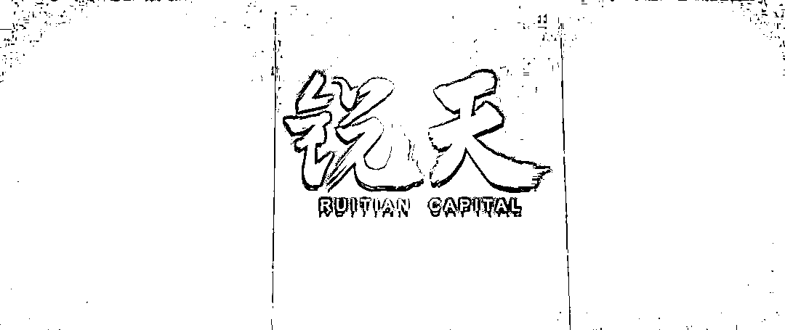

# 锐天，校招！

> 原文：[`mp.weixin.qq.com/s?__biz=MzAxNTc0Mjg0Mg==&mid=2653294086&idx=1&sn=4250b258179c55a70328f5f15e2fde26&chksm=802dcc13b75a4505423be8b5c8d44b215fd1efa5fa1076c652e3e71f2eea1f05d59b669e6c3e&scene=27#wechat_redirect`](http://mp.weixin.qq.com/s?__biz=MzAxNTc0Mjg0Mg==&mid=2653294086&idx=1&sn=4250b258179c55a70328f5f15e2fde26&chksm=802dcc13b75a4505423be8b5c8d44b215fd1efa5fa1076c652e3e71f2eea1f05d59b669e6c3e&scene=27#wechat_redirect)

**标星★公众号     **爱你们♥

量化投资与机器学习微信公众号，是业内垂直于**Quant**、**MFE**、**CST、AI**等专业的**量化主流自媒体**。公众号拥有来自**公募、私募、券商、银行、海外**等众多圈内**18W+**用户，我们为所有量化金融机构**免费提供**岗位招聘与推广，再次感谢各大金融机构对我们的信任和支持！

**关于我们**

锐天是一家领先的量化交易对冲基金公司，于 2013 年在上海成立，如今已进入**中国量化交易领域第一梯队，管理规模俞百亿人民币**，基金 40 多支，正在积极拓展海外市场，并在北京，深圳开设分部，共有 50 多名员工。

创始人来自全球顶级对冲基金，核心成员均毕业于麻省理工大学，北京大学，纽约大学，复旦大学，上海交通大学等，来自国际顶尖对冲基金和国内一线互联网公司。我们倡导高效工作与生活平衡，采用扁平式管理，凭借科学的研究方法，领先的高性能集群技术平台创造了稳定收益。

上海锐天投资办公环境

**我们的愿景是成长为一家全球知名的对冲基金，引领全球资本市场行业发展**。

如果你对**数学建模**，**极致代码**和**金融交易**有兴趣，期待加入!

**量化策略研究员**

**▍工作地点**

**上海**

**▍岗位职责**

1、研究总结投资逻辑，并运用数量化方法论证和实现；

2、通过数据挖掘，发掘数据规律、寻找交易逻辑；

3、交易策略的持续跟踪，优化和改进量化交易策略。

**▍岗位要求**

1、2019，2020 毕业于国内外一流名校的数学，统计学，物理，计算机等相关专业；

2、数学基础扎实，能熟练应用数学语言描述现实问题；

3、熟练使用 Python 语言，有 TensorFlow 经验是优势；

4、对量化研究有强烈兴趣，对数字敏感和自我学习能力强；

5、熟悉机器学习或各类竞赛获奖经历（ACM、NOI、IMO）是优势；

6、国内外人才都考虑，可远程面试回国。

**C++开发工程师（薪资高于 BAT）**

**▍工作地点**

**上海**

**▍岗位职责**

1、高性能交易和研究系统的开发，优化和维护；

2、交易系统的扩展，包括与海内外的金融市场的连接，功能模块的开发等；

3、交易系统的深层次优化；

4、开发交易系统相对应的回测和分析模块。

**▍岗位要求**

1、2019，2020，2021 年毕业于国内外知名高校的计算机，软件工程等相关专业；

2、扎实的计算机基础，熟悉 C++和 Python 编程；

3、深入理解 Linux 系统，网络，计算机体系架构，熟悉系统开发，操作系统；

4、对技术充满兴趣，对编程精益求精；

5、国内外人才都考虑，可远程面试回国。

**福利待遇**

1、800 万额度的商业保险，包含外资医院报销。

2、提供系统的培训。

3、提供日常三餐，零食，饮料和水果。

4、一年两次国内外旅游。

5、有竞争力的薪资和奖金。

6、运动俱乐部：羽毛球，攀岩，篮球。

7、定期部门团建。

8、扁平化管理。

****投递邮箱****

***campus@ruitiancapital.com***

*注：我们对每家机构都经过严格的核对和身份认证，确保信息的准确性和邮箱的真实性。大家可放心投递！

**企业如有招聘需求，****请发邮件至：**

***lhtzjqxx@163.com***

**免费提供此服务**