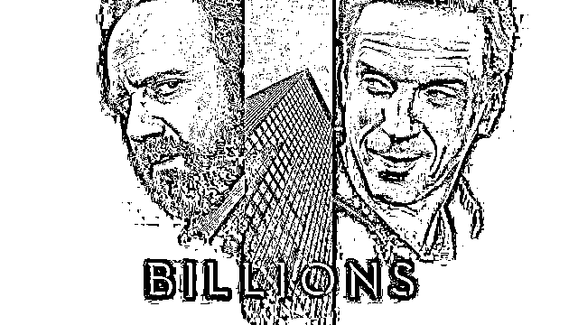

# 扒一扒 Billions 第四季：你必须知道的投资秘密（下）

> 原文：[`mp.weixin.qq.com/s?__biz=MzAxNTc0Mjg0Mg==&mid=2653294079&idx=1&sn=001acaeef585dc688ebf83171c058116&chksm=802dcfeab75a46fc69e14d2a2cd0e56553b7f89d54217b896d7b58e53cce34bd2c7b51386120&scene=27#wechat_redirect`](http://mp.weixin.qq.com/s?__biz=MzAxNTc0Mjg0Mg==&mid=2653294079&idx=1&sn=001acaeef585dc688ebf83171c058116&chksm=802dcfeab75a46fc69e14d2a2cd0e56553b7f89d54217b896d7b58e53cce34bd2c7b51386120&scene=27#wechat_redirect)

**标星★公众号     **爱你们♥

**近期原创文章：**

## ♥ [5 种机器学习算法在预测股价的应用（代码+数据）](https://mp.weixin.qq.com/s?__biz=MzAxNTc0Mjg0Mg==&mid=2653290588&idx=1&sn=1d0409ad212ea8627e5d5cedf61953ac&chksm=802dc249b75a4b5fa245433320a4cc9da1a2cceb22df6fb1a28e5b94ff038319ae4e7ec6941f&token=1298662931&lang=zh_CN&scene=21#wechat_redirect)

## ♥ [Two Sigma 用新闻来预测股价走势，带你吊打 Kaggle](https://mp.weixin.qq.com/s?__biz=MzAxNTc0Mjg0Mg==&mid=2653290456&idx=1&sn=b8d2d8febc599742e43ea48e3c249323&chksm=802e3dcdb759b4db9279c689202101b6b154fb118a1c1be12b52e522e1a1d7944858dbd6637e&token=1330520237&lang=zh_CN&scene=21#wechat_redirect)

## ♥ 2 万字干货：[利用深度学习最新前沿预测股价走势](https://mp.weixin.qq.com/s?__biz=MzAxNTc0Mjg0Mg==&mid=2653290080&idx=1&sn=06c50cefe78a7b24c64c4fdb9739c7f3&chksm=802e3c75b759b563c01495d16a638a56ac7305fc324ee4917fd76c648f670b7f7276826bdaa8&token=770078636&lang=zh_CN&scene=21#wechat_redirect)

## ♥ [机器学习在量化金融领域的误用！](http://mp.weixin.qq.com/s?__biz=MzAxNTc0Mjg0Mg==&mid=2653292984&idx=1&sn=3e7efe9fe9452c4a5492d2175b4159ef&chksm=802dcbadb75a42bbdce895c49070c3f552dc8c983afce5eeac5d7c25974b7753e670a0162c89&scene=21#wechat_redirect)

## ♥ [基于 RNN 和 LSTM 的股市预测方法](https://mp.weixin.qq.com/s?__biz=MzAxNTc0Mjg0Mg==&mid=2653290481&idx=1&sn=f7360ea8554cc4f86fcc71315176b093&chksm=802e3de4b759b4f2235a0aeabb6e76b3e101ff09b9a2aa6fa67e6e824fc4274f68f4ae51af95&token=1865137106&lang=zh_CN&scene=21#wechat_redirect)

## ♥ [如何鉴别那些用深度学习预测股价的花哨模型？](https://mp.weixin.qq.com/s?__biz=MzAxNTc0Mjg0Mg==&mid=2653290132&idx=1&sn=cbf1e2a4526e6e9305a6110c17063f46&chksm=802e3c81b759b597d3dd94b8008e150c90087567904a29c0c4b58d7be220a9ece2008956d5db&token=1266110554&lang=zh_CN&scene=21#wechat_redirect)

## ♥ [优化强化学习 Q-learning 算法进行股市](https://mp.weixin.qq.com/s?__biz=MzAxNTc0Mjg0Mg==&mid=2653290286&idx=1&sn=882d39a18018733b93c8c8eac385b515&chksm=802e3d3bb759b42d1fc849f96bf02ae87edf2eab01b0beecd9340112c7fb06b95cb2246d2429&token=1330520237&lang=zh_CN&scene=21#wechat_redirect)

## ♥ [WorldQuant 101 Alpha、国泰君安 191 Alpha](https://mp.weixin.qq.com/s?__biz=MzAxNTc0Mjg0Mg==&mid=2653290927&idx=1&sn=ecca60811da74967f33a00329a1fe66a&chksm=802dc3bab75a4aac2bb4ccff7010063cc08ef51d0bf3d2f71621cdd6adece11f28133a242a15&token=48775331&lang=zh_CN&scene=21#wechat_redirect)

## ♥ [基于回声状态网络预测股票价格（附代码）](https://mp.weixin.qq.com/s?__biz=MzAxNTc0Mjg0Mg==&mid=2653291171&idx=1&sn=485a35e564b45046ff5a07c42bba1743&chksm=802dc0b6b75a49a07e5b91c512c8575104f777b39d0e1d71cf11881502209dc399fd6f641fb1&token=48775331&lang=zh_CN&scene=21#wechat_redirect)

## ♥ [计量经济学应用投资失败的 7 个原因](https://mp.weixin.qq.com/s?__biz=MzAxNTc0Mjg0Mg==&mid=2653292186&idx=1&sn=87501434ae16f29afffec19a6884ee8d&chksm=802dc48fb75a4d99e0172bf484cdbf6aee86e36a95037847fd9f070cbe7144b4617c2d1b0644&token=48775331&lang=zh_CN&scene=21#wechat_redirect)

## ♥ [配对交易千千万，强化学习最 NB！（文档+代码）](http://mp.weixin.qq.com/s?__biz=MzAxNTc0Mjg0Mg==&mid=2653292915&idx=1&sn=13f4ddebcd209b082697a75544852608&chksm=802dcb66b75a4270ceb19fac90eb2a70dc05f5b6daa295a7d31401aaa8697bbb53f5ff7c05af&scene=21#wechat_redirect)

## ♥ [关于高盛在 Github 开源背后的真相！](https://mp.weixin.qq.com/s?__biz=MzAxNTc0Mjg0Mg==&mid=2653291594&idx=1&sn=7703403c5c537061994396e7e49e7ce5&chksm=802dc65fb75a4f49019cec951ac25d30ec7783738e9640ec108be95335597361c427258f5d5f&token=48775331&lang=zh_CN&scene=21#wechat_redirect)

## ♥ [新一代量化带货王诞生！Oh My God！](https://mp.weixin.qq.com/s?__biz=MzAxNTc0Mjg0Mg==&mid=2653291789&idx=1&sn=e31778d1b9372bc7aa6e57b82a69ec6e&chksm=802dc718b75a4e0ea4c022e70ea53f51c48d102ebf7e54993261619c36f24f3f9a5b63437e9e&token=48775331&lang=zh_CN&scene=21#wechat_redirect)

## ♥ [独家！关于定量/交易求职分享（附真实试题）](https://mp.weixin.qq.com/s?__biz=MzAxNTc0Mjg0Mg==&mid=2653291844&idx=1&sn=3fd8b57d32a0ebd43b17fa68ae954471&chksm=802dc751b75a4e4755fcbb0aa228355cebbbb6d34b292aa25b4f3fbd51013fcf7b17b91ddb71&token=48775331&lang=zh_CN&scene=21#wechat_redirect)

## ♥ [Quant 们的身份危机！](https://mp.weixin.qq.com/s?__biz=MzAxNTc0Mjg0Mg==&mid=2653291856&idx=1&sn=729b657ede2cb50c96e92193ab16102d&chksm=802dc745b75a4e53c5018cc1385214233ec4657a3479cd7193c95aaf65642f5f45fa0e465694&token=48775331&lang=zh_CN&scene=21#wechat_redirect)

## ♥ [拿起 Python，防御特朗普的 Twitter](https://mp.weixin.qq.com/s?__biz=MzAxNTc0Mjg0Mg==&mid=2653291977&idx=1&sn=01f146e9a88bf130ca1b479573e6d158&chksm=802dc7dcb75a4ecadfdbdace877ed948f56b72bc160952fd1e4bcde27260f823c999a65a0d6d&token=48775331&lang=zh_CN&scene=21#wechat_redirect)

## ♥ [AQR 最新研究 | 机器能“学习”金融吗？](http://mp.weixin.qq.com/s?__biz=MzAxNTc0Mjg0Mg==&mid=2653292710&idx=1&sn=e5e852de00159a96d5dcc92f349f5b58&chksm=802dcab3b75a43a5492bc98874684081eb5c5666aff32a36a0cdc144d74de0200cc0d997894f&scene=21#wechat_redirect)

作者：蹲哥 | 加里敦蹲哥

**前言**

第三季末时，查克为扳倒腐败的联邦检察长却遭手下背叛，失去职位。而鲍比也因自己的雇员自立门户而多了一个强敌。季末，查克、温迪和鲍比三人同坐一桌，昔日的对手现今一笑抹恩仇，你能想象这三人如果联手起来会发生什么吗？

这部剧，能让你们真正见识到什么叫**“有钱任性”**，什么才是**“为所欲为”**。以及：

**想要拥有这样的财富，需要付出什么代价**

如果你还意犹未尽或第一次观看：

**第 1、2、3、4 季资源我们全部帮你整理好**

**文末查看**

今天**蹲哥**为大家扒一扒 Billions 第四季那些你必须知道的投资知识！**超精彩！**

本期带来第 9 集~第 12 集。

[**第 1 集~第 4 集**](http://mp.weixin.qq.com/s?__biz=MzAxNTc0Mjg0Mg==&mid=2653293801&idx=1&sn=00e71e5179b99ac8cf60ecebf996d37c&chksm=802dcefcb75a47ea118e5c20195a85ceabd4785eacc67a31c380450a856219ffd9b50466429e&scene=21#wechat_redirect)[**第 5 集~第 8 集**](https://mp.weixin.qq.com/s?__biz=MzAxNTc0Mjg0Mg==&mid=2653293936&idx=1&sn=59f47b30f8b0a9468328ed8515d76f78&chksm=802dcf65b75a4673a642430965d9bafc853b26be01804153be196ab0a8afef9272cf3e6f4805&token=1688676305&lang=zh_CN&scene=21#wechat_redirect)

**第 9 集**

邦尼这条线，mayfee 以其人之道还治其人之身，看似不经意的一句话就搅得 axe 的员工心神不宁，集体罢工向 bobby 争取进入旗舰基金...

邦尼很鸡贼的利用了两个对他有意思的男人，从 bill 那获得确实有旗舰基金存在的准确信息（当然最后也献身了），让猥琐男打头阵逼宫，搞得 bobby 反问猥琐男：你以为你是哈维尔或者瓦文萨么？哈维尔和瓦文萨是当年八九十年代东欧剧变最重要的领导人，分别成为了捷克和波兰的第一任民选总统....这两位说起来和华尔街也是联系得起来的，这个联系不用说必须是开放社会倡导者、政治慈善家索罗斯索老了，早在 1980 年，本来就是匈牙利人的索罗斯就开始在东欧搞开放社会活动，捐奖学金给东欧的 yi 议分子，还有支持像 77 宪 xxxx 章（charta 77，就是哈维尔领导的）和波兰团结工会（瓦文萨）这样的组织，这个支持最后在 90 年左右的东欧剧变中结成了果实..结果论，现在捷克人波兰人日子过的不差，波兰还是美国在欧洲大陆最坚定的盟友..说回到 axe 这个逼宫事件，一顿骚操作的邦尼最后成了最大的赢家。

bobby 和瑞贝卡这条线，本已到手的控制权遭到 taylor 联合辛格阻击，而辛格这样的 old Money 之前就看不上 bobby(不卖 NFL 俱乐部给 bobby），bobby 抢购大厦逼辛格找自己谈判，这里也利用了辛格的虚荣心，辛格马上要出的新书的最后一章要宣传自己买大厦这个事，这部分加进去了和中国国有资本竞买大厦的元素，贴合了 2018 年开始的中美 mao 易战的现实...

chuck 这条线，chuck 好像要为自己而战了，即使 wendy 能顺利脱身也比不上他的区块链投票提议？

区块链投票是这两年比较热的议题，去年美国弗吉尼亚州就已经成功试验了区块链投票，此外还有像瑞士韩国俄罗斯这些国家都有在搞这块的试验，当然反对意见也有：

“美国国家科学院、工程和医学院（NASEM）发布了长达 150 页，题为《安全投票: 保护美国民主》(Securing the Vote: Protecting American Democracy)。该报告不但认为目前不应该使用区块链投票系统，还提倡 2020 年的美国选举应该使用纸质选票。原因在于，尽管使用区块链技术作为“投票箱”似乎非常有“希望”，但这项技术并没有从根本上解决选举的基础安全问题。目前的区块链应用仍然缺乏保证投票过程可核查性、保密性、选票安全性的可用技术。”

但我还看不懂 jock 反对的理由，区块链投票用智能手机会大大提高投票的参与率，美国之前是没有强制性投票方面的法规的，所以投票率在 min 主国家中排名一直是比较靠后的，所以可能投票率的提高会对 jock 不利？

taylor 和黑妹搞上了，我觉得黑妹还是挺有魅力的这俩还是挺搭的..

**第 10 集**

集两条线都涉及到了美国证据法中的保密特权原则..

英美法系判例溯源，受到普遍承认的保密特权主要是四个方面：

1、律师和委托人的保密特权。

2、夫妻间的保密特权。

3、医生与病人之间的保密特权。

4、牧师的保密特权。

保密特权就是说如果是上述中的关系，可以拒绝作证或阻止作证...

所以 Connerty 向法官申请监听权的时候，法官嘱咐了监听原则，然后在监听的时候真的遇到了律师 Era 在场的情况，监听人员只能掐掉...听了也没用，当事人可以申诉免除向法院揭示谈话内容的义务，然后导致 connerty 神风特攻队上身想让自己哥哥去偷文件，这部分我很怀疑是 connerty 掉进了耶鲁法学高材生 chuck 的陷阱了..

wendy 这边，秃头律师建议 wendy 以在给这帮人做绩效教练的借口应付这个事，wendy 马上意识到这个是行不通的，如果她说自己是绩效教练而不是心理医生的角色，那她和 bobby 还有公司其他人的对话就没有保密特权了，毕竟谈话内容肯定涉及到什么内幕交易啊这个违规操作哪个操纵啊....

看这集的时候我想起了经典美剧黑道家族中的东尼老大和那个女心理医生的纠葛为什么呢？当然是 bobby 和 wendy 的走心交谈，bobby 说出了自己隐秘的心史，当年 911 事件后最困难的时候，是 wendy 帮他说好话解围，不说 bobby 其他的违规内幕交易，在前面也写过我一直认为 bobby 在 911 这个事情上无可指摘，没有对不起任何人。这集 bobby 有很多高光的时刻，做到这个地位必须是笼络人心的顶级高手啊，但是 wendy 好像被感动得感受到爱情了？

chuck 和 wendy 这对关系，能感觉到 chuck 不是那么主动了，脑补下他们年轻的时候，大概率是 chuck 追得 wendy，虽然说也是耶鲁的高材生富二代，但是形象上比较一般，到这季的时候，之前 chuck 也一直是讨好 wendy 的感觉，求你不要卖房子之类的，但是从第九集开始，chuck 明明有机会做交易换取 wendy 免受罚，他也放弃了，再也不要做舔狗的节奏？

bobby 的艺术品收藏这部分，原型 cohen 就是个艺术品收藏大家，这集主要是涉及到几百年来都很保密的瑞士银行不再保密了，2007 年 UBS 的某个雇员向美国 zf 举报美国公民把珠宝艺术品存在 UBS 以避税，美国 zf 追回了 4 亿美元的税款，然后美国 zf 奖了这个举报人一亿美元...

最后老司机 wags 竟被 22 岁少女套路，拿走祖传百达翡丽

**第 11 集**

这集主要是铺垫本季最后一集，留下了很多线索..

因 taylor 控制了卖场的某个电器大供应商，bobby 和女友一直在找新的供应商，本来谈好一个，但 taylor 的情报主管搞到了这个供应商的负面新闻——用童工，然后只能买之前谈过的一个供应商，至少要 50 亿刀，bobby 打算让比尔把现有的持仓卖掉部分腾出资金，然后遭到了手下人集体反对，用投资人的巨量资金（虽然 bobby 占了很大比例）干英雄救美的事确实不妥，这压根就不是在做投资了...

之前 taylor 被 bobby 方搞得父女反目，这集 taylor 还回去，taylor 未必真的要断供（对断供方也是损失啊），她预期 bobby 不会为女友付出这么大的代价买这个目标公司，即使他愿意，可能女友也不愿意接受（太大的人情以至于承受不住以至于影响人格上的独立，特别是女友这种特别出色的女性），结果是 Bobby 即使遭遇全员反对也愿意去做这个事，但女友没接受这个人情，直接去找她和谈了，事态其实还是完全在 taylor 的预期之内，被她掐准了，和谈的结果，防止后面生变，女友要 taylor 和 saler 捆绑，taylor 成功离间了 bobby 和女友..

chuck 这条线，chuck 搞清楚了 jock 为什么反对区块链投票-按照现在的投票方式，他可以利用投票设备操纵选举，计票作弊之类的，新生事物总是会触动旧有利益集团的利益..

chuck 还成功拉拢了富二代黑妹，可能是家学的加成，黑妹这个人感觉非常老练稳重，而有个做偷盗的哥哥明显底层出身的 Connerty 相比就差得比较多像个愣头青....

**第 12 集**

开头,bobby 和女友聊天（寓意你要开始遭受挫败了），聊了保罗高更，这位梵高同时代的法国后印象派大画家真的是股票经纪人出身，20 多岁才开始业余学画画，后来辞了经纪人工作成为职业画家，还曾隐居在南太平洋的塔希提岛上，生前日子过得很贫困，文青圣经-英国大作家毛姆的经典作品《月亮与六便士》的原型人物...

前半部分的配乐，the who 乐队的主脑 Pete Townshend 唱的 Behind Blue Eyes，pete 是和 jimi hendrix 同时代的吉他英雄，这首歌也是我个人最喜欢的歌曲之一。

Chuck 这条线，如我之前预期的那样，CONNERTY 果然是掉进了 chuck 的陷阱，这一切都是 chuck 设计好的，本季 connerty 这个角色戏份比重很大，某些导演在给演员某个角色时，会让演员自己写一个他演得这个人物的背景特写，我尝试写一个 connerty 的背景特写：

connerty，苏格兰-爱尔兰裔（早期爱尔兰裔移民的标签-酗酒、拳击，后来出现了很多政治家，比如林肯、肯尼迪家族、里根，Scots-Irish 是其中一个小分支）.....法学院高材生，具体哪个学校毕业记不清了，可能前几季没交代，有记得的回复告诉我下，有一个酗酒的母亲，有一个职业偷窃的哥哥，没提过父亲，鉴于两兄弟讨论母亲的内容，大概率是单亲家庭，父亲跑了或者不知道父亲是谁。端午假期我刚看完一本美国人的自传书-hillbilly Elegy(中文版本-乡下人的悲歌），作者即男主人公，苏格兰爱尔兰裔，单亲母亲沉迷毒品、有五任丈夫，从小到大就是看见母亲隔断时间就带不同的男人回家，作者在书中不断感慨他这种出身这种动荡的成长环境，最后竟然耶鲁法学院毕业，在他那个成长环境是太小的概率了，所以看完这本书我才意识到 connerty 这种出身做到美国检察官可能是 billions 里最励志的故事了，鉴于这本书这几年在美国的流行度（纽约时报畅销书），可能编剧从这得到了一点灵感也不一定...

那么 chuck 弄这个陷阱引诱他上钩，其实也是和他这个人的整个成长环境有关的，一个底层上来的人，没有什么可以输掉的，关键时刻会铤而走险是可预测的（虽然 chuck 嘴上说还有点小惊讶），你看富二代黑妹就一点都不愿意干这些脏手的事，从小的成长背景，可能让黑妹这种人有很强的风控意识，毕竟一出生就拥有了很多...

苏格兰-爱尔兰裔的一个生活片段，connerty 之前三季的那种“乡下人”式的正义感,以及 connerty 他哥说自己干过最自豪的事-虐待恋童癖神父..

Bobby 豪捐 2500 万刀换取 Wendy 安全落地-恢复行医资格，But 这部分我猜测也是为了保护自己，wendy 没有行医资格，也就没有了第 10 集我提到的保密特权。和 wendy 这个铺床单的剧情，怎么港呢，毕竟 bobby 还陷在上一段情伤里....第五季一定会发生什么的，对吧？

和女友这段，bobby 直接把女友的 saler 给清算了，有毒债务转给 kling，值钱的像不动产之类的么股东们瓜分了，也让 taylor 在 kling 的股权归零，女友其实也没亏，几个月功夫还赚了一大笔，但失去了自己从小的梦想...

继前面第三季 bobby 后，chuck 的婚姻也彻底 over。在某集元旦讨论 wendy 的诉讼问题，**chuck 他们一起走进 bobby 公司办公室时，wendy 看到 bobby 出现那种喜出望外的表情，然后给了 chuck 一个特写，其实已经为本季大结局埋下伏笔....**

**一年又结束，第五季见！**

看完 Billions 不知道看什么的，我们

**推荐经典美剧 The Wire**

读亚当斯密国富论、上社区大学经济学专业的大毒枭、行侠仗义的猎枪手、正义感爆棚的爱尔兰裔警官、吸 du 青年之情.....在其心中，Billions 离这个剧还有不少的距离，人称美剧中的红楼梦，很多很多年后人们还会在历史抑或社会学课堂被讨论的作品...

**1-4 季视频下载**

在**后台**输入（严格大小写）

***Billions_ 全 4 季***

*—End—*

量化投资与机器学习微信公众号，是业内垂直于**Quant**、**MFE**、**CST、AI**等专业的**主****流量化自媒体**。公众号拥有来自**公募、私募、券商、银行、海外**等众多圈内**10W+**关注者。每日发布行业前沿研究成果和最新量化资讯。

你点的每个“在看”，我们都认真当成了喜欢