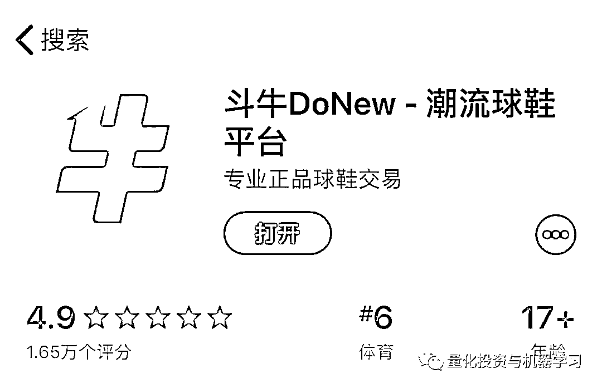

# 买鞋都要看 K 线，量化模型来看看！

> 原文：[`mp.weixin.qq.com/s?__biz=MzAxNTc0Mjg0Mg==&mid=2653294067&idx=1&sn=3be2f89d7bb027bd278a562bc3967e7b&chksm=802dcfe6b75a46f0391a855e2e6b4771b8f33848d0fa9c1b4a365ab7777f44769f86a96b5a42&scene=27#wechat_redirect`](http://mp.weixin.qq.com/s?__biz=MzAxNTc0Mjg0Mg==&mid=2653294067&idx=1&sn=3be2f89d7bb027bd278a562bc3967e7b&chksm=802dcfe6b75a46f0391a855e2e6b4771b8f33848d0fa9c1b4a365ab7777f44769f86a96b5a42&scene=27#wechat_redirect)

**标星★公众号     **爱你们♥

QIML 编辑部综合整理编写

**近期原创文章：**

♥ [5 种机器学习算法在预测股价的应用（代码+数据）](https://mp.weixin.qq.com/s?__biz=MzAxNTc0Mjg0Mg==&mid=2653290588&idx=1&sn=1d0409ad212ea8627e5d5cedf61953ac&chksm=802dc249b75a4b5fa245433320a4cc9da1a2cceb22df6fb1a28e5b94ff038319ae4e7ec6941f&token=1298662931&lang=zh_CN&scene=21#wechat_redirect)

♥ [Two Sigma 用新闻来预测股价走势，带你吊打 Kaggle](https://mp.weixin.qq.com/s?__biz=MzAxNTc0Mjg0Mg==&mid=2653290456&idx=1&sn=b8d2d8febc599742e43ea48e3c249323&chksm=802e3dcdb759b4db9279c689202101b6b154fb118a1c1be12b52e522e1a1d7944858dbd6637e&token=1330520237&lang=zh_CN&scene=21#wechat_redirect)

♥ 2 万字干货：[利用深度学习最新前沿预测股价走势](https://mp.weixin.qq.com/s?__biz=MzAxNTc0Mjg0Mg==&mid=2653290080&idx=1&sn=06c50cefe78a7b24c64c4fdb9739c7f3&chksm=802e3c75b759b563c01495d16a638a56ac7305fc324ee4917fd76c648f670b7f7276826bdaa8&token=770078636&lang=zh_CN&scene=21#wechat_redirect)

♥ [机器学习在量化金融领域的误用！](http://mp.weixin.qq.com/s?__biz=MzAxNTc0Mjg0Mg==&mid=2653292984&idx=1&sn=3e7efe9fe9452c4a5492d2175b4159ef&chksm=802dcbadb75a42bbdce895c49070c3f552dc8c983afce5eeac5d7c25974b7753e670a0162c89&scene=21#wechat_redirect)

♥ [基于 RNN 和 LSTM 的股市预测方法](https://mp.weixin.qq.com/s?__biz=MzAxNTc0Mjg0Mg==&mid=2653290481&idx=1&sn=f7360ea8554cc4f86fcc71315176b093&chksm=802e3de4b759b4f2235a0aeabb6e76b3e101ff09b9a2aa6fa67e6e824fc4274f68f4ae51af95&token=1865137106&lang=zh_CN&scene=21#wechat_redirect)

♥ [如何鉴别那些用深度学习预测股价的花哨模型？](https://mp.weixin.qq.com/s?__biz=MzAxNTc0Mjg0Mg==&mid=2653290132&idx=1&sn=cbf1e2a4526e6e9305a6110c17063f46&chksm=802e3c81b759b597d3dd94b8008e150c90087567904a29c0c4b58d7be220a9ece2008956d5db&token=1266110554&lang=zh_CN&scene=21#wechat_redirect)

♥ [优化强化学习 Q-learning 算法进行股市](https://mp.weixin.qq.com/s?__biz=MzAxNTc0Mjg0Mg==&mid=2653290286&idx=1&sn=882d39a18018733b93c8c8eac385b515&chksm=802e3d3bb759b42d1fc849f96bf02ae87edf2eab01b0beecd9340112c7fb06b95cb2246d2429&token=1330520237&lang=zh_CN&scene=21#wechat_redirect)

♥ [WorldQuant 101 Alpha、国泰君安 191 Alpha](https://mp.weixin.qq.com/s?__biz=MzAxNTc0Mjg0Mg==&mid=2653290927&idx=1&sn=ecca60811da74967f33a00329a1fe66a&chksm=802dc3bab75a4aac2bb4ccff7010063cc08ef51d0bf3d2f71621cdd6adece11f28133a242a15&token=48775331&lang=zh_CN&scene=21#wechat_redirect)

♥ [基于回声状态网络预测股票价格（附代码）](https://mp.weixin.qq.com/s?__biz=MzAxNTc0Mjg0Mg==&mid=2653291171&idx=1&sn=485a35e564b45046ff5a07c42bba1743&chksm=802dc0b6b75a49a07e5b91c512c8575104f777b39d0e1d71cf11881502209dc399fd6f641fb1&token=48775331&lang=zh_CN&scene=21#wechat_redirect)

♥ [计量经济学应用投资失败的 7 个原因](https://mp.weixin.qq.com/s?__biz=MzAxNTc0Mjg0Mg==&mid=2653292186&idx=1&sn=87501434ae16f29afffec19a6884ee8d&chksm=802dc48fb75a4d99e0172bf484cdbf6aee86e36a95037847fd9f070cbe7144b4617c2d1b0644&token=48775331&lang=zh_CN&scene=21#wechat_redirect)

♥ [配对交易千千万，强化学习最 NB！（文档+代码）](http://mp.weixin.qq.com/s?__biz=MzAxNTc0Mjg0Mg==&mid=2653292915&idx=1&sn=13f4ddebcd209b082697a75544852608&chksm=802dcb66b75a4270ceb19fac90eb2a70dc05f5b6daa295a7d31401aaa8697bbb53f5ff7c05af&scene=21#wechat_redirect)

♥ [关于高盛在 Github 开源背后的真相！](https://mp.weixin.qq.com/s?__biz=MzAxNTc0Mjg0Mg==&mid=2653291594&idx=1&sn=7703403c5c537061994396e7e49e7ce5&chksm=802dc65fb75a4f49019cec951ac25d30ec7783738e9640ec108be95335597361c427258f5d5f&token=48775331&lang=zh_CN&scene=21#wechat_redirect)

♥ [新一代量化带货王诞生！Oh My God！](https://mp.weixin.qq.com/s?__biz=MzAxNTc0Mjg0Mg==&mid=2653291789&idx=1&sn=e31778d1b9372bc7aa6e57b82a69ec6e&chksm=802dc718b75a4e0ea4c022e70ea53f51c48d102ebf7e54993261619c36f24f3f9a5b63437e9e&token=48775331&lang=zh_CN&scene=21#wechat_redirect)

♥ [独家！关于定量/交易求职分享（附真实试题）](https://mp.weixin.qq.com/s?__biz=MzAxNTc0Mjg0Mg==&mid=2653291844&idx=1&sn=3fd8b57d32a0ebd43b17fa68ae954471&chksm=802dc751b75a4e4755fcbb0aa228355cebbbb6d34b292aa25b4f3fbd51013fcf7b17b91ddb71&token=48775331&lang=zh_CN&scene=21#wechat_redirect)

♥ [Quant 们的身份危机！](https://mp.weixin.qq.com/s?__biz=MzAxNTc0Mjg0Mg==&mid=2653291856&idx=1&sn=729b657ede2cb50c96e92193ab16102d&chksm=802dc745b75a4e53c5018cc1385214233ec4657a3479cd7193c95aaf65642f5f45fa0e465694&token=48775331&lang=zh_CN&scene=21#wechat_redirect)

♥ [拿起 Python，防御特朗普的 Twitter](https://mp.weixin.qq.com/s?__biz=MzAxNTc0Mjg0Mg==&mid=2653291977&idx=1&sn=01f146e9a88bf130ca1b479573e6d158&chksm=802dc7dcb75a4ecadfdbdace877ed948f56b72bc160952fd1e4bcde27260f823c999a65a0d6d&token=48775331&lang=zh_CN&scene=21#wechat_redirect)

♥ [AQR 最新研究 | 机器能“学习”金融吗？](http://mp.weixin.qq.com/s?__biz=MzAxNTc0Mjg0Mg==&mid=2653292710&idx=1&sn=e5e852de00159a96d5dcc92f349f5b58&chksm=802dcab3b75a43a5492bc98874684081eb5c5666aff32a36a0cdc144d74de0200cc0d997894f&scene=21#wechat_redirect)

**正文**

前天，被币圈的一则微博刷屏。如下：

*图片来自：微博

网友的回复也是道出了他们的心声：

*图片来自：微博

这是继国内六大交易所（上交所、深交所、大商所、中金所、上期所、郑商所）之后的**“鞋交所”**嘛

还有一位博主这么说（@TDEx-图灵衍生品交易所）：

**没想到国家基础金融普及的任务竟然被鞋圈完成了。只是参与买个鞋子，小朋友就能学会洗盘、反弹、阻力支撑线、K 线盘口基本知识、7x24H T+0 交易、炒“鞋券”，花呗加杠杆... 并且因为鞋价波动剧烈，还能短时间内体验年轻人的第一次割肉，第一次站岗。**

经过多方打听，我们找到了这个软件：

*图片来自：App Store

顺便给大家科普一下：2019 年 5 月球鞋垂直市场的 APP 平台有：

**毒、nice、识货、YOHO!BUY 有货**

其中毒 APP 的月活跃用户规模近 800 万。可以说如今的球鞋市场已然成了大众的新兴蓝海。

安装好 APP 后，我们看到了第一张图中球鞋买卖的 K 线图，给大家看一张满大街的 YEEZY（椰子）：

*图片来自：斗牛 DoNew APP

看这熟悉的走势图，是不是和我们平时常用的股票软件**如影随形，如诗如画**

*图片来自：Wind 金融终端 APP

**绝 了**

如果能拿到这个数据的接口，是不是我们可以进行球鞋的量化分析呢？

此时，应该需要各大技术分析高手的出现，**以下纯属娱乐。**  

**波浪理论**入场：

*图片来自：斗牛 DoNew APP

**三角突破**入场：

*图片来自：斗牛 DoNew APP

···

其实，球鞋市场和股票市场一样，也有庄家，也有游资。

下面这段采访来自**@潮人**：

**问：****庄家是如何进行操盘的？**

**答：**有资本进入，而且操盘方式手段与预估的合理（接近）。但像近期这种恶意操控球鞋市场，引发到了社会性现象，国家肯定会察觉到，并进行制止、调控，这种只能是短期行为。而且这种行为对消费者无益，逐渐使得兴趣变味，相当于劝退粉丝。球鞋市场是立足于文化交流，这样下去只会加速市场的消失。其核心其实与炒房、股票大同小异，**但球鞋的数量总是有限的，只要有大笔资金更容易操控市场**。

---

**问：**不同**量级庄家资金跨度区域**是多少？上限和下限，除了资金还有什么门槛。

**答：**大部分是在 6-7 位数，部分大老板有的能撺出 8-9 位数的资金盘。**除了资金之外最重要的是有对球鞋市场有深入了解的人才，还有就是有足够的货源**。

整理下来基本流程如下图所示：

*图片来自：潮人

这还不算完。该 APP 还有各大排行榜：

*图片来自：斗牛 DoNew APP

至此，从技术分析到数据统计，我们似乎有点跃跃欲试，有点想大展身手。股票市场量化我们玩的那么 6，球鞋市场那岂不是小意思。**只要拿到数据 API，发现 Alpha 不是梦！**

此时，应该需要各大量化高手的出现，**标题**都帮你们想好了。**以下纯属娱乐：**

**1、通过模式识别预测 YEEZY 走势**

**2、通过时间序列方法在 AJ1 买卖数据中寻找交易信号**

**3、通过 PCA、回归分析挖掘驱动球鞋市场价格变化的潜在因素**

**4、通过增强学习、遗传规划算法选择最优满天星价位的交易决策**

**5、通过 CNN 预测 Air Fear 未来买卖点**

**6、通过仓位管理、风险分析等方式，构建选鞋体系**

**7、基于桥水全天候的全球球鞋市场交易策略**

**8、中国版 Fama-French 三因子球鞋市场策略**

**9、基于 YEEZY 500 市场构建流动性、规模、动量 Barra 因子**

**10、基于海龟策略的全球球鞋市场库存管理模型**

但是，业内人士已经说了：

问：看到有报道写**操盘手有爬虫、数据分析脚本**，作为职业化的操盘团队，**是****否需要很高的技术门槛**？

答：**不需要太高的技术门槛**，需要的是你能表达自己的需求、对市场有足够的理解和眼光，其他技术层面的东西只要**一个技术对口的普通大学生都能****完成。**

---

问：**庄家如何判断在合适的时间节点选择买进卖出？**

答：没有说准确的节点，都是动态操作完成。对此会罗列风险、分析、实时监控，但**有些东西是无法量化的**，这时候就会**需要经验和直觉**。还有的会在 Instagram、公众号、微博等途径做一些数据的分析，通过扒取目标关键词的帖子数量，评论回复数量，以及点赞的数量判断一款鞋子在人们心中的接受度达到什么位置。

所以我们量化圈跃跃欲试的朋友们啊，洗洗睡吧，该干嘛干嘛吧！

**球鞋市场面临的问题**

华尔街见闻作者在知乎上总结到：**球鞋交易的本质是什么？**

**从目前的情况来看，依附于炒鞋类 APP 存在的球鞋交易市场，几乎就是一个存在于监管真空中的另类投资二级市场，甚至已经发展出了类似期货的衍生工具，具有价格潜在波动性高、平台方缺乏监管等风险。**

倒卖正品鞋赚取差价行为究竟是否合法，目前已经引起网友们广泛争论。有法律人士认为，《电商法》中所指的电子商务经营者，包括了个人代购和微商等群体，从法律角度来看，无论代购交易额大小，依托微信、电商平台等渠道进行代购活动的群体，都应该被纳入监管范围。

像一些起步晚的球鞋 APP，要想快速提升自己在业内的地位和影响力，是会使用一些这样的手段，而且这样还能缓解他们的现金紧张问题。因为相关的法例规定并未完善，加上平台本身的数据不准确，**像有的鞋款光单个平台上的交易量就达到了全球总货量的一半**。说到底现在这块还是无法监管。

毒 APP 的不合理之处在于其**较高的中间服务费**，知名球鞋博主 zettaranc 曾经在节目中以股市的印花税与毒 APP 的服务费做对比，

**股市：印花税是千分之一，并且是单项收费**

**毒 APP：服务费是百分之九，并且是双向收费**

这中间差了**90 倍**的中间费用。

下面这张图是斗牛 DoNew APP“预售券”的部分介绍。根据平台描述，每一张券都对应一件实物商品，但目前并没有相应的监管机构进行监管。

向买方收取的所谓“银行转账费用”高达 0.4%！

*图片来自：斗牛 DoNew APP

对比一下微信和支付宝：

**反思**

*图片来自：大侠区块链研究院 

**大侠区块链研究院**把 AJ 和 Yeezy 几个畅销的型号做了一个数据对比。鞋的价格为什么会居高不下，原因其实一目了然。**鞋基本都是进口，国内缺乏渠道购入，和产量限定，是导致价格上涨的主要因素**。也就是说，你在国外的专卖店或者国内授权的发售店面购买，都是按照发售价算，不过数量有限，货卖完了，自然而然供需关系就发生了变化，很多年轻人会选择高价购入。

我们从表格中可以看出，鞋的发售价格相同，款式和信号相似，但因颜色的差异，导致了市场供需关系的变化，越多的人喜欢一个色号，那么这个色号又是限量的，供不应求则导致了价格不断提升。而拿 Yeezy 的纯白色举例，这双也是阿迪达斯椰子爆款，不过在天猫旗舰店不定期会限量发售，在一二线城市的太古里也有充足的货源，所以这双鞋的价格一直不算贵。由此可见，通缩造成的价格上涨不光在比特币身上会呈现，在各种相同属性的产品当中都会呈现。

在经济学研究中，较早提出通货紧缩问题的是马克思，他在《资本论》中，多次分析到流通物品的膨胀和收缩问题。而在中国，通缩概念则更为提前，一句老话叫做：**物****以稀为贵**。

很多人高价买鞋是为了穿的，或者说如果 Yeezy 没那么贵，很可能不会引起流行和追捧，因为大多数小男生小女生是为了‘炫富’。今天引得大家关注和刷屏的主要原因是因为大家看到了炒鞋的 K 线和交易档位，认为很新奇，其中不乏舆论和调侃，所以炒鞋是一时兴起，其背后也是因为极少数炒家在逐利。

作为也喜爱球鞋的编辑部，下面这段话网友的评论也许代表了我们的心声：

**现在的球鞋市场正在经历一波一波的热潮，无论是联名款还是限量款，迟早都会有退潮的一天。****潮流这个东西被遗忘的速度是最快的，新鲜的事物永远会把你替代掉。****但这些非市售的球鞋不会，历史的瞬间永远是在那，球员的伟大铭刻在那。**

*—End—*

量化投资与机器学习微信公众号，是业内垂直于**Quant**、**MFE**、**CST、AI**等专业的**主****流量化自媒体**。公众号拥有来自**公募、私募、券商、银行、海外**等众多圈内**10W+**关注者。每日发布行业前沿研究成果和最新量化资讯。

你点的每个“在看”，我们都认真当成了喜欢