# 少儿编程行业会出现下一个新东方吗？

> 原文：[`mp.weixin.qq.com/s?__biz=MzAxNTc0Mjg0Mg==&mid=2653294056&idx=1&sn=cd6176b522979dedafbd8ac1e11e9290&chksm=802dcffdb75a46eb97034868a3c576e71e966ae0099acf99f9e1a481643bd48c2fd1c9bd5e8f&scene=27#wechat_redirect`](http://mp.weixin.qq.com/s?__biz=MzAxNTc0Mjg0Mg==&mid=2653294056&idx=1&sn=cd6176b522979dedafbd8ac1e11e9290&chksm=802dcffdb75a46eb97034868a3c576e71e966ae0099acf99f9e1a481643bd48c2fd1c9bd5e8f&scene=27#wechat_redirect)

**标星★公众号     **爱你们♥

作者：寿元呈、周颖

编译：彬复资本 | beforcapital

**近期原创文章：**  

♥ [5 种机器学习算法在预测股价的应用（代码+数据）](https://mp.weixin.qq.com/s?__biz=MzAxNTc0Mjg0Mg==&mid=2653290588&idx=1&sn=1d0409ad212ea8627e5d5cedf61953ac&chksm=802dc249b75a4b5fa245433320a4cc9da1a2cceb22df6fb1a28e5b94ff038319ae4e7ec6941f&token=1298662931&lang=zh_CN&scene=21#wechat_redirect)

♥ [Two Sigma 用新闻来预测股价走势，带你吊打 Kaggle](https://mp.weixin.qq.com/s?__biz=MzAxNTc0Mjg0Mg==&mid=2653290456&idx=1&sn=b8d2d8febc599742e43ea48e3c249323&chksm=802e3dcdb759b4db9279c689202101b6b154fb118a1c1be12b52e522e1a1d7944858dbd6637e&token=1330520237&lang=zh_CN&scene=21#wechat_redirect)

♥ 2 万字干货：[利用深度学习最新前沿预测股价走势](https://mp.weixin.qq.com/s?__biz=MzAxNTc0Mjg0Mg==&mid=2653290080&idx=1&sn=06c50cefe78a7b24c64c4fdb9739c7f3&chksm=802e3c75b759b563c01495d16a638a56ac7305fc324ee4917fd76c648f670b7f7276826bdaa8&token=770078636&lang=zh_CN&scene=21#wechat_redirect)

♥ [机器学习在量化金融领域的误用！](http://mp.weixin.qq.com/s?__biz=MzAxNTc0Mjg0Mg==&mid=2653292984&idx=1&sn=3e7efe9fe9452c4a5492d2175b4159ef&chksm=802dcbadb75a42bbdce895c49070c3f552dc8c983afce5eeac5d7c25974b7753e670a0162c89&scene=21#wechat_redirect)

♥ [基于 RNN 和 LSTM 的股市预测方法](https://mp.weixin.qq.com/s?__biz=MzAxNTc0Mjg0Mg==&mid=2653290481&idx=1&sn=f7360ea8554cc4f86fcc71315176b093&chksm=802e3de4b759b4f2235a0aeabb6e76b3e101ff09b9a2aa6fa67e6e824fc4274f68f4ae51af95&token=1865137106&lang=zh_CN&scene=21#wechat_redirect)

♥ [如何鉴别那些用深度学习预测股价的花哨模型？](https://mp.weixin.qq.com/s?__biz=MzAxNTc0Mjg0Mg==&mid=2653290132&idx=1&sn=cbf1e2a4526e6e9305a6110c17063f46&chksm=802e3c81b759b597d3dd94b8008e150c90087567904a29c0c4b58d7be220a9ece2008956d5db&token=1266110554&lang=zh_CN&scene=21#wechat_redirect)

♥ [优化强化学习 Q-learning 算法进行股市](https://mp.weixin.qq.com/s?__biz=MzAxNTc0Mjg0Mg==&mid=2653290286&idx=1&sn=882d39a18018733b93c8c8eac385b515&chksm=802e3d3bb759b42d1fc849f96bf02ae87edf2eab01b0beecd9340112c7fb06b95cb2246d2429&token=1330520237&lang=zh_CN&scene=21#wechat_redirect)

♥ [WorldQuant 101 Alpha、国泰君安 191 Alpha](https://mp.weixin.qq.com/s?__biz=MzAxNTc0Mjg0Mg==&mid=2653290927&idx=1&sn=ecca60811da74967f33a00329a1fe66a&chksm=802dc3bab75a4aac2bb4ccff7010063cc08ef51d0bf3d2f71621cdd6adece11f28133a242a15&token=48775331&lang=zh_CN&scene=21#wechat_redirect)

♥ [基于回声状态网络预测股票价格（附代码）](https://mp.weixin.qq.com/s?__biz=MzAxNTc0Mjg0Mg==&mid=2653291171&idx=1&sn=485a35e564b45046ff5a07c42bba1743&chksm=802dc0b6b75a49a07e5b91c512c8575104f777b39d0e1d71cf11881502209dc399fd6f641fb1&token=48775331&lang=zh_CN&scene=21#wechat_redirect)

♥ [计量经济学应用投资失败的 7 个原因](https://mp.weixin.qq.com/s?__biz=MzAxNTc0Mjg0Mg==&mid=2653292186&idx=1&sn=87501434ae16f29afffec19a6884ee8d&chksm=802dc48fb75a4d99e0172bf484cdbf6aee86e36a95037847fd9f070cbe7144b4617c2d1b0644&token=48775331&lang=zh_CN&scene=21#wechat_redirect)

♥ [配对交易千千万，强化学习最 NB！（文档+代码）](http://mp.weixin.qq.com/s?__biz=MzAxNTc0Mjg0Mg==&mid=2653292915&idx=1&sn=13f4ddebcd209b082697a75544852608&chksm=802dcb66b75a4270ceb19fac90eb2a70dc05f5b6daa295a7d31401aaa8697bbb53f5ff7c05af&scene=21#wechat_redirect)

♥ [关于高盛在 Github 开源背后的真相！](https://mp.weixin.qq.com/s?__biz=MzAxNTc0Mjg0Mg==&mid=2653291594&idx=1&sn=7703403c5c537061994396e7e49e7ce5&chksm=802dc65fb75a4f49019cec951ac25d30ec7783738e9640ec108be95335597361c427258f5d5f&token=48775331&lang=zh_CN&scene=21#wechat_redirect)

♥ [新一代量化带货王诞生！Oh My God！](https://mp.weixin.qq.com/s?__biz=MzAxNTc0Mjg0Mg==&mid=2653291789&idx=1&sn=e31778d1b9372bc7aa6e57b82a69ec6e&chksm=802dc718b75a4e0ea4c022e70ea53f51c48d102ebf7e54993261619c36f24f3f9a5b63437e9e&token=48775331&lang=zh_CN&scene=21#wechat_redirect)

♥ [独家！关于定量/交易求职分享（附真实试题）](https://mp.weixin.qq.com/s?__biz=MzAxNTc0Mjg0Mg==&mid=2653291844&idx=1&sn=3fd8b57d32a0ebd43b17fa68ae954471&chksm=802dc751b75a4e4755fcbb0aa228355cebbbb6d34b292aa25b4f3fbd51013fcf7b17b91ddb71&token=48775331&lang=zh_CN&scene=21#wechat_redirect)

♥ [Quant 们的身份危机！](https://mp.weixin.qq.com/s?__biz=MzAxNTc0Mjg0Mg==&mid=2653291856&idx=1&sn=729b657ede2cb50c96e92193ab16102d&chksm=802dc745b75a4e53c5018cc1385214233ec4657a3479cd7193c95aaf65642f5f45fa0e465694&token=48775331&lang=zh_CN&scene=21#wechat_redirect)

♥ [拿起 Python，防御特朗普的 Twitter](https://mp.weixin.qq.com/s?__biz=MzAxNTc0Mjg0Mg==&mid=2653291977&idx=1&sn=01f146e9a88bf130ca1b479573e6d158&chksm=802dc7dcb75a4ecadfdbdace877ed948f56b72bc160952fd1e4bcde27260f823c999a65a0d6d&token=48775331&lang=zh_CN&scene=21#wechat_redirect)

♥ [AQR 最新研究 | 机器能“学习”金融吗？](http://mp.weixin.qq.com/s?__biz=MzAxNTc0Mjg0Mg==&mid=2653292710&idx=1&sn=e5e852de00159a96d5dcc92f349f5b58&chksm=802dcab3b75a43a5492bc98874684081eb5c5666aff32a36a0cdc144d74de0200cc0d997894f&scene=21#wechat_redirect)

**前言**在少儿编程行业的的发展初期，不同商业模式各有优劣和侧重点，归根结底是瞄准了行业不同的内在驱动力。我们更看好针对“升学抓手”需求的线下培训类商业模式，和针对“素质教育”需求的线上轻课类商业模式。
近年来，少儿编程行业的发展已成为教育行业的一大热门话题，在外部驱动力的推动下，新老玩家纷至沓来，将整体市场供给量快速提升到较高水平。但盛名之下，需方市场的体量究竟如何，需方的诉求点具体在哪落脚，我们认为这些内在驱动力更加决定了少儿编程行业的发展潜力和发展速度。我们通过走访数十位行业代表创业者，深度调研产品和公司商业模式，并完成近千位用户问卷调查，试对少儿编程行业发展的内在驱动力做一些思考和讨论，与大家一起分享。少儿编程教育是基于 Scratch、 Python、 C++等编程语言给学生搭建可视化图形编程平台和代码编程学习平台等， 通过编程游戏、网页、 动画、 音乐等来学习编程语言，主要采用“图形-代码-算法”阶段式的编程教育体系。少儿编程教育与成人编程教育有较大区别，主要针对 K12 阶段青少儿通过寓教于乐的方式来学习编程语言。近年来少儿编程行业蓬勃发展，离不开以下 4 方面的外部驱动力影响：1、少儿编程教育行业发展受到政策红利的积极影响；2、居民可支配收入增长促进教育类消费投入；3、随着我国技术创新，产业结构不断升级，人工智能时代对人才提出新的需求，一定程度上提升了大众对编程教育的认知；4、信息技术的发展为编程教育的推广提供了更多更高效率的技术工具，使得少儿编程教育的推广普及在技术上更加成熟。我们认为，我国少儿编程教育的快速发展一方面得益于以上的外部驱动力推动，但探究其深层原因，更在于用户端需求不断更新发展所产生的内在驱动力推动。**PART 1：课内学科类科目补习需求****真正意义上的课内学科类科目需要满足两个条件：课内要教，高考要考。近年来一系列的政策红利，正在逐步加强编程教育在信息技术科目中的地位。****课内要教：**从近年来政策的落脚点可以感受到，课内编程教育的推广力度逐步加大，**一方面更加具象化落地**（从加强课内信息学科落地，到点名加强编程教育落地），**一方面更加低龄化落地**（从高中普及到小学普及）。**高考要考：**2017 年浙江省首次将信息技术（技术科目，含信息技术与通用技术）加入选考科目，并将编程内容加入考察范围。目前涉及编程的考试内容主要为 VB 语言，后续 2019、2020 届高考仍主要考察 VB 语言。**浙江新高考实行三年来，技术选考报名人数逐年上升，2019 届达到约 10 万人，占总报名人数的 40% 。**表 1：2017～2019 届浙江省高考考生选考科目人次数统计（单位：万人次）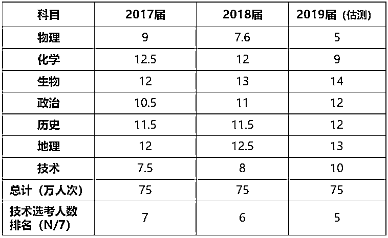*资料来源：**《中国高教研究》2018 年第 10 期第 25-30 页；**作者冯成火，浙江省教育考试院副院长、研究员，彬复整理***编程教育作为必学、必考的学科科目内容趋势已基本确定，但学科有强弱，编程所在的信息技术学科地位究竟如何**，这里我们将该学科与传统语数外强学科外的物理学科做了比较，而最直观量化的比较场景就是高考：高考报考专业对选考科目（语数外以外的 7 门科目）的限制。此处我们以浙江高考场景进行分析。**从各选考科目必选可报专业数来看，物理科目与其他选考科目拉开了数量级的差距，而技术科目与史地生等科目处在同一水平**。浙江省 2018～2020 届高校对物理单学科的选考要求大幅增加，2020 届要求必须选考物理的专业同比增长 3 倍超 6 千门，占当年浙江省总专业数量的 22%，见物理学科不断提高的重要性；要求必选技术的专业数量仍相对较少，与史地生等科目处在同一水平。表 2：2018～2020 届浙江省高考限制单一科目的专业数量（单限 1 门，单位：专业数）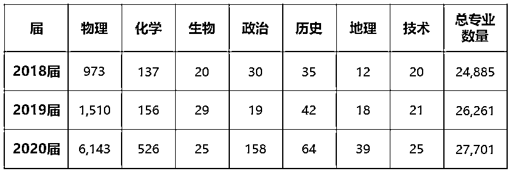资料来源：浙江省教育考试网，彬复整理注：限制单一科目，即意味着报考该专业必须选考该科目，以 2018 届物理学科为例，有 973 个专业必须选考物理从各选考科目可选可报总专业数来看，选考物理科目适用性最广，而技术科目排名靠后。浙江省 2020 届选考物理可报 91.26%的专业，覆盖范围最广；选考技术可报考近 60%的专业，在 7 门选考科目中排名较第 6 与末位接近。表 3：2020 届在浙招生高校专业对选考科目的限制情况（单位：专业数）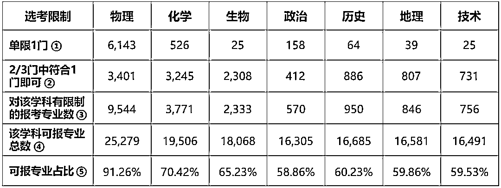资料来源：浙江省教育考试网注：①：报考该专业必须选考的学科，以物理为例，6143 门专业必须选考物理②：报考该专业必须在给定的 2 或 3 门学科中选考一门，以物理为例，3401 门专业需要选考的 2-3 学科范围中包含物理学科③：①+②=③，即对该学科有限制的报考专业数，以物理为例，9544 个专业设置了对物理学科的选考科目限制④：③+15735=④，2020 届共 15735 个专业不设置任何选考科目限制；以物理为例，选考物理共可报考 25279 个专业⑤：④/27701=⑤，2020 届在浙江招生的专业共有 27701 个从短期来看，当前高考中技术科目（含信息技术）可选专业较少，一定程度上受到该学科普及推广时间较短，试行高考科目时间较短的影响。从长期来看，我们认为该科目的重要性会有所提高，但可能较难超过物理科目在理科基础教育中的地位。此外，在新高考改革中最近一批省份所采取的“3+1+2”模式来看，物理在选考科目中的定位在未来更难撼动。表 4：2018 年拟在浙招生普通高校专业（类）“电子信息类”专业选考科目范围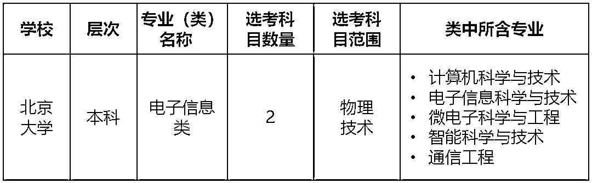资料来源：浙江省教育考试网，彬复整理注：即便是信息类专业，物理仍作为与技术科目并列的选考科目我们认为，信息技术科目作为技术科目中的组成部分，一定时期内在高考中的地位远不能同语数外等主科相比，并仍较大程度低于物理这个传统理科选考科目，与史地政生等科目处在同一水平。**编程作为该科目的组成部分，长期性的课外补习需求相对较弱，未来存在一定的短期突击补习需求，是少儿编程行业发展较弱的一个内在驱动力。**虽然编程教育作为课内科目的补习需求较弱，但藉由其“课内要教，高考要考”在基础教育层面的普及，为其成为新的“升学抓手”奠定了良好的基础。**PART 2 ：升学“抓手”需求**何谓“升学抓手”？我们将升学抓手定义为“在小升初、中考、高考过程中除统一标准化考试外有利于升学的加分项”，例如在高考中凭借全国中学生数学奥林匹克竞赛奖项获取高校保送资格。此处我们以上海市为场景进行分析。“升学抓手”几乎年年在变。以全面禁止统一考试的小升初为例，在过去十年中才艺特长，奥数等“升学抓手”轮番上场下场，城头变幻大王旗。变化的原因在于教育政策、供方（即校方，升学招生方）、需方（即学生/家长，升学方）三者间不断博弈。**我们认为，我国体制内 K12 教育体系中，政策决定供给，供给决定需求，而当需求发展扭曲时又直接影响政策，三者间不断博弈。****所以要讨论“升学抓手”的变化，首先要讨论政策的变化。****政策端**

1、长期以来“分层教育” 是我国体制内 K12 教育的核心根基。

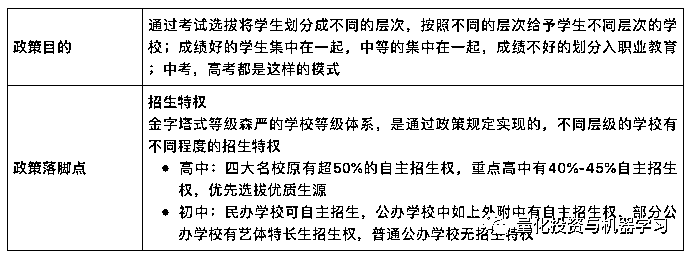

2、近年来“减负教育”的力度逐步加大，对“分层教育”的传统政策不断挑战。

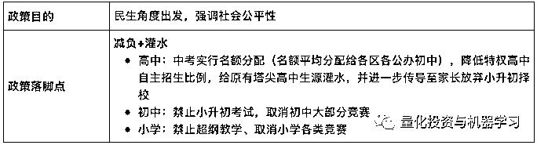

3、“分类教育” 是调和“分层教育”和“教育减负” 间的桥梁，通过加强学生综合素质评价在中高考的影响力，引导我国体制内 K12 教育从“分层”走向“分类”。

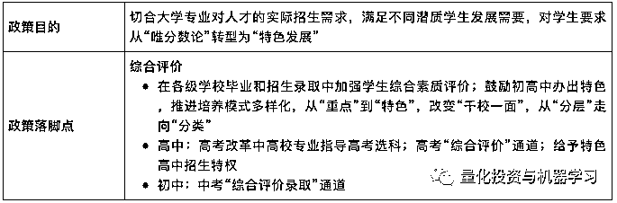这三类教育政策思想不断博弈，实际影响首先体现在供给方层面。**供给端**1、“分层教育” 对供给方（学校）的核心是生源优先选拔的抓手，通过给予学校不同等级的生源优先选拔的抓手，决定了学校在分层体系中的不同级别。所以在“分层教育”理念下，生源决定了学校的强弱，是否拥有、拥有多少生源的自主优先选拔权决定了学校的强弱；而生源自主优先选拔需要有尽可能标准化的选拔手段，抓手。供给方原有的生源自主优先选拔抓手：2、在“减负教育”政策影响下，首先受到直接影响的就是供给端的生源自主优先选拔抓手：

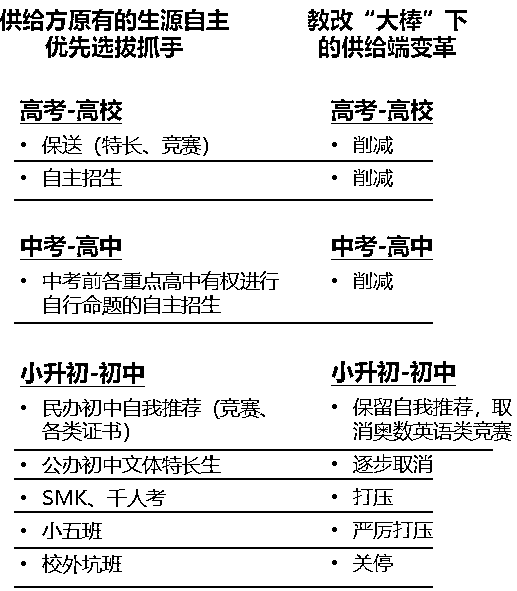

我们认为，虽然“分层教育”属性未来将被逐步调和，但其根基仍将渗透于我国教育体制内，且调和手段“分类教育”同样需要抓手，所以供给方将尽可能利用“分类教育”的落脚点寻找新的抓手。**我们认为，未来供给方在中高考阶段将尽可能依靠“综合评价”为切入口，在小升初阶段将尽可能依靠自我推荐环节，选取更有利于自己的新抓手。**

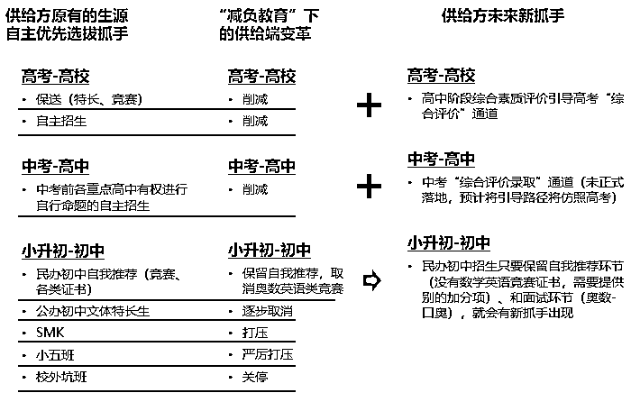

**需求端**

在教改影响下，当供给端发展出新的生源选拔抓手，则需求端相应发展出新的教育需求。**我们认为，目前需求端的新需求将主要集中于小升初的新抓手，和中高考的“综合评价”。**

**小升初：**

自我推荐：简历中的加分项，竞赛的替代品，增强“偷跑”竞争力

校长推荐：小学内部选拔加分项

面试：部分口头考试

**中考：**

综合评价录取（具体操作办法待颁布，预计参考高考中综合素质评价引导的综合评价办法）。

综评最终成绩=中考满分 750 分+综合评价满分 50 分+政策加分。

**高考：**

高中期间学生综合素质评价引导的综合评价。

综评面试(校测)由高校自主举办，多采取面试的形式，在高考出分后，普通批志愿填报前进行（类似浙江“三位一体”）。

综评最终成绩=60%的高考总分+30%的学校面试成绩+10%的高中学业水平考试成绩。

就上海市高考改革试验而言，**综合评价**是未来重点高校的首要录取通道，2018 年复交两校上海地区综评计划数占其上海招生计划的 90%，且开放综合评价的高校数逐步增加。

表 5：2018 年上海市高考开放综评录取高校招生计划（单位：人数）

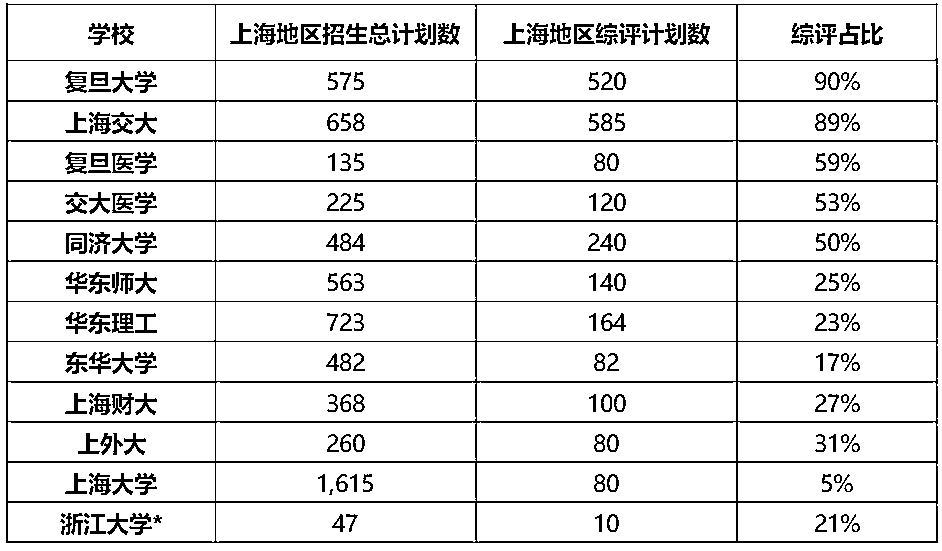资料来源：彬复整理    *注：2018 年新增院校

**综合评价**考试由学生在校期间**综合素质评价**所引导，需求端要抓综合评价抓手，则必须从综合素质评价入手；从上海高考综合素质评价考核内容来看，**“创新精神与实践能力”**项是需求端更易出成果，更“趁手”的新抓手。

以上海市高考综合评价考试流程为例，高中三年间学生记录其综合素质评价情况；高考后学生自愿填报高校综评志愿，高校根据高中三年间学生综合素质评价记录状况进行相应校测，最后以综评考试成绩加权高考成绩、学业水平考试成绩进行录取。

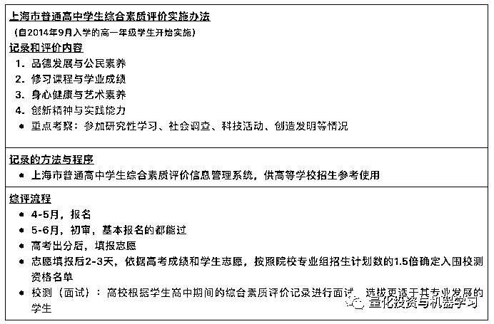

中考综评框架基本沿用高考综评框架，虽然具体实施细则未颁布，依据自上而下原理较多可能参考高中综合素质评价制度，“创新精神与实践能力”项也有较大可能成为更“趁手”的新抓手。

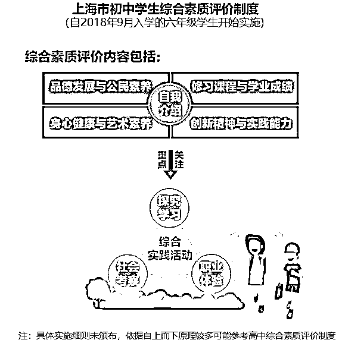

资料来源：《上海市普通高中学生综合素质评价实施办法》，《上海市进一步推进高中阶段学校考试招生制度改革实施意见》

**在全面禁止小学、初中学科类竞赛的背景下，“科技创新”类竞赛、活动成为了小升初、中高考综评“创新精神与实践能力”项目中脱颖而出的抓手，编程在该类竞赛和活动中具有较强的普适性。**

在《教育部办公厅关于公布 2019 年度面向中小学生的全国性竞赛活动的通知》中，直接将 2019 年度面向中小学生的 29 项全国性竞赛活动分为了“科技创新类”、“学科类”、“艺术体育类”三大类竞赛，其中“科技创新类”竞赛在 29 项中占 12 项，其中可适用编程的 10 项；此外“学科类”竞赛中编程占据 NOIP。

小学生、初中生目前能参加的全国性竞赛只有“科技创新类”和“艺术体育类”赛事，前者占据重头且大部分均适用编程。

**除前述全国性竞赛外，全国及各地区编程类“准赛事型”活动借助其科技创新类元素外壳，规避学科类竞赛红线，有较大潜力成为小学和初中阶段“奥赛”类活动的替代抓手。**

各地区部分少儿编程活动示例：

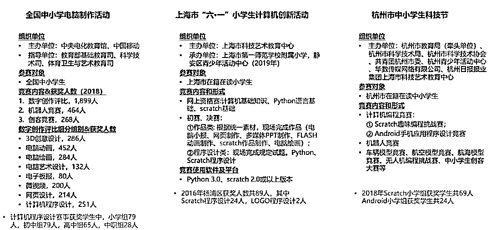

资料来源：中央电化教育馆网站、上海学生活动网、杭州市中小学生科技节网、杨浦区青少年信息科技活动资讯网

作为高中阶段全国性学科类竞赛的最大出口，信息学奥林匹克竞赛（NOIP）获奖学生数逐年快速增长，整体获奖规模远超其他同等级学科类竞赛，参赛学生数保持快速增长，是高校提前选拔（自招及综评）的有力抓手，为编程教育提供了有力的上升通道。

2018 年 NOIP 提高组参赛学生 9.24 万人，进入复赛学生 1.28 万人，最终获奖 8044 人，获奖率 62.4%，远超同类赛事；历年来整体获奖人数保持稳定增长。此处仅统计提高组情况，尚未讨论普及组情况。

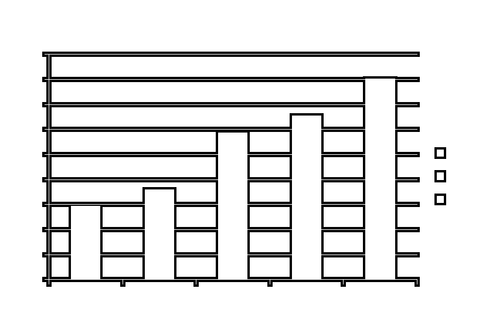

信息学奥林匹克竞赛获奖学生数规模远超其他同等级学科类竞赛。

表 6：2014-2018 年全国中学生信息学奥林匹克竞赛获奖人数统计 & 2018 年各理科学科类全国中学生奥林匹克竞赛获奖人数统计（单位：人数）

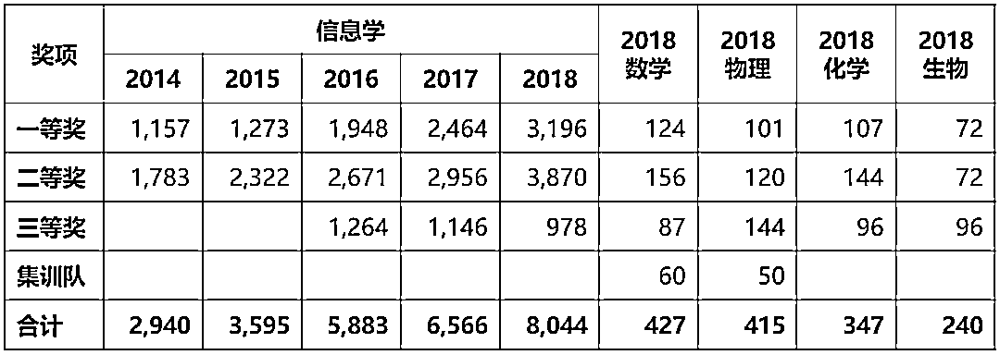资料来源：各学科奥林匹克竞赛协会网站，彬复整理

**综上所述我们认为，在编程教育普及进入基础教育的基础上，在教育政策、供给端、需求端三者不断博弈的过程中，少儿编程教育正在成为未来需求端新的“升学抓手”，是少儿编程行业发展较大的内在驱动力**。

**PART 3：素质教育需求**

我们认为，素质教育需求下的能力培养是现阶段少儿编程教育最根本的内在驱动力，所以少儿编程教育表现出更强的素质教育特征，是一项带有较强刚需出口潜力的素质教育品类。

编程课的学习，使孩子的逻辑思维、数学理解、英语兴趣、严谨理念、解决问题能力、动手能力和创造力都会有不同程度的提高，以期提升个人未来竞争力。

编程教育不只是让孩子拥有编程的能力，而是通过编程的学习提升数字素养，培养信息意识，形成学科融合的能力；编程化计算思维的建立，为解决实际问题提供更富逻辑化的思路，最终能够实现技术创新，并且能够体验技术实践。

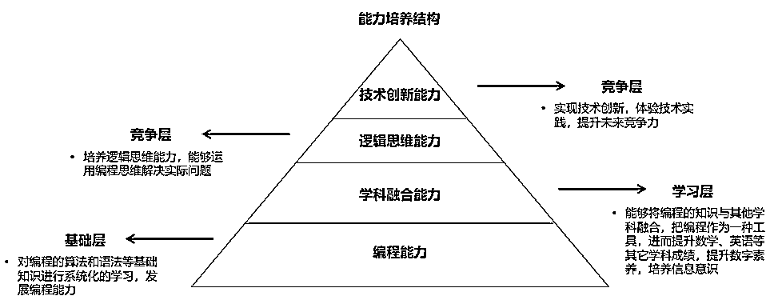

资料来源：亿欧智库《2018 中国少儿编程教育行业研究报告》，彬复整理

我们认为，目前以素质教育角度切入少儿编程教育的整体需求端市场仍在早期逐渐培育过程中。

对此我们进行了调查问卷统计，以了解家长从素质教育角度对少儿编程教育的认知和接受程度，帮助判断现阶段的市场需求。最终有效问卷回收 950 份，调查对象以小学生家长为主，学生男女比例均衡；地域分布上近 90%来自上海。

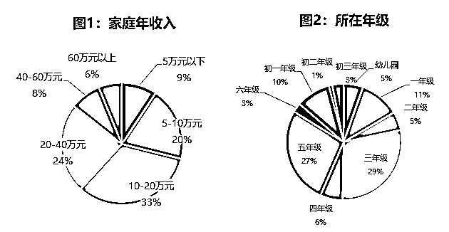

从问卷结果中可以看到，传统素质教育科目仍是家长首选；在家长需求的优先级排序中，英语培训、思维培训和体育名列前三。包含少儿编程的 STEM 类课程目前还不是家长的首选考虑。

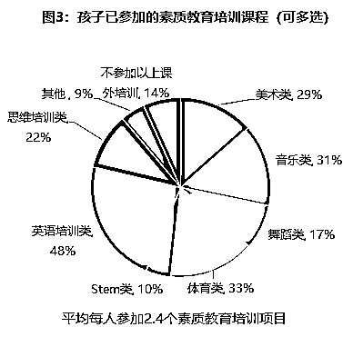

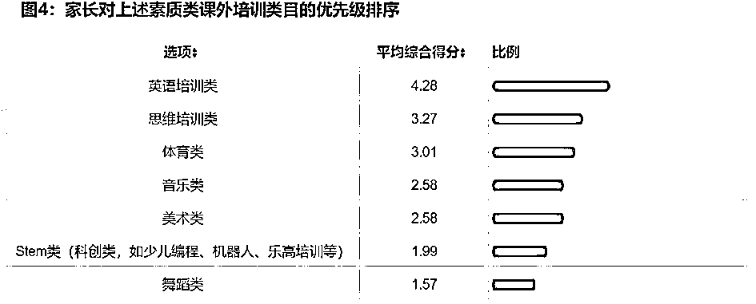

师资水平、离家距离、口碑是家长选择机构最优先考虑的三个因素。

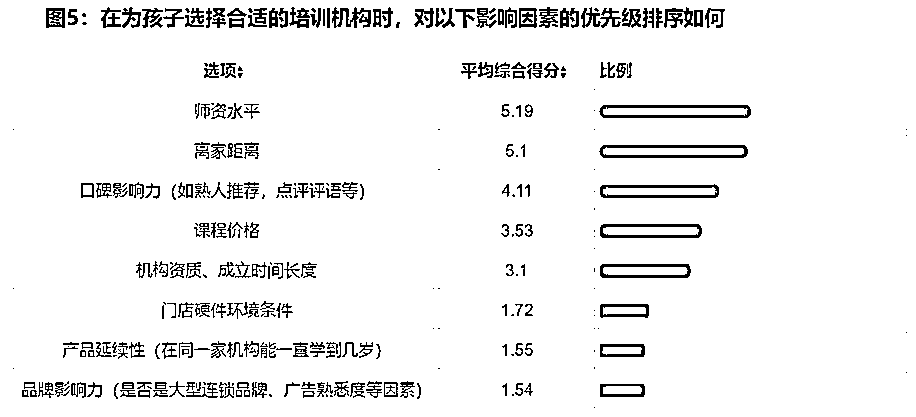

现阶段 STEM 教育在素质教育培训品类中的优先级较低，但少儿编程是 STEM 中可优先考虑的品类。

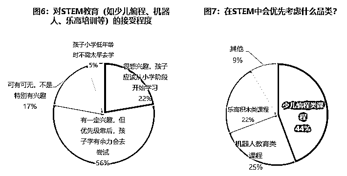

从此处问卷调查统计来看，现阶段少儿编程仍处在早期市场培育阶段，家长的认知不足，较多对少儿编程教什么、有没有标准、学了有什么用感到困惑。

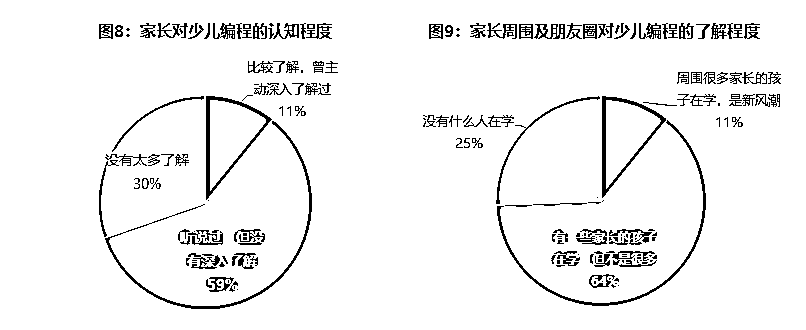

家长普遍较认可学习编程对逻辑思维能力的训练，对培训形式没有明显的偏好。

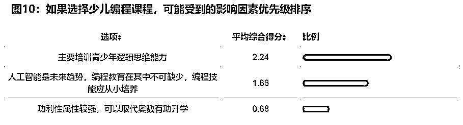

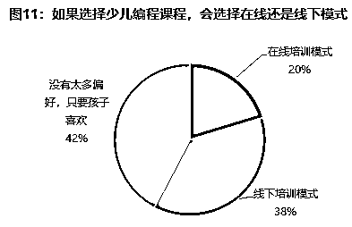

**综上所述我们认为，目前以素质教育角度切入少儿编程教育的需求端市场仍在早期逐渐培育过程中，需求端对少儿编程教育的素质教育意识逐步觉醒，一定时间内是少儿编程行业发展根本的内在驱动力。**

最后，对少儿编程教育发展的 3 大类内在驱动力做一个总结：

1、编程教育作为课内学科类科目的长期补习需求相对较弱，较难与传统 K12 科目补习需求相比，是少儿编程行业发展较弱的一个内在驱动力；

2、少儿编程教育正在成为未来需求端新的“升学抓手”，是少儿编程行业发展较大的内在驱动力；

3、素质教育需求下的能力培养是现阶段少儿编程教育最根本的内在驱动力，目前整体需求端市场仍在早期逐渐培育过程中。

在目前少儿编程行业的发展初期，不同的商业模式各有优劣和侧重点，**归根结底是瞄准了行业不同的内在驱动力**，这使得不同公司在发展初期决定了各自不同的用户定位、流量获取策略、销售策略、商业变现策略；未来不同商业模式有融合可能性，以平台形式展现。

表 7：少儿编程行业主要商业模

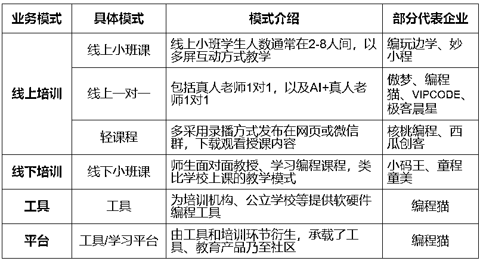

料来源：鲸准研究院《2018 年中国少儿编程教育创投及行业研究报告》

针对第 1 类内在驱动力，我们现阶段更看好工具类、平台类商业模式；

针对第 2 类内在驱动力，我们现阶段更看好线下培训类商业模式，以更区域化、接地气、强互动的方式为用户提供更有效的“升学抓手”；

针对第 3 类内在驱动力，我们现阶段更看好线上轻课程的商业模式，以较低的成本导流逐步觉醒的素质教育需求用户；线上小班课、一对一以及线下小班课模式同样可以此类轻课作为主课的前端导流转化型产品。

**无论何种商业模式，都必须紧紧把握少儿编程行业本身的内在驱动力，深刻理解政策端、供给端和需求端各自的着眼点和变化趋势，并将其直接反映在产品设计、供应链设计和销售方式上，回归教育本质，构建可盈利可标准化复制的商业模型。****未来更可以此为支点整合广阔的素质教育需求和相关品类，也许离下一个“新东方”、“学而思”就能更近一步了。**

*—End—*

量化投资与机器学习微信公众号，是业内垂直于**Quant**、**MFE**、**CST、AI**等专业的**主****流量化自媒体**。公众号拥有来自**公募、私募、券商、银行、海外**等众多圈内**10W+**关注者。每日发布行业前沿研究成果和最新量化资讯。

你点的每个“在看”，我们都认真当成了喜欢