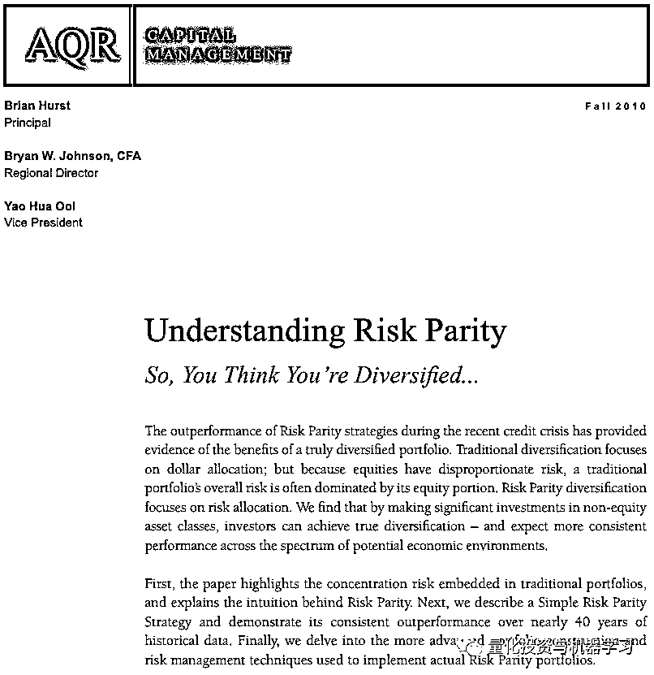
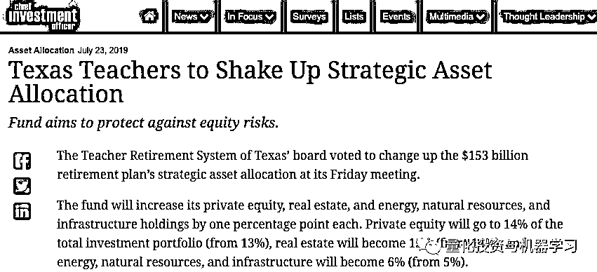

# 风险平价这 10 年！

> 原文：[`mp.weixin.qq.com/s?__biz=MzAxNTc0Mjg0Mg==&mid=2653294049&idx=1&sn=3146f52658cd1e593614c9142d1d5a02&chksm=802dcff4b75a46e21df1f01fc21fa5f8c1db099816dcfe457f0a9670e8c0a5669d4757cb83e1&scene=27#wechat_redirect`](http://mp.weixin.qq.com/s?__biz=MzAxNTc0Mjg0Mg==&mid=2653294049&idx=1&sn=3146f52658cd1e593614c9142d1d5a02&chksm=802dcff4b75a46e21df1f01fc21fa5f8c1db099816dcfe457f0a9670e8c0a5669d4757cb83e1&scene=27#wechat_redirect)

**标星★公众号     **爱你们♥

作者：Mike Fernandez

编译：1+1=6

**近期原创文章：**

## ♥ [5 种机器学习算法在预测股价的应用（代码+数据）](https://mp.weixin.qq.com/s?__biz=MzAxNTc0Mjg0Mg==&mid=2653290588&idx=1&sn=1d0409ad212ea8627e5d5cedf61953ac&chksm=802dc249b75a4b5fa245433320a4cc9da1a2cceb22df6fb1a28e5b94ff038319ae4e7ec6941f&token=1298662931&lang=zh_CN&scene=21#wechat_redirect)

## ♥ [Two Sigma 用新闻来预测股价走势，带你吊打 Kaggle](https://mp.weixin.qq.com/s?__biz=MzAxNTc0Mjg0Mg==&mid=2653290456&idx=1&sn=b8d2d8febc599742e43ea48e3c249323&chksm=802e3dcdb759b4db9279c689202101b6b154fb118a1c1be12b52e522e1a1d7944858dbd6637e&token=1330520237&lang=zh_CN&scene=21#wechat_redirect)

## ♥ 2 万字干货：[利用深度学习最新前沿预测股价走势](https://mp.weixin.qq.com/s?__biz=MzAxNTc0Mjg0Mg==&mid=2653290080&idx=1&sn=06c50cefe78a7b24c64c4fdb9739c7f3&chksm=802e3c75b759b563c01495d16a638a56ac7305fc324ee4917fd76c648f670b7f7276826bdaa8&token=770078636&lang=zh_CN&scene=21#wechat_redirect)

## ♥ [机器学习在量化金融领域的误用！](http://mp.weixin.qq.com/s?__biz=MzAxNTc0Mjg0Mg==&mid=2653292984&idx=1&sn=3e7efe9fe9452c4a5492d2175b4159ef&chksm=802dcbadb75a42bbdce895c49070c3f552dc8c983afce5eeac5d7c25974b7753e670a0162c89&scene=21#wechat_redirect)

## ♥ [基于 RNN 和 LSTM 的股市预测方法](https://mp.weixin.qq.com/s?__biz=MzAxNTc0Mjg0Mg==&mid=2653290481&idx=1&sn=f7360ea8554cc4f86fcc71315176b093&chksm=802e3de4b759b4f2235a0aeabb6e76b3e101ff09b9a2aa6fa67e6e824fc4274f68f4ae51af95&token=1865137106&lang=zh_CN&scene=21#wechat_redirect)

## ♥ [如何鉴别那些用深度学习预测股价的花哨模型？](https://mp.weixin.qq.com/s?__biz=MzAxNTc0Mjg0Mg==&mid=2653290132&idx=1&sn=cbf1e2a4526e6e9305a6110c17063f46&chksm=802e3c81b759b597d3dd94b8008e150c90087567904a29c0c4b58d7be220a9ece2008956d5db&token=1266110554&lang=zh_CN&scene=21#wechat_redirect)

## ♥ [优化强化学习 Q-learning 算法进行股市](https://mp.weixin.qq.com/s?__biz=MzAxNTc0Mjg0Mg==&mid=2653290286&idx=1&sn=882d39a18018733b93c8c8eac385b515&chksm=802e3d3bb759b42d1fc849f96bf02ae87edf2eab01b0beecd9340112c7fb06b95cb2246d2429&token=1330520237&lang=zh_CN&scene=21#wechat_redirect)

## ♥ [WorldQuant 101 Alpha、国泰君安 191 Alpha](https://mp.weixin.qq.com/s?__biz=MzAxNTc0Mjg0Mg==&mid=2653290927&idx=1&sn=ecca60811da74967f33a00329a1fe66a&chksm=802dc3bab75a4aac2bb4ccff7010063cc08ef51d0bf3d2f71621cdd6adece11f28133a242a15&token=48775331&lang=zh_CN&scene=21#wechat_redirect)

## ♥ [基于回声状态网络预测股票价格（附代码）](https://mp.weixin.qq.com/s?__biz=MzAxNTc0Mjg0Mg==&mid=2653291171&idx=1&sn=485a35e564b45046ff5a07c42bba1743&chksm=802dc0b6b75a49a07e5b91c512c8575104f777b39d0e1d71cf11881502209dc399fd6f641fb1&token=48775331&lang=zh_CN&scene=21#wechat_redirect)

## ♥ [计量经济学应用投资失败的 7 个原因](https://mp.weixin.qq.com/s?__biz=MzAxNTc0Mjg0Mg==&mid=2653292186&idx=1&sn=87501434ae16f29afffec19a6884ee8d&chksm=802dc48fb75a4d99e0172bf484cdbf6aee86e36a95037847fd9f070cbe7144b4617c2d1b0644&token=48775331&lang=zh_CN&scene=21#wechat_redirect)

## ♥ [配对交易千千万，强化学习最 NB！（文档+代码）](http://mp.weixin.qq.com/s?__biz=MzAxNTc0Mjg0Mg==&mid=2653292915&idx=1&sn=13f4ddebcd209b082697a75544852608&chksm=802dcb66b75a4270ceb19fac90eb2a70dc05f5b6daa295a7d31401aaa8697bbb53f5ff7c05af&scene=21#wechat_redirect)

## ♥ [关于高盛在 Github 开源背后的真相！](https://mp.weixin.qq.com/s?__biz=MzAxNTc0Mjg0Mg==&mid=2653291594&idx=1&sn=7703403c5c537061994396e7e49e7ce5&chksm=802dc65fb75a4f49019cec951ac25d30ec7783738e9640ec108be95335597361c427258f5d5f&token=48775331&lang=zh_CN&scene=21#wechat_redirect)

## ♥ [新一代量化带货王诞生！Oh My God！](https://mp.weixin.qq.com/s?__biz=MzAxNTc0Mjg0Mg==&mid=2653291789&idx=1&sn=e31778d1b9372bc7aa6e57b82a69ec6e&chksm=802dc718b75a4e0ea4c022e70ea53f51c48d102ebf7e54993261619c36f24f3f9a5b63437e9e&token=48775331&lang=zh_CN&scene=21#wechat_redirect)

## ♥ [独家！关于定量/交易求职分享（附真实试题）](https://mp.weixin.qq.com/s?__biz=MzAxNTc0Mjg0Mg==&mid=2653291844&idx=1&sn=3fd8b57d32a0ebd43b17fa68ae954471&chksm=802dc751b75a4e4755fcbb0aa228355cebbbb6d34b292aa25b4f3fbd51013fcf7b17b91ddb71&token=48775331&lang=zh_CN&scene=21#wechat_redirect)

## ♥ [Quant 们的身份危机！](https://mp.weixin.qq.com/s?__biz=MzAxNTc0Mjg0Mg==&mid=2653291856&idx=1&sn=729b657ede2cb50c96e92193ab16102d&chksm=802dc745b75a4e53c5018cc1385214233ec4657a3479cd7193c95aaf65642f5f45fa0e465694&token=48775331&lang=zh_CN&scene=21#wechat_redirect)

## ♥ [拿起 Python，防御特朗普的 Twitter](https://mp.weixin.qq.com/s?__biz=MzAxNTc0Mjg0Mg==&mid=2653291977&idx=1&sn=01f146e9a88bf130ca1b479573e6d158&chksm=802dc7dcb75a4ecadfdbdace877ed948f56b72bc160952fd1e4bcde27260f823c999a65a0d6d&token=48775331&lang=zh_CN&scene=21#wechat_redirect)

## ♥ [AQR 最新研究 | 机器能“学习”金融吗？](http://mp.weixin.qq.com/s?__biz=MzAxNTc0Mjg0Mg==&mid=2653292710&idx=1&sn=e5e852de00159a96d5dcc92f349f5b58&chksm=802dcab3b75a43a5492bc98874684081eb5c5666aff32a36a0cdc144d74de0200cc0d997894f&scene=21#wechat_redirect)

**前言**

这是公众号推出**风险平价（Risk Parity）兴衰史**的第一部分：

**追逐分散（多元化）**

“没有只涨不跌的投资策略，你必须为最坏情况做好准备，没有模型告诉你什么是最坏，根据我的经验是把你能想到的最坏的结果乘以 2 即可”

—— Cliff Asness，AQR 资本联合创始人

**60/40 与 ********Risk Parity******

**60/40 组合：**最受欢迎的资产配置模式是传统的 60/40 投资组合，又被称为基准投资组合。**是把资金投资于 60%的股票和 40%国债的一种投资组合**。由于该组合资产配置简单，也被经常用于作为比较基准，其收益和风险也是被广泛接受的。

最新数据显示：2019 年上半年，传统的 60/40 投资组合取得了自 1997 年以来最好的 6 个月开局。 以标普 500 指数和巴克莱美国综合指数分别作为股票和债券的代替指标，60/40 混合指数在上半年的总回报率为 13.57%。过去 40 多年来，60/40 策略的上半年回报列表如下：

来自：Ploutos

将这个比较再延长 28 年，下表列出 1991-2018 年期间股票指数、债券指数、60/40、低波动性股票（LV）和 80/20 低波动性股票和债券组合的表现情况：

来自：Ploutos

下面的图表显示了 60/40 策略的累计收益，其组成部分——标准普尔 500 指数和美国总债券指数以及低波动性指数和 80/20 投资组合。 

来自：Ploutos

**然而从风险的角度来看，整体组合风险的 90%来自股票，而只有 10%来自债券，风险并不均衡**。在高系统性风险的情况下，这无疑让投资组合暴露于高风险中。2008 年金融危机中，传统的 60/40 组合给不少机构带来了严重损失。

风险平价（Risk Parity），又称为风险均衡，是磐安资产管理公司（PanAgora）首席投资官钱恩平博士（Edward Qian）在 2005 年提出来的，因此他又被称为风险均衡理论之父。钱博士拥有北京大学数学学士学位和佛罗里达州立大学应用数学博士学位，于 1996 年开始了他的投资生涯，2005 年起一直都在磐安资管工作。他创造了“风险均衡”一词，还对定量股权投资组合管理做出了重要贡献。

虽然“风险均衡”这个概念在 2005 年才被提出来，但最早将这个理念付诸实践的是全球最大的对冲基金——桥水基金（Bridgewater Associates)，它的创始人是瑞·达利欧（Ray Dalio）。

**国内百度百科，****有关风险平价的词条和公式推导就是我们公众号编辑部成员 Wally 所写**，平时大家借鉴的公式就是我们的整的哟

公众号编辑部贡献此词条及公式推导

**风险平价法在资产配置上着眼于风险，而不考虑各资产的平均收益率，通常在配置中要求每类资产对整体投资组合的风险贡献是相同的**。为了达到和 60/40 组合相当的收益率，可通过加杠杆和去杠杆的方式实现。因此，理论上，在相同的风险暴露水平下，风险平价组合能够获得比 60/40 组合更好的收益率；在获得相同收益率的情况下，风险平价组合会面临更低的风险，即更小的波动率。

国内有一篇教简单的论文有涉及，大家可以查看：

**文末下载此文档**

**2010 年：黄金时代**

对于具有风险平价的产品（而不是资产所有者）来说，“过去与未来结合”的黄金年份是在 2010 年：

1、**风险平价在 2010 年的表现比 60/40 高出 13%**。在 2008 年金融危机期间，许多版本在 2008 年的崩溃中也表现优异。

2、由于前所未有的量化宽松政策，人们越来越担心即将到来的大规模通货膨胀。所有人都认为，60/40 的预期回报率正变得过低，另一个“2008”很快就会到来。

3、为了让事情更加完美，在接下来的两年里，**风险平价在 2011 年和 2012 年分别以+8.7%和+6.2%的优势击败了 60/40。**

4、其结果是：“突然间”，所有基于逻辑多元化的风险平价论证最终对每个人和资金流入都有意义。

**2012 年：巨大冲击**

在 2012 年，风险平价给人们带来了巨大的冲击。

养老金计划在他们的业绩报告中创造了一个新的风险平价类别，这种情况几乎从未发生过。桥水和 AQR 成为了首选的提供机构，这也伴随着大量 white papers 的产生：

**文末下载此文档**

**文末下载此文档**

其创造了无数追随者的崇拜。几年后，即使是最著名的 self-help guru 也宣称风险平价是最明智的投资方式：

**2013 年：完美错过**

正如养老金计划刚刚实施了风险平价配置，2013 年风险平价的表现令人震惊——比 60/40 低 19.4%。

作为股票投资者，2013 年是你梦寐以求的一年，风险平价完全回避了这一收益，实际上，总回报甚至下降了 2%。

**2014-2015 年：持续低迷**

在此基础上，未来两年风险平价继续低于 60/40，**2014 年和 2015 年分别下降了 1.5%和 9.9%**。

1、这种痛苦的感觉逐渐演变为悲观的论调：有关通货紧缩的讨论、大宗商品配置受到质疑、风险平价的夏普比率假设受到批评，一些人将风险平价列为一种杠杆债券，即短期波动性债券等等。

2、对风险平价的信心严重削弱。辩护和批评越来越多。

**辩护方：**

**批判方：**

**文末下载此文档**

**2016-2017 年：略有反弹**

相对业绩略有反弹（**2016 年增长 5.4% ，2017 年增长 1.6%**） ，赢得了一些时间和耐心，但不足以扭转 2013-2015 年累积的痛苦，其衡量标准是收益的两倍。

**2018 年：又一重拳**

风险平价表现低于 60/40，**跌幅为-7.3%** 。

是不是我们出局了？报道此事的头条新闻越来越多：

更令人惊讶的是，即使是该产品的最大拥护者也开始发起了牢骚：

*https://www.bloomberg.com/news/articles/2018-12-07/aqr-strips-risk-parity-name-from-mutual-fund-after-redemptions*

*https://www.investmentnews.com/article/20190528/FREE/190529950/wealthfront-has-courted-controversy-with-risk-parity-fund*

*https://www.pionline.com/article/20140917/ONLINE/140919848/bridgewater-combines-pure-alpha-and-risk-parity-beta-in-new-strategy*

但并非所有人都在抛售，一些人实际上在增加配置，比如：

*https://www.ai-cio.com/news/oregon-perf-shift-allocations-shrinking-stocks-pe/*

*https://www.ai-cio.com/news/texas-teachers-shake-strategic-asset-allocation/*

我们可以向这些反向投资者学习哦。

**2019 年**

如果你在 2018 年 sold 风险平价，那么 2019 年将继续你的“timing torture”，因为长期利率的大幅下降已经推动风险平价再次超超越其业绩。

HFRI 12 Vol Institutional 

对风险平价投资者来说，追逐分散投资并不是一个愉快的经历。自 2006 年以来，风险平价每年仅比 60/40 低 0.53%。我们怀疑大多数的风险平价投资者的投资结果与整个历史相似。**不要基于预期收益做出分散投资的决定。**  

几年之后，一位刚从学校毕业的分析师看到这些数字时，他不会感到这些数字中任何令人兴奋或痛苦的地方。他将看到平均值、波动性，或许还有跟踪误差。相比之下，经历这些的理财顾问和投资委员会实时感到如此漫长的岁月，真的是度日如年。追逐分散投资的问题对分析师来说是不可见的。他们会统计数据，起草一份投资计划，得出一些有最新论据支持的新结论，然后提交给委员会。但这种偏见将一直困扰着分析师，直直到他经历漫长的岁月。直到现在，在电子表格中，这种偏见仍然只是一个小的单元格。不**要把 Excel 电子表格和真实投资混为一谈。**

**上述论文下载**

在**后台**输入（严格大小写）

*****Risk_Parity_ 历史*****

***—End—***

**量化投资与机器学习微信公众号，是业内垂直于**Quant**、**MFE**、**CST、AI**等专业的**主****流量化自媒体**。公众号拥有来自**公募、私募、券商、银行、海外**等众多圈内**10W+**关注者。每日发布行业前沿研究成果和最新量化资讯。**

******你点的每个“在看”，我都认真当成了喜欢**