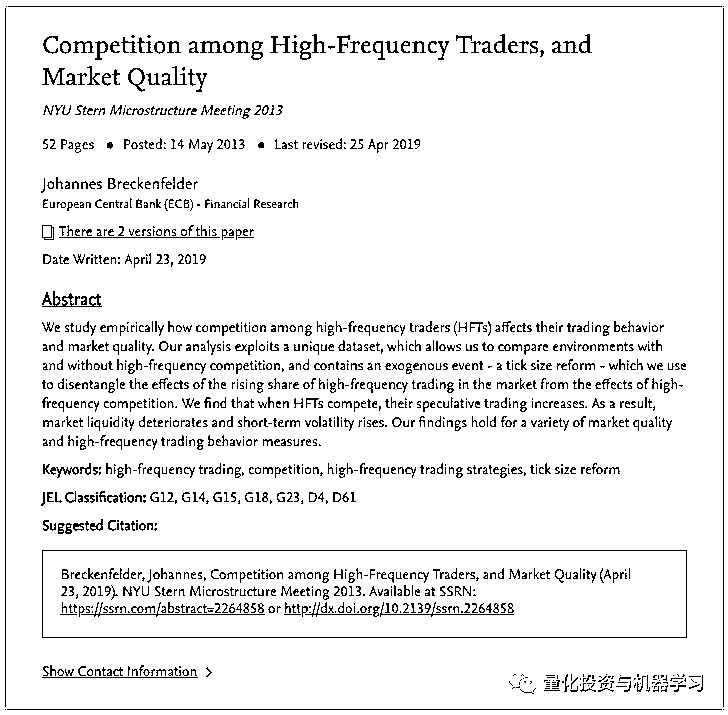
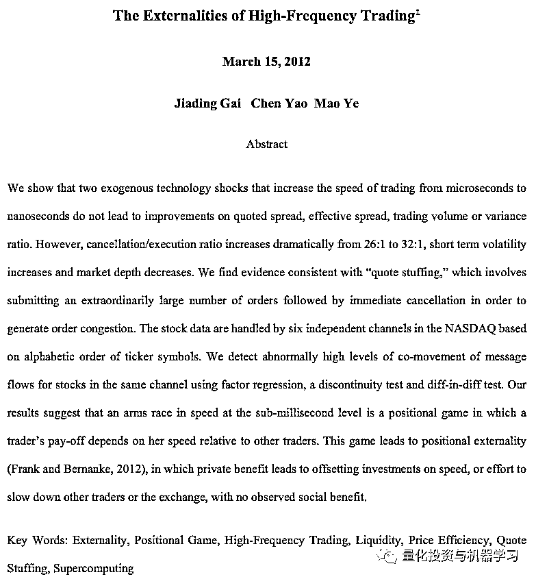
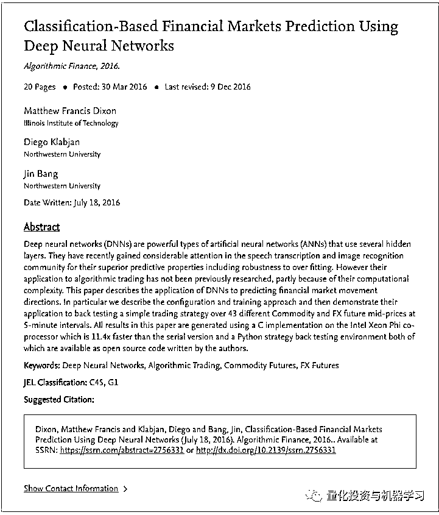
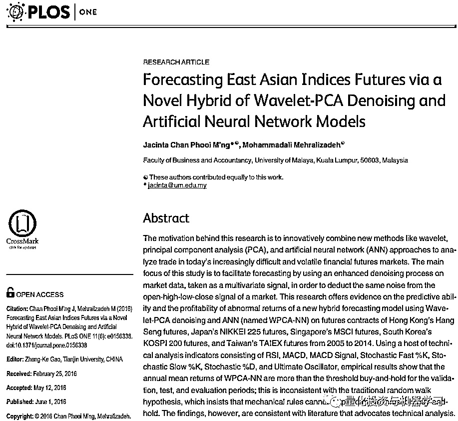
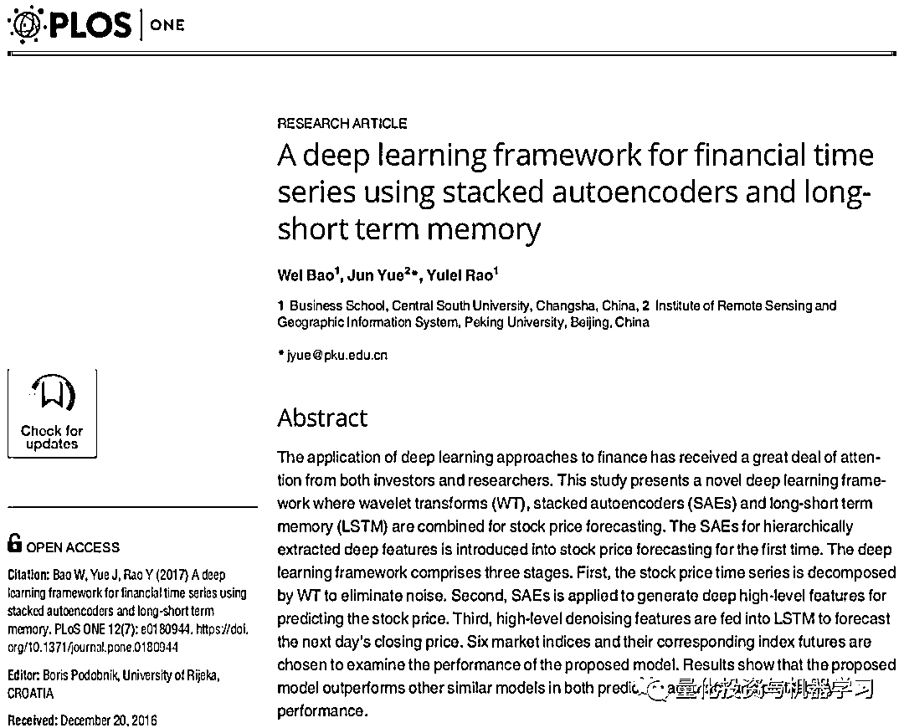
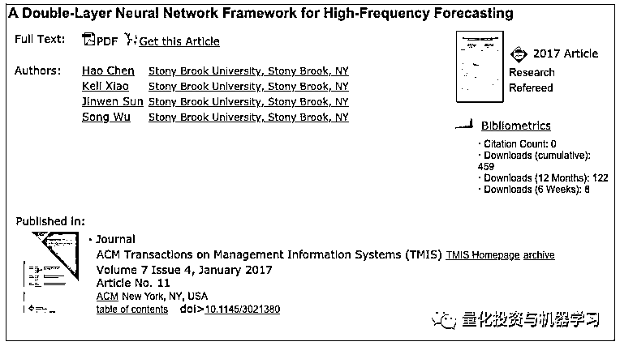

# 量化学术论文常：数据滥用严重、程序 Bug 泛滥！

> 原文：[`mp.weixin.qq.com/s?__biz=MzAxNTc0Mjg0Mg==&mid=2653294020&idx=1&sn=fe1c8099556ab81fc4365f6875d489ca&chksm=802dcfd1b75a46c76a1cdf397adcdc8eb1e8383fac164af072c08b6e7bd5ef980d0f036d9398&scene=27#wechat_redirect`](http://mp.weixin.qq.com/s?__biz=MzAxNTc0Mjg0Mg==&mid=2653294020&idx=1&sn=fe1c8099556ab81fc4365f6875d489ca&chksm=802dcfd1b75a46c76a1cdf397adcdc8eb1e8383fac164af072c08b6e7bd5ef980d0f036d9398&scene=27#wechat_redirect)

**标星★公众号     **爱你们♥

作者：Andrew

译者：1+1=6

**虚假结果已是常态**

在过去的一段时间里，我们进行了大量的论文复现，当模型在数据方面出现问题时，我们感到十分失望。**数据滥用是一个巨大的问题，而且是一个常态！**

在数据驱动的交易或量化投资研究中，数据挖掘是你必须做的很大一部分工作。但是，成功地应用这些技术。需要对领域的细微差别、对假设的批判性评估、以及对探索统计学和科学哲学的承诺给予大量关注。上世纪 80 年代早期，摩根士丹利发明了配对交易 ，当时一位哥伦比亚大学的计算机科学专业的毕业生，正在计算按行业分类的股票组合的相对权重和相关性。在同一时期，RenTech 刚刚起步。前董事总经理 Robert Frey 曾表示，他们的方法关键是纪律，而不是理论。创始人 Jim Simons 讲述了一件轶事，讲的是人们被派到纽约联邦储备银行大楼，手工抄写历史利率信息，这些信息被记录在一本书面账簿上。这些人可能是所有金融领域最成功的数据挖掘者或者叫他们挖矿者吧。

**程序 Bug**

当学者编写程序时，出现错误的概率和风险会大大提高。几年前，实证经济学（Empirical Economics）中最著名的一个结果实际上是一个**spreadsheet 错误**。 在《Quantitative Finance》发表的一篇论文中，有一篇提到一个回测软件，我们就发现了许多 Bug。从长期因子模型研究到高频订单分析，研究人员正在编写越来越复杂的代码。有一个经常被引用的统计数据表明：**专业软件行业每交付 1000 行代码就会产生 15-50 个错误**。

专业人员都有 15-50 个 Bug，可想而知。（此处只是对比，并无他意）

然而，据我们所知，**没有任何财经杂志有专业的软件开发人员审查提交的代码。** **大多数金融期刊仍然没有或者没有强制执行代码提交和公开出版标准**。这种愚蠢的做法既增加了结果的不确定性，也减缓了研究的进度。

**案例举证**

另一个令人担忧的趋势（特别是在质量较差的期刊和质量较低的学术期刊中）是，很多研究和出版机构完全忽视了股票数据和高频交易中 order book 数据截面所需领域知识的差异。例如：

**举证 1**

这篇论文随意地发明了一个衡量高频“liquidity takers”的指标，但如果作者能够咨询业内任何一个人，并意识到他其实是在计算竞相排队的做市商，以提供流动性。

**举证 2**

这篇论文假设股票成交量是正态分布的，因此他们没有像作者所说的那样找到高频“报价填充”的证据，而是通过一些自己的观察发现成交量就是这样的

*https://www.sec.gov/divisions/riskfin/seminar/ye031513.pdf*

**举证 3**

这篇论文不知道期货市场何时开盘，同时对无人交易合约的高预测准确性自己沾沾自喜。

**举证 4**

这篇论文计算了在一次到期时购买期货合约并在第二天以不同期限卖出期货合约的收盘损益。

*https://journals.plos.org/plosone/article/file?id=10.1371/journal.pone.0156338&type=printable*

**举证 5**

这篇论文在对整个时间序列进行预测之前，对其进行去噪滤波，这意味着每个点都包含未来信息。作者还将交易成本加入到他们的盈利 / 亏损中。

*https://journals.plos.org/plosone/article/file?id=10.1371/journal.pone.0180944&type=printable*

**举证 6**

这篇论文试图预测美股 5 分钟的收益率，但忽略了股市在晚上和周末闭市的事实，作者还尝试了一大堆模型，直到其中一个模型在样本中表现还不错，一步错，步步错！

*https://dl.acm.org/citation.cfm?doid=3026477.3021380*

**总结**

尽管市场数据的可用性稳步提高，开放源码软件社区的规模逐渐扩大，但算法交易和定量投资方面的学术研究存在着犯各种错误的风险，这些错误超出了众所周知的数据挖掘风险。随着研究依赖于越来越复杂的代码来处理更多的数据，当代学术研究人员必须扮演更重要的角色：如软件开发者和数据工程师。然而，现有的学术出版和同行评审制度似乎没有很好的设备来评估这些。在数据准备方面的一些小的疏忽和一些程序上的 Bug 会导致无效的结果，**这些结果可能会被忽视数年****。要减轻这些风险并确保正在进行研究的完整性，就需要相关行业出台更加严格的标准。**  

在国内很多机构的研报中，这个现象更是普遍存在。大家在复现研报的时候经常会踩雷。我们曾亲身经历过很多次，只能感叹：

**一顿操作猛如虎，原来全是 Overfitting**

****

*—End—*

量化投资与机器学习微信公众号，是业内垂直于**Quant**、**MFE**、**CST、AI**等专业的**主****流量化自媒体**。公众号拥有来自**公募、私募、券商、银行、海外**等众多圈内**10W+**关注者。每日发布行业前沿研究成果和最新量化资讯。

你点的每个“在看”，我们都认真当成了喜欢