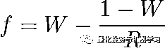
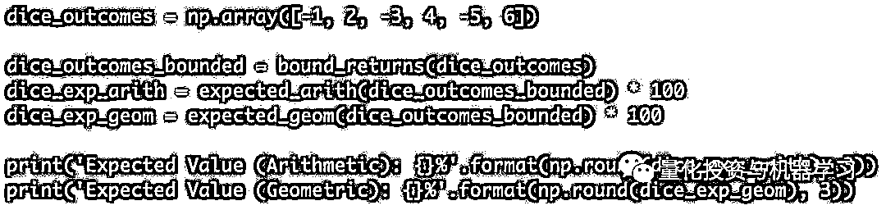
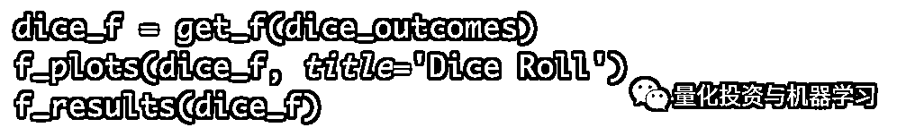
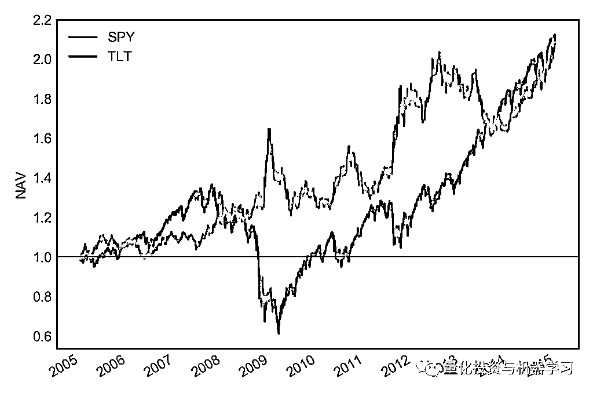
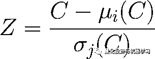

# 仓位管理：超越凯利公式，梦回华尔街！

> 原文：[`mp.weixin.qq.com/s?__biz=MzAxNTc0Mjg0Mg==&mid=2653294008&idx=1&sn=b752076b6695b293fc27ce66bfc7e6ff&chksm=802dcfadb75a46bb5386efe93b012db7cd4ec40cd79f3e0323a38001c475dac6cf5ecf7902c8&scene=27#wechat_redirect`](http://mp.weixin.qq.com/s?__biz=MzAxNTc0Mjg0Mg==&mid=2653294008&idx=1&sn=b752076b6695b293fc27ce66bfc7e6ff&chksm=802dcfadb75a46bb5386efe93b012db7cd4ec40cd79f3e0323a38001c475dac6cf5ecf7902c8&scene=27#wechat_redirect)

**标星★公众号     **爱你们♥

来自：quantfiction

编译：1+1=6

**近期原创文章：**

## ♥ [5 种机器学习算法在预测股价的应用（代码+数据）](https://mp.weixin.qq.com/s?__biz=MzAxNTc0Mjg0Mg==&mid=2653290588&idx=1&sn=1d0409ad212ea8627e5d5cedf61953ac&chksm=802dc249b75a4b5fa245433320a4cc9da1a2cceb22df6fb1a28e5b94ff038319ae4e7ec6941f&token=1298662931&lang=zh_CN&scene=21#wechat_redirect)

## ♥ [Two Sigma 用新闻来预测股价走势，带你吊打 Kaggle](https://mp.weixin.qq.com/s?__biz=MzAxNTc0Mjg0Mg==&mid=2653290456&idx=1&sn=b8d2d8febc599742e43ea48e3c249323&chksm=802e3dcdb759b4db9279c689202101b6b154fb118a1c1be12b52e522e1a1d7944858dbd6637e&token=1330520237&lang=zh_CN&scene=21#wechat_redirect)

## ♥ 2 万字干货：[利用深度学习最新前沿预测股价走势](https://mp.weixin.qq.com/s?__biz=MzAxNTc0Mjg0Mg==&mid=2653290080&idx=1&sn=06c50cefe78a7b24c64c4fdb9739c7f3&chksm=802e3c75b759b563c01495d16a638a56ac7305fc324ee4917fd76c648f670b7f7276826bdaa8&token=770078636&lang=zh_CN&scene=21#wechat_redirect)

## ♥ [机器学习在量化金融领域的误用！](http://mp.weixin.qq.com/s?__biz=MzAxNTc0Mjg0Mg==&mid=2653292984&idx=1&sn=3e7efe9fe9452c4a5492d2175b4159ef&chksm=802dcbadb75a42bbdce895c49070c3f552dc8c983afce5eeac5d7c25974b7753e670a0162c89&scene=21#wechat_redirect)

## ♥ [基于 RNN 和 LSTM 的股市预测方法](https://mp.weixin.qq.com/s?__biz=MzAxNTc0Mjg0Mg==&mid=2653290481&idx=1&sn=f7360ea8554cc4f86fcc71315176b093&chksm=802e3de4b759b4f2235a0aeabb6e76b3e101ff09b9a2aa6fa67e6e824fc4274f68f4ae51af95&token=1865137106&lang=zh_CN&scene=21#wechat_redirect)

## ♥ [如何鉴别那些用深度学习预测股价的花哨模型？](https://mp.weixin.qq.com/s?__biz=MzAxNTc0Mjg0Mg==&mid=2653290132&idx=1&sn=cbf1e2a4526e6e9305a6110c17063f46&chksm=802e3c81b759b597d3dd94b8008e150c90087567904a29c0c4b58d7be220a9ece2008956d5db&token=1266110554&lang=zh_CN&scene=21#wechat_redirect)

## ♥ [优化强化学习 Q-learning 算法进行股市](https://mp.weixin.qq.com/s?__biz=MzAxNTc0Mjg0Mg==&mid=2653290286&idx=1&sn=882d39a18018733b93c8c8eac385b515&chksm=802e3d3bb759b42d1fc849f96bf02ae87edf2eab01b0beecd9340112c7fb06b95cb2246d2429&token=1330520237&lang=zh_CN&scene=21#wechat_redirect)

## ♥ [WorldQuant 101 Alpha、国泰君安 191 Alpha](https://mp.weixin.qq.com/s?__biz=MzAxNTc0Mjg0Mg==&mid=2653290927&idx=1&sn=ecca60811da74967f33a00329a1fe66a&chksm=802dc3bab75a4aac2bb4ccff7010063cc08ef51d0bf3d2f71621cdd6adece11f28133a242a15&token=48775331&lang=zh_CN&scene=21#wechat_redirect)

## ♥ [基于回声状态网络预测股票价格（附代码）](https://mp.weixin.qq.com/s?__biz=MzAxNTc0Mjg0Mg==&mid=2653291171&idx=1&sn=485a35e564b45046ff5a07c42bba1743&chksm=802dc0b6b75a49a07e5b91c512c8575104f777b39d0e1d71cf11881502209dc399fd6f641fb1&token=48775331&lang=zh_CN&scene=21#wechat_redirect)

## ♥ [计量经济学应用投资失败的 7 个原因](https://mp.weixin.qq.com/s?__biz=MzAxNTc0Mjg0Mg==&mid=2653292186&idx=1&sn=87501434ae16f29afffec19a6884ee8d&chksm=802dc48fb75a4d99e0172bf484cdbf6aee86e36a95037847fd9f070cbe7144b4617c2d1b0644&token=48775331&lang=zh_CN&scene=21#wechat_redirect)

## ♥ [配对交易千千万，强化学习最 NB！（文档+代码）](http://mp.weixin.qq.com/s?__biz=MzAxNTc0Mjg0Mg==&mid=2653292915&idx=1&sn=13f4ddebcd209b082697a75544852608&chksm=802dcb66b75a4270ceb19fac90eb2a70dc05f5b6daa295a7d31401aaa8697bbb53f5ff7c05af&scene=21#wechat_redirect)

## ♥ [关于高盛在 Github 开源背后的真相！](https://mp.weixin.qq.com/s?__biz=MzAxNTc0Mjg0Mg==&mid=2653291594&idx=1&sn=7703403c5c537061994396e7e49e7ce5&chksm=802dc65fb75a4f49019cec951ac25d30ec7783738e9640ec108be95335597361c427258f5d5f&token=48775331&lang=zh_CN&scene=21#wechat_redirect)

## ♥ [新一代量化带货王诞生！Oh My God！](https://mp.weixin.qq.com/s?__biz=MzAxNTc0Mjg0Mg==&mid=2653291789&idx=1&sn=e31778d1b9372bc7aa6e57b82a69ec6e&chksm=802dc718b75a4e0ea4c022e70ea53f51c48d102ebf7e54993261619c36f24f3f9a5b63437e9e&token=48775331&lang=zh_CN&scene=21#wechat_redirect)

## ♥ [独家！关于定量/交易求职分享（附真实试题）](https://mp.weixin.qq.com/s?__biz=MzAxNTc0Mjg0Mg==&mid=2653291844&idx=1&sn=3fd8b57d32a0ebd43b17fa68ae954471&chksm=802dc751b75a4e4755fcbb0aa228355cebbbb6d34b292aa25b4f3fbd51013fcf7b17b91ddb71&token=48775331&lang=zh_CN&scene=21#wechat_redirect)

## ♥ [Quant 们的身份危机！](https://mp.weixin.qq.com/s?__biz=MzAxNTc0Mjg0Mg==&mid=2653291856&idx=1&sn=729b657ede2cb50c96e92193ab16102d&chksm=802dc745b75a4e53c5018cc1385214233ec4657a3479cd7193c95aaf65642f5f45fa0e465694&token=48775331&lang=zh_CN&scene=21#wechat_redirect)

## ♥ [拿起 Python，防御特朗普的 Twitter](https://mp.weixin.qq.com/s?__biz=MzAxNTc0Mjg0Mg==&mid=2653291977&idx=1&sn=01f146e9a88bf130ca1b479573e6d158&chksm=802dc7dcb75a4ecadfdbdace877ed948f56b72bc160952fd1e4bcde27260f823c999a65a0d6d&token=48775331&lang=zh_CN&scene=21#wechat_redirect)

## ♥ [AQR 最新研究 | 机器能“学习”金融吗？](http://mp.weixin.qq.com/s?__biz=MzAxNTc0Mjg0Mg==&mid=2653292710&idx=1&sn=e5e852de00159a96d5dcc92f349f5b58&chksm=802dcab3b75a43a5492bc98874684081eb5c5666aff32a36a0cdc144d74de0200cc0d997894f&scene=21#wechat_redirect)

**正文**

爱因斯坦曾说过：“复利是世界第八大奇迹”。

**世界上最强大的力量，不是原子弹，而是复利+时间**

复利投资的关键除了本金与年化收益率，便是**时间**的神奇“魔力”。

我们来看看复利计算公式：

**FV=PV*(1+i)^n **

其中

*   FV：Final Value 终值

*   PV：Present Value 现值

*   i：收益率

*   n：投资期数

举个简单的例子，如果你有 1 万元资金，投资时间为 5 年，年化收益率为 10%。五年后，你一共能拿回多少呢？按照上面的公式，结果就是：

**FV=10000*(1+10%)⁵=16105.1 元**

这是交易者需要理解的最重要的一个概念。

为了在金融市场上获得真正的财富，人们必须随着账户的增长扩大头寸规模。那么，我们应该在每个交易机会中承担多少比例的资本风险？今天的推文带你揭开这个答案。

**案例 1：抛硬币**

让我们从一个简单的例子开始。假设在一个赌场，你和韩梅梅玩抛硬币的游戏，并根据结果下赌注。如果硬币是正面，你下注多少，韩梅梅就 double 你的注数；如果硬币是反面，你将输掉了整个赌注。那么，问题是，**你应该拿自己的多少本金来玩这个游戏**？直观地说，它应该低于 100％。如果第一次抛硬币反面朝上，你就输的光溜溜了

在回答这个问题之前，我们将讨论**期望**的概念，其表示为所有可能结果的平均值：

其中

*   X：所有可能结果的随机变量

*   n：结果总数

*   x：每个结果的值

我们把这个值称为算术平均值。不过，我们更感兴趣的是几何期望值，也就是每次投注的预期资本回报率。这个数字越大，我们的财富累积速度就越快，最终资本价值也就越大。我们将其称为 geometric holding period return（缩写为 GHPR）。这个值的公式如下：

在抛硬币的例子中，这个等于(3*0)^(1/2)-1=-1。这告诉我们，如果一个人在每次抛硬币时都将其资本的 100%用于风险投资，那么他的预期回报率是-100%；也就是说他失去了所有的钱。

代码如下：

Expected Value (Arithmetic): 50.0%

Expected Value (Geometric): -100.0%

**分散赌注**

如果我们每次都用 1%的资金进行风险投资，潜在的结果将是 2%的收益或 1%的损失。让我们来看看在这个场景下的期望值：

Expected Value (Arithmetic): 0.5%

Expected Value (Geometric): 0.489%

由于每次投资的风险只占我们资金的一小部分，GHPR 现在是正值。还要注意几何期望值小于算术值。其实，5%也只是一个猜测值！肯定有一个数字在 1%到 100%之间，可以在不破产的情况下使我们的资本增长最大化，凯利公式来啦！

**凯利公式**

在概率论中，凯利公式（也称凯利方程式）是一个用以使特定赌局中，拥有正期望值之重复行为长期增长率最大化的公式，由约翰·拉里·凯利于 1956 年在《贝尔系统技术期刊》中发表，可以计算出每次游戏中应投注的资金比例。

其中

*   f：每次投注资本的最优比例

*   W：盈利概率

*   1-W：亏损概率

*   R：赔率

我们来看看基于凯利公式的结果是：

Kelly f: 0.25

Expected Value (Arithmetic): 12.5%

Expected Value (Geometric): 6.06602%

**最优 f**

我们可以通过遍历所有可能的结果并评估每个 GHPR 值来查看是否存在一个最佳的持股比例点。这将生成一条曲线，该曲线的峰值代表下注的最佳比例。Ralph Vince 把这个值称为最优 f。

代码如下：

Optimal f: 0.25

Expected Value (Arithmetic): 12.5%

Expected Value (Geometric): 6.066%

我们可以看到，这种方法返回的结果与凯利公式相同。我们很快就会发现这种方法可以将值插入公式中。同样重要的是，要从图表中注意到投资风险过大的影响。即使这个游戏的预期收益非常高。事实上，在你的账户中投资超过 f 的最优比例实际上会对复合增长产生负面影响。应该清楚的是 betting big to win big 的想法只在一定程度上是正确的。

**案例二：掷骰子**

下一个场景是掷骰子。现在让你下注。如果骰子出现偶数，韩梅梅付给你双倍的赌注。如果结果是奇数，你付给韩梅梅相同的倍数。我们看到这个游戏的算术期望是对你有利的。然而，为了评估这个游戏的几何平均收益，我们首先需要约束收益。如果你输五次，你付给韩梅梅 5 倍的赌注，你的赌资应该是你本金的 1/5。

Expected Value (Arithmetic): 10.0%

Expected Value (Geometric): -100.0%

我们再次看到，如果你冒太大的风险，一开始看起来不错的赌注最终会让你破产。我们可以使用凯利公式来尝试确定每次下注的最佳投放量。

让我们通过评估曲线的峰值将其与最佳 f 值进行比较。

**实际案例：市场收益**

历史证明，股票市场是通过复利增长资本的可靠途径。让我们来看看为了获得最大的收益，我们应该在市场上投入多少资本！

在接下来的研究中，我们的数据基于标准普尔 500 指数 ETF 的日收益率：

让我们将凯利公式建议的分数与最优 f 进行比较。

凯利公式建议的分数实际上远不是最优的。在这种情况下，我们实际上应该投入更多的资本。为此，我们必须使用杠杆，要么通过借钱增加投注规模，要么利用期权或期货等带有杠杆的交易工具进行交易。

**回撤**

到目前为止，我们只专注于最大化我们的资本收益。如果投资于最优 f，账户价值将是初始价值的 60 倍以上。然而，作为一个投资者，我们可能也同样关心我们所承担的风险。

代码：

为了实现最大收益，SPY 自成立以来使用超过 3 倍的杠杆买入。这将产生最大的复合收益率，但会导致：

**最大回撤：****97.23%**

在具有随机结果和正的数学期望的情况下，在每个事件上都有有限资金的最优部分。我们已经研究了两种确定这个最优比例的方法，凯利公式和最优 f。我们还看到，**风险超过这个最优比例并不会给赌徒/交易员带来任何额外的收益**。

**回撤曲线**

上面的例子表明，在最优 f 上投资 SPY 会导致一些极端的不适。让我们来看看如何构造一条类似于 GHPR 最大跌幅的曲线，通过增加头寸规模来增加最大回撤。另外还提供一个衡量指标：Ulcer Index，代码如下：

  

从图中可以看出，随着头寸规模趋近于最优 f，收益率和最大回撤都在增加，降额在最优 f 处超过 90%。随着我们进一步扩大规模，缩减继续接近 100％。然而，收益开始下降。这强化了这样一个事实：**通过增加规模来增加利润超过最优 f 是徒劳的。****这样做只会带来更多的痛苦。**

然而，许多投资者的承受力远远低于 97%。大多数人都有一个心理极限，如果超过这个极限，他们就会把钱从桌子上拿走。各位：

**回测和实盘真的不一样**

如果一个人不能承担风险，那么回报就无关紧要了。出于这个原因，我们要努力下调超过我们极限点的限制曲线。新的有界曲线的峰值出现在实际的最优比例处。使用这部分资金将带来最大的收益，同时保护我们免受最大回撤的心理痛苦。

例如，假设我们希望在 SPY 中最大化我们的收益，而不让我们的亏损超过 25％。

代码：

为了避免 25%的回测，我们需要将杠杆从最优 f 值降低近 9 倍!

**回撤让你清醒**

对于从业人员来说，回撤是一个很好的风险指标，因为它最直接影响了他们的情绪。实际上，很少有交易员根据收益率的标准差或类似的波动性指标来决定是否遵循制定的策略。看着自己的账户余额从 100 万元亏到 60 万元，这是一种深刻的心灵体验

然而，使用回撤作为风险度量也存在许多限制。

**收益顺序**

与复合收益不同，最大回撤取决于实现收益的顺序。我们将在下面通过打乱标准普尔收益的顺序并研究由此产生的股票曲线来说明这一点。

我们看到，无论每日收益的顺序如何，每条曲线的 GHPR 都是相同的。使用传统定义的最优 f 不会区分这些曲线。然而，最大和最小的回撤的差异超过了 20%！这是在只生成了 10 条曲线之后；我们将在下面看到，可能的值可以有很大的变化。

**最大回撤：****78.479%**

最大回撤从不到 30％到超过 70％不等！这个范围比较广泛。如果我们想使用回撤作为风险度量，我们需要处理其固有的不确定性。我们无法完全限制预期回撤结果，因为最大回撤值可能会出现在很大范围内。然而，我们可以相当有信心地说，所经历的最大回撤不会超过我们的阈值。为了做到这一点，我们计算了可能超过我们的风险阈值的最大回撤情况的百分比。如果这个百分比太大，我们必须使用较小的仓位（头寸）。

**时间范围**

回撤的第二个重要特征是它依赖于时间范围。事实上，**可以证明最大回撤与时间的平方根成正比**（大家可以自己证明一下）。直观地说，一个账户下个月的最大回撤将低于下一年的最大回撤。为了准确地设置最大回撤的阈值，我们需要定义时间范围。

例如，我们可能会指定在明年（约 250 个交易日）内回撤不得超过 25％。基于我们之前的研究，我们想以一定程度的确定性或信心来陈述这个约束条件。统计显著性的一般为 5%。我们希望有 95%的把握，在未来的一年里，回撤将少于 25%。

为了确定在这些条件下的理想情况，对于 0 和 1 之间的每一个 f 值，我们将采用以下步骤：

*   生成许多可能的权益曲线（类似于蒙特卡罗）。

*   根据我们期望的时间范围，从收益分布中随机抽取一些收益作为样本。

*   通常选择>1000 来获得一个精确的回撤分布图。

*   计算每条曲线的 GHPR 和最大回撤。

*   确定在我们指定的置信水平上的回撤水平。

*   记录 GHPR 值的中值（可以选择百分位数）。

*   如果在我们指定的置信水平上的回撤值低于我们的风险阈值，则将中值 GHPR 指定为该 f 的 GHPR 值。

*   如果不是，则设置 GHPR = 0。以这样的仓位交易风险太大了。

*   在这个新的 f 曲线中找到一个点，使 GHPR 的期望值最大化。

我们称这个点为“理想的 f”。

使用这种方法，我们看到曲线更加参差不齐。这是由于使用蒙特卡罗模拟时所涉及的固有随机性。然而，我们观察到 GHPR 和回撤之间的一般关系与以前相同。有趣的是，这种方法建议使用的杠杆是之前确定性方法的 2 倍多。这有两个原因。

首先，我们大大缩短了时间范围。虽然第一次尝试使用了 SPY 的整个价格历史（近 25 年），而第二种方法模拟了未来一年的曲线。时间越短，我们预期的回撤就越少。其次，指数**收益率等金融时间序列往往同时表现出波动性聚类和自相关性**。这意味着单个收益并不完全独立于以往收益，这是我们在建模过程中使用的假设。为了解决这个问题，用于将结果输入到头寸调整算法的策略应该在做出买入/卖出决策时就应该考虑这些因素。

在这些计算中使用的收益必须代表预期未来收益。理想的情况是使用实际收益或 paper trading 的结果。如果必须使用回测的结果，建议**尽可能使用样本外的结果**。将过度优化的样本内结果代入这些公式，会低估风险，高估收益。如果你的策略在回测中夏普比率为 8，但在实时交易中夏普比率接近 0.5，那么你的杠杆将会很高，并很快超过你的风险承受能力。

现在，我们有了一种方法来确定我们理想的头寸规模占我们总账户净值的百分比。

但是，此方法只适用于单票收益。作为投资者，我们希望将多种资产和多策略组合到一个投资组合中去。

**两枚硬币**

在开始，我们研究了头寸大小对抛硬币游戏的影响。这次，我们要用两个硬币。为了显示不同程度的相关性所产生的影响，我们将尝试三种不同的场景：两种不相关的硬币、两种正相关的硬币和两种负相关的硬币。

头两场的结果和之前一样正面翻倍，反面输掉 100%在第一个(非相关)场景中，潜在的结果如下：

因为两枚硬币都是同时抛的，所以我们必须在抛硬币之前下注。我们可以独立地对每一枚硬币下注，并以可能导致全部破产的金额为界限。在这种情况下，如果两个下注大小的总和>=100％，那么当场景 4 发生时，我们将保证损失所有的钱。根据这些投注规模计算出每个结果 k 的加权收益率 R，计算公式如下：

其中

*   N：投注的独立结果总数

*   f：每个结果上的资金比例

*   x：每个结果的返回值

一旦我们有了这组加权收益，我们就可以像前面一样计算 GHPR 了。

现在的目标是通过找出资金在每个结果上的最优比例来最大化两个赌注组合的 GHPR。我们可以通过迭代每个下注大小的组合，计算每个组合的 GHPR 值，然后查看峰值在哪里来实现这一点。

Output:

coin 1  0.230000

coin 2  0.230000

ghpr    0.119119

从上面的结果中我们可以看出，为了使我们的资金长期增长最大化，最优策略是将 23%的资金投入到每一种结果上，并将赌注押在正面。。这意味着我们的总风险是每个事件帐户的 46％（两次抛掷）。该策略的预期 GHPR 为 11.9％。

在最开始的例子中，在相同的概率下，单次抛硬币的最佳比例是 25%，预期 GHPR 为 6.07%。使用两个不相关的硬币，风险和潜在收益都几乎翻了一番。在这一点上，你可能会想，“你为什么不把两倍的钱押在一枚硬币上呢？”下面的场景将说明为什么多样化对我们有利。

**相关硬币**

让我们来看看抛两枚完全相关的硬币的情况，也就是说，如果一个正面朝上，另一个正面朝上，反之亦然。这个游戏只有两种可能的场景：

我们可以用第一个方法来检验这个博弈的最优策略。

Output:

Coin 1  0.00000

Coin 2  0.25000

ghpr    0.06066

在这种情况下，最优策略遵循完全相同的策略，就好像他们只能押一枚硬币一样。事实上，就像在一枚硬币的情况下一样，完全忽略第二个赌注，在第一个赌注上押上你账户的 25%。

**负相关**

我们将研究与第一枚硬币负相关第二枚硬币的情况。但问题是：第二枚硬币的期望值实际上是负的。

第二枚硬币的收益如下：反面，你仍然输掉 100%的赌注。然而，如果出现正面，你只赢了 60%的赌注。

乍一看，人们可能会想，你为什么要把自己的资本配置给第二枚硬币。这种游戏的算术期望值是每次输掉 20%的赌注；这比赌场里的每场比赛都要糟糕！但是如果我们同时对这两个负相关结果下注，我们来看看结果：

Output:

Coin 1  0.790000

Coin 2  0.990000

ghpr    0.130646

对于这个结果，首先，最大 GHPR 实际上从 11.9％增加到 13.1％。其次，我们建议在每一个可打赌的事件上（需要使用借来的钱或杠杆）押注资金总额的近 180%。最后，我们应该把更大的赌注分配给一枚硬币，随着时间的推移，它肯定会赔钱。这些似乎都与直觉相悖。

这个例子是人为设计的，只是为了说明，所以我们不会深入研究它。我们可以通过对这两种结果都下注来保证利润。没有哪家赌场会向你提供这样的场景，市场可能会套利任何类似的机会。然而，它证明了负相关的力量，以及为什么我们应该尽可能地寻找它。同样的效果也可以在不完全负相关的情况下看到同样的效果，但这会让这个例子变得过于混乱。

**减少约束**

在前面的论述中，我们讨论了为什么“最优 f”并不完全是最优的，即由于在最大杠杆水平上遇到的极端下降。

修改后的代码：

  

对于本例，我们将使用一些实际的市场数据。从 2005 年到 2015 年：标普 500 指数（SPY）和长期国债（TLT）ETF 的每日 OHLC 数据。这个窗口是任意选择的，但 10 年似乎是一个不错的时间窗口，这段时间包含了牛市、熊市、高波动性和低波动性。一旦我们有了价格数据，我们就可以计算每天的收益率，用于我们的头寸规模优化。

接下来，我们将遍历所有分配权重的组合，以在给定风险容忍度的情况下找到最优值。以 95%的置信度强制设置 20%的最大回撤。

关于上面的图表，首先要注意的是，搜索空间中只有一小块区域分配了非零 GHPR 值。在该地区之外，我们缺乏信心，即我们的缩编限制将得到满足。

优化后的结果表明，我们应该将大约 36%的资金用于 SPY，64%的资金用于 TLT。这些权重之和为 100%的事实只是一个巧合，而不是模型的特征/约束。这种配置策略的 GHPR 中值预测为每日 0.034%（年化 8.9%），其中 95%生成的权益曲线的最大回撤<= 18.7%。

**多策略**

这种方法对两种回报流都很好，但多样化的真正好处来自于拥有许多不相关的策略。不幸的是，在二维返回空间外汇出现一些问题。首先，可视化变得非常困难。更重要的是，搜索投资组合权重组合所需的时间呈指数级增长。

用了将近两分钟的时间找到了只有两个回报序列的最优解。为了实现多样化，我们希望跨市场、跨风格和跨时间框架组合策略。这可能导致一个投资组合包含数十个单独的收益流。当你考虑到，对于每一个权重组合，我们都要生成数千条权益曲线来评估收益和亏损，这是一个非常耗时的过程。幸运的是，我们有一些节省时间的妙招。

结果表明，**夏普比率与我们的度量指标有很强的相关性，且不依赖于时间**。我们不寻找最大 GHPR，而是优化每个加权收益序列的最大夏普比率。这样，我们就不需要生成数千条潜在的权益曲线来评估权重的最佳组合是什么。这样做可以节省大量的时间。

从根本上减少寻找最优投资组合配置所需时间的第二种方法是**放弃可能组合的强力迭代，而采用非线性优化。**我们将使用**cma**包来实现这一点。具体算法见:

*http://cma.gforge.inria.fr/cmaes_sourcecode_page.html*

给定一个适应度函数和一系列输入，与尝试所有可能的输入组合相比，该算法将在更短的时间内找到一个局部（并且希望是全局）最小值。

但是，使用这种方法只能产生相对的权重组合;杠杆作用没有考虑在内。因此，我们将优化程序分为两部分：

1、找出使投资组合夏普比率最大化的相对配置权重。

2、在考虑给定的风险/回撤限制的前提下，确定适用于最大化 GHPR 的投资组合的杠杆率。

为了证明这种方法，我们将在两个 ETF 上创建三种“虚拟”策略：两种中长期趋势跟踪策略和一种短期均值回归策略。作为趋势的代表，我们将使用滚动 z-score，定义如下：

这是我们用来衡量交易决策的信号。对于趋势跟踪系统，我们将增加与信号成比例的位置大小；均值回归要乘以-1。为了得到每个策略的收益，我们把策略信号乘以正向回报（假设我们在信号之后进入 open 并在此之后退出）。

首先，我们将计算 SPY 和 TLT 的 5、50 和 100 天 lookback 周期的策略信号。从这些信号中，我们得到了这些策略收益。

接下来，我们将使用常规优化来找到使我们的投资组合夏普比率最大化的权重。

这一优化的结果表明，理想的策略应该是将我们的大部分资金配置给短期均值回归策略，并限制在长期趋势跟踪策略中。

第一步完成了。我们已经确定了适用于每种策略的相对权重，以便使夏普比率最大化，但按照计算方法应用它们可能会导致风险过高或收益过低。为了解决这个问题，我们可以使用优化程序的的结果获得加权投资组合的收益。然后，可以应用最初的“理想 f”来确定风险目标的适当杠杆率。

我们计算出在这个投资组合中投资的理想比例是 32%。最后一步是将非杠杆投资组合权重乘以这个值，得到最终的投资组合配置：

最后，可视化此投资组合的表现：

**警告**

与交易策略领域的任何“最优”解决方案一样，你认为完美的回测，却在实盘中表现的平淡无奇或产生了灾难性的后果。在实现上面讨论的方法时，你要正视这个问题！ 

首先，**多策略没有考虑到交易成本**。如果你的投资组合中的策略经常在市场中进进出出，那么这些策略很快就会变得很重要，并且必须加以考虑。接下来，**用于优化的策略收益必须是样本外的。实盘收益率值最好的，paper trading 次之，如果没有实际收益率，可以使用样本外回测收益率。**

假设未来策略之间的关系与过去相似。如果这些关系消失，投资组合可能会处于非常糟糕。如上所述，杠杆计算中使用的最大回撤是基于加权收益的。一种策略的损失可以补偿同一时期另一种策略的收益。**为了解决所有策略同时对你产生不利的情况，你可以将每种策略历史上的最大回撤与投资组合权重相乘。**

最后，我们**必须假设未来不会像过去那么美好。Alpha 衰减将影响大多数策略，即使有最严格的回测，在实际交易中结果通常也不会很****好。我们还应该假设，最大回撤就在我们面前，因为从数学上讲，交易时间越长，大幅回撤的可能性就越大。我们最大的损失也是如此。为了减轻这种情况，我们可以应用安全系数来扩大历史上最大回撤，从而减少所用的杠杆数量。我们还可以设定一个比我们认为必要时更低的最大回撤门槛；这也有助于有效降低最佳杠杆率。**

**结论**

如果一个人能够提高经风险调整后的收益，那么提高绝对收益所需要的一切，就是提高杠杆以适应他们的风险偏好。

*—End—*

*量化投资与机器学习微信公众号，是业内垂直于**Quant**、**MFE**、**CST、AI**等专业的**主****流量化自媒体**。公众号拥有来自**公募、私募、券商、银行、海外**等众多圈内**10W+**关注者。每日发布行业前沿研究成果和最新量化资讯。*

***你点的每个“在看”，我都认真当成了喜欢*