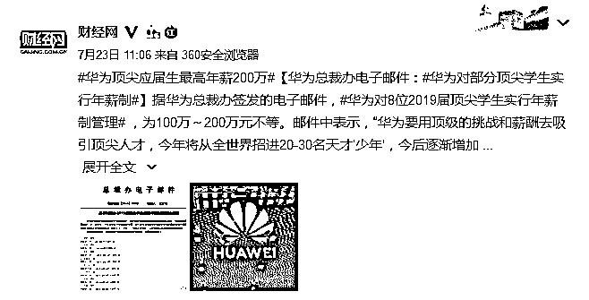
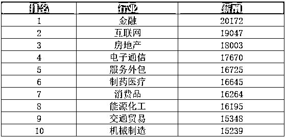
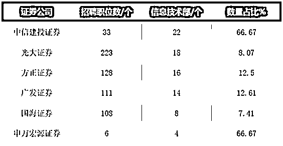
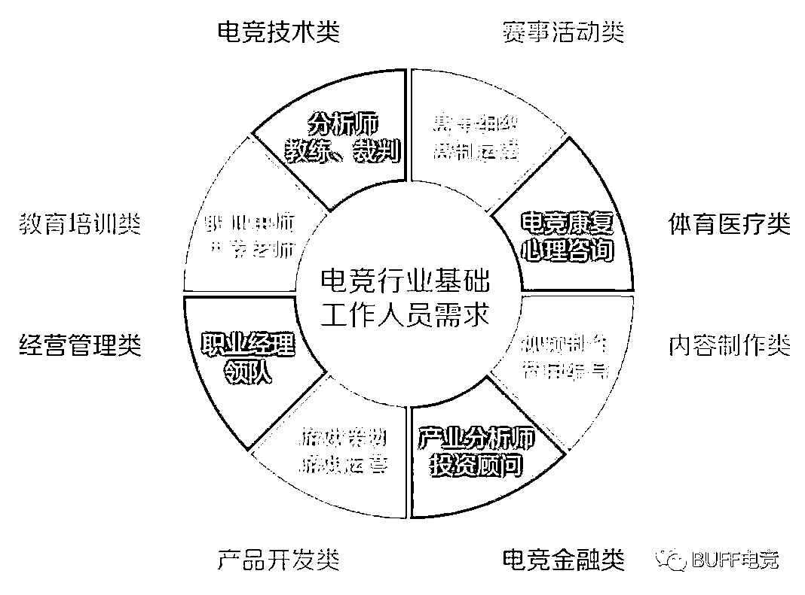
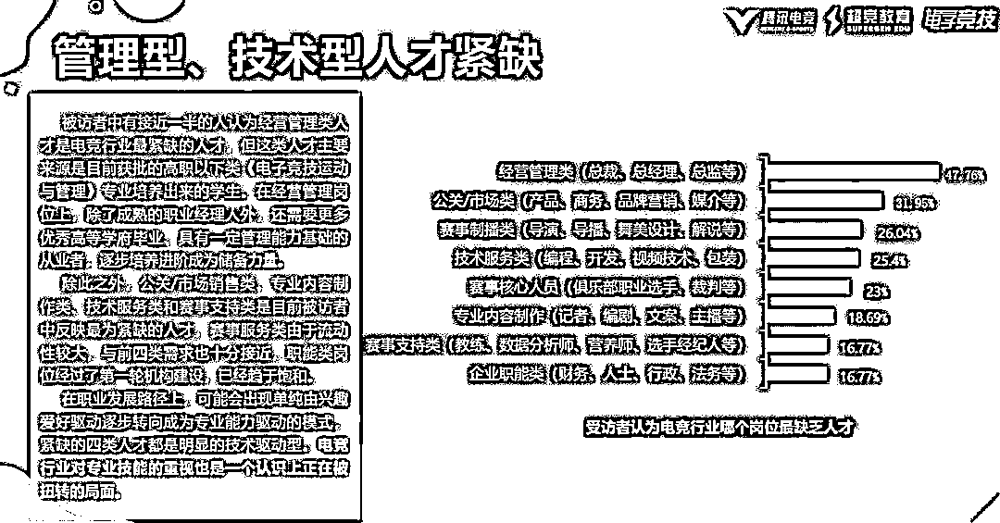

# 最新薪资鄙视链：1 个清华=2 个 985

> 原文：[`mp.weixin.qq.com/s?__biz=MzAxNTc0Mjg0Mg==&mid=2653293939&idx=1&sn=a67d5148d5a1cfa520ea7c1f4fca8369&chksm=802dcf66b75a46701d1a80f965d7ae8fd9e14bc3ae7a826d095966b7f45472217b4581d480b1&scene=27#wechat_redirect`](http://mp.weixin.qq.com/s?__biz=MzAxNTc0Mjg0Mg==&mid=2653293939&idx=1&sn=a67d5148d5a1cfa520ea7c1f4fca8369&chksm=802dcf66b75a46701d1a80f965d7ae8fd9e14bc3ae7a826d095966b7f45472217b4581d480b1&scene=27#wechat_redirect)

**标星★公众号     **爱你们♥

来自：UniCareer

作者：Uni 酱

**近期原创文章：**

## ♥ [5 种机器学习算法在预测股价的应用（代码+数据）](https://mp.weixin.qq.com/s?__biz=MzAxNTc0Mjg0Mg==&mid=2653290588&idx=1&sn=1d0409ad212ea8627e5d5cedf61953ac&chksm=802dc249b75a4b5fa245433320a4cc9da1a2cceb22df6fb1a28e5b94ff038319ae4e7ec6941f&token=1298662931&lang=zh_CN&scene=21#wechat_redirect)

## ♥ [Two Sigma 用新闻来预测股价走势，带你吊打 Kaggle](https://mp.weixin.qq.com/s?__biz=MzAxNTc0Mjg0Mg==&mid=2653290456&idx=1&sn=b8d2d8febc599742e43ea48e3c249323&chksm=802e3dcdb759b4db9279c689202101b6b154fb118a1c1be12b52e522e1a1d7944858dbd6637e&token=1330520237&lang=zh_CN&scene=21#wechat_redirect)

## ♥ 2 万字干货：[利用深度学习最新前沿预测股价走势](https://mp.weixin.qq.com/s?__biz=MzAxNTc0Mjg0Mg==&mid=2653290080&idx=1&sn=06c50cefe78a7b24c64c4fdb9739c7f3&chksm=802e3c75b759b563c01495d16a638a56ac7305fc324ee4917fd76c648f670b7f7276826bdaa8&token=770078636&lang=zh_CN&scene=21#wechat_redirect)

## ♥ [机器学习在量化金融领域的误用！](http://mp.weixin.qq.com/s?__biz=MzAxNTc0Mjg0Mg==&mid=2653292984&idx=1&sn=3e7efe9fe9452c4a5492d2175b4159ef&chksm=802dcbadb75a42bbdce895c49070c3f552dc8c983afce5eeac5d7c25974b7753e670a0162c89&scene=21#wechat_redirect)

## ♥ [基于 RNN 和 LSTM 的股市预测方法](https://mp.weixin.qq.com/s?__biz=MzAxNTc0Mjg0Mg==&mid=2653290481&idx=1&sn=f7360ea8554cc4f86fcc71315176b093&chksm=802e3de4b759b4f2235a0aeabb6e76b3e101ff09b9a2aa6fa67e6e824fc4274f68f4ae51af95&token=1865137106&lang=zh_CN&scene=21#wechat_redirect)

## ♥ [如何鉴别那些用深度学习预测股价的花哨模型？](https://mp.weixin.qq.com/s?__biz=MzAxNTc0Mjg0Mg==&mid=2653290132&idx=1&sn=cbf1e2a4526e6e9305a6110c17063f46&chksm=802e3c81b759b597d3dd94b8008e150c90087567904a29c0c4b58d7be220a9ece2008956d5db&token=1266110554&lang=zh_CN&scene=21#wechat_redirect)

## ♥ [优化强化学习 Q-learning 算法进行股市](https://mp.weixin.qq.com/s?__biz=MzAxNTc0Mjg0Mg==&mid=2653290286&idx=1&sn=882d39a18018733b93c8c8eac385b515&chksm=802e3d3bb759b42d1fc849f96bf02ae87edf2eab01b0beecd9340112c7fb06b95cb2246d2429&token=1330520237&lang=zh_CN&scene=21#wechat_redirect)

## ♥ [WorldQuant 101 Alpha、国泰君安 191 Alpha](https://mp.weixin.qq.com/s?__biz=MzAxNTc0Mjg0Mg==&mid=2653290927&idx=1&sn=ecca60811da74967f33a00329a1fe66a&chksm=802dc3bab75a4aac2bb4ccff7010063cc08ef51d0bf3d2f71621cdd6adece11f28133a242a15&token=48775331&lang=zh_CN&scene=21#wechat_redirect)

## ♥ [基于回声状态网络预测股票价格（附代码）](https://mp.weixin.qq.com/s?__biz=MzAxNTc0Mjg0Mg==&mid=2653291171&idx=1&sn=485a35e564b45046ff5a07c42bba1743&chksm=802dc0b6b75a49a07e5b91c512c8575104f777b39d0e1d71cf11881502209dc399fd6f641fb1&token=48775331&lang=zh_CN&scene=21#wechat_redirect)

## ♥ [计量经济学应用投资失败的 7 个原因](https://mp.weixin.qq.com/s?__biz=MzAxNTc0Mjg0Mg==&mid=2653292186&idx=1&sn=87501434ae16f29afffec19a6884ee8d&chksm=802dc48fb75a4d99e0172bf484cdbf6aee86e36a95037847fd9f070cbe7144b4617c2d1b0644&token=48775331&lang=zh_CN&scene=21#wechat_redirect)

## ♥ [配对交易千千万，强化学习最 NB！（文档+代码）](http://mp.weixin.qq.com/s?__biz=MzAxNTc0Mjg0Mg==&mid=2653292915&idx=1&sn=13f4ddebcd209b082697a75544852608&chksm=802dcb66b75a4270ceb19fac90eb2a70dc05f5b6daa295a7d31401aaa8697bbb53f5ff7c05af&scene=21#wechat_redirect)

## ♥ [关于高盛在 Github 开源背后的真相！](https://mp.weixin.qq.com/s?__biz=MzAxNTc0Mjg0Mg==&mid=2653291594&idx=1&sn=7703403c5c537061994396e7e49e7ce5&chksm=802dc65fb75a4f49019cec951ac25d30ec7783738e9640ec108be95335597361c427258f5d5f&token=48775331&lang=zh_CN&scene=21#wechat_redirect)

## ♥ [新一代量化带货王诞生！Oh My God！](https://mp.weixin.qq.com/s?__biz=MzAxNTc0Mjg0Mg==&mid=2653291789&idx=1&sn=e31778d1b9372bc7aa6e57b82a69ec6e&chksm=802dc718b75a4e0ea4c022e70ea53f51c48d102ebf7e54993261619c36f24f3f9a5b63437e9e&token=48775331&lang=zh_CN&scene=21#wechat_redirect)

## ♥ [独家！关于定量/交易求职分享（附真实试题）](https://mp.weixin.qq.com/s?__biz=MzAxNTc0Mjg0Mg==&mid=2653291844&idx=1&sn=3fd8b57d32a0ebd43b17fa68ae954471&chksm=802dc751b75a4e4755fcbb0aa228355cebbbb6d34b292aa25b4f3fbd51013fcf7b17b91ddb71&token=48775331&lang=zh_CN&scene=21#wechat_redirect)

## ♥ [Quant 们的身份危机！](https://mp.weixin.qq.com/s?__biz=MzAxNTc0Mjg0Mg==&mid=2653291856&idx=1&sn=729b657ede2cb50c96e92193ab16102d&chksm=802dc745b75a4e53c5018cc1385214233ec4657a3479cd7193c95aaf65642f5f45fa0e465694&token=48775331&lang=zh_CN&scene=21#wechat_redirect)

## ♥ [拿起 Python，防御特朗普的 Twitter](https://mp.weixin.qq.com/s?__biz=MzAxNTc0Mjg0Mg==&mid=2653291977&idx=1&sn=01f146e9a88bf130ca1b479573e6d158&chksm=802dc7dcb75a4ecadfdbdace877ed948f56b72bc160952fd1e4bcde27260f823c999a65a0d6d&token=48775331&lang=zh_CN&scene=21#wechat_redirect)

## ♥ [AQR 最新研究 | 机器能“学习”金融吗？](http://mp.weixin.qq.com/s?__biz=MzAxNTc0Mjg0Mg==&mid=2653292710&idx=1&sn=e5e852de00159a96d5dcc92f349f5b58&chksm=802dcab3b75a43a5492bc98874684081eb5c5666aff32a36a0cdc144d74de0200cc0d997894f&scene=21#wechat_redirect)

最近某机构发布了 2019 年最新人才报告

**1 个清华毕业生薪酬约等于 2 个 985 薪酬之和**

**5G 领域月薪高达近 5W**

**对大学生最友好的行业竟然是互联网**  

****   毕业生大数据出炉 ****

最近，有机构公布了毕业生 2019 年上半年就业数据。从报告中，我们可以看出，不同院校毕业的学生，从事的领域也会有所不同，随之薪酬也会有着巨大差距。 

**1**

****薪资最高的毕业生****

前段时间“华为 200 万聘请应届生”的新闻在网上引起一阵热议，“学历高真的值钱吗”的争议也伴随着这则消息被消除。

*图片来源：网络

**嗯，学历好，真的挣钱！**

有数据调查显示，在包括清华大学、北京大学、复旦大学、浙江大学等在内的国内 10 所顶尖院校毕业生薪酬的一项调查中，**年薪分布在在 10~20 万、20~30 万的毕业生人最多。**但是在清华大学中占比最多的是平均年薪 50 万以上的毕业生，占比高达三成。也就是说，10 个人中就有差不多 3 个人年薪 50 万以上。

清华和北大两所学校的毕业生，在薪酬方面，依然领先于其他院校的毕业生。甚至，一个清华学生的薪酬等于两个 985 学生薪酬的总和。  

**2**

****薪资最高的行业****

一个行业的性质，往往代表着这个行业的人们最终的薪酬有多少。据了解，目前**薪酬最高的行业依旧是金融行业**，而互联网行业和房地产行业紧随其后，分别位列第二位和第三位。  

*图片来源：Uni 自制 | 数据来源于网络

在之前网曾曝光的金融行业应届生薪资表中显示，大摩应届生的平均薪资可达 20K~23K，就连国内部分银行，税后年薪都可高达 17W。金融行业可谓是名副其实的“多金”行业。

在紧随其后的互联网行业近年来也是“壕气冲天”。仅以阿里巴巴为例，招聘时没有给出明确数字，但根据历年入职学生的经验，基本都会给出“13k*15~18k*15（即 13000 元/月、一年发 15 个月薪酬至 18000 元/月、一年发 15 个月薪酬，下同）”的平均薪资。

以此类推，**应届生的最高收入可达到 27 万元的年薪。**

**3**

****最受雇主喜欢的专业****

根据数据显示，**目前公司对于商科的专业的学生更加偏好****。**工商管理、会计学、市场营销、金融学、国际经济与贸易、人力资源管理、财务管理、电子商务等专业的简历更加吸引 HR 眼球。

同时商科专业的学生在薪资方面也有着明显优势。

除此之外，包括计算机、土木工程、机械、电子信息工程等在内的工科专业也深受雇主喜欢。特别是随着 5G 与互联网金融领域的兴起，计算机人才更加紧缺，**比如在部门裁员的情况下，很多券商依旧在招计算机专业人才。**

**4**

****最适合应届生的行业****

在各大行业纷纷裁员的情况下，一些行业还是向应届生伸出了友谊之手。特别是**互联网行业和房地产行业**，对人才的需求最高，释放出来的岗位占比也最大。

**** 不同领域的热招岗位****

**1**

****互联网****

互联网行业一直是人才流动最为频繁的行业，同时释放就业机会最多的行业。根据数据显示，2019 年互联网行业的热招岗位主要有以下几种：  

*   后端开发

*   机械工程师

*   算法工程师

*   嵌入式软件开发

*   大数据

*   人工智能

与此同时，在这些岗位上有着 3 年以上工作经验的人才更加受欢迎，无论是薪酬还是职位上，更加具有竞争力。

**2**

****金融****

目前国内金融市场，对金融人才的需求很大，尤其是急缺金融分析师、金融风险管理师、金融工程师、特许财富管理师、基金经理、精算师、副总裁级高管、稽查监管人员、产品开发人员、后台工作人员(在财务、结算、税务方面有经验)等九大类人才。

另外，随着金融科技的发展，IT 人才仍然是金融行业招聘中急需的人才。例如各大券商的信息技术部曾纷纷放出岗位，其中 IT 项目经理、JAVA 软件工程师、PHP 开发管理岗等成为各家券商招聘中不可或缺的岗位。

*图片来源：网络

比如光大证券曾在公司微信公众号上发布了 IT 人才的招聘需求。招聘岗位包括**系统架构师、数据安全工程师、高级运维工程师、项目管理工程师、质量管理工程师。**实际上，光大证券外部招聘网站上挂出了 223 个岗位，**信息技术部就有 18 个岗位，占比 8.07%；**中信建投总共招聘 33 个岗位**，****22 个是信息技术部岗位，占比高达 66.67%；**申万宏源证券挂出 6 个岗位，4 个是信息技术部岗位，占比也是 66.67%。

**3**

****5G****

作为 2019 年最热门的领域之一，5G 领域对于人才的需求也呈现于紧缺状态，有业界人士称，未来我国人才领域缺口将达到 2000 万！

其中**软件工程师、算法工程师、硬件工程师、架构师**等岗位在 5G 领域处于热招状态。而架构师的月薪甚至高达四万多，可以说是真正的高薪职业。

**4**

****垃圾分类****

作为 2019 年新型领域，垃圾分类催生的新型公司也成为今年的热门招聘行业。根据资料显示，在垃圾分类领域中，以下五种岗位尤其紧缺：

*   环保工程师

*   工艺/制造工程师

*   **后端开发**

*   水处理工程师

*   固废处理工程师

**5**

****游戏****

据统计，**电竞行业目前从业者为 5 万人，岗位空缺达 26 万人。**而且电竞从业者不只有台前的职业选手，还有很多人在幕后贡献着自己的力量。

*图片来源：网络

根据《2019 中国电竞人才发展报告》显示，目前国内电竞行业里管理型人才和技术性人才较为紧缺。

*图片来源：网络

比如电竞教练：

> *做的事跟传统体育教练很相似：**制定训练计划，分析数据报告并制定战术。*

数据分析师：  

> *从比赛双方的视频、数据中提取关键资料，观察游戏不同版本的数据变化。*

赛事运营：  

> *赛址选择、赛事策划、报相关部门审核、前期宣传、活动执行、反馈收集，整个赛事的流程基本都得盯着*

现场解说/主播：

> *解说不像大家想的那样简单，想要成为一名优秀的游戏主播，不仅需要有大量游戏知识的储备，还得全面了解赛事，选手的数据。*

****  未来, 这些人才最抢手 ****有资料显示，**60%的雇主希望招聘数据人才**，无论任何行业，都希望自己的员工具备数据能力。

**1**

****数据领域岗位****

下面为大家总结了各大企业招聘信息上最常见的几种数据职业：

**数据分析师**

数据分析师 Data Analyst：指熟悉相关业务，熟练搭建数据分析框架，掌握和使用相关的分析常用工具和基本的分析方法，进行数据搜集、整理、分析，针对数据分析结论给管理销售运营提供指导意义的分析意见。

**数据工程师**

数据工程师 Data Engineer：收集和处理大规模的原始数据（包括脚本编写，网页获取，调用 APIs，编写 SQL 查询等）；将非结构化数据处理成适合分析的一种形式，然后进行分析；根据所需要的和专案分析商业决策。  

**数据科学家**

数据科学家 Data Scientist：通过统计模型、编程实现，设计、开发和部署能支持业务决策算法和工具，管理大量数据，创建可视化以帮助理解。

**商业分析师**

商业分析师 Business Analyst：中文也叫业务分析师。是一种介于客户和 IT 团队之间的角色，负责在 IT 项目中负责发掘、分析、传达和确认客户需求；同时了解有关业务上的各种问题并发现新的机会，搭建业务和 IT 人员之间的沟通桥梁，并推荐问题的解决方案以实现组织的目标。

**数据库开发员**

数据库开发员 Database developer：设计，开发和实施基于客户需求的数据库系统；优化数据库系统的性能效率。

**2**

****数据分析必备技能****

**1、Excel**

Excel 是数据分析的基本技能，分类、具类、关联、挖掘、预测数据统统都能实现。

**Excel 的快捷键很多，以下主要是能提高效率：**

> *Ctrl+方向键，对单元格光标快速移动，移动到数据边缘（空格位置）。*
> 
> *Ctrl+Shift+方向键，对单元格快读框选，选择到数据边缘（空格位置）。*
> 
> *Ctrrl+空格键，选定整列。*
> 
> *Shift+空格键，选定整行。*
> 
> *Ctrl+A，选择整张表内容。*
> 
> *Alt+Enter，换行。*
> 
> *Ctrl+Enter，以当前单元格为始，往下填充数据和函数。*
> 
> *Ctrl+S，快读保存，你懂的。*
> 
> *Ctrl+Z，撤回当前操作。*

**2、SQL**

不只是程序员的工具，而是所有从事数据分析、数据运营者必备的语言提取能力，大数据时代不管是大厂还是中小企，存放数据的工具从 Excel 转移到了数据库。

**数据分析师应聘最常见的 SQL 题目：**

> *如果有两个 tables,一个 table 有全国用户名字、月收入，另一个 table 有全国用户的名字和所在城市，怎么用 SQL 找出“在北京工作月薪 3000 以上”的用户。*

**3、统计学**

统计学是在数据分析的基础上，研究如何测定、收集、整理、归纳和分析反映数据数据，以便给出正确消息的科学。没有专业基础（统计学、金融、数学、计算机专业）的可以从统计学开始学。

**4、Python/R**

必备项也是加分项，在数据挖掘方向是必备项，语言相比较工具更加灵活也更加实用。**5、Tableau**

当数据及其繁杂的时候，一张图表可以很好地反映数据的分布和趋势，而 Tableau 就是最佳的数据可视化工具，可以帮助人们清晰明了地查看和理解数据。

*—End—*

量化投资与机器学习微信公众号，是业内垂直于**Quant**、**MFE**、**CST、AI**等专业的**主****流量化自媒体**。公众号拥有来自**公募、私募、券商、银行、海外**等众多圈内**10W+**关注者。每日发布行业前沿研究成果和最新量化资讯。

你点的每个“在看”，我都认真当成了喜欢