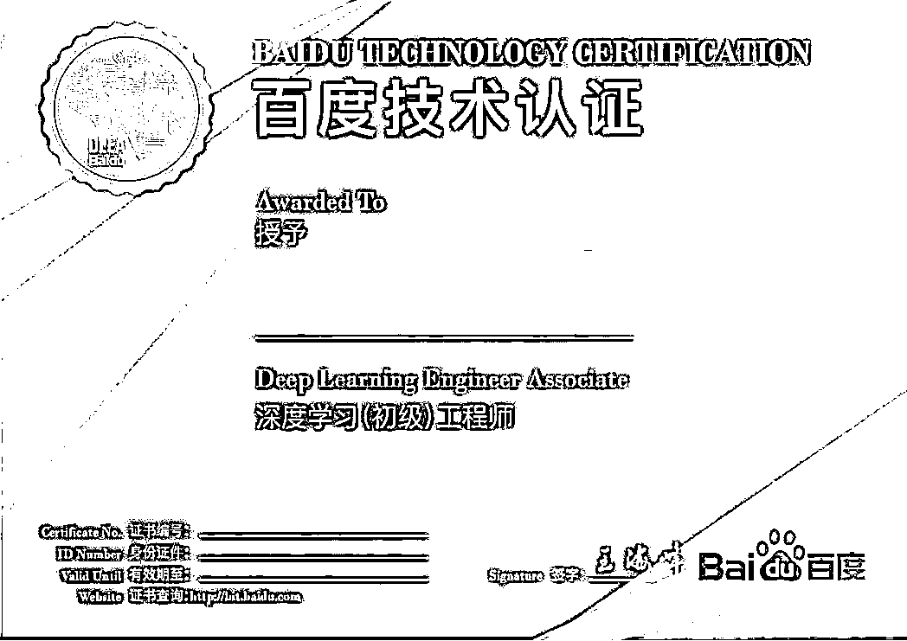
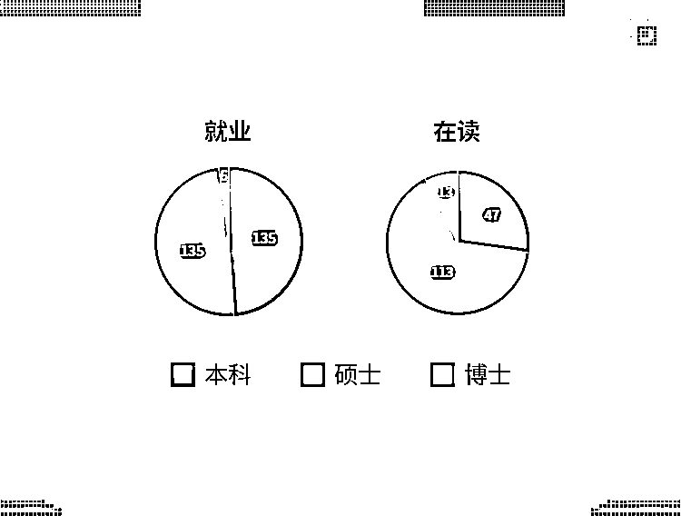

# 华为花 200W 招的那位研究生，研究方向到底是什么？

> 原文：[`mp.weixin.qq.com/s?__biz=MzAxNTc0Mjg0Mg==&mid=2653293937&idx=1&sn=8729faaac4bd37a9af888690f1b603b1&chksm=802dcf64b75a4672bfce4b2a9f88004be5eb42b78c25e8b952e09fba14a638b715202bb35fc0&scene=27#wechat_redirect`](http://mp.weixin.qq.com/s?__biz=MzAxNTc0Mjg0Mg==&mid=2653293937&idx=1&sn=8729faaac4bd37a9af888690f1b603b1&chksm=802dcf64b75a4672bfce4b2a9f88004be5eb42b78c25e8b952e09fba14a638b715202bb35fc0&scene=27#wechat_redirect)

**标星★公众号     **爱你们♥

2019 年计算机科学最高奖金图灵奖，授予了三位 AI 领域的杰出科学家：Geoffrey Hinton， Yann LeCun，和 Yoshua Bengio。人工智能尤其是基于深度学习的人工智能，在科学界获得了最高的认可。

在产业界，前阵子朋友圈又被华为刷屏了，总裁办发布通知，宣布对 8 位 2019 届应届博士毕业生实行年薪管理制度，研究人工智能的钟钊博士位居榜首，年薪高达**201 万**！

****

**在全球步入人工智能领域的时代，各大科技巨头企业纷纷布局，百度抓住机会抢得先机，成为全球第四家、国内第一家将人工智能技术开源的全球科技巨头。**百度**在自动驾驶、语音识别、自然语言处理和智能搜索与智能推荐等核心 AI 领域的科创专利**名列榜首**。**

**点击视频观看百度 AI 行业应用实例：**

 **[`v.qq.com/iframe/preview.html?width=500&height=375&auto=0&vid=d0762cwn05t`](https://v.qq.com/iframe/preview.html?width=500&height=375&auto=0&vid=d0762cwn05t)** 

**点击视频观看 PaddlePaddle 应用实例：**

 **[`v.qq.com/iframe/preview.html?width=500&height=375&auto=0&vid=g0909xz88mo`](https://v.qq.com/iframe/preview.html?width=500&height=375&auto=0&vid=g0909xz88mo)** 

**即使**百度作为国内 AI 行业的领军者**，但在 AI 项目中依然**缺乏有实践经验具备可实际解决问题能力的 AI 工程师**，为解决这一难题，百度飞桨与国内**在线 IT 教育独角兽开课吧**首次深度合作，联合设计本门课程，旨在培养具有核心竞争力的 AI 工程师。** 

****你距离大厂也许只差一次系统性训练！****

******仅 99 个名额，报满截止！******

************************

******百度精选**6 大真实复杂项目**，作为本课程实战内容。其复杂程度和难度都是常见实践项目的数倍，旨在筛选和培养出更具有实战能力的高阶工程师。******

******开课吧集结逾**50 人精英**教研团队，**历经 200 天，花费数百万**，将 6 大项目开发为实践课程，拆解成**24 个纳米知识点和对应应用案例**，让学员知其然亦知其所以然，并真正得到宝贵的实战经验。******

************************

******导师团队均为业界资深专家，**人工智能算法专家高民权老师**带队授课。与强者共事，才能更快的成就自我。******

************************************************************

******<<<滑动查看课程大纲>>>******

************************************

******<<<滑动查看课程大纲>>>******

************************************

******<<<滑动查看课程大纲>>>******

************************************

******<<<滑动查看课程大纲>>>******

************************

******<<<滑动查看课程大纲>>>******

************************

******<<<滑动查看课程大纲>>>******

************

******本课程全程将为你提供百度**AI Studio 实践平台**以及**GPU 算力卡**，人手充沛的工业级顶级**NVIDIA Tesla V100 计算资源**，让训练不宕机、学习不停歇！******

************************

******让您一次性学会国内外主流机器学习框架**PaddlePaddle+Tensorflow+ PyTorch。********

********飞桨(PaddlePaddle)**是集深度学习核心框架、工具组件和服务平台为一体的技术先进、功能完备的开源深度学习平台，提供丰富的官方支持模型集合，并推出全类型的高性能部署和集成方案供开发者使用。******

************

******学员报名需基础测试达标方可入学，每门课程**仅招收 99 名学员（共分 20 组）**，最终产出**60 个可上线产品**。你会体会到真实开发且技能高速成长的新世界。******

************

******本课程打破传统授课局限，**带领优秀学员走进百度**，直面技术专家及行业高管，面对面深度交流，了解你未知的行业发展。******

************

******本课程通过考核，获得足够学分的优秀学员将取得含金量极高的**《开课吧 - 百度飞桨资深 AI 工程师证书》**，完成学习的学员将有能力直接报考**“百度深度学习认证考试”**。******

************************************

******前 20%优秀学员有机会**内推**进入百度及生态合作伙伴面试**绿色通道**，就业金牌班学员完成课程进不了大厂全额退款！******

******除了进入百度的机会以外，**更有上千家已签约优质公司将按照本专业学分榜单“拍卖式”双选抢人**！******

******另外，开课吧与上万名猎头达成合作关系，在毕业学生中，直接“猎聘”。******

******更有智联招聘/拉勾网招聘置顶等便利，脉脉职场 APP 专属徽章展示等特权。******

************

******目前学院的毕业生，有求职意愿的学员中**80%**同学已经拿到国内外名企 AI、算法相关 Offer 或国外名校 AI 相关录取 Offer，已就业同学**平均薪资超过 27 万**。******

********往期学员构成********

****************

******名企就业现状******

********

******往期学员评价******

********

****（为保护学员个人隐私，隐去学员姓名）****

****关于学员的其他信息可报名后与咨询老师进行确认****

****若有虚假信息愿承受法律责任****

********

******  通关提升班原价：35800  ******

******通关提升班现价：23800******

******就业金牌班：49800******

******  请长按识别下方二维码报名  ******

********

********关于就业金牌班********

******报名就业金牌班的同学，报名伊始既签订协议，若完成课程进不了大厂或者初始就业税前薪资低于 25.6 万/年，则**退还全部学费。********

******关于学费分期******

******本课程为同学们提供**3/6/12 期分期服务。********

******关于奖学金******

******满足以下任意条件的学员可**减免 50%的学费****（名额仅限前 20 位，先到先得）**：******

*   ****具有 QS 或 US News 世界排名前 150 名学校的硕士、博士学位或者正在攻读其硕士、博士学位的；**** 

*   ****Github 2018 年提交次数达到 150 次的；****

*   ****ACM、MCM 竞赛获得亚洲区或国际一等奖及以上的；****

*   ****kaggle，天池竞赛获得过前 10%成绩的 ；****

*   ****目前就职于 Google, Facebook, Linkin, Amazon, BAT 或者估值超过 10 亿美金公司工程师职位的；****

******关于学费减免券******

******另外，如果不满足以上奖学金条件，**自报名起 3 天内编程测试题达 100 分者**可联系教务老师，领取**5000 元学费减免券****（名额仅限前 30 位，此优惠券不可与奖学金同时使用）********

********

******  请长按识别下方二维码  ******

******  报名后查看编程测试题  ******

********

******奖学金榜单******

********截至 8 月 13 日，我们已收到 50 余份奖学金申请**，名额有限，**发放名单以付款时间为准**，最终奖学金学员名单如下：******

********

******你将与来自 QS 世界排名前 150 名的名校高材生、BAT 等估值超 10 亿美金的一线大厂工程师为伴，一同完成各大真实项目，相互激励，飞速成长！******

******学费减免券也只剩部分名额**，请想要报名的学员**预报从速！******

********

******Q1：大厂的定义？******

****Google, Facebook, LinkedIn, Amazon, BAT 或者市值/估值超过 10 亿美金以上的公司。****

******Q2：这期课程什么时候开课？上课时间是？******

****2019 年 9 月 1 日-2020 年 3 月 1 日，为期 6 个月，上课时间为**每周二、四 20：00-22:00。******

******Q3：这个报了名就能上课吗？******

****由于课程深度对标百度 T6（或阿里巴巴 P7 级别），要能完成以上学习任务需要具备一定的学习能力。至少具备本科学位，硕士及以上学位更佳，每周能投入 6 小时以上，至少熟悉一门编程语言，能够使用 Python 完成入学编程自测题。****

******Q4：我们这个课程适合什么样的学生？******

****本课程尤其适合：****

*   ****IT 相关岗位在职，希望从事人工智能、机器学习算法相关工作；****

*   ****谋求 BAT 及顶尖独角兽企业人工智能、机器学习算法相关工作；****

*   ****计算机相关专业的重点本科生、研究生或博士生，希望丰富实践经验，参与名企真实 AI 项目；****

*   ****编程能力满足本课程要求，希望转行从事人工智能、机器学习算法相关工作；****

******Q5：课程中可以提供什么服务或福利？******

****整个课程中，我们按照**在线直播+课后视频+课后答疑+导师带队+分组实践+在线实验+就业指导**的授课形式，为学生**提供 0 阻力学习服务。******

****另外，我们也为学员提供以下福利：****

*   ****坐标北京后厂村的学员来开课吧，可以免费预约使用自习室，和课程导师当面交流；****

*   ******全员人手价值 5000 元的 TeslaV100 算力卡；******

*   ****前 40 位报名付款的学员，免费获得**百度深度学习认证考试 1000 元考试券 2 张；******

*   ****前 41-100 位报名付款的学员，免费获得**百度深度学习认证考试 500 元考试券 1 张。******

******Q6：课程是否提供试听课？******

****我们的课程不提供任何试听。****

****但我们支持学生**开课 10 天无理由退款**：在正式课程开始的前 10 天，学员可提出退款，课程组将无理由退还全部学费。****

******Q7：有没有线下活动呢？******

****有的，活动安排如下：****

******活动一：******

****前沿学术探讨与一线企业实践分享，报名的优秀学员将获得参加资格，主办方将负担学员在北京期间的食宿，并组织线下深度学术探讨并与名企大厂面对面交流。我们将会邀请到 stanford，mit，CMU 等世界名校的博士或者研究员，百度，滴滴，微软等中国知名企业一线研究员进行交流。****

******活动二：******

****组队并进行实践项目**hacksoon（黑客马拉松）**，对于第一名提供人民币 5 万元，第二名人民币 3 万元，第三名人民币 1 万元的奖励。****

******活动三：******

****优秀学员参观百度科技园，举行证书颁发仪式和百度绿色通道面试邀请。****

****（活动具体情况以主办方实际活动策划为准。）****

****最后，感谢大家阅读至此，希望之后能与大家度过一个忙碌而又丰富的学习历程。****

****有意向的学员可**尽快扫描下方二维码进行预报名或者进行咨询**，本课程**仅限 99 个名额**，报满截止。****

********

******** 

****注：****

****1\. 报名时需要手机接收验证信息，在海外不能接收信息的同学请将个人信息发送至**course@computing-intelligence.com******

****2\. 准到上显示的报名人数为预报名人数，并非最终通过测试参加课程的学员人数****