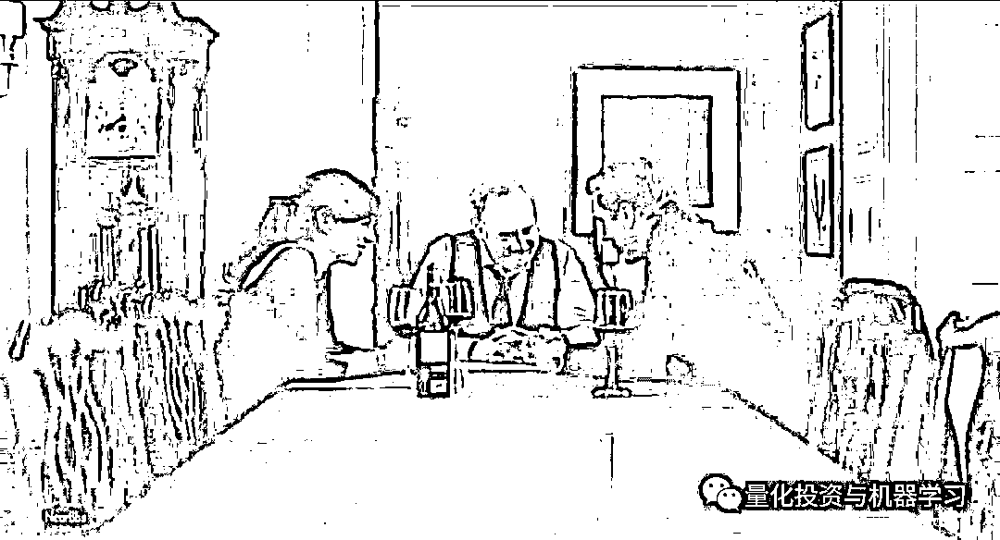

# 扒一扒 Billions 第四季：你必须知道的投资秘密（中）

> 原文：[`mp.weixin.qq.com/s?__biz=MzAxNTc0Mjg0Mg==&mid=2653293936&idx=1&sn=59f47b30f8b0a9468328ed8515d76f78&chksm=802dcf65b75a4673a642430965d9bafc853b26be01804153be196ab0a8afef9272cf3e6f4805&scene=27#wechat_redirect`](http://mp.weixin.qq.com/s?__biz=MzAxNTc0Mjg0Mg==&mid=2653293936&idx=1&sn=59f47b30f8b0a9468328ed8515d76f78&chksm=802dcf65b75a4673a642430965d9bafc853b26be01804153be196ab0a8afef9272cf3e6f4805&scene=27#wechat_redirect)

**标星★公众号     **爱你们♥

**近期原创文章：**

## ♥ [5 种机器学习算法在预测股价的应用（代码+数据）](https://mp.weixin.qq.com/s?__biz=MzAxNTc0Mjg0Mg==&mid=2653290588&idx=1&sn=1d0409ad212ea8627e5d5cedf61953ac&chksm=802dc249b75a4b5fa245433320a4cc9da1a2cceb22df6fb1a28e5b94ff038319ae4e7ec6941f&token=1298662931&lang=zh_CN&scene=21#wechat_redirect)

## ♥ [Two Sigma 用新闻来预测股价走势，带你吊打 Kaggle](https://mp.weixin.qq.com/s?__biz=MzAxNTc0Mjg0Mg==&mid=2653290456&idx=1&sn=b8d2d8febc599742e43ea48e3c249323&chksm=802e3dcdb759b4db9279c689202101b6b154fb118a1c1be12b52e522e1a1d7944858dbd6637e&token=1330520237&lang=zh_CN&scene=21#wechat_redirect)

## ♥ 2 万字干货：[利用深度学习最新前沿预测股价走势](https://mp.weixin.qq.com/s?__biz=MzAxNTc0Mjg0Mg==&mid=2653290080&idx=1&sn=06c50cefe78a7b24c64c4fdb9739c7f3&chksm=802e3c75b759b563c01495d16a638a56ac7305fc324ee4917fd76c648f670b7f7276826bdaa8&token=770078636&lang=zh_CN&scene=21#wechat_redirect)

## ♥ [机器学习在量化金融领域的误用！](http://mp.weixin.qq.com/s?__biz=MzAxNTc0Mjg0Mg==&mid=2653292984&idx=1&sn=3e7efe9fe9452c4a5492d2175b4159ef&chksm=802dcbadb75a42bbdce895c49070c3f552dc8c983afce5eeac5d7c25974b7753e670a0162c89&scene=21#wechat_redirect)

## ♥ [基于 RNN 和 LSTM 的股市预测方法](https://mp.weixin.qq.com/s?__biz=MzAxNTc0Mjg0Mg==&mid=2653290481&idx=1&sn=f7360ea8554cc4f86fcc71315176b093&chksm=802e3de4b759b4f2235a0aeabb6e76b3e101ff09b9a2aa6fa67e6e824fc4274f68f4ae51af95&token=1865137106&lang=zh_CN&scene=21#wechat_redirect)

## ♥ [如何鉴别那些用深度学习预测股价的花哨模型？](https://mp.weixin.qq.com/s?__biz=MzAxNTc0Mjg0Mg==&mid=2653290132&idx=1&sn=cbf1e2a4526e6e9305a6110c17063f46&chksm=802e3c81b759b597d3dd94b8008e150c90087567904a29c0c4b58d7be220a9ece2008956d5db&token=1266110554&lang=zh_CN&scene=21#wechat_redirect)

## ♥ [优化强化学习 Q-learning 算法进行股市](https://mp.weixin.qq.com/s?__biz=MzAxNTc0Mjg0Mg==&mid=2653290286&idx=1&sn=882d39a18018733b93c8c8eac385b515&chksm=802e3d3bb759b42d1fc849f96bf02ae87edf2eab01b0beecd9340112c7fb06b95cb2246d2429&token=1330520237&lang=zh_CN&scene=21#wechat_redirect)

## ♥ [WorldQuant 101 Alpha、国泰君安 191 Alpha](https://mp.weixin.qq.com/s?__biz=MzAxNTc0Mjg0Mg==&mid=2653290927&idx=1&sn=ecca60811da74967f33a00329a1fe66a&chksm=802dc3bab75a4aac2bb4ccff7010063cc08ef51d0bf3d2f71621cdd6adece11f28133a242a15&token=48775331&lang=zh_CN&scene=21#wechat_redirect)

## ♥ [基于回声状态网络预测股票价格（附代码）](https://mp.weixin.qq.com/s?__biz=MzAxNTc0Mjg0Mg==&mid=2653291171&idx=1&sn=485a35e564b45046ff5a07c42bba1743&chksm=802dc0b6b75a49a07e5b91c512c8575104f777b39d0e1d71cf11881502209dc399fd6f641fb1&token=48775331&lang=zh_CN&scene=21#wechat_redirect)

## ♥ [计量经济学应用投资失败的 7 个原因](https://mp.weixin.qq.com/s?__biz=MzAxNTc0Mjg0Mg==&mid=2653292186&idx=1&sn=87501434ae16f29afffec19a6884ee8d&chksm=802dc48fb75a4d99e0172bf484cdbf6aee86e36a95037847fd9f070cbe7144b4617c2d1b0644&token=48775331&lang=zh_CN&scene=21#wechat_redirect)

## ♥ [配对交易千千万，强化学习最 NB！（文档+代码）](http://mp.weixin.qq.com/s?__biz=MzAxNTc0Mjg0Mg==&mid=2653292915&idx=1&sn=13f4ddebcd209b082697a75544852608&chksm=802dcb66b75a4270ceb19fac90eb2a70dc05f5b6daa295a7d31401aaa8697bbb53f5ff7c05af&scene=21#wechat_redirect)

## ♥ [关于高盛在 Github 开源背后的真相！](https://mp.weixin.qq.com/s?__biz=MzAxNTc0Mjg0Mg==&mid=2653291594&idx=1&sn=7703403c5c537061994396e7e49e7ce5&chksm=802dc65fb75a4f49019cec951ac25d30ec7783738e9640ec108be95335597361c427258f5d5f&token=48775331&lang=zh_CN&scene=21#wechat_redirect)

## ♥ [新一代量化带货王诞生！Oh My God！](https://mp.weixin.qq.com/s?__biz=MzAxNTc0Mjg0Mg==&mid=2653291789&idx=1&sn=e31778d1b9372bc7aa6e57b82a69ec6e&chksm=802dc718b75a4e0ea4c022e70ea53f51c48d102ebf7e54993261619c36f24f3f9a5b63437e9e&token=48775331&lang=zh_CN&scene=21#wechat_redirect)

## ♥ [独家！关于定量/交易求职分享（附真实试题）](https://mp.weixin.qq.com/s?__biz=MzAxNTc0Mjg0Mg==&mid=2653291844&idx=1&sn=3fd8b57d32a0ebd43b17fa68ae954471&chksm=802dc751b75a4e4755fcbb0aa228355cebbbb6d34b292aa25b4f3fbd51013fcf7b17b91ddb71&token=48775331&lang=zh_CN&scene=21#wechat_redirect)

## ♥ [Quant 们的身份危机！](https://mp.weixin.qq.com/s?__biz=MzAxNTc0Mjg0Mg==&mid=2653291856&idx=1&sn=729b657ede2cb50c96e92193ab16102d&chksm=802dc745b75a4e53c5018cc1385214233ec4657a3479cd7193c95aaf65642f5f45fa0e465694&token=48775331&lang=zh_CN&scene=21#wechat_redirect)

## ♥ [拿起 Python，防御特朗普的 Twitter](https://mp.weixin.qq.com/s?__biz=MzAxNTc0Mjg0Mg==&mid=2653291977&idx=1&sn=01f146e9a88bf130ca1b479573e6d158&chksm=802dc7dcb75a4ecadfdbdace877ed948f56b72bc160952fd1e4bcde27260f823c999a65a0d6d&token=48775331&lang=zh_CN&scene=21#wechat_redirect)

## ♥ [AQR 最新研究 | 机器能“学习”金融吗？](http://mp.weixin.qq.com/s?__biz=MzAxNTc0Mjg0Mg==&mid=2653292710&idx=1&sn=e5e852de00159a96d5dcc92f349f5b58&chksm=802dcab3b75a43a5492bc98874684081eb5c5666aff32a36a0cdc144d74de0200cc0d997894f&scene=21#wechat_redirect)

作者：蹲哥 | 加里敦蹲哥

**前言**

第三季末时，查克为扳倒腐败的联邦检察长却遭手下背叛，失去职位。而鲍比也因自己的雇员自立门户而多了一个强敌。季末，查克、温迪和鲍比三人同坐一桌，昔日的对手现今一笑抹恩仇，你能想象这三人如果联手起来会发生什么吗？

这部剧，能让你们真正见识到什么叫**“有钱任性”**，什么才是**“为所欲为”**。以及：

**想要拥有这样的财富，需要付出什么代价**

如果你还意犹未尽或第一次观看：

**第 1、2、3、4 季资源我们全部帮你整理好**

**文末查看**

今天**蹲哥**为大家扒一扒 Billions 第四季那些你必须知道的投资知识！**超精彩！**

本期带来第 5 集~第 8 集。

[**这里查看看：****第 1 集~第 4 集**](http://mp.weixin.qq.com/s?__biz=MzAxNTc0Mjg0Mg==&mid=2653293801&idx=1&sn=00e71e5179b99ac8cf60ecebf996d37c&chksm=802dcefcb75a47ea118e5c20195a85ceabd4785eacc67a31c380450a856219ffd9b50466429e&scene=21#wechat_redirect)

**第五集**

这集无论是 john rice 的背叛还是 taylor 能从纽约消防基金拿到投资，都涉及到了 bobby 的历史问题-第一季的交代，他是 911 事件的幸存者，当时恰好不在办公室，并且通过做空航空股发了横财，然后成立一个基金会，供已经遇难的其他所有合伙人的孩子读书生活，这个 john rice 就是在他的这个基金会支持下才上的商学院，并捐给纽约消防基金会 1 亿美刀。

其实 bobby 在做空航空股这个行为上不涉及道德问题，航空股下跌的根本原因不是有人做空，而是原来的股东在抛售，抛售的人是在保护自己的资产，这种行为更跟道不道德无关了，做空合法合规，谁都没伤害，而且 bobby 赚了大钱，他的已经遇难的同事还大大受益了，所以我个人觉得这个 john rice 对 bobby 说那些话确实太出格了（纽约消防基金的人特么也是脑残），到岸上他自己也反应过来了想挽回下，他表面是说我看不惯你这个人的行为处事，但我想还有一点为什么我的父亲过世了，而你不仅幸存还发了大财的那种酸酸的心态，这个酸酸的心态大概率继承之他的父亲，他的父亲当年在公司的绩效肯定是远不如 bobby 的。一个晚辈指摘前辈的做人问题也是混社会大忌，况且这个前辈给你的事业巨大的帮助，给钱上商学院、给钱投资、给背书......

后面 john rice 被 wags 狠狠教训，反向背书、造谣离婚、抢客户资金......

taylor 则利用了纽约消防基金的愚蠢（讨厌 bobby）拿到了资金.....

司法部长只能通过威胁州长来限制 chuck 的权力，他自己是干不了的，chuck 现在是纽约州总检察长 New York State AG，是民选的地方官，而联邦制美国的**州自治权是独立性很强**的，司法部长是没权炒掉民选的州检察长的，所以 chuck 需要搞定的是纽约州议会。

延伸：州权主义

1957 年，阿肯色州长公然拒绝执行联邦宪法，蔑视联邦法院关于黑白学生共校的裁决，为了阻止 9 名黑人学生上学，竟然派国民警卫队占领了小石城中心高中，封锁学校，禁止黑人学生入学。随后，总统艾森豪威尔也毫不示弱，命令美军 101 空降师出动，占领了小石城，并暂时直接控制了州国民警卫队，在全副武装的空降兵护送下，黑人孩子最终得以入学。

**第六集**

这集那个地中海玩弄 wags 的**Kappa Beta Phi**俱乐部，是真实存在的华尔街顶级富豪社团，wags 提到的这三个名字也都是真实的顶级大佬，bloomberg 老板，亿万富翁投资人 ken langone，还有本公众号提过好多次的传奇对冲基金经理-**Paul tudor jones**，这个社团的规矩：新人在这个社团的第一次亮相必须穿上奇装异服来表演，所以 wags......不忍直视....

这个社团现在的会长是前投资人现美国商务部长 Wilbur Ross，贸易战新闻经常能看到的那个老头儿..

taylor 约 wendy 在有罗斯福头像的地方，是设计大师 Louis kahn 的作品，kahn 属于大器晚成，50 多岁才成名，去世时财务状况也不好已经破产，他儿子在 2004 年拍了关于他的纪录片得了奥斯卡提名，不过他不是一个好父亲，对子女比较冷漠的那种，他找过三个老婆抑或情人，每个都生了孩子。通过和 taylor 的谈话，wendy 马上意识到 taylor 这是在映射她自己和父亲的关系，从这里也可以看出这个时候 taylor 是真的信任 wendy 了，毕竟把自己的心史都拿出来给作为心理学家的 wendy 听了.....想起一句话，投资或商业交流中，**当一个人谈起另一个人，他谈的其实始终是自己**。

victor 部分，bobby 委托给他操作是第一季的事，当时经了 taylor 的手...

bobby 没想出把那个公司买下，怎么他女朋友想到了？有时候人会被思维局限住，bobby 就觉得自己特么和纽约总检察长是铁哥们，脑子里就只想着通过关系渠道解决，撞墙了也没反应过来其实可以通过合理合法的途径解决，有点当局者迷旁观者清的意思。

taylor 父亲这个项目，他有点怕自己的黑历史被人查到，投资人也是要做尽职调查的，所以他一开始的打算，只要自己的女儿投资就行了不要别人，taylor 拿到了当年的档案资料，完全摊开说，说服了他接受外部投资（we can't hide secrets and live on false memories）。

taylor 父亲这个人吧，充满主观臆断、自负（自己最聪明，领导都不行）、缺乏情商，挺典型的那种理工男的缺点，优点是在自己专业上真的聪明有创造力....

wendy 通过和 taylor 的聊天，还有纯良青年-马菲的聊天，摸清了 taylor 和他父亲的项目概况，还有投资方是谁（Hall 摆了一连串拍到的人物照片其中做初创投资的那个）......

看完这集，讲真心理上有点不适，产生了厌倦这种勾心斗角剧情的情绪，wendy 太可怕了

**第七集**

著名金融交易作家斯瓦格曾经问 billions 本剧最开始的原型（后面其实有了其他人的影子比如 ray dalio）steven cohen ，你有没有考虑过兑现筹码，退出江湖？steven 回答：我对退休毫无兴趣，我没有任何别的事好做，我不想去打高尔夫...

事实也是如此，cohen 每年去看父母或者休假，一定要多订一间房间，他的顾问团队会提前去 ， 按办公室的原样， 安装一个交易工作站......

出生贫寒、父亲早逝（bobby 语只有当一个男孩亲手埋葬他的父亲时才能成长为一个真正的男人）、野鸡大学毕业、小时候当高尔夫球童受尽富人冷眼、拥有无穷无尽进取心、为了财富可以不择手段的 bobby 很难理解孤寡老头布鲁诺要去美国南部温暖区颐养天年的想法，总是更有同理心的女人点醒了他，也才有本集最后这群人难得有的温馨时刻，这两集的剧情有太多人性负面的东西，作为观众也确实到了需要治愈一下的时刻.....

chuck 这样含着金钥匙出生的富二代的童年就是无忧无虑的么？一个非常强势有能力的父亲扭曲了他的性格以至于成年需要定期接受 sm 治疗，而且这个父亲还经常在他面前精神暴力他的母亲，这里也解释了为什么之前 chuck 总是流露出那种强烈的弑父的心绪........（按弗洛伊德理论：每个人心中都潜藏着“弑父娶母”的情结 ）

taylor 的父亲是什么样的呢？就如上集 taylor 提到 louis kahn，这是一个对家庭、对子女情感付出很少的父亲（他自己都说自己冷漠），数学天才大概率是沉浸在自己的世界里面的，世俗世界？不存在的。对大部分人来说，没错是很崇拜天才，但一定不会想和天才生活在一起，更不用说这还是一个充满了各种负面情绪的落魄天才（被开除失业）.....

taylor 父亲这个项目属于航天航空行业，涉及到国家安全方面，bobby 金钱+性贿赂监管部门导致 zf 强制收购这个项目，taylor 可以上诉，但需要两三年，项目直接投资方听到这个讯息立即就要撤资，投资在对冲基金的消防基金也要撤资，对方认为，你如果全力搞你父亲的项目还要对抗 zf 上诉肯定会牵扯精力，会影响对冲基金的运营，你要么选你父亲的项目，要么选我，这么大的资金要撤资，公司面临生死存亡...

瑞贝卡出一亿投资，相当于掌握了公司的控制权（实控人），taylor 担心父亲的股份比例太少后面会被驱逐出局，拒绝了，这里我们没搞懂，taylor 也有自己的情报主管，瑞贝卡和 bobby 的关系不难查啊...

马菲的暴怒，纯良之人的暴怒最为触动人心，一击即中-wendy 夜跑爆哭..

各个主角目前的家庭状况：

bobby 早已离婚、chuck 也有婚姻危机、taylor 和父亲的关系

天问

家庭和事业如何平衡？

**第八集**

这集太极学徒 taylor 就来玩了个借力打力

这集观感很一般，国外风评在 IMDB 也拿了本季的最低分，并且是全部四季的次低分..

没有经过长期训练的业余水平，比赛也就这样了-体能压根坚持不了多久，两个一起躺...

**1-4 季视频下载**

在**后台**输入（严格大小写）

**手慢无**

***Billions_ 全 4 季***

*—End—*

量化投资与机器学习微信公众号，是业内垂直于**Quant**、**MFE**、**CST、AI**等专业的**主****流量化自媒体**。公众号拥有来自**公募、私募、券商、银行、海外**等众多圈内**10W+**关注者。每日发布行业前沿研究成果和最新量化资讯。

你点的每个“在看”，我都认真当成了喜欢