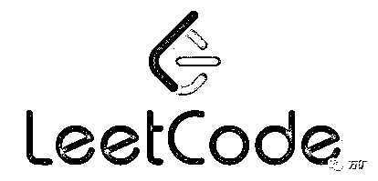
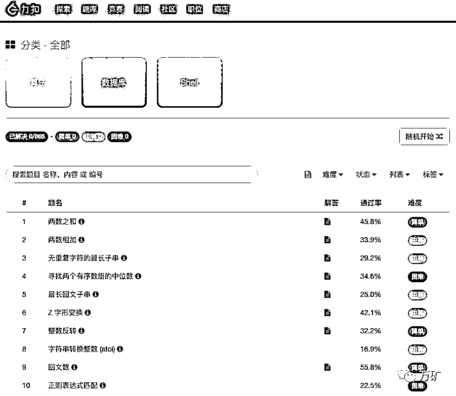
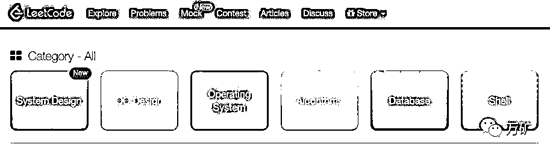
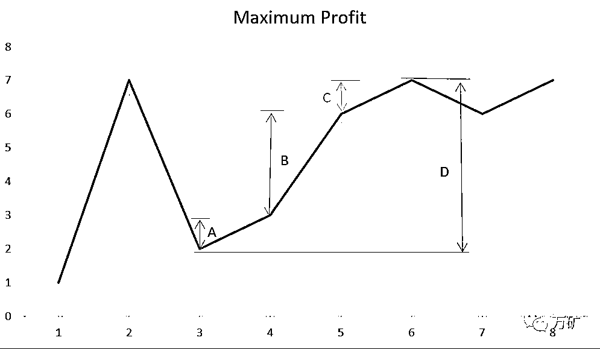
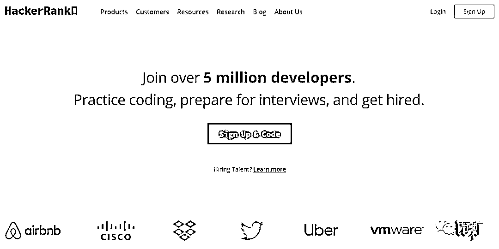

# Quant 面试时说：熟练掌握 Python，请三思，不然凉凉~

> 原文：[`mp.weixin.qq.com/s?__biz=MzAxNTc0Mjg0Mg==&mid=2653293923&idx=1&sn=5a010445d08471b54ff6b43c665a73a3&chksm=802dcf76b75a466038da4fae0dbc3cb1964f7ec50ddf2c085bffbcf30a2144998e4894f69866&scene=27#wechat_redirect`](http://mp.weixin.qq.com/s?__biz=MzAxNTc0Mjg0Mg==&mid=2653293923&idx=1&sn=5a010445d08471b54ff6b43c665a73a3&chksm=802dcf76b75a466038da4fae0dbc3cb1964f7ec50ddf2c085bffbcf30a2144998e4894f69866&scene=27#wechat_redirect)


**标星★公众号     **爱你们♥

**近期原创文章：**

## ♥ [5 种机器学习算法在预测股价的应用（代码+数据）](https://mp.weixin.qq.com/s?__biz=MzAxNTc0Mjg0Mg==&mid=2653290588&idx=1&sn=1d0409ad212ea8627e5d5cedf61953ac&chksm=802dc249b75a4b5fa245433320a4cc9da1a2cceb22df6fb1a28e5b94ff038319ae4e7ec6941f&token=1298662931&lang=zh_CN&scene=21#wechat_redirect)

## ♥ [Two Sigma 用新闻来预测股价走势，带你吊打 Kaggle](https://mp.weixin.qq.com/s?__biz=MzAxNTc0Mjg0Mg==&mid=2653290456&idx=1&sn=b8d2d8febc599742e43ea48e3c249323&chksm=802e3dcdb759b4db9279c689202101b6b154fb118a1c1be12b52e522e1a1d7944858dbd6637e&token=1330520237&lang=zh_CN&scene=21#wechat_redirect)

## ♥ 2 万字干货：[利用深度学习最新前沿预测股价走势](https://mp.weixin.qq.com/s?__biz=MzAxNTc0Mjg0Mg==&mid=2653290080&idx=1&sn=06c50cefe78a7b24c64c4fdb9739c7f3&chksm=802e3c75b759b563c01495d16a638a56ac7305fc324ee4917fd76c648f670b7f7276826bdaa8&token=770078636&lang=zh_CN&scene=21#wechat_redirect)

## ♥ [机器学习在量化金融领域的误用！](http://mp.weixin.qq.com/s?__biz=MzAxNTc0Mjg0Mg==&mid=2653292984&idx=1&sn=3e7efe9fe9452c4a5492d2175b4159ef&chksm=802dcbadb75a42bbdce895c49070c3f552dc8c983afce5eeac5d7c25974b7753e670a0162c89&scene=21#wechat_redirect)

## ♥ [基于 RNN 和 LSTM 的股市预测方法](https://mp.weixin.qq.com/s?__biz=MzAxNTc0Mjg0Mg==&mid=2653290481&idx=1&sn=f7360ea8554cc4f86fcc71315176b093&chksm=802e3de4b759b4f2235a0aeabb6e76b3e101ff09b9a2aa6fa67e6e824fc4274f68f4ae51af95&token=1865137106&lang=zh_CN&scene=21#wechat_redirect)

## ♥ [如何鉴别那些用深度学习预测股价的花哨模型？](https://mp.weixin.qq.com/s?__biz=MzAxNTc0Mjg0Mg==&mid=2653290132&idx=1&sn=cbf1e2a4526e6e9305a6110c17063f46&chksm=802e3c81b759b597d3dd94b8008e150c90087567904a29c0c4b58d7be220a9ece2008956d5db&token=1266110554&lang=zh_CN&scene=21#wechat_redirect)

## ♥ [优化强化学习 Q-learning 算法进行股市](https://mp.weixin.qq.com/s?__biz=MzAxNTc0Mjg0Mg==&mid=2653290286&idx=1&sn=882d39a18018733b93c8c8eac385b515&chksm=802e3d3bb759b42d1fc849f96bf02ae87edf2eab01b0beecd9340112c7fb06b95cb2246d2429&token=1330520237&lang=zh_CN&scene=21#wechat_redirect)

## ♥ [WorldQuant 101 Alpha、国泰君安 191 Alpha](https://mp.weixin.qq.com/s?__biz=MzAxNTc0Mjg0Mg==&mid=2653290927&idx=1&sn=ecca60811da74967f33a00329a1fe66a&chksm=802dc3bab75a4aac2bb4ccff7010063cc08ef51d0bf3d2f71621cdd6adece11f28133a242a15&token=48775331&lang=zh_CN&scene=21#wechat_redirect)

## ♥ [基于回声状态网络预测股票价格（附代码）](https://mp.weixin.qq.com/s?__biz=MzAxNTc0Mjg0Mg==&mid=2653291171&idx=1&sn=485a35e564b45046ff5a07c42bba1743&chksm=802dc0b6b75a49a07e5b91c512c8575104f777b39d0e1d71cf11881502209dc399fd6f641fb1&token=48775331&lang=zh_CN&scene=21#wechat_redirect)

## ♥ [计量经济学应用投资失败的 7 个原因](https://mp.weixin.qq.com/s?__biz=MzAxNTc0Mjg0Mg==&mid=2653292186&idx=1&sn=87501434ae16f29afffec19a6884ee8d&chksm=802dc48fb75a4d99e0172bf484cdbf6aee86e36a95037847fd9f070cbe7144b4617c2d1b0644&token=48775331&lang=zh_CN&scene=21#wechat_redirect)

## ♥ [配对交易千千万，强化学习最 NB！（文档+代码）](http://mp.weixin.qq.com/s?__biz=MzAxNTc0Mjg0Mg==&mid=2653292915&idx=1&sn=13f4ddebcd209b082697a75544852608&chksm=802dcb66b75a4270ceb19fac90eb2a70dc05f5b6daa295a7d31401aaa8697bbb53f5ff7c05af&scene=21#wechat_redirect)

## ♥ [关于高盛在 Github 开源背后的真相！](https://mp.weixin.qq.com/s?__biz=MzAxNTc0Mjg0Mg==&mid=2653291594&idx=1&sn=7703403c5c537061994396e7e49e7ce5&chksm=802dc65fb75a4f49019cec951ac25d30ec7783738e9640ec108be95335597361c427258f5d5f&token=48775331&lang=zh_CN&scene=21#wechat_redirect)

## ♥ [新一代量化带货王诞生！Oh My God！](https://mp.weixin.qq.com/s?__biz=MzAxNTc0Mjg0Mg==&mid=2653291789&idx=1&sn=e31778d1b9372bc7aa6e57b82a69ec6e&chksm=802dc718b75a4e0ea4c022e70ea53f51c48d102ebf7e54993261619c36f24f3f9a5b63437e9e&token=48775331&lang=zh_CN&scene=21#wechat_redirect)

## ♥ [独家！关于定量/交易求职分享（附真实试题）](https://mp.weixin.qq.com/s?__biz=MzAxNTc0Mjg0Mg==&mid=2653291844&idx=1&sn=3fd8b57d32a0ebd43b17fa68ae954471&chksm=802dc751b75a4e4755fcbb0aa228355cebbbb6d34b292aa25b4f3fbd51013fcf7b17b91ddb71&token=48775331&lang=zh_CN&scene=21#wechat_redirect)

## ♥ [Quant 们的身份危机！](https://mp.weixin.qq.com/s?__biz=MzAxNTc0Mjg0Mg==&mid=2653291856&idx=1&sn=729b657ede2cb50c96e92193ab16102d&chksm=802dc745b75a4e53c5018cc1385214233ec4657a3479cd7193c95aaf65642f5f45fa0e465694&token=48775331&lang=zh_CN&scene=21#wechat_redirect)

## ♥ [拿起 Python，防御特朗普的 Twitter](https://mp.weixin.qq.com/s?__biz=MzAxNTc0Mjg0Mg==&mid=2653291977&idx=1&sn=01f146e9a88bf130ca1b479573e6d158&chksm=802dc7dcb75a4ecadfdbdace877ed948f56b72bc160952fd1e4bcde27260f823c999a65a0d6d&token=48775331&lang=zh_CN&scene=21#wechat_redirect)

## ♥ [AQR 最新研究 | 机器能“学习”金融吗？](http://mp.weixin.qq.com/s?__biz=MzAxNTc0Mjg0Mg==&mid=2653292710&idx=1&sn=e5e852de00159a96d5dcc92f349f5b58&chksm=802dcab3b75a43a5492bc98874684081eb5c5666aff32a36a0cdc144d74de0200cc0d997894f&scene=21#wechat_redirect)

**前言**

本文作者为美国投资银行的一名技术专家，他以自身的亲身经历，为我们讲述了当你在金融机构面试时，说会使用 Python 进行编程可能遇到的一些面试问题。 

作为一名投行的技术负责人，我面试过很多人，尤其是那些自称会使用 Python 编写代码的人。他们可能是程序员，也可能是知道如何编码的交易员。毕竟，Python 是一门拥有大量新手的语言，而且有很多人对自己 Python 的熟练程度夸大其词。

当你在面试的时候说：**“熟练掌握 Python。**”之前，你需要了解一下下面的一些问题。因为我在面试的过程中遇到了很多这样的求职者。

**什么是列表推导式？**

这似乎是一个容易回答的问题。这是创建新列表的一种简便方法。例如，为现有列表中的每个数字加 2： 

```py
new_list = [x + 2 for x in numbers]
```

但是面试官可能会问得更深入一些，比如：**“所以它等同于 for loop 追加到列表？**”之类的问题。一个天真的候选人会说：“是”。但事实并非如此。如果创建循环列表是在没有初始化元素的情况下，那么列表推导式比循环创建列表更有效。在列表推导式中，我们知道结果的大小，因此 Python 可以预先分配内存，这比动态添加到列表更有效。

如果面试官问：”直接在列表推导式中定义 lambda 表达式是否是一个好主意？“，求职者可能会变得更加紧张。**因此，即使作为一名经验丰富的开发人员，一个简单的问题就会让你很快就会陷入到细节之中，因为你不会有意识地思考日常工作。这****也是一个看真本事的时候，面试官很自然地会看到应聘者的知识有多深**。我的建议是：当你不知道一些事情时，不要慌张。可能后面的面试内容会是你比较拿手的。

**为什么 Python 是单线程的？**

在这里，面试官想知道你对**GIL 全局解释锁**（Global Interpreter Lock）的理解。Python 有线程包，但是在 Python 的某些版本中，全局解释器锁确保在任何给定的时间点上只能执行一个线程（它持有锁）。看起来好像是并行的，但实际上不是。它提高了单线程应用程序的速度，并使集成非线程安全的 C 库变得容易。

然后面试官可能会问：“我们能用 Python 并行运行任何东西吗？”。这时，他们希望你讨论进程与线程，以及 Python 拥有良好的多处理库这一事实。我们还可以将请求分配到计算池或像 Celery 这样的作业队列。全局解释器锁也不会停止线程同时处理许多输入/输出请求。锁是在线程等待请求完成时共享的，这对 3.2 之后的 Python 版本特别有效。

**不要失去理智**

在类似上面的面试中，你可能不知道所有的问题，但**关键要解决这个问题：**  

毋庸置疑，你应该**了解 Python 的主要语法元素**，比如**生成器、列表和元组之间的区别、lambda 表达式、过滤迭代器**等等。**了解核心数据结构的工作原**理是非常有用。例如，你经常会被问到字典是如何工作的。与静态类型和编译语言相比，你还应该**对该语言的类型系统和解释性质有自己的看法**。与其他任何语言一样，你应该确保在**HackerRank**和**Leetcode**这样的平台上刷过算法和数据结构的题。你还可以把代码写在纸上，并在你的脑海中练习运行代码，这也是很有用的！

顺便给大家介绍一下**HackerRank**和**Leetcode。**

****LeetCod****e****

LeetCode 是一个汇集了诸多算法题库的编程网站，许多开发者在初学算法时，都会跑到 LeetCode 网站上面刷题，也有一些开发者为了过微软、Google、Facebook 等国际大企的面试，选择刷 LeetCode 来快速提升自己的编程能力与算法能力，以便顺利通过面试。



**你今天刷 LeetCode 了吗?**

https://leetcode-cn.com/problemset/all/



大家看到的这个页面是 LeetCode（力扣）的中文版网页。你可以先在力扣上注册一个账号，然后登录刷题。

英文网页在这里。我们看到多了几类题目。大家可以根据自身情况查看。

https://leetcode.com/problemset/all/



给大家看一道有关量化金融的题目。

122 买卖股票的最佳时机

给定一个数组，它的第 i 个元素是一支给定股票第 i 天的价格。 

设计一个算法来计算你所能获取的最大利润。你可以尽可能地完成更多的交易（多次买卖一支股票）。

注意：你不能同时参与多笔交易（你必须在再次购买前出售掉之前的股票）。

你该如何解答呢？我们给出其中一种解答：

点击下方空白区域查看答案

▼

#### 我们可以简单地继续在斜坡上爬升并持续增加从连续交易中获得的利润，而不是在谷之后寻找每个峰值。最后，我们将有效地使用峰值和谷值，但我们不需要跟踪峰值和谷值对应的成本以及最大利润，但我们可以直接继续增加加数组的连续数字之间的差值，如果第二个数字大于第一个数字，我们获得的总和将是最大利润。这种方法将简化解决方案。这个例子可以更清楚地展现上述情况：[1, 7, 2, 3, 6, 7, 6, 7]



我们可以观察到 A+B+C 的和等于差值 D 所对应的连续峰和谷的高度之差。

具体查看：https://leetcode-cn.com/problems/best-time-to-buy-and-sell-stock-ii/

**希望你能在刷 LeetCode 中提高你的编程技能！**

**HackerRank**

HackerRank 成立于 2012 年，是一个你可以参与各种编码竞赛并检测你的竞争能力的网站。这里有以各种编程语言举办的各种比赛，赢得比赛将增加你的分数。这个分数可以让你处于最高级别，并增加你获得一些软件公司注意的机会。这里有以各种编程语言举办的各种比赛，赢得比赛将增加你的分数。这个分数可以让你处于最高级别，并增加你获得一些软件公司注意的机会。

HackerRank 算法题目难度比 LeetCode 难不少，应该是竞赛初级到中级的水平。

https://www.hackerrank.com/



在这里我们给大家看一个 demo，大家可以登陆网站具体了解。

[`mp.weixin.qq.com/mp/readtemplate?t=pages/video_player_tmpl&action=mpvideo&auto=0&vid=wxv_787278105772736512`](https://mp.weixin.qq.com/mp/readtemplate?t=pages/video_player_tmpl&action=mpvideo&auto=0&vid=wxv_787278105772736512)

*—End—*

量化投资与机器学习微信公众号，是业内垂直于**Quant**、**MFE**、**CST、AI**等专业的**主****流量化自媒体**。公众号拥有来自**公募、私募、券商、银行、海外**等众多圈内**10W+**关注者。每日发布行业前沿研究成果和最新量化资讯。

你点的每个“在看”，我都认真当成了喜欢