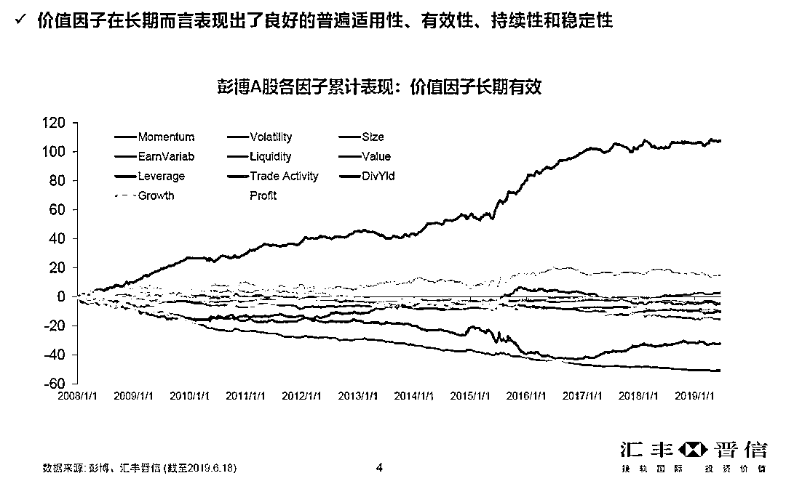
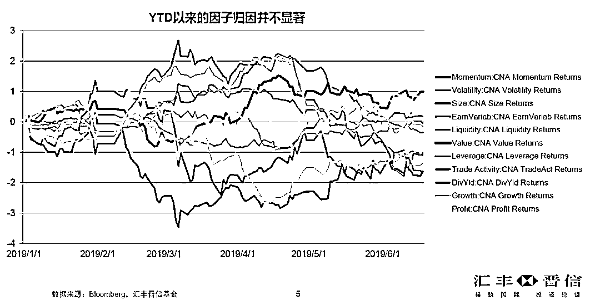
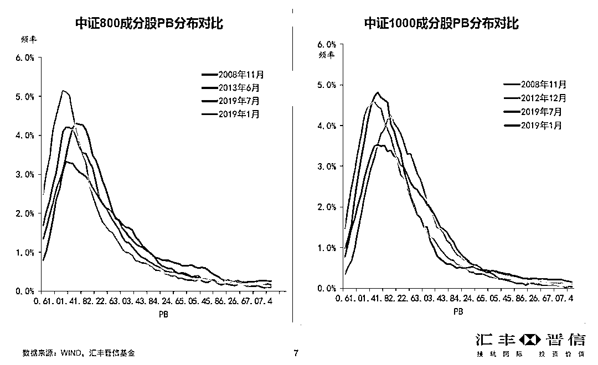
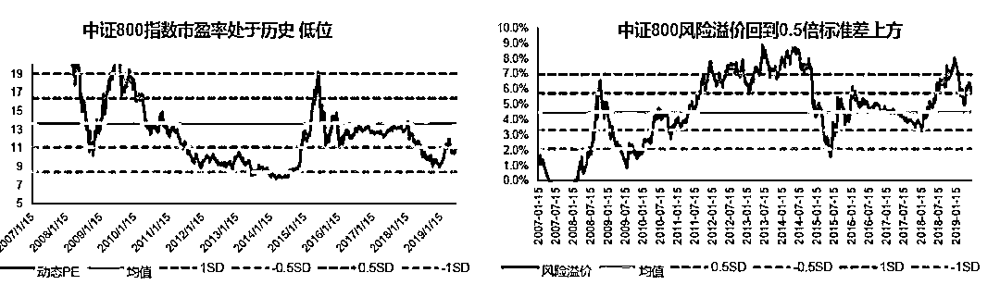
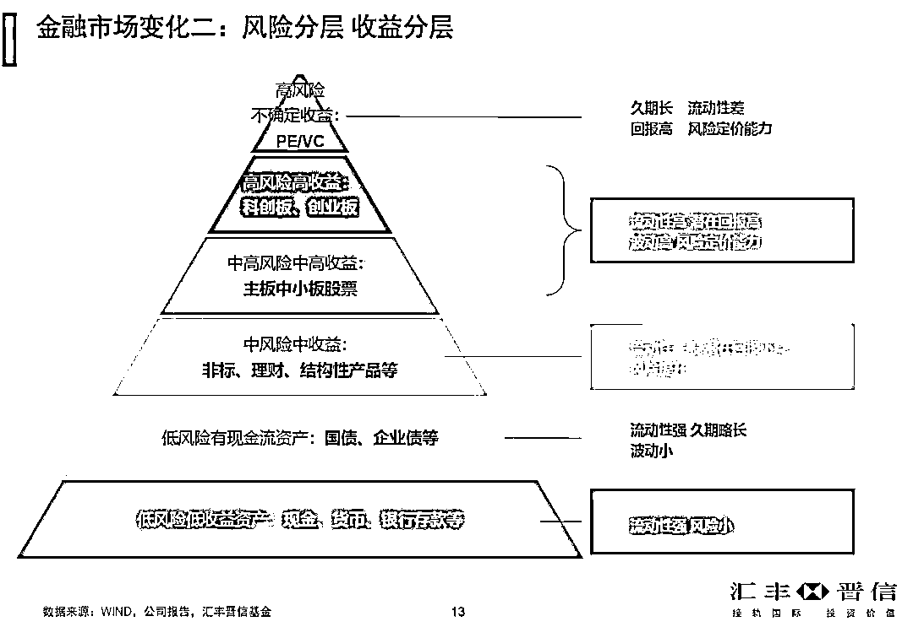
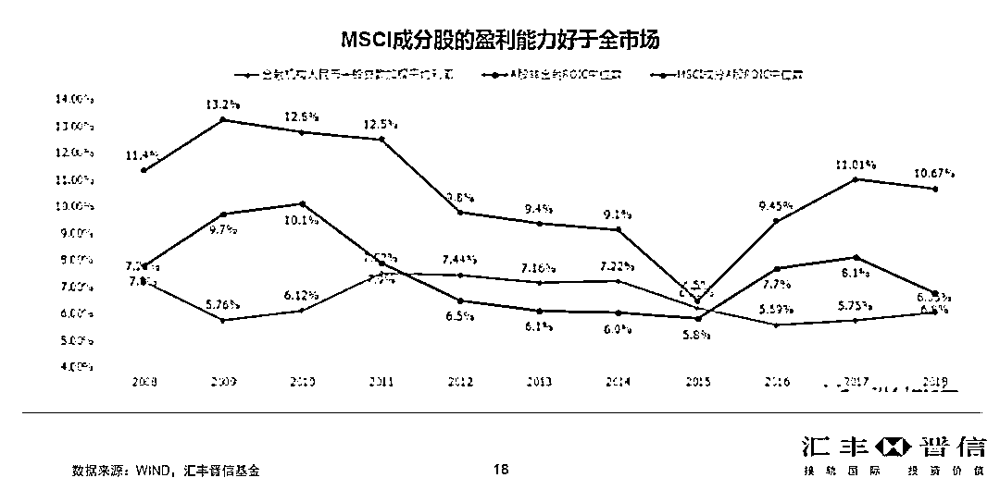
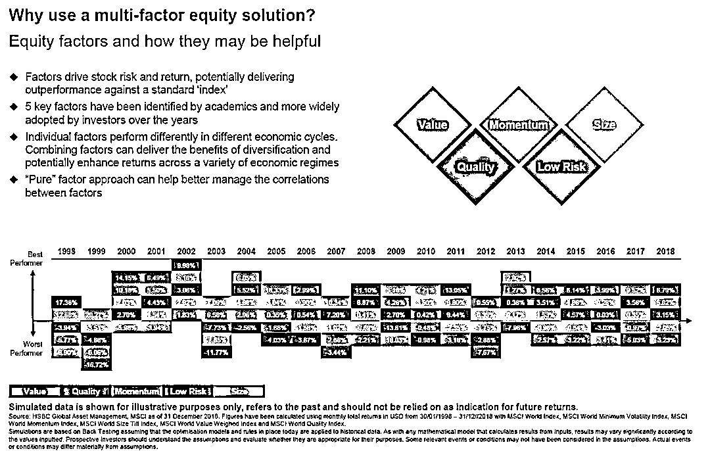
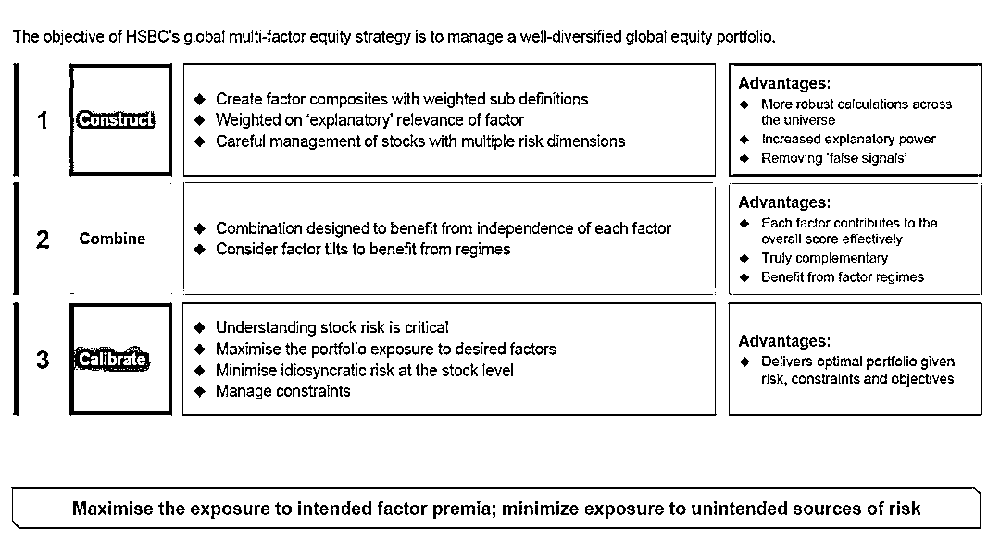
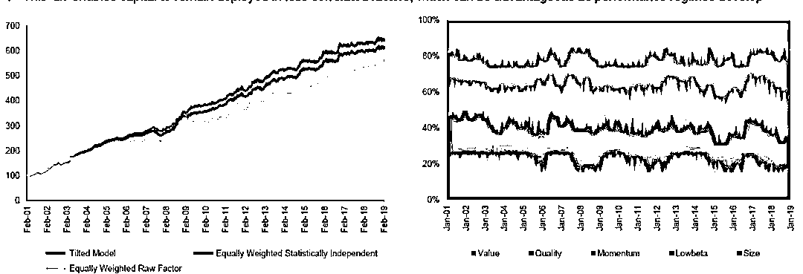

# 过去十年 A 股哪些因子长期有效？

> 原文：[`mp.weixin.qq.com/s?__biz=MzAxNTc0Mjg0Mg==&mid=2653293910&idx=1&sn=5b78bc9ca05e1bfd75b114fb078585c5&chksm=802dcf43b75a4655f9e49d2d62d2b7af8f261ea2d00f2aca9cbdecfe24010ec28041bce4dd01&scene=27#wechat_redirect`](http://mp.weixin.qq.com/s?__biz=MzAxNTc0Mjg0Mg==&mid=2653293910&idx=1&sn=5b78bc9ca05e1bfd75b114fb078585c5&chksm=802dcf43b75a4655f9e49d2d62d2b7af8f261ea2d00f2aca9cbdecfe24010ec28041bce4dd01&scene=27#wechat_redirect)

**标星★公众号     **爱你们♥

来源：点拾投资

作者：朱昂

**近期原创文章：**

## ♥ [5 种机器学习算法在预测股价的应用（代码+数据）](https://mp.weixin.qq.com/s?__biz=MzAxNTc0Mjg0Mg==&mid=2653290588&idx=1&sn=1d0409ad212ea8627e5d5cedf61953ac&chksm=802dc249b75a4b5fa245433320a4cc9da1a2cceb22df6fb1a28e5b94ff038319ae4e7ec6941f&token=1298662931&lang=zh_CN&scene=21#wechat_redirect)

## ♥ [Two Sigma 用新闻来预测股价走势，带你吊打 Kaggle](https://mp.weixin.qq.com/s?__biz=MzAxNTc0Mjg0Mg==&mid=2653290456&idx=1&sn=b8d2d8febc599742e43ea48e3c249323&chksm=802e3dcdb759b4db9279c689202101b6b154fb118a1c1be12b52e522e1a1d7944858dbd6637e&token=1330520237&lang=zh_CN&scene=21#wechat_redirect)

## ♥ 2 万字干货：[利用深度学习最新前沿预测股价走势](https://mp.weixin.qq.com/s?__biz=MzAxNTc0Mjg0Mg==&mid=2653290080&idx=1&sn=06c50cefe78a7b24c64c4fdb9739c7f3&chksm=802e3c75b759b563c01495d16a638a56ac7305fc324ee4917fd76c648f670b7f7276826bdaa8&token=770078636&lang=zh_CN&scene=21#wechat_redirect)

## ♥ [机器学习在量化金融领域的误用！](http://mp.weixin.qq.com/s?__biz=MzAxNTc0Mjg0Mg==&mid=2653292984&idx=1&sn=3e7efe9fe9452c4a5492d2175b4159ef&chksm=802dcbadb75a42bbdce895c49070c3f552dc8c983afce5eeac5d7c25974b7753e670a0162c89&scene=21#wechat_redirect)

## ♥ [基于 RNN 和 LSTM 的股市预测方法](https://mp.weixin.qq.com/s?__biz=MzAxNTc0Mjg0Mg==&mid=2653290481&idx=1&sn=f7360ea8554cc4f86fcc71315176b093&chksm=802e3de4b759b4f2235a0aeabb6e76b3e101ff09b9a2aa6fa67e6e824fc4274f68f4ae51af95&token=1865137106&lang=zh_CN&scene=21#wechat_redirect)

## ♥ [如何鉴别那些用深度学习预测股价的花哨模型？](https://mp.weixin.qq.com/s?__biz=MzAxNTc0Mjg0Mg==&mid=2653290132&idx=1&sn=cbf1e2a4526e6e9305a6110c17063f46&chksm=802e3c81b759b597d3dd94b8008e150c90087567904a29c0c4b58d7be220a9ece2008956d5db&token=1266110554&lang=zh_CN&scene=21#wechat_redirect)

## ♥ [优化强化学习 Q-learning 算法进行股市](https://mp.weixin.qq.com/s?__biz=MzAxNTc0Mjg0Mg==&mid=2653290286&idx=1&sn=882d39a18018733b93c8c8eac385b515&chksm=802e3d3bb759b42d1fc849f96bf02ae87edf2eab01b0beecd9340112c7fb06b95cb2246d2429&token=1330520237&lang=zh_CN&scene=21#wechat_redirect)

## ♥ [WorldQuant 101 Alpha、国泰君安 191 Alpha](https://mp.weixin.qq.com/s?__biz=MzAxNTc0Mjg0Mg==&mid=2653290927&idx=1&sn=ecca60811da74967f33a00329a1fe66a&chksm=802dc3bab75a4aac2bb4ccff7010063cc08ef51d0bf3d2f71621cdd6adece11f28133a242a15&token=48775331&lang=zh_CN&scene=21#wechat_redirect)

## ♥ [基于回声状态网络预测股票价格（附代码）](https://mp.weixin.qq.com/s?__biz=MzAxNTc0Mjg0Mg==&mid=2653291171&idx=1&sn=485a35e564b45046ff5a07c42bba1743&chksm=802dc0b6b75a49a07e5b91c512c8575104f777b39d0e1d71cf11881502209dc399fd6f641fb1&token=48775331&lang=zh_CN&scene=21#wechat_redirect)

## ♥ [计量经济学应用投资失败的 7 个原因](https://mp.weixin.qq.com/s?__biz=MzAxNTc0Mjg0Mg==&mid=2653292186&idx=1&sn=87501434ae16f29afffec19a6884ee8d&chksm=802dc48fb75a4d99e0172bf484cdbf6aee86e36a95037847fd9f070cbe7144b4617c2d1b0644&token=48775331&lang=zh_CN&scene=21#wechat_redirect)

## ♥ [配对交易千千万，强化学习最 NB！（文档+代码）](http://mp.weixin.qq.com/s?__biz=MzAxNTc0Mjg0Mg==&mid=2653292915&idx=1&sn=13f4ddebcd209b082697a75544852608&chksm=802dcb66b75a4270ceb19fac90eb2a70dc05f5b6daa295a7d31401aaa8697bbb53f5ff7c05af&scene=21#wechat_redirect)

## ♥ [关于高盛在 Github 开源背后的真相！](https://mp.weixin.qq.com/s?__biz=MzAxNTc0Mjg0Mg==&mid=2653291594&idx=1&sn=7703403c5c537061994396e7e49e7ce5&chksm=802dc65fb75a4f49019cec951ac25d30ec7783738e9640ec108be95335597361c427258f5d5f&token=48775331&lang=zh_CN&scene=21#wechat_redirect)

## ♥ [新一代量化带货王诞生！Oh My God！](https://mp.weixin.qq.com/s?__biz=MzAxNTc0Mjg0Mg==&mid=2653291789&idx=1&sn=e31778d1b9372bc7aa6e57b82a69ec6e&chksm=802dc718b75a4e0ea4c022e70ea53f51c48d102ebf7e54993261619c36f24f3f9a5b63437e9e&token=48775331&lang=zh_CN&scene=21#wechat_redirect)

## ♥ [独家！关于定量/交易求职分享（附真实试题）](https://mp.weixin.qq.com/s?__biz=MzAxNTc0Mjg0Mg==&mid=2653291844&idx=1&sn=3fd8b57d32a0ebd43b17fa68ae954471&chksm=802dc751b75a4e4755fcbb0aa228355cebbbb6d34b292aa25b4f3fbd51013fcf7b17b91ddb71&token=48775331&lang=zh_CN&scene=21#wechat_redirect)

## ♥ [Quant 们的身份危机！](https://mp.weixin.qq.com/s?__biz=MzAxNTc0Mjg0Mg==&mid=2653291856&idx=1&sn=729b657ede2cb50c96e92193ab16102d&chksm=802dc745b75a4e53c5018cc1385214233ec4657a3479cd7193c95aaf65642f5f45fa0e465694&token=48775331&lang=zh_CN&scene=21#wechat_redirect)

## ♥ [拿起 Python，防御特朗普的 Twitter](https://mp.weixin.qq.com/s?__biz=MzAxNTc0Mjg0Mg==&mid=2653291977&idx=1&sn=01f146e9a88bf130ca1b479573e6d158&chksm=802dc7dcb75a4ecadfdbdace877ed948f56b72bc160952fd1e4bcde27260f823c999a65a0d6d&token=48775331&lang=zh_CN&scene=21#wechat_redirect)

## ♥ [AQR 最新研究 | 机器能“学习”金融吗？](http://mp.weixin.qq.com/s?__biz=MzAxNTc0Mjg0Mg==&mid=2653292710&idx=1&sn=e5e852de00159a96d5dcc92f349f5b58&chksm=802dcab3b75a43a5492bc98874684081eb5c5666aff32a36a0cdc144d74de0200cc0d997894f&scene=21#wechat_redirect)

**导读**

过去几年 Smart Beta 因子投资策略开始在 A 股逐渐得到普及。虽然过去十年才真正红起来，其实 Smart Beta 这个词 1970 年就开始被机构投资者使用，在 2003 年也出现了第一个 Smart Beta 的指数基金。Smart Beta 是一种长期可持续的因子，通过这种投资因子的分析，获得更高的回报和更低的风险。

汇丰晋信基金是国内践行主动管理的 Smart Beta 投资策略最早的基金公司。他们坚持 PB-ROE 的价值策略，并且不同产品上都有鲜明的风格因子特征，这些特征也打造了汇丰晋信基金的产品线，强调用户“所买即所得”。汇丰晋信也一直强调追求“可解释、可复制、可预测”的收益来源，提供给客户的不是历史业绩，而是他们管理客户资产的方式。

上周我们有幸受邀参加了汇丰晋信 Smart Beta 投资策略的分享会，聆听了汇丰环球投资管理首席股票量化分析师江山博士，以及汇丰晋信多位基金经理关于如何通过 Smart Beta 的量化工具，进行组合管理优化的分享。

**主题演讲**  

A 股价值因子应用及下半年投策

**主讲人**

郭敏 汇丰晋信大盘基金、动态策略基金 基金经理

**价值因子在 A 股长期有效**

下面这张图显示了从 2008 年到 2019 年 6 月 18 日，A 股各因子的累计表现。红色线表示的是价值因子（Value）,显示了很强的收益率，这个收益率主要来自做多低估值股票，做空高估值股票。我们看到价值因子的收益率非常稳定，从 2008 年至今获得了 100%的收益，而且回撤很小。从相对收益的角度看，这个收益率曲线体现了低估值股票在过去 10 年远远跑赢高估值股票，有很强的相对收益。

这张图里显示，市值因子（Size）和市场的表现是负相关性。也就是说，过去 10 年小市值股票远远跑赢大盘。另一个有显著负相关性的因子是流动性因子（liquidity），意味着如果做多流动性好的股票，做空流动性差的股票，最终会取得较大的负收益。

从我们对于过去 10 年因子表现的研究中，看到价值因子不但是最有效的，而且回撤也较小，那么我们要思考，这个策略未来还会有效吗？我的答案是依然会有效，主要有两个原因。第一，A 股市场仍然是散户主导，导致市场波动较大，容易发生错误定价；第二，宏观经济和产业政策的预期变化比较大。

我们底层的 PB-ROE 策略，未来大概率还会有效。

那么我们策略的风险在哪里呢？从 2017 年开始至今，价值因子并不是特别有效。事实上，2019 年以来，没有任何一个因子跑出 Alpha。今年是少数个股的独立行情，以核心资产为代表。

从我们的 PB-ROE 模型看，股票定价的偏离度在加大。无论是从中证 800 还是中证 1000 的成分股来看，PB 估值明显是左偏的，PB 小于 1 的股票数量已经很多，而 PB 高估的股票数量很少。这说明目前阶段大部分股票的估值都比较低。 

通过这些因子分析，我们有三个核心结论：

1）价值因子在 A 股有效性更高，我们认为未来也会持续有效；

2）价值因子过去两年表现一般，主要是核心资产的超额收益过大；

3）从均值回归理念出发，PB-ROE 策略继续跑输的概率在降低。

如果从三年的时间维度去看，权益类资产的估值处于低位。基于我们的风险溢价大类资产模型，目前风险溢价处于高位，波动率在低位，这意味着如果对比股票和债券的投资价值会发现，股票的估值很便宜。

数据来源：汇丰晋信基金

金融市场正在发生几个重要的变化

**第一个变化，刚性兑付或渐被打破**。包商银行事件释放了金融领域打破刚性兑付的信号，这是一个重大变化。过去银行理财通过提供刚性兑付的产品，规模增长到了 30 万亿。同样，信托产品当年提供 10%到 12%收益率的产品，规模也增长到了 20-30 万亿。任何一个金融子领域提供刚性兑付产品，都会出现规模的快速增长。

现在余额宝收益率只有 2.8%左右，信托产品收益率在 7%左右，也就说无风险收益率显著下滑后，资金需要寻找低估的优质资产。我们认为 A 股目前估值很低，一旦出现资金迁移，大概率会进入股市，目前权益资产的吸引力在提高。

以目前大约 350 万亿的中国金融资产来看，即使 30 万亿的资金进入股市占比也不算高。

**第二个变化，风险和收益的分层**。我们已经看到收益率和风险出现了分层，也就是让高收益率对应高风险资产，低收益率对应低风险资产。未来所有资产的风险收益和波动率都要匹配。

第三个变化，资产定价能力显著提升。通过波动率和风险溢价对于资产进行定价，用三年维度去看，权益类资产大概率会出现机会。

过去两年估值对市场都是负贡献，未来即使无风险利率不下降，估值对于 A 股市场的负面贡献已经接近尾声。从 ROE 的趋势看，2011 到 2015 年经济增速放缓，企业 ROE 也伴随下行。到了 2016 年一季度开始，ROE 开始向上。

我们发现 ROE 回升是销售净利润率带来的。我们认为，即使在 GDP 增速放缓的情况下，上市公司 ROE 也未必下行。因为供给侧改革带来核心企业盈利上升，使得竞争格局好转，另外减税降负会带来盈利能力恢复。

我们看到，目前核心资产 ROIC 显著优于全市场，MSCI 成分股的盈利能力好于全市场。但从动态和长期的角度来看，我可能会建议大家这时候应该看看性价比更高的二线资产。

如果用买房子举例，几年前，当你看到上海的核心地段的房子涨到了 5 万一平米，这时候郊区的房子，可能只有 2 万一平。但最终的结果可能是，核心地段从 5 万涨到 8 万，而郊区的房子从 2 万涨到 4 万，后者涨幅更高。同样，如果用三年维度看，我们认为应该买被低估的股票，也就是二线资产性价比会更好一些。 

行业上，看好安防、光伏、保险和游戏行业。

---

**主题演讲**

汇丰环球投资管理的股票因子投资策略

**主讲人**

江山博士，汇丰环球投资管理首席股票量化分析师

我们对于市场回报率的分析主要基于 CAPM 模型。经过汇丰集团多年的历史统计，我们发现市场的回报主要由几个因子主导：价值因子、质量因子、动量因子、低风险因子，大小盘因子。

这五个因子能解释大部分的收益率，并且能长期增加收益率。经过我们的研究发现，这些因子能提供长期正向的风险溢价。在不同经济周期中，这五个因子的表现也不同。通过结合这些因子，能够提供因子之间的互补，优化回报率。但是我们看到，没有一个单一因子是在任何时候都有效的。这也是多因子互补提供的价值所在。

数据来源：汇丰环球投资管理

汇丰环球投资管理在 2004 年发行了第一个多因子产品，到了 2016 年管理规模超过了 50 亿美元，到了 2018 年规模已经超过了 100 亿美元。我们在 Smart Beta 因子研究上，有非常丰富的经验。

第一代的 Smart Beta 因子模型，就是简单地给某个因子进行排序，比如 PB 因子模型，就基于 PB 进行排序，再做一次主动的覆盖。这么做，有两个问题。第一，单一因子的风险不好管理，会出现某些时候回撤较大的问题。第二，如果全市场都在用这个因子做投资，会造成策略的拥挤，风险溢价很容易被套利掉。

**市场上是没有免费的午餐**。许多因子模型在做回归测试时，表现很好。然而构建因子模型并不是完全基于历史表现，我们需要从逻辑上理解历史表现的原因。在构建模型时，把最好的逻辑和数据处理能力都放进去。细节决定一切，构建因子模型时，我们会投入大量的时间。

构建模型之后，我们将不同因子进行混合，观察不同因子之间的有效性和相关性，以及多因子组合呈现的风险特征。我们会把不同因子进行混合打分，得出一个配置的权重。

最后我们再做校验，通过备选股票池构建出一个组合，我们会观察这个组合到底有多少反映了我们希望的因子暴露。**市场上许多 Smart Beta 产品，还停留在第一步的因子构建，并没有做第二步的因子混合和第三步的组合校验。这里面，每一个步骤都是独立的，不应该混合起来，否则会导致风险分散性体现不出来**。

**最终我们希望的结果是，在我们希望暴露的因子上进行最大化暴露，在不希望暴露的因子上，将风险暴露最小化。**

数据来源：汇丰环球投资管理

**重要的是因子背后的逻辑**

我们看重的是因子有效性背后的逻辑。比如动量因子（momentum）是一个大家常用的因子，回报率也很高。但是许多人并不了解动量因子高回报背后的逻辑是什么？我们通过研究发现，行业趋势是推动动量因子的重要因素。这个行业趋势，一旦形成，不会像个股动量那样忽上忽下。这就是我们构建动量因子模型的一个基础，理解了背后逻辑，不去看个股动量，而是看行业动量。对行业动量进行一个排序。

我们在构建行业动量后，通过回归分析的方法，把上上下下不增加价值的波动去掉，重新设计因子，然后构建出来。

我们再看市值因子（size），同样需要更加科学去构建这样一个因子组合。我们举一个例子，如果构建一个基于市值因子的全球股票组合，你会发现选出来的大市值股票大部分是美国公司，然而小市值股票大部分是新兴市场公司。如果单纯基于这样来做市值因子的投资，最后会变成新兴市场对决美国市场。

**所以我们会在区域和板块中做中性处理。****这样更加能获得我们想要的结果。一旦跨板块之后，会带来很多噪音。**

下面这张图是我们对于五大因子做了正交化处理的结果，你会看到进行处理后的模型收益率，会比等权重的模型收益率更加优化。通过我们的正交化处理，每一因子都能被正确的表达出来。

数据来源：汇丰晋信基金

**我们在多因子模型构建中，非常看重因子背后的逻辑角度，而非数据角度**。在实施过程中，持续跟踪因子的有效性。

---

圆桌讨论：A 股因子有效性及下半年展望

主持人：朱昂

嘉宾：

方磊 | 汇丰晋信大盘波动精选基金、恒生 A 股龙头指数基金基金经理

是星涛 | 汇丰晋信消费红利基金、双核策略基金、价值先锋基金 基金经理

陈平 | 汇丰晋信科技先锋基金、新动力基金 基金经理

****▍**朱昂：****先问方磊一个问题，如何看待因子投资的有效性，以及如何将汇丰集团的因子研究成果进行本土化运用？**

**方磊：**因子模型的构建和有效性分析都是基于数学统计理论展开的。因此，从统计意义上来说，模型都需要在假设条件下构建，比如最常用到的正态分布，同时模型结果的有效性是有一定置信度的，也就是通俗地说是一定概率下的有效性，因此，如果当市场出现了模型假设之外的情形，就可能导致因子失效。所以，**我觉得投资中的因子有效性，是个概率，或者不严谨地说法就是一种胜率，我们需要认识到因子只要在投资者可接受范围内，即一定胜率内有效，模型都是可以作为投资的量化依据。**

就如我之前所说，模型的建立是有假设情形的，所以海外因子的本土化，也要看假设条件是否在国内也存在。就如 PB-ROE 模型，在汇丰晋信成立后，汇丰集团就开始和我们讨论，但一开始的研究和分析，并没有让我们感觉对价值因子的关注可以给我们带来显著的投资贡献，直到 2014 年开始，我们的投资研究团队才从因子回撤中发现了价值因子的有效性，并逐渐发展成我们团队的投资研究框架。

另外在本土化中，在多因子模型建立中，数据的处理也是本土化中需要关注的；海外市场由于历史长，机构投资者占比高，所以其在做数据分析和回撤的时候，可以用非常长的历史数据来进行统计计算，但反观国内市场，开始的时候数据可能存在不齐全，之后个人投资者占比高，近几年开始机构投资者的占比开始升高，因此在做模型回撤的时候对于数据时间的选取是本土化中经常要关注的一个点。

我们一直坚持“可解释、可复制、可预测”的投资方法，告诉投资者一个比较透明的投资流程。

****▍**朱昂：****你们各自基金产品中，暴露什么样因子，如何保证这个因子的暴露？**

**陈平：**我管理的是科技基金，从最后的归因分析看，**我们主要暴露在质量、动能和市值三个因子**。在我们的投资流程里，这些因子暴露不是前置的，也就是说，我不是刻意要去暴露这些因子。我通过基本面分析来构建组合，最后回归分析看到我组合所呈现的因子特征。

是星涛：我这边是一个全市场组合，我**的因子暴露一直很连贯：正向暴露价值因子，负向暴露市值因子**。未来我们会加入短期因子回归趋势的分析。

今年以来，盈利因子（Profit）表现很好，但是从长期趋势看，盈利因子并没有长期明显的趋势，所以后面这个因子出现的下行风险会更多一些。大家现在买高盈利的龙头公司，是觉得经济处于后周期的过程中，这些公司的防御力更强。但是如果经济短期见底回升，未来龙头公司的马太效应是强化还是弱化，这是我们在思考的问题。

今年我们的低估值、低预期、低流动性策略，和市场上表现出来的龙头效应正好相反。但是我未来还是会坚持这个长期有效的策略。

**方磊：**大盘波动精选基金，其基金在产品设计的时候就引入了汇丰集团的两大主要策略，价值-盈利模型和波动率优化模型，在基金管理过程中，我们特别强调了一个纪律问题，上一个问题中我们谈到了模型有效性的概率问题，因此，作为一个以量化为主要投资手段的基金管理，本来就是通过概率致胜，如果没有纪律，经常有主观介入，那在这中间，模型的建立和运用就无法保证与投资目标一致。

**从基金成立至今的三年多运行结果看，这个基金主要就是暴露在价值和波动率因子上，业绩贡献的主要来源就是这两个因子。**

**▍朱昂：****作为主动管理的基金经理，你们在投资中用什么量化方法来辅助你的组合管理？**

**陈平：**在因子方面，作为一个辅助手段。**量化是帮我们做业绩归因。也能够让我理解构建组合是什么情况**。知道我在哪些方面做的更有效率。

是星涛：量化过去是后置，未来越来越多的会前置化。主动管理里面，夹杂了人性的弱点，造成了主观交易，带来不必要的损失。**长期来看，量化工具帮助我们抵御人性的弱点，做出正确的决策**。并且通过因子分析，告诉我们市场的特征和组合的特征。

****▍**朱昂：****科技和双核两位基金经理能否对下半年市场做一些展望，如何看到价值板块、成长板块以及核心资产的投资机会？**

**陈平：**我认为**四年的 TMT 熊市大概率要结束，新的周期要开始了，现在处于春天前仍会偶有寒潮的状态**。我认为有几个原因：

第一，回归历史我们看到业绩优势决定了市场风格。这两年市场风格偏向消费品，本质是这一阶段他们的业绩最好。展望未来，成长股会逐渐显现业绩优势。5G 新周期讲了很久，我们认为会逐渐有业绩体现出来了。

第二，我们看到目前 5G 基站已经启动。今年会有十几万个，明年大概会有几十万，后年可能达到 100 万个基站。同时，明年在高通芯片研发成功后，可能会进入 5G 手机的换机潮。

第三，5G 会带来一批新的应用。我们现在从 4G 时代看 5G，并不知道什么应用会出现，这就好比在 3G 时代看 4G，并不知道微信会得到普及，不知道会出现抖音，也不知道会出现王者荣耀这样的手游。**从新的硬件到软件，从终端到应用的周期就要开始了**。PCB 企业的公司业绩已经有所体现，未来的业绩增长会出现扩散。

**是星涛：**大家比较关心的，还是消费的问题。我也同样看好新周期的启动，我可能比较偏好于科技应用端的 TMT 行业。消费一直是过去最好的板块，但板块内部已经出现了分化。许多白酒公司的基本面还是比较稳健，目前的估值并不能说偏贵。但是一些调味品、地产后周期板块的耐用品，风险是比较大的。

**我们会超配动态估值比较低的板块，对于明显脱离估值区间的消费品精选低配。比如耐用消费品中的乘用车在估值很低的位置，可选消费中的服装也在很低的位置。**

未来看消费品的结构性机会。

*—End—*

量化投资与机器学习微信公众号，是业内垂直于**Quant**、**MFE**、**CST、AI**等专业的**主****流量化自媒体**。公众号拥有来自**公募、私募、券商、银行、海外**等众多圈内**10W+**关注者。每日发布行业前沿研究成果和最新量化资讯。

你点的每个“在看”，我都认真当成了喜欢