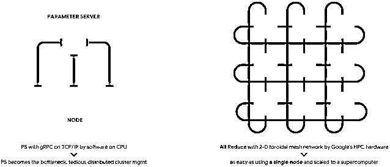

# TPU 灵魂三问：What？Why？How？

> 原文：[`mp.weixin.qq.com/s?__biz=MzAxNTc0Mjg0Mg==&mid=2653293905&idx=1&sn=096ca2d1013cd551e809d99fd66ff059&chksm=802dcf44b75a4652fc6d3c4aaed69e8481c7a18fa646a7dda5cfec8e6a4ebcd51b8ddc6d6bc9&scene=27#wechat_redirect`](http://mp.weixin.qq.com/s?__biz=MzAxNTc0Mjg0Mg==&mid=2653293905&idx=1&sn=096ca2d1013cd551e809d99fd66ff059&chksm=802dcf44b75a4652fc6d3c4aaed69e8481c7a18fa646a7dda5cfec8e6a4ebcd51b8ddc6d6bc9&scene=27#wechat_redirect)

**标星★公众号     **爱你们♥

作者：王圣元

来源：王的机器

**近期原创文章：**

## ♥ [5 种机器学习算法在预测股价的应用（代码+数据）](https://mp.weixin.qq.com/s?__biz=MzAxNTc0Mjg0Mg==&mid=2653290588&idx=1&sn=1d0409ad212ea8627e5d5cedf61953ac&chksm=802dc249b75a4b5fa245433320a4cc9da1a2cceb22df6fb1a28e5b94ff038319ae4e7ec6941f&token=1298662931&lang=zh_CN&scene=21#wechat_redirect)

## ♥ [Two Sigma 用新闻来预测股价走势，带你吊打 Kaggle](https://mp.weixin.qq.com/s?__biz=MzAxNTc0Mjg0Mg==&mid=2653290456&idx=1&sn=b8d2d8febc599742e43ea48e3c249323&chksm=802e3dcdb759b4db9279c689202101b6b154fb118a1c1be12b52e522e1a1d7944858dbd6637e&token=1330520237&lang=zh_CN&scene=21#wechat_redirect)

## ♥ 2 万字干货：[利用深度学习最新前沿预测股价走势](https://mp.weixin.qq.com/s?__biz=MzAxNTc0Mjg0Mg==&mid=2653290080&idx=1&sn=06c50cefe78a7b24c64c4fdb9739c7f3&chksm=802e3c75b759b563c01495d16a638a56ac7305fc324ee4917fd76c648f670b7f7276826bdaa8&token=770078636&lang=zh_CN&scene=21#wechat_redirect)

## ♥ [机器学习在量化金融领域的误用！](http://mp.weixin.qq.com/s?__biz=MzAxNTc0Mjg0Mg==&mid=2653292984&idx=1&sn=3e7efe9fe9452c4a5492d2175b4159ef&chksm=802dcbadb75a42bbdce895c49070c3f552dc8c983afce5eeac5d7c25974b7753e670a0162c89&scene=21#wechat_redirect)

## ♥ [基于 RNN 和 LSTM 的股市预测方法](https://mp.weixin.qq.com/s?__biz=MzAxNTc0Mjg0Mg==&mid=2653290481&idx=1&sn=f7360ea8554cc4f86fcc71315176b093&chksm=802e3de4b759b4f2235a0aeabb6e76b3e101ff09b9a2aa6fa67e6e824fc4274f68f4ae51af95&token=1865137106&lang=zh_CN&scene=21#wechat_redirect)

## ♥ [如何鉴别那些用深度学习预测股价的花哨模型？](https://mp.weixin.qq.com/s?__biz=MzAxNTc0Mjg0Mg==&mid=2653290132&idx=1&sn=cbf1e2a4526e6e9305a6110c17063f46&chksm=802e3c81b759b597d3dd94b8008e150c90087567904a29c0c4b58d7be220a9ece2008956d5db&token=1266110554&lang=zh_CN&scene=21#wechat_redirect)

## ♥ [优化强化学习 Q-learning 算法进行股市](https://mp.weixin.qq.com/s?__biz=MzAxNTc0Mjg0Mg==&mid=2653290286&idx=1&sn=882d39a18018733b93c8c8eac385b515&chksm=802e3d3bb759b42d1fc849f96bf02ae87edf2eab01b0beecd9340112c7fb06b95cb2246d2429&token=1330520237&lang=zh_CN&scene=21#wechat_redirect)

## ♥ [WorldQuant 101 Alpha、国泰君安 191 Alpha](https://mp.weixin.qq.com/s?__biz=MzAxNTc0Mjg0Mg==&mid=2653290927&idx=1&sn=ecca60811da74967f33a00329a1fe66a&chksm=802dc3bab75a4aac2bb4ccff7010063cc08ef51d0bf3d2f71621cdd6adece11f28133a242a15&token=48775331&lang=zh_CN&scene=21#wechat_redirect)

## ♥ [基于回声状态网络预测股票价格（附代码）](https://mp.weixin.qq.com/s?__biz=MzAxNTc0Mjg0Mg==&mid=2653291171&idx=1&sn=485a35e564b45046ff5a07c42bba1743&chksm=802dc0b6b75a49a07e5b91c512c8575104f777b39d0e1d71cf11881502209dc399fd6f641fb1&token=48775331&lang=zh_CN&scene=21#wechat_redirect)

## ♥ [计量经济学应用投资失败的 7 个原因](https://mp.weixin.qq.com/s?__biz=MzAxNTc0Mjg0Mg==&mid=2653292186&idx=1&sn=87501434ae16f29afffec19a6884ee8d&chksm=802dc48fb75a4d99e0172bf484cdbf6aee86e36a95037847fd9f070cbe7144b4617c2d1b0644&token=48775331&lang=zh_CN&scene=21#wechat_redirect)

## ♥ [配对交易千千万，强化学习最 NB！（文档+代码）](http://mp.weixin.qq.com/s?__biz=MzAxNTc0Mjg0Mg==&mid=2653292915&idx=1&sn=13f4ddebcd209b082697a75544852608&chksm=802dcb66b75a4270ceb19fac90eb2a70dc05f5b6daa295a7d31401aaa8697bbb53f5ff7c05af&scene=21#wechat_redirect)

## ♥ [关于高盛在 Github 开源背后的真相！](https://mp.weixin.qq.com/s?__biz=MzAxNTc0Mjg0Mg==&mid=2653291594&idx=1&sn=7703403c5c537061994396e7e49e7ce5&chksm=802dc65fb75a4f49019cec951ac25d30ec7783738e9640ec108be95335597361c427258f5d5f&token=48775331&lang=zh_CN&scene=21#wechat_redirect)

## ♥ [新一代量化带货王诞生！Oh My God！](https://mp.weixin.qq.com/s?__biz=MzAxNTc0Mjg0Mg==&mid=2653291789&idx=1&sn=e31778d1b9372bc7aa6e57b82a69ec6e&chksm=802dc718b75a4e0ea4c022e70ea53f51c48d102ebf7e54993261619c36f24f3f9a5b63437e9e&token=48775331&lang=zh_CN&scene=21#wechat_redirect)

## ♥ [独家！关于定量/交易求职分享（附真实试题）](https://mp.weixin.qq.com/s?__biz=MzAxNTc0Mjg0Mg==&mid=2653291844&idx=1&sn=3fd8b57d32a0ebd43b17fa68ae954471&chksm=802dc751b75a4e4755fcbb0aa228355cebbbb6d34b292aa25b4f3fbd51013fcf7b17b91ddb71&token=48775331&lang=zh_CN&scene=21#wechat_redirect)

## ♥ [Quant 们的身份危机！](https://mp.weixin.qq.com/s?__biz=MzAxNTc0Mjg0Mg==&mid=2653291856&idx=1&sn=729b657ede2cb50c96e92193ab16102d&chksm=802dc745b75a4e53c5018cc1385214233ec4657a3479cd7193c95aaf65642f5f45fa0e465694&token=48775331&lang=zh_CN&scene=21#wechat_redirect)

## ♥ [拿起 Python，防御特朗普的 Twitter](https://mp.weixin.qq.com/s?__biz=MzAxNTc0Mjg0Mg==&mid=2653291977&idx=1&sn=01f146e9a88bf130ca1b479573e6d158&chksm=802dc7dcb75a4ecadfdbdace877ed948f56b72bc160952fd1e4bcde27260f823c999a65a0d6d&token=48775331&lang=zh_CN&scene=21#wechat_redirect)

## ♥ [AQR 最新研究 | 机器能“学习”金融吗？](http://mp.weixin.qq.com/s?__biz=MzAxNTc0Mjg0Mg==&mid=2653292710&idx=1&sn=e5e852de00159a96d5dcc92f349f5b58&chksm=802dcab3b75a43a5492bc98874684081eb5c5666aff32a36a0cdc144d74de0200cc0d997894f&scene=21#wechat_redirect)

**引言**

从 2018 年 10 月到 2019 年 6 月，NLP 三大模型横空出世，分别是 Google 的 **BERT**，OpenAI 的 **GPT-2** 和 CMU 和 Google 联手的 **XLNet**。

除了模型强大，我们从新闻里看到最多的是就是训练时间长，而且费用惊人的贵。

*   BERT-large 模型在 **16 个** Cloud TPU v3 下训练 **4 天**

*   GPT-2 模型在 **32 个** Cloud TPU v3 下训练**一周多**

*   XLNet-large 模型在 **128 个** Cloud TPU v3 下需要训练 **2 天半**

证据如下：

*Training of BERT_LARGE was performed on* ***16 Cloud TPUs*** *(64 TPU chips total). Each pretraining took* ***4 days*** *to complete.***-- BERT Paper**

*To clarity, it's 256 cores (8 cores per Cloud TPU). Training took a bit over a week.* **-- Open AI Author on Reddit**

*We train XLNet-Large on* ***512 TPU v3*** *chips for 500K steps with an Adam optimizer, linear learning rate decay and a batch size of 2048, which takes about ****2.5 days****.***-- XLNet Paper**

TPU v3 就是第三代 (2018) TPU，样子如下。

而第一代 (2015) 和第二代 (2017) 的 TPU 样子如下 。

查了下第三代 TPU 每个核心的价格是每小时 8 美元。

那么来计算一下 BERT, GPT-2 和 XLNet 的训练成本，它们分别用了 16、32、128 个 Pod，每个 Pod 含有 8 个核心 (core)，计算 

*   BERT：16 × 8 × 24 × 4 = **12288 美元**

*   GPT-2：32 × 8 × 24 × 7 = **43008 美元**

*   XLNet：128 × 8 × 24 × 2.5 = **61440 美元**

和新闻里面的报道吻合： 

*   BERT-large 模型在 16 个 Cloud TPU v3 下训练 4 天，花费 1.2 万美元

*   GPT-2 模型在 32 个 Cloud TPU v3 下训练一周多，花费 4.3 万美元

*   XLNet-large 模型在 128 个 Cloud TPU v3 下需要训练 2 天半，花费 6.1 万美元

扯了这么多，本帖只想弄清楚下面 What-Why-How 灵魂三问：

1、What：TPU 是什么？

2、Why：为什么 TPU 在神经网络上有效？

3、How：怎么玩 TPU + Keras？

**What**

**TPU 是什么？**

**张量处理器** (Tensor Processing Unit, TPU) 是 Google 为机器学习定制的人工智能加速器专用集成电路，专为 Google 的深度学习框架 TensorFlow 而设计的。

那 TPU 和**中心处理器** (Central Processing Unit, CPU) 和**图形处理器** (Graphics Processing Unit, GPU) 有什么区别呢？在这里我们用「神经网络识别手写数字」的例子来讨论三者的不同。

**神经网络**

下图展示着神经网络来识别手写数字的过程

1、输入是一张 28×28 像素的图片

2、输出是一个 10×1 的向量 (数字有 10 个)

3、中间是一个极简的神经网络 (这不重要，牢记本帖目的是区分 CPU、GPU 和 TPU 在神经网络中的计算方法，因此网络越简单就越好懂)

整套计算大概分四个步骤： 

1、提取黑白图像的像素矩阵 (28×28)，重塑 (reshape) 成向量 X

2、用权重 W 乘以 X

3、加上偏置 b

4、将 WX + b 用 softmax 转换成概率值

理想情况当神经网络训练得比较好时，数字 8 对应的概率会比较大 (至少大于其它数字对应的概率)，因此推断图片里的数字是 8。

让我们重新设计好问题，假设网络已经训练好了 (每个数字里的像素对应的权重已经计算出来了)，给定新的图片，我们对其分类。

为了简化展示，我们将图片分成 9 个像素 (3×3)。给定新图片 (含数字 8)，它的像素值和训练好的数字 7、8、9 对应的权重值如下。 

然后分别计算 x 和 w7, w8 和 w9 的点积，如下面动图所示。最后找出点积最大的，如果 w8x 最大，那么该数字是 8。

下面三节分别讲解 CPU、GPU 和 TPU 是如何计算点积的 (或更通用的矩阵相乘)。

**CPU**

中央处理器 (Central Processing Unit, CPU) 是计算机的主要设备之一，功能主要是解释计算机指令以及处理计算机软件中的数据。

CPU 最大的特点就是**通用**，你可以用 CPU 做 PPT、网上银行转账，或运行神经网络识别数字。但通用的东西往往效率不高，因为电脑在没有读到软件下一个指令前不知道要计算什么。此外，CPU 会将每一步的计算结果存储在内存里，而 CPU 里的算术逻辑单元 (Arithmetic Logic Units, ALU) 会不停的访问存储器来读取和存储中间计算结果。深度神经网络会有大量计算，这时用 CPU 显然效率低下。

接着上面的识别手写数字的例子，当计算 y = Wx + b 时，其中 

W 是 3×9 的矩阵，x 是 9×1 的向量，b 是标量，因此 y 是 3×1 的向量，即「含数字 8 的图片中的像素」和「数字 7, 8, 9 的权重」的 3 个内积。

看下面动图，在点积里的乘法操作中，x 里面的 9 个元素先和 w7 里面的 9 个元素两两相乘；再和 w8 里面的 9 个元素两两相乘；最后和 w9 里面的 9 个元素两两相乘。 

如果图片是高清彩色的，像素为 192×192×3 ≈ **1000000**；如果训练集很大，有**几百万张**；如果网络是深层的，有几十层，即权重 W 有**很多元素**；那么像 CPU 这样按顺序一步步计算点积会非常慢，而且内存也会溢出。 

接着看看能**并行**计算的 GPU？

**GPU**

图形处理器 (Graphics Processing Unit, GPU) 是一种专门在个人计算机、工作站、游戏机和一些移动设备上运行绘图运算工作的微处理器。

和 CPU 相比为了能获得更大的吞吐量 (throughput)，GPU 包含更多的 ALU，通常是 2500-5000 个。这样一个处理器可以**同时**执行上千的加法和乘法操作。 

下面动图基本上就是把 CPU 那一个单元复制了很多，并行计算了「含数字 8 的图片中的像素」和「数字 1 到 9 的权重」的 9 个内积。

GPU 计算虽然比 CPU 快很多，但基本上就是并行带来的优势，GPU 仍然是一个通用处理器，即可以支持不同的应用程序和软件。

和 CPU 一样，在每一次计算中 GPU 需要访问寄存器 (register) 或共享存储器 (memory) 来读取和存储中间计算结果。由于 GPU 在其数千个 ALU 上执行更多并行计算，因此它也会按比例增加访问内存的能量。 

最后看看**专门**为矩阵计算设计的 TPU？

**TPU**

TPU 是 google 专门为大型神经网络里面的大型矩阵运算而设计的，因此不是通用处理器。

TPU 不能做 PPT，不能网上银行转账，但它们可以以极快的速度处理神经网络的大量乘法和加法，同时消耗更少功率和占用更小的内存。它是如何做到的呢？三个特点 

1、16 位大脑浮点格式 

2、脉动数组

3、Ring AllReduce  

先卖个关子，看看下图 TPU 怎么计算内积的。 

看不懂不要紧，下节「脉动数组」会娓娓道来。

**WHY**

为什么 TPU 在矩阵运算上高效？

TPU 核心由矩阵乘法单元 (Matrix Mutiply Unit, MXU) 和向量处理单元 (Vector Processing Unit, VPU) 组成的。MXU 负责矩阵乘法，VPU 负责向量转换向量，比如 relu 和 softmax。

但在神经网络中矩阵乘法还是计算量最大的部分，因此我们注意力放在 MXU 上。

**大脑浮点**

根据研究发现，神经网络的预测不需要 32 位浮点 (float32) 或 16 位浮点 (float16) 的计算精度。基于此，Google 自定义了一个 16 位大脑浮点 (bfloat16)，并发现许多模型在使用 bfloat16 时，实现了与使用 float32 数值时相同的准确性。

bfloat16 格式为 **[1:8:7]**，包含 1 个符号位、8 个指数位和 7 个尾数位，还有 1 个隐式尾数位。相比之下，float16 格式为 **[1:5:10]**。

抛开细节不谈，从上图可看出，bfloat16 比 float16 具有更大的动态范围，和 float32 的动态范围相当。

TPU 支持以 bfloat16 格式存储激活和梯度等值。这可**减少内存中的数据大小**，使较大模型适用于相同的内存量。此外某些操作受内存带宽限制，按 bfloat16 格式存储受内存带宽限制的操作的输入和输出**可减少必须传输的数据量从而提速**。

下图展示了用 bfloat16 格式各种模型的提速比例，最高提速的 Resnet 达到了 32%，而最低提速的 Transformer 也有 5%。

**脉动数组**

和传统 CPU、GPU 相比，TPU 中的 MXU 有个特殊的架构，称为脉动数组 (systolic array)。之所以叫「脉动」，是因为在此结构中，数据一波一波地流过芯片，与心脏跳动供血的方式类似。

让我们看看一个脉动数组如何执行神经网络计算，即执行 Y = WX + b 的计算，其中

脉动数组的操作总共分三步，输入的是 X 和 W，一次性输出的是 Y。 

1、将权重 W (**红点**) 从左向右的流入数组。

2、将像素 X (灰点) 从下向上的流入数组。

3、每个单元在每个间隔中从左和从下只接受一个数据，将它们相乘并累加到之前的结果中，直到没有数据流入。 

当「脉动」过程结束后，Y 也计算出来了。

看不太懂？我来画个用脉动数组计算矩阵相乘的分解图。在实际问题中，数字有 10 类，数据有 m 个，像素有 784 个，下面公式列出每个矩阵的大小。

在解释脉动数组计算时，我们简化问题，假设数字只有 3 类，数据只有 3 个，像素只有 3 个，那么上面公式简化成 

下面用 7 幅图开始脉动数组的表演，一图胜千言，无需额外的文字来解释 (花了 1 个多小时画这些图，我已经完成了困难的部分，理解它变得很简单)。

这样看最终是不是一次性的计算出来矩阵 Y。

再看看上面的动图，是不是可以理解了？

其实脉动架构就是用了一个很简单的方法，让数据尽量在处理单元中多流动一会儿。第一个数据首先进入第一个单元，经过处理以后被传递到下一个单元，同时第二个数据进入第一个单元。以此类推，当第一个数据到达最后一个单元，它已经被处理了多次。所以，脉动架构实际上是多次重用了输入数据。因此，它可以在消耗较小的内存带宽的情况下实现较高的运算吞吐率。

**环形 Reduce**

对于含有庞大参数的神经网络，我们在反向传播计算梯度时用于随机梯度下降算法 (Stochastic Gradient Descent, SGD) 时，一定要用分布式算法，假设有 P 个处理器：

*   在 P-1 个处理器上分配不同批 (batch) 的数据，分别计算的梯度。

*   将所有梯度同步到剩下一个处理器，求平均后再发到其他 P-1 个处理器上。

以上描述的就是分布式训练的参数服务器 (Parameter Server, PS) 方法。在这种方法之下，每个进程都有一到两个角色：工作线程 (worker) 或参数服务器。工作线程处理训练数据，计算梯度，并把它们传递到参数服务器上进行平均。

但 PS 方法有两个问题： 

1、每一轮训练迭代都需要 P-1 个处理器都将数据同步完再求平均才算结束，这样计算快的会等计算慢的，造成资源浪费。

2、只有一个处理器来和所有 P-1 个处理器通信数据，当 P 很大时，通信开销也很大。

为了解决这样的问题，百度提出了一种 Ring AllReduce 的算法。PS (左图) 和 Ring AllReduce (右图) 的通信方式对比如下：

Ring AllReduce 的特点就是每个处理器就有一个左邻右舍，即左邻居和右邻居。每个处理器都可以从左邻居接受数据，向右邻居传送数据，形成一个环路 (ring)，示例如下。

看不太懂？我来举个具体例子，假设有 3 个处理器，6 个数据点 (梯度值)，每个处理器将其分成 3 块 (blocks)。Ring AllReduce 起始状态如下。

Ring AllReduce 分两个阶段：

*   Scatter Reduce：每一个处理器下一个处理器发送数据，下一个处理器接收并累加到自己的数据上。

*   All Gather：当每个处理器某一块的数据已经结束累加操作，就继续把下一个处理器的某一块的数据替代。 

听起来很晦涩，看下面 4 幅图就懂了，2 幅关于 Scatter Reduce，2 幅关于 All Gather。

因为只有三个处理器，累加两次就够了，这是线程 1, 2, 3 的第 2, 3, 1 块已经存好了累加结果 (灰色框)，剩余的操作就是将它们以环形的方式把「为累加好的结果」替代，即 All Gather 过程。

最终结果就是所有线程的所有块里都计算好了累加结果。 

让我们分析一下总通信量，6 个数据 N = 6，3 个处理器 P = 3，每次传送 N/P = 2 个数据，那么在 Scatter Reduce 阶段通信量为 (P-1) × (N/P)，在 All Gather 阶段通信量也为 (P-1) × (N/P)，总通信量为：

2(P-1) × (N/P) = 8

如果按 PS 方法，总通信量为：

2(P-1) × N = 24 

即使在这么小的数据量的情况下，Ring AllReduce 和 PS 的优劣已经很明显了。再仔细分析 Ring AllReduce 的总通信量公式：

2(P-1) × (N/P) = 2N×(P-1)/P

它是和 P (处理器的个数) 无关的。

**HOW**

如何用 TPU 跑 Keras 模型？

本节我们就简单展示如何在 Colab 里带 TPU 光环的 Keras 模型。

**设置 Notebook**

首先在 Colab 里面 Edit 项下选 **Notebook settings**，在 Hardware accelerator 下选 TPU，点击 SAVE。如下图所示。

以下程序在 Tensorflow version 1.13.1 下运行。

**引入数据**

**创建 Keras 模型**

用一个 3 层卷积层加 2 层全连接层的模型来识别手写数字，大家不用纠结用 Keras 怎么创建这个模型。但第一感觉是不是觉得 Keras 很漂亮，创建模型像拼乐高积木一样没有那么难。

你说对了，Keras 就是这么简单。 

使用 keras 心得

**创建 Keras TPU 模型**

下面这一段代码最重要了。 

try block 里面分别检测出 TPU，并创建 TPU 分布式策略，然后用 keras_to_tpu_model 来将 model 装成 tpu_model。 

之后就可以愉快的训练模型了。速度很快，验证误差 99.38%。 

**总结**

CPU 和 GPU 都是适用于通用问题，GPU 可以并行。

但在各种神经网络架构中，矩阵乘法，更严谨来讲是张量乘法是计算量最大的部分，而 TPU 就为此而设计。专业人士解决专业问题，说的就是这个意思。

明确 TPU 就是为了处理张量乘法后，工程师便可

*   设计 bfloat16 数据格式可以在不影响精度的情况减少内存

*   用脉动数组的方式来计算矩阵乘法从而提高吞吐量

*   用 Ring AllReduce 算法来平均梯度值从而减少通信量

各方面都做精才能达到最好效果。另外 Google 真是一家伟大的公司，在 Colab 里面可以免费使用 TPU 玩模型。大家也可以去试试吧。

*—End—*

量化投资与机器学习微信公众号，是业内垂直于**Quant**、**MFE**、**CST、AI**等专业的**主****流量化自媒体**。公众号拥有来自**公募、私募、券商、银行、海外**等众多圈内**10W+**关注者。每日发布行业前沿研究成果和最新量化资讯。

你点的每个“在看”，我都认真当成了喜欢