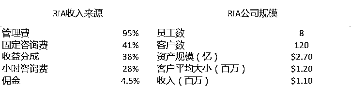

# 浮盈 10 亿美金：华泰的统包资产管理平台究竟价值几何?

> 原文：[`mp.weixin.qq.com/s?__biz=MzAxNTc0Mjg0Mg==&mid=2653293899&idx=1&sn=cc4247bbf95e3bfdc5a6771e1f52a37e&chksm=802dcf5eb75a464842676c9b8cb23bae7925310c6e800564baf925d5f5a76322da8870259733&scene=27#wechat_redirect`](http://mp.weixin.qq.com/s?__biz=MzAxNTc0Mjg0Mg==&mid=2653293899&idx=1&sn=cc4247bbf95e3bfdc5a6771e1f52a37e&chksm=802dcf5eb75a464842676c9b8cb23bae7925310c6e800564baf925d5f5a76322da8870259733&scene=27#wechat_redirect)

**标星★公众号     **爱你们♥

作者：徐杨

来源：新全球资产配置

**近期原创文章：**

## ♥ [5 种机器学习算法在预测股价的应用（代码+数据）](https://mp.weixin.qq.com/s?__biz=MzAxNTc0Mjg0Mg==&mid=2653290588&idx=1&sn=1d0409ad212ea8627e5d5cedf61953ac&chksm=802dc249b75a4b5fa245433320a4cc9da1a2cceb22df6fb1a28e5b94ff038319ae4e7ec6941f&token=1298662931&lang=zh_CN&scene=21#wechat_redirect)

## ♥ [Two Sigma 用新闻来预测股价走势，带你吊打 Kaggle](https://mp.weixin.qq.com/s?__biz=MzAxNTc0Mjg0Mg==&mid=2653290456&idx=1&sn=b8d2d8febc599742e43ea48e3c249323&chksm=802e3dcdb759b4db9279c689202101b6b154fb118a1c1be12b52e522e1a1d7944858dbd6637e&token=1330520237&lang=zh_CN&scene=21#wechat_redirect)

## ♥ 2 万字干货：[利用深度学习最新前沿预测股价走势](https://mp.weixin.qq.com/s?__biz=MzAxNTc0Mjg0Mg==&mid=2653290080&idx=1&sn=06c50cefe78a7b24c64c4fdb9739c7f3&chksm=802e3c75b759b563c01495d16a638a56ac7305fc324ee4917fd76c648f670b7f7276826bdaa8&token=770078636&lang=zh_CN&scene=21#wechat_redirect)

## ♥ [机器学习在量化金融领域的误用！](http://mp.weixin.qq.com/s?__biz=MzAxNTc0Mjg0Mg==&mid=2653292984&idx=1&sn=3e7efe9fe9452c4a5492d2175b4159ef&chksm=802dcbadb75a42bbdce895c49070c3f552dc8c983afce5eeac5d7c25974b7753e670a0162c89&scene=21#wechat_redirect)

## ♥ [基于 RNN 和 LSTM 的股市预测方法](https://mp.weixin.qq.com/s?__biz=MzAxNTc0Mjg0Mg==&mid=2653290481&idx=1&sn=f7360ea8554cc4f86fcc71315176b093&chksm=802e3de4b759b4f2235a0aeabb6e76b3e101ff09b9a2aa6fa67e6e824fc4274f68f4ae51af95&token=1865137106&lang=zh_CN&scene=21#wechat_redirect)

## ♥ [如何鉴别那些用深度学习预测股价的花哨模型？](https://mp.weixin.qq.com/s?__biz=MzAxNTc0Mjg0Mg==&mid=2653290132&idx=1&sn=cbf1e2a4526e6e9305a6110c17063f46&chksm=802e3c81b759b597d3dd94b8008e150c90087567904a29c0c4b58d7be220a9ece2008956d5db&token=1266110554&lang=zh_CN&scene=21#wechat_redirect)

## ♥ [优化强化学习 Q-learning 算法进行股市](https://mp.weixin.qq.com/s?__biz=MzAxNTc0Mjg0Mg==&mid=2653290286&idx=1&sn=882d39a18018733b93c8c8eac385b515&chksm=802e3d3bb759b42d1fc849f96bf02ae87edf2eab01b0beecd9340112c7fb06b95cb2246d2429&token=1330520237&lang=zh_CN&scene=21#wechat_redirect)

## ♥ [WorldQuant 101 Alpha、国泰君安 191 Alpha](https://mp.weixin.qq.com/s?__biz=MzAxNTc0Mjg0Mg==&mid=2653290927&idx=1&sn=ecca60811da74967f33a00329a1fe66a&chksm=802dc3bab75a4aac2bb4ccff7010063cc08ef51d0bf3d2f71621cdd6adece11f28133a242a15&token=48775331&lang=zh_CN&scene=21#wechat_redirect)

## ♥ [基于回声状态网络预测股票价格（附代码）](https://mp.weixin.qq.com/s?__biz=MzAxNTc0Mjg0Mg==&mid=2653291171&idx=1&sn=485a35e564b45046ff5a07c42bba1743&chksm=802dc0b6b75a49a07e5b91c512c8575104f777b39d0e1d71cf11881502209dc399fd6f641fb1&token=48775331&lang=zh_CN&scene=21#wechat_redirect)

## ♥ [计量经济学应用投资失败的 7 个原因](https://mp.weixin.qq.com/s?__biz=MzAxNTc0Mjg0Mg==&mid=2653292186&idx=1&sn=87501434ae16f29afffec19a6884ee8d&chksm=802dc48fb75a4d99e0172bf484cdbf6aee86e36a95037847fd9f070cbe7144b4617c2d1b0644&token=48775331&lang=zh_CN&scene=21#wechat_redirect)

## ♥ [配对交易千千万，强化学习最 NB！（文档+代码）](http://mp.weixin.qq.com/s?__biz=MzAxNTc0Mjg0Mg==&mid=2653292915&idx=1&sn=13f4ddebcd209b082697a75544852608&chksm=802dcb66b75a4270ceb19fac90eb2a70dc05f5b6daa295a7d31401aaa8697bbb53f5ff7c05af&scene=21#wechat_redirect)

## ♥ [关于高盛在 Github 开源背后的真相！](https://mp.weixin.qq.com/s?__biz=MzAxNTc0Mjg0Mg==&mid=2653291594&idx=1&sn=7703403c5c537061994396e7e49e7ce5&chksm=802dc65fb75a4f49019cec951ac25d30ec7783738e9640ec108be95335597361c427258f5d5f&token=48775331&lang=zh_CN&scene=21#wechat_redirect)

## ♥ [新一代量化带货王诞生！Oh My God！](https://mp.weixin.qq.com/s?__biz=MzAxNTc0Mjg0Mg==&mid=2653291789&idx=1&sn=e31778d1b9372bc7aa6e57b82a69ec6e&chksm=802dc718b75a4e0ea4c022e70ea53f51c48d102ebf7e54993261619c36f24f3f9a5b63437e9e&token=48775331&lang=zh_CN&scene=21#wechat_redirect)

## ♥ [独家！关于定量/交易求职分享（附真实试题）](https://mp.weixin.qq.com/s?__biz=MzAxNTc0Mjg0Mg==&mid=2653291844&idx=1&sn=3fd8b57d32a0ebd43b17fa68ae954471&chksm=802dc751b75a4e4755fcbb0aa228355cebbbb6d34b292aa25b4f3fbd51013fcf7b17b91ddb71&token=48775331&lang=zh_CN&scene=21#wechat_redirect)

## ♥ [Quant 们的身份危机！](https://mp.weixin.qq.com/s?__biz=MzAxNTc0Mjg0Mg==&mid=2653291856&idx=1&sn=729b657ede2cb50c96e92193ab16102d&chksm=802dc745b75a4e53c5018cc1385214233ec4657a3479cd7193c95aaf65642f5f45fa0e465694&token=48775331&lang=zh_CN&scene=21#wechat_redirect)

## ♥ [拿起 Python，防御特朗普的 Twitter](https://mp.weixin.qq.com/s?__biz=MzAxNTc0Mjg0Mg==&mid=2653291977&idx=1&sn=01f146e9a88bf130ca1b479573e6d158&chksm=802dc7dcb75a4ecadfdbdace877ed948f56b72bc160952fd1e4bcde27260f823c999a65a0d6d&token=48775331&lang=zh_CN&scene=21#wechat_redirect)

## ♥ [AQR 最新研究 | 机器能“学习”金融吗？](http://mp.weixin.qq.com/s?__biz=MzAxNTc0Mjg0Mg==&mid=2653292710&idx=1&sn=e5e852de00159a96d5dcc92f349f5b58&chksm=802dcab3b75a43a5492bc98874684081eb5c5666aff32a36a0cdc144d74de0200cc0d997894f&scene=21#wechat_redirect)

**正文**

2016 年 4 月，华泰证券财大气粗地砸下 7.8 亿美金，从两家美国私募公司 Aquiline Capital Partners 和 Genstar Capital 手上全资收购了 AssetMark，其英文全称为 AssetMark Financial Holdings, Inc，是一家美国的 Turnkey Asset Management Platform (TAMP) ，中文译作**【统包资产管理平台】**。

此消息一出，就在证券市场引发了众多关注和讨论，当时正值智能投顾的风口，国内很多媒体铺天盖地发消息：“华泰在美国买了一家智能投顾公司！”还有的说，“华泰买的是财富管理技术平台提供商。”

**这，是真的吗？**

3 年后，一切拉开了帷幕。2019 年 7 月 18 日，AssetMark 以超定价区间 1 美金——22 美金的价格，在纽交所挂牌，募集 2.75 亿美金。上市首日即上涨 22%，市值近 20 亿美金，PE 超过 60 倍。IPO 前，管理层持有不超过 2%的股份，IPO 后，华泰依然占绝对控股地位（~70%）。

当年华泰 7.8 亿美金的投资，如今市值 20 亿美金，翻了一番多。而 AssetMark 披露的报告显示，其 2017 年营业收入为 2.95 亿美金，2018 年有 3.63 亿美金，各占华泰这两个年份总收入的 9.5%和 15.3%，为华泰贡献了不少收入。

**这种级别的贡献和市场的预期，绝对不是一家单纯的智能投顾公司，或者是财富管理技术平台提供商能带来的。**

当年华泰收购 AssetMark，被给予了厚望：

*“考虑到中国高净值客户的资产配置需求，同时借鉴成熟市场客户服务体系，2016 年我们顺利完成收购美国 AssetMark 公司，为财富管理转型对接全球资源提供了强大的平台，国际化发展布局由此迈出关键一步。” **—— 华泰证券董事长周易，于 2016 年华泰证券年报。*

从目前的市场反应和公司经营情况来说，华泰超前的动作，是赌对了。

促使客户从多做交易转变为做资产配置，使运营核心从【客户经理】体系转变为【投资顾问】体系，是各大证券公司在积极转型道路上的重点。而 AssetMark 这样的 TAMP，能带来的不仅仅是技术的改进，还有经营体系的改革。

**TAMP 有何价值？**

**TAMP 是做什么的**

Turnkey Asset Management Platform (TAMP) ，我们中文一般译作【统包资产管理平台】，简单讲就是一站式的资产和财富管理平台。举个容易理解的栗子：入驻这样的平台，就跟去天猫开店一样，付钱，拎包入住，开业，而其它的杂事，都可以被平台给【统包】了。

TAMP 服务的体系是以美国独立投资顾问公司为代表的投资顾问体系，一级客户是机构，而且是持牌的投资顾问公司。这些持牌的投资顾问机构，在美国被统一称为 Registerd Investment Advisor（RIA），译作“注册投资顾问”。**TAMP 的价值，就在于给这些持牌的投资顾问公司，提供售前售中售后的一站式服务**，如下图所示，功能琳琅满目：

数据来源：《2018 中国理财师洞察报告》， by 慢钱、老虎证券

1990 年，TAMP 整个行业的规模不到 10 亿美金。经过十几年的发展，美国 TAMP 的总规模，已经超过了 3 万亿美金。发展至今，不仅新的参与者不断加入 TAMP，业内的老玩家也通过整合兼并不断壮大。

截止 2018 年，TAMP 行业中最大的三家参与者是 Envestnet 、 SEI 和 AssetMark。华泰 2016 年收购 AssetMark 的时候，它总共服务超过 7000 名独立投资顾问，平台总规模 323 亿美金。而另外两家早已上市，市值分别高达 37 亿美金和 86 亿美金。

数据来源：2019 RIA BIZ Report  

**TAMP 的服务对象**

从整体 10 亿到美国 3 万亿的规模，TAMP 行业为何在美国发展得如此蓬勃？这就需要理解美国以 RIA（注册投资顾问）为核心的投资顾问体系了。

在我们相对熟悉的中国金融行业，能向投资人收取管理费的机构，有公募基金、私募基金、券商资管、银行理财子公司等，它们的申请门槛、产品方式、客户对象的监管，都非常严格和复杂。其中，私募基金的门槛最低，理论上 3-5 个从业人员组合在一起，即可申请私募牌照。但是，其限制条件很多，只能通过私募基金向合格投资人募集资产，而且几乎无法从事投顾的工作。

美国的 RIA，要在州级别的金融监管机构或美国证监会注册，成为持牌机构。一旦注册成功，即可获得合理、合法管理客户资产的能力，并且能以【提供投资意见】为目的，收取【管理费】。RIA 实现资产管理的方式也非常多样，可以是全权委托专户（俗称“代客理财”），可以是非全权委托专户；可以是单纯地提供投资意见，也可以通过发行公募基金、ETF 或对冲基金，来管理客户的资产。

我自己就是一个于美国证监会注册的 RIA 公司的 CEO。我们不仅通过全权委托专户，为高净值客户实现了全球资产配置；并且也作为基金管理人，独立发行了一只在纳斯达克交易所挂牌的 ETF。**说白了，美国的 RIA 既可以是一般的投资顾问，也可以是基金的发行人和管理人，可以集多重身份为一体，展业的范围非常大**。

在美国注册 RIA 的公司很多，光是在美国证监会注册的就有超过 1 万 3000 家。你们猜猜最大的是谁？答案是 Vanguard（先锋集团），其管理的资产规模超过 4.5 万亿美金。BlackRock 旗下的 RIA 公司，资产管理规模超过 1.4 万亿美金，排名第四。而所有在 SEC 注册的 RIA 公司的总资产规模，超过了 75 万亿美金。

数据来源：RIA Channel

庞大的数量和资产规模，外加头部效应极强，所以导致大部分的 RIA 公司【小而精】。如上图所示：RIA 公司员工数的中位数在 8 左右，管理客户的数量在 150 左右，平均规模在 2 亿多美金。

但不管是资产规模过万亿、航空母舰般的先锋集团，还是资产规模几千万的新兴 RIA 公司，在业务流程上，都极为相似：获客，投资，管理和报告。**而对于那些规模中小、独立运营的 RIA 公司，资源不如大公司多，所以高效的资源分配就变得十分重要。**

**TAMP 的价值所在**

先来看下这些 RIA 公司及员工的日常，不仅日理万机，而且被前后夹击： 

*   因为公司小，所以规模效应有限，一人可能身兼数职：交易员、投研、市场营销等。

*   因为管理费是主要的收入方式，而管理费与资产管理的规模和表现直接挂钩，所以需要与客户建立长久的关系，并且要保持好的投资表现。

*   因为独立运营（非银行、保险、基金、券商旗下的附属公司），就需要投入时间和精力建立品牌。

*   因为智能投顾兴起，面临规模减小和费用下调的压力，所以还要花更多的时间去维护客户。

上述这些客观条件和挑战，让很多 RIA 公司被【2/8 错配】问题所困扰：**即 80%的精力用在了低附加值的、重复劳动型的运营项目上，只有剩下 20%的精力，是用在了高附加值的业务上。**如下图所示：

数据来源：新全球资产配置  

在这个几十万亿级别的金融服务市场中，这些 RIA 机构客户，其实有着极其强烈的外包低附加值业务的需求。而 TAMP 因为一站式服务的平台属性，在一个万亿级别的市场中，【统包】解决了客户的很多需求痛点——这就是 TAMP 蓬勃发展的核心动因。

TAMP 的目的是为独立的 RIA 公司，提供一个完整的、一站式的流程化服务。这个流程可能非常简单（如 100%基于 ETF 的智能投顾平台），也可能很复杂（如涉及财务规划和非标产品的投资）。美国著名的财富管理集团 Charles Schwab （嘉信理财）的一份报告，展示了其 TAMP 的能力：

数据来源：CharlesSchwab

**TAMP 要做的事，就是全心全意，为独立 RIA 公司服务，做好那些耗费 80%时间的杂事：科技、资产投研、行政管理，一个都不能少**。让独立的 RIA 公司，有更多的时间和精力寻找新的客户资源，有更多的时间和精力去维护客户关系，去发挥他们的作为投资顾问的最大价值。

在这个模式下，财富管理中最基础，也是最重要的一个环节，就是突出【人】的作用，要发挥人在和客户沟通、在信任传播过程中的优势。

**AssetMark 的业务是什么？**

对于 TAMP 行业排名老三的 AssetMark，有什么值得我们借鉴和学习的地方呢？

根据 AssetMark 的招股说明书，截止 2019 年 3 月底，其平台规模达到 497 亿美金，服务超过了 7600 位投资顾问。而且在过去 5 年中，平台资产规模的年化复合增长率高达 17%，跑赢同期标普 500 的 11%的年化复合增长率。

数据来源：AssetMark F1

上图为 AssetMark 的总体业务模式，也是传统的 TAMP 行业模式。其披露的商业模型跟上文提到的嘉信理财的 TAMP 流程，并没有本质上的区别。当然，嘉信理财目前市值超过了 550 亿美金，TAMP 只是嘉信理财的一个业务线，市值 19 亿美金的 AssetMark 不能与之单纯地相比。

我们也不能单纯地把 AssetMark 定位成一家智能投顾公司，或一个财富管理技术平台提供商，AssetMark 的公司体系和产品线决定了：**它是一家以通过服务美国 RIA 公司为主线，以公募基金产品为核心的金融服务平台。**

**公司体系**

接下来，我们来了解一下 AssetMark 的公司体系及其每个分支的特点。虽然规模比不上嘉信理财这样的超大型机构，但也五脏俱全：公募基金管理人，公募基金销售，养老金行政管理，信托公司，金融科技。

数据来源：AssetMark F-1  

**公募基金管理人**

AssetMark, Inc. （AMI） ，是在美国证监会注册的 RIA 公司。AMI 主要通过投资顾问为个人投资者提供广泛的财富管理解决方案，同时也为投资顾问提供开放式架构产品平台，以及量身定制客户建议、资产分配方案、实践管理、支持服务和技术。更重要的是，AMI 的存在，使 AssetMark 拥有了自营的能力。通过 AMI，AssetMark 建立了体系内的基金产品系列：GuideMark Funds，GuidePath Funds 和 Savos Dynamic Hedging Fund。

**公募基金销售**

AssetMark Brokerage, LLC（AMB），是一家美国交易商，其主要作用是为了辅助公募基金的直销和代销。只有通过 AMB 这家取得了公募基金销售牌照的交易商，AssetMark 自己和其平台上的 RIA 公司，才能赚取基金的销售费用。AMB 同时也为 AssetMark 平台上的 RIA 公司，为从业人员提供挂靠场所。此交易商并不从事交易和清算业务。

**养老金行政管理**

AssetMark Retirement Services, Inc. （ARS），是一家专门为小型企业的养老金产品提供记账和三方行政管理的服务。

**信托公司**

AssetMark Trust Company （ATC），是一家持牌的信托公司，为投资人、RIA、AssetMark 自己的基金管理人提供托管记录等行政服务。

**有了这四家公司， 所有在 AssetMark 平台上托管的资产，都可以留存在自己的体系内，从各个线条上为客户创造价值，同时赚取服务费**。AssetMark 有自己的公募基金产品，外加销售公募基金的费用可观，所以所有产品线以公募基金为主；业务线方面，则以服务使用公募基金进行财务管理的 RIA 为主。因而 AssetMark 在收入来源上即是：既可赚管理费，也可赚销售费用，更可以赚平台费。

基于 AssetMark 2016 年的资料

AssetMark 的主要产品线，不乏公募基金巨头，如 BlackRock，State Street，AQR；也有像 Salient 和 AlphaSimple 这样提供管理型期货、战术资产配置策略的另类资产管理人。从核心股票资产，到收益增强，再到债券和另类，AssetMark 的产品线完全可以满足大部分高净值客户的需求。

**金融科技**

有了产品、牌照和服务人员，怎么能少了科技的助力呢？我们深度接触过使用 AssetMark 平台的美国机构，对于 AssetMark 的技术能力，他们主要的反馈是：与金融科技公司相比，差得还比较远。其实，这也是美国传统金融服务公司的通病。直到近 3、5 年，在各个智能投顾平台的竞争下，众多美国金融巨头买的买，自建的自建，花了不少钱才逐渐补足自己科技的短板。

基于 AssetMark 2016 年的资料  

而 AssetMark 也确实看到了自己金融科技上的短板，从 2016 年开始，通过自建和收购，加快了客户数据集成和分析，以及定制化投顾服务的能力：

数据来源：AssetMark F-1  

从 2015 年到 2019 年，AssetMark 一共花费了 1.53 亿美金，用在新技术的研发和技术团队的扩张上。而技术平台持续的迭代、高效解决方案的更新，也是为了给 RIA 公司和客户提供更好的服务，满足他们更多的需求。

当然有了新的技术，没有更多客户来用是不行的。AssetMark 在这个期间，大约花费了超过 7000 万美金收购 RIA 公司和平台，足足捕获了超过 70 亿美金的资产规模。当然这一系列密集的动作，少不了亲爸爸华泰的支持。

*"TAMP is all about asset "gathering".*

*"统包资产管理平台的重点不在资产管理，而在于资产集合"*

从 AssetMark 的收入结构上看，你会发现，不管是金融科技助力，还是产品线，还是运营线，还是买买买，最后只有一个目的：**帮助平台增加资产规模，规模增长才是硬道理。**作为一个 TAMP，非常自然地能想到，AssetMark 收入中绝大部分来自或者依赖于资产规模，数据显示，其这一比例为 99%。

数据来源：AssetMark F-1

如上图，我们看一下 AssetMark 的收入结构： 

Asset-based revenue：来自 AssetMark 进行统包管理的费用收入。

Asset-based net revenue：在以上收入基础上，扣除付给策略管理人、资产管理人和其它资产统包相关的三方费用（PB、托管、投顾、市场营销等费用）后的净收入。

Spread-based revenue：AssetMark 信托公司上托管的资产的利差收入。

Spread-based net revenue：在以上收入基础上，扣除支付给第三方行政管理人后的净利差收入。

**从收入分类上看，虽然 AssetMark 自己的信托可以托管资产，但由于没有牌照做存贷业务，也就只能赚取银行和客户的利差收入了，无法实现较高的利息收入。**

如果把这些收入，换算成基于统包资产规模的费率百分比后，我们发现，AssetMark 的利润空间还是不错的。0.70%左右的毛平均统包资产费率，处于行业的中上水平；扣除各种相关费用后，净统包费率在 0.50%左右，如下图所示： 

数据来源：AssetMark F-1

从 0.70%到 0.50%的 0.20%的这部分费用中，80%的成本来自第三方的策略提供方、二级基金经理和二级投顾。在品牌、能力、资源和渠道的博弈下，AssetMark 雇佣了很多实力更强的第三方资产管理人，来辅助客户的资产管理，如 BlackRock，StateStreet。

虽然 AssetMark 有自己的公募基金，但也不可能完全靠自己的产品满足客户的需求。毕竟 TAMP 属于一个较为中立的平台，对平台来说，更多、更快地整合各方的资产，比去市场上与传统的资产管理人 PK 管理能力，更为重要。

我们看到，AssetMark 在 IPO 的同时，华泰也给 AssetMark 的管理层，授予了总价值超过 1.27 亿美金的股权激励计划，而且管理层和员工期权计划，总计占普通股股本近 10%的比例，可谓是花了大价钱来保持管理层的稳定性，也让管理层放开手脚，继续燥。**AssetMark 持续稳定的运营和增长，必然也会反哺华泰在国内市场的投资顾问体系。**

**TAMP 对中国财富管理的未来****有何借鉴意义？**

资本市场发展二十余年，关于投资顾问业务的法律法规，最早涉及这块的是 1997 年出台的《证券、期货投资咨询管理暂行办法》。在现行的投顾制度中，不允许持牌的投顾机构开展【全权委托】，也就是俗称的“代客理财”。

**而全权委托的能力，却是健全良好的投资顾问体系中，最不可或缺的一环，是投顾体系心脏。**美国在 1940 年的《投资顾问法》中，就明确规定了投资顾问公司可以提供间接或者直接的投资意见，并且获得报酬。更重要的是，这个法案巩固了投资顾问公司开展全权委托业务的法律基础。

数据来源：新全球资产配置

国内一直以来就对投顾试点的关注度非常高：

*“证监会将积极支持资产配置业务发展，推动行业机构建设服务于养老金资产配置的全链条、多层次专业架构，服务各类养老金长期投资、价值投资，实现保值增值和可持续发展。**要着力拓展行业机构资产配置业务。**支持基金中基金（FOF）发展，大力发展养老目标基金；**推进基金投资顾问业务试点，将散户短期交易性资金逐步转化为长期配置性力量。**”——证监会副主席李超，于 2018.11.16。*

最近有消息传出，目前进入公募投顾试点的大概有 7-8 家机构，包括公募基金公司和三方理财机构。其中极可能有平台型的蚂蚁金服、腾讯理财通、盈米基金，和部分老牌基金公司如易方达、中欧、华夏、南方等在内。**公募投顾试点的业务，可能会准许进行以公募基金产品为标的的基金委托业务，试点内容的核心就是【全权委托】。**

为什么券商缺席了？公募基金是资管的大头，有着天然的优势：监管严格，标准化产品丰富，有管理能力。而三方理财机构，也有着天然的优势：业务灵活，手握渠道和客户，大量地应用互联网手段。券商虽然有着较强的产品创设和投资管理能力，但在实现公募基金资产配置的能力、议价能力上还有待考验，因此缺席了首批试点名单。

从直销、代销，到自建线上基金超市，再到借力三方平台，基金公司的渠道虽然一直在拓展，但是同质化严重，导致竞争过于激烈。一些有远见的基金公司也寻求着新的突围手段，比如易方达联合 CFP 推出中国理财师大赛，大力举办“易路前行”的全国巡讲。如果公募投顾试点能够顺利实施，对于过去一直被渠道所困扰的老牌公募基金，想必是一条令之兴奋的全新出路。

申购费用一降再降，而渠道成本却在上升。**在海外，历史上很多费用高昂但是效果不佳的渠道，渐渐被投顾所替代**。目前，投顾机构作为公募基金销售渠道占比超过 60%，这是因为在成熟的以收取【管理费】为主的投顾体系中，通过公募基金做配置的需求极大。**如果国内这次允许开展【全权委托】试点，可能会开启中国 TAMP 行业的元年。**因为有了全权委托，才能给投资顾问体系注入全新的活力；而有健全良好的投资顾问体系，TAMP 才有用武之地。

TAMP（统包资产管理平台），不是一个纯技术的平台，不是简单的智能投顾，而是一个以金融服务为核心的投顾服务体系。从美国的经验来看，一个成功的 TAMP，均为【公募】+【渠道】的结合。剩下的服务模块也是围绕着产品和销售，比如客户画像、投研、组合、执行和报告。虽然这些都是既有的业务，但是从 toC，到 toB 的变化，是牵动全身的变化，不仅得有 toB 的基因，还得有很强的金融基因，要将这些业务线平台化，并不容易。

腾讯通过腾安基金，布局了基金销售，又握有腾讯理财通的这张流量王牌，但腾讯的金融 toB 业务一直没有做起来。而蚂蚁金服，虽然 toB 基因极强，旗下还有蚂蚁财富和财富号等平台，最近也联姻了先锋基金，但服务投资顾问的专业能力还是比较存疑。倒是盈米基金，其服务体系和其金融基因的结合，比较像一个 TAMP。

数据来源：盈米基金

盈米基金成立的时点在 2015 年 5 月，早一年于华泰公开宣布收购 AssetMark。其从创立一开始，走的就是独立三方、主打 FOF 和基金组合销售的模式。

“且慢”上的大 V，是带有中国特色的投资顾问，以平台加持的手段，辐射 C 端客户；“啟明”和“蜂鸟”，对标的是 TAMP 中的投顾中后台服务：测评开户、资产组合、交易执行、运营支持；“FOF 研究院”则承担了资产和配置的投研能力，为平台使用方提供持续的投研支持。

金融需要插上互联网的翅膀，但在互联网公司估值高企、所有行业互联网化、不把自己喊成纯技术平台都不好意思的大背景下，很多商业模式，还要回归到金融服务的本质。

**写在最后**

财富管理行业中，在【规模】和【收益】之间，有着天然的矛盾：要想活下来并且把规模做大，就得有高收益来吸引客官，但是预期收益要求过高，又有可能操之过急掉进坑里，最后满盘皆输。在这个行业待得越久做得越多，我越坚信，规模对于金融公司更为重要。

在市场监管日趋严格和严谨的形势下，追寻高收益也会越来越被淡化。那么在政策允许的前提下，行业的突破口在哪里？

按照互联网的说法，TAMP 是借助互联网化的专业经营和规模效应，极大化地帮助投资顾问公司解决了【拉新】，【促活】，【留存】，【营收】这四大问题。**正是有平台的存在，打破了规模和收益的二维格局，给行业注入了两个新的维度，【时间】和【空间】。**

**时间换空间：**投顾公司使用平台后，节省了时间、精力。把节省的时间专注在高附加值的业务上，将客户对收益的预期控制在合理范围内，那么存活的时间就可能更长久。而时间越长，复利的力量就越大，资产规模也就越能提高。

**空间换时间：**投顾公司使用平台后，节省了运营成本。有了成本的节省和效率的提升，对客户的让利空间就越大。不管是投顾，还是资管，客户的稳定非常重要。有了更多让利客户的空间，就越能在低谷期留住客户，或者抵御竞争。

不管是银行理财子公司，还是公募投顾试点，这些政策上的创新，反映出的是财富管理市场对健全良好的投资顾问体系的渴求。

天时、地利、人和，让我们拭目以待中国 TAMP 行业的蓬勃发展吧。

*—End—*

量化投资与机器学习微信公众号，是业内垂直于**Quant**、**MFE**、**CST、AI**等专业的**主****流量化自媒体**。公众号拥有来自**公募、私募、券商、银行、海外**等众多圈内**10W+**关注者。每日发布行业前沿研究成果和最新量化资讯。

你点的每个“在看”，我都认真当成了喜欢