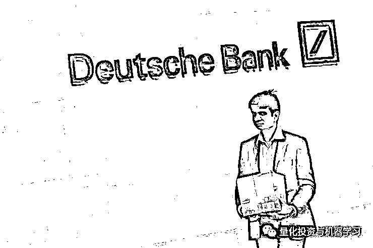
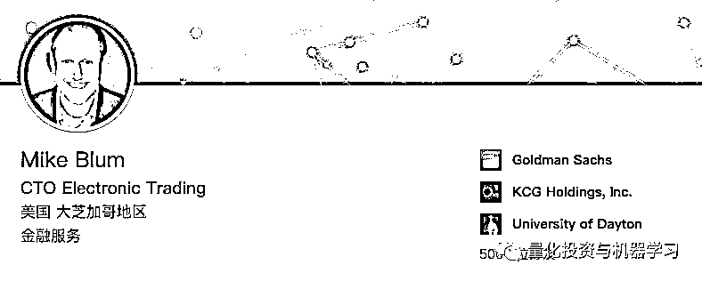

# 高盛花了 1 个亿！为减少股票交易的毫秒数

> 原文：[`mp.weixin.qq.com/s?__biz=MzAxNTc0Mjg0Mg==&mid=2653293827&idx=1&sn=63b4342fd6837f5a1771939735a635ac&chksm=802dcf16b75a46001c0216ce70b6f31ea9fd45aaf984d3b882279f436e483eb91821211fe689&scene=27#wechat_redirect`](http://mp.weixin.qq.com/s?__biz=MzAxNTc0Mjg0Mg==&mid=2653293827&idx=1&sn=63b4342fd6837f5a1771939735a635ac&chksm=802dcf16b75a46001c0216ce70b6f31ea9fd45aaf984d3b882279f436e483eb91821211fe689&scene=27#wechat_redirect)

**标星★公众号     **爱你们♥

**近期原创文章：**

## ♥ [5 种机器学习算法在预测股价的应用（代码+数据）](https://mp.weixin.qq.com/s?__biz=MzAxNTc0Mjg0Mg==&mid=2653290588&idx=1&sn=1d0409ad212ea8627e5d5cedf61953ac&chksm=802dc249b75a4b5fa245433320a4cc9da1a2cceb22df6fb1a28e5b94ff038319ae4e7ec6941f&token=1298662931&lang=zh_CN&scene=21#wechat_redirect)

## ♥ [Two Sigma 用新闻来预测股价走势，带你吊打 Kaggle](https://mp.weixin.qq.com/s?__biz=MzAxNTc0Mjg0Mg==&mid=2653290456&idx=1&sn=b8d2d8febc599742e43ea48e3c249323&chksm=802e3dcdb759b4db9279c689202101b6b154fb118a1c1be12b52e522e1a1d7944858dbd6637e&token=1330520237&lang=zh_CN&scene=21#wechat_redirect)

## ♥ 2 万字干货：[利用深度学习最新前沿预测股价走势](https://mp.weixin.qq.com/s?__biz=MzAxNTc0Mjg0Mg==&mid=2653290080&idx=1&sn=06c50cefe78a7b24c64c4fdb9739c7f3&chksm=802e3c75b759b563c01495d16a638a56ac7305fc324ee4917fd76c648f670b7f7276826bdaa8&token=770078636&lang=zh_CN&scene=21#wechat_redirect)

## ♥ [机器学习在量化金融领域的误用！](http://mp.weixin.qq.com/s?__biz=MzAxNTc0Mjg0Mg==&mid=2653292984&idx=1&sn=3e7efe9fe9452c4a5492d2175b4159ef&chksm=802dcbadb75a42bbdce895c49070c3f552dc8c983afce5eeac5d7c25974b7753e670a0162c89&scene=21#wechat_redirect)

## ♥ [基于 RNN 和 LSTM 的股市预测方法](https://mp.weixin.qq.com/s?__biz=MzAxNTc0Mjg0Mg==&mid=2653290481&idx=1&sn=f7360ea8554cc4f86fcc71315176b093&chksm=802e3de4b759b4f2235a0aeabb6e76b3e101ff09b9a2aa6fa67e6e824fc4274f68f4ae51af95&token=1865137106&lang=zh_CN&scene=21#wechat_redirect)

## ♥ [如何鉴别那些用深度学习预测股价的花哨模型？](https://mp.weixin.qq.com/s?__biz=MzAxNTc0Mjg0Mg==&mid=2653290132&idx=1&sn=cbf1e2a4526e6e9305a6110c17063f46&chksm=802e3c81b759b597d3dd94b8008e150c90087567904a29c0c4b58d7be220a9ece2008956d5db&token=1266110554&lang=zh_CN&scene=21#wechat_redirect)

## ♥ [优化强化学习 Q-learning 算法进行股市](https://mp.weixin.qq.com/s?__biz=MzAxNTc0Mjg0Mg==&mid=2653290286&idx=1&sn=882d39a18018733b93c8c8eac385b515&chksm=802e3d3bb759b42d1fc849f96bf02ae87edf2eab01b0beecd9340112c7fb06b95cb2246d2429&token=1330520237&lang=zh_CN&scene=21#wechat_redirect)

## ♥ [WorldQuant 101 Alpha、国泰君安 191 Alpha](https://mp.weixin.qq.com/s?__biz=MzAxNTc0Mjg0Mg==&mid=2653290927&idx=1&sn=ecca60811da74967f33a00329a1fe66a&chksm=802dc3bab75a4aac2bb4ccff7010063cc08ef51d0bf3d2f71621cdd6adece11f28133a242a15&token=48775331&lang=zh_CN&scene=21#wechat_redirect)

## ♥ [基于回声状态网络预测股票价格（附代码）](https://mp.weixin.qq.com/s?__biz=MzAxNTc0Mjg0Mg==&mid=2653291171&idx=1&sn=485a35e564b45046ff5a07c42bba1743&chksm=802dc0b6b75a49a07e5b91c512c8575104f777b39d0e1d71cf11881502209dc399fd6f641fb1&token=48775331&lang=zh_CN&scene=21#wechat_redirect)

## ♥ [计量经济学应用投资失败的 7 个原因](https://mp.weixin.qq.com/s?__biz=MzAxNTc0Mjg0Mg==&mid=2653292186&idx=1&sn=87501434ae16f29afffec19a6884ee8d&chksm=802dc48fb75a4d99e0172bf484cdbf6aee86e36a95037847fd9f070cbe7144b4617c2d1b0644&token=48775331&lang=zh_CN&scene=21#wechat_redirect)

## ♥ [配对交易千千万，强化学习最 NB！（文档+代码）](http://mp.weixin.qq.com/s?__biz=MzAxNTc0Mjg0Mg==&mid=2653292915&idx=1&sn=13f4ddebcd209b082697a75544852608&chksm=802dcb66b75a4270ceb19fac90eb2a70dc05f5b6daa295a7d31401aaa8697bbb53f5ff7c05af&scene=21#wechat_redirect)

## ♥ [关于高盛在 Github 开源背后的真相！](https://mp.weixin.qq.com/s?__biz=MzAxNTc0Mjg0Mg==&mid=2653291594&idx=1&sn=7703403c5c537061994396e7e49e7ce5&chksm=802dc65fb75a4f49019cec951ac25d30ec7783738e9640ec108be95335597361c427258f5d5f&token=48775331&lang=zh_CN&scene=21#wechat_redirect)

## ♥ [新一代量化带货王诞生！Oh My God！](https://mp.weixin.qq.com/s?__biz=MzAxNTc0Mjg0Mg==&mid=2653291789&idx=1&sn=e31778d1b9372bc7aa6e57b82a69ec6e&chksm=802dc718b75a4e0ea4c022e70ea53f51c48d102ebf7e54993261619c36f24f3f9a5b63437e9e&token=48775331&lang=zh_CN&scene=21#wechat_redirect)

## ♥ [独家！关于定量/交易求职分享（附真实试题）](https://mp.weixin.qq.com/s?__biz=MzAxNTc0Mjg0Mg==&mid=2653291844&idx=1&sn=3fd8b57d32a0ebd43b17fa68ae954471&chksm=802dc751b75a4e4755fcbb0aa228355cebbbb6d34b292aa25b4f3fbd51013fcf7b17b91ddb71&token=48775331&lang=zh_CN&scene=21#wechat_redirect)

## ♥ [Quant 们的身份危机！](https://mp.weixin.qq.com/s?__biz=MzAxNTc0Mjg0Mg==&mid=2653291856&idx=1&sn=729b657ede2cb50c96e92193ab16102d&chksm=802dc745b75a4e53c5018cc1385214233ec4657a3479cd7193c95aaf65642f5f45fa0e465694&token=48775331&lang=zh_CN&scene=21#wechat_redirect)

## ♥ [拿起 Python，防御特朗普的 Twitter](https://mp.weixin.qq.com/s?__biz=MzAxNTc0Mjg0Mg==&mid=2653291977&idx=1&sn=01f146e9a88bf130ca1b479573e6d158&chksm=802dc7dcb75a4ecadfdbdace877ed948f56b72bc160952fd1e4bcde27260f823c999a65a0d6d&token=48775331&lang=zh_CN&scene=21#wechat_redirect)

## ♥ [AQR 最新研究 | 机器能“学习”金融吗？](http://mp.weixin.qq.com/s?__biz=MzAxNTc0Mjg0Mg==&mid=2653292710&idx=1&sn=e5e852de00159a96d5dcc92f349f5b58&chksm=802dcab3b75a43a5492bc98874684081eb5c5666aff32a36a0cdc144d74de0200cc0d997894f&scene=21#wechat_redirect)

编辑：公众号海外部

**背景**

2019 年 7 月 8 日，一名携带箱子的男子离开德意志银行驻伦敦办事处

德意志银行 7 月宣布退出股票交易，震惊了世界。但它不会是最后一家放弃股市的投资银行。

当被解雇的员工拿着解雇证明艰难地走出办公室时，媒体正确地聚焦在这家德国最大银行多年来肆无忌惮的野心和管理上的不善。但这掩盖了一个有关 68 万亿美元股市的事实：除了少数几家美国大型公司外，几乎所有人都认为股票交易是赔钱的事情。

在过去 10 年里**，数万亿美元从指数基金等主动策略转向被动策略，而量化基金和高频交易在日常交易中占据了更多的交易量**。

这损害了大多数老派对冲基金和资产管理公司的利益，并催生了复杂的电子交易平台，佣金仅占人工撮合交易的一小部分。

与此同时，各国央行在金融危机后的大部分时间里都在降息或将利率维持在接近于零的水平，有效地吸收了市场的波动性，使大客户更有可能继续观望。去年，MiFID II 的欧洲监管机构对股票交易和研究进行了拆分，加大了这两方面的定价压力。

给大家科普一下**MiFID II**：

MiFID（Markets in Financial Instruments Directive）是指“欧盟金融工具市场指导”，是欧盟地区规范金融投资公司行为的法律框架文件，旨在促进欧盟形成金融工具批发以及零售交易的统一市场，同时在多个方面改善对客户的保护，其中包括增强市场透明度、出台更符合惯例的客户分类规则等。

最新 MiFID II 和 MiFIR 于 2018 年 1 月 3 日生效。MiFID 法律框架最初于 2004 年颁布，并于 2007 年 11 月正式生效。但在金融危机过后，欧盟委员会又于 2011 年 10 月决定对 MiFID 进行了一次修订，并于 2014 年 6 月 12 日公布了修订版，被称为 MiFID II，并公布了 MiFIR“欧盟金融工具市场法规”(Markets in Financial Instruments Regulation )，该法规旨在阐明 MiFID II 框架下的具体法律法规。

MiFID II 对其第一版改进的内容主要涉及投资服务提供方式、指令豁免范围、交易场所的组织规定、数据服务提供商的授权和义务、合格监管部门的制裁权利、第三国公司设立分公司等方面。其中，最为显著的修改有三处：集中化的交易系统、增加市场透明度，和订单最优执行。

在集中化的交易系统方面，重新定义一种新型交易场所—有组织交易场所（Organized trading facility，OTF），并将其纳入与场内交易场所相同的监管范畴。如将风险较高的衍生品集中化交易（引入场内交易），比如二元期权等。

在市场透明度方面，新法规对经纪商的报告要更多且细。MiFIR 的交易报告是 T+1 报告，逐条列记投资者交易相关信息，包括买、卖方信息、价格质量、执行速度、结算规模、执行地点、到期日期及标的货币以及提交数据的数目及属性性质。此外，经纪商也必须公开报价。

在订单最优执行方面，投资公司需要采取所有合理的步骤，以便为客户指令获得最好的执行结果，这里面涉及到价格、成本、速度、指令执行的可能性以及指令的处置结果。同时，明确系统化内部撮合商在交易前以及交易后的责任，交易后的责任包括，公司必须达到透明度的要求，要有与监管市场同等的透明度。

**回到主题：**

一家大型投资银行的资深股票高管表示：“客户正遭受损失，银行太多了。”

根据 Coalition 数据显示，在股票收入排名中，低于摩根士丹利、高盛和摩根大通的是 UBS、Bank of America 和花旗集团。巴克莱、Credit Suisse、法国兴业银行、HSBC 和法国巴黎银行的股价在进一步下跌。据报道，**德意志银行的股票部门去年亏损 7.5 亿美元**。

据一位业内人士说，排名前五名之外的银行通常没有足够的收入来实现至少 10%的股本回报率，这是投资者预期的最低门槛。

一项创新使竞争变得更加激烈：**对冲基金和资产管理公司越来越多地使用所谓 Aalgo Wheel（算法轮）自动将交易接到经纪商**，并获得最佳表现。这是也是因为 MiFID II 的原因（前面说到的合规问题）。

要想留在游戏中，**银行必须参与一场昂贵的技术军备竞赛，在从 smart routers 和算法到高速连接到交易所等基础设施上投入数百万美元**。

接下来，规模较小的银行将更难管理。最大的投资银行已经拥有最多的交易数据。内部人士表示，**随着他们越来越善于将人工智能和其他技术应用于这些数据集，他们将越来越具有优势**。

**股票交易员和销售人员已经被挤出这个行业，或者被更年轻、更廉价、技术含量更高的员工取****代**。Coalition 表示，至少自 2012 年以来，全球最大投资银行的就业水平每年都在下降。

**精要** 

根据公众号最新了解到的消息：高盛首席技术官 Mike Blum 称，高盛最近批准了一项**为期三年**的计划，**斥资逾 ****1 亿美元 ****对其股票交易平台进行全面改革**。

从技术角度看，文艺复兴和 Two Sigma 这样的巨头量化对冲基金是最苛刻的客户之一，而竞争对手摩根士丹利和 J.P. Morgan 也一直在竞争为量化基金提供服务。

Blum 说：“随着我们在全球范围内推广这项技术，他们的速度肯定会有很大的提高。”

**正文**

高盛正将目标对准全球最大的量化对冲基金。

该项目的名字为**Atlas**，旨在加速高盛自 2014 年以来在华尔街股票技术军备竞赛中落后的转变。

Blum 说：“有了这项投资，让我们可以尝试去解决量化对冲基金领域的问题，为我们的客户创造无缝的体验，并尽可能地提高他们工作的效率”。Blum 在电子交易领域工作了 25 年，于 2017 年加入高盛。

随着高盛、摩根士丹利和 J.P. Morgan 等公司在不断萎缩的市场中赢得越来越大的份额，股票交易变得越来越残酷。这**三家银行今年迄今的股票交易收入为 114 亿美元，比 2018 年低 14%**。随着全球交易量越来越多地转向电子交易，**这三家公司都在投资最新的电子交易技术**。

通过 Atlas，高盛瞄准了十多只量化基金，这些基金代表着一系列的交易风格，理论上如果它们能满足这个群体，就能满足任何类型的对冲基金或资产管理公司客户。

Blum 表示，该项目此该技术引入其核心交易平台，旨在提高交易速度和可靠性，并将其扩展到全球 32 个市场，包括清算和结算交易、股票分配、贷款股票和交易报告等其他功能。

Blum 说：“当我们了解到量化客户群体以及他们的需求时，我们决定采用这项技术，基本上把它变成一个框架，可以用来解决多种问题。”

Blum 的整个职业生涯都在致力于改进他的电子交易方式。他说，**他和其他电子交易先驱所采用的设计理念是：****使用所谓的微服务（microservices）将复杂的问题分解成易于解决的问题**。有了这一点，**再加上被称为 Event Sourcing 的开发策略，高盛的系统变得更快速、更可靠和可定制。**

**1 微秒等于百万分之一秒（10 的负 6 次方秒）**

Blum 说，其中一个目标是提高盛在交易订单上的表现，对于持续一微秒到大约 30 秒的交易订单其存续期较短，过去高盛可能一直难以处理这些订单。他说，在某些情况下，耗时数百毫秒的交易速度将超过 100 微秒。

Blum 表示，一些量化分析师可能会同时发送数百或数千笔交易，Atlas 能够压缩高盛消化这些订单的时间。

Blum 还说：“随着我们在全球范围内推广这项技术，机构的速度肯定会有很大的提高”。“机构应该看到执行质量的提高，这不仅仅是因为速度，而是**因为我们正在彻底重写我们的算法**，我们招募了更多的研究员和更多的量化分析师来改进我们的算法。”

国内的量化机构似乎这几年也在做着类似的事情，高频交易、机器学习应用等。加油！任重而道远！ 

*—End—*

量化投资与机器学习微信公众号，是业内垂直于**Quant**、**MFE**、**CST、AI**等专业的**主****流量化自媒体**。公众号拥有来自**公募、私募、券商、银行、海外**等众多圈内**10W+**关注者。每日发布行业前沿研究成果和最新量化资讯。

你点的每个“在看”，我都认真当成了喜欢