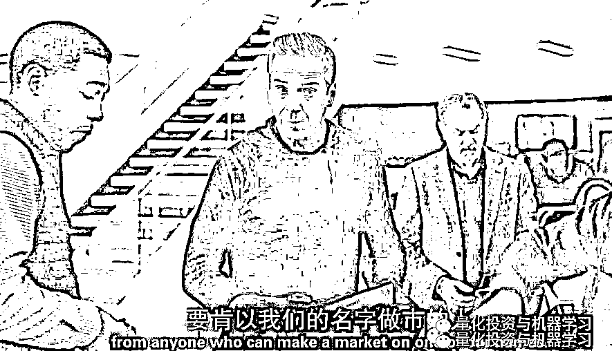

# 扒一扒 Billions 第四季：你必须知道的投资秘密（上）

> 原文：[`mp.weixin.qq.com/s?__biz=MzAxNTc0Mjg0Mg==&mid=2653293801&idx=1&sn=00e71e5179b99ac8cf60ecebf996d37c&chksm=802dcefcb75a47ea118e5c20195a85ceabd4785eacc67a31c380450a856219ffd9b50466429e&scene=27#wechat_redirect`](http://mp.weixin.qq.com/s?__biz=MzAxNTc0Mjg0Mg==&mid=2653293801&idx=1&sn=00e71e5179b99ac8cf60ecebf996d37c&chksm=802dcefcb75a47ea118e5c20195a85ceabd4785eacc67a31c380450a856219ffd9b50466429e&scene=27#wechat_redirect)

**标星★公众号     **爱你们♥

**近期原创文章：**

## ♥ [5 种机器学习算法在预测股价的应用（代码+数据）](https://mp.weixin.qq.com/s?__biz=MzAxNTc0Mjg0Mg==&mid=2653290588&idx=1&sn=1d0409ad212ea8627e5d5cedf61953ac&chksm=802dc249b75a4b5fa245433320a4cc9da1a2cceb22df6fb1a28e5b94ff038319ae4e7ec6941f&token=1298662931&lang=zh_CN&scene=21#wechat_redirect)

## ♥ [Two Sigma 用新闻来预测股价走势，带你吊打 Kaggle](https://mp.weixin.qq.com/s?__biz=MzAxNTc0Mjg0Mg==&mid=2653290456&idx=1&sn=b8d2d8febc599742e43ea48e3c249323&chksm=802e3dcdb759b4db9279c689202101b6b154fb118a1c1be12b52e522e1a1d7944858dbd6637e&token=1330520237&lang=zh_CN&scene=21#wechat_redirect)

## ♥ 2 万字干货：[利用深度学习最新前沿预测股价走势](https://mp.weixin.qq.com/s?__biz=MzAxNTc0Mjg0Mg==&mid=2653290080&idx=1&sn=06c50cefe78a7b24c64c4fdb9739c7f3&chksm=802e3c75b759b563c01495d16a638a56ac7305fc324ee4917fd76c648f670b7f7276826bdaa8&token=770078636&lang=zh_CN&scene=21#wechat_redirect)

## ♥ [机器学习在量化金融领域的误用！](http://mp.weixin.qq.com/s?__biz=MzAxNTc0Mjg0Mg==&mid=2653292984&idx=1&sn=3e7efe9fe9452c4a5492d2175b4159ef&chksm=802dcbadb75a42bbdce895c49070c3f552dc8c983afce5eeac5d7c25974b7753e670a0162c89&scene=21#wechat_redirect)

## ♥ [基于 RNN 和 LSTM 的股市预测方法](https://mp.weixin.qq.com/s?__biz=MzAxNTc0Mjg0Mg==&mid=2653290481&idx=1&sn=f7360ea8554cc4f86fcc71315176b093&chksm=802e3de4b759b4f2235a0aeabb6e76b3e101ff09b9a2aa6fa67e6e824fc4274f68f4ae51af95&token=1865137106&lang=zh_CN&scene=21#wechat_redirect)

## ♥ [如何鉴别那些用深度学习预测股价的花哨模型？](https://mp.weixin.qq.com/s?__biz=MzAxNTc0Mjg0Mg==&mid=2653290132&idx=1&sn=cbf1e2a4526e6e9305a6110c17063f46&chksm=802e3c81b759b597d3dd94b8008e150c90087567904a29c0c4b58d7be220a9ece2008956d5db&token=1266110554&lang=zh_CN&scene=21#wechat_redirect)

## ♥ [优化强化学习 Q-learning 算法进行股市](https://mp.weixin.qq.com/s?__biz=MzAxNTc0Mjg0Mg==&mid=2653290286&idx=1&sn=882d39a18018733b93c8c8eac385b515&chksm=802e3d3bb759b42d1fc849f96bf02ae87edf2eab01b0beecd9340112c7fb06b95cb2246d2429&token=1330520237&lang=zh_CN&scene=21#wechat_redirect)

## ♥ [WorldQuant 101 Alpha、国泰君安 191 Alpha](https://mp.weixin.qq.com/s?__biz=MzAxNTc0Mjg0Mg==&mid=2653290927&idx=1&sn=ecca60811da74967f33a00329a1fe66a&chksm=802dc3bab75a4aac2bb4ccff7010063cc08ef51d0bf3d2f71621cdd6adece11f28133a242a15&token=48775331&lang=zh_CN&scene=21#wechat_redirect)

## ♥ [基于回声状态网络预测股票价格（附代码）](https://mp.weixin.qq.com/s?__biz=MzAxNTc0Mjg0Mg==&mid=2653291171&idx=1&sn=485a35e564b45046ff5a07c42bba1743&chksm=802dc0b6b75a49a07e5b91c512c8575104f777b39d0e1d71cf11881502209dc399fd6f641fb1&token=48775331&lang=zh_CN&scene=21#wechat_redirect)

## ♥ [计量经济学应用投资失败的 7 个原因](https://mp.weixin.qq.com/s?__biz=MzAxNTc0Mjg0Mg==&mid=2653292186&idx=1&sn=87501434ae16f29afffec19a6884ee8d&chksm=802dc48fb75a4d99e0172bf484cdbf6aee86e36a95037847fd9f070cbe7144b4617c2d1b0644&token=48775331&lang=zh_CN&scene=21#wechat_redirect)

## ♥ [配对交易千千万，强化学习最 NB！（文档+代码）](http://mp.weixin.qq.com/s?__biz=MzAxNTc0Mjg0Mg==&mid=2653292915&idx=1&sn=13f4ddebcd209b082697a75544852608&chksm=802dcb66b75a4270ceb19fac90eb2a70dc05f5b6daa295a7d31401aaa8697bbb53f5ff7c05af&scene=21#wechat_redirect)

## ♥ [关于高盛在 Github 开源背后的真相！](https://mp.weixin.qq.com/s?__biz=MzAxNTc0Mjg0Mg==&mid=2653291594&idx=1&sn=7703403c5c537061994396e7e49e7ce5&chksm=802dc65fb75a4f49019cec951ac25d30ec7783738e9640ec108be95335597361c427258f5d5f&token=48775331&lang=zh_CN&scene=21#wechat_redirect)

## ♥ [新一代量化带货王诞生！Oh My God！](https://mp.weixin.qq.com/s?__biz=MzAxNTc0Mjg0Mg==&mid=2653291789&idx=1&sn=e31778d1b9372bc7aa6e57b82a69ec6e&chksm=802dc718b75a4e0ea4c022e70ea53f51c48d102ebf7e54993261619c36f24f3f9a5b63437e9e&token=48775331&lang=zh_CN&scene=21#wechat_redirect)

## ♥ [独家！关于定量/交易求职分享（附真实试题）](https://mp.weixin.qq.com/s?__biz=MzAxNTc0Mjg0Mg==&mid=2653291844&idx=1&sn=3fd8b57d32a0ebd43b17fa68ae954471&chksm=802dc751b75a4e4755fcbb0aa228355cebbbb6d34b292aa25b4f3fbd51013fcf7b17b91ddb71&token=48775331&lang=zh_CN&scene=21#wechat_redirect)

## ♥ [Quant 们的身份危机！](https://mp.weixin.qq.com/s?__biz=MzAxNTc0Mjg0Mg==&mid=2653291856&idx=1&sn=729b657ede2cb50c96e92193ab16102d&chksm=802dc745b75a4e53c5018cc1385214233ec4657a3479cd7193c95aaf65642f5f45fa0e465694&token=48775331&lang=zh_CN&scene=21#wechat_redirect)

## ♥ [拿起 Python，防御特朗普的 Twitter](https://mp.weixin.qq.com/s?__biz=MzAxNTc0Mjg0Mg==&mid=2653291977&idx=1&sn=01f146e9a88bf130ca1b479573e6d158&chksm=802dc7dcb75a4ecadfdbdace877ed948f56b72bc160952fd1e4bcde27260f823c999a65a0d6d&token=48775331&lang=zh_CN&scene=21#wechat_redirect)

## ♥ [AQR 最新研究 | 机器能“学习”金融吗？](http://mp.weixin.qq.com/s?__biz=MzAxNTc0Mjg0Mg==&mid=2653292710&idx=1&sn=e5e852de00159a96d5dcc92f349f5b58&chksm=802dcab3b75a43a5492bc98874684081eb5c5666aff32a36a0cdc144d74de0200cc0d997894f&scene=21#wechat_redirect)

作者：蹲哥

**前言**

第三季末时，查克为扳倒腐败的联邦检察长却遭手下背叛，失去职位。而鲍比也因自己的雇员自立门户而多了一个强敌。季末，查克、温迪和鲍比三人同坐一桌，昔日的对手现今一笑抹恩仇，你能想象这三人如果联手起来会发生什么吗？

这部剧，能让你们真正见识到什么叫**“有钱任性”**，什么才是**“为所欲为”**。以及：

**想要拥有这样的财富，需要付出什么代价**

如果你还意犹未尽或第一次观看：

**第 1、2、3、4 季资源我们全部帮你整理好**

**文末查看**

今天**蹲哥**为大家扒一扒 Billions 第四季那些你必须知道的投资知识！**超精彩！**

本期带来第一集~第四集。

**第一集**

第一集主要是两条线，bobby 和 taylor 争中东主权财富基金的投资，还有 chuck 各种求人想办法给某大佬在纽约（全美枪支管制最严区域）办持枪证。

我们现在特么都降到了行业标准价了（管理费 2%，盈利提成 20%），特么不能再低了，**要知道 bobby 原型 steven cohen 这种行业顶级大佬的收费标准-盈利要跟人家对半分：****是 50%！**然后 Wags 之后和中东人也是在这个收费标准上讨价还价，中东人是觉得自己这种巨额投资能打个折啥的啊。

第一集里面强调了一点：

**信息、资源共享**  

这里编剧可能借鉴了对冲基金巨头-极度透明、极度坦诚、完全开放头脑-的桥水（bridgewater）文化，**桥水所有员工对话、会议都要录音，提倡对同事有意见当面说出来，若被发现背后讲坏话就会被开除**。

**投资的本质是寻找真相，桥水这套文化，就是为了尽快找到真相，即使真相可能很残酷**，自己都不愿意接受，但也得接受，所以 bobby 让霸气姐完整得把自己的观点、自己掌握的信息分享出来，不要藏着掖着，而桥水老板 ray dalio 的经典名言是：**我随时做好准备我是错的可能性。**这个思维的形成，源于他在 80 年代一次全军覆没破产的经历，而且他在国会听证会信誓旦旦的讲自己的逻辑时还被录了视频，ray dalio 认为这是他最丢人的时刻。

小哥因社交媒体被开除，现在投**行招聘确实会评估你的社交媒体账号的使用情况**，你这个人是不是坦诚是不是心里有鬼？**美国投行面试的一关是被问及尖锐问题时的测谎仪测试，无数人被淘汰，因为每个人心里多少都有一点鬼，而这一点鬼可能在某个时刻触发他的情绪、心理波动，扰乱思维和行动。**

**第二集**

Bobby 先拿下美女投的公司的四分之一股权，然后派印度裔员工潜伏进竞争对手去拿他们违法的证据（低于最低工资雇佣非法移民，用低用工成本的优势来低报价竞标打击竞争对手获取市场份额），新闻一公开，bobby 之前拿到的股权大幅升值，因最大的竞争对手挂了。

而对付 taylor 这边，先让银行不给 taylor 钱，然后格力高趁机推荐自己人上，taylor 识破格力高想增加对基金控制权的阴谋，打电话喷银行的说自己拿到钱了，借 bobby 的力阻止黑帮兄弟拿钱给自己，最后和格力高摊牌，让格力高找银行资源的资金给自己。

第三季的时候，因为 bobby 的一档子事，警察养老基金明面上已经不大好把钱投给 bobby，bobby 想了个招找了个濒临破产的白手套在前台，自己幕后指导交易，20 亿的管理规模按业界行规，基金管理人可以收 20%的收益提成，2%的管理费，bobby 跟白手套说这部分一人一半，各 1%和 10%，以比特币的方式给 bobby，然后 bobby 再把自己的一半再分给黑光头劳尔，而黑光头有钱后的消费方式引起了 chuck 警局新伙伴的注意，怎么解决？牺牲白手套，让利给新伙伴咯。

关于 taylor 的借贷问题：

**对冲基金是有杠杆的，简单的说要问银行借钱投资**（注意是债权，只需要付利息），比如有些套利投资，不用杠杆去做的话，收益率会很可怜，当年诺奖得主坐镇可以说全明星阵容的做国债套利的美国长期资本（LTCM），98 年因俄罗斯黑天鹅爆亏那个案例-LTCM 最高峰大概有四五十亿美元的规模（投资人投资），但它的投资规模可以达到 1000 亿美元，就是说很大一部分钱是问银行借的，赚是爆赚，亏起来也是亏成狗，LTCM 在几个月内就亏了投资人投资的 90%的钱，成也杠杆，败也杠杆。2015 年股灾，很多人也是这么破产的，自己的钱然后配资公司配 10 倍，碰到股灾出现流动性危机，卖都卖不掉，资产归 0 可能还要倒欠配资公司，**所以对于大部分人来说，无论怎么样，不要借钱投资股票，也不要碰期货等衍生品。**  

bobby 无非是阻止银行借钱给 taylor。

**第三集**

美国第 35 任总统肯尼迪的父亲-约瑟夫肯尼迪，也是 20 世纪 20 年代华尔街的传奇人物，股票投机交易、做庄、操纵股票可以说样样精通，一个典型的案例：他在 1929 年美国大萧条股灾前夕清仓，而且还通过做空赚了很多钱（美国排名前列的富豪），**就是这样的人物后来在 1932 年被罗斯福任命为了美国证监会（SEC）的首任主席（简单的类比-徐翔当上了中国证监会主席****）。**

一开始媒体是各种讥讽，你这特么不是派一只狐狸去看守鸡窝么，然而老肯尼迪可以说干得一级棒，他根据自己这么多年的资本市场的经验，召集全美最优秀的律师，组织出台了一批分别针对信息披露、商业银行业务隔离、内幕交易、操纵股价等一系列问题进行监管的法律法规，为战后华尔街的长期大繁荣奠定了决定性的基础。庄家还得老庄家来对付，不是么？

后面的故事大家都知道了-1960 年他儿子小肯尼迪当上了美国总统，我们同样华尔街出身的 Chuck 老爹最终会培育个什么级别的儿子呢？

印象中第一季有交代，bobby 是三流大学出来商品期货交易起家的，怎么这季突然变成和 taylor 比拼数学技能的 geek boy 了

这一集最烧脑的就是这张导数推导图。

**大概是期权定价的一些公式，价格的概率分布之类的，涉及到偏微分、随机过程....等数学。**做交易员一定要懂这些么？不是的，毕竟 taylor 是做金融工程、量化交易的，懂这些是必须的，这集 taylor 老爹也入场了，大概就是个失意的火箭科学家，天问为什么我当年没有对冲基金这玩意？我认为 bobby 之前的人设也是不擅长搞这些的，他的强项是主观交易实战经验，而非量化交易金工，这种活交给手下就行了啊，所以这里编剧有点出乎意料，神话男主角？

这集 bobby 用黑客手段盗取了 taylor 的持仓信息和交易模型，然后先于她们入场，提高 taylor 公司的入场成本，减少 taylor 公司的收益。**打个比方，我知道有一笔大资金要入市交易买入做多，我提前扫掉现在的卖盘买入，然后往上挂高一个价位卖出（t+0 市场），等着你（taylor）这笔大资金入市来扫我的单子，我一买一卖，不仅让你的入场成本提高了，还直接从你身上吃到了蚂蚁肉。**

Bill 部分，Bill 通过送餐员得知阿肯色州鸡肉指数编制人的底细，知道这个人从不认真去调研养鸡场真实的数据，只是在家里打打电话让养鸡场自己报数据，养鸡场么当然希望鸡肉价格越高越好咯，肯定说我们现在鸡很少啊之类的.......千算万算就是没算到这家伙会突然死亡（不要太宅？）

这里说到了关于交易的一部分真相：**只要做这行，你一定会看错的，一定会遭遇失败的，某种意义上交易是失败者的游戏，而如何处理失败的交易则涉及到生死存亡的问题**，也是业余和专业的分水岭，你可以思考下大部分散户从小亏到套牢的过程。我很喜欢的一句话并作为自己的交易格言分享给大家：

**Best loser is the long-term winner**

最擅输者才是长期的赢家

Bill 为什么鸡冻到要拿病鸡去传染禽流感病毒，有人说这是他对 bobby 的忠心，不否认这点，从另外一个**利益角度**来看，这笔交易造成了巨大亏损，严重影响 Bill 的年底绩效分成，有句话怎么港，人为财死...............

@hedgehogDerek

其实第三集剧情是有 bug 的，一开始的策略就不应该是 long 而是应该 short，市场只要知道真实的鸡比统计值高就 OK 了啊。而且鸡肉大王死了以后，多头平掉，反手更大仓位做空就好了，反正已经掌握了确定性。

上面这个微博这位网友说，其实他们一开始就应该做空，把这个指数编制人的丑闻直接公布给媒体就行了，这样市场就都知道真实的鸡比公布的数据多了。

对于上面的对话，Bill 的意思-**早前市场的预期**就是鸡会比较多，这说明当时的市场走势已经在下跌，这是在数据公布前大部分人的看法，那么即使数据公布过剩，**市场已经部分 price in 了**，还能有什么大的收益呢，而且你跟大部分人的预期一样，对手盘就少，流动性因素，你也很难建很大的仓位进去，而做多能轻易的建很大的仓位（市面到处都是对手盘，上面 bill 回 wags 说比这还要好的原因），如 bobby 听完 Bill 的逻辑说的：加大仓位搞啊，我们这单交易能有 3 亿的利润。

如果不公开丑闻，直接让这个不真实的数据公布的话，那就会造成一个**强烈的反预期**，到时候不用说多头发力了，空头的止损盘买入平仓都能让鸡的价格飙升................

后面发现人死了，如果是我的话，我也会选择马上减仓，而不是搞什么贿赂七个人的骚操作，做多的确定性因素已经没有了，完全是在赌博了，第一时间减仓位才是理性的选择，至于反不反手做空就不一定了，市场预期就一定是对的么？真实的数据就一定是过剩的么？

但是 bobby 他们干进去的是巨量的资金，**什么是市场主力？他们就是鸡市场的做多市场主力了，不是说散户一秒钟买入卖出，抽身谈何容易啊（搁浅的伦敦鲸鱼案例-摩根大通），可能会付出很大的交易冲击成本，那还不如赌一下数据算了........**

这是做消息驱动交易一些精髓的东西....

预期-超预期-反预期.............

**第四集**

网络被黑，只有打电话交易了，能干这活的也只有三个经历过 old 时代的老交易员了，**互联网确实比以前交易方便太多了，然而过分依赖它也就成了你的致命弱点**，当然也说明另外一个问题：这个时代**网络安全**太重要了....第一集 chuck 是到处送自己的停车卡，这集是 Bobby 到处跟人说自己在 Arthur Ashe（纽约的以美国网球名宿命名的著名网球场，也是美网的主体育场）有贵宾包厢（my box on arthur ashe），一起看美网公开赛啊...

上图 bobby 语 make a market，这是美国市场和 A 股的不同之处，**美国实行的是做市商制度，由交易所指定做市商来提供市场流动性，而且还能起到平抑市场波动的作用，堪称对付股价坐庄操纵的利器，而 A 股目前还是以自动撮合交易为主**。

那个慌慌张张通风报信的家伙，应该是之前 axe 就布局好的在港口工作的工作人员。本来开盘的时候他们的组合面临 5.12 亿的损失（风险敞口），三个人打了一天电话在消息扩散前卖出了 90%的天然气产业链股票，最后只亏了几千万美元。这个情报值多少钱？

上集 bobby front-run （抢跑）搞了 taylor，这集 taylor front-run 搞回来，而且受益比 bobby 上集多多了-完美避开了天然气产业链的黑天鹅事件。

这集 chuck 很牛逼的致敬丘吉尔的演讲，他勇敢得采纳了老爹建议以自爆抖 m 来应对政敌的威胁，当然牺牲了 wendy 的尊严，现实中真的有人这么干么？

真有，故事就发生在丘吉尔老乡英国政客身上，英国议会下院议长叫 John Bercow，保守党，此人口才了得，在议会经常有精彩的发言，网上有很多他的视频剪辑，算是网红政客。

不过这个故事的主角不是他，他的老婆 Sally  Bercow：

在 2009 年的时候决定参加第二年 5 月的伦敦威斯敏斯特特区的市议员竞选，和她老公不同，她打算成为一名工党议员（不同政见可以在一起的），骚操作来了，在竞选前她主动联系媒体爆料自己 20 多岁的时候就染上了酗酒的恶习，还经常和请她喝酒的男士一夜情，直到 2000 年后才戒酒。Sally 觉得主动曝光自己过去生活中的所有“丑事”后，她现在已经没有任何“见不得人”的秘密了，如今她可以一身轻松地进军英国政坛，不用再怕竞争对手去挖她的私生活丑闻了。Sally 这个行为还是惊得英国朝野上下目瞪口呆，有英国保守党议员说，允许自己老婆向媒体发表这样的访谈，你让国民怎么相信我们议员的判断力？

你猜 Sally 2010 年成功了没?

In 2010, she stood as Labour candidate for the St James's ward of Westminster City Council, **unsuccessfully**.

**1-4 季视频下载**

在**后台**输入（严格大小写）

**手慢无**

***Billions_ 全 4 季***

*—End—*

量化投资与机器学习微信公众号，是业内垂直于**Quant**、**MFE**、**CST、AI**等专业的**主****流量化自媒体**。公众号拥有来自**公募、私募、券商、银行、海外**等众多圈内**10W+**关注者。每日发布行业前沿研究成果和最新量化资讯。

