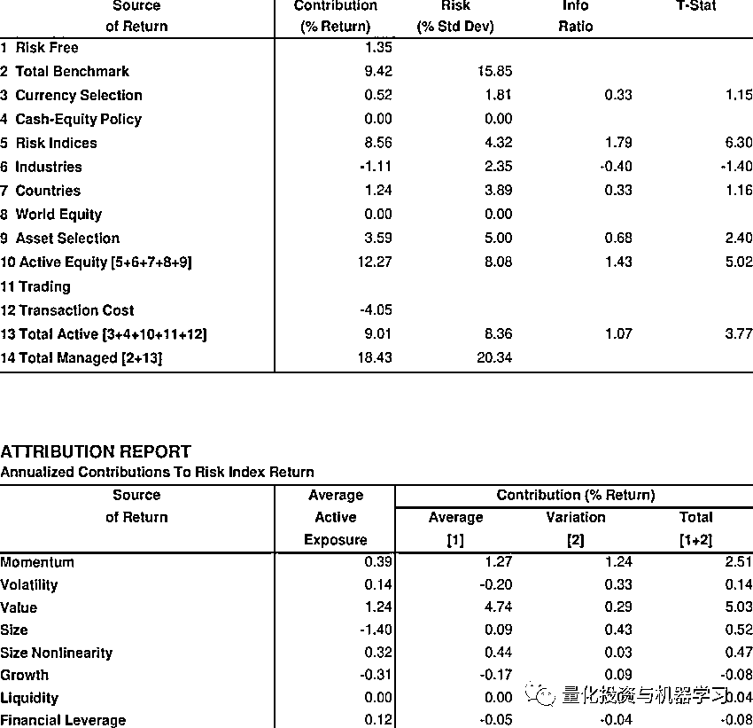
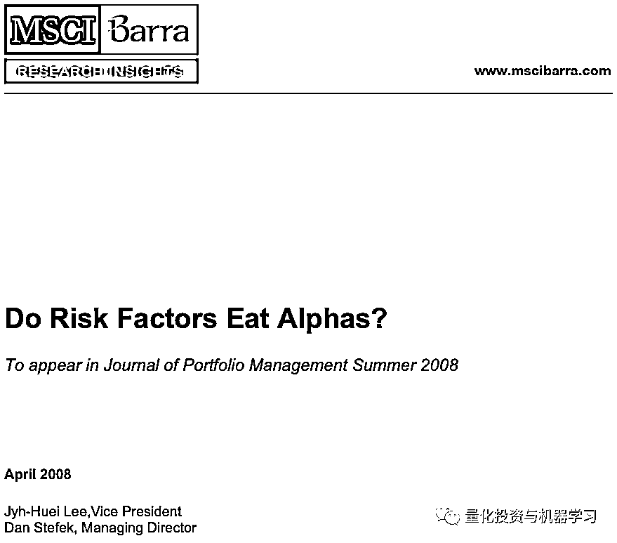
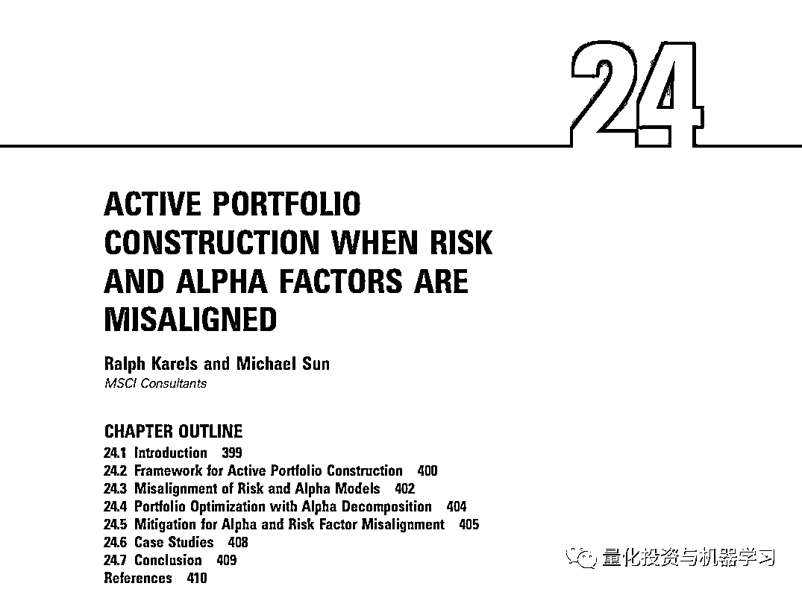
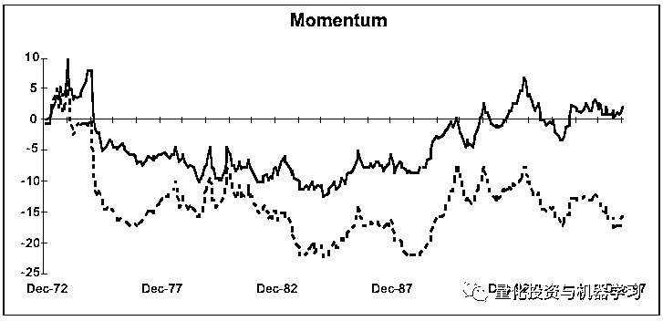
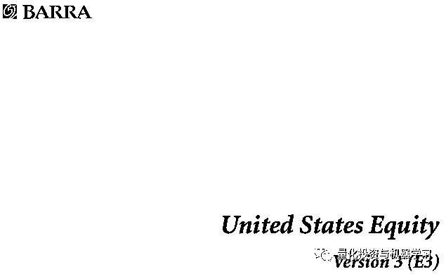
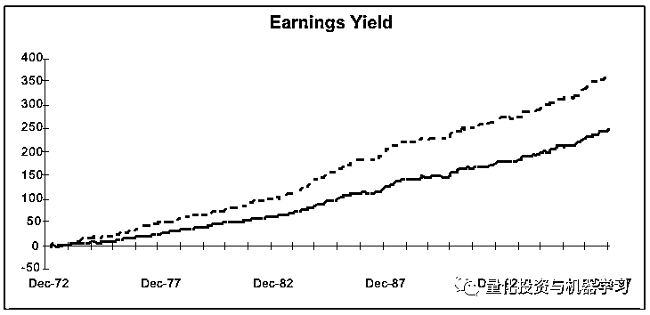

# 因子投资：两个分歧，四个时代！

> 原文：[`mp.weixin.qq.com/s?__biz=MzAxNTc0Mjg0Mg==&mid=2653293781&idx=1&sn=0e8dcb72f8908775728da07ace7263ea&chksm=802dcec0b75a47d60c1d1d2d1c49439cd244c9b16b1619e4d34e36104b0c827fc84e896cd6a2&scene=27#wechat_redirect`](http://mp.weixin.qq.com/s?__biz=MzAxNTc0Mjg0Mg==&mid=2653293781&idx=1&sn=0e8dcb72f8908775728da07ace7263ea&chksm=802dcec0b75a47d60c1d1d2d1c49439cd244c9b16b1619e4d34e36104b0c827fc84e896cd6a2&scene=27#wechat_redirect)

**标星★公众号     **爱你们♥

作者：Mike Fernandez

编译：公众号海外部

**近期原创文章：**

## ♥ [5 种机器学习算法在预测股价的应用（代码+数据）](https://mp.weixin.qq.com/s?__biz=MzAxNTc0Mjg0Mg==&mid=2653290588&idx=1&sn=1d0409ad212ea8627e5d5cedf61953ac&chksm=802dc249b75a4b5fa245433320a4cc9da1a2cceb22df6fb1a28e5b94ff038319ae4e7ec6941f&token=1298662931&lang=zh_CN&scene=21#wechat_redirect)

## ♥ [Two Sigma 用新闻来预测股价走势，带你吊打 Kaggle](https://mp.weixin.qq.com/s?__biz=MzAxNTc0Mjg0Mg==&mid=2653290456&idx=1&sn=b8d2d8febc599742e43ea48e3c249323&chksm=802e3dcdb759b4db9279c689202101b6b154fb118a1c1be12b52e522e1a1d7944858dbd6637e&token=1330520237&lang=zh_CN&scene=21#wechat_redirect)

## ♥ 2 万字干货：[利用深度学习最新前沿预测股价走势](https://mp.weixin.qq.com/s?__biz=MzAxNTc0Mjg0Mg==&mid=2653290080&idx=1&sn=06c50cefe78a7b24c64c4fdb9739c7f3&chksm=802e3c75b759b563c01495d16a638a56ac7305fc324ee4917fd76c648f670b7f7276826bdaa8&token=770078636&lang=zh_CN&scene=21#wechat_redirect)

## ♥ [机器学习在量化金融领域的误用！](http://mp.weixin.qq.com/s?__biz=MzAxNTc0Mjg0Mg==&mid=2653292984&idx=1&sn=3e7efe9fe9452c4a5492d2175b4159ef&chksm=802dcbadb75a42bbdce895c49070c3f552dc8c983afce5eeac5d7c25974b7753e670a0162c89&scene=21#wechat_redirect)

## ♥ [基于 RNN 和 LSTM 的股市预测方法](https://mp.weixin.qq.com/s?__biz=MzAxNTc0Mjg0Mg==&mid=2653290481&idx=1&sn=f7360ea8554cc4f86fcc71315176b093&chksm=802e3de4b759b4f2235a0aeabb6e76b3e101ff09b9a2aa6fa67e6e824fc4274f68f4ae51af95&token=1865137106&lang=zh_CN&scene=21#wechat_redirect)

## ♥ [如何鉴别那些用深度学习预测股价的花哨模型？](https://mp.weixin.qq.com/s?__biz=MzAxNTc0Mjg0Mg==&mid=2653290132&idx=1&sn=cbf1e2a4526e6e9305a6110c17063f46&chksm=802e3c81b759b597d3dd94b8008e150c90087567904a29c0c4b58d7be220a9ece2008956d5db&token=1266110554&lang=zh_CN&scene=21#wechat_redirect)

## ♥ [优化强化学习 Q-learning 算法进行股市](https://mp.weixin.qq.com/s?__biz=MzAxNTc0Mjg0Mg==&mid=2653290286&idx=1&sn=882d39a18018733b93c8c8eac385b515&chksm=802e3d3bb759b42d1fc849f96bf02ae87edf2eab01b0beecd9340112c7fb06b95cb2246d2429&token=1330520237&lang=zh_CN&scene=21#wechat_redirect)

## ♥ [WorldQuant 101 Alpha、国泰君安 191 Alpha](https://mp.weixin.qq.com/s?__biz=MzAxNTc0Mjg0Mg==&mid=2653290927&idx=1&sn=ecca60811da74967f33a00329a1fe66a&chksm=802dc3bab75a4aac2bb4ccff7010063cc08ef51d0bf3d2f71621cdd6adece11f28133a242a15&token=48775331&lang=zh_CN&scene=21#wechat_redirect)

## ♥ [基于回声状态网络预测股票价格（附代码）](https://mp.weixin.qq.com/s?__biz=MzAxNTc0Mjg0Mg==&mid=2653291171&idx=1&sn=485a35e564b45046ff5a07c42bba1743&chksm=802dc0b6b75a49a07e5b91c512c8575104f777b39d0e1d71cf11881502209dc399fd6f641fb1&token=48775331&lang=zh_CN&scene=21#wechat_redirect)

## ♥ [计量经济学应用投资失败的 7 个原因](https://mp.weixin.qq.com/s?__biz=MzAxNTc0Mjg0Mg==&mid=2653292186&idx=1&sn=87501434ae16f29afffec19a6884ee8d&chksm=802dc48fb75a4d99e0172bf484cdbf6aee86e36a95037847fd9f070cbe7144b4617c2d1b0644&token=48775331&lang=zh_CN&scene=21#wechat_redirect)

## ♥ [配对交易千千万，强化学习最 NB！（文档+代码）](http://mp.weixin.qq.com/s?__biz=MzAxNTc0Mjg0Mg==&mid=2653292915&idx=1&sn=13f4ddebcd209b082697a75544852608&chksm=802dcb66b75a4270ceb19fac90eb2a70dc05f5b6daa295a7d31401aaa8697bbb53f5ff7c05af&scene=21#wechat_redirect)

## ♥ [关于高盛在 Github 开源背后的真相！](https://mp.weixin.qq.com/s?__biz=MzAxNTc0Mjg0Mg==&mid=2653291594&idx=1&sn=7703403c5c537061994396e7e49e7ce5&chksm=802dc65fb75a4f49019cec951ac25d30ec7783738e9640ec108be95335597361c427258f5d5f&token=48775331&lang=zh_CN&scene=21#wechat_redirect)

## ♥ [新一代量化带货王诞生！Oh My God！](https://mp.weixin.qq.com/s?__biz=MzAxNTc0Mjg0Mg==&mid=2653291789&idx=1&sn=e31778d1b9372bc7aa6e57b82a69ec6e&chksm=802dc718b75a4e0ea4c022e70ea53f51c48d102ebf7e54993261619c36f24f3f9a5b63437e9e&token=48775331&lang=zh_CN&scene=21#wechat_redirect)

## ♥ [独家！关于定量/交易求职分享（附真实试题）](https://mp.weixin.qq.com/s?__biz=MzAxNTc0Mjg0Mg==&mid=2653291844&idx=1&sn=3fd8b57d32a0ebd43b17fa68ae954471&chksm=802dc751b75a4e4755fcbb0aa228355cebbbb6d34b292aa25b4f3fbd51013fcf7b17b91ddb71&token=48775331&lang=zh_CN&scene=21#wechat_redirect)

## ♥ [Quant 们的身份危机！](https://mp.weixin.qq.com/s?__biz=MzAxNTc0Mjg0Mg==&mid=2653291856&idx=1&sn=729b657ede2cb50c96e92193ab16102d&chksm=802dc745b75a4e53c5018cc1385214233ec4657a3479cd7193c95aaf65642f5f45fa0e465694&token=48775331&lang=zh_CN&scene=21#wechat_redirect)

## ♥ [拿起 Python，防御特朗普的 Twitter](https://mp.weixin.qq.com/s?__biz=MzAxNTc0Mjg0Mg==&mid=2653291977&idx=1&sn=01f146e9a88bf130ca1b479573e6d158&chksm=802dc7dcb75a4ecadfdbdace877ed948f56b72bc160952fd1e4bcde27260f823c999a65a0d6d&token=48775331&lang=zh_CN&scene=21#wechat_redirect)

## ♥ [AQR 最新研究 | 机器能“学习”金融吗？](http://mp.weixin.qq.com/s?__biz=MzAxNTc0Mjg0Mg==&mid=2653292710&idx=1&sn=e5e852de00159a96d5dcc92f349f5b58&chksm=802dcab3b75a43a5492bc98874684081eb5c5666aff32a36a0cdc144d74de0200cc0d997894f&scene=21#wechat_redirect)

**前言**

**如今的量化研究者们似乎在创新和工程之间存在分歧。**一种是在寻找预测另类数据和机器学习等领域收益的新因子。另外一种的重点是投资于更成熟的因子，如价值、动力和质量等，在这些因子中，长期的耐心、信念和执行似乎比创新重要得多。那么我们是怎么走到这一步的呢？

为了探究“创新因子”和“风险溢价因子”之间有趣但矛盾的相互作用，这一次，**通过 Barra 风险模型**的视角来为大家讲述。

**一、简约时代（2005 年以前）**

# 自上世纪 80 年代初以来，传统的量化投资是这样的：

**▍步骤 1**

**找出 Alpha 因子**——这些特征可以预测股票收益的横截面，并反映出一些基本的逻辑，或者可能是一些稍微带点技术性的方面特征，比如价格动量，并结合到一个特定股票排名模型中。

**▍步骤 2**

**建立一个最优的投资组合**——通过将步骤 1 的最终排名（可能经过一些调整）作为预期收益输入带有风险模型的优化器，风险模型通常由第三方（如 Barra、Northfield 或 Axioma）提供。

**Asset Selection****是 Barra 的 Alpha 术语，但收益的剩余部分，无法用他们的风险模型来解释。**

起初，你可能会感到很困惑。Barra 的风险因子列表被称为 Risk Indices，其中包括一些与我们的 Alpha 因子相同的名字，比如估值和动量。难道我们不想把优化的投资组合加载到这些上面吗？为什么我们的大部分收益来自 Asset Selection 而不是 Risk Indices，这是一件好事？

不！所有这些 Barra 因子都只是风险。你的客户是不需要他们的。他们想要不相关的 Alpha，而 risk indice 中没有 Alpha。你想把它们从你的投资组合中清除出去，这是优化器无论如何都要做的。

**随着时间的推移，这种观点被证明在错与对之间。****和大多数传统量化分析师一样，错误地认为客户不会直接投资于风险因子。****这导致许多传统的量化投资者完全错过了当前的因子投资热潮。****然而，这样又是对的，即不相关的阿 Alpha 存在于这些 risk indices 之外。**

下图是我们将要查看的 Barra 归因报告的典型摘要视图。最大化第 9 行，同时最小化所有其他行，这是最初 Quant 们的游戏目标。

John B. Guerard

尽管许多最初的 Alpha 因子被归为价值、动量和质量，如今这些已被广泛认为因子投资，但有一个转折点，你必须提出与 Barra 不同的 Barra 因子，以便在优化过程中不会吃掉你 Alpha（第 2 步）:

*论文下载：*

*https://pdfs.semanticscholar.org/121d/7617986b9addd0d249fe7a4a742dbbb522d7.pdf*

**宽客们最初的游戏是寻找因子的分化而不是收敛。**

举个例子，如果你只使用一个简单的定义值像 universe-wide 市净率排名，这恰好是 Barra 的一个因子，那么 Barra 会在你的预期收益中看到额外的风险，并尽量减少它，将风险预算转移到特殊的预期回报部分。另一方面，如果你用不同的滞后、归一化和调整，对价值做出一个复杂的、多因子的定义——Barra 不会在这样的预期收益中看到太多的风险，并将其转移到 Asset Selection 领域。

许多人将第一阶段描述为一个错误指定的**Alpha VS 风险因子模型**问题，但我们相信最初的设置工作得很好——特别是对于包含创新思想的模型。**Barra 清理了风险敞口，提高了信息比率，并降低了与其他有效量化策略的相关性**。与此同时，风险预测仍然准确无误——由于存在 Alpha 因子，残差确实包含一些额外的相关性，但它们对已实现跟踪误差的实际影响微乎其微。

**二、复杂时代（2005-2009）**

然而，随着时间的推移，“mis-specified model 问题”发展成为：

*下载地址：*

*https://www.msci.com/documents/10199/c6e5e3f7-cd44-4322-aeb5-331e20e2afb7*

随之而来的是大量的投资组合构建工作，这些工作构建自定义的风险模型，创建纯正交因子模拟投资组合、反向优化以及各种复杂但 engineering-friendly 的解决方案。但风险预测已经非常准确，因此对其进行修正并没有对信息比率产生多大改善。**Man Group 的首席信息官 Sandy Rattray 将此类研究项目称为越陷越深（going down rabbit holes）**。如果继续把重点放在有利于创新的研究任务上，那就更好了。

模型失配（model-misalignment）问题的主要是由于因子维度的一阶矩与二阶矩的性质不同而引起的错误。尽管两者偶尔会重叠，但细分的专业化带来了更高的质量风险预测和持续的 Alpha 创新。

我们第一次遇到这种误解是与 Barra 的一位高级研究员交谈时，他告诉我，他的工作是提出 Barra 风险模型之外的新因子，而他的回答是，这是不可能的。“我们的模型已经包含了所有的因子”他自信地说。由于他们的模型残差表现出纯粹的随机性，他觉得有理由做出这个强有力的声明。

这是关于 second moment 的陈述，随机残差意味着他们的风险模型捕获了解释股票间协方差的所有重要因子。但我们的工作是寻找与 first moment 正相关的因子——股票收益的横截面。那么，就像 Barra 一样，你可能会得出这样的结论：所有的因子都已经被发现了。

Barra 的动量因子就是这种误解的一个很好的例子。尽管 Barra 的动量作为一个 Alpha 因子看起来不是最优的，它确实起到了风险因子的作用，所以他们没有理由从收益的角度让它变得更好。当然，作为一名量化分析师，你很难不去调整定义，得出一个更好的版本。从技术上讲，他们的定义忽略了著名的 1-month 逆转效应（reversal effect）。

上图来自 Barra 的风险模型手册。

*下载地址：*

*http://www.alacra.com/alacra/help/barra_handbook_US.pdf*

不幸的是，对于传统的量化分析师来说，这场盛宴已在 2007 年和 2009 年崩溃而结束。在 2007 年和 2009 年，许多传统因子都经历了巨额亏损，量化投资不再受欢迎，为下一次进入舞台创造了空间。

**三、智能时代（2009 年后）**

在量化投资的最初阶段，有一个明显的领域仍未得到解决。那么随着时间的推移，实际上产生正收益的所有 Risk Indices 怎么样呢？这些收益不应该被捕获吗？例如，Barra 的 Earnings Yield 因子具有非常吸引人的收益。为什么客户不应该投资呢？

这就是今天的因子投资的起源。受客户对提高模型透明度需求的变化的推动，如今的因子投资通过填补这一缺口提供了价值，

**如今的因子投资使用的名称和概念与最初量化投资者在价值、动量和质量等 Alpha 因子方面使用的名称和概念相同****，但因子投资者不再试图从 Asset Selection 中获得回****报，而是从 Risk Indices 中获得回报**。这些都是最初的量化投资者试图避免的 Risk Indices。

**传统的量化投资者不愿全身心于以智能 beta 产品形式出现的风险指数，这种倾向在过去和现在都很强烈。**

**四、当今时代**

如果你说你是搞因子投资的，那就意味着你在不断地寻找新的想法。**但随着时间的推移，这种场游戏似乎已经一分为二：****因子投资的“工程”游戏和寻找持续 Alpha 的“创新”游戏。**  

通过在这场游戏中颠覆传统的量化分析师，因子阵营完全接受了对静态风险敞口的投资，而无需进行创新。传统因子已被硬编码到指数和 ETF 中。

相比之下，随着 Barra、新因子 ETFs，甚至 Eugene Fama 继续将历史上曾经被称为 Alpha 因子的东西添加到风险因子模型中。因此，Alpha 量化分析师阵营正加大扩张，**他们踏上了这条寻找新超额收益的征程。****蓬勃发展的人工智能、另类数据的发展就是最好的证明！**

*—End—*

量化投资与机器学习微信公众号，是业内垂直于**Quant**、**MFE**、**CST、AI**等专业的**主****流量化自媒体**。公众号拥有来自**公募、私募、券商、银行、海外**等众多圈内**10W+**关注者。每日发布行业前沿研究成果和最新量化资讯。

