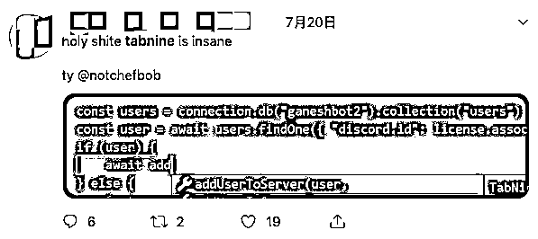
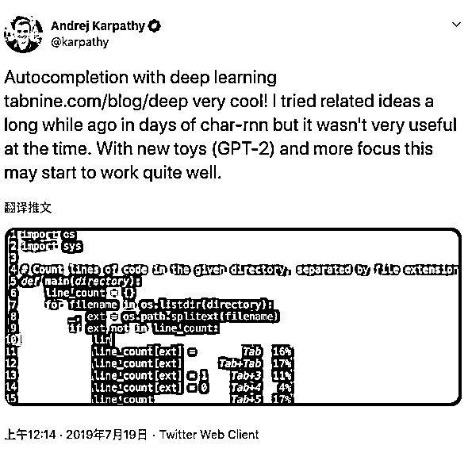
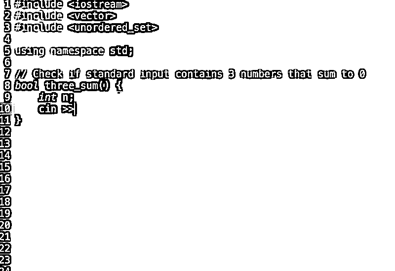
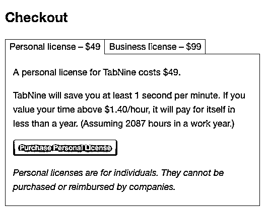

# 抢程序员饭碗？自动写代码的 Deep TabNine 真如此神奇？

> 原文：[`mp.weixin.qq.com/s?__biz=MzAxNTc0Mjg0Mg==&mid=2653293726&idx=1&sn=1c55f8666a02dba74e65c643004f586f&chksm=802dce8bb75a479d498c75199a4013bf999ebfc93dc9737e666c0bcfbc10bba1dcb9d2709ac8&scene=27#wechat_redirect`](http://mp.weixin.qq.com/s?__biz=MzAxNTc0Mjg0Mg==&mid=2653293726&idx=1&sn=1c55f8666a02dba74e65c643004f586f&chksm=802dce8bb75a479d498c75199a4013bf999ebfc93dc9737e666c0bcfbc10bba1dcb9d2709ac8&scene=27#wechat_redirect)

**标星★公众号     **爱你们♥

作者 |  James Vincent 等

编译 | 夕颜

出品 | AI 科技大本营（ID:rgznai100）

**近期原创文章：**

## ♥ [5 种机器学习算法在预测股价的应用（代码+数据）](https://mp.weixin.qq.com/s?__biz=MzAxNTc0Mjg0Mg==&mid=2653290588&idx=1&sn=1d0409ad212ea8627e5d5cedf61953ac&chksm=802dc249b75a4b5fa245433320a4cc9da1a2cceb22df6fb1a28e5b94ff038319ae4e7ec6941f&token=1298662931&lang=zh_CN&scene=21#wechat_redirect)

## ♥ [Two Sigma 用新闻来预测股价走势，带你吊打 Kaggle](https://mp.weixin.qq.com/s?__biz=MzAxNTc0Mjg0Mg==&mid=2653290456&idx=1&sn=b8d2d8febc599742e43ea48e3c249323&chksm=802e3dcdb759b4db9279c689202101b6b154fb118a1c1be12b52e522e1a1d7944858dbd6637e&token=1330520237&lang=zh_CN&scene=21#wechat_redirect)

## ♥ 2 万字干货：[利用深度学习最新前沿预测股价走势](https://mp.weixin.qq.com/s?__biz=MzAxNTc0Mjg0Mg==&mid=2653290080&idx=1&sn=06c50cefe78a7b24c64c4fdb9739c7f3&chksm=802e3c75b759b563c01495d16a638a56ac7305fc324ee4917fd76c648f670b7f7276826bdaa8&token=770078636&lang=zh_CN&scene=21#wechat_redirect)

## ♥ [机器学习在量化金融领域的误用！](http://mp.weixin.qq.com/s?__biz=MzAxNTc0Mjg0Mg==&mid=2653292984&idx=1&sn=3e7efe9fe9452c4a5492d2175b4159ef&chksm=802dcbadb75a42bbdce895c49070c3f552dc8c983afce5eeac5d7c25974b7753e670a0162c89&scene=21#wechat_redirect)

## ♥ [基于 RNN 和 LSTM 的股市预测方法](https://mp.weixin.qq.com/s?__biz=MzAxNTc0Mjg0Mg==&mid=2653290481&idx=1&sn=f7360ea8554cc4f86fcc71315176b093&chksm=802e3de4b759b4f2235a0aeabb6e76b3e101ff09b9a2aa6fa67e6e824fc4274f68f4ae51af95&token=1865137106&lang=zh_CN&scene=21#wechat_redirect)

## ♥ [如何鉴别那些用深度学习预测股价的花哨模型？](https://mp.weixin.qq.com/s?__biz=MzAxNTc0Mjg0Mg==&mid=2653290132&idx=1&sn=cbf1e2a4526e6e9305a6110c17063f46&chksm=802e3c81b759b597d3dd94b8008e150c90087567904a29c0c4b58d7be220a9ece2008956d5db&token=1266110554&lang=zh_CN&scene=21#wechat_redirect)

## ♥ [优化强化学习 Q-learning 算法进行股市](https://mp.weixin.qq.com/s?__biz=MzAxNTc0Mjg0Mg==&mid=2653290286&idx=1&sn=882d39a18018733b93c8c8eac385b515&chksm=802e3d3bb759b42d1fc849f96bf02ae87edf2eab01b0beecd9340112c7fb06b95cb2246d2429&token=1330520237&lang=zh_CN&scene=21#wechat_redirect)

## ♥ [WorldQuant 101 Alpha、国泰君安 191 Alpha](https://mp.weixin.qq.com/s?__biz=MzAxNTc0Mjg0Mg==&mid=2653290927&idx=1&sn=ecca60811da74967f33a00329a1fe66a&chksm=802dc3bab75a4aac2bb4ccff7010063cc08ef51d0bf3d2f71621cdd6adece11f28133a242a15&token=48775331&lang=zh_CN&scene=21#wechat_redirect)

## ♥ [基于回声状态网络预测股票价格（附代码）](https://mp.weixin.qq.com/s?__biz=MzAxNTc0Mjg0Mg==&mid=2653291171&idx=1&sn=485a35e564b45046ff5a07c42bba1743&chksm=802dc0b6b75a49a07e5b91c512c8575104f777b39d0e1d71cf11881502209dc399fd6f641fb1&token=48775331&lang=zh_CN&scene=21#wechat_redirect)

## ♥ [计量经济学应用投资失败的 7 个原因](https://mp.weixin.qq.com/s?__biz=MzAxNTc0Mjg0Mg==&mid=2653292186&idx=1&sn=87501434ae16f29afffec19a6884ee8d&chksm=802dc48fb75a4d99e0172bf484cdbf6aee86e36a95037847fd9f070cbe7144b4617c2d1b0644&token=48775331&lang=zh_CN&scene=21#wechat_redirect)

## ♥ [配对交易千千万，强化学习最 NB！（文档+代码）](http://mp.weixin.qq.com/s?__biz=MzAxNTc0Mjg0Mg==&mid=2653292915&idx=1&sn=13f4ddebcd209b082697a75544852608&chksm=802dcb66b75a4270ceb19fac90eb2a70dc05f5b6daa295a7d31401aaa8697bbb53f5ff7c05af&scene=21#wechat_redirect)

## ♥ [关于高盛在 Github 开源背后的真相！](https://mp.weixin.qq.com/s?__biz=MzAxNTc0Mjg0Mg==&mid=2653291594&idx=1&sn=7703403c5c537061994396e7e49e7ce5&chksm=802dc65fb75a4f49019cec951ac25d30ec7783738e9640ec108be95335597361c427258f5d5f&token=48775331&lang=zh_CN&scene=21#wechat_redirect)

## ♥ [新一代量化带货王诞生！Oh My God！](https://mp.weixin.qq.com/s?__biz=MzAxNTc0Mjg0Mg==&mid=2653291789&idx=1&sn=e31778d1b9372bc7aa6e57b82a69ec6e&chksm=802dc718b75a4e0ea4c022e70ea53f51c48d102ebf7e54993261619c36f24f3f9a5b63437e9e&token=48775331&lang=zh_CN&scene=21#wechat_redirect)

## ♥ [独家！关于定量/交易求职分享（附真实试题）](https://mp.weixin.qq.com/s?__biz=MzAxNTc0Mjg0Mg==&mid=2653291844&idx=1&sn=3fd8b57d32a0ebd43b17fa68ae954471&chksm=802dc751b75a4e4755fcbb0aa228355cebbbb6d34b292aa25b4f3fbd51013fcf7b17b91ddb71&token=48775331&lang=zh_CN&scene=21#wechat_redirect)

## ♥ [Quant 们的身份危机！](https://mp.weixin.qq.com/s?__biz=MzAxNTc0Mjg0Mg==&mid=2653291856&idx=1&sn=729b657ede2cb50c96e92193ab16102d&chksm=802dc745b75a4e53c5018cc1385214233ec4657a3479cd7193c95aaf65642f5f45fa0e465694&token=48775331&lang=zh_CN&scene=21#wechat_redirect)

## ♥ [拿起 Python，防御特朗普的 Twitter](https://mp.weixin.qq.com/s?__biz=MzAxNTc0Mjg0Mg==&mid=2653291977&idx=1&sn=01f146e9a88bf130ca1b479573e6d158&chksm=802dc7dcb75a4ecadfdbdace877ed948f56b72bc160952fd1e4bcde27260f823c999a65a0d6d&token=48775331&lang=zh_CN&scene=21#wechat_redirect)

## ♥ [AQR 最新研究 | 机器能“学习”金融吗？](http://mp.weixin.qq.com/s?__biz=MzAxNTc0Mjg0Mg==&mid=2653292710&idx=1&sn=e5e852de00159a96d5dcc92f349f5b58&chksm=802dcab3b75a43a5492bc98874684081eb5c5666aff32a36a0cdc144d74de0200cc0d997894f&scene=21#wechat_redirect)

**导读**

在过去的一年中，AI 生成书面文字的能力大大提高。通过扫描庞大的文本数据集，机器学习软件可以生成从短篇小说到歌词的各种令人信服的样本。现在，一个名为 Deep TabNine 的新程序，可以将相同的技术应用于编码世界。这个程序一经 F 推出便好评如潮，大有抢了程序员饭碗的架势。这个程序是否真有这么好用？我们来一探究竟。

## **什么是 Deep TabNine？**

据外媒 The Verge 报道，Deep TabNine 是由滑铁卢大学的计算机科学本科生 Jacob Jackson 创建的编码自动完成器，程序员可以将它作为附件安装在他们选择的编辑器中，程序员写代码时，这个程序会给出下一行代码建议，每次提供一小段代码。你可以将它理解为 Gmail 的智能撰写功能用到了代码上。

据悉，Jacob 于 2018 年 2 月开始研究该软件的原始版本，在 11 月发布之前它叫做 TabNine。本月早些时候，他发布了一个更新版本，该版本使用由研究实验室 OpenAI 设计的深度学习文本生成算法模型 GPT-2 来改善能力。该模型使用 Transformer 架构，旨在解决自然语言处理中的问题，Deep TabNine 用这个架构来理解代码中的英语。例如，模型可以使用 if / else 语句来进行否定。在训练时，模型的目标是根据前面给定的 token 来预测下一个 token。

Deep TabNine 使用 GitHub 的近 200 万个文件进行了训练，它具有预先存在的知识，而不是仅仅从用户当前的项目中学习。此外，这个模型还引用以自然语言编写的文档来推断函数名称、参数和返回类型。它还能利用传统工具难以发现的小线索。例如，它可以理解 app.get_user（） 的返回类型被假定为具有设置器方法的对象，且 app.get_users（）的返回类型被假定为列表。

## **机器学习极大提高智能编码能力**

Jacob 表示，这种软件虽然并不新鲜事物，但机器学习已经大大地改善了它的功能。“这对我来说是解决了一个问题。”

Deep TabNine 的更新版本让程序员们留下了深刻印象，他们在 Twitter 上称这个软件“惊人”、“让人疯狂”和“绝对令人兴奋”。

              

用户 Franck Nijhof 是一位在闲暇时间从事开源家庭自动化软件工作的 IT 经理，他对 Deep TabNine 不仅感到惊讶 ，还觉得既兴奋又害怕。“我使用 Deep TabNine 的第一个小时内没有作用，因为我不停地被它惊讶到，脑子里一直不停地问它到底是怎么知道的？怎么做到的？” Nijhof 通过电子邮件告诉 The Verge。

这样的自动完成工具之前就有过，但 Nijhof 表示 Deep TabNine 的建议更准确。“我过去曾尝试过一些'通用'的智能编写程序，但它们很烦人而且没有帮助，”他说道，“TabNine 无疑是一个改变游戏规则的存在。”

特斯拉人工智能总监 Andrej Karpathy 也对这个程序赞不绝口：

        

> 深度学习自动编码 https://t.co/WenacHVj7z 非常酷！很久以前我在做 char-rnn（字符级循环神经网络）时尝试过相关的想法，但当时它并不是很有用。随着新工具（GPT-2）的出现和更多的关注，它将会发挥更大的作用。
> 
>  -  Andrej Karpathy（@karpathy），2019 年 7 月 18 日

## 

机器学习预测让代码建议更优，支持 22 种语言

Jackson 表示，该软件之所以可以提供更好的建议，是因为它可以进行预测。大多数自动填充程序必须解析用户已编写的内容来提出建议，就像人使用数学公式中的步骤一样理顺代码。相比之下，Deep TabNine 依赖于机器学习的能力来查找数据中的统计模式以进行预测。

与文本生成算法在大量书籍、文章和电影脚本数据集上进行训练的方式相同，Deep TabNine 对来自编码库 GitHub 的 200 万个文件进行了训练。它在这些数据中找到模式，并用其在任意给定代码行中可能出现的内容给出建议，无论是变量名还是函数。

Jackson 说，使用深度学习创建自动编码软件有几个优点。首先，它可以轻松添加对新语言的支持。只需要将更多的训练数据放入 Deep TabNine 中，它就会挖出模式。这意味着，Deep TabNine 支持大约 22 种不同的编码语言，而大多数同类型产品只支持一种。

Deep TabNine 支持的编码语言完整列表如下：

Python，JavaScript，Java，C ++，C，PHP，Go，C＃，Ruby，Objective-C，Rust，Swift，TypeScript，Haskell，OCaml，Scala，Kotlin，Perl ，SQL，HTML，CSS，Bash

最重要的是，由于深度学习的分析能力，Deep TabNine 提出的建议整体上具有很高的质量。而且，因为软件不会查看用户自己写的代码来提出建议，所以它可以从编码的那一刻开始就起作用，而不用等着从用户编写的代码中寻找蛛丝马迹。

## **TABNINE 并不完美：不擅长创造性代码**

当然，这个软件也并非完美。它在提出建议时会出错，另外，它也不是对所有类型的编码都有用。Hacker News 和 r / program subreddit 的用户已经找到了它的各种优点和编程漏洞（但大多数倾向于正面评论）。

**用户 1：**免费版本 200 KB 的限制对于实际代码库来说太低了，有考虑过提高限制吗？

**Jacob Jackson 回复：**可以试下付费版 30 天返款。所有版本的 TabNine 仍然适用于大于索引限制的项目。索引中将添加和删除文件，以确保索引文件与用户正在编辑的文件尽可能相关。

**用户 2：**可以用，但不是很好用。对于你最喜欢的编辑器不支持或没有插件的语言来说，这是一个非常酷的技术，但是如果编辑器已经对语言有很好的支持（比如 VSCode for Typescript），它可能不会比连接自动完成的编辑器更好用。

**用户 3：**添加 IntelliJ Idea 支持，我会买它:)

**用户 4：**支持 Emacs 后，我会买！

对于这个为程序员构建的编码工具的编辑器和工作流程精确度，大家也有很多看法。

Jackson 也坦承了 Deep TabNine 的一些缺点，如它更适合某些类型的编码。它在自动完成相对死记硬背的代码时效果最好，这种编程已经被做过数千次，只有很小的变化。但是，它并不擅长用户用于解决新问题的探索性代码。考虑到软件的智能来自数据中的模式，这并不奇怪。

               

那么，它对于普通程序员真的有用吗？这取决于很多因素，比如他们使用的编程语言，他们想要实现的目标等。但 Jackson 表示，与其说是一个人类编码助手，它更像是一种更快的输入法（一种常见的被称为结对编程的做法）。

“想象一下，现在所有的程序员都在使用相当于手机的键盘打字，而使用 Deep TabNine 有点像转而去使用常规键盘，”他说道。这款软件可以提高用户输入信息的速度，并且可以提高工作效率，“因为你可以花更多时间考虑内容而不是细节。”但它不会按照你的方式编写代码，而你也确实需要要密切关注它的动向。

## **如何使用 Deep TabNine？**

虽然集成深度学习模型具有多种优势，但使用它需要大量的算力。Jackson 明确提到，在笔记本电脑上运行无法实现 TabNine 用户习惯的低延迟。对此，他们提供了一种解决方案——TabNine Cloud（Beta）服务，该服务将使用户能够使用 TabNine 的服务器进行 GPU 加速自动完成。访问 TabNine Cloud，可以在此处免费注册：https://tabnine.com/beta_signup

但是，有许多人更愿意将代码保存在他们的机器上。为了确保代码的隐私性和安全性，TabNine 团队正在研究以下用例：

*   他们承诺在未来推出尺寸减小的模型，个人开发者可以在笔记本电脑上运行，提供合理的延迟。

*   企业可以选择模型许可，在自己的硬件上运行。他们还提供训练自定义模型，以了解企业代码库特有的独特模式和样式。

## **商业化前途未定**

目前，Jackson 正在考虑下一步该用这款软件做些什么，以及是否值得商业化。他说，他本人目前在一家大型科技公司有一份全职工作，他还不想放弃，但来自各领域的人都对这款软件表示“非常感兴趣”。“我还没有真正决定我想用它做什么。”

目前，TabNine 的个人许可用费用为 49 美元，商业用途费用为 99 美元，个人必须注册 Deep TabNine 测试版才能访问新的深度学习功能。购买许可之后， TabNine 能够索引更多文件，给出更多相关建议。

            

网站上写道：“TabNine 每分钟至少可以为你节省 1 秒钟。如果你认为你的时间价值超过 1.40 美元/小时，它将帮你在不到一年的时间内收回成本。“

他说，如果他能够使用开源软件创建这样的程序，那么 AI 辅助编码的未来就是一片光明。

“这是在这个领域工作的每个人的目标，告诉计算机你想要写什么样的代码，它就能帮你写，”他说道。“我们目前距离实现这个目前还很远，但我认为这种工具可以帮助你更方便地表达自己的想法。”

*原文链接：*

*https://www.theverge.com/2019/7/24/20708542/coding-autocompleter-deep-tabnine-ai-deep-learning-smart-compose*

*https://hub.packtpub.com/introducing-deep-tabnine-a-language-agnostic-autocompleter-based-on-openais-gpt-2/*

*—End—*

量化投资与机器学习微信公众号，是业内垂直于**Quant**、**MFE**、**CST、AI**等专业的**主****流量化自媒体**。公众号拥有来自**公募、私募、券商、银行、海外**等众多圈内**10W+**关注者。每日发布行业前沿研究成果和最新量化资讯。

