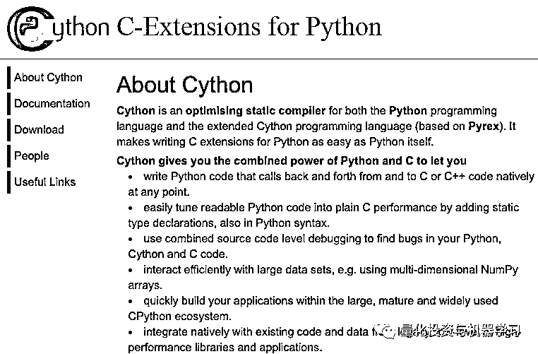

# 三十、倍！使用 Cython 加速 Python 代码

> 原文：[`mp.weixin.qq.com/s?__biz=MzAxNTc0Mjg0Mg==&mid=2653293723&idx=1&sn=8fcb3effaffd583882d5ffe13b330fe2&chksm=802dce8eb75a4798bcb14f9f9cb19b1333c2e31d78fc837448b8a4c8990da9ad083c7fe5ecee&scene=27#wechat_redirect`](http://mp.weixin.qq.com/s?__biz=MzAxNTc0Mjg0Mg==&mid=2653293723&idx=1&sn=8fcb3effaffd583882d5ffe13b330fe2&chksm=802dce8eb75a4798bcb14f9f9cb19b1333c2e31d78fc837448b8a4c8990da9ad083c7fe5ecee&scene=27#wechat_redirect)


**标星★公众号     **爱你们♥

作者：George Seif、Thomas Wolf、Lukas Frei

编译：1+1=6 | 公众号海外部

**近期原创文章：**

## ♥ [5 种机器学习算法在预测股价的应用（代码+数据）](https://mp.weixin.qq.com/s?__biz=MzAxNTc0Mjg0Mg==&mid=2653290588&idx=1&sn=1d0409ad212ea8627e5d5cedf61953ac&chksm=802dc249b75a4b5fa245433320a4cc9da1a2cceb22df6fb1a28e5b94ff038319ae4e7ec6941f&token=1298662931&lang=zh_CN&scene=21#wechat_redirect)

## ♥ [Two Sigma 用新闻来预测股价走势，带你吊打 Kaggle](https://mp.weixin.qq.com/s?__biz=MzAxNTc0Mjg0Mg==&mid=2653290456&idx=1&sn=b8d2d8febc599742e43ea48e3c249323&chksm=802e3dcdb759b4db9279c689202101b6b154fb118a1c1be12b52e522e1a1d7944858dbd6637e&token=1330520237&lang=zh_CN&scene=21#wechat_redirect)

## ♥ 2 万字干货：[利用深度学习最新前沿预测股价走势](https://mp.weixin.qq.com/s?__biz=MzAxNTc0Mjg0Mg==&mid=2653290080&idx=1&sn=06c50cefe78a7b24c64c4fdb9739c7f3&chksm=802e3c75b759b563c01495d16a638a56ac7305fc324ee4917fd76c648f670b7f7276826bdaa8&token=770078636&lang=zh_CN&scene=21#wechat_redirect)

## ♥ [机器学习在量化金融领域的误用！](http://mp.weixin.qq.com/s?__biz=MzAxNTc0Mjg0Mg==&mid=2653292984&idx=1&sn=3e7efe9fe9452c4a5492d2175b4159ef&chksm=802dcbadb75a42bbdce895c49070c3f552dc8c983afce5eeac5d7c25974b7753e670a0162c89&scene=21#wechat_redirect)

## ♥ [基于 RNN 和 LSTM 的股市预测方法](https://mp.weixin.qq.com/s?__biz=MzAxNTc0Mjg0Mg==&mid=2653290481&idx=1&sn=f7360ea8554cc4f86fcc71315176b093&chksm=802e3de4b759b4f2235a0aeabb6e76b3e101ff09b9a2aa6fa67e6e824fc4274f68f4ae51af95&token=1865137106&lang=zh_CN&scene=21#wechat_redirect)

## ♥ [如何鉴别那些用深度学习预测股价的花哨模型？](https://mp.weixin.qq.com/s?__biz=MzAxNTc0Mjg0Mg==&mid=2653290132&idx=1&sn=cbf1e2a4526e6e9305a6110c17063f46&chksm=802e3c81b759b597d3dd94b8008e150c90087567904a29c0c4b58d7be220a9ece2008956d5db&token=1266110554&lang=zh_CN&scene=21#wechat_redirect)

## ♥ [优化强化学习 Q-learning 算法进行股市](https://mp.weixin.qq.com/s?__biz=MzAxNTc0Mjg0Mg==&mid=2653290286&idx=1&sn=882d39a18018733b93c8c8eac385b515&chksm=802e3d3bb759b42d1fc849f96bf02ae87edf2eab01b0beecd9340112c7fb06b95cb2246d2429&token=1330520237&lang=zh_CN&scene=21#wechat_redirect)

## ♥ [WorldQuant 101 Alpha、国泰君安 191 Alpha](https://mp.weixin.qq.com/s?__biz=MzAxNTc0Mjg0Mg==&mid=2653290927&idx=1&sn=ecca60811da74967f33a00329a1fe66a&chksm=802dc3bab75a4aac2bb4ccff7010063cc08ef51d0bf3d2f71621cdd6adece11f28133a242a15&token=48775331&lang=zh_CN&scene=21#wechat_redirect)

## ♥ [基于回声状态网络预测股票价格（附代码）](https://mp.weixin.qq.com/s?__biz=MzAxNTc0Mjg0Mg==&mid=2653291171&idx=1&sn=485a35e564b45046ff5a07c42bba1743&chksm=802dc0b6b75a49a07e5b91c512c8575104f777b39d0e1d71cf11881502209dc399fd6f641fb1&token=48775331&lang=zh_CN&scene=21#wechat_redirect)

## ♥ [计量经济学应用投资失败的 7 个原因](https://mp.weixin.qq.com/s?__biz=MzAxNTc0Mjg0Mg==&mid=2653292186&idx=1&sn=87501434ae16f29afffec19a6884ee8d&chksm=802dc48fb75a4d99e0172bf484cdbf6aee86e36a95037847fd9f070cbe7144b4617c2d1b0644&token=48775331&lang=zh_CN&scene=21#wechat_redirect)

## ♥ [配对交易千千万，强化学习最 NB！（文档+代码）](http://mp.weixin.qq.com/s?__biz=MzAxNTc0Mjg0Mg==&mid=2653292915&idx=1&sn=13f4ddebcd209b082697a75544852608&chksm=802dcb66b75a4270ceb19fac90eb2a70dc05f5b6daa295a7d31401aaa8697bbb53f5ff7c05af&scene=21#wechat_redirect)

## ♥ [关于高盛在 Github 开源背后的真相！](https://mp.weixin.qq.com/s?__biz=MzAxNTc0Mjg0Mg==&mid=2653291594&idx=1&sn=7703403c5c537061994396e7e49e7ce5&chksm=802dc65fb75a4f49019cec951ac25d30ec7783738e9640ec108be95335597361c427258f5d5f&token=48775331&lang=zh_CN&scene=21#wechat_redirect)

## ♥ [新一代量化带货王诞生！Oh My God！](https://mp.weixin.qq.com/s?__biz=MzAxNTc0Mjg0Mg==&mid=2653291789&idx=1&sn=e31778d1b9372bc7aa6e57b82a69ec6e&chksm=802dc718b75a4e0ea4c022e70ea53f51c48d102ebf7e54993261619c36f24f3f9a5b63437e9e&token=48775331&lang=zh_CN&scene=21#wechat_redirect)

## ♥ [独家！关于定量/交易求职分享（附真实试题）](https://mp.weixin.qq.com/s?__biz=MzAxNTc0Mjg0Mg==&mid=2653291844&idx=1&sn=3fd8b57d32a0ebd43b17fa68ae954471&chksm=802dc751b75a4e4755fcbb0aa228355cebbbb6d34b292aa25b4f3fbd51013fcf7b17b91ddb71&token=48775331&lang=zh_CN&scene=21#wechat_redirect)

## ♥ [Quant 们的身份危机！](https://mp.weixin.qq.com/s?__biz=MzAxNTc0Mjg0Mg==&mid=2653291856&idx=1&sn=729b657ede2cb50c96e92193ab16102d&chksm=802dc745b75a4e53c5018cc1385214233ec4657a3479cd7193c95aaf65642f5f45fa0e465694&token=48775331&lang=zh_CN&scene=21#wechat_redirect)

## ♥ [拿起 Python，防御特朗普的 Twitter](https://mp.weixin.qq.com/s?__biz=MzAxNTc0Mjg0Mg==&mid=2653291977&idx=1&sn=01f146e9a88bf130ca1b479573e6d158&chksm=802dc7dcb75a4ecadfdbdace877ed948f56b72bc160952fd1e4bcde27260f823c999a65a0d6d&token=48775331&lang=zh_CN&scene=21#wechat_redirect)

## ♥ [AQR 最新研究 | 机器能“学习”金融吗？](http://mp.weixin.qq.com/s?__biz=MzAxNTc0Mjg0Mg==&mid=2653292710&idx=1&sn=e5e852de00159a96d5dcc92f349f5b58&chksm=802dcab3b75a43a5492bc98874684081eb5c5666aff32a36a0cdc144d74de0200cc0d997894f&scene=21#wechat_redirect)


**前言**

你可能经常会一次又一次地听到关于 Python 的抱怨，Python 跑起来太慢了！

与许多其他编程语言相比，Python 的确很慢。

有几种不同的方法可以使代码提速：

如果你的代码是纯 Python。如果你有一个很大的 for 循环，你只能使用它，而不能放入矩阵中，因为数据必须按顺序处理，那该怎么办？有没有办法加快 Python 本身的速度？

来吧，看看 Cython！


**文末下载 Cython 相关书籍**

**什么是 Cython？**

Cython 的核心是 Python 和 C / C++之间的一个中间步骤。它允许 N 你编写纯 Python 代码，**只需要做一些小修改，然后将其直接翻译成 C 代码**。

Cython 语言是 Python 的一个超集，它包含有两种类型的对象：

*   Python 对象就是我们在常规 Python 中使用到的那些对象，诸如数值、字符串、列表和类实例等等。

*   Cython C 对象就是那些 C 和 C++ 对象，诸如双精度、整型、浮点数、结构和向量，它们能够由 Cython 在超级高效的低级语言代码中进行编译。

**你对 Python 代码所做的唯一调整就是向每个变量添加类型信息**。通常，我们可以像这样在 Python 中声明一个变量：

```py
x = 0.5
```

使用 Cython，我们为该变量添加一个类型：

```py
cdef float x = 0.5
```

这告诉 Cython，变量是浮点数，就像我们在 C 中所做的一样。对于纯 Python，变量的类型是动态确定的。Cython 中类型的显式声明使其转为 C 代码成为可能，因为显式类型声明需要+。

有很多办法来测试、编译和发布 Cython 代码。Cython 甚至可以像 Python 一样直接用于 Jupyter Notebook 中。有很多办法来测试、编译和发布 Cython 代码。Cython 甚至可以像 Python 一样直接用于 Jupyter Notebook 中。

安装 Cython 只需要一行 pip：

```py
pip install cython
```

使用 Cython 需要安装 C 语言编译器，因此，安装过程会根据你当前的操作系统而有所不同。对于 Linux，通常使用 GNU C 编译器（gncc）。对于 Mac OS，你可以下载 Xcode 以获取 gncc。而 Windows 桌面系统下安装 C 编译器会更复杂。

使用 %load_ext Cython 指令在 Jupyter notebook 中加载 Cython 扩展。

然后通过指令 %%cython，我们就可以像 Python 一样在 Jupyter notebook 中使用 Cython。

如果在执行 Cython 代码的时候遇到了编译错误，请检查 Jupyter 终端的完整输出信息。

大多数情况下可能都是因为在 %%cython 之后遗漏了 -+ 标签（比如当你使用 spaCy Cython 接口时）。**如果编译器报出了关于 Numpy 的错误，那就是遗漏了 import numpy。**

如果你要在在**IPython 中使用 Cython**：

首先介绍一下 IPython Magic 命令。Magic 命令以百分号开头，通常有 2 种类型：

*   单行 Magic 由单个'％'表示，并且仅在一行输入上操作。

*   单元格 Magic 用两个'％'表示，并在多行输入上操作。

首先运行下列语句引入 Cython：

```py
%load_ext Cython
```

然后，当运行 Cython 代码时，我们需要加入以下 Cython 代码：

```py
%%cython
```

然后就可以愉快地使用 Cython 了。

**Cython 中的类型**

使用 Cython 时，变量和函数有两组不同的类型。

对于变量，我们有：

*   cdef int a, b, c

*   cdef char *s

*   cdef float x = 0.5 (single precision)

*   cdef double x = 63.4 (double precision)

*   cdef list names

*   cdef dict goals_for_each_play

*   cdef object card_deck

注意所有**这些类型都来自 C / C++ !**  

*   **def** - 常规 Python 函数，仅从 Python 调用。

*   **cdef** - 仅限 Cython 函数，接受 Python 对象或 C 值作为参数，并且可以返回 Python 对象或 C 值，cdef 函数不能直接在 Python 中调用。

*   **cpdef** - 接受 Python 对象或 C 值作为参数，并且可以返回 Python 对象或 C 值。

我们可以方便的向 C 代码传递和返回结果，Cython 会自动为我们做相应的类型转化。

了解了 Cython 类型之后，我们就可以直接实现加速了!

**如何使用 Cython 加速代码**

我们要做的第一件事是设置 Python 代码基准：用于计算数字阶乘的 for 循环。原始 Python 代码如下：

```py
def test(x):
     y = 1
     for i in range(x+1):
        y *= i
     return y
```

Cython 的实现过程看起来非常相似。首先，确保 Cython 代码文件具有 .pyx 扩展名。这些文件将被 Cython 编译器编译成 C 或 C++ 文件，再进一步地被 C 编译器编译成字节码文件。

你也可以使用 pyximport 将一个 .pyx 文件直接加载到 Python 程序中：

```py
import pyximport; pyximport.install()
import my_cython_module
```

你也可以将自己的 Cython 代码作为 Python 包构建，然后像正常的 Python 包一样将其导入或者发布。不过这种做法需要花费更多的时间，特别是你需要让 Cython 包能够在所有的平台上运行。如果你需要一个参考样例，不妨看看 spaCy 的安装脚本：


*https://github.com/explosion/spaCy/blob/master/setup.py?source=post_page---------------------------*  

最终 Python 解释器将能够调用这些字节码文件。对代码本身的惟一更改是，我们已经声明了每个变量和函数的类型。  

```py
cpdef int test(int x):
     cdef int y = 1
     cdef int i
     for i in range(x+1):
         y *= i
     return y
```

注意函数有一个 cpdef 来确保我们可以从 Python 调用它。另外看看我们的循环变量 i 是如何具有类型的。**你需要为函数中的所有变量设置类****型，以便 C 编译器知道使用哪种类型！**

接下来，创建一个 setup.py 文件，该文件将 Cython 代码编译为 C 代码：

```py
from distutils.core import setup
from Cython.Build import cythonize

setup(ext_modules = cythonize('run_cython.pyx'))
```

并执行编译：

```py
python setup.py build_ext --inplace
```

Boom！我们的 C 代码已经编译好，可以使用了!

你将看到，在 Cython 代码所在的文件夹中，拥有运行 C 代码所需的所有文件，包括 run_cython.c 文件。如果你感兴趣，可以查看一下 Cython 生成的 C 代码！

现在我们准备测试新的 C 代码！查看下面的代码，它将执行一个速度测试，将原始 Python 代码与 Cython 代码进行比较。

现在我们准备测试我们新的超快速 C 代码了！查看下面的代码，它执行速度测试以将原始 Python 代码与 Cython 代码进行比较。

```py
import run_python
import run_cython
import time

number = 10

start = time.time()
run_python.test(number)
end = time.time()

py_time = end - start
print("Python time = {}".format(py_time))

start = time.time()
run_cython.test(number)
end = time.time()

cy_time = end - start
print("Cython time = {}".format(cy_time))

print("Speedup = {}".format(py_time / cy_time))
```

Cython 可以让你在几乎所有原始 Python 代码上获得良好的加速，而不需要太多额外的工作。**需要注意的关键是，循环次数越多，处理的数据越多，Cython 可以提供的帮助就越多。**


查看下表，该表显示了 Cython 为不同的阶乘值提供的速度我们使用 Cython 获得了**超过 ****36 倍 ****的加速！**


******Cython**在 NLP 中的加速应用****

**当我们在操作字符串时，**要如何在 Cython 中设计一个更加高效的循环呢？****spaCy 是个不错的选择！****

**spaCy 中所有的 unicode 字符串（the text of a token, its lower case text, its lemma form, POS tag label, parse tree dependency label, Named-Entity tags…）都被存储在一个称为 StringStore 的数据结构中，它通过一个 64 位哈希码进行索引，例如 C 类型的 uint64_t。**

****

**StringStore 对象实现了 Python unicode 字符串与 64 位哈希码之前的查找映射。**

**它可以 spaCy 的任何地方和任意对象进行访问，例如 npl.vocab.strings、doc.vocab.strings 或者 span.doc.vocab.string。**

**当某模块需要在某些标记上获得更快的处理速度时，可以使用 C 语言类型的 64 位哈希码代替字符串来实现。调用 StringStore 查找表将返回与该哈希码相关联的 Python unicode 字符串。**

**但是 spaCy 能做的可不仅仅只有这些，**它还允许我们访问文档和词汇表完全填充的 C 语言类型结构，我们可以在 Cython 循环中使用这些结构**，而不必去构建自己的结构。**

****spaCy 拓展：**** 

****

***https://spacy.io/api/cython?source=post_page---------------------------***

**建立一个脚本用于创建一个包含有 10 份文档的列表，每份文档都大概含有 17 万个单词，采用 spaCy 进行分析。当然我们也可以对 17 万份文档（每份文档包含 10 个单词）进行分析，但是这样做会导致创建的过程非常慢，所以我们还是选择了 10 份文档。** 

**我们想要在这个数据集上展开某些自然语言处理任务。例如，我们可以统计数据集中单词「run」作为名词出现的次数（例如，被 spaCy 标记为「NN」词性标签）。**

**采用 Python 循环来实现上述分析过程非常简单和直观：**

```py
`import urllib.request
import spacy

with urllib.request.urlopen('https://raw.githubusercontent.com/pytorch/examples/master/word_language_model/data/wikitext-2/valid.txt') as response:
 text = response.read()
nlp = spacy.load('en')
doc_list = list(nlp(text[:800000].decode('utf8')) for i in range(10))`
```

**这段代码至少需要运行 1.4 秒才能获得答案。如果我们的数据集中包含有数以百万计的文档，为了获得答案，我们也许需要花费超过一天的时间。** 

**我们也许能够采用多线程来实现加速，但是在 Python 中这种做法并不是那么明智，**因为你还需要处理全局解释器锁（GIL）**。**在 Cython 中可以无视 GIL 的存在而尽情使用线程加速。**但不能再使用 Python 中的字典和列表，因为 Python 中的变量都自动带了锁（GIL）。还好 Cython 已经封装了 C++标准库中的容器：deque，list，map，pair，queue，set，stack，vector。完全可以替代 Python 的 dict, list, set 等。**

**我们使用 Cython 就可以解决这个，但不能再使用 Python 中的字典和列表，因为 Python 中的变量都自动带了锁（GIL）。还好 Cython 已经封装了 C++标准库中的容器：deque，list，map，pair，queue，set，stack，vector。完全可以替代 Python 的 dict, list, set 等。**

**另外请注意，**Cython 也可以使用多线程！Cython 在后台可以直接调用 OpenMP。****

****

***https://cython.readthedocs.io/en/latest/src/userguide/parallelism.html?source=post_page---------------------------***

**现在让我们尝试使用 spaCy 和 Cython 来加速 Python 代码。**

**首先需要考虑好数据结构，我们需要一个 C 类型的数组来存储数据，需要指针来指向每个文档的 TokenC 数组。我们还需要将测试字符（「run」和「NN」）转成 64 位哈希码。**

**当所有需要处理的数据都变成了 C 类型对象，我们就可以以纯 C 语言的速度对数据集进行迭代。**

**以下是被转换成 Cython 和 spaCy 的实现：**

```py
`%%cython -+
import numpy
from cymem.cymem cimport Pool
from spacy.tokens.doc cimport Doc
from spacy.typedefs cimport hash_t
from spacy.structs cimport TokenC

cdef struct DocElement:
 TokenC* c
 int length

cdef int fast_loop(DocElement* docs, int n_docs, hash_t word, hash_t tag):
 cdef int n_out = 0
 for doc in docs[:n_docs]:
 for c in doc.c[:doc.length]:
 if c.lex.lower == word and c.tag == tag:
 n_out += 1
 return n_out

def main_nlp_fast(doc_list):
 cdef int i, n_out, n_docs = len(doc_list)
 cdef Pool mem = Pool()
 cdef DocElement* docs = <DocElement*>mem.alloc(n_docs, sizeof(DocElement))
 cdef Doc doc
 for i, doc in enumerate(doc_list):
 docs[i].c = doc.c
 docs[i].length = (<Doc>doc).length
 word_hash = doc.vocab.strings.add('run')
 tag_hash = doc.vocab.strings.add('NN')
 n_out = fast_loop(docs, n_docs, word_hash, tag_hash)`
```

**在 Jupyter notebook 上，**这段 Cython 代码运行了大概 20 毫秒，比之前的纯 Python 循环快了大概** **80 倍****。****

**使用 Jupyter notebook 单元编写模块的速度很可观，它可以与其它 Python 模块和函数自然地连接：在 20 毫秒内扫描大约 170 万个单词，这意味着我们每秒能够处理高达 8 千万个单词。**

**如果你已经了解 C 语言，Cython 还允许访问 C 代码，而 Cython 的创建者还没有为这些代码添加现成的声明。例如，使用以下代码，可以为 C 函数生成 Python 包装器并将其添加到模块 dict 中。**

```py
`%%cython
cdef extern from "math.h":
     cpdef double sin(double x)`
```

****Cython 注意的坑****

**1、.pyx 中用 CDEF 定义的东西，除类以外对的.py 都是不可见的。**

**2、.c 中是不能操作 C 类型的，如果想在.py 中操作 C 类型就要在.pyx 中从 python 对象转成 C 类型或者用含有 set / get 方法的 C 类型包裹类。**

**3、虽然 Cython 能对 Python 的 str 和 C 的“char *”之间进行自动类型转换，但是对于“char a [n]”这种固定长度的字符串是无法自动转换的。需要使用 Cython 的 libc.string .strcpy 进行显式拷贝。**

**4、回调函数需要用函数包裹，再通过 C 的“void *”强制转换后才能传入 C 函数。**

****Cython 相关资料（下载）****

****0、其他：****

****

***https://cython.org/?source=post_page---------------------------***

****1、官方文档：**** 

****

****2、参考书籍（文末下载）：****

****

****

****书籍下载****

**在**后台**输入（严格大小写）**

*****Cython 资料*****

****

***—End—***

**量化投资与机器学习微信公众号，是业内垂直于**Quant**、**MFE**、**CST、AI**等专业的**主****流量化自媒体**。公众号拥有来自**公募、私募、券商、银行、海外**等众多圈内**10W+**关注者。每日发布行业前沿研究成果和最新量化资讯。**

****