# 为什么财经大学的学生从不看综合排名?

> 原文：[`mp.weixin.qq.com/s?__biz=MzAxNTc0Mjg0Mg==&mid=2653293694&idx=1&sn=3ede6f194850f4729be3cfbb8bab6fd4&chksm=802dce6bb75a477d40dab8bd72734e13a2662305c79f3b5d47baa91a99f583c7842660a56dd6&scene=27#wechat_redirect`](http://mp.weixin.qq.com/s?__biz=MzAxNTc0Mjg0Mg==&mid=2653293694&idx=1&sn=3ede6f194850f4729be3cfbb8bab6fd4&chksm=802dce6bb75a477d40dab8bd72734e13a2662305c79f3b5d47baa91a99f583c7842660a56dd6&scene=27#wechat_redirect)

**标星★公众号     **爱你们♥

来自：UniCareer

**近期原创文章：**

## ♥ [5 种机器学习算法在预测股价的应用（代码+数据）](https://mp.weixin.qq.com/s?__biz=MzAxNTc0Mjg0Mg==&mid=2653290588&idx=1&sn=1d0409ad212ea8627e5d5cedf61953ac&chksm=802dc249b75a4b5fa245433320a4cc9da1a2cceb22df6fb1a28e5b94ff038319ae4e7ec6941f&token=1298662931&lang=zh_CN&scene=21#wechat_redirect)

## ♥ [Two Sigma 用新闻来预测股价走势，带你吊打 Kaggle](https://mp.weixin.qq.com/s?__biz=MzAxNTc0Mjg0Mg==&mid=2653290456&idx=1&sn=b8d2d8febc599742e43ea48e3c249323&chksm=802e3dcdb759b4db9279c689202101b6b154fb118a1c1be12b52e522e1a1d7944858dbd6637e&token=1330520237&lang=zh_CN&scene=21#wechat_redirect)

## ♥ 2 万字干货：[利用深度学习最新前沿预测股价走势](https://mp.weixin.qq.com/s?__biz=MzAxNTc0Mjg0Mg==&mid=2653290080&idx=1&sn=06c50cefe78a7b24c64c4fdb9739c7f3&chksm=802e3c75b759b563c01495d16a638a56ac7305fc324ee4917fd76c648f670b7f7276826bdaa8&token=770078636&lang=zh_CN&scene=21#wechat_redirect)

## ♥ [机器学习在量化金融领域的误用！](http://mp.weixin.qq.com/s?__biz=MzAxNTc0Mjg0Mg==&mid=2653292984&idx=1&sn=3e7efe9fe9452c4a5492d2175b4159ef&chksm=802dcbadb75a42bbdce895c49070c3f552dc8c983afce5eeac5d7c25974b7753e670a0162c89&scene=21#wechat_redirect)

## ♥ [基于 RNN 和 LSTM 的股市预测方法](https://mp.weixin.qq.com/s?__biz=MzAxNTc0Mjg0Mg==&mid=2653290481&idx=1&sn=f7360ea8554cc4f86fcc71315176b093&chksm=802e3de4b759b4f2235a0aeabb6e76b3e101ff09b9a2aa6fa67e6e824fc4274f68f4ae51af95&token=1865137106&lang=zh_CN&scene=21#wechat_redirect)

## ♥ [如何鉴别那些用深度学习预测股价的花哨模型？](https://mp.weixin.qq.com/s?__biz=MzAxNTc0Mjg0Mg==&mid=2653290132&idx=1&sn=cbf1e2a4526e6e9305a6110c17063f46&chksm=802e3c81b759b597d3dd94b8008e150c90087567904a29c0c4b58d7be220a9ece2008956d5db&token=1266110554&lang=zh_CN&scene=21#wechat_redirect)

## ♥ [优化强化学习 Q-learning 算法进行股市](https://mp.weixin.qq.com/s?__biz=MzAxNTc0Mjg0Mg==&mid=2653290286&idx=1&sn=882d39a18018733b93c8c8eac385b515&chksm=802e3d3bb759b42d1fc849f96bf02ae87edf2eab01b0beecd9340112c7fb06b95cb2246d2429&token=1330520237&lang=zh_CN&scene=21#wechat_redirect)

## ♥ [WorldQuant 101 Alpha、国泰君安 191 Alpha](https://mp.weixin.qq.com/s?__biz=MzAxNTc0Mjg0Mg==&mid=2653290927&idx=1&sn=ecca60811da74967f33a00329a1fe66a&chksm=802dc3bab75a4aac2bb4ccff7010063cc08ef51d0bf3d2f71621cdd6adece11f28133a242a15&token=48775331&lang=zh_CN&scene=21#wechat_redirect)

## ♥ [基于回声状态网络预测股票价格（附代码）](https://mp.weixin.qq.com/s?__biz=MzAxNTc0Mjg0Mg==&mid=2653291171&idx=1&sn=485a35e564b45046ff5a07c42bba1743&chksm=802dc0b6b75a49a07e5b91c512c8575104f777b39d0e1d71cf11881502209dc399fd6f641fb1&token=48775331&lang=zh_CN&scene=21#wechat_redirect)

## ♥ [计量经济学应用投资失败的 7 个原因](https://mp.weixin.qq.com/s?__biz=MzAxNTc0Mjg0Mg==&mid=2653292186&idx=1&sn=87501434ae16f29afffec19a6884ee8d&chksm=802dc48fb75a4d99e0172bf484cdbf6aee86e36a95037847fd9f070cbe7144b4617c2d1b0644&token=48775331&lang=zh_CN&scene=21#wechat_redirect)

## ♥ [配对交易千千万，强化学习最 NB！（文档+代码）](http://mp.weixin.qq.com/s?__biz=MzAxNTc0Mjg0Mg==&mid=2653292915&idx=1&sn=13f4ddebcd209b082697a75544852608&chksm=802dcb66b75a4270ceb19fac90eb2a70dc05f5b6daa295a7d31401aaa8697bbb53f5ff7c05af&scene=21#wechat_redirect)

## ♥ [关于高盛在 Github 开源背后的真相！](https://mp.weixin.qq.com/s?__biz=MzAxNTc0Mjg0Mg==&mid=2653291594&idx=1&sn=7703403c5c537061994396e7e49e7ce5&chksm=802dc65fb75a4f49019cec951ac25d30ec7783738e9640ec108be95335597361c427258f5d5f&token=48775331&lang=zh_CN&scene=21#wechat_redirect)

## ♥ [新一代量化带货王诞生！Oh My God！](https://mp.weixin.qq.com/s?__biz=MzAxNTc0Mjg0Mg==&mid=2653291789&idx=1&sn=e31778d1b9372bc7aa6e57b82a69ec6e&chksm=802dc718b75a4e0ea4c022e70ea53f51c48d102ebf7e54993261619c36f24f3f9a5b63437e9e&token=48775331&lang=zh_CN&scene=21#wechat_redirect)

## ♥ [独家！关于定量/交易求职分享（附真实试题）](https://mp.weixin.qq.com/s?__biz=MzAxNTc0Mjg0Mg==&mid=2653291844&idx=1&sn=3fd8b57d32a0ebd43b17fa68ae954471&chksm=802dc751b75a4e4755fcbb0aa228355cebbbb6d34b292aa25b4f3fbd51013fcf7b17b91ddb71&token=48775331&lang=zh_CN&scene=21#wechat_redirect)

## ♥ [Quant 们的身份危机！](https://mp.weixin.qq.com/s?__biz=MzAxNTc0Mjg0Mg==&mid=2653291856&idx=1&sn=729b657ede2cb50c96e92193ab16102d&chksm=802dc745b75a4e53c5018cc1385214233ec4657a3479cd7193c95aaf65642f5f45fa0e465694&token=48775331&lang=zh_CN&scene=21#wechat_redirect)

## ♥ [拿起 Python，防御特朗普的 Twitter](https://mp.weixin.qq.com/s?__biz=MzAxNTc0Mjg0Mg==&mid=2653291977&idx=1&sn=01f146e9a88bf130ca1b479573e6d158&chksm=802dc7dcb75a4ecadfdbdace877ed948f56b72bc160952fd1e4bcde27260f823c999a65a0d6d&token=48775331&lang=zh_CN&scene=21#wechat_redirect)

## ♥ [AQR 最新研究 | 机器能“学习”金融吗？](http://mp.weixin.qq.com/s?__biz=MzAxNTc0Mjg0Mg==&mid=2653292710&idx=1&sn=e5e852de00159a96d5dcc92f349f5b58&chksm=802dcab3b75a43a5492bc98874684081eb5c5666aff32a36a0cdc144d74de0200cc0d997894f&scene=21#wechat_redirect)

**前言**

长期以来，财经类院校作为专业性大学，在各类高校排行中一直比较迷，经常看到某财/贸居然排到了五十名开外，很多财大学子的反应是：

*卧槽，XX 大学都比我们高，妈的都没听说过*

*XXX 大学，这是啥？当年 lz 保底都看不上这个！*

然而，当遇上中国财经类大学排名时，财经大学圈便是一场血雨腥风。近日，2019 国内财经院校排名发布，一众财经学生跻蹧不堪，纵观朋友圈里上财、央财、西财学子们转发的鸡汤，得出一个共同点：**只要自己母校排的高，就是有理**。

**国内财经院校排名发布 **

在中国科教网发布 2019 国内财经院校排名中，中央财经大学荣登榜首，上海财经大学紧随其后，中南财经政法大学、西南财经大学，对外经济贸易大学分别位居全国财经类院校的第三、四、五名。

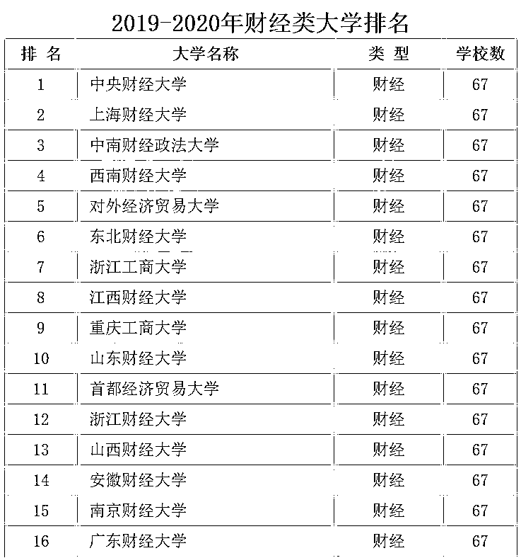

 *图片来源：中国科教网  

然而在年初，艾瑞深校友会发布的 2019 财经类大学排名却是另一种画风：

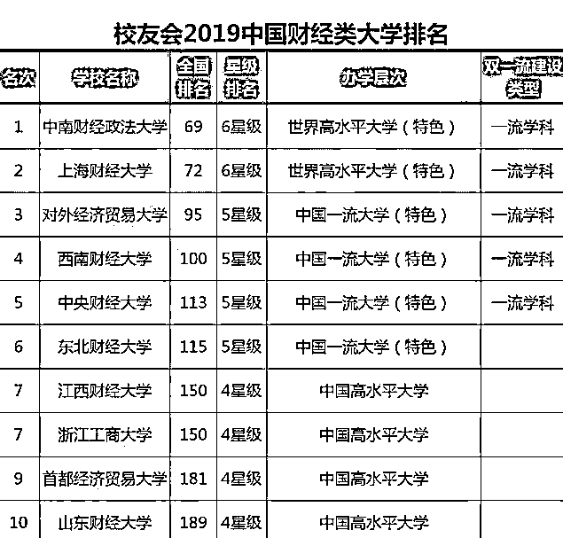

 *图片来源：艾瑞深校友会

通过对比，不难发现科教网排名第一的央财到了校友会排名中变成了第五，而校友会排名榜首的中南财大到了科教网排名中却屈居第三。那么，**国内众多财经高校，谁才是最强王者？**

**国内财经大学, 谁最强 **

国内财经院校中，**上海财经大学、中央财经大学、中南财经政法大学、西南财经大学和对外经济贸易大学**，因为身为 211 且在中国财经业处于绝对领先的地位，经常被人称为“四**财一贸**”。那么这五所大学，谁最强？

**1、就业率和薪资**

**一切不以就业为重点的排名都是耍流氓**，根据各高校公布的 2018 年毕业生就业质量报告来看，“四财一贸”本科生就业率均达到 90%以上，**其中外经济贸易大学就业率高达 99.44%，位列五校之首**，而上海财经大学就业率却只有 91.56%，排名五校之末。

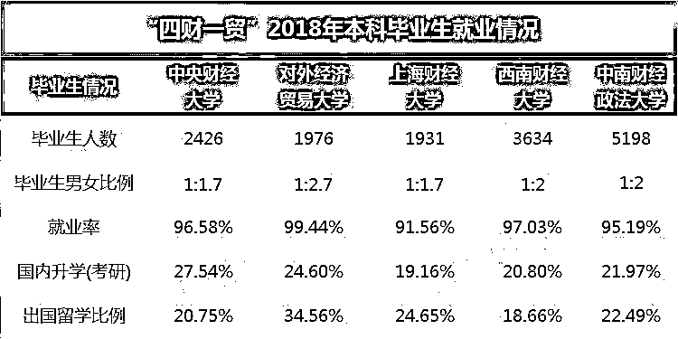

 *图片来源：中国教育在线

但在毕业生薪资方面，对外经济贸易大学却并不敌上海财经大学，**其中上海财经大学以 1.3 万平均薪酬遥遥领先对外经济贸易大学**，位居财经院校毕业生薪酬榜榜首。

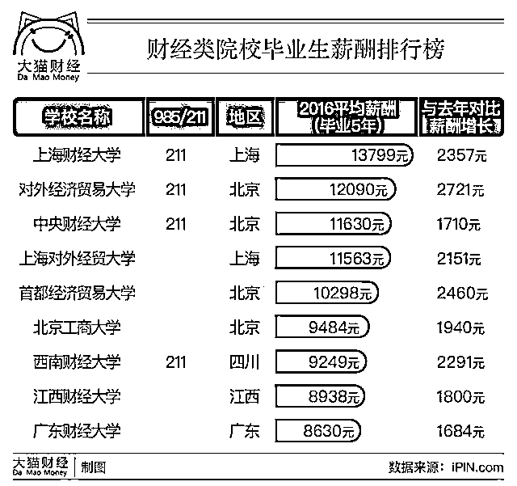

 *图片来源：大猫财经

**2、A 类学科数量**

从进入 A 类学科的数量看，上海财经大学有 3 个学科进入 A 类，剩余四校分别只有两个学科进入 A 类。值得一提的是中央财经大学的应用经济学是唯一获得 A+的学科。但综合来看，几所财经类高校都有自己的优势学科，实力差距不是很大。

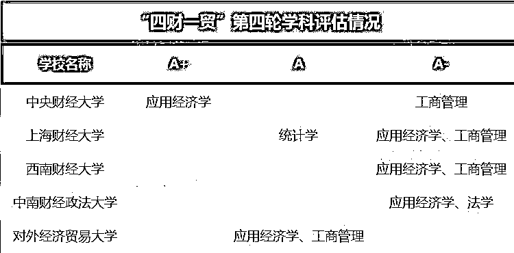

 *图片来源：中国教育在线

**3、师资力量**

师资力量对于高校核心竞争力的强弱、发展至关重要，“四财一贸”培养过众多拥有高水平研究和教学能力的专家学者，**其中师资数量最多的为西南财经大学，长江学者最多的为上海财经大学。**

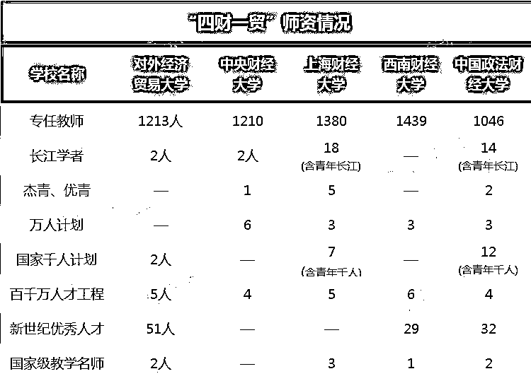

 *图片来源：中国教育在线

**4、各省录取分数**

拥有强劲实力的“四财一贸”，在学生选拔和录取上要求不低，上海财经大学、中央财经大学、对外经贸分数线甚至超过了很多顶级 985 院校。以生源地湖南为例，这五所大学 2018 年理科生录取分数线均在 610 以上，其中上海财经大学最高，达到 664 分；**即便录取分数线最低的中南财经政法大学也要 615 分才能录取。**

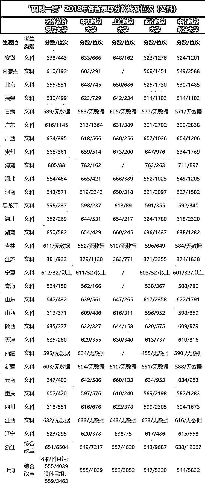

 *图片来源：中国教育在线

**万事讲求实用的财大学子**

全国所有财经院校的录取分数线通常都不低，在他们眼里 985/211 都是浮云。许多人心高气傲，学商科是为匹配高分，或者在够不着清北之后找一个看起来“好赚钱”的替代选择；许多人被爸妈以“好就业”的理由送来，**“接地气”和讲求实用成为财经学子在校四年的真实写照。**

这些学校生源差异不会太大，大牛遍地有；其次资源差异也不大，外部的资源对于前几名这些大学来说带来的边际效用也是递减的，每个学校在自己地域里积累的人脉也不是其他学校可以撼动的。排名的意义无非就是吸引生源，争取资源。

**上海财经大学**

综合大学嘲笑财经类大学太功利，财经大学看不上综合大学的就业率低，毕竟排名第一的上财已经碾压众多 985，薪资仅次于清华。

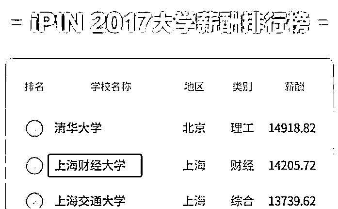

*图片来源：网络 | 2017 中国高校薪酬排行榜

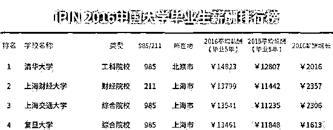

*图片来源：网络 | 2016 中国高校薪酬排行榜

“就业”接过了“高考”手里的大棒，在四年里不断敲打着大家。

有个 06 届学长表示，财大 BBS 还在的时候，最热门的板块永远是求职招聘板；大二开始实习就蔚然成风，翘课实习很常见；到了大三，更是变成了全民实习的阶段，连带如何选课排课也成了一门学问，如何应对一周三天甚至四天的实习，可是愁坏了多少人。这就是上财，你的 peer pressure 会让你玩都玩的不安心。

上财经管学科（应经、理经、工商管理、统计）总体发展水平总体在同类学校中最高，但基本与央财持平，也无法和外经贸拉开差距，已经不具备 2002、2007 和 2013 年前三次学科评估的优势。

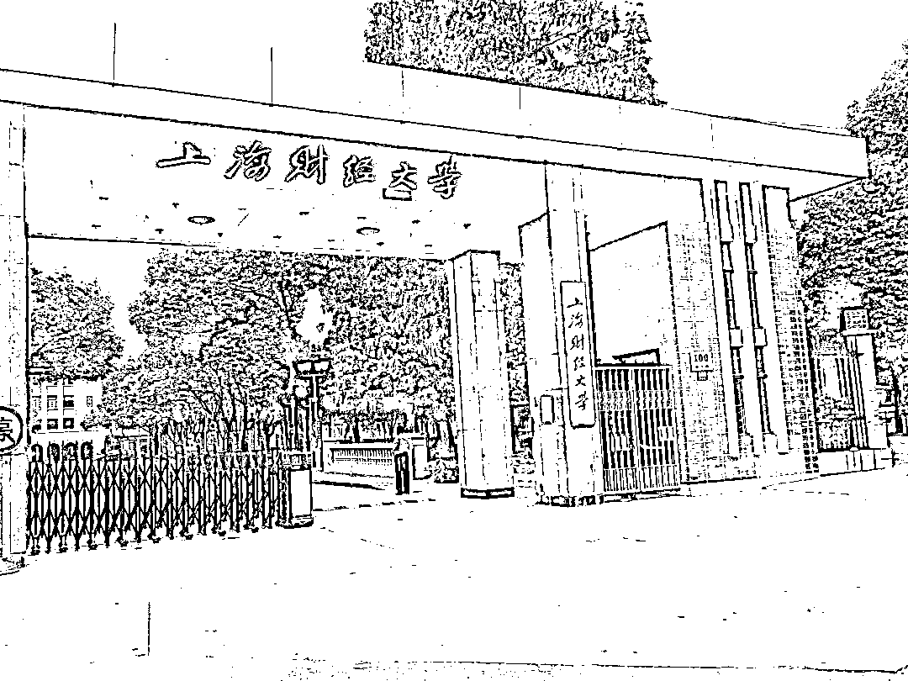

*图片来源：网络

**中央财经大学**

应用经济学连续十多年保持优势，以 A+的成绩坐实了双一流学科。理论经济学有所提升，工商管理和统计学尚可。总体而言比较偏科，经济学强，管理学较强。**在央财，绝大多数人和事情都是“目的指向型”的。**

> *上课、自习、点名、回答问题、和老师问问题套近乎——为了成绩；*
> *参加活动、参加比赛、学生工作、志愿者、社会实践——为了综测。*

央财确实有很多诟病的地方。去年从央财毕业的 Maggie 说，“我承认中财是有些功利。但，提早对考虑人生，对人生进行规划，难道不是一种优点吗？”从央财这个学校的特殊性来看，进央财的人大多都志同道合。学霸多，社团达人多，在某一方面有造诣的人多。身边的人都非常优秀，身边的人都有值得自己学习的地方。

*图片来源：网络

**对外经济贸易大学**

经、管、(外)文、法全面开花，是所有同类院校中亮点最多院校。相对于 2013 年学科评估成绩止跌回升，但现阶段与上海财经、中央财经仍有小幅差距。但，外经贸真的是一座有情怀，有深度，有广度，能学会玩的学校。

高中最好的一个朋友就是在贸大念的本科，最烦的一件事就是被问：“你考的哪个学校？”说到贸大的学风，她表示：“贸大根本就没有学风嘛哈哈哈！我们又不做学术研究……”就自由度来说，贸大应该是财经院校之首，因为你可以：

> *选课不是一般的自由，大学四年修满学分即可（私心认为是坑爹的选课系统根本选不到课，所以才特别自由）；*
> 
> *从来没有“夜不归宿”这个说法，在外实习到深夜的同学不用担心门禁；*
> 
> *wifi 覆盖全校，不限流量不要钱*
> 
> *参加美赛建模，学校提供场地和各种支持，简直不要更贴心……*

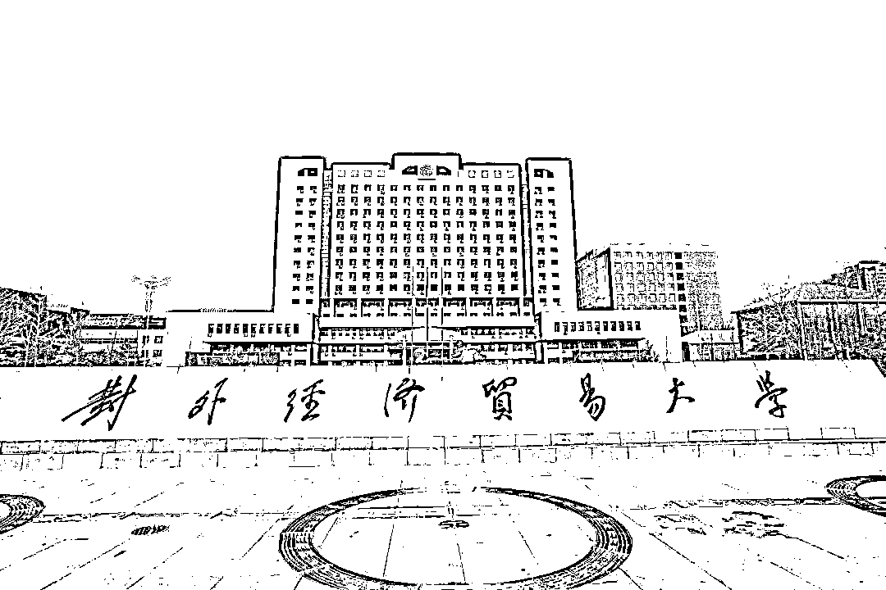

*图片来源：网络

**中南财经政法大学**

和其他财经校一样，功利也是中南财经政法的代名词；和其他校略有不同的是，作为四大财经院校之一，中南财的学子似乎更为低调，务实不好高骛远。见过 top10 的学生，觉得天之骄子，天下之美为尽在己；中南财的学生其实普遍认为学校仅仅是 211 而已，所以找工作也好，做工作也罢，不会觉得自身了不起，自大骄人，但是也不自卑。

一位中南财人曾如此评价：**财大或许是学术和科研大佬的噩梦，但却适合有梦想的人去一展宏图。**

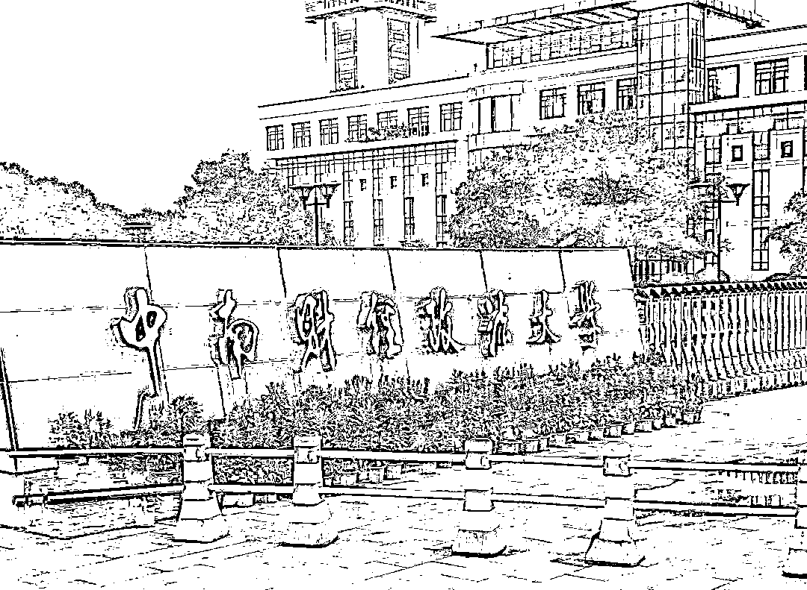

*图片来源：网络

**西南财经大学**

总体评估结果的确不够理想，甚至可以说出乎意料，与长期以来西财的内部评价和外部口碑不匹配。

考证热，功利化。这六个字在“央财就读体验”“在上财就读体验”的问题下面也是关键性字眼。果然一家人看着都亲近。进西财的书店，不过就是银行从业、证券从业、cpa 等书籍资料。这时候西财的学生都会叹息一句“这学校真是功利，我也买本报个名吧”……

曾有西财学子吐槽：

**“我财和电科有点像，都是本科中的高职高专，少了川大的那种大气，有种‘我别的不会但我金融/会计/保险很牛’的专业技工气质。”**

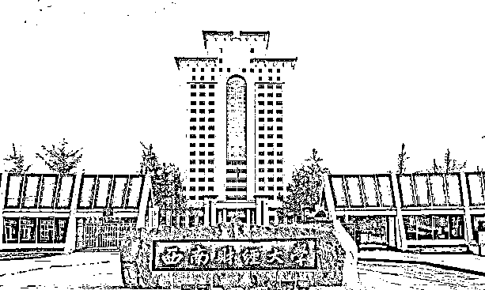

*图片来源：网络

**南京审计大学**

从学校性质来说，南审既不是 985，也不是 211。但论就业来说，南审的审计相关专业在大多数地方口碑都较为突出。在银行，四大中也有较为丰富的校友资源。由于收分高的原因，导致南审招收到的学生都是综合素质较高的一批，因而在江浙沪一带认可度较高。

*图片来源：网络

**不同的财经院校, 一样的财大人 **

知乎@曾大嘟曾这么写过西财：

**没办法，这是一所专科类学校（真讨厌这个描述），它有自己本身固有的性质，人文气息在这里不可能长存，我想这也是所有财经类学校既死又活的地方。**

你休想在这看见脚踩拖鞋板的行吟诗人，引吭高歌的路人，热闹的文学讨论。但你会发现这里有学生自主经营的超市，独立创办的广告公司，还有那些西装革履、逻辑缜密，让其他学校竞争对手闻风丧胆的求职者。

财大出去的学生很难成为庸才，要有这自信，也要有这骚劲儿。北清复交忙着扎堆搞金融投资（不信你看[被投资圈残害的清北复交学生们](http://mp.weixin.qq.com/s?__biz=MzAxNTc0Mjg0Mg==&mid=2653289110&idx=1&sn=538d00046a15fb2f70a56be79f71e6b9&chksm=802e3883b759b1950252499ea9a7b1fadaa4748ec40b8a1a8d7da0d5c17db153bd86548060fb&scene=21#wechat_redirect)），财经类反倒是遍地开花，提升整体就业率。

其实，对于所有的财经类学校，都是如此。如果说学校是座象牙塔，那么财经类大学应该是介于社会与象牙塔之间的。他们把大学当跳板，从进校门开始就确定好了求职目标。当大部分人大三才开始找实习的时候，他们手里可能已经有数家 500 强实习经历。秋招？春招？不好意思，我已经拿好了 return offer。

所以从这一点来看，财经院校内部的互撕并没有多大意义，等开始找工作或者开始工作了突然发现，大家大多数其实都是平凡的人：在学校里绝大多数平凡的人最后区别不过是你在这片区域做柜员，我在那片区域做柜员。你在这里卖理财，我在那里卖理财。我在这里加班做底稿，你在那边加班做底稿。

学校之间那些差距其实很渺小。而那些特别出类拔萃的精英们，早就不是自己的学校可以定义他们的。他们找到的工作，以后得发展其实他在这 a 财会这样，在 b 财也会，在 c 财也没差。

**所以，别让学校成为你的上限，也别让它成为你的下限。**

*—End—*

量化投资与机器学习微信公众号，是业内垂直于**Quant**、**MFE**、**CST、AI**等专业的**主****流量化自媒体**。公众号拥有来自**公募、私募、券商、银行、海外**等众多圈内**10W+**关注者。每日发布行业前沿研究成果和最新量化资讯。

