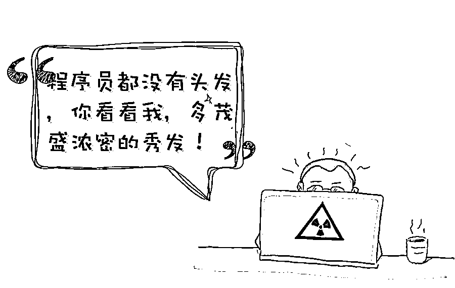

# 逼疯一个程序员有多简单？

> 原文：[`mp.weixin.qq.com/s?__biz=MzAxNTc0Mjg0Mg==&mid=2653293686&idx=1&sn=f599e1984afe73b8f4ff14c432192b2f&chksm=802dce63b75a47759169a6cb1f0c87b9833dff6736c5b8c88a6538ac2f2e8ad1e23bcadabc87&scene=27#wechat_redirect`](http://mp.weixin.qq.com/s?__biz=MzAxNTc0Mjg0Mg==&mid=2653293686&idx=1&sn=f599e1984afe73b8f4ff14c432192b2f&chksm=802dce63b75a47759169a6cb1f0c87b9833dff6736c5b8c88a6538ac2f2e8ad1e23bcadabc87&scene=27#wechat_redirect)

**标星★公众号     **爱你们♥

作者：人工智能爱好者社区

ID：AI_shequ

采访 1:

**程 序 员 多 久 关 一 次 电 脑 ？**

****

****程序员 A****

****

**你知不知道我每天开多少东西？**

**我需要很多数据库的连接、2 个 MySQL、1 个 MongoDB、偶尔一个 redis、**

**在这个之后还要写后台无数个 jobs 比如 sslocal、**

**局域网通信的 samba、连开发机的 VPN**

** ...**

**$^%%$^%%&*%**

****

**再说了，长此以往我都和这片内存产生了感情，**

**关机是不可能关机的。**

****程序员 B****

****

****

**这里就是熬电脑，**

**他啥时候扛不住了就让他重启一次。**

**做人，不能太苛刻。**

****程序员 C****

********

****采访：那你啥时候下班呀？****

********

****嗯，让我想想...**** 

********

****我想想上次下班是...****

****（就算在思考，也不能停止敲代码）****

********

****************

****采访 2:****

******程 序 员 修 电 脑 的 经 历 ？******

********

********

****请问你有过给别人修电脑的经历吗？**** 

******程序员 A******

********

****经常的事啊。大学还帮我们班班花修过电脑。****

********

****矮油～那不错哦！**** 

******** 

****原来班花电脑坏了，会经常找我们班大神去修，****

****修一次坏一次。****

****后来又一次大神不在，她就给我打了电话，****

****喊我去帮她修一下，****

****我就觉得哎大神也不过如此！****

********

****三分钟我就出现在她楼下，立马去她寝室里面，**** 

****格了分区、装了系统、打了补丁、安了驱动、****

****各种没有广告和插件的全都装了一遍，****

****然后写了一个 3000 字的 TXT****

****《爱心贴士：怎么用 XXXX》的操作文档。****

********

****哇～那班花岂不是超感激你！！！**** 

********

****必须的好吗！****

****大学四年别人的电脑卡顿、蓝屏、死机，****

****她电脑非常流畅地运行。****

********

****那... 你们后来？**** 

********

****我们俩。。。****

****就因为她电脑一直很好****

****所以。。。****

****再也没有找过我****

****************

****采访 3:****

******程 序 员 为 什 么 喜 欢 背 双 肩 包 ？******

********

******程序员 A******

********

******程序员 B******

********

******程序员 C******

************

********程序员 D******** 

************

******来我来给你看一下，我的双肩包里面都有什么东西。******

************

******电脑啊吃饭的家伙、******

******擦鼻子用的卫生纸、******

******钙片，因为运动量不够需要补补钙、******

******万一刮风了要穿的防风衣、******

******雨伞，最近可能会下雨、******

******格子衬衫，脏了可以换、******

******专业书《xx 指南》这也是吃饭的家伙、******

******Kindle，偶要看看电子书充充电、******

******降噪耳机防止产品经理吵我、******

******游戏机，万一有女朋友了还能一起打打游戏...******

************

******啊就这些没有了没有了。******

************

************************

******采访 4:******

********程 序 员 为 什 么 没 有 女 朋 友 ？********

************

********程序员 B********

****************

********哎，昨天的妹子跟你说肚子疼，********

********你怎么就给人家一杯热水啊？********

****************

********难道要跟她说我在 coding 别烦我？********

****************

********你可以用一些技巧啊，比如跟她说********

********“别闹，你哪有肚子呀～”********

********那妹子就会特别开心啊。********

********（第二天）******** 

****************

****************

********别闹，你哪有脑子呀。******** 

****************

********************************

********采访 5:********

**********程 序 员 届 流 传 的 谣 言 ？**********

****************

**********程序员 A**********

****************

**********程序员 B**********

****************

**********程序员 C**********

********************

************程序员 E************

************

************

************

******哎！我大姑给我打电话了！******

******可能是介绍女朋友奥～******

************

******“喂？******

******阿明啊，我问你个问题啊，******

******我在家用了 ctrl+c，******

******到单位用 ctrl+ v，******

******怎么就不灵了呢？”******

************

******你确定是用的是******

******。。。****** 

******同一个键盘吗？******

******（完）****** 

************

********彼得说：********

************

********公众号：前程序员陈彼得********

******IT 至今仍是投入产出比最高的行业之一，很多人天天挂在嘴边的金融 IT 男，不是空穴来风。这个行业不算苦、不算累，只是有一定的智力门槛而已。****** 

******我们程序员闲着没事的时候，又习惯性的不想离开计算机，所以流传中很多博大家一笑的自黑段子还真是自己人编的，什么收入低早衰也好、找不到媳妇也罢，外行人不必太当真。******

******当了十多年的程序员，深深的觉得，在一个优秀的团队里，就像是在拼一个几千块的拼图，然后其他人扔到你这边的碎片都是你恰好需要的那种感觉。大家拼着拼着，慢慢地从一个概念变成一个边框，一块块团，一片片区域，再补上最后开始找不到位置的几个零散碎片，一幅完整无暇的拼图完成的时候是多么有成就感啊！****** 

******而且写程序的总是和计算机打交道，计算机是完美的理性对象，非常有逻辑。一切行为对的就是对的，错的就是错的，如果错的了你一定可以知道是为什么，每一个步骤都有据可循，不和你闹脾气也不需要你态度好，更不会给你模棱两可的答案，还有更美好的事情吗？******

************************

******有啊******

******今天解决了一个 bug****** 

******就像把牙缝里的牛肉剔出来一样舒坦啊******

*******—End—*******

******量化投资与机器学习微信公众号，是业内垂直于**Quant**、**MFE**、**CST、AI**等专业的**主****流量化自媒体**。公众号拥有来自**公募、私募、券商、银行、海外**等众多圈内**10W+**关注者。每日发布行业前沿研究成果和最新量化资讯。******

************