# WorldQuant TAP：Alpha 如何多元化？

> 原文：[`mp.weixin.qq.com/s?__biz=MzAxNTc0Mjg0Mg==&mid=2653293682&idx=1&sn=a2fa86017c6aacd198fd9bebcb236527&chksm=802dce67b75a4771ebc03759af2a2e966741ce909ffdbb7e1c07ab98cd64bd86b360cb7d77d1&scene=27#wechat_redirect`](http://mp.weixin.qq.com/s?__biz=MzAxNTc0Mjg0Mg==&mid=2653293682&idx=1&sn=a2fa86017c6aacd198fd9bebcb236527&chksm=802dce67b75a4771ebc03759af2a2e966741ce909ffdbb7e1c07ab98cd64bd86b360cb7d77d1&scene=27#wechat_redirect)

**标星★公众号     **爱你们♥

**近期原创文章：**

## ♥ [5 种机器学习算法在预测股价的应用（代码+数据）](https://mp.weixin.qq.com/s?__biz=MzAxNTc0Mjg0Mg==&mid=2653290588&idx=1&sn=1d0409ad212ea8627e5d5cedf61953ac&chksm=802dc249b75a4b5fa245433320a4cc9da1a2cceb22df6fb1a28e5b94ff038319ae4e7ec6941f&token=1298662931&lang=zh_CN&scene=21#wechat_redirect)

## ♥ [Two Sigma 用新闻来预测股价走势，带你吊打 Kaggle](https://mp.weixin.qq.com/s?__biz=MzAxNTc0Mjg0Mg==&mid=2653290456&idx=1&sn=b8d2d8febc599742e43ea48e3c249323&chksm=802e3dcdb759b4db9279c689202101b6b154fb118a1c1be12b52e522e1a1d7944858dbd6637e&token=1330520237&lang=zh_CN&scene=21#wechat_redirect)

## ♥ 2 万字干货：[利用深度学习最新前沿预测股价走势](https://mp.weixin.qq.com/s?__biz=MzAxNTc0Mjg0Mg==&mid=2653290080&idx=1&sn=06c50cefe78a7b24c64c4fdb9739c7f3&chksm=802e3c75b759b563c01495d16a638a56ac7305fc324ee4917fd76c648f670b7f7276826bdaa8&token=770078636&lang=zh_CN&scene=21#wechat_redirect)

## ♥ [机器学习在量化金融领域的误用！](http://mp.weixin.qq.com/s?__biz=MzAxNTc0Mjg0Mg==&mid=2653292984&idx=1&sn=3e7efe9fe9452c4a5492d2175b4159ef&chksm=802dcbadb75a42bbdce895c49070c3f552dc8c983afce5eeac5d7c25974b7753e670a0162c89&scene=21#wechat_redirect)

## ♥ [基于 RNN 和 LSTM 的股市预测方法](https://mp.weixin.qq.com/s?__biz=MzAxNTc0Mjg0Mg==&mid=2653290481&idx=1&sn=f7360ea8554cc4f86fcc71315176b093&chksm=802e3de4b759b4f2235a0aeabb6e76b3e101ff09b9a2aa6fa67e6e824fc4274f68f4ae51af95&token=1865137106&lang=zh_CN&scene=21#wechat_redirect)

## ♥ [如何鉴别那些用深度学习预测股价的花哨模型？](https://mp.weixin.qq.com/s?__biz=MzAxNTc0Mjg0Mg==&mid=2653290132&idx=1&sn=cbf1e2a4526e6e9305a6110c17063f46&chksm=802e3c81b759b597d3dd94b8008e150c90087567904a29c0c4b58d7be220a9ece2008956d5db&token=1266110554&lang=zh_CN&scene=21#wechat_redirect)

## ♥ [优化强化学习 Q-learning 算法进行股市](https://mp.weixin.qq.com/s?__biz=MzAxNTc0Mjg0Mg==&mid=2653290286&idx=1&sn=882d39a18018733b93c8c8eac385b515&chksm=802e3d3bb759b42d1fc849f96bf02ae87edf2eab01b0beecd9340112c7fb06b95cb2246d2429&token=1330520237&lang=zh_CN&scene=21#wechat_redirect)

## ♥ [WorldQuant 101 Alpha、国泰君安 191 Alpha](https://mp.weixin.qq.com/s?__biz=MzAxNTc0Mjg0Mg==&mid=2653290927&idx=1&sn=ecca60811da74967f33a00329a1fe66a&chksm=802dc3bab75a4aac2bb4ccff7010063cc08ef51d0bf3d2f71621cdd6adece11f28133a242a15&token=48775331&lang=zh_CN&scene=21#wechat_redirect)

## ♥ [基于回声状态网络预测股票价格（附代码）](https://mp.weixin.qq.com/s?__biz=MzAxNTc0Mjg0Mg==&mid=2653291171&idx=1&sn=485a35e564b45046ff5a07c42bba1743&chksm=802dc0b6b75a49a07e5b91c512c8575104f777b39d0e1d71cf11881502209dc399fd6f641fb1&token=48775331&lang=zh_CN&scene=21#wechat_redirect)

## ♥ [计量经济学应用投资失败的 7 个原因](https://mp.weixin.qq.com/s?__biz=MzAxNTc0Mjg0Mg==&mid=2653292186&idx=1&sn=87501434ae16f29afffec19a6884ee8d&chksm=802dc48fb75a4d99e0172bf484cdbf6aee86e36a95037847fd9f070cbe7144b4617c2d1b0644&token=48775331&lang=zh_CN&scene=21#wechat_redirect)

## ♥ [配对交易千千万，强化学习最 NB！（文档+代码）](http://mp.weixin.qq.com/s?__biz=MzAxNTc0Mjg0Mg==&mid=2653292915&idx=1&sn=13f4ddebcd209b082697a75544852608&chksm=802dcb66b75a4270ceb19fac90eb2a70dc05f5b6daa295a7d31401aaa8697bbb53f5ff7c05af&scene=21#wechat_redirect)

## ♥ [关于高盛在 Github 开源背后的真相！](https://mp.weixin.qq.com/s?__biz=MzAxNTc0Mjg0Mg==&mid=2653291594&idx=1&sn=7703403c5c537061994396e7e49e7ce5&chksm=802dc65fb75a4f49019cec951ac25d30ec7783738e9640ec108be95335597361c427258f5d5f&token=48775331&lang=zh_CN&scene=21#wechat_redirect)

## ♥ [新一代量化带货王诞生！Oh My God！](https://mp.weixin.qq.com/s?__biz=MzAxNTc0Mjg0Mg==&mid=2653291789&idx=1&sn=e31778d1b9372bc7aa6e57b82a69ec6e&chksm=802dc718b75a4e0ea4c022e70ea53f51c48d102ebf7e54993261619c36f24f3f9a5b63437e9e&token=48775331&lang=zh_CN&scene=21#wechat_redirect)

## ♥ [独家！关于定量/交易求职分享（附真实试题）](https://mp.weixin.qq.com/s?__biz=MzAxNTc0Mjg0Mg==&mid=2653291844&idx=1&sn=3fd8b57d32a0ebd43b17fa68ae954471&chksm=802dc751b75a4e4755fcbb0aa228355cebbbb6d34b292aa25b4f3fbd51013fcf7b17b91ddb71&token=48775331&lang=zh_CN&scene=21#wechat_redirect)

## ♥ [Quant 们的身份危机！](https://mp.weixin.qq.com/s?__biz=MzAxNTc0Mjg0Mg==&mid=2653291856&idx=1&sn=729b657ede2cb50c96e92193ab16102d&chksm=802dc745b75a4e53c5018cc1385214233ec4657a3479cd7193c95aaf65642f5f45fa0e465694&token=48775331&lang=zh_CN&scene=21#wechat_redirect)

## ♥ [拿起 Python，防御特朗普的 Twitter](https://mp.weixin.qq.com/s?__biz=MzAxNTc0Mjg0Mg==&mid=2653291977&idx=1&sn=01f146e9a88bf130ca1b479573e6d158&chksm=802dc7dcb75a4ecadfdbdace877ed948f56b72bc160952fd1e4bcde27260f823c999a65a0d6d&token=48775331&lang=zh_CN&scene=21#wechat_redirect)

## ♥ [AQR 最新研究 | 机器能“学习”金融吗？](http://mp.weixin.qq.com/s?__biz=MzAxNTc0Mjg0Mg==&mid=2653292710&idx=1&sn=e5e852de00159a96d5dcc92f349f5b58&chksm=802dcab3b75a43a5492bc98874684081eb5c5666aff32a36a0cdc144d74de0200cc0d997894f&scene=21#wechat_redirect)

**正文**

Tulchinsky 是 WorldQuant 的创始人、董事长兼首席执行官。他曾是一名统计套利投资组合经理、风险投资家和科学家，也曾是一名电子游戏程序员。

Ghost Hunt  - 由 WorldQuant 的创始人 Igor Tulchinsky 创作

在这里玩：

http://www.c64.cz/index.php?detailhry=22588&source=post_page---------------------------  

Tulchinsky 在德克萨斯大学获得计算机科学硕士学位不到 9 个月，他以其数学和系统的投资方式闻名 WorldQuant。

WorldQuant 为系统研究指定了一个而闻名 Triple-Axis 计划（TAP），分别是：

**AXIS 1: IDEAS & DATASETS**

第一个轴是想法和数据集（ IDEAS & DATASETS）。有很多创造 Alpha 的想法，从均值回归、动量和趋势跟踪到价值、成长和最小波动率。

Igor Tulchinsky 等人 2015 年推出了 101 Alphas 项目，其中有一篇名为**《101 Formulaic Alphas》**的论文。该论文列出了 101 个 Alpha 因子的伪代码，这些因子主要基于量价数据计算而来。

举一个例子，比如：**Alpha #002**

**(-1 * correlation(rank(delta(log(volume), 2)), rank(((close - open) / open)), 6))**

根据公式的运算顺序解析：

1、x0=log(volume)

**解析：**对成交量 volume 取对数操作。

2、x1=delta(x0,2)

**解析：**利用当天的值 x0 减去过去第 2 天的值 x0。x0 为 1 的返回值。

3、 y1=(close-open) / open  

**解析：**收盘价减开盘价的差，再除以开盘价。

4、x2=rank(x1)    

**解析：**对每个股票的 x1 值进行排序，返回其股票对应排名的 boolean 值（排名所占总位数的百分比）。

5、 y2=rank( y1)

**解析：**对每个股票的 y2 值进行排序，返回其股票对应排名的 boolean 值（排名所占总位数的百分比）。

6、c=-1*correlation(x2, y2,6)

**解析：**计算 x2 和 y2 变量前 6 天的相关系数。我们知道 x2 和 y2 表示股票的排序 boolean 值。其计算逻辑是计算每只股票的前 6 天的排序 boolean 值的相关系数。

另一方面，根据相关系数的性质我们知道：

相关系数的值介于–1 与+1 之间，即–1≤r≤+1。

由此，当计算的相关系数越接近 1，正相关程度越大。反之，相关系数越接近-1，负相关程度越高。而对相关系数乘以-1 进行取反操作，得到的 alpha 值。表明 alpha 越接近 1，负相关程度越高，即股票当天成交量的增量程度与当天价格的增量程度负相关性越高。

**因此，此公式是反映价量背离的规律的一个公式，买入 alpha 值大的股票，卖出 alpha 值大的股票，原理是买入加量背离程度高的股票。**

公众号也曾分享过一篇关于 101 因子源代码的文章：  

[**WorldQuant 101 Alpha（源码分享）**](http://mp.weixin.qq.com/s?__biz=MzAxNTc0Mjg0Mg==&mid=2653290927&idx=1&sn=ecca60811da74967f33a00329a1fe66a&chksm=802dc3bab75a4aac2bb4ccff7010063cc08ef51d0bf3d2f71621cdd6adece11f28133a242a15&scene=21#wechat_redirect)  

这几年国内兴起高频量价的研究。也是情理之中。

扯一句，这些因子怎么生成的，有一个观点是：

**基于遗传规划**

遗传规划（Genetic Programming，GP）用树状结构表示基因，而遗传算法的基因座是串行的。两者相比，遗传规划的扩展性，可变性更强。

**1、遗传规划树状结构的节点是由“运算算子”构成的，这些算子包括了科学计 算（+，-，log，sin，sum），自定义算子（例如 z=f(x,y)函数，a=rank (b)等）。**

2、遗传规划的树状结构的层级和复杂度，随着迭代自动延伸，不需要对最终模型有先验判断。

3、理论上，基本数学和逻辑运算符，可以表述所有已知和未知的技术指标和交 易经验。但基于现有的运算能力，限定运算和数据范围能有效提高交易系统开发效率。

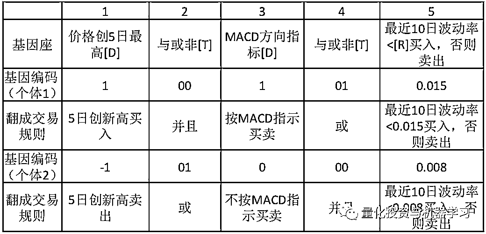5 个基因座编码的例子

编码类型

*   指标编码[D]:1，0，-1

*   逻辑编码[T]:AND，OR，NOR

*   实数编码[R]:0.3415，-1.415

*   个体 1 的程序编码为 1 00 1 01 0.015，按照这个编码进行交易得到一个交易结果

*   对种群中所有个体计算交易结果，并转换成种群的适应度

*   基因座个数，种群中个体个数取决于计算力

还有许多可用的数据集。最常见的是金融数据集，如行情价格数据集、公司基本面数据集、财务数据集等。最近，从基金经理、交易员到机构买方买方，这几年正在兴起一句话：

**另类数据的崛起**

**因为它们可用作产生 Alpha 的新来源。**

起初，另类数据的使用主要局限于量化投资经理，因为这些公司最适合获取、清理和处理这些数据。然而，随着基本面和混合资产管理公司对其兴趣的日益增长，另类数据已正开始成为主流。

**另类数据是未发掘的 Alpha**

对投资者来说，本世纪最大的机遇来自在数字经济数据中产生的隐藏信号。另类数据是当今世界上最深入、使用最少的**Alpha 源！**

——Quandl

6 月份，Verizon 为雅虎财经（Yahoo Finance）推出订阅服务，向散户投资者提供另类数据和研究分析，这让我们看到另类数据已逐渐成为主流。是的，你没听错：**散户投资者**。价格为每月 34.99 美元。

人们用在另类数据上费用一直在稳步增长。Greenwich Associates 的报告显示：**在最近接受调查的量化投资者和基本面投资者中，有一半以上的人正在考虑或使用另类数据，作为其工作流程的一部分！**

Greenwich Associates 的报告发现：**绝大多数（72%）的投资经理表示，在一个过滤掉信号噪声的领域，另类数据正在改善他们的信号质量**。在那些正在使用另类数据执行策略的人中，超过五分之一的人声称：他们**从实际交易中获得了 20%或更多的 Alpha**。

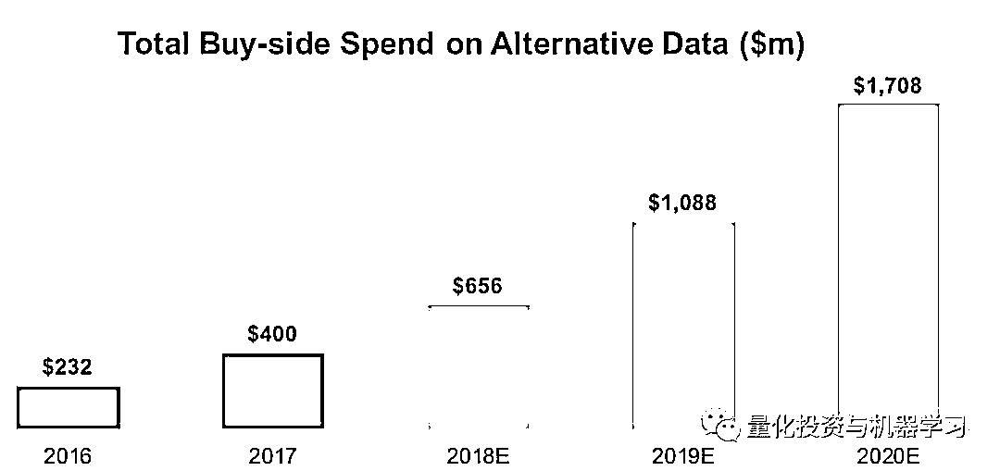

从 2018 年到 2020 年，这一数字可能会增长近两倍

NRI（Nomura Research Institute，日本野村综合研究所）Takeshi Shimamura 写过一篇文章提到：

**近些年，另类数据在资产管理行业中的使用越来越广泛。根据 Opimas 公司的预测，全球另类数据市场将从 2017 年 43 亿美元增长到 2020 年的 90 亿美元——在 3 年间翻一番。**

另类数据更多的应用于偏股票型的量化对冲基金。近于实时的另类数据流有助资产管理公司提前获得大量股票买入或卖出的信号。除此之外，传统资产管理公司也已经开始使用另类数据来帮助提升人工制定长期投资决策的质量。例如，英国资产管理公司 Schroders 在 2014 年推出了一个“数据洞察部门”（Data Insights Unit，以下简称“DIU”）。DIU 拥有 30 名数据科学家，他们分析各种另类数据，帮助投资组合管理团队制定中长期投资决策。

**欧美市场也正在形成包括使用另类数据的资产管理经理、数据所有者和供应商的另类数据生态系统**。例如，Orbital Insights 和 Prattle 两家另类数据供应商，前者利用卫星图像估计原油库存，后者根据文本数据定量分析主要国家货币政策情绪。

根据新金融评论的报道：

**从数据积累方面看**

根据 IDC 的一份报告，2018 年全球有 33ZB 的数据，而这个数量预计在 2025 年会增长到 175ZB，这依赖于计算机算力的提升和存储设备技术的提高。

**从另类数据公司数量上看**

另类数据公司主要分为三类。一是原始数据提供者，这类供应商只收集最原始的另类数据，对于数据的处理程度最小；二是轻处理数据提供者，提供与金融资产相关的可视化数据；三是信号提供者，一般关注于某个特定行业，向资产管理公司提供打包好的量化投资信号。

**从市场空间上看**

另类数据统计表明截止 2017 年全球已有约 800 支基金利用另类数据做投资决策，2017 年投资机构对另类数据的投入规模约为 4 亿美金，行业正处于快速发展期，预计 2020 年可达 17 亿美金，CAGR 约为 45%。

投资机构为了获得超额收益，不断寻找新的市场阿尔法，**但主动型基金在寻找市场阿尔法这个核心竞争力上的优势越来越弱：**

1、因为市场有效性不断增强，基金经理很难找到被错误定价的资产；

2、因为大部分基金经理能得到的信息同质化，导致很难找到独特的信息优势和额外信息；

3、因为调研高度人工化导致人才的费用越来越高。

**目前国内使用另类数据的多为对冲基金、二级市场基金及部分一级市场基金**。另类数据可以**给基金经理带来五点优势：**

*   **更大体量的数据和信息**

*   **新的洞察力**

*   **竞争优势**

*   **可靠性以**

*   **效率**

虽然基金经理使用另类数据寻找到新的阿尔法只是时间问题，**但并不是所有另类数据都有潜力可以帮助基金公司获取市场阿尔法**，因此另类数据公司在收集、清洗数据的同时，需要基金经理来评判数据是否有价值，同时高效的处理和应用将是降低成本和提升效率的关键，因此**另类数据公司应当具备机器学习等技术开发能力和高效的产品策略**。

****AXIS 2: REGIONS & UNIVERSES****

第二个轴是区域和全球（REGIONS & UNIVERSES）。该轴定义了策略的可交易范围。最多的地区是美国、欧洲和亚洲。在这个轴上，我们应该定义一个股票子集。标准可能包括：

*   **国家和地区**

*   **行业和领域**

*   **流动性**

*   **法律和合规**

*   **授权（例如风险敞口和分配）**

对于国家/地区的筛选，通常的做法是使用常用基准指数，该指数为目标国家/地区的流动性和可交易证券提供一个标准和透明的定义。对于行业/领域，一种常见的方法是使用 GICS 或 ICB 等基准，这些基准提供了广泛认可的行业分类系统。

先锋持有被动基金逾一半的市场份额，其次是贝莱德、道富和富达。

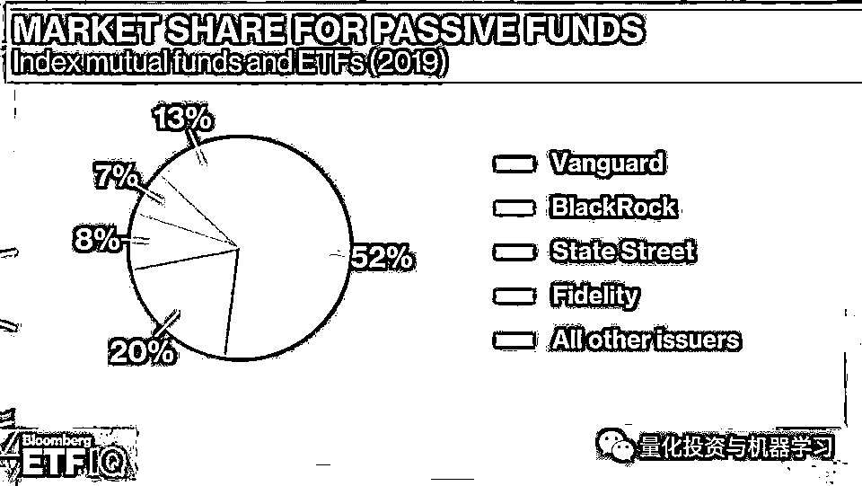

被动基金市场份额

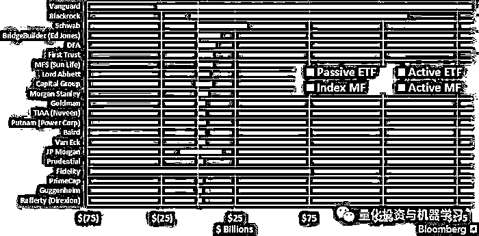

2018 年 ETF 和基金流通量

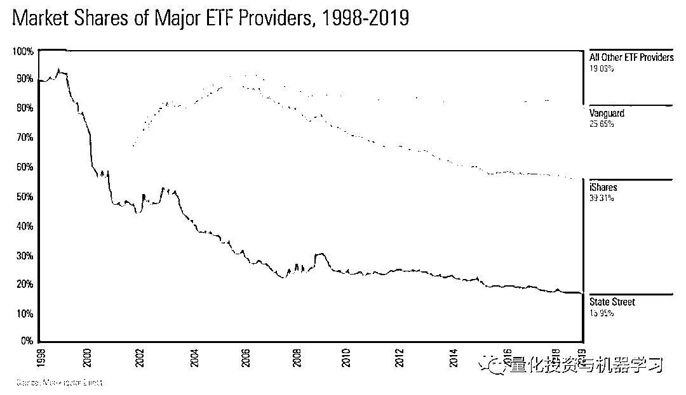

ETF 提供商市场份额的演变

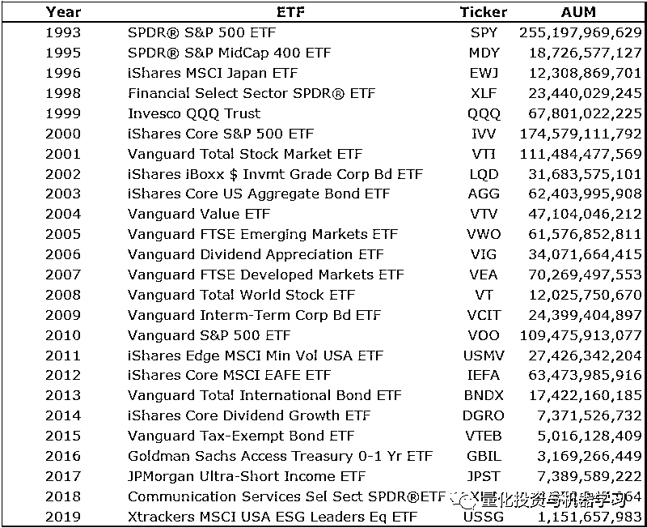

发布年度最成功的 ETF

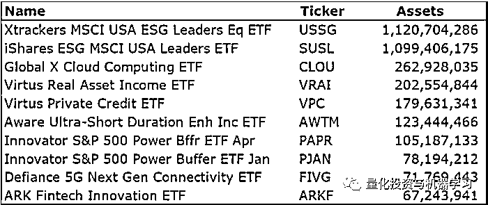

2019 年迄今推出的最成功 ETF

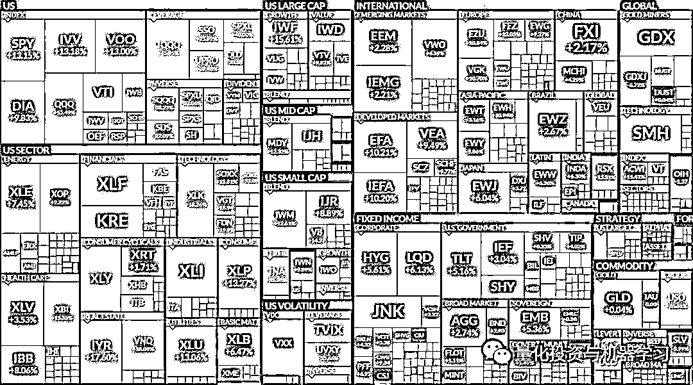

ETF 年初至今总回报

**AXIS 3: PERFORMANCE PARAMETERS**

第三个轴是参数性能（PERFORMANCE PARAMETERS）。参数性能被视为分析 Alpha 表现的方法，也可以解释为 Alpha 思想的来源。可能是夏普的 Alpha，也可能最大回撤的 Alpha。定义目标函数的参数性能是获取 Alpha 思想的关键。

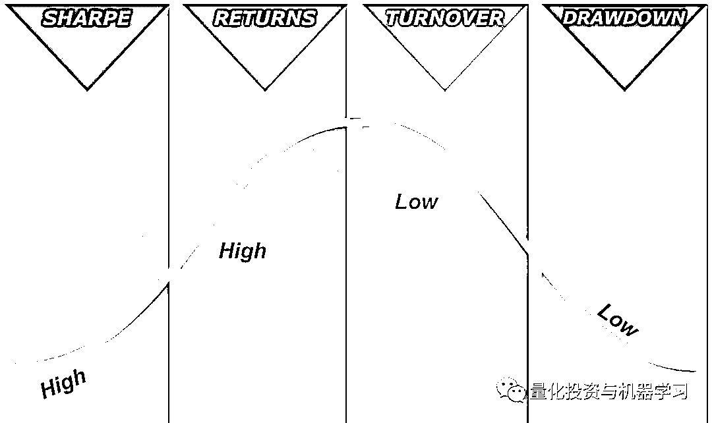

来源：世坤

在国内，比如 Wind 的 PMS：

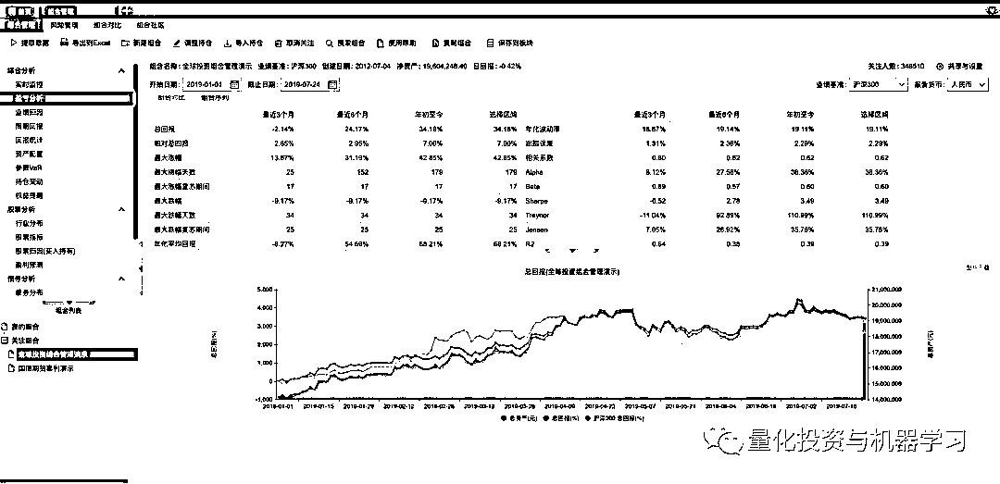

来源：Wind 金融终端

# 国外。比如：Axioma。其模拟了广泛的对冲基金策略，包括多头/空头股票，市场中性，事件驱动，全球宏观基金和具有极大灵活性的基金。

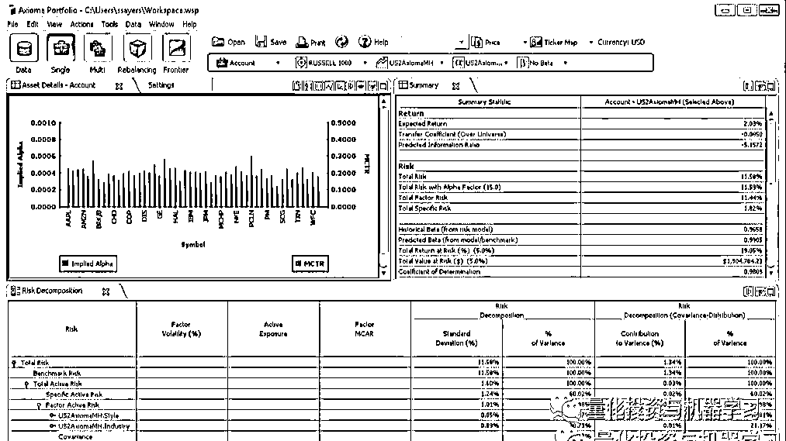

*https://www.axioma.com/products/axioma-portfolio-1/axioma-portfolio-optimizer/hedge-fund-manager/?source=post_page---------------------------*

**结论**

WorldQuant 的 Triple-Axis 计划（TAP）为系统投资提供了一种简单易用的稳健方法。虽然机器比以往任何时候都强大，但我们仍然需要定义正确的目标函数和数据。  

*—End—*

量化投资与机器学习微信公众号，是业内垂直于**Quant**、**MFE**、**CST、AI**等专业的**主****流量化自媒体**。公众号拥有来自**公募、私募、券商、银行、海外**等众多圈内**10W+**关注者。每日发布行业前沿研究成果和最新量化资讯。

