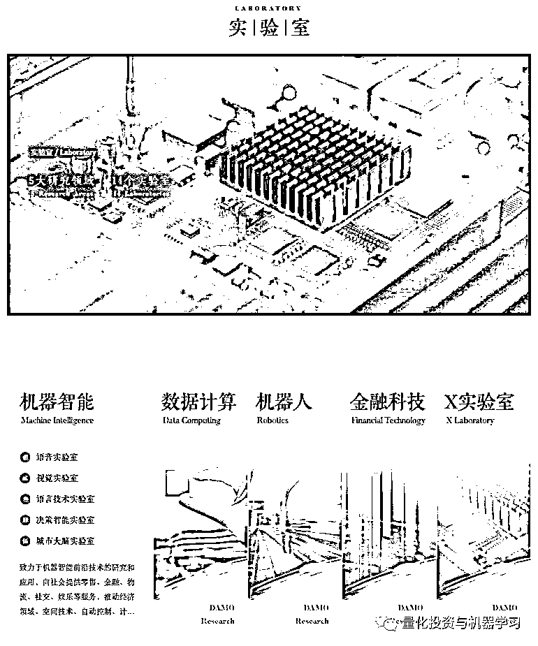
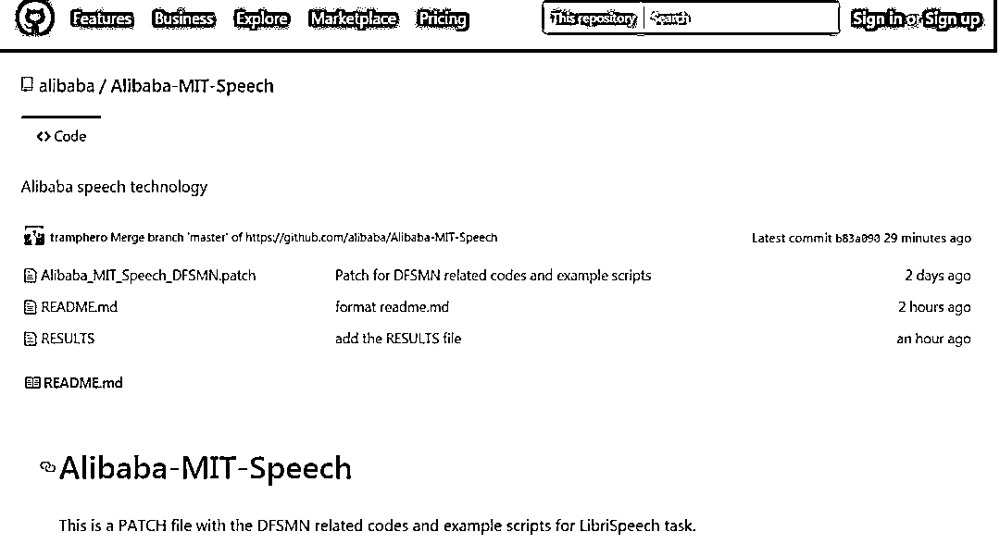
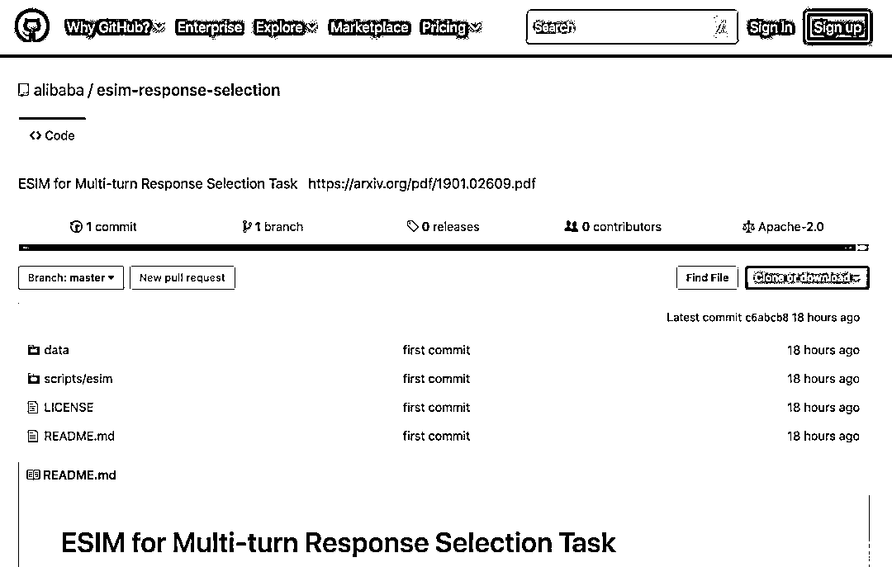
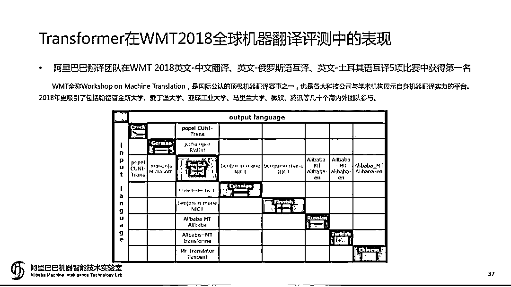
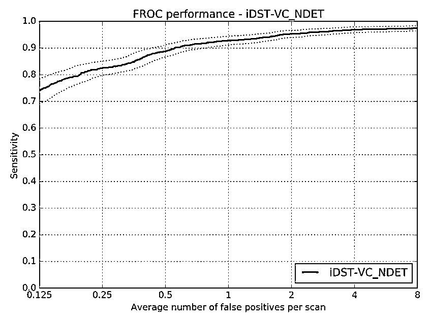
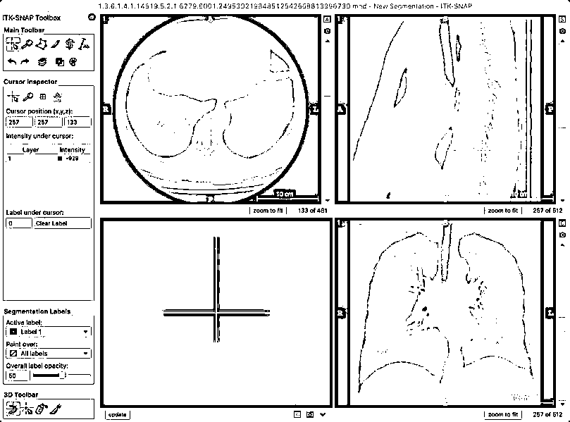
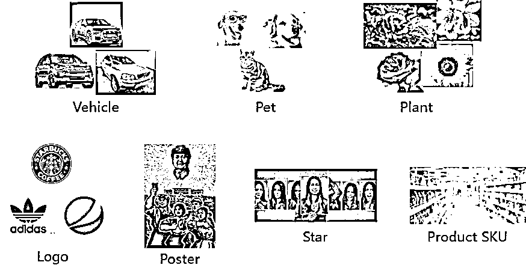
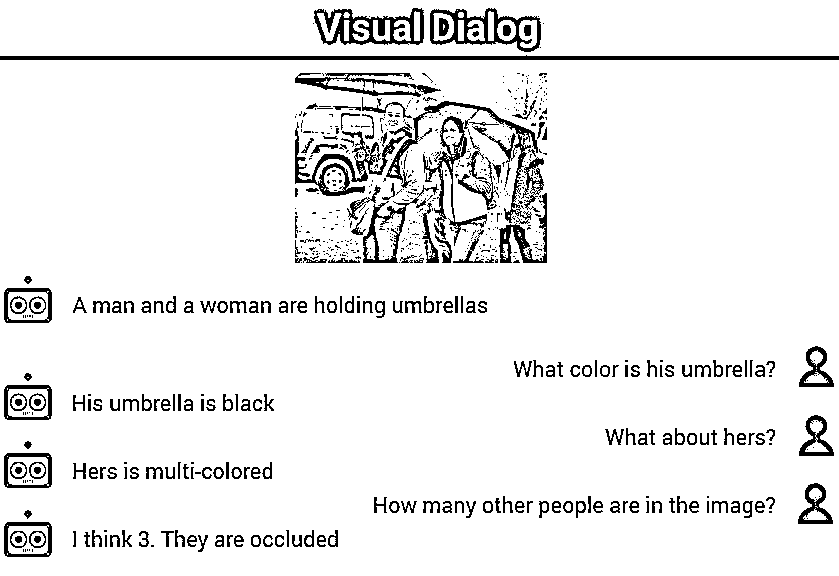
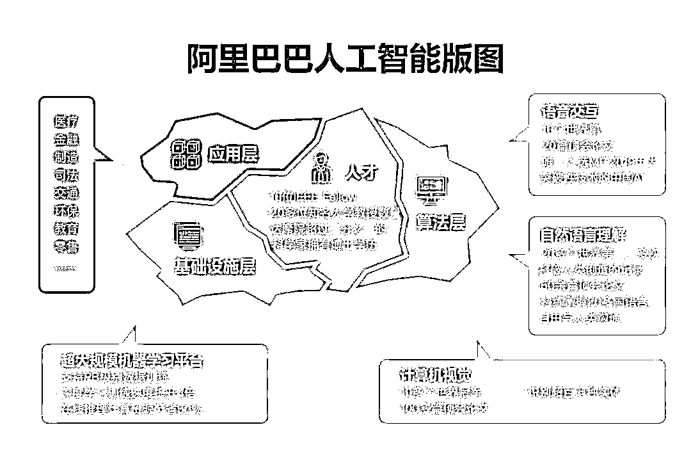

# 阿里达摩院做 AI 的这 2 年

> 原文：[`mp.weixin.qq.com/s?__biz=MzAxNTc0Mjg0Mg==&mid=2653293652&idx=1&sn=17802bc4734856cc348fe8c224a2bf2d&chksm=802dce41b75a47577c0d1896565b423a458b2f0cd647d80b2fda1096dcccf7ed5487f14166b4&scene=27#wechat_redirect`](http://mp.weixin.qq.com/s?__biz=MzAxNTc0Mjg0Mg==&mid=2653293652&idx=1&sn=17802bc4734856cc348fe8c224a2bf2d&chksm=802dce41b75a47577c0d1896565b423a458b2f0cd647d80b2fda1096dcccf7ed5487f14166b4&scene=27#wechat_redirect)

**标星★公众号     **爱你们♥

整理 | Jane

出品 | AI 科技大本营（ID：rgznai100)

**近期原创文章：**

## ♥ [5 种机器学习算法在预测股价的应用（代码+数据）](https://mp.weixin.qq.com/s?__biz=MzAxNTc0Mjg0Mg==&mid=2653290588&idx=1&sn=1d0409ad212ea8627e5d5cedf61953ac&chksm=802dc249b75a4b5fa245433320a4cc9da1a2cceb22df6fb1a28e5b94ff038319ae4e7ec6941f&token=1298662931&lang=zh_CN&scene=21#wechat_redirect)

## ♥ [Two Sigma 用新闻来预测股价走势，带你吊打 Kaggle](https://mp.weixin.qq.com/s?__biz=MzAxNTc0Mjg0Mg==&mid=2653290456&idx=1&sn=b8d2d8febc599742e43ea48e3c249323&chksm=802e3dcdb759b4db9279c689202101b6b154fb118a1c1be12b52e522e1a1d7944858dbd6637e&token=1330520237&lang=zh_CN&scene=21#wechat_redirect)

## ♥ 2 万字干货：[利用深度学习最新前沿预测股价走势](https://mp.weixin.qq.com/s?__biz=MzAxNTc0Mjg0Mg==&mid=2653290080&idx=1&sn=06c50cefe78a7b24c64c4fdb9739c7f3&chksm=802e3c75b759b563c01495d16a638a56ac7305fc324ee4917fd76c648f670b7f7276826bdaa8&token=770078636&lang=zh_CN&scene=21#wechat_redirect)

## ♥ [机器学习在量化金融领域的误用！](http://mp.weixin.qq.com/s?__biz=MzAxNTc0Mjg0Mg==&mid=2653292984&idx=1&sn=3e7efe9fe9452c4a5492d2175b4159ef&chksm=802dcbadb75a42bbdce895c49070c3f552dc8c983afce5eeac5d7c25974b7753e670a0162c89&scene=21#wechat_redirect)

## ♥ [基于 RNN 和 LSTM 的股市预测方法](https://mp.weixin.qq.com/s?__biz=MzAxNTc0Mjg0Mg==&mid=2653290481&idx=1&sn=f7360ea8554cc4f86fcc71315176b093&chksm=802e3de4b759b4f2235a0aeabb6e76b3e101ff09b9a2aa6fa67e6e824fc4274f68f4ae51af95&token=1865137106&lang=zh_CN&scene=21#wechat_redirect)

## ♥ [如何鉴别那些用深度学习预测股价的花哨模型？](https://mp.weixin.qq.com/s?__biz=MzAxNTc0Mjg0Mg==&mid=2653290132&idx=1&sn=cbf1e2a4526e6e9305a6110c17063f46&chksm=802e3c81b759b597d3dd94b8008e150c90087567904a29c0c4b58d7be220a9ece2008956d5db&token=1266110554&lang=zh_CN&scene=21#wechat_redirect)

## ♥ [优化强化学习 Q-learning 算法进行股市](https://mp.weixin.qq.com/s?__biz=MzAxNTc0Mjg0Mg==&mid=2653290286&idx=1&sn=882d39a18018733b93c8c8eac385b515&chksm=802e3d3bb759b42d1fc849f96bf02ae87edf2eab01b0beecd9340112c7fb06b95cb2246d2429&token=1330520237&lang=zh_CN&scene=21#wechat_redirect)

## ♥ [WorldQuant 101 Alpha、国泰君安 191 Alpha](https://mp.weixin.qq.com/s?__biz=MzAxNTc0Mjg0Mg==&mid=2653290927&idx=1&sn=ecca60811da74967f33a00329a1fe66a&chksm=802dc3bab75a4aac2bb4ccff7010063cc08ef51d0bf3d2f71621cdd6adece11f28133a242a15&token=48775331&lang=zh_CN&scene=21#wechat_redirect)

## ♥ [基于回声状态网络预测股票价格（附代码）](https://mp.weixin.qq.com/s?__biz=MzAxNTc0Mjg0Mg==&mid=2653291171&idx=1&sn=485a35e564b45046ff5a07c42bba1743&chksm=802dc0b6b75a49a07e5b91c512c8575104f777b39d0e1d71cf11881502209dc399fd6f641fb1&token=48775331&lang=zh_CN&scene=21#wechat_redirect)

## ♥ [计量经济学应用投资失败的 7 个原因](https://mp.weixin.qq.com/s?__biz=MzAxNTc0Mjg0Mg==&mid=2653292186&idx=1&sn=87501434ae16f29afffec19a6884ee8d&chksm=802dc48fb75a4d99e0172bf484cdbf6aee86e36a95037847fd9f070cbe7144b4617c2d1b0644&token=48775331&lang=zh_CN&scene=21#wechat_redirect)

## ♥ [配对交易千千万，强化学习最 NB！（文档+代码）](http://mp.weixin.qq.com/s?__biz=MzAxNTc0Mjg0Mg==&mid=2653292915&idx=1&sn=13f4ddebcd209b082697a75544852608&chksm=802dcb66b75a4270ceb19fac90eb2a70dc05f5b6daa295a7d31401aaa8697bbb53f5ff7c05af&scene=21#wechat_redirect)

## ♥ [关于高盛在 Github 开源背后的真相！](https://mp.weixin.qq.com/s?__biz=MzAxNTc0Mjg0Mg==&mid=2653291594&idx=1&sn=7703403c5c537061994396e7e49e7ce5&chksm=802dc65fb75a4f49019cec951ac25d30ec7783738e9640ec108be95335597361c427258f5d5f&token=48775331&lang=zh_CN&scene=21#wechat_redirect)

## ♥ [新一代量化带货王诞生！Oh My God！](https://mp.weixin.qq.com/s?__biz=MzAxNTc0Mjg0Mg==&mid=2653291789&idx=1&sn=e31778d1b9372bc7aa6e57b82a69ec6e&chksm=802dc718b75a4e0ea4c022e70ea53f51c48d102ebf7e54993261619c36f24f3f9a5b63437e9e&token=48775331&lang=zh_CN&scene=21#wechat_redirect)

## ♥ [独家！关于定量/交易求职分享（附真实试题）](https://mp.weixin.qq.com/s?__biz=MzAxNTc0Mjg0Mg==&mid=2653291844&idx=1&sn=3fd8b57d32a0ebd43b17fa68ae954471&chksm=802dc751b75a4e4755fcbb0aa228355cebbbb6d34b292aa25b4f3fbd51013fcf7b17b91ddb71&token=48775331&lang=zh_CN&scene=21#wechat_redirect)

## ♥ [Quant 们的身份危机！](https://mp.weixin.qq.com/s?__biz=MzAxNTc0Mjg0Mg==&mid=2653291856&idx=1&sn=729b657ede2cb50c96e92193ab16102d&chksm=802dc745b75a4e53c5018cc1385214233ec4657a3479cd7193c95aaf65642f5f45fa0e465694&token=48775331&lang=zh_CN&scene=21#wechat_redirect)

## ♥ [拿起 Python，防御特朗普的 Twitter](https://mp.weixin.qq.com/s?__biz=MzAxNTc0Mjg0Mg==&mid=2653291977&idx=1&sn=01f146e9a88bf130ca1b479573e6d158&chksm=802dc7dcb75a4ecadfdbdace877ed948f56b72bc160952fd1e4bcde27260f823c999a65a0d6d&token=48775331&lang=zh_CN&scene=21#wechat_redirect)

## ♥ [AQR 最新研究 | 机器能“学习”金融吗？](http://mp.weixin.qq.com/s?__biz=MzAxNTc0Mjg0Mg==&mid=2653292710&idx=1&sn=e5e852de00159a96d5dcc92f349f5b58&chksm=802dcab3b75a43a5492bc98874684081eb5c5666aff32a36a0cdc144d74de0200cc0d997894f&scene=21#wechat_redirect)

**前言**

2017 年 10 月的杭州云栖大会上，阿里巴巴正式宣布成立达摩院，未来三年将投入将超过 1000 亿人民币用于基础科学和颠覆式技术创新研究。达摩院官网正式上线后，我们看到达摩院重点布局机器智能、数据计算、机器人、金融科技以及 X 实验室五大领域，相应设置有 14 个实验室，共有近 70 名海内外专家坐镇。

AI 技术是达摩院目前重金押注的技术领域之一，即将成立两年，人们可能都比较好奇达摩院在 AI 上到底布局了哪些技术领域？又在哪些技术方向上取得了突破？本文将一一盘点达摩院在 AI 技术上的重大进展。

# **阿里 AI 的技术发展及平台建设**

阿里拥有全面的 AI 技术布局，涵盖语音智能、语言技术、机器视觉、决策智能等方向，建成了完善的机器智能算法体系， 不仅囊括语音、视觉、自然语言理解、无人驾驶等技术应用领域，还不断深化 AI 基础设施建设，重金投入研发 AI 芯片、超大规模机器学习平台，并建成了单日数据处理量突破 600PB 的超大计算平台。 

下面，我们主要围绕语音智能、语言技术、机器视觉三大技术领域与平台化建设的最新发展与成绩，一览阿里 AI 技术这两年的进展。

## **（一）语音智能**

*   ## 

    **语音识别**

2018 年 6 月，阿里达摩院开源了自主开发的新一代语音识别模型（DFSMN），在世界最大的免费语音识别数据库 LibriSpeech 上进行公开测试。对比目前业界使用最为广泛的 LSTM 模型，DFSMN 语音识别模型训练速度更快、识别准确率更高。基于 DFSMN 模型，阿里 AI 又研发了 DFSMN-CTC 模型，语音错误率大幅下降，解码效率提升 6 倍。

此外，阿里巴巴机器智能技术实验室正在研发高工业噪声环境下的语音识别及传输技术。以后，众多车间工人将告别“通讯靠吼”的境况，简单的交流言语会转换成文字。目前，在 85 分贝工业噪声下，可以实现将一米处正常音量语音转换为文字，准确率达 94.6%，能够解决大部分工厂里的噪声聋问题。这项工作仍在继续，未来团队希望可以实现 95 分贝工业噪声下进行语音识别。

阿里巴巴工程师正在调试 AI 语音识别系统 

## 

*   ## 

    **语音交互**

目前，阿里语音 AI 每日调用量已达 1.8 亿次。

2019 年 7 月，阿里开源人机对话模型 ESIM。ESIM 是一个解决多轮对话回复问题的原创模型，通过给对话机器人装上实时搜索并理解人类真实意图的“雷达”系统，实现对对话历史的实时检索，自动去除多余信息的干扰，给出人类期待的回复。

例如当人们线上购物时，提出要一件 M 号的黑色裙子，智能机器人通过对库存情况的实时检索，发现并答复用户没有黑色 M 号的裙子。用户接着问，“那有白色的吗？”此时传统模型训练出的 AI 客服很难判断用户是要问“这件裙子是否有白色款”还是“有没有白色的 M 号裙子”，无法给出准确回复。 

阿里 AI 通过对用户对话上下文的检索，明确用户的核心在于尺寸而非颜色，很快给出有没有白色 M 号裙子的准确回复。

这项技术未来将会被应用到人机交互的多个场景：智能语音点餐机能够更准确地理解人们的真实意图，提高点单成功率；导航软件能更容易听懂人们的语音请求，少走冤枉路；家里的智能音箱能够更快做出反应，节省等待时间。

*   ## 

    **语音合成**

阿里达摩院机器智能实验室自主研发的基于翻译的合成技术 Knowledge-Aware Neural TTS（KAN-TTS）深度融合了目前主流的端到端 TTS 技术和传统 TTS 技术，同时系统构建了基于不同领域的深层知识。并针对 CPU 部署的框架设计进行优化，提供高效、便捷的部署能力，另外还改进了 20 多项关键算法，从多个方面改进了语音合成。

传统语音合成定制需要 10 小时以上的数据录制和标注，对录音人和录音环境要求很高。从启动定制到最终交付，项目周期长成本高。阿里利用 Multi-Speaker Model 与 Speaker-aware Advanced Transfer Learning 相结合的方法，将语音合成定制成本降低 10 倍以上，周期压缩 3 倍以上。也就是说，用 1 小时有效录音数据和不到两个月制作周期，就能完成一次标准 TTS 定制。

这也意味着，普通用户定制“AI 声音”的门槛更低。只需手机录音十分钟，就能获得与录制声音高度相似的合成语音。阿里 AI 做到这一点，主要基于自动数据检查、自动标注方法和对海量用户场景的利用。阿里已经对外提供开箱即用的 TTS 解决方案，共有通用、客服、童声、英文和方言 5 个场景的 34 种声音供选择。基于新一代技术，阿里还提高了设备端离线 TTS 的效果。这在超低资源设备端的 TTS 服务中非常有用，比如当人们驾车行驶于信号微弱区域时避免语音导航“掉线”。

除了在语音识别、语音交互与语音合成等领域的进展，在声纹识别领域，阿里达摩院研发了声纹无监督聚类技术，推出分布式语音交互模组，用于阿里云 IoT 联合阿里达摩院发布的分布式语音交互解决方案中，方案除了语音交互模组外，还包括语音自学习平台、对话平台以及阿里云 IoT 智能人居平台，打通了上下游平台串联、端云一体能力，缩短智能人居环境开发周期，同时还具备强扩展能力。

## **（二）自然语言处理**

*   ## 

    **机器翻译**

2017 年的 WMT 竞赛，大多数系统是基于 RNN 和 LSTM，包括最终获得冠军的系统也是基于此。仅仅过了一年时间，各大机构都争先使用 Transformer。达摩院机器智能技术实验室资深算法专家陈博兴带领的达摩院机器翻译团队，在此次比赛中，基于 Transformer 结构， Self-Attention、Multi-head Attention 等技术，进行了网络结构的改进，充分利用词语位置信息，提出高度并行化、能捕捉层次化信息的神经网络，全面提升了机器翻译的性能。

去年，AI 科技大本营也邀请了阿里巴巴机器智能技术实验室阿里巴巴翻译平台翻译模型组负责人于恒做了公开课分享：《Transformer 新型神经网络在机器翻译中的应用 | 公开课笔记》

目前，达摩院机器翻译技术团队已实现了 48 个语言翻译方向，支持俄、西、法、阿、土，泰、印尼、越南等多种语言翻译；其中电商覆盖了大部分语向和场景，超越谷歌和亚马逊，日调用量达到 17.9 亿次。阿里的机器翻译技术除了应用于电商全链路服务之外，还广泛应用于菜鸟物流通关、阿里云国际社区、飞猪旅行翻译助手、钉钉社交口语翻译等一系列产品。

*   ## 

    **QA 任务 & 机器阅读**

传统 AI 阅读需要某一领域的专业人士准备好问答数据，AI 回答也仅限于该领域，例如金融领域的人工智能无法回答物流领域的问题。阿里研究团队提出的“基于分层融合注意力机制”的深度神经网络模型能够模拟人类在做阅读理解问题时的一些行为，包括结合篇章内容审题，带着问题反复阅读文章，避免阅读中遗忘而进行相关标注等。模型可以在捕捉问题和文章中特定区域关联的同时，借助分层策略，逐步集中注意力，使答案边界清晰；另一方面，为避免过于关注细节，采用融合方式将全局信息加入注意力机制，进行适度纠正，确保关注点正确。

比如，4300 万字的《大英百科全书》，阿里 AI 可以在毫秒内阅读完，并根据自己的理解快速回答涉及书中不同领域的不同问题。例如亚洲有多少个国家？美国第五任总统是谁？恐龙是什么时候消失的？机器人可以分别迅速给出答案，无惧“连环追击”。

阿里还提出了基于“融合结构化信息 BERT 模型”的“深度级联机器阅读模型”，可以模仿人类阅读理解的过程，先对文档进行快速浏览，判断，然后针对相应段落进行精读，并根据“自己的理解”回答问题。

常识推理可以说是难度最高的 NLP 任务之一，深度学习领军人物之一、图灵奖获得者 Yann LeCun 曾有断言：最聪明的 AI 在常识方面也不如猫。

阿里巴巴达摩院语音实验室还提出了 AMS 方法，显著提升 BERT 模型的常识推理能力。AMS 方法使用与 BERT 相同的模型，仅预训练 BERT，在不提升模型计算量的情况下，将 CommonsenseQA 数据集上的准确率提升了 5.5%，达到 62.2%。

*   ## 

    **语义识别**

2019 年 4 月 1 日愚人节之际，阿里巴巴发布了这项旨在粉碎网络谣言和假新闻的 AI 技术——“AI 谣言粉碎机”。其算法模型由阿里巴巴达摩院机器智能实验室研发，依靠深度学习和神经网络技术，通过对信息的多维度和多角度分析，团队设计了一整套包含发布信息、社交画像、回复者立场、回复信息、传播路径在内的综合判定系统，首次把谣言识别和社交用户观点识别打通，并做交叉分析，目前在特定场景中的准确率已经达到 81%，最快能够在 1 秒内判定新闻的真实性。

## **（三）机器视觉**

*   ## 

    **医疗影像分析**

2017 年 7 月，国际权威肺结节检测大赛 LUNA16 要求选手对 888 份肺部 CT 样本进行分析，寻找其中的肺结节。样本共包含 1186 个肺结节，75% 以上为小于 10mm 的小结节。最终，阿里云 ET 在 7 个不同误报率下发现的肺结节平均召回率达到 89.7%。（召回率指在样本数据中成功发现的结节占比，下图显示了 ET 在不同误报次数下的召回率情况。）

（FROC 曲线）

其背后的技术由阿里巴巴 iDST 视觉计算团队完成，负责人华先胜介绍，与常用的两阶段检测方法不同，他们创新性地使用了单阶段方法，全程无须人工干预。机器全自动读取病人的 CT 序列，直接输出检测到的肺结节。在模型结构设计上，ET 针对 CT 切片的特性，采用多通道、异构三维卷积融合算法、有效地利用多异构模型的互补性来处理和检测在不同形态上的肺结节 CT 序列，提高了对不同尺度肺结节的敏感性；同时使用了带有反卷积结构的网络和多任务学习的训练策略，提高了检测的准确度。比赛中，团队克服了一系列挑战：如结节模态复杂问题，早期的结节小（小于 10mm），传统的机器学习和用于自然图像的深度学习网络通常难以凑效。

肝结节的准确测量可以辅助医生做出决策和治疗方案。但肝结节形态多样，即使是同一个病人，结节的大小、形状都不一样，从而导致结节间灰度分布差异大、或与周围组织灰度相似，甚至没有清晰的边界。

阿里则通过对 CT 图像层间信息和层内信息融合的网络结构分析，解决肝结节类别多样性的问题。采用基于原子卷积的空间金字塔池化（Atrous Spatial Pyramid Pooling）、亚像素卷积（Sub Pixel Convolution）及多特征融合等技术。华先胜表示，目前团队研究范围已经覆盖肺、肝、骨、心脏、脑等部位的疾病，涉及影像分析、自然语言处理、设备信号处理等相关技术，部分技术已经落地到实际的医疗诊断中。

*   ## 

    **超大规模图像识别 & 图像搜索**

2019 年 6 月，在被誉为人工智能世界杯的 WebVision 竞赛要求参赛的 AI 模型将 1,600 万张图片精准分类到 5,000 个类目中。相比于经过人工标注完毕的 ImageNet 数据集，WebVision 所用数据集直接从互联网爬取，没有经过人工标注，含有较多噪音，且数据类别的数量组成极大不平衡，AI 的识别难度更高。

阿里 AI 引入了构建类别语义标签关系的模型，并采用辅助信息模型进行图像去噪的深度学习技术，以及阿里自研的可以支持数十亿图片分类训练的超大平台。最终，阿里 AI 以 82.54% 的识别准确率，击败全世界 150 多支参赛队获得冠军，目前该技术可以识别超过 100 万种物理实体。

2019 年 7 月，在 CVPR 2019 举办的 LPIRC（低功耗图像识别挑战赛）中，阿里 AI 获得在线图像分类任务第一名，以 23ms 的单张图片分类速度，在 10 分钟内分类 20,000 张图像。在挑战赛使用的训练数据集上，实现了 67.4% 的分类精度，比官方提供的基准线高 3.5%。

## 

视觉对话

视觉对话是近年来快速崛起的 AI 研究方向，目的在于教会机器用自然语言与人类讨论视觉内容。如果说视觉识别技术，让机器具备了视觉能力；那么视觉对话技术，则使机器拥有了对真实视觉世界的理解与推断能力，意味着 AI 的认知能力将迈上新的台阶。

（视觉对话中，AI 可以从容应对人类提问，左为 AI，右为人类）

传统的视觉 AI 主要针对目标的检测和识别，例如识别出图片是否是一只猫，但对复杂场景中目标之间的逻辑关系理解、推理能力较弱，无法回答“这只猫旁边的男生穿了什么颜色的衣服”等复杂问题，也难以将图片信息转化为人类理解的语言输出。

阿里 AI 提出了“递归探索对话模型”，综合集成了图像识别、关系推理与自然语言理解三大能力，通过高效利用标注信息学习出模仿人类认知复杂场景的思维方式，能够有效识别图片里的实体以及它们之间的关系，推理出图片所描述的事件内容，并通过对上下文进行有效建模，理解人类提出的问题及真实意图，给出自然准确的回复。

未来，视觉对话技术将被应用在人机交互的诸多场景中。地震后在废墟中寻找幸存者的救援机器人，能更加及时、高效地综合指挥指令和场景信息作出行动；视障人士可以通过提问 AI 理解网络照片中的内容，了解自身所处的周围环境；无人驾驶车辆对影响因子的意图理解会更为准确，乘客的乘坐体验更好。

## **（四）阿里 AI 的基础平台建设**

*   ## 

    **机器学习平台 PAI3.0**

在 AI 应用技术上的不断探索之外，阿里不断深化 AI 基础设施建设。机器学习平台为人工智能发展提供深度学习数据处理和模型训练的一站式服务，阿里研发了大规模分布式机器学习平台 PAI，让企业和开发者拥有便捷的人工智能开发能力，大幅降低使用人工智能的成本。该平台是国内首个集数据处理、建模、离线预测、在线预测为一体的机器学习平台，提供 100 余种算法组件，支持千亿特征、万亿模型和万亿样本乃至 PB 级的数据训练，为传统机器学习提供上百种算法和大规模分布式计算的服务。

*   ## 

    **分布式深度学习框架 XDL**

2018 年杭州云栖大会上，针对广告、搜索、推荐等典型数据处理场景，发布自研新一代工业级分布式深度学习框架——XDL，关注的核心是这些场景下高维稀疏数据的性能。

*   ## 

    **分布式计算引擎 Maxcompute**

大规模算力是支撑的机器智能高效应用的基础。阿里拥有丰富的异构计算平台和自研的大规模分布式计算引擎（Maxcompute），包括超大规模批量计算、超高并发实时计算、复杂图数据推理计算三类，综合性能上领先现有开源引擎 30%，整体成本降低 20%。在 2018 年双十一，MaxCompute 单日数据处理量突破 600 PB。

*   ## 

    **移动端轻量级的深度神经网络推理引擎 MNN**

基于淘宝和达摩院的研究成果，阿里 2017 年开始组建 MNN 团队。2019 年 5 月，阿里开源了首个移动 AI 项目——轻量级的深度神经网络推理引擎 MNN（Mobile Neural Network），具有轻量、通用、高性能、易用性特征。MNN 提供模型转换和计算推理两大功能，模型转换功能帮助开发者兼容不同的训练框架，如 TensorFlow（Lite）、ONNX 等；计算推理部分应用了多种优化方法，高效推理。MNN 可用在智能手机、IoT 设备等端侧加载深度神经网络模型，可应用于阿里手机淘宝、手机天猫、优酷等 20 多个应用，覆盖直播、短视频、搜索推荐、商品图像搜索、互动营销、权益发放、安全风控等场景。

# 

达摩院：阿里 AI 发展的“总枢纽”

虽然阿里在人工智能赛道的起步不算最早，不过等到 AI 风口在 2015 年前后起势，阿里也储备了相当分量的 AI 人才。两年前，阿里组建达摩院，全面升级人工智能的技术、商业布局。某种程度上，达摩院的组建是阿里人工智能组织力量的重大升级，奠定了这两年阿里 AI 技术飞速发展的基础。

当然，技术能否带来经济社会生活的改变，能否带来商业化场景大规模落地，才是技术价值的最终体现。在人工智能领域，技术应用的商业化是衡量价值的唯一标准，而阿里产业 AI 目前已遍及医疗、金融、制造、司法、交通、环保、教育、零售等领域。

领先的算法技术、AI 应用的系统集成能力、AI 产业生态构建能力、海量用户场景、开源技术生态、大规模研发投入和顶级人才团队以及自身的 AI 商业化模式是阿里 AI 取得现有成绩的关键组成部分，而阿里达摩院无疑是将这些因子串联起来的“总枢纽”。

*—End—*

量化投资与机器学习微信公众号，是业内垂直于**Quant**、**MFE**、**CST、AI**等专业的**主****流量化自媒体**。公众号拥有来自**公募、私募、券商、银行、海外**等众多圈内**10W+**关注者。每日发布行业前沿研究成果和最新量化资讯。

