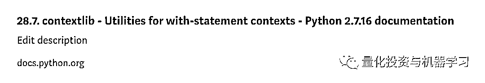
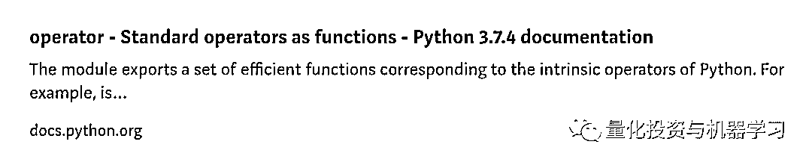
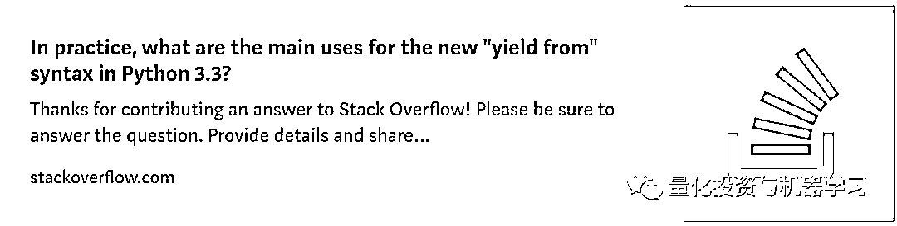
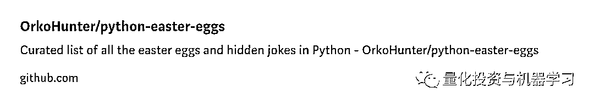
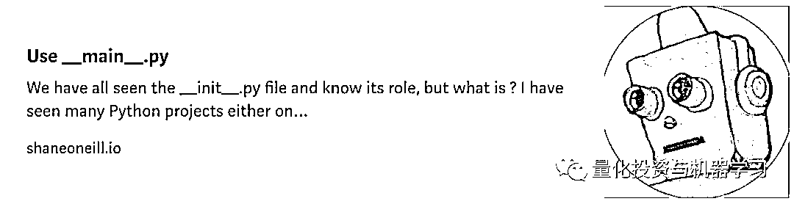
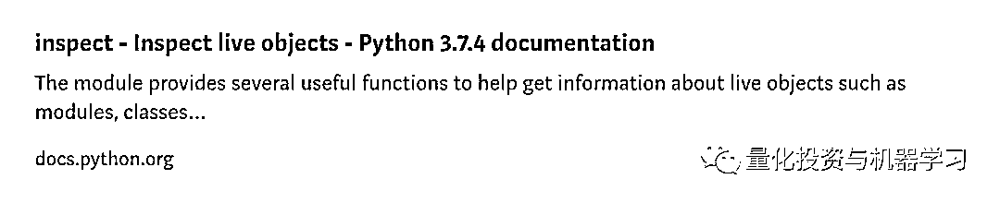

# 收藏级：优雅编写 Python3 的 66 个小贴士！

> 原文：[`mp.weixin.qq.com/s?__biz=MzAxNTc0Mjg0Mg==&mid=2653293630&idx=1&sn=592bef3cb2e805cd24d6f3bce60c771e&chksm=802dce2bb75a473d70e3eeff9037ee50cdfbc53903cdd85f77790dc729902d4c03aa2c87aede&scene=27#wechat_redirect`](http://mp.weixin.qq.com/s?__biz=MzAxNTc0Mjg0Mg==&mid=2653293630&idx=1&sn=592bef3cb2e805cd24d6f3bce60c771e&chksm=802dce2bb75a473d70e3eeff9037ee50cdfbc53903cdd85f77790dc729902d4c03aa2c87aede&scene=27#wechat_redirect)


**标星★公众号     **爱你们♥

作者：Eyal Trabelsi

编译：1+1=6 | 公众号翻译部

**近期原创文章：**

## ♥ [5 种机器学习算法在预测股价的应用（代码+数据）](https://mp.weixin.qq.com/s?__biz=MzAxNTc0Mjg0Mg==&mid=2653290588&idx=1&sn=1d0409ad212ea8627e5d5cedf61953ac&chksm=802dc249b75a4b5fa245433320a4cc9da1a2cceb22df6fb1a28e5b94ff038319ae4e7ec6941f&token=1298662931&lang=zh_CN&scene=21#wechat_redirect)

## ♥ [Two Sigma 用新闻来预测股价走势，带你吊打 Kaggle](https://mp.weixin.qq.com/s?__biz=MzAxNTc0Mjg0Mg==&mid=2653290456&idx=1&sn=b8d2d8febc599742e43ea48e3c249323&chksm=802e3dcdb759b4db9279c689202101b6b154fb118a1c1be12b52e522e1a1d7944858dbd6637e&token=1330520237&lang=zh_CN&scene=21#wechat_redirect)

## ♥ 2 万字干货：[利用深度学习最新前沿预测股价走势](https://mp.weixin.qq.com/s?__biz=MzAxNTc0Mjg0Mg==&mid=2653290080&idx=1&sn=06c50cefe78a7b24c64c4fdb9739c7f3&chksm=802e3c75b759b563c01495d16a638a56ac7305fc324ee4917fd76c648f670b7f7276826bdaa8&token=770078636&lang=zh_CN&scene=21#wechat_redirect)

## ♥ [机器学习在量化金融领域的误用！](http://mp.weixin.qq.com/s?__biz=MzAxNTc0Mjg0Mg==&mid=2653292984&idx=1&sn=3e7efe9fe9452c4a5492d2175b4159ef&chksm=802dcbadb75a42bbdce895c49070c3f552dc8c983afce5eeac5d7c25974b7753e670a0162c89&scene=21#wechat_redirect)

## ♥ [基于 RNN 和 LSTM 的股市预测方法](https://mp.weixin.qq.com/s?__biz=MzAxNTc0Mjg0Mg==&mid=2653290481&idx=1&sn=f7360ea8554cc4f86fcc71315176b093&chksm=802e3de4b759b4f2235a0aeabb6e76b3e101ff09b9a2aa6fa67e6e824fc4274f68f4ae51af95&token=1865137106&lang=zh_CN&scene=21#wechat_redirect)

## ♥ [如何鉴别那些用深度学习预测股价的花哨模型？](https://mp.weixin.qq.com/s?__biz=MzAxNTc0Mjg0Mg==&mid=2653290132&idx=1&sn=cbf1e2a4526e6e9305a6110c17063f46&chksm=802e3c81b759b597d3dd94b8008e150c90087567904a29c0c4b58d7be220a9ece2008956d5db&token=1266110554&lang=zh_CN&scene=21#wechat_redirect)

## ♥ [优化强化学习 Q-learning 算法进行股市](https://mp.weixin.qq.com/s?__biz=MzAxNTc0Mjg0Mg==&mid=2653290286&idx=1&sn=882d39a18018733b93c8c8eac385b515&chksm=802e3d3bb759b42d1fc849f96bf02ae87edf2eab01b0beecd9340112c7fb06b95cb2246d2429&token=1330520237&lang=zh_CN&scene=21#wechat_redirect)

## ♥ [WorldQuant 101 Alpha、国泰君安 191 Alpha](https://mp.weixin.qq.com/s?__biz=MzAxNTc0Mjg0Mg==&mid=2653290927&idx=1&sn=ecca60811da74967f33a00329a1fe66a&chksm=802dc3bab75a4aac2bb4ccff7010063cc08ef51d0bf3d2f71621cdd6adece11f28133a242a15&token=48775331&lang=zh_CN&scene=21#wechat_redirect)

## ♥ [基于回声状态网络预测股票价格（附代码）](https://mp.weixin.qq.com/s?__biz=MzAxNTc0Mjg0Mg==&mid=2653291171&idx=1&sn=485a35e564b45046ff5a07c42bba1743&chksm=802dc0b6b75a49a07e5b91c512c8575104f777b39d0e1d71cf11881502209dc399fd6f641fb1&token=48775331&lang=zh_CN&scene=21#wechat_redirect)

## ♥ [计量经济学应用投资失败的 7 个原因](https://mp.weixin.qq.com/s?__biz=MzAxNTc0Mjg0Mg==&mid=2653292186&idx=1&sn=87501434ae16f29afffec19a6884ee8d&chksm=802dc48fb75a4d99e0172bf484cdbf6aee86e36a95037847fd9f070cbe7144b4617c2d1b0644&token=48775331&lang=zh_CN&scene=21#wechat_redirect)

## ♥ [配对交易千千万，强化学习最 NB！（文档+代码）](http://mp.weixin.qq.com/s?__biz=MzAxNTc0Mjg0Mg==&mid=2653292915&idx=1&sn=13f4ddebcd209b082697a75544852608&chksm=802dcb66b75a4270ceb19fac90eb2a70dc05f5b6daa295a7d31401aaa8697bbb53f5ff7c05af&scene=21#wechat_redirect)

## ♥ [关于高盛在 Github 开源背后的真相！](https://mp.weixin.qq.com/s?__biz=MzAxNTc0Mjg0Mg==&mid=2653291594&idx=1&sn=7703403c5c537061994396e7e49e7ce5&chksm=802dc65fb75a4f49019cec951ac25d30ec7783738e9640ec108be95335597361c427258f5d5f&token=48775331&lang=zh_CN&scene=21#wechat_redirect)

## ♥ [新一代量化带货王诞生！Oh My God！](https://mp.weixin.qq.com/s?__biz=MzAxNTc0Mjg0Mg==&mid=2653291789&idx=1&sn=e31778d1b9372bc7aa6e57b82a69ec6e&chksm=802dc718b75a4e0ea4c022e70ea53f51c48d102ebf7e54993261619c36f24f3f9a5b63437e9e&token=48775331&lang=zh_CN&scene=21#wechat_redirect)

## ♥ [独家！关于定量/交易求职分享（附真实试题）](https://mp.weixin.qq.com/s?__biz=MzAxNTc0Mjg0Mg==&mid=2653291844&idx=1&sn=3fd8b57d32a0ebd43b17fa68ae954471&chksm=802dc751b75a4e4755fcbb0aa228355cebbbb6d34b292aa25b4f3fbd51013fcf7b17b91ddb71&token=48775331&lang=zh_CN&scene=21#wechat_redirect)

## ♥ [Quant 们的身份危机！](https://mp.weixin.qq.com/s?__biz=MzAxNTc0Mjg0Mg==&mid=2653291856&idx=1&sn=729b657ede2cb50c96e92193ab16102d&chksm=802dc745b75a4e53c5018cc1385214233ec4657a3479cd7193c95aaf65642f5f45fa0e465694&token=48775331&lang=zh_CN&scene=21#wechat_redirect)

## ♥ [拿起 Python，防御特朗普的 Twitter](https://mp.weixin.qq.com/s?__biz=MzAxNTc0Mjg0Mg==&mid=2653291977&idx=1&sn=01f146e9a88bf130ca1b479573e6d158&chksm=802dc7dcb75a4ecadfdbdace877ed948f56b72bc160952fd1e4bcde27260f823c999a65a0d6d&token=48775331&lang=zh_CN&scene=21#wechat_redirect)

## ♥ [AQR 最新研究 | 机器能“学习”金融吗？](http://mp.weixin.qq.com/s?__biz=MzAxNTc0Mjg0Mg==&mid=2653292710&idx=1&sn=e5e852de00159a96d5dcc92f349f5b58&chksm=802dcab3b75a43a5492bc98874684081eb5c5666aff32a36a0cdc144d74de0200cc0d997894f&scene=21#wechat_redirect)


**前言**

今天公众号为大家带来一篇有关 Python 技巧的文章，可以帮助你编写优雅的 Python3 代码！

**iterable 技巧**

**▍1、创建一个数字序列（从 0 到 10，间隔为 2）**

```py
>>> range(0,10,2)
[0, 2, 4, 6, 8]
```

**▍2、对一串数字求和（**从 0 到 10，间隔为 2**）**

```py
>>> l = range(0,10,2)
>>> sum(l)
20
```

**▍3、检查序列中的任一元素是否为 True**

```py
>>> any(a % 2 for a in range(0,10,2))
True
```

**▍4、检查序列中的所有元素是否为 True**

```py
>>> all(a % 2 for a in range(0,10,2))
True
```

**▍5、累计求和一串数字序列**

```py
>>> import numpy as np
>>> res = list(np.cumsum(range(0,10,2)))
>>> res
[ 0, 2, 6, 12, 20]
```

****▍**6、给定每个 iterable，通过添加索引来构造一个元组**

```py
>>> a = ['Hello', 'world', '!']
>>> list(enumerate(a))
[(0, 'Hello'), (1, 'world'), (2, '!')]
```

******▍****7、将 iterable 连接到单个字符串**

```py
>>> a = ["python","really", "rocks"]
>>> " ".join(a)
'python really rocks'
```

**▍8、组合两个可迭代的元组或 pivot 嵌套的 iterables**

```py
# Combining two iterables
>>> a = [1, 2, 3]
>>> b = ['a', 'b', 'c']
>>> z = zip(a, b)
>>> z
[(1, 'a'), (2, 'b'), (3, 'c')]

# Pivoting list of tuples
>>> zip(*z)
[(1, 2, 3), ('a', 'b', 'c')]
```

******▍9、从**iterables**中获取最小值/最大值（具有/不具有特定功能）******

```py
# Getting maximum from iterable
>>> a = [1, 2, -3]
>>> max(a)
2

# Getting maximum from iterable
>>> min(a)
1

# Bot min/max has key value to allow to get maximum by appliing function
>>> max(a,key=abs)
3
```

**▍10、可迭代排序（可以通过“compare”函数排序）**

```py
>>> a = [1, 2, -3]
>>> sorted(a)
[-3, 1, 2]

>>> sorted(a,key=abs)
[1, 2, -3]
```

******▍11、将单个字符串拆分为列表******

```py
>>> s = "a,b,c"
>>> s.split(",")
["a", "b", "c"]
```

******▍12、初始化一个包含重复数字的列表******

```py
>> [1]* 10
[1, 1, 1, 1, 1, 1, 1, 1, 1, 1]
```

******▍13、合并/插入两个字典******

```py
>>> a = {"a":1, "b":1}
>>> b = {"b":2, "c":1}
>>> a.update(b)
>>> a
{"a":1, "b":2, "c":1}
```

************▍14、命名和保存********iterables********切片************

```py
# Naming slices (slice(start, end, step))
>>> a = [0, 1, 2, 3, 4, 5]
>>> LASTTHREE = slice(-3, None)
>>> LASTTHREE
slice(-3, None, None)
>>> a[LASTTHREE]
[3, 4, 5]
```

************▍15、在列表中查找项的索引************

```py
>>> a = ["foo", "bar", "baz"]
>>> a.index("bar")
1
```

************▍16、在********************iterables********************************中查找最小/最大项的索引

```py
>>> a = [2, 3, 1]
>>> min(enumerate(a),key=lambda x: x[1])[0]
2
```

************▍17、旋转********************************iterables********************************************的 k 个元素

```py
>>> a = [1, 2, 3, 4]
>>> k = 2
>>> a[-2:] + a[:-2]
[3, 4, 1, 2]
```

************▍18、删除字符串末尾/开始/两端无用的字符************

```py
>>> name = "//George//"
>>> name.strip("/")
'George'
>>> name.rstrip("/")
'//George'
>>> name.lstrip("/")
'George//'
```

************▍19、倒序****iterables****的顺序（字符串、列表等）************

```py
# Reversing string
>>> s = "abc"
>>> s[::-1]
"cba"

# Reversing list
>>> l = ["a", "b", "c"]
>>> l[::-1]
["c", "b", "a"]
```

**branching 技巧**

**▍20、多个 short-cut**

```py
>>> n = 10
>>> 1 < n < 20
True
```

************▍21、For-else 结构在搜索某些东西并找到它时很有用************

```py
for i in mylist:
     if i == theflag:
         break
     process(i)
else:
     raise ValueError("List argument missing terminal flag.")
```

**▍22、Trenary operator**

```py
>>> "Python ROCK" if True else " I AM GRUMPY"
"Python ROCK"
```

************▍23、Try-catch-else 结构************

```py
try:
     foo()
except Exception:
     print("Exception occured")
else:
     print("Exception didnt occur")
finally:
     print("Always gets here") 
```

**▍24、While-else 结构**

```py
i = 5

while i > 1:
     print("Whil-ing away!")
     i -= 1
     if i == 3:
         break
else:
    print("Finished up!")
```

**comprehensions（推导式）技巧**

************▍25、List 推导式************

```py
>>> m = [x ** 2 for x in range(5)]
>>> m
[0, 1, 4, 9, 16]
```

************▍************26、Set 推导式************************

```py
>>> m = {x ** 2 for x in range(5)}
>>> m
{0, 1, 4, 9, 16}
```

************▍************27、Dict 推导式************************

```py
>>> m = {x: x ** 2 for x in range(5)}
>>> m
{0: 0, 1: 1, 2: 4, 3: 9, 4: 16}
```

**▍28、Generator 推导式**

```py
# A generator comprehension is the lazy version of a list comprehension.
>>> m = (x ** 2 for x in range(5))
>>> m
<generator object <genexpr> at 0x108efe408>
>>> list(m)
[0, 1, 4, 9, 16]

>>> m = (x ** 2 for x in range(5))
>>> next(m)
0
>>> list(m)
[1, 4, 9, 16]
```

**▍29、list 推导使用当前值和过往值**

```py
>>> a = [1, 2, 4,2]
>>> [y - x for x,y in zip(a,a[1:])]
[1, 2, -2]
```

**unpacking 技巧**

**▍30、从 iterable 解压缩变量**

```py
# One can unpack all iterables (tuples, list etc)
>>> a, b, c = 1, 2, 3
>>> a, b, c
(1, 2, 3)

>>> a, b, c = [1, 2, 3]
>>> a, b, c
(1, 2, 3)
```

************▍31、交换变量值************

```py
>>> a, b = 1, 2
>>> a, b = b, a
>>> a, b
(2, 1)
```

************▍32、在不指示所有元素的情况下从 iterable 解包变量************

```py
>>> a, *b, c = [1, 2, 3, 4, 5]
>>> a
1
>>> b
[2, 3, 4]
>>> c
5
```

************▍33、使用 splat 运算符解包变量************

```py
>>> def test(x, y, z):
>>>      print(x, y, z)
>>> res = test(*[10, 20, 30])
10 20 30
>>> res = test(**{'x': 1, 'y': 2, 'z': 3} )
10 20 30 
view raw
```

**Itertools 技巧**

************▍34、Flatten iterables************

```py
>>> a = [[1, 2], [3, 4], [5, 6]]
>>> list(itertools.chain.from_iterable(a))
[1, 2, 3, 4, 5, 6]
```

************▍35、从 iterables 创建笛卡尔积************

```py
>>> for p in itertools.product([1, 2, 3], [4, 5]):
>>>      print(''.join(str(x) for x in p))

(1, 4)
(1, 5)
(2, 4)
(2, 5)
(3, 4)
(3, 5)
```

************▍36、从 iterable 创建排列************

```py
>>> for p in itertools.permutations([1, 2, 3, 4]):
>>>      print(''.join(str(x) for x in p))
123
132
213
231
312
321
```

**▍37、从 iterable 创建 ngram**

```py
>>> from itertools import islice
>>> def n_grams(a, n):
...          z = (islice(a, i, None) for i in range(n))
...          return zip(*z)
...
>>> a = [1, 2, 3, 4, 5, 6]
>>> n_grams(a, 3)
[(1, 2, 3), (2, 3, 4), (3, 4, 5), (4, 5, 6)]
>>> n_grams(a, 2)
[(1, 2), (2, 3), (3, 4), (4, 5), (5, 6)]
>>> n_grams(a, 4)
[(1, 2, 3, 4), (2, 3, 4, 5), (3, 4, 5, 6)]
```

**▍38、使用填充组合元组的两个迭代器或使用填充 pivot 嵌套迭代**

```py
>>> import itertools as it
>>> x = [1, 2, 3, 4, 5]
>>> y = ['a', 'b', 'c']
>>> list(zip(x, y))
[(1, 'a'), (2, 'b'), (3, 'c')]

>>> list(it.zip_longest(x, y))
[(1, 'a'), (2, 'b'), (3, 'c'), (4, None), (5, None)]
```

************************▍39、从一个**iterable **n 中创建 k 个组合************************

```py
>>> import itertools
>>> bills = [20, 20, 20, 10, 10, 10, 10, 10, 5, 5, 1, 1, 1, 1, 1]
>>> list(itertools.combinations(bills, 3))
[(20, 20, 20), (20, 20, 10), (20, 20, 10), ... ]
```

************************************▍40、在给定函数情况下创建一个迭代的累积结果************************************

```py
>>> import itertools
>>> list(itertools.accumulate([9, 21, 17, 5, 11, 12, 2, 6], min))
[9, 9, 9, 5, 5, 5, 2, 2]
```

************************************************▍41、创建一个迭代器，只要谓词为 True，就从 iterable 返回元素************************************************

```py
>>> import itertools
>>> itertools.takewhile(lambda x: x < 3, [0, 1, 2, 3, 4])
[0, 1, 2]

>>> it.dropwhile(lambda x: x < 3, [0, 1, 2, 3, 4])
[3, 4]
```

************************************************************▍42、创建一个迭代器，它从 iterable 中过滤元素，只返回谓词为 False 的元素************************************************************

```py
>>> import itertools
# keeping only false values
>>> list(itertools.filterfalse(bool, [None, False, 1, 0, 10]))
[None, False, 0]
```

************************************************************************▍43、创建一个迭代器，****使用从迭代的迭代中获得的参数来计算函数****************************************************************************

```py
>>> import itertools
>>> import operator
>>> a = [(2, 6), (8, 4), (7, 3)]
>>> list(itertools.starmap(operator.mul, a))
[12, 32, 21]
```

**collections 技巧**

************************************************************************************▍44、设置基本操作************************************************************************************

```py
>>> A = {1, 2, 3, 3}
>>> A
set([1, 2, 3])
>>> B = {3, 4, 5, 6, 7}
>>> B
set([3, 4, 5, 6, 7])
>>> A | B
set([1, 2, 3, 4, 5, 6, 7])
>>> A & B
set([3])
>>> A - B
set([1, 2])
>>> B - A
set([4, 5, 6, 7])
>>> A ^ B
set([1, 2, 4, 5, 6, 7])
>>> (A ^ B) == ((A - B) | (B - A))
True
```

************************************************************************************************▍45、计数器数据结构（无序集合，其中元素存储为字典键，其计数存储为字典值）************************************************************************************************

```py
import collections

>>> A = collections.Counter([1, 1, 2, 2, 3, 3, 3, 3, 4, 5, 6, 7])
>>> A
Counter({3: 4, 1: 2, 2: 2, 4: 1, 5: 1, 6: 1, 7: 1})
>>> A.most_common(1)
[(3, 4)]
>>> A.most_common(3)
[(3, 4), (1, 2), (2, 2)]
```

************************************************************************************************************▍46、默认字典结构（字典的子类，在访问不存在的键时检索默认值）************************************************************************************************************

```py
>>> import collections
>>> m = collections.defaultdict(int)
>>> m['a']
0

>>> m = collections.defaultdict(str)
>>> m['a']
''
>>> m['b'] += 'a'
>>> m['b']
'a'

>>> m = collections.defaultdict(lambda: '[default value]')
>>> m['a']
'[default value]'
>>> m['b']
'[default value]'

>>> m = collections.defaultdict(list)
>>> m['a']
[]
```

****▍47、有序的 dict 结构（保持有序字典的子类）****

```py
>>> from collections import OrderedDict

>>> d = OrderedDict.fromkeys('abcde')
>>> d.move_to_end('b')
>>> ''.join(d.keys())
'acdeb'

>>> d.move_to_end('b', last=False)
>>> ''.join(d.keys())
'bacde'
```

******▍48、Deques 结构（Deques 是堆栈和队列的概括）******

```py
>>> import collection
>>> Q = collections.deque()
>>> Q.append(1)
>>> Q.appendleft(2)
>>> Q.extend([3, 4])
>>> Q.extendleft([5, 6])
>>> Q
deque([6, 5, 2, 1, 3, 4])
>>> Q.pop()
4
>>> Q.popleft()
6
>>> Q
deque([5, 2, 1, 3])
>>> Q.rotate(3)
>>> Q
deque([2, 1, 3, 5])
>>> Q.rotate(-3)
>>> Q
deque([5, 2, 1, 3])

>>> last_three = collections.deque(maxlen=3)
>>> for i in range(4):
...         last_three.append(i)
...         print ', '.join(str(x) for x in last_three)
...
0
0, 1
0, 1, 2
1, 2, 3
2, 3, 4
```

********▍49、命名元组结构（创建类元组的对象，这些对象的字段可通过属性查找访问，也可索引和迭代）********

```py
>>> import collections
>>> Point = collections.namedtuple('Point', ['x', 'y'])
>>> p = Point(x=1.0, y=2.0)
>>> p
Point(x=1.0, y=2.0)
>>> p.x
1.0
>>> p.y
2.0
```

**▍50、使用字典来存储 Switch**

```py
>>> func_dict = {'sum': lambda x, y: x + y, 'subtract': lambda x, y: x - y}
>>> func_dict'sum'
12
>>> func_dict'subtract'
6
```

****▍51、数据类结构****

```py
>>> from dataclasses import dataclass

>>> @dataclass
>>> class DataClassCard:
>>>      rank: str
>>>      suit: str

>>> queen_of_hearts = DataClassCard('Q', 'Hearts')
>>> queen_of_hearts.rank
'Q'
>>> queen_of_hearts
DataClassCard(rank='Q', suit='Hearts')
>>> queen_of_hearts == DataClassCard('Q', 'Hearts')
True
```

**其他技巧**

******▍52、生成 uuid******

```py
# This creates a randomized
#128-bit number that will almost certainly be unique.
# In fact, there are over 2¹²² possible
#UUIDs that can be generated.
#That’s over five undecillion (or 5,000,000,000,000,000,000,000,000,000,000,000,000).

>>> import uuid
>>> user_id = uuid.uuid4()
>>> user_id
UUID('7c2faedd-805a-478e-bd6a-7b26210425c7')
```

********▍******53、使用 LRU 缓存进行记忆**************

```py
import functools

@functools.lru_cache(maxsize=128)
def fibonacci(n):
     if n == 0:
         return 0
     elif n == 1:
         return 1
     return fibonacci(n - 1) + fibonacci(n - 2)
```

**▍54、Suppression of expressions**

```py
>>> from contextlib import suppress
>>> with contextlib.suppress(ZeroDivisionError):
>>>  10/0
# No exception raised
```

****▍55、**在需要设置和拆卸时创建上下文管理**



*地址：*

*https://docs.python.org/2/library/contextlib.html?source=post_page---------------------------*

**▍56、一种处理文件路径的优雅方法（3.4≥）**

```py
>>> from pathlib import Path
>>> data_folder = Path("source_data/text_files/)

# Path calculation and metadata
>>> file_to_open = data_folder / "raw_data.txt"
>>> file_to_open.name
"raw_data.txt"
>>> file_to_open.suffix
"txt"
>>>file_to_open.stem
"raw_data"

# Files functions
>>> f = open(file_to_open)
>>> f.read()
# content of the file
>>> file_to_open.exists()
True
```

**▍57、将标准操作符实现为类的函数**



*地址：*

*https://docs.python.org/3/library/operator.html?source=post_page---------------------------*

****▍58、创建装饰器来分离 concerns****

```py
>>>from functools import wraps

>>>def add_sandwich(wrapped):
>>>      @wraps(wrapped)
>>>      def wrapper(*args, **kwargs):
>>>            return wrapped(*args, **kwargs) + ' sandwich'
>>>      return wrapper

>>>@add_sandwich
>>>def ham():
>>>     return 'ham'

>>>ham()
'ham sandwich'
```

******▍59、使用 yield 创建一个简单的迭代器******

```py
>>> def foo(lst):
>>>      for x in lst:
>>>          yield x
>>>          yield x*2

>>> a = [1, 3]
>>> list(foo(a))
[1, 2, 3, 6]
```

******▍60、yield from use cases and tricks******



*地址：*

*https://stackoverflow.com/questions/9708902/in-practice-what-are-the-main-uses-for-the-new-yield-from-syntax-in-python-3?source=post_page---------------------------*

**彩蛋**

************▍61、Anti-gravity************

```py
import antigravity

antigravity.fly()
```

************************▍62、The Zen of Python************************

```py
>>> import this
The Zen of Python, by Tim Peters
Beautiful is better than ugly.
Explicit is better than implicit.
Simple is better than complex.
Complex is better than complicated.
Flat is better than nested.
Sparse is better than dense.
Readability counts.
Special cases aren not special enough to break the rules.
Although practicality beats purity.
Errors should never pass silently.
Unless explicitly silenced.
In the face of ambiguity, refuse the temptation to guess.
There should be one and preferably only one obvious way to do it.
Although that way may not be obvious at first unless you are Dutch.
Now is better than never.
Although never is often better than *right* now.
If the implementation is hard to explain, it is a bad idea.
If the implementation is easy to explain, it may be a good idea.
Namespaces are one honking great idea let us do more of those!
```

************************************▍63、另一种很酷彩蛋************************************



*地址：* 

*https://github.com/OrkoHunter/python-easter-eggs?source=post_page--------------------------*

**理解 context 的技巧**

************************************************************************▍64、使用 _main_ .py 文件显式标记入口点************************************************************************



*地址：*

*https://shaneoneill.io/2019/06/12/use-__main__-py/?source=post_page---------------------------*

****************************************************************************▍65、对象属性列表****************************************************************************

```py
>>> dir()
['__annotations__', '__builtins__', '__doc__', '__loader__', '__name__', '__package__', '__spec__']
>>> dir("Hello World")
['__add__', '__class__', '__contains__', '__delattr__', '__dir__', '__doc__', '__eq__', '__format__', '__ge__', '__getattribute__', '__getitem__', '__getnewargs__', '__gt__', '__hash__', '__init__', '__init_subclass__', '__iter__', '__le__', '__len__', '__lt__', '__mod__', '__mul__', '__ne__', '__new__', '__reduce__', '__reduce_ex__', '__repr__', '__rmod__', '__rmul__', '__setattr__', '__sizeof__', '__str__', '__subclasshook__', 'capitalize', 'casefold', 'center', 'count', 'encode', 'endswith', 'expandtabs', 'find', 'format', 'format_map', 'index', 'isalnum', 'isalpha', 'isascii', 'isdecimal', 'isdigit', 'isidentifier', 'islower', 'isnumeric', 'isprintable', 'isspace', 'istitle', 'isupper', 'join', 'ljust', 'lower', 'lstrip', 'maketrans', 'partition', 'replace', 'rfind', 'rindex', 'rjust', 'rpartition', 'rsplit', 'rstrip', 'split', 'splitlines', 'startswith', 'strip', 'swapcase', 'title', 'translate', 'upper', 'zfill']
```

********************************************************************************▍66、关于活动对象的附加信息********************************************************************************



*地址：* 

*https://docs.python.org/3/library/inspect.html?source=post_page---------------------------*

希望以上 66 个小贴士对你在今天的学习和工作中有所帮助哦！


*—End—*

量化投资与机器学习微信公众号，是业内垂直于**Quant**、**MFE**、**CST、AI**等专业的**主****流量化自媒体**。公众号拥有来自**公募、私募、券商、银行、海外**等众多圈内**10W+**关注者。每日发布行业前沿研究成果和最新量化资讯。

