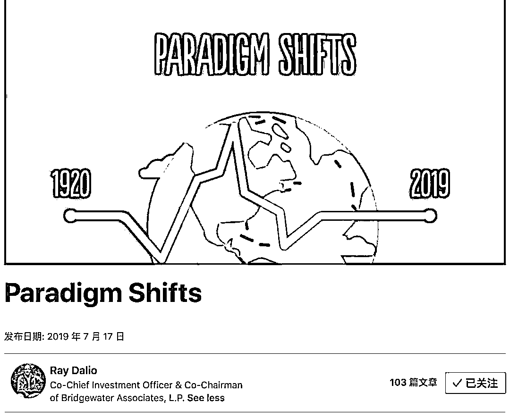
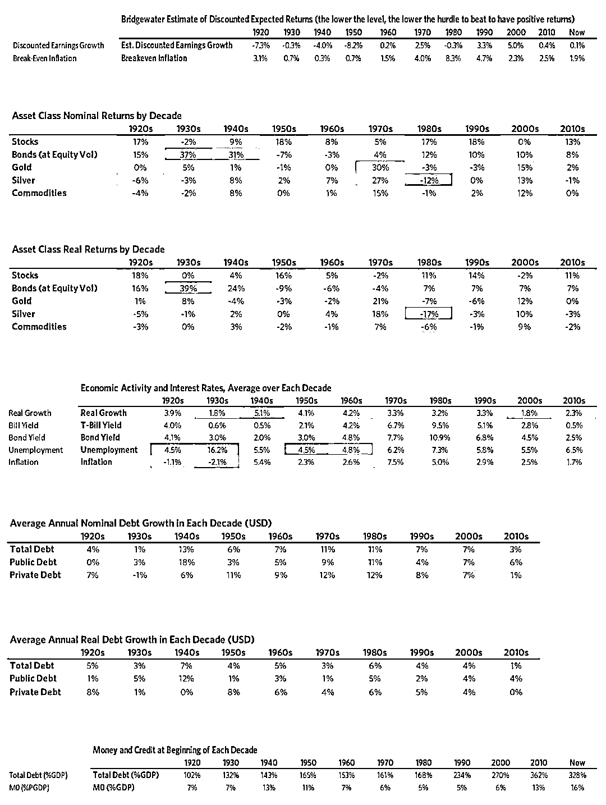
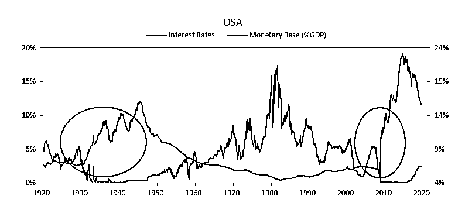
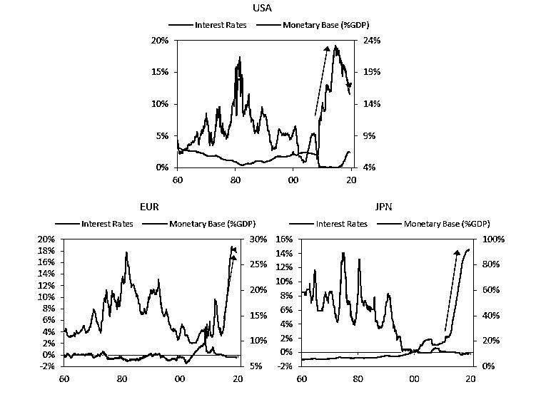
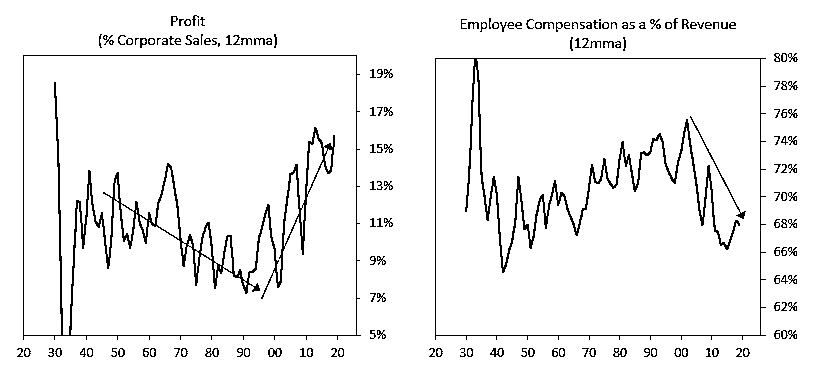
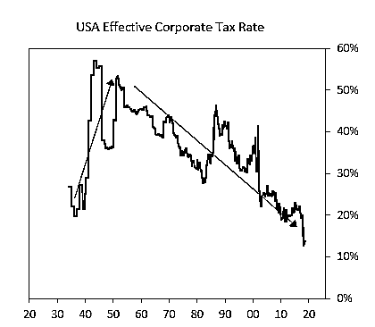
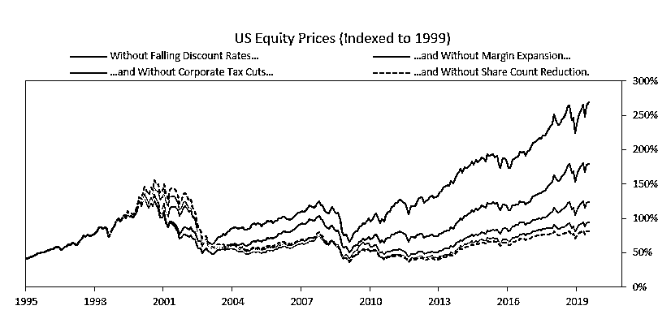
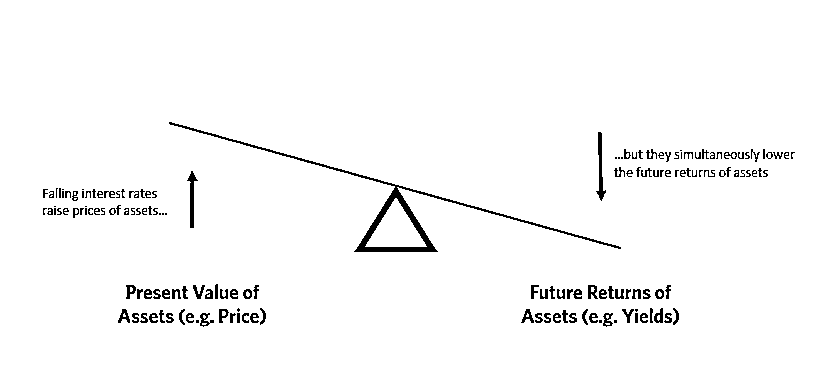
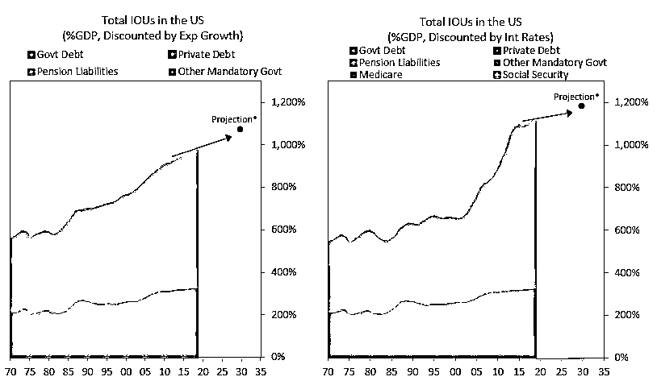

# 达里奥最新：投资组合直指黄金！

> 原文：[`mp.weixin.qq.com/s?__biz=MzAxNTc0Mjg0Mg==&mid=2653293615&idx=1&sn=9a82cdb53404af2ab6cd1c56b2da0874&chksm=802dce3ab75a472cf58b2edf5c5e1e84311dfea1c2c1824410db889824fc334d631e18235308&scene=27#wechat_redirect`](http://mp.weixin.qq.com/s?__biz=MzAxNTc0Mjg0Mg==&mid=2653293615&idx=1&sn=9a82cdb53404af2ab6cd1c56b2da0874&chksm=802dce3ab75a472cf58b2edf5c5e1e84311dfea1c2c1824410db889824fc334d631e18235308&scene=27#wechat_redirect)

**标星★公众号     **爱你们♥

**近期原创文章：**

## ♥ [5 种机器学习算法在预测股价的应用（代码+数据）](https://mp.weixin.qq.com/s?__biz=MzAxNTc0Mjg0Mg==&mid=2653290588&idx=1&sn=1d0409ad212ea8627e5d5cedf61953ac&chksm=802dc249b75a4b5fa245433320a4cc9da1a2cceb22df6fb1a28e5b94ff038319ae4e7ec6941f&token=1298662931&lang=zh_CN&scene=21#wechat_redirect)

## ♥ [Two Sigma 用新闻来预测股价走势，带你吊打 Kaggle](https://mp.weixin.qq.com/s?__biz=MzAxNTc0Mjg0Mg==&mid=2653290456&idx=1&sn=b8d2d8febc599742e43ea48e3c249323&chksm=802e3dcdb759b4db9279c689202101b6b154fb118a1c1be12b52e522e1a1d7944858dbd6637e&token=1330520237&lang=zh_CN&scene=21#wechat_redirect)

## ♥ 2 万字干货：[利用深度学习最新前沿预测股价走势](https://mp.weixin.qq.com/s?__biz=MzAxNTc0Mjg0Mg==&mid=2653290080&idx=1&sn=06c50cefe78a7b24c64c4fdb9739c7f3&chksm=802e3c75b759b563c01495d16a638a56ac7305fc324ee4917fd76c648f670b7f7276826bdaa8&token=770078636&lang=zh_CN&scene=21#wechat_redirect)

## ♥ [机器学习在量化金融领域的误用！](http://mp.weixin.qq.com/s?__biz=MzAxNTc0Mjg0Mg==&mid=2653292984&idx=1&sn=3e7efe9fe9452c4a5492d2175b4159ef&chksm=802dcbadb75a42bbdce895c49070c3f552dc8c983afce5eeac5d7c25974b7753e670a0162c89&scene=21#wechat_redirect)

## ♥ [基于 RNN 和 LSTM 的股市预测方法](https://mp.weixin.qq.com/s?__biz=MzAxNTc0Mjg0Mg==&mid=2653290481&idx=1&sn=f7360ea8554cc4f86fcc71315176b093&chksm=802e3de4b759b4f2235a0aeabb6e76b3e101ff09b9a2aa6fa67e6e824fc4274f68f4ae51af95&token=1865137106&lang=zh_CN&scene=21#wechat_redirect)

## ♥ [如何鉴别那些用深度学习预测股价的花哨模型？](https://mp.weixin.qq.com/s?__biz=MzAxNTc0Mjg0Mg==&mid=2653290132&idx=1&sn=cbf1e2a4526e6e9305a6110c17063f46&chksm=802e3c81b759b597d3dd94b8008e150c90087567904a29c0c4b58d7be220a9ece2008956d5db&token=1266110554&lang=zh_CN&scene=21#wechat_redirect)

## ♥ [优化强化学习 Q-learning 算法进行股市](https://mp.weixin.qq.com/s?__biz=MzAxNTc0Mjg0Mg==&mid=2653290286&idx=1&sn=882d39a18018733b93c8c8eac385b515&chksm=802e3d3bb759b42d1fc849f96bf02ae87edf2eab01b0beecd9340112c7fb06b95cb2246d2429&token=1330520237&lang=zh_CN&scene=21#wechat_redirect)

## ♥ [WorldQuant 101 Alpha、国泰君安 191 Alpha](https://mp.weixin.qq.com/s?__biz=MzAxNTc0Mjg0Mg==&mid=2653290927&idx=1&sn=ecca60811da74967f33a00329a1fe66a&chksm=802dc3bab75a4aac2bb4ccff7010063cc08ef51d0bf3d2f71621cdd6adece11f28133a242a15&token=48775331&lang=zh_CN&scene=21#wechat_redirect)

## ♥ [基于回声状态网络预测股票价格（附代码）](https://mp.weixin.qq.com/s?__biz=MzAxNTc0Mjg0Mg==&mid=2653291171&idx=1&sn=485a35e564b45046ff5a07c42bba1743&chksm=802dc0b6b75a49a07e5b91c512c8575104f777b39d0e1d71cf11881502209dc399fd6f641fb1&token=48775331&lang=zh_CN&scene=21#wechat_redirect)

## ♥ [计量经济学应用投资失败的 7 个原因](https://mp.weixin.qq.com/s?__biz=MzAxNTc0Mjg0Mg==&mid=2653292186&idx=1&sn=87501434ae16f29afffec19a6884ee8d&chksm=802dc48fb75a4d99e0172bf484cdbf6aee86e36a95037847fd9f070cbe7144b4617c2d1b0644&token=48775331&lang=zh_CN&scene=21#wechat_redirect)

## ♥ [配对交易千千万，强化学习最 NB！（文档+代码）](http://mp.weixin.qq.com/s?__biz=MzAxNTc0Mjg0Mg==&mid=2653292915&idx=1&sn=13f4ddebcd209b082697a75544852608&chksm=802dcb66b75a4270ceb19fac90eb2a70dc05f5b6daa295a7d31401aaa8697bbb53f5ff7c05af&scene=21#wechat_redirect)

## ♥ [关于高盛在 Github 开源背后的真相！](https://mp.weixin.qq.com/s?__biz=MzAxNTc0Mjg0Mg==&mid=2653291594&idx=1&sn=7703403c5c537061994396e7e49e7ce5&chksm=802dc65fb75a4f49019cec951ac25d30ec7783738e9640ec108be95335597361c427258f5d5f&token=48775331&lang=zh_CN&scene=21#wechat_redirect)

## ♥ [新一代量化带货王诞生！Oh My God！](https://mp.weixin.qq.com/s?__biz=MzAxNTc0Mjg0Mg==&mid=2653291789&idx=1&sn=e31778d1b9372bc7aa6e57b82a69ec6e&chksm=802dc718b75a4e0ea4c022e70ea53f51c48d102ebf7e54993261619c36f24f3f9a5b63437e9e&token=48775331&lang=zh_CN&scene=21#wechat_redirect)

## ♥ [独家！关于定量/交易求职分享（附真实试题）](https://mp.weixin.qq.com/s?__biz=MzAxNTc0Mjg0Mg==&mid=2653291844&idx=1&sn=3fd8b57d32a0ebd43b17fa68ae954471&chksm=802dc751b75a4e4755fcbb0aa228355cebbbb6d34b292aa25b4f3fbd51013fcf7b17b91ddb71&token=48775331&lang=zh_CN&scene=21#wechat_redirect)

## ♥ [Quant 们的身份危机！](https://mp.weixin.qq.com/s?__biz=MzAxNTc0Mjg0Mg==&mid=2653291856&idx=1&sn=729b657ede2cb50c96e92193ab16102d&chksm=802dc745b75a4e53c5018cc1385214233ec4657a3479cd7193c95aaf65642f5f45fa0e465694&token=48775331&lang=zh_CN&scene=21#wechat_redirect)

## ♥ [拿起 Python，防御特朗普的 Twitter](https://mp.weixin.qq.com/s?__biz=MzAxNTc0Mjg0Mg==&mid=2653291977&idx=1&sn=01f146e9a88bf130ca1b479573e6d158&chksm=802dc7dcb75a4ecadfdbdace877ed948f56b72bc160952fd1e4bcde27260f823c999a65a0d6d&token=48775331&lang=zh_CN&scene=21#wechat_redirect)

## ♥ [AQR 最新研究 | 机器能“学习”金融吗？](http://mp.weixin.qq.com/s?__biz=MzAxNTc0Mjg0Mg==&mid=2653292710&idx=1&sn=e5e852de00159a96d5dcc92f349f5b58&chksm=802dcab3b75a43a5492bc98874684081eb5c5666aff32a36a0cdc144d74de0200cc0d997894f&scene=21#wechat_redirect)

** 前言**

7 月 17 日，达里奥在领英发表的一篇文章，很精彩！

为了保证大佬的原汁原味，我们这次就不翻译了，只做最精要的解读，大佬告诉我们：

最好的“风险投资”将继续是股票和类似股票的投资，如杠杆私募股权、杠杆房地产和风险资本，尤其是在央行通货再膨胀的时候。

但这些不太可能是真正的回报投资，那些最有可能做得好的将是那些**在货币价值贬值以及在遇到国内和国际冲突很重要时表现良好的投资，例如黄金**。大多数投资者对这类资产的权重偏低，这意味着，如果他们只是想拥有一个更好的平衡投资组合来降低风险，他们就会拥有更多这类资产。

基于这个原因，达里奥认为：**考虑在投资组合中增加黄金既能降低风险，又能提高回报率。**

达里奥还认为：**每一个十年都有其独特的特征！**

在每一个十年结束时，大多数投资者都预计下一个十年将与前一个十年相似，但由于之前描述的过度导致过度和波动的过程，接下来的几十年与前一个十年相比，情况更加相反。

每一个主要的资产类别都有巨大而可怕的几十年，以至于任何把大部分财富集中在任何一项投资上的投资者都会在某个时候失去几乎所有财富。

出于类似的原因，这就是为什么达里奥要建立了一个平衡的全天候投资组合，尽管市场波动较大，但它旨在保持其相对稳定。通过良好的多元化和建立一个 Pure Alpha 投资组合来随时应对市场的风云变幻！

**并且在后续的文章中，大佬将会为大家解释为什么黄金是一种有效的投资组合多元化工具。**

**点击阅读原文查看领英**

**正文**

One of my investment principles is:

**Identify the paradigm you’re in, examine if and how it is unsustainable, and visualize how the paradigm shift will transpire when that which is unsustainable stops.**

Over my roughly 50 years of being a global macro investor, I have observed there to be relatively long of periods (about 10 years) in which the markets and market relationships operate in a certain way (which I call “paradigms”) that most people adapt to and eventually extrapolate so they become overdone, which leads to shifts to new paradigms in which the markets operate more opposite than similar to how they operated during the prior paradigm. Identifying and tactically navigating these paradigm shifts well (which we try to do via our Pure Alpha moves) and/or structuring one’s portfolio so that one is largely immune to them (which we try to do via our All Weather portfolios) is critical to one’s success as an investor. 

**How Paradigm Shifts Occur**

**There are always big unsustainable forces that drive the paradigm. They go on long enough for people to believe that they will never end even though they obviously must end. A classic one of those is an unsustainable rate of debt growth that supports the buying of investment assets; it drives asset prices up, which leads people to believe that borrowing and buying those investment assets is a good thing to do. But it can’t go on forever because the entities borrowing and buying those assets will run out of borrowing capacity while the debt service costs rise relative to their incomes by amounts that squeeze their cash flows. When these things happen, there is a paradigm shift. Debtors get squeezed and credit problems emerge, so there is a retrenchment of lending and spending on goods, services, and investment assets so they go down in a self-reinforcing dynamic that looks more opposite than similar to the prior paradigm. This continues until it’s also overdone, which reverses in a certain way that I won’t digress into but is explained in my book Principles for Navigating Big Debt Crises, which you can get for free here*（https://www.bridgewater.com/big-debt-crises/）*.** 

**Another classic example that comes to mind is that extended periods of low volatility tend to lead to high volatility because people adapt to that low volatility, which leads them to do things (like borrow more money than they would borrow if volatility was greater) that expose them to more volatility, which prompts a self-reinforcing pickup in volatility. There are many classic examples like this that repeat over time that I won’t get into now. Still, I want to emphasize that understanding which types of paradigms exist and how they might shift is required to consistently invest well. That is because any single approach to investing—e.g., investing in any asset class, investing via any investment style (such as value, growth, distressed), investing in anything—will experience a time when it performs so terribly that it can ruin you. That includes investing in “cash” (i.e., short-term debt) of the sovereign that can’t default, which most everyone thinks is riskless but is not because the cash returns provided to the owner are denominated in currencies that the central bank can “print” so they can be depreciated in value when enough money is printed to hold interest rates significantly below inflation rates.  **

**In paradigm shifts, most people get caught overextended doing something overly popular and get really hurt. On the other hand, if you’re astute enough to understand these shifts, you can navigate them well or at least protect yourself against them. The 2008-09 financial crisis, which was the last major paradigm shift, was one such period. It happened because debt growth rates were unsustainable in the same way they were when the 1929-32 paradigm shift happened. Because we studied such periods, we saw that we were headed for another “one of those” because what was happening was unsustainable, so we navigated the crisis well when most investors struggled.**

**I think now is a good time 1) to look at past paradigms and paradigm shifts and 2) to focus on the paradigm that we are in and how it might shift because we are late in the current one and likely approaching a shift. To do that, I wrote this report with two parts: 1) “Paradigms and Paradigm Shifts over the Last 100 Years” and 2) “The Coming Paradigm Shift.” They are attached. If you have the time to read them both, I suggest that you start with “Paradigms and Paradigm Shifts over the Last 100 Years” because it will give you a good understanding of them and it will give you the evolving story that got us to where we are, which will help put where we are into context. There is also an appendix with longer descriptions of each of the decades from the 1920s to the present for those who want to explore them in more depth.**

****Part I: Paradigms and Paradigm Shifts over the Last 100 Years****

****History has taught us that there are always paradigms and paradigm shifts and that understanding and positioning oneself for them is essential for one’s well-being as an investor and beyond. The purpose of this piece is to show you market and economic paradigms and their shifts over the past 100 years to convey how they work. In the accompanying piece, “The Coming Paradigm Shift,” I explain my thinking about the one that might be ahead. ****

****Due to limitations in time and space, I will only focus on those in the United States because they will suffice for giving you the perspective I’d like to convey. However, at some point I will show you them in all significant countries in the same way I did for big debt crises in Principles for Navigating Big Debt Crises because I believe that understanding them all is essential for having a timeless and universal understanding of how markets and economies work. ****

******How Paradigms and Paradigm Shifts Work******

****As you know, market pricing reflects expectations of the future; as such, it paints quite detailed pictures of what the consensus expectation of the future is. Then, the markets move as a function of how events transpire relative to those expectations. As a result, navigating markets well requires one to be more accurate about what is going to happen than the consensus view that is built into the price. That’s the game. That’s why understanding these paradigms and paradigm shifts is so important. ****

******I have found that the consensus view is typically more heavily influenced by what has happened relatively recently (i.e., over the past few years) than it is by what is most likely. It tends to assume that the paradigms that have existed will persist and it fails to anticipate the paradigm shifts, which is why we have such big market and economic shifts. These shifts, more often than not, lead to markets and economies behaving more opposite than similar to how they behaved in the prior paradigm. ******

****What follows is my description of the paradigms and paradigm shifts in the US over the last 100 years. It includes a mix of facts and subjective interpretations, because when faced with the choice of sharing these subjective thoughts or leaving them out, I felt it was better to include them along with this warning label. Naturally, my degree of closeness to these experiences affects the quality of my descriptions. Since my direct experiences began in the early 1960s, my observations of the years since then are most vivid. While less vivid, my understanding of markets and economies going back to the 1920s is still pretty good both because of my intense studying of it and because of my talking with the people of my parents’ generation who experienced it. As for times before the 1920s, my understanding comes purely from studying just the big market and economic moves, so it’s less good though not nonexistent. Over the last year, I have been studying economic and market moves in major countries going back to about the year 1500, which has given me a superficial understanding of them. With that perspective, I can say with confidence that throughout the times I have studied the same big things happen over and over again for essentially the same reasons. I’m not saying they’re exactly the same or that important changes haven’t occurred, because they certainly have (e.g., how central banks have come and gone and changed). What I am saying is that big paradigm shifts have always happened and they happened for roughly the same reasons.****

****To show them, I have divided history into decades, beginning with the 1920s, because they align well enough with paradigm shifts in order for me to convey the picture. Though not always perfectly aligned, paradigm shifts have coincidently tended to happen around decade shifts—e.g., the 1920s were “roaring,” the 1930s were in “depression,” the 1970s were inflationary, the 1980s were disinflationary, etc. Also, I believe that looking at 10-year time horizons helps one put things in perspective. It’s also a nice coincidence that we are in the last months of this decade, so it’s an interesting exercise to start imagining what the new ‘20s decade will be like, which is my objective, rather than to focus in on what exactly will happen in any one quarter or year. ****

****Before briefly describing each of these decades, I want to convey a few observations you should look out for when we discuss each of them.****

*   ******Every decade had its own distinctive characteristics**, though within all decades there were long-lasting periods (e.g., 1 to 3 years) that had almost the exact opposite characteristics of what typified the decade. To successfully deal with these changes, one would have had to successfully time the ins and outs, or faded the moves (i.e., bought more when prices fell and sold more when prices rose), or had a balanced portfolio that would have held relatively steady through the moves. The worst thing would have been to go with the moves (sell after price declines and buy after price increases). ****

*   ******The big economic and market movements undulated in big swings that were due to a sequence of actions and reactions by policy makers, investors, business owners, and workers.** In the process of economic conditions and market valuations growing overdone, the seeds of the reversals germinated. For example, the same debt that financed excesses in economic activity and market prices created the obligations that could not be met, which contributed to the declines. Similarly, the more extreme economic conditions became, the more forceful policy makers’ responses to reverse them became. For these reasons, throughout these 10 decades we see big economic and market swings around “equilibrium” levels. The equilibriums I’m referring to are the three that I provided in my template, which are: ****

****1) Debt growth that is in line with the income growth that is required to service debt;****

****2) The economy’s operating rate is neither too high (because that will produce unacceptable inflation and inefficiencies) nor too low (because economically depressed levels of activity will produce unacceptable pain and political changes); and****

****3) The projected returns of cash are below the projected returns of bonds, which are below the projected returns of equities and the projected returns of other “risky assets” (because the failure of these spreads to exist will impede the effective growth of credit and other forms of capital, which will cause the economy to slow down or go in reverse, while wide spreads will cause it to accelerate).****

*   ****At the end of each decade, most investors expected the next decade to be similar to the prior decade, but because of the previously described process of excesses leading to excesses and undulations, the subsequent decades were more opposite than similar to the ones that preceded them. As a result, market movements due to these paradigm shifts typically were very large and unexpected and caused great shifts in wealth. ****

*   ****Every major asset class had great and terrible decades, so much so that any investor who had most of their wealth concentrated in any one investment would have lost almost all of it at one time or another.****

*   ****Theories about how to invest changed frequently, usually to explain how the past few years made sense even when it didn’t make sense. These backward-looking theories typically were strongest at the end of the paradigm period and proved to be terrible guides for investing in the next decade, so they were very damaging. That is why it is so important to see the full range of past paradigms and paradigm shifts and to structure one’s investment approach so that it would have worked well through them all. The worst thing one can do, especially late in a paradigm, is to build one’s portfolio based on what would have worked well over the prior 10 years, yet that’s typical.****

****It is for these reasons that we invest the way we do—i.e., it’s why we built a balanced All Weather portfolio designed to hold relatively stable though the big undulations by being well-diversified and built a Pure Alpha portfolio to make tactical timing moves.****

****Below, I have summarized the picture of the dynamics for each decade with a very brief description and with a few tables that show asset class returns, interest rates, and economic activity for each decade over the last nine. Through these tables, you can get a feel of the dynamics for each decade, which I then address in more detail and show the market movements in the appendix to this report.****

****1920s = “Roaring”: From Boom to Bursting Bubble. It started with a recession and the markets discounting negative growth as stock yields were significantly above bond yields, yet there was fast positive growth funded by an acceleration in debt during the decade, so stocks did extremely well. By the end of the decade, the markets discounted fast growth and ended with a classic bubble (i.e., with debt-financed purchases of stocks and other assets at high prices) that burst in 1929, the last year of the decade.****

****1930s = Depression. This decade was for the most part the opposite of the 1920s. It started with the bursting reactions to high levels of indebtedness and the markets discounting relatively high growth rates. This debt crisis and plunge in economic activity led to economic depression, which led to aggressive easing by the Fed that consisted of breaking the link to gold, interest rates hitting 0%, the printing of a lot of money, and the devaluing of the dollar, which was accompanied by rises in gold prices, stock prices, and commodity prices from 1932 to 1937. Because the monetary policy caused asset prices to rise and because compensation didn’t keep up, the wealth gap widened, a conflict between socialists and capitalists emerged, and there was the rise of populism and nationalism globally. In 1937, the Fed and fiscal policies were tightened a bit and the stock market and economy plunged. Simultaneously, the geopolitical conflicts between the emerging Axis countries of Germany, Italy, and Japan and the established Allied countries of the UK, France, and China intensified, which eventually led to all-out war in Europe in 1939 and the US beginning a war in Asia in 1941. For the decade as a whole, stocks performed badly, and a debt crisis occurred early, which was largely handled via defaults, guarantees, and monetization of debts along with a lot of fiscal stimulation. For a detailed account of this period, see pages 49-95 in Part Two of Principles for Navigating Big Debt Crises. ****

****1940s = War and Post-War. The economy and markets were classically war-driven. Governments around the world both borrowed heavily and printed significant amounts of money, stimulating both private-sector employment in support of the war effort and military employment. While production was strong, much of what was produced was used and destroyed in the war, so classic measures of growth and unemployment are misleading. Still, this war-effort production pulled the US out of the post-Great Depression slump. Monetary policy was kept very easy to accommodate the borrowing and the paying back of debts in the post-war period. Specifically, monetary policy remained stimulative, with interest rates held down and fiscal policy liberally producing large budget deficits during the war and then after the war to promote reconstruction abroad (the Marshall Plan). As a result, stocks, bonds, and commodities all rallied over the period, with commodities rallying the most early in the war, and stocks rallying the most later in the war (when an Allied victory looked to be more likely) and then at the conclusion of the war. The pictures of what happened in other countries, especially those that lost the war, were radically different and are worthy of description at another time. After the war, the United States was the preeminent power and the dollar was the world’s reserve currency linked to gold, with other currencies linked to the dollar. This period is an excellent period for exemplifying 1) the power and mechanics of central banks to hold interest rates down with large fiscal deficits and 2) market action during war periods. ****

****1950s = Post-War Recovery. In the 1950s, after two decades of depression and war, most individuals were financially conservative, favoring security over risk-taking. The markets reflected this by de facto pricing in negative levels of earnings growth with very high risk premia (e.g., S&P 500 dividend yields in 1950 were 6.8%, more than 3 times the 10-year bond yield of 1.9%, and earning yields were nearly 14%). What happened in the ‘50s was exactly the opposite of what was discounted. The post-war recovery was strong (averaging 4% real growth over the decade), in part through continued stimulative policy/low rates. As a result, stocks did great. Since the government wasn’t running large deficits, government debt burdens (government debt as a percent of incomes) fell, while private debt levels were in line with income growth, so debt growth was in line with income growth. The decade ended in a financially healthy position, with prices discounting relatively modest growth and low inflation. The 1950s and the 1960s were also a period in which middle-class workers were in high demand and prospered. ****

****1960s = From Boom to Monetary Bust. The first half of the decade was an increasingly debt-financed boom that led to balance of payments problems in the second half, which led to the big paradigm shift of ending the Bretton Woods monetary system. In the first half, the markets started off discounting slow growth, but there was fast growth so stocks did well until 1966. Then most everyone looked back on the past 15 years of great stock market returns and was very bullish. However, because debt and economic growth were too fast and inflation was rising, the Fed’s monetary policy was tightened (e.g., the yield curve inverted for the first time since 1929). That produced the real (i.e., inflation-adjusted) peak in the stock market that wasn’t broken for 20 years. In the second half of the 1960s, debt grew faster than incomes and inflation started to rise with a “growth recession,” and then a real recession came at the end of the decade. Near the end of the ‘60s, the US balance of payments problem became more clearly manifest in gold reserves being drawn down, so it became clear that the Fed would have to choose between two bad alternatives—i.e., a) too tight a monetary policy that would lead to too weak an economy or b) too much domestic stimulation to keep the dollar up and inflation down. That led to the big paradigm shift of abandoning the monetary system and ushering in the 1970s decade of stagflation, which was more opposite than similar to the 1960s decade. ****

****1970s = Low Growth and High Inflation (i.e., Stagflation). At the beginning of the decade, there was a high level of indebtedness, a balance of payments problem, and a strained gold standard that was abandoned in 1971. As a result, the promise to convert money for gold was broken, money was “printed” to ease debt burdens, the dollar was devalued to reduce the external deficits, growth was slow and inflation accelerated, and inflation-hedge assets did great while stocks and bonds did badly during the decade. There were two big waves up in inflation, inflation expectations, and interest rates, with the first from 1970 to 1973 and the second and bigger one from 1977 to 1980-81. At the end of the decade, the markets discounted very high inflation and low growth, which was just about the opposite of what was discounted at the end of the prior decade. Paul Volcker was appointed in August 1979. That set the stage for the coming 1980s decade, which was pretty much the opposite of the 1970s decade. ****

****1980s = High Growth and Falling Inflation (i.e., Disinflation). The decade started with the markets discounting high inflation and slow growth, yet the decade was characterized by falling inflation and fast growth, so inflation-hedge assets did terribly and stocks and bonds did great. The paradigm shift occurred at the beginning of the decade when the tight money conditions that Paul Volcker imposed triggered a deflationary pressure, a big economic contraction, and a debt crisis in which emerging markets were unable to service their debt obligations to American banks. This was managed well, so banks were provided with adequate liquidity and debts weren’t written down in a way that unacceptably damaged bank capital. However, it created a shortage of dollars and capital flows that led the dollar to rise, and it created disinflationary pressures that allowed interest rates to decline while growth was strong, which was great for stock and bond prices. As a result, this was a great period for disinflationary growth and high investment returns for stocks and bonds. ****

****1990s = “Roaring”: From Bust to Bursting Bubble. This decade started off with a recession, the first Gulf War, and the easing of monetary policy and relatively fast debt-financed growth and rising stock prices; it ended with a “tech/dot-com” bubble (i.e., debt-financed purchases of “tech” stocks and other financial assets at high prices) that looked quite like the Nifty Fifty bubble of the late 1960s. That dot-com bubble burst just after the end of the decade, at the same time there were the 9/11 attacks, which were followed by very costly wars in Iraq and Afghanistan. ****

****2000-10 = “Roaring”: From Boom to Bursting Bubble. This decade was the most like the 1920s, with a big debt bubble leading up to the 2008-09 debt/economic bust that was analogous to the 1929-32 debt bust. In both cases, these drove interest rates to 0% and led to central banks printing a lot of money and buying financial assets. The paradigm shift happened in 2008-09, when quantitative easing began as interest rates were held at or near 0%. The decade started with very high discounted growth (e.g., expensive stocks) during the dot-com bubble and was followed by the lowest real growth rate of any of these nine decades (1.8%), which was close to that of the 1930s. As a result, stocks had the worst return of any other decade since the 1930s. In this decade, as in the 1930s, interest rates went to 0%, the Fed printed a lot of money as a way of easing with interest rates at 0%, the dollar declined, and gold and T-bonds were the best investments. At the end of the decade, a very high level of indebtedness remained, but the markets were discounting slow growth. ****

****2010-Now = Reflation. The shift to the new paradigm, which was also the bottom in the markets and the economy, came in late 2008/early 2009 when risk premiums were extremely high, interest rates hit 0%, and central banks began aggressive quantitative easings (“printing money” and buying financial assets). Investors took the money they got from selling their financial assets to central banks and bought other financial assets, which pushed up financial asset prices and pushed down risk premiums and all asset classes’ expected returns. As in the 1932-37 period, that caused financial asset prices to rise a lot, which benefited those with financial assets relative to those without them, which widened the wealth gap. At the same time, technological automation and businesses globalizing production to lower-cost countries shifted wages, particularly for those in the middle- and lower-income groups, while more of the income gains over the decade went to companies and high-income earners. Growth was slow, and inflation remained low. Equities rallied consistently, driven by continued falling discount rates (e.g., from central bank stimulus), high profit margins (in part from automation keeping wage growth down), and, more recently, from tax cuts. Meanwhile, the growing wealth and income gaps helped drive a global increase in populism. Now, asset prices are relatively high, growth is priced to remain moderately strong, and inflation is priced to remain low.****

****The tables that follow show a) the growth and inflation rates that were discounted at the beginning of each decade, b) growth, inflation, and other stats for each decade, c) asset class returns in both nominal and real terms, and d) money and credit ratios and growth rates of debt for each decade.****

********

****For the appendix with more detail on each decade, you can access the full report here.****

*******https://economicprinciples.org/downloads/Paradigm-Shifts.pdf*******

******Part 2: The Coming Paradigm Shift******

****The main forces behind the paradigm that we have been in since 2009 have been:****

****1、Central banks have been lowering interest rates and doing quantitative easing (i.e., printing money and buying financial assets) in ways that are unsustainable. Easing in these ways has been a strong stimulative force since 2009, with just minor tightenings that caused “taper tantrums.” That bolstered asset prices both directly (from the actual buying of the assets) and indirectly (because the lowering of interest rates both raised P/Es and led to debt-financed stock buybacks and acquisitions, and levered up the buying of private equity and real estate). That form of easing is approaching its limits because interest rates can’t be lowered much more and quantitative easing is having diminishing effects on the economy and the markets as the money that is being pumped in is increasingly being stuck in the hands of investors who buy other investments with it, which drives up asset prices and drives down their future nominal and real returns and their returns relative to cash (i.e., their risk premiums). Expected returns and risk premiums of non-cash assets are being driven down toward the cash return, so there is less incentive to buy them, so it will become progressively more difficult to push their prices up. At the same time, central banks doing more of this printing and buying of assets will produce more negative real and nominal returns that will lead investors to increasingly prefer alternative forms of money (e.g., gold) or other storeholds of wealth. ****

****As these forms of easing (i.e., interest rate cuts and QE) cease to work well and the problem of there being too much debt and non-debt liabilities (e.g., pension and healthcare liabilities) remains, the other forms of easing (most obviously, currency depreciations and fiscal deficits that are monetized) will become increasingly likely. Think of it this way: one person’s debts are another’s assets. Monetary policy shifts back and forth between a) helping debtors at the expense of creditors (by keeping real interest rates down, which creates bad returns for creditors and good relief for debtors) and b) helping creditors at the expense of debtors (by keeping real interest rates up, which creates good returns for creditors and painful costs for debtors). By looking at who has what assets and liabilities, asking yourself who the central bank needs to help most, and figuring out what they are most likely to do given the tools they have at their disposal, you can get at the most likely monetary policy shifts, which are the main drivers of paradigm shifts. ****

****To me, it seems obvious that they have to help the debtors relative to the creditors. At the same time, it appears to me that the forces of easing behind this paradigm (i.e., interest rate cuts and quantitative easing) will have diminishing effects. For these reasons, I believe that monetizations of debt and currency depreciations will eventually pick up, which will reduce the value of money and real returns for creditors and test how far creditors will let central banks go in providing negative real returns before moving into other assets. ****

****To be clear, I am not saying that this shift will happen immediately. I am saying that I think it is approaching and will have a big effect on what the next paradigm will look like.****

****The chart below shows interest rate and QE changes in the US going back to 1920 so you can see the two times that happened—in 1931-45 and in 2008-14.****

********

****The next three charts show the US dollar, the euro, and the yen since 1960. As you can see, when interest rates hit 0%, the money printing began in all of these economies. The ECB ended its QE program at the end of 2018, while the BoJ is still increasing the money supply. Now, all three central banks are turning to these forms of easing again, as growth is slowing and inflation remains below target levels.****

********

****2\. There has been a wave of stock buybacks, mergers, acquisitions, and private equity and venture capital investing that has been funded by both cheap money and credit and the enormous amount of cash that was pushed into the system. That pushed up equities and other asset prices and drove down future returns. It has also made cash nearly worthless. (I will explain more about why that is and why it is unsustainable in a moment.) The gains in investment asset prices benefited those who have investment assets much more than those who don’t, which increased the wealth gap, which is creating political anti-capitalist sentiment and increasing pressure to shift more of the money printing into the hands of those who are not investors/capitalists.****

****3\. Profit margins grew rapidly due to advances in automation and globalization that reduced the costs of labor. The chart below on the left shows that growth. It is unlikely that this rate of profit margin growth will be sustained, and there is a good possibility that margins will shrink in the environment ahead. Because this increased share of the pie going to capitalists was accomplished by a decreased share of the pie going to workers, it widened the wealth gap and is leading to increased talk of anti-corporate, pro-worker actions.****

********

****4\. Corporate tax cuts made stocks worth more because they give more returns. The most recent cut was a one-off boost to stock prices. Such cuts won’t be sustained and there is a good chance they will be reversed, especially if the Democrats gain more power.****

********

****These were big tailwinds that have supported stock prices. The chart below shows our estimates of what would have happened to the S&P 500 if each of these unsustainable things didn’t happen.****

********

******The Coming Paradigm Shift******

****There’s a saying in the markets that “he who lives by the crystal ball is destined to eat ground glass.” While I’m not sure exactly when or how the paradigm shift will occur, I will share my thoughts about it. I think that it is highly likely that sometime in the next few years, 1) central banks will run out of stimulant to boost the markets and the economy when the economy is weak, and 2) there will be an enormous amount of debt and non-debt liabilities (e.g., pension and healthcare) that will increasingly be coming due and won’t be able to be funded with assets. Said differently, I think that the paradigm that we are in will most likely end when a) real interest rate returns are pushed so low that investors holding the debt won’t want to hold it and will start to move to something they think is better and b) simultaneously, the large need for money to fund liabilities will contribute to the “big squeeze.” At that point, there won’t be enough money to meet the needs for it, so there will have to be some combination of large deficits that are monetized, currency depreciations, and large tax increases, and these circumstances will likely increase the conflicts between the capitalist haves and the socialist have-nots. Most likely, during this time, holders of debt will receive very low or negative nominal and real returns in currencies that are weakening, which will de facto be a wealth tax.****

****Right now, approximately 13 trillion dollars’ worth of investors’ money is held in zero or below-zero interest-rate-earning debt. That means that these investments are worthless for producing income (unless they are funded by liabilities that have even more negative interest rates). So these investments can at best be considered safe places to hold principal until they’re not safe because they offer terrible real returns (which is probable) or because rates rise and their prices go down (which we doubt central bankers will allow).****

****Thus far, investors have been happy about the rate/return decline because investors pay more attention to the price gains that result from falling interest rates than the falling future rates of return. The diagram below helps demonstrate that. When interest rates go down (right side of the diagram), that causes the present value of assets to rise (left side of the diagram), which gives the illusion that investments are providing good returns, when in reality the returns are just future returns being pulled forward by the “present value effect.” As a result future returns will be lower.****

********

****That will end when interest rates reach their lower limits (slightly below 0%), when the prospective returns for risky assets are pushed down to near the expected return for cash, and when the demand for money to pay for debt, pension, and healthcare liabilities increases. While there is still a little room left for stimulation to produce a bit more of this present value effect and a bit more of shrinking risk premiums, there’s not much. ****

****At the same time, the liabilities will be coming due, so it’s unlikely that there will be enough money pushed into the system to meet those obligations. Then it is likely that there will be a battle over 1) how much of those promises won’t be kept (which will make those who are owed them angry), 2) how much they will be met with higher taxes (which will make the rich poorer, which will make them angry), and 3) how much they will be met via much bigger deficits that will be monetized (which will depreciate the value of money and depreciate the real returns of investments, which will hurt those with investments, especially those holding debt).****

****The charts below show the wave of liabilities that is coming at us in the US.****

*****Note: Medicare, Social Security, and other government programs represent the present value of estimates of future outlays from the Congressional Budget Office. Of course, some of the IOUs have assets or cash flows partially backing them (like tax revenue covering some Social Security outlays). 10-year forward projections are based on government projections of public debt and social welfare payments.****

********

*****Note: Medicare, Social Security, and other government programs represent the present value of estimates of future outlays from the Congressional Budget Office. Of course, some of the IOUs have assets or cash flows partially backing them (like tax revenue covering some Social Security outlays). 10-year forward projections are based on government projections of public debt and social welfare payments.****

****History has shown us and logic tells us that there is no limit to the ability of central banks to hold nominal and real interest rates down via their purchases by flooding the world with more money, and that it is the creditor who suffers from the low return. ****

****Said differently:****

******The enormous amounts of money in no- and low-returning investments won’t be nearly enough to fund the liabilities, even though the pile looks like a lot. That is because they don’t provide adequate income. In fact, most of them won’t provide any income, so they are worthless for that purpose.** They just provide a “safe” place to store principal. As a result, to finance their expenditures, owners of them will have to sell off principal, which will diminish the amount of principal that they have left, so that they a) will need progressively higher and higher returns on the dwindling amounts (which they have no prospect of getting) or b) they will have to accelerate their eating away at principal until the money runs out.****

****That will happen at the same time that there will be greater internal conflicts (mostly between socialists and capitalists) about how to divide the pie and greater external conflicts (mostly between countries about how to divide both the global economic pie and global influence). In such a world, storing one’s money in cash and bonds will no longer be safe. Bonds are a claim on money and governments are likely to continue printing money to pay their debts with devalued money. That’s the easiest and least controversial way to reduce the debt burdens and without raising taxes. My guess is that bonds will provide bad real and nominal returns for those who hold them, but not lead to significant price declines and higher interest rates because I think that it is most likely that central banks will buy more of them to hold interest rates down and keep prices up. In other words, I suspect that the new paradigm will be characterized by large debt monetizations that will be most similar to those that occurred in the 1940s war years.****

****So, the big question worth pondering at this time is which investments will perform well in a reflationary environment accompanied by large liabilities coming due and with significant internal conflict between capitalists and socialists, as well as external conflicts. It is also a good time to ask what will be the next-best currency or storehold of wealth to have when most reserve currency central bankers want to devalue their currencies in a fiat currency system. ****

****Most people now believe the best “risky investments” will continue to be equity and equity-like investments, such as leveraged private equity, leveraged real estate, and venture capital, and this is especially true when central banks are reflating. As a result, the world is leveraged long, holding assets that have low real and nominal expected returns that are also providing historically low returns relative to cash returns (because of the enormous amount of money that has been pumped into the hands of investors by central banks and because of other economic forces that are making companies flush with cash). I think these are unlikely to be good real returning investments and that those that will most likely do best will be those that do well when the value of money is being depreciated and domestic and international conflicts are significant, such as gold. Additionally, for reasons I will explain in the near future, most investors are underweighted in such assets, meaning that if they just wanted to have a better balanced portfolio to reduce risk, they would have more of this sort of asset. For this reason, I believe that it would be both risk-reducing and return-enhancing to consider adding gold to one’s portfolio. I will soon send out an explanation of why I believe that gold is an effective portfolio diversifier.****

********

*****—End—*****

****量化投资与机器学习微信公众号，是业内垂直于**Quant**、**MFE**、**CST、AI**等专业的**主****流量化自媒体**。公众号拥有来自**公募、私募、券商、银行、海外**等众多圈内**10W+**关注者。每日发布行业前沿研究成果和最新量化资讯。****

********