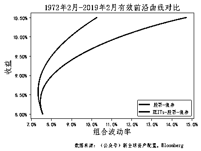
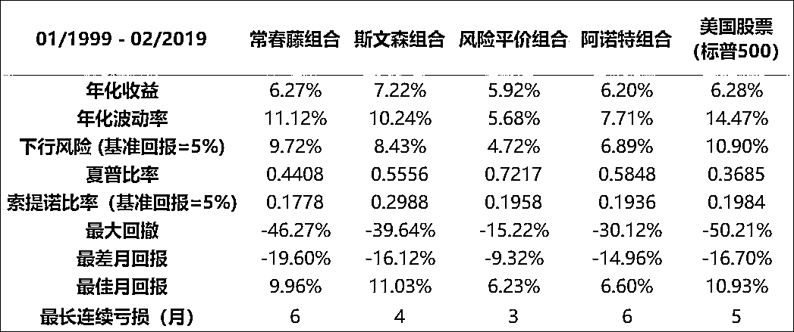

# REITs：一线城市买房神操作！

> 原文：[`mp.weixin.qq.com/s?__biz=MzAxNTc0Mjg0Mg==&mid=2653293599&idx=1&sn=0fd08c45eab19fd51d0fb422310b0411&chksm=802dce0ab75a471cfda67262746c2e3f56d0ef66c851f4ce93a78384def141a66515abc35929&scene=27#wechat_redirect`](http://mp.weixin.qq.com/s?__biz=MzAxNTc0Mjg0Mg==&mid=2653293599&idx=1&sn=0fd08c45eab19fd51d0fb422310b0411&chksm=802dce0ab75a471cfda67262746c2e3f56d0ef66c851f4ce93a78384def141a66515abc35929&scene=27#wechat_redirect)

**标星★公众号     **爱你们♥

作者：陈庆炜 

来自：新全球资产配置

**近期原创文章：**

## ♥ [5 种机器学习算法在预测股价的应用（代码+数据）](https://mp.weixin.qq.com/s?__biz=MzAxNTc0Mjg0Mg==&mid=2653290588&idx=1&sn=1d0409ad212ea8627e5d5cedf61953ac&chksm=802dc249b75a4b5fa245433320a4cc9da1a2cceb22df6fb1a28e5b94ff038319ae4e7ec6941f&token=1298662931&lang=zh_CN&scene=21#wechat_redirect)

## ♥ [Two Sigma 用新闻来预测股价走势，带你吊打 Kaggle](https://mp.weixin.qq.com/s?__biz=MzAxNTc0Mjg0Mg==&mid=2653290456&idx=1&sn=b8d2d8febc599742e43ea48e3c249323&chksm=802e3dcdb759b4db9279c689202101b6b154fb118a1c1be12b52e522e1a1d7944858dbd6637e&token=1330520237&lang=zh_CN&scene=21#wechat_redirect)

## ♥ 2 万字干货：[利用深度学习最新前沿预测股价走势](https://mp.weixin.qq.com/s?__biz=MzAxNTc0Mjg0Mg==&mid=2653290080&idx=1&sn=06c50cefe78a7b24c64c4fdb9739c7f3&chksm=802e3c75b759b563c01495d16a638a56ac7305fc324ee4917fd76c648f670b7f7276826bdaa8&token=770078636&lang=zh_CN&scene=21#wechat_redirect)

## ♥ [机器学习在量化金融领域的误用！](http://mp.weixin.qq.com/s?__biz=MzAxNTc0Mjg0Mg==&mid=2653292984&idx=1&sn=3e7efe9fe9452c4a5492d2175b4159ef&chksm=802dcbadb75a42bbdce895c49070c3f552dc8c983afce5eeac5d7c25974b7753e670a0162c89&scene=21#wechat_redirect)

## ♥ [基于 RNN 和 LSTM 的股市预测方法](https://mp.weixin.qq.com/s?__biz=MzAxNTc0Mjg0Mg==&mid=2653290481&idx=1&sn=f7360ea8554cc4f86fcc71315176b093&chksm=802e3de4b759b4f2235a0aeabb6e76b3e101ff09b9a2aa6fa67e6e824fc4274f68f4ae51af95&token=1865137106&lang=zh_CN&scene=21#wechat_redirect)

## ♥ [如何鉴别那些用深度学习预测股价的花哨模型？](https://mp.weixin.qq.com/s?__biz=MzAxNTc0Mjg0Mg==&mid=2653290132&idx=1&sn=cbf1e2a4526e6e9305a6110c17063f46&chksm=802e3c81b759b597d3dd94b8008e150c90087567904a29c0c4b58d7be220a9ece2008956d5db&token=1266110554&lang=zh_CN&scene=21#wechat_redirect)

## ♥ [优化强化学习 Q-learning 算法进行股市](https://mp.weixin.qq.com/s?__biz=MzAxNTc0Mjg0Mg==&mid=2653290286&idx=1&sn=882d39a18018733b93c8c8eac385b515&chksm=802e3d3bb759b42d1fc849f96bf02ae87edf2eab01b0beecd9340112c7fb06b95cb2246d2429&token=1330520237&lang=zh_CN&scene=21#wechat_redirect)

## ♥ [WorldQuant 101 Alpha、国泰君安 191 Alpha](https://mp.weixin.qq.com/s?__biz=MzAxNTc0Mjg0Mg==&mid=2653290927&idx=1&sn=ecca60811da74967f33a00329a1fe66a&chksm=802dc3bab75a4aac2bb4ccff7010063cc08ef51d0bf3d2f71621cdd6adece11f28133a242a15&token=48775331&lang=zh_CN&scene=21#wechat_redirect)

## ♥ [基于回声状态网络预测股票价格（附代码）](https://mp.weixin.qq.com/s?__biz=MzAxNTc0Mjg0Mg==&mid=2653291171&idx=1&sn=485a35e564b45046ff5a07c42bba1743&chksm=802dc0b6b75a49a07e5b91c512c8575104f777b39d0e1d71cf11881502209dc399fd6f641fb1&token=48775331&lang=zh_CN&scene=21#wechat_redirect)

## ♥ [计量经济学应用投资失败的 7 个原因](https://mp.weixin.qq.com/s?__biz=MzAxNTc0Mjg0Mg==&mid=2653292186&idx=1&sn=87501434ae16f29afffec19a6884ee8d&chksm=802dc48fb75a4d99e0172bf484cdbf6aee86e36a95037847fd9f070cbe7144b4617c2d1b0644&token=48775331&lang=zh_CN&scene=21#wechat_redirect)

## ♥ [配对交易千千万，强化学习最 NB！（文档+代码）](http://mp.weixin.qq.com/s?__biz=MzAxNTc0Mjg0Mg==&mid=2653292915&idx=1&sn=13f4ddebcd209b082697a75544852608&chksm=802dcb66b75a4270ceb19fac90eb2a70dc05f5b6daa295a7d31401aaa8697bbb53f5ff7c05af&scene=21#wechat_redirect)

## ♥ [关于高盛在 Github 开源背后的真相！](https://mp.weixin.qq.com/s?__biz=MzAxNTc0Mjg0Mg==&mid=2653291594&idx=1&sn=7703403c5c537061994396e7e49e7ce5&chksm=802dc65fb75a4f49019cec951ac25d30ec7783738e9640ec108be95335597361c427258f5d5f&token=48775331&lang=zh_CN&scene=21#wechat_redirect)

## ♥ [新一代量化带货王诞生！Oh My God！](https://mp.weixin.qq.com/s?__biz=MzAxNTc0Mjg0Mg==&mid=2653291789&idx=1&sn=e31778d1b9372bc7aa6e57b82a69ec6e&chksm=802dc718b75a4e0ea4c022e70ea53f51c48d102ebf7e54993261619c36f24f3f9a5b63437e9e&token=48775331&lang=zh_CN&scene=21#wechat_redirect)

## ♥ [独家！关于定量/交易求职分享（附真实试题）](https://mp.weixin.qq.com/s?__biz=MzAxNTc0Mjg0Mg==&mid=2653291844&idx=1&sn=3fd8b57d32a0ebd43b17fa68ae954471&chksm=802dc751b75a4e4755fcbb0aa228355cebbbb6d34b292aa25b4f3fbd51013fcf7b17b91ddb71&token=48775331&lang=zh_CN&scene=21#wechat_redirect)

## ♥ [Quant 们的身份危机！](https://mp.weixin.qq.com/s?__biz=MzAxNTc0Mjg0Mg==&mid=2653291856&idx=1&sn=729b657ede2cb50c96e92193ab16102d&chksm=802dc745b75a4e53c5018cc1385214233ec4657a3479cd7193c95aaf65642f5f45fa0e465694&token=48775331&lang=zh_CN&scene=21#wechat_redirect)

## ♥ [拿起 Python，防御特朗普的 Twitter](https://mp.weixin.qq.com/s?__biz=MzAxNTc0Mjg0Mg==&mid=2653291977&idx=1&sn=01f146e9a88bf130ca1b479573e6d158&chksm=802dc7dcb75a4ecadfdbdace877ed948f56b72bc160952fd1e4bcde27260f823c999a65a0d6d&token=48775331&lang=zh_CN&scene=21#wechat_redirect)

## ♥ [AQR 最新研究 | 机器能“学习”金融吗？](http://mp.weixin.qq.com/s?__biz=MzAxNTc0Mjg0Mg==&mid=2653292710&idx=1&sn=e5e852de00159a96d5dcc92f349f5b58&chksm=802dcab3b75a43a5492bc98874684081eb5c5666aff32a36a0cdc144d74de0200cc0d997894f&scene=21#wechat_redirect)

**前言**

房子一直都是大家热议的话题，尤其在一线城市，有房和没房的人，身价可能差了好几千万。国人对土地的执念很深，从古代官僚地主对土地的争夺，发展到现代人对房产的追捧。

但现实是骨感的，工资越来越赶不上房价涨幅，**“掏空六个钱包”（啃完父母积蓄再薅爷爷奶奶姥姥姥爷的羊毛付首付）**的压力让很多人对投资房产望而却步。

而一线城市的虹吸效应，源源不断地吸引着周边资源向之靠拢，全球各大城市在城市化的过程中，房价都呈上涨趋势。但不是人人都是土豪，除了大手笔直接买房，是否有别的方式，**用较低的成本就能分享到房价上涨的红利呢？**

答案是，通过“**REITs**”，其全称 Real Estate Investment Trusts，中文叫**房****地产投资信托基金**。随着经济发展与积累，人们对“性价比”投资的追求越来越大，要提升收益，还要保持较稳定增长，因而，通过资产配置来分散投资风险的需求也迅速增加。REITs 特殊的资产性质，也使其成为大类资产配置中的常客。

本文较长，就分为了上下篇介绍 REITs，**给大家提供一种低成本灵活配置房地产资产的思路**。上篇主要是对 REITs 投资的整体介绍，包括定义、分类、与投资房地产的区别等，以及影响 REITs 的经济要素和估值方法；下篇则重点阐述 REITs 在大类资产配置中的作用，以及投资者如何在二级市场配置 REITs。

01 REITs 投资概述

02 影响 REITs 的经济要素和估值方法

03 REITs 在大类资产配置中的作用

04 如何在二级市场上配置 REITs

**REITs 投资概述**

**首先我们来了解下 REITs 的定义、REITs 的分类，以及它与直接投资房地产的区别，包括这二者容易混淆的地方。** 

****1. REITs 的定义****

**上世纪 60 年代的美国，动荡又喧嚣，各种政治运动风起云涌，“非主流”的始祖——象征反叛精神的嬉皮士文化也在那时兴起，到处可见追求奇装异服、摇滚、群居的青少年，也是在这个时候，REITs 诞生了。**

**1958 年美国经济增长陷入负值，战后大量房地产无法消化，美国国会为了提升社会投资水平建立了 REITs，让中小投资者也能参与到不动产市场中来，获得不动产市场交易、租金与增值所带来的收益。**

****

**60 年代的美国嬉皮士** 

**REITs 是信托基金的一种：以发行收益凭证的方式汇集特定投资者的资金，由专门投资机构进行房地产投资管理，并将投资综合收益按比例分配给投资者。而要成为 REITs，还需要同时满足以下要求：**

**a. 房地产相关业务的收入不低于总收入的 75%；**

**b. 投资的房地产不低于总资产的 75%；**

**c. 发放给投资人的分红不低于年应税收入的 90%。**

**90%，极高的分红比例，真是没有一点私念。而且美国的 REITs 多采用公司制模式，投资者通过认购股票成为公司的股东，就间接持有了物业资产的股份。也就是说，如果你投资 REITs，除了成为其股东，还能获得这个 REITs 的很大比例的房产增值和现金流收益。无需直接拥有房产，不用操心房产的管理，使 REITs 成为灵活配置房地产资产的极佳的选择。 **

****

**PS：大家如果想查找各种 REITs 资料，可进入全美房地产投资信托协会-NAREIT 官网 https://www.reit.com/，其是 REITs 投资研究的主要制造商和发起人，为全球投资者、政策制定者和媒体持续提供 REITs 权威行业数据与信息。**

****2. REITs 的分类****

**从不同的角度，运作方式、投资形式和投资房产类别来看，REITs 可以划分为不同类型。**

****a. 按运作方式，可以分为公开挂牌 REITs、公开非挂牌 REITs 和私募 REITs。****

**公开 REITs 无论挂不挂牌，都必须在美国证监会(SEC)注册并接受监管。公开挂牌 REITs 可以在交易所像股票一样交易，其价格密切跟随市场波动，并可能会出现流动性溢价。截至 2015 年，公开挂牌 REITs 占全部公开 REITs 的比例约为 94%（该数据来源于 China Forex, July 15, 2015：《美国 REITs 面面观》，作者李雪莹）。**

**公开非挂牌 REITs 主要通过股票交易中介或金融服务公司交易，而且有最低认购额度的要求。**

**私募型 REITs 无需在 SEC 注册，也不在公开市场交易，一般只面向大型机构投资者或合格的高净值投资人。私募型 REITs 每年会稳定发放 10%左右的分红，但通常会收取高额且信息不透明的投资前期手续费，有时可高达投资额的 15%。**

****b. 按投资形式，可分为权益型 REITs 和抵押型 REITs。****

**权益型 REITs 是 REITs 的主流，约占市场总份额的 94%，其收入来源为租金收入以及所持有房产的增值。权益型 REITs 往往倾向于投资【单一物业类型】或【特定投资策略的房产组合】，明确的投资策略有利于投资者与机构对其进行估值，因此他们也跟股票一样，随时接受行业分析师的评级考验。**

**抵押型 REITs 主要投资房地产抵押贷款或抵押贷款证券（MBS），其收入来源为利差和转让收益。抵押型 REITs 同样具有明确的投资策略和偏好，选择住宅抵押债券（RMBS）或商业地产抵押债券（CMBS）其中之一进行投资，其中 RMBS 占比约为 80%，CMBS 占比约为 20%。**

****

**数据来源：《REITs_Constituent_2019》** 

****c. 按投资房产的类别，REITs 拥有并经营不同房地产行业的房地产，包括零售、住宅公寓、基础设施、医疗保健、办公室、工业、数据中心、仓库、酒店、林地等**。根据这些底层房产类别的不同，可分为不同子行业 REITs，具体如下：**

****

**数据来源: FTSE Russell, NAREIT**

**截至 2019 年 2 月 28 日** 

****3. 投资 REITs 与投资房地产的区别****

**REITs 兼具金融和不动产的属性，本质上是一种比直接投资房地产更灵活的配置房地产的方式。与直接投资房地产一样，REITs 也具有抗通胀属性。根据 Nareit 的数据，在 1992-2018 这 27 年间，除了 2002 和 2009 年，REITs 的分红率都跑赢了美国通胀率。**

**投资 REITS 与投资房地产也有很多区别，下图是二者在不同角度比较下的差异：**

****

****4. 投资 REITs 等于投资房地产吗****

**投资者很容易产生一个误区：既然 REITs 的底层资产是房地产，那配置 REITs 就等同于配置房地产了？ 并不是，如前文所述，正是由于投资 REITs 与直接投资房地产有差异，两者在回报路径上有很大不同。**

**下图为美国 REITs 与不同美国房地产指数在不同时期的两年滚动相关系数：**

****

**上图是 1978 年到 2018 年间，权益型 REITs 和 NCREIF 房价指数八个季度滚动相关系数；下图为 2000 年到 2018 年，权益型 REITs 和凯斯席勒美国房价指数 24 个月滚动相关系数。只看图里这个起伏的线条的话，REITs 和房地产仿佛是两个完全不同的资产！**

****

**注：**富时 Nareit 权益型 REITs 指数**为权益型 REITs 代表，该指数包含 REITs 综合指数中所有权益型 REITs，目前包含 170 家 REITs 上市公司；** 

****NCREIF 房价指数**由国际房地产投资信托委员会创立的房地产指数，通过聚集大量可信度高的私人房产数据，衡量美国各类型房地产无杠杆投资回报，是美国商业房地产中最常用的衡量投资回报的参考指数。房产权重按市价分配，自 1978 年第一季度起每季度更新；**凯斯席勒美国房价指数**由美国 20 个大城市房价的指数组成，以 2000 年 1 月为起始点，每月更新。需要注意的是，该指数仅纳入二手房房价，因为成交过的房子再次成交才能反映房价的趋势。**

**这种现象乍看很不科学，却也不难理解。**

**公开挂牌 REITs，价格时刻跟随着市场脉搏跳动，当美国股票市场出现较大波动时，REITs 往往也会跟随股票市场的波动而波动，在短期内偏离房产本身的价值。**

**而房地产指数的数据来源是房地产成交数据与估价报告，房产成交数据具有滞后型，房产估价具有主观性，指数的更新频率也不高，相对来说更贴近整体房地产市场的价值。**这些，造成了二者风险回报和波动表现不一致和变化很大的相关系数。****

**如下图所示，2012 年美国房地产市场开启复苏周期，又得益于美国股票大牛市，投资权益型 REITs（浅蓝色线）能获得比直接投资房产高很多的收益，但其收益增长曲线远没有美国大城市房价指数平稳。**

****

****影响 REITs 的经济要素和估值方法****

**前面讲了 REITs 的一些特点，既然 REITs 尤其是公开挂牌 REITs 很容易受市场的影响，那么影响 REITs 涨跌的因素是不是也和之有共性呢？我们该如何分析选择一只 REITs？** 

****1、影响 REITs 的经济要素****

**在宏观层面上，GDP 上涨与下滑、货币政策的宽松与紧缩、商业活动扩张与萎靡、人口的增长与减少和旅游业的发达与萧条等，都是影响 REITs 的重要经济要素。**

**要注意的是，REITs 投资的房产类型的不同，对这些宏观因素的敏感度也不同。如零售 REITs、办公室 REITs，受商业消费活动的影响较大；住宅 REITs 和医疗保健 REITs，受人口因素影响较大；而抵押型 REITs 则主要受货币政策的宽松与紧缩影响。**

**由于 REITS 还具有不动产属性，所以选择 REITs 还需要仔细分析以下方面的细节：**

****租约平均剩余租期：**要看处于什么周期，经济扩张周期，REITs 的租约平均剩余租期越短越好，在经济萎靡时期，则是越长越好；**

****现租金与市场租金：**要比较现租金与市场公允价，如果现租金高于市场，则租约到期后租金收入下降的可能性就比较大，反之亦然；**

****管理成本：**要考虑物业维护费和租赁管理费的多少；**

****租客集中度：**这会影响 REITs 盈利的稳定性，如果 REITs 的租客集中在少数几个大客户上，其利润变化幅度就会比较大；**

****租客的财务健康度：**可以估算一下可能出现的违约租金损失，尤其是占租金收入比最大的几个客户的财务健康度；**

****财务报表的健康度：**看看还钱的压力，主要指 REITs 自身的融资成本和债务结构；**

****管理层素质：**主要是 REITs 管理层的 REITs 管理经验与过往业绩。**

****2、REITs 的估值方法****

**要比较 REITs 的价格，当然从了解它的估值方法开始。REITs 的估值方法主要有每股净资产法（NAV/share）和相对价值法。由于 REITs 的分红比较稳定，分红折现模型(DDM)也可以用于 REITs 估值。**

****每股净资产法：**从 REITs 过去一年的净营运收入(NOI)出发，在考虑实收租金、未来新增租客租金和原有租金增长的基础上，预估来年的 NOI；然后通过 NOI 除以租售比获得每个房产的营运价值；所有房产的营运价值加总后，加上现金与其他资产，再减去债务后，便可得到整个 REITs 的净资产；最后除以股数得到每股净资产。**

**NAV = NOI(来年预测) /租售比 + 现金 + 其他资产 – 债务**

****相对价值法：** 这和股票使用的市盈率、市净率和市销率进行的相对估值法相似，不同的是，REITs 用的是市价/营运资金（Price/FFO）。营运资金（FFO）的计算方法类似现金流报表中营运现金流的算法，从收益表中的净利润出发，加回折旧和递延税款等非现金支出，排除买卖房产产生的投资收益或亏损，得到营运资金。**

**FFO = 净利润 + 折旧 + 递延税款 – 房产投资盈亏**

**下图为 Nariet 权益型 REITs 指数中各类型房产的 Price/FFO 与标普 500 的平均市盈率(P/E)的水平，**REITs 的 Price/FFO 近十年来都保持在 15-19 之间，估值并没有跟随股美国股票市场的上涨而膨胀。****

****

**以上，给大家介绍了 REITs 的特点，**对于大众投资人来说，它是一种便捷的投资房地产的方式；同时，相比直接配置房地产，REITs 具有更强的流动性、信息及时性、灵活性等，相比股票，估值也更稳定**，这些也让 REITs 成为大类资产配置研究中的重要一员。**

**在 90%的国家中，房地产行业都是一个国家的支柱行业。房地产行业的容量之大、牵扯到的行业之多、关系到的民生之深，没有哪一个行业能够与之相比，因为房地产行业的隐含杠杆率高。**

****

**数据来自：Dallas Fed** 

**2008 年美国由次贷演变成金融危机，美国整体房价水平跌了 25%，从 2006 年一直跌到 2012 年底，期间标普 500 狂泻 50%，从 2008 开始，一直跌了 3 年多。可是，离美国最近的加拿大就像打了鸡血，房价水平反而一路上扬，只在 08 年底稍微喘息了一下。**

**不管是福利好的瑞士、富人聚集的卢森堡，还是增强潜力无穷南非，跟加拿大比起来都是小儿科。**但投资没有一万只有万一，如果房地产一旦崩盘，只持有实物资产和金融资产的投资人面临的往往是“房、股双杀”的恶性局面**。**

**但是房地产资产，综合来看，在过去 100 多年的时间内，在多个国家和地区，确实录得了与股票不相上下的回报。详见《146 年的全球市场回报水平【货币、国债、股票、房产】》**

****

**作为大众投资人，要相信资产配置永远是你投资中最好的朋友。**学会通过二级市场的标准化产品做资产配置，平衡流动型，减少单一资产的影响**。那么接下来，我们将会着重介绍，如何通过 REITs，发挥资产配置的作用。**

****REITs 在大类资产配置中的作用****

**REITs 目前在全球 36 个国家都有分布，超过一半的市场份额在美国，其余也大多分布在发达市场。截至 2018 年底，美国 REITs 的总市值达到 1.05 万亿美元，在美股市场上的日平均交易量达 73 亿美元，是美国人最主要的大类资产配置品种之一。** 

**根据 Nareits 的数据：大约有八千万美国人在他们的退休金和证券账户中投资 REITs；REITs 共持有约 3 万亿美元的房地产资产，其中，在公开市场上交易的权益型 REITs 持有两万亿美元；标普 500 指数成份股中有 31 家公司是 REITs；REITs 在 2017 年的总分红达到 575 亿美元......REITs 在大类资产中的地位可见一斑。**

**接下来，我们就从【REITs 在大类资产中的历史回报数据】以及【REITs 子行业的表现】出发，近距离地了解它吧。**

****1. REITs 的历史长期表现与新趋势****

**我们看下美国 1978 年到 2018 年 40 年间，REITs、房地产与股票、债券和大宗商品等大类资产自的季度全回报数据，数据取自彭博。这段时间处于美国股债双牛的大周期之内，也正好与我国改革开放四十年重合。REITs 在这期间表现如何呢？**

**从下表可以看到：**投资美国权益型 REITs 的年化收益回报是最高的，超过了 12%**，甚至高于处在大牛市中的美国股票（11.58%）。**

****

**此处的 NCREIF 指数是采用的平滑版本，平滑版本的实物房产定价的频率会大大低于非平滑版本，导致该指数的波动率大大小于实际情况。**

**再看看权益型 REITs 中子行业房产的表现，我们选取了除林业和基础设施（缺乏数据）以外的各行业 REITs 的数据，数据来自彭博。由于富时 Nareit 从 2006 年起才推出 REITs 子行业指数，因此下图中子行业月回报的数据期间为 2006 年 4 月至 19 年 2 月。**

**这是段特殊的时期，REITs 经历了场大难。在 2008 年次贷危机中，各行业的 REITs 都遭遇大幅度回撤，最高达 85.37%，最低也逾 50%。2006 年至今数据显示，办公楼类、酒店类、零售类等主流行业 REITs 表现不佳，但移动房车、医疗保健中心和储藏间等新型房产类别的 REITs，依然为投资者提供了优异的回报。其中移动房车 REITs 年化收益率为 14.32%，储藏室 REITs 为 12.31%。**

****

**我们测试了以上 REITs 间的相关性。不同类型的 REITs 的表现与整体权益型 REITs 的相关系数在 0.8-0.96 之间。表现优秀的移动房车、医疗保健中心和储藏间 REITs 与各子行业之间的相关系数相对偏低。**

****

** REITs 行业相关性矩阵**

****值得一提的是，数据中心与特殊用途 REITs 在最近几年的迅速兴起，为 REITs 行业注入了全新的血液**。根据 Nariet 今年二月底的权益型 REITs 报告，数据中心 REITs 与特殊用途 REITs 的市值分别达到 685 亿美元和 465 亿美元，在富时权益型 REITs 指数中的市值占比 6.48%与 4.43%。**

**REITs 也随着时代在不断发展，数据中心等新型 REITs 正在给整个 REITs 行业生态带来全新的趋势，也诞生了如易昆尼克斯（EQIX）和 Digital Realty Trust（DLR）这样的市值在 200 亿美元以上、被上百支大型指数型 ETF 持有的大公司。**

****2. REITs 能否作为单独资产类别****

**CFA 在 2019 年教材中指出，进行大类资产配置可以从两种角度出发，**一是大类资产类别，二是常见风险因子**。若按大类资产类别配置，REITs 作为单独的资产类别理应得到相应的配置权重，若按常见风险因子配置，则可以通过配置小盘股和有信用风险的固定收益债券达到与配置 REITs 相似的效果。以下就从这两个方面来探讨配置 REITs 的效果。**

****a. 从单独资产类别的定义上看，CFA 在 2019 年教材中提出了以下五个标准，来评判某资产是否能被划分为一个资产大类。****

****同一类资产之间应具有同质性。**REITs 投资的是各类型房地产或房地产抵押债券，底层核心资产都是房地产，符合同质的标准。☑️**

****该类资产不能被划分为其他资产或同时被划为多种资产。**虽然从收益来源上看，权益型 REITs 类似高分红股票类资产，抵押型 REITs 类似债券类资产。但从 REITs 的底层核心资产房地产看的话，无论将其划入股票类资产还是债券类资产都是不合适的。另外，REITs 和房地产，既没有储藏价值又没有生产价值，所以也不能划归大宗商品。因此 REITs 在大类资产分类中经常被划到另类资产，这个条件满足。☑️**

****该类资产与其他大类资产的回报不应高度相关。**REITs 与其他大类资产的相关性矩阵见下表：**

****

**前面我们提到 REITs 会跟随股票市场波动，这里从数据结果也可以看出，REITs 跟美国股票的相关系数接近 0.6，但跟债券和大宗商品的相关性都较低。符合标准。☑️**

****在大类资产配置中加入该类资产可以提升投资组合的有效前沿。**下图为投资组合均值-方差图，蓝线为美国股票与债券组合的有效前沿，绿线为同期加入了权益型 REITs 后的有效前沿。在股债组合中加入了权益型 REITs 后，最小波动率组合的年化波动率略小于股债最小波动率组合，同时年化收益和夏普比率都提高了。符合标准。☑️**

****

****

**有效前沿组合资产权重**

****

**加入权益型 REITs 的股债组合回报**

****该类资产需要有足够的市场规模。**即该类资产可以容纳足够大的资金规模对其进行资产配置。我们举个反例就好理解了，虽然【艺术品资产】能满足同质性、无法被划分为多个资产以及与其他大类资产都不太相关的要求，但它却无法容纳大资金对其进行资产配置，只能满足个人收藏，因此不能作为单独的资产类别。而对于市场规模在万亿美金级别，且已成为美国退休金账户主要配置之一的 REITs，这个条件显然是满足的。☑️**

**因此，根据 CFA 教材的定义，REITs 完全可以被划分为一个单独的资产类别，成为大类资产配置中的可选项。不过，从【单独大类资产的风险暴露角度】评判 REITs 作为另类资产的效果，严谨的学术界提出了不同的意见。**

****b. 从 REITs 作为单独大类资产的风险因子暴露的角度，近两年来学术界有观点认为 REITs 不应被归为单独的资产类别，原因主要来自下文提到的两篇论文。****

**2017 年 5 月，Buckingham Asset Management 的 Jared Kizer 和 Sean Grover（下文简称 KG）发表了《Are REITs a Distinct Asset Class》一文。文章使用了 1978 年 1 月至 2016 年 9 月的月度回报数据，对一直以来 REITs 被当作单独的资产类别提出质疑，其观点如下：**

**A. 虽然 REITs（道琼斯精选 REITs 指数）与美国股票（标普 500）和美国国债（5 年国债）的月回报相关系数都不高，但如果将【美国股票市场中 12 个行业的月回报】（来自 Fama/French12 行业回报数据）分别拿出来与【标普 500】和【美国国债】进行测试，其相关系数并不比 REITs 与两者的相关系数高多少。**

**B. 作者对 REITs 与 12 个行业的回报进行回归测试，在 Cahart 的四因子模型（市场因子 MKT, 市值因子 SMB, 价值因子 HML, 动量因子 UMD）基础上再加入两个固定收益因子：TERM（5 年国债收益-无风险收益)和 IGDEF（久期对应的投资级债券收益-5 年国债收益），用这个六因子模型做回归测试。**

**结果发现，六因子模型对 REITs 和 12 个行业都具有足够的解释力度。这说明，REITs 与 12 个行业一样，对六因子中的五个因子（MKT, SMB, HML, TERM, IGDEF）都有明显的因子暴露，而 REITs 自身并不存在超额收益（alpha = -0.89%, t-stat = -0.3）。**

**C. 接着，作者构建了一个投资组合，来复制 REITs 的回报表现：67%的仓位持有小盘价值股（Fama/French SV），33%的仓位持有公司债（巴克莱长期公司债指数）。该组合的回报与 REITs 的回报的相关性高达 0.72，而且有着更高的年化回报率和更低的年化波动率。**

**D. 最后，作者测试了将 REITs 添加到美国股债组合对有效前沿的提升效果，其结果表明，这种有效前沿的提升在统计学上并不显著。**

**2018 年春天，Northern Trust 的 Peter Mladina 发表论文《Real Estate Betas and the Implications for Asset Allocation》。文章使用了 1986 年 1 月到 2015 年 12 月的数据，将权益型 REITs（富时权益型 REITs 指数）、房地产指数（NCREIF 房地产指数）和房地产公募与私募基金指数进行回归测试，用的是改进版 Fama/French 五因子模型，即在原有的 MKT, SMB, HML 三因子中加入了 TERM 因子（长期国债收益-1 个月国债收益）和 DEF 因子（久期一致的高收益债券-长期国债收益）的模型。**

**其结论是，五因子模型有效解释了 REITs 的全部回报来源，REITs 自身并不存在超额收益（alpha= -2.15%, t-stat = -0.95），反而带有房地产行业特有的风险，而且 REITs 的回报也可以被 60%仓位的小盘价值股和 40%仓位的高收益债复制。此结论基本与前面提到的 KG 的结论一致。**

****c. 本着自己动手丰衣足食的原则，我们也对富时权益型 REITs 指数用五因子模型进行测试：****

**数据选取：**

*   **1983 年 8 月-2019 年 1 月间的彭博富时权益型 REITs 全回报；**

*   **市场因子 MKT、市值因子 SMB 和价值因子 HML 使用是 Fama/French 的数据；**

*   **TERM 因子为【巴克莱美国中期国债指数回报】减去【美国 30 天国债指数回报】；**

*   **DEF 因子我们使用了两个版本，DEF1 为【美国中期投资级公司债指数（平均久期 3.77）回报】减去【美国中期国债指数（平均久期 3.88）回报】，DEF2 为【美股中期高收益债券指数（平均久期 3.49）回报】减去【美国国债指数（平均久期 3.88）回报】。**

**结果如下图，在相应数据区间内，五因子模型完美解释了权益型 REITs 的回报，REITs 并没有带来显著的额外收益。**

****

****3. 大类资产配置是否应该加入 REITs****

**那么，我们还应不应该在大类资产配置中加入 REITs 呢？**

**实际上，在海外的经典投资组合中，配置 REITs 的不在少数。其中就包括了大名鼎鼎的耶鲁捐赠基金，其掌门人为大卫-斯文森。根据耶鲁捐赠基金 2019 年大类资产配置的目标，房地产类资产将占到 9.5%。而对于个人投资者，斯文森则在其著作《Unconventional Success: A Fundamental Approach to Personal Investment》中提出了经典的斯文森组合。**

**在斯文森的影响下，Cambria Investment Management 的创始人 Meb Faber 也在其著作《The Ivy Portfolio: How to Invest Like the Top Endowments and Avoid Bear Market》中提出了经典的常春藤组合，该组合将 20%的资金放在了 REITs 上。**

**以下为几个经典投资组合的大类资产配置权重：**

****

**各经典投资组合的大类资产配置权重**

**** 

** 各经典投资组合的投资回报**

**我们可以看到，这些在过去 20 年间跑赢大盘的经典投资组合，都对 REITs 投入了 5%-20%的资金进行配置。另外，随着海外 REITs 的发展和新投资工具的涌现，Meb Faber 和阿诺特(Rob Arnott)对他们的经典投资组合做了补充，都加入了国际市场 REITs，且与美国 REITs 权重相等。**

****因此，对于个人投资者来说，跟随经典投资组合配置 REITs 还是不错的选择**。Nareit 官网上指出，多个研究表明，REITs 在投资组合中的合理权重为 5%-15%之间，大家可以作为参考。**

****如何在二级市场上配置 REITs?****

****1. REITs 和房地产行业 ETF**** 

**投资 ETF 是进行大类资产配置最便捷的工具，目前美国股票市场上主要的 REITs 和房地产行业的 ETF 如下：**

****

**数据来源：彭博，截至 2019 年 3 月** 

**如上图所示，**从规模和分红的角度看，VNQ 是投资者配置美国本土房地产和 REITs 的最佳选择**。截止 2019 年 4 月 30 日 ，VNQ 中 96.4%的权重用来投资 REITs，还有 3.6%的权重用来投资房地产服务公司、房地产开发以及与房地产投资相关的项目。**VNQI 则是配置美国以外的国际房地产和 REITs 的首选**，其投资标的覆盖全球 30 个国家；而**REM 是最大的抵押型 REITs 的 ETF**。**

**从下图的相关性矩阵可见，自 2011 年 2 月 SCHH 发行以来，SCHH 与 VNQ 的表现完全一致；VNQ&IYR 与 VNQI&RWX 均高度相关，且 IYR、RWX 与美国股市(SPY)的相关性更高，**因此如果大家要配置美国本土房地产和 REITs，可以选择用 VNQ 和 REM；配置国际房地产和 REITs 可以用 VNQI。****

****

****2. 如何通过 ETF 在投资组合中配置 REITs****

**上文提到，REITs 在大类资产配置中合理的权重应在 5%-15%之间。我们在此尝试在【美国和国际的股债 60/40 组合】中，分别加入【美国 REITs 组合】与【美国以外国际 REITs 组合】：美国组合我们大致按照目前的 REITs 市场规模，**90%配置 VNQ，10%配置 REM，国际市场我们直接用 VNQI 跟踪。****我们按 15%，10%，5%的比例分别替换掉相应的国债部分的权重。****

**（美国和国际的股债 60/40 的投资组合为：美国股票配置 SPY，美国十年国债配置 IEF，国际股票配置 EFA，国际债券配置 BWX，4 个 ETF 分别是跟踪美国标普 500 指数、美国十年国债指数、MSCI 发达国家股票指数和美国以外国际市场国债指数规模最大的 ETF。）**

****

**加入 REITs 的美国市场的股债 60/40 组合**

**** 

**加入 REITs 的国际市场的股债 60/40 组合**

**从上图可以看到，在美国股债 60/40 中加入 REITs 组合配置后，随着美国 REITs 配置的比例减小，夏普比率增加，也就是随着 REITs 比例增加，夏普比率在减小，整体投资组合的表现并没有锦上添花；**

**而在国际市场的股债 60/40 组合中，加入 REITs 组合的比重越大，夏普比率越大，则整体投资组合的表现越好。这也解释了为什么 Meb Faber 和 Rob Arnott 两位大师会在升级版经典投资组合中加入 VNQI 补充国际房地产配置。**

**也就是说，**在美国这样成熟的市场配置 REITs 指数的超额收益可能并不显著，但在国际市场中，配置 REITs 仍然能优化整体投资组合的表现。****

****4. 关注我们身边的 REITs 投资机会****

**目前国内市场还没有本土 REITs 产品，普通投资者若想投资 REITs，只能通过投资国内大型基金公司，由基金公司【通过 QDII 直接或间接投资国外的 REITs】或房地产资产。因此投资者要注意，在关注海外投资标的本身的涨跌之外，还要记得考虑人民币汇率风险。**

**下图为目前国内跟踪海外房地产资产表现的基金列表。**

****

**数据来源：万得终端，截至 2019 年 3 月** 

**2018 年上半年，国内各相关部门对推出本土 REITs 进行了广泛的研究讨论，达成了普遍的共识，对 REITs 持认可态度：“REITs 是金融服务实体经济，构建多层次资本市场体系的重要途径，是推动经济去杠杆，防范化解系统性风险的有效方式，也是能够完善当期证券市场产品结构、向投资人提供具有较高配置价值的投资产品。”**

**去年上半年，国内还成功发行了中联东吴-新建元邻里中心 REITs、中联前海开源-保利地产租赁住房 REITs 一期和皖新光大阅嘉 REITs 等六单类 REITs 产品，总金额达 97.81 亿元。可以预见，符合国际惯例的内地 REITs 产品、以及可发行 REITs 产品的公募与私募基金的出现，只是时间问题。**

**国内投资者如果想配置我们身边的 REITs 资产，也可以通过投资港股中的 REITs。在香港上市的 REITs 持有国内商业房地产的项目不在少数，且包含十分高的分红收益，如下图：**

****

**根据彭博数据，富时 Nareit 香港 REITs 指数自 2011 年发行以来的平均年化全回报达到了 16.43%，高于美国的 REITs 指数。**

****写在最后****

**固定资产投资，目前确实占国人投资的大头。抛开实物的房产头寸，中国高净值投资人投资性房产占比大约在 5%～10%之间。而根据招行私人银行的财富报告显示，受调查的高净值客户中，**对于未来是否增加和减少投资性房地产的决定，分歧最大。****

**过去 20 年，房地产价格增幅巨大，但作为实物资产，必然存在着流动性差、变现成本高的缺点。虽然 REITs（房地产投资信托基金）不能完全替代房地产价格的变化，但是 REITs 作为一种特殊的大类资产类别，其底层资产与房地产相关的资产和现金流挂钩，因而在全球大类资产配置的讨论中从不缺席。** 

**REITs 在历史上，能够带来长期的增值，而且增值幅度能够媲美股票资产；同时也能够带来较高的分红收益，并且相对于股票的股息收益更为稳定。虽然底层资产锚定于固定资产，但是交易所挂牌的 REITs，能够兼顾房地产的收益属性和公开产品的交易属性，因而能较好地平衡收益和流动性。**

****作为大众投资人，在做资产配置的时候，最需要注意的就是产品的透明程度**。因为大部分投资人，都没有时间和精力去翻阅几百甚至上千页的产品说明书，更别说去判断某固定资产的估值方式了。而公开挂牌交易的 REITs，需要像公司年报一样披露资产的表现和前景，并雇佣独立董事，这为投资人提供了额外的保护。**

**根据我们上述的数量分析，用科学和合理的方式，在资产配置中加入 REITs，能够实现“同等风险下，提供更高的收益”，或是在“同等收益下，负担更少的风险”的这样近乎”免费“的午餐。**

****

***—End—***

**量化投资与机器学习微信公众号，是业内垂直于**Quant**、**MFE**、**CST、AI**等专业的**主****流量化自媒体**。公众号拥有来自**公募、私募、券商、银行、海外**等众多圈内**10W+**关注者。每日发布行业前沿研究成果和最新量化资讯。**

****