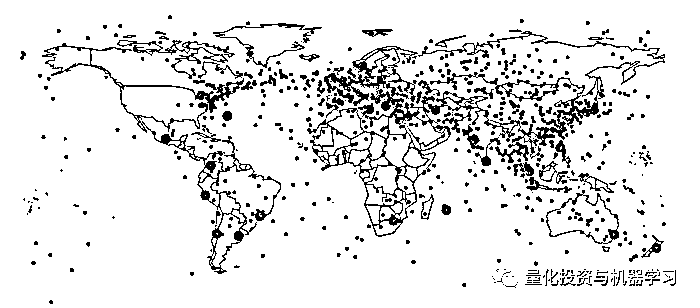
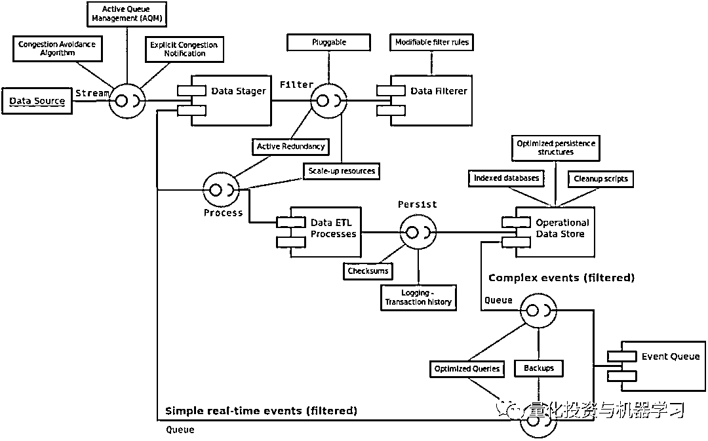
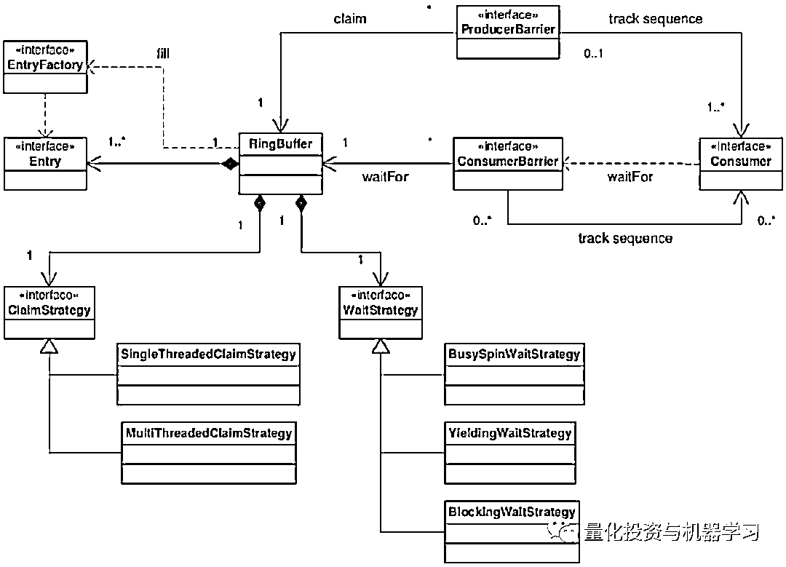

# 算法交易系统架构，此篇足矣！

> 原文：[`mp.weixin.qq.com/s?__biz=MzAxNTc0Mjg0Mg==&mid=2653293592&idx=1&sn=147af0837f0f61775c8190f51f9cc105&chksm=802dce0db75a471b7777c427f07c6a42e107a2b3f7d687d5bb0ef00aa50d75506ada47a1a05d&scene=27#wechat_redirect`](http://mp.weixin.qq.com/s?__biz=MzAxNTc0Mjg0Mg==&mid=2653293592&idx=1&sn=147af0837f0f61775c8190f51f9cc105&chksm=802dce0db75a471b7777c427f07c6a42e107a2b3f7d687d5bb0ef00aa50d75506ada47a1a05d&scene=27#wechat_redirect)

**标星★公众号     **爱你们♥

作者：Stuart Reid 

编译：方的馒头 | 公众号翻译部、海外部

**近期原创文章：**

## ♥ [5 种机器学习算法在预测股价的应用（代码+数据）](https://mp.weixin.qq.com/s?__biz=MzAxNTc0Mjg0Mg==&mid=2653290588&idx=1&sn=1d0409ad212ea8627e5d5cedf61953ac&chksm=802dc249b75a4b5fa245433320a4cc9da1a2cceb22df6fb1a28e5b94ff038319ae4e7ec6941f&token=1298662931&lang=zh_CN&scene=21#wechat_redirect)

## ♥ [Two Sigma 用新闻来预测股价走势，带你吊打 Kaggle](https://mp.weixin.qq.com/s?__biz=MzAxNTc0Mjg0Mg==&mid=2653290456&idx=1&sn=b8d2d8febc599742e43ea48e3c249323&chksm=802e3dcdb759b4db9279c689202101b6b154fb118a1c1be12b52e522e1a1d7944858dbd6637e&token=1330520237&lang=zh_CN&scene=21#wechat_redirect)

## ♥ 2 万字干货：[利用深度学习最新前沿预测股价走势](https://mp.weixin.qq.com/s?__biz=MzAxNTc0Mjg0Mg==&mid=2653290080&idx=1&sn=06c50cefe78a7b24c64c4fdb9739c7f3&chksm=802e3c75b759b563c01495d16a638a56ac7305fc324ee4917fd76c648f670b7f7276826bdaa8&token=770078636&lang=zh_CN&scene=21#wechat_redirect)

## ♥ [机器学习在量化金融领域的误用！](http://mp.weixin.qq.com/s?__biz=MzAxNTc0Mjg0Mg==&mid=2653292984&idx=1&sn=3e7efe9fe9452c4a5492d2175b4159ef&chksm=802dcbadb75a42bbdce895c49070c3f552dc8c983afce5eeac5d7c25974b7753e670a0162c89&scene=21#wechat_redirect)

## ♥ [基于 RNN 和 LSTM 的股市预测方法](https://mp.weixin.qq.com/s?__biz=MzAxNTc0Mjg0Mg==&mid=2653290481&idx=1&sn=f7360ea8554cc4f86fcc71315176b093&chksm=802e3de4b759b4f2235a0aeabb6e76b3e101ff09b9a2aa6fa67e6e824fc4274f68f4ae51af95&token=1865137106&lang=zh_CN&scene=21#wechat_redirect)

## ♥ [如何鉴别那些用深度学习预测股价的花哨模型？](https://mp.weixin.qq.com/s?__biz=MzAxNTc0Mjg0Mg==&mid=2653290132&idx=1&sn=cbf1e2a4526e6e9305a6110c17063f46&chksm=802e3c81b759b597d3dd94b8008e150c90087567904a29c0c4b58d7be220a9ece2008956d5db&token=1266110554&lang=zh_CN&scene=21#wechat_redirect)

## ♥ [优化强化学习 Q-learning 算法进行股市](https://mp.weixin.qq.com/s?__biz=MzAxNTc0Mjg0Mg==&mid=2653290286&idx=1&sn=882d39a18018733b93c8c8eac385b515&chksm=802e3d3bb759b42d1fc849f96bf02ae87edf2eab01b0beecd9340112c7fb06b95cb2246d2429&token=1330520237&lang=zh_CN&scene=21#wechat_redirect)

## ♥ [WorldQuant 101 Alpha、国泰君安 191 Alpha](https://mp.weixin.qq.com/s?__biz=MzAxNTc0Mjg0Mg==&mid=2653290927&idx=1&sn=ecca60811da74967f33a00329a1fe66a&chksm=802dc3bab75a4aac2bb4ccff7010063cc08ef51d0bf3d2f71621cdd6adece11f28133a242a15&token=48775331&lang=zh_CN&scene=21#wechat_redirect)

## ♥ [基于回声状态网络预测股票价格（附代码）](https://mp.weixin.qq.com/s?__biz=MzAxNTc0Mjg0Mg==&mid=2653291171&idx=1&sn=485a35e564b45046ff5a07c42bba1743&chksm=802dc0b6b75a49a07e5b91c512c8575104f777b39d0e1d71cf11881502209dc399fd6f641fb1&token=48775331&lang=zh_CN&scene=21#wechat_redirect)

## ♥ [计量经济学应用投资失败的 7 个原因](https://mp.weixin.qq.com/s?__biz=MzAxNTc0Mjg0Mg==&mid=2653292186&idx=1&sn=87501434ae16f29afffec19a6884ee8d&chksm=802dc48fb75a4d99e0172bf484cdbf6aee86e36a95037847fd9f070cbe7144b4617c2d1b0644&token=48775331&lang=zh_CN&scene=21#wechat_redirect)

## ♥ [配对交易千千万，强化学习最 NB！（文档+代码）](http://mp.weixin.qq.com/s?__biz=MzAxNTc0Mjg0Mg==&mid=2653292915&idx=1&sn=13f4ddebcd209b082697a75544852608&chksm=802dcb66b75a4270ceb19fac90eb2a70dc05f5b6daa295a7d31401aaa8697bbb53f5ff7c05af&scene=21#wechat_redirect)

## ♥ [关于高盛在 Github 开源背后的真相！](https://mp.weixin.qq.com/s?__biz=MzAxNTc0Mjg0Mg==&mid=2653291594&idx=1&sn=7703403c5c537061994396e7e49e7ce5&chksm=802dc65fb75a4f49019cec951ac25d30ec7783738e9640ec108be95335597361c427258f5d5f&token=48775331&lang=zh_CN&scene=21#wechat_redirect)

## ♥ [新一代量化带货王诞生！Oh My God！](https://mp.weixin.qq.com/s?__biz=MzAxNTc0Mjg0Mg==&mid=2653291789&idx=1&sn=e31778d1b9372bc7aa6e57b82a69ec6e&chksm=802dc718b75a4e0ea4c022e70ea53f51c48d102ebf7e54993261619c36f24f3f9a5b63437e9e&token=48775331&lang=zh_CN&scene=21#wechat_redirect)

## ♥ [独家！关于定量/交易求职分享（附真实试题）](https://mp.weixin.qq.com/s?__biz=MzAxNTc0Mjg0Mg==&mid=2653291844&idx=1&sn=3fd8b57d32a0ebd43b17fa68ae954471&chksm=802dc751b75a4e4755fcbb0aa228355cebbbb6d34b292aa25b4f3fbd51013fcf7b17b91ddb71&token=48775331&lang=zh_CN&scene=21#wechat_redirect)

## ♥ [Quant 们的身份危机！](https://mp.weixin.qq.com/s?__biz=MzAxNTc0Mjg0Mg==&mid=2653291856&idx=1&sn=729b657ede2cb50c96e92193ab16102d&chksm=802dc745b75a4e53c5018cc1385214233ec4657a3479cd7193c95aaf65642f5f45fa0e465694&token=48775331&lang=zh_CN&scene=21#wechat_redirect)

## ♥ [拿起 Python，防御特朗普的 Twitter](https://mp.weixin.qq.com/s?__biz=MzAxNTc0Mjg0Mg==&mid=2653291977&idx=1&sn=01f146e9a88bf130ca1b479573e6d158&chksm=802dc7dcb75a4ecadfdbdace877ed948f56b72bc160952fd1e4bcde27260f823c999a65a0d6d&token=48775331&lang=zh_CN&scene=21#wechat_redirect)

## ♥ [AQR 最新研究 | 机器能“学习”金融吗？](http://mp.weixin.qq.com/s?__biz=MzAxNTc0Mjg0Mg==&mid=2653292710&idx=1&sn=e5e852de00159a96d5dcc92f349f5b58&chksm=802dcab3b75a43a5492bc98874684081eb5c5666aff32a36a0cdc144d74de0200cc0d997894f&scene=21#wechat_redirect)

阅读此文前，请先阅读这篇文章：

[**算法交易，此篇足矣！**](http://mp.weixin.qq.com/s?__biz=MzAxNTc0Mjg0Mg==&mid=2653293436&idx=1&sn=10a9de897ee9e6d0b6712ce31b8fffe5&chksm=802dc969b75a407f1877708aa4d743941f6b63b19c97b76a45f571d8287fc5fd848bfe9f0e50&scene=21#wechat_redirect)  

本篇推文将分三个部分由浅到深，为大家介绍算法交易系统架构的细节：

*   **算法交易系统概述**

*   **算法交易系统要求（重点）**

*   **算法交易系统架构（超重点）**

**第一部分：算法交易系统概述**

算法交易是使用计算机算法自动做出交易决策，提交指令并在提交后管理那些指令。算法交易系统最好使用由三个组件组成的简单概念架构来理解，这些组件处理算法交易系统的不同方面，即数据**处理程序、策略处理程序和交易执行处理程序**。这些组件与上述算法交易的定义一一映射。在今天的推文中，我们扩展这个架构来描述如何构建更智能化的算法交易系统。

概念算法交易系统

**系统更智能化意味着什么？在算法交易的背景下，我们将通过系统自我适应和自我感知的程度来度量智能化。首先让我们详细说明算法交易系统概念架构中的三个组件。**

****数据组件****

**算法交易系统可以使用结构化数据、非结构化数据或者两者兼用。如果数据是按照预定结构组织的，那么它是结构化的。示例包括电子表格、CSV 文件、JSON 文件、XML、数据库以及数据结构。与市场相关的数据（如日内价格、日终价格和交易量）通常以结构化格式提供。经济和公司财务数据也以结构化格式提供。Quandl 和 Wind 是两个很好的示例结构化财务数据的来源。**

**如果数据没有按照预定结构进行组织，那么它就是非结构化的。示例包括新闻、社交媒体、视频和音频。这种类型的数据本质上处理起来更复杂，并且通常需要数据分析和数据挖掘技术来分析它。在交易中，微博等社交网络的新闻和数据的主流使用已经产生了更强大的工具，能够理解非结构化数据。其中很多工具利用人工智能，尤其是神经网络。**

**具体应用见：**

*   **[重大事件后，股价将何去何从？](http://mp.weixin.qq.com/s?__biz=MzAxNTc0Mjg0Mg==&mid=2653293217&idx=1&sn=856e9c7bb346165a33f3bf371b3ad859&chksm=802dc8b4b75a41a239315290be9ad0a24c81f2eed201a39b9761e06753fc70bd646c224a948f&scene=21#wechat_redirect)** 

*   **[微博对大 A 股的预测能力到底怎样？](http://mp.weixin.qq.com/s?__biz=MzAxNTc0Mjg0Mg==&mid=2653293185&idx=1&sn=0e4d478d23318b9a81465d30434b64c7&chksm=802dc894b75a418287dcbd7196c280aff8161c60e48d623d5d72718eb71432fb7eca8547bca1&scene=21#wechat_redirect)** 

*   **[Twitter 上的情绪如何预测股价走势](http://mp.weixin.qq.com/s?__biz=MzAxNTc0Mjg0Mg==&mid=2653291745&idx=1&sn=860c56fb01d0a6277476b06a0db68148&chksm=802dc6f4b75a4fe2e7e202bd278daa413b949e947dac5cfbcb82e9d25ca48e7f0443a899f1cf&scene=21#wechat_redirect)** 

*   **[Twitter 新闻标题对股价影响到底有多大?](http://mp.weixin.qq.com/s?__biz=MzAxNTc0Mjg0Mg==&mid=2653291703&idx=2&sn=a9952361e07021e45e0cf713d6021222&chksm=802dc6a2b75a4fb4f96f3134483b411fecb532fc2920c0671cffb4f8ab0e157bc669f076f006&scene=21#wechat_redirect)** 

*   **[深入研读：利用 Twitter 情绪去预测股市](http://mp.weixin.qq.com/s?__biz=MzAxNTc0Mjg0Mg==&mid=2653290402&idx=1&sn=efda9ea106991f4f7ccabcae9d809e00&chksm=802e3db7b759b4a173dc8f2ab5c298ab3146bfd7dd5aca75929c74ecc999a53b195c16f19c71&scene=21#wechat_redirect)** 

*   **[人工智能和另类数据：夸大其词 or 确有其用?](http://mp.weixin.qq.com/s?__biz=MzAxNTc0Mjg0Mg==&mid=2653292677&idx=1&sn=02245bb19a10b95f53c37f803d81810a&chksm=802dca90b75a43864b417c90d8c542aa9704d740d8a1af05a7bbb77989fcb022ae59445a35b1&scene=21#wechat_redirect)**

*   **[AQR 最新研究 | 机器能“学习”金融吗？](http://mp.weixin.qq.com/s?__biz=MzAxNTc0Mjg0Mg==&mid=2653292710&idx=1&sn=e5e852de00159a96d5dcc92f349f5b58&chksm=802dcab3b75a43a5492bc98874684081eb5c5666aff32a36a0cdc144d74de0200cc0d997894f&scene=21#wechat_redirect)**

****模型组件****

**模型是由算法交易系统所看到的外部世界的表示。金融模型通常表示算法交易系统如何相信市场的运作方式。任何模型的最终目标都是用它来对世界或市场做出推论。最重要的事情是这里要记住 George E.P Box 的一句话“所有的模型本质上都是错误的，但有些模型是很有用的。”**

**模型可以使用很多不同的方法和技术来构建，但从根本上说，它们基本上都在做一件事：将一个复杂系统简化为一组易于处理和可量化的规则，这些规则描述该系统在不同场景下的行为。一些方法包括但不限于数学模型、符号和模糊逻辑系统、决策树、归纳规则集和神经网络。**

****数学模型****

**使用数学模型来描述市场的行为被称为量化金融。**大多数量化金融模型都是基于市场价格（和收益）随着时间的推移根据随机过程而变化的固有假设**，换句话说，市场是随机的。这是非常有用的假设，它是几乎所有衍生品定价和其他一些证券估值模型的核心。**

**从本质上讲，大多数量化模型都认为，任何给定证券的收益都是由一个或多个随机市场风险因素所驱动的。收益受这些风险因素影响的程度被称为敏感性。例如，一个多样化的投资组合的收益可能是由短期利率、各种外汇汇率和整个市场的收益率变动所驱动的。这些因素可以从历史上进行度量，并用来校准一个模型，该模型模拟了那些风险因素会做的，以及引申开来，投资组合的收益可能是什么。**

****

**蒙特卡罗模拟相关资产的价格路径**

****符号和模糊逻辑模型****

****符号逻辑**是一种推理形式，本质上涉及对谓语（由 AND、OR 和 XOR 等逻辑运算符构成的逻辑语句）进行评估，评估结果为真或假。**模糊逻辑**放宽了二进制真假约束，并允许任何给定的谓语在不同程度上属于一组真或假谓语词集。这是根据集合成员函数定义的。** 

**在金融市场的背景下，对这些系统的投入可能包括预期与任何给定证券收益相关的指标。这些指标可能是定量的、技术的、基本的或本质上的其他性质。例如，模糊逻辑系统可能从历史数据加以推断，如果五日指数加权移动平均线大于或等于十日指数加权移动平均线，那么未来五日内股票价格上涨的概率为百分之六十五。**

****

**从给定的数据集中识别这些规则的数据挖掘方法称为**规则归纳**。这与决策树的归纳非常相似，只是结果通常更易于人们阅读。**

****决策树模型****

**决策树类似于归纳规则，除了是（通常是二叉树）形式的结构。在计算机科学中，二叉树是一种树数据结构，其中每个节点最多有两个子节点，即左子节点和右子节点。在这种情况下，每个节点表示决策规则（或决策边界），并且每个子节点要么是另一个决策边界，要么是表示输出的终端节点。**

**决策树有两种类型：分类树和回归树。分类树在其输出中包含分类（例如买入、持有或卖出），而回归树包含特定变量的结果值（例如-2.5%、0%、+2.5%等）。用于训练决策树的数据的性质将决定生成什么类型的决策树。用于生成决策树的算法包括 C4.5 和遗传编程。**

**与规则归纳一样，决策树模型的输入可能包括一组给定的基本的、技术的或统计因素的数量，这些因素被认为是可以推动证券收益的因素。**

****

****神经网络模型****

**神经网络几乎可以肯定是算法交易者最流行的机器学习模型。神经网络由输入和输出之间的相互连接的节点层组成。单个节点被称为感知器，并且类似于多元线性回归，除了它们被馈入一个称为激活函数的东西，这个函数可以是非线性的，也可以不是非线性的。在非循环神经网络中，感知器被布置成层，并且层与层之间相互连接。有三种类型的层：输入层、隐藏层和输出层。输入层将接收到规范化的输入，这将是推动证券收益的预期因素，输出层可能包含买入、持有、卖出分类或实际价值的可能结果，如分仓收益。隐藏层本质上调整了那些输入的权重直到神经网络的误差（它如何在最后的状态下执行）被最小化。对此的一种解释是隐藏层提取数据中具有相对于输出更有预测能力的特征。**

****

**多层感知器** 

**除了这些模型之外，还有很多其他决策模型可用于算法交易（以及一般市场）的背景下，以便对证券价格的方向进行预测，或者对于量化读者来说，可以对证券价格中任何变动的可能性进行预测。**

**模型的选择直接影响算法交易系统的性能。使用多个模型（集合）可以提高预测精度，但会增加实现的复杂性。该模型是算法交易系统的大脑。为了使算法交易系统更加智能化，系统应该存储有关历史上出现的任何和所有错误的数据，并应该根据这些变化调整其内部模型。在某种意义上，这将构成自我意识（错误）和自我适应（连续模型校准）。也就是说，这肯定不是终结者！**

****执行组件****

**执行组件负责完成模型识别的交易。该组件需要满足算法交易系统的功能性和非功能性要求。例如，**执行速度、交易频率、持有交易的周期**，以及交易指令被传送到交易所的方法需要充足。算法交易系统的任何实现都应该能够满足那些要求。在本文中，我们提出了一种算法交易系统的开放式架构，相信该架构满足很多要求。**

****监视器组件****

**人工智能使用目标函数学习。目标函数通常是量化算法交易系统性能的数学函数。在金融领域，风险调整收益的度量包含特雷诺指数、夏普比率和索提诺比率。算法交易系统中的模型组件将“被要求”最大化这些数量中的一个或多个。对此的挑战在于市场是动态的。换句话说，之前工作过的模型、逻辑或神经网络可能会随着时间的推移而停止工作。为了解决这个问题，算法交易系统应该使用有关模型本身的信息来训练模型。这种自我意识使模型能够适应不断变化的环境。我们认为这种自我适应是一种用于应对市场体制变化的连续模型校准。**

****第一部分总结****

**算法交易在过去十年中变得非常流行。它现在占据了通过全球交易所进行的大部分交易，并且归功于一些世界上表现最佳的对冲基金的成功，尤其是文艺复兴科技公司。话虽如此，关于算法交易是什么，以及它如何影响现实世界中的人们，仍然存在大量的混淆和误解。在某种程度上，人工智能也可以这样说。**

**对这些主题的研究往往仅仅集中在表现上，我们忘记了研究人员和从业人员建立更强大、更严谨的概念和理论模型同样重要，我们可以在未来几年内进一步推动这个领域。无论我们喜欢与否，算法塑造了我们的现代世界，我们对其的依赖赋予了我们不断寻求理解并改进它们的道德义务。**

****第二部分：算法交易系统要求****

****算法交易系统（ATs）使用计算算法制定交易决策，提交指令，并在提交后管理指令**。近年来，算法交易系统越来越受欢迎，目前已占据通过国际交易所进行的大部分交易。在程序化交易和算法交易之间加以区分。程序化交易涉及将大型市场指令分解成小份额的包。程序化交易被认为是算法交易系统的安全要求。**

****算法交易系统介绍****

**一般而言，市场参与者有五种类型：**散户投资者、自营交易者、做市商、买方机构和卖方机构**。算法交易系统主要由专有的买方机构使用，但是这种动态正在改变。算法交易作为一种服务（ATAAS）使散户投资者可以使用算法交易。本部分描述了专有的的买方机构使用算法交易系统的架构要求。在最顶层，一**个算法交易系统有三个功能：****制定交易决策、创建交易指令以及在提交后管理这些指令**。在这些之下有很多更详细的功能性要求，其中一些可能被架构所满足。**

****软件架构介绍****

**关于软件架构的定义是什么仍然存在很多争论。在本文的上下文中，**软件架构被定义为可以指定、部署和执行提供用户功能的应用程序组件的基础结构**。**一个软件系统应满足其功能性和非功能性要求。****功能性要求指定系统组件的功能。****非功能性要求指定测量系统性能的措施**。满足其功能性要求的软件系统可能仍不能满足用户的期望，例如能够提交交易但不能及时提交交易的算法交易系统将会造成财务损失。软件架构基本上提供了一个满足非功能性要求的基础结构，并在其中可以部署和执行满足功能性要求的组件。因此，算法交易系统要求可以大致分为功能性和非功能性要求。**

****功能性要求****

**在**“制定交易决策”**的最高级别要求之下，有三个高级别要求：**

****1、获取市场数据**——下载、过滤以及存储结构化和非结构化数据。结构化数据包括实时市场数据。非结构化数据包括新闻和社交媒体数据。**

****2、制定交易策略**——指定新的交易规则和策略。交易规则由一个指标、一个不等式和一个数值组成，例如“市盈率”<10。交易规则被构造成一个决策树，以定义一个交易策略（如下图所示）。**

****

****3、根据交易策略分析证券**——对于每种证券，获取数据并通过交易策略对其进行过滤，以确定将要购买哪只证券。另外：对于每个未结头寸，决定出售哪只证券。注：此要求可能有所不同。**

**在**“创建交易指令”**的最高级别要求之下，有两个高级别要求：**

****1、获取交易信息**——对于每个决策，获取证券代码、价格、数量等。**

****2、创建交易指令**——对于每个决策，指定指令类型并添加交易信息。有六种指令类型：多头、空头、市场价、限价、止损和条件。**

**在**“管理指令”**的最高级别要求之下，有三个高级别要求：**

****1、管理挂单**——对于每个指令，验证并确认该指令。**

****2、发送/提交指令**——将每个指令发送到交易所或券商。**

****3、管理已提交的指令—**—跟踪每个已提交指令的状态，如果指令匹配，则创建未结头寸。如果指令不匹配则停止该指令。**

****非功能性要求****

**有很多非功能性要求相互交换，例如，**性能的提高通常会增加总体拥有成本**。非功能性算法交易系统要求包括：**

****1、可伸缩性**——系统在增加或扩展的工作负荷下应对和执行的能力。算法交易系统应该可以根据进程中的数据馈送数量、交易的交易数量以及可以交易的证券进行扩展。**

****2、性能**——系统完成的工作量与完成该项工作所需的时间和资源之比。算法交易系统应具有快速响应时间（回馈市场）以及高处理和网络吞吐量。**

****3、可修改性**——是指系统易于更改。算法交易系统应具有易于修改的交易策略和数据处理功能。**

****4、可靠性**——是系统为接收到的输入产生正确输出的准确性和可靠性。由于算法交易系统中的错误和漏洞会导致巨额损失和罚款，**可靠性至关重要**。**

****5、可审计性**——是指系统易于被审计。从财务、合规和 IT 的角度来看，它们都应该是可审计的。**

****6、安全**——是指组织抵御恐怖主义、盗窃或间谍犯罪活动的安全。由于交易策略是专有的并且代表有价值的知识产权，因此它们必须得到保护。此外，**为了保护算法交易系统免受攻击，应使用程序化交易策略对指令进行模糊处理**。**

****7、容错**——是指系统在发生故障或故障后继续正常运行的能力。这类似于可靠性，只是算法交易系统即使在故障后仍应保持可靠，以避免财务损失。**

****8、互操作性**——是指系统能够轻松地与各种相关系统进行操作。这**对于可能需要与指令管理系统、投资组合管理系统、风险管理系统、会计系统甚至银行系统进行交互的算法交易系统来说非常重要。****

****架构范围概述****

****架构范围是架构支持的一组服务，这些服务由组件使用，以满足其功能性和非功能性要求**。详细要求文档中提供了该架构范围的更详细分类。在高级别，架构需要提供以下服务：**

****1、可修改的数据预处理环境** ——支持多个数据流，过滤无关数据以及时态数据分区。**

****2、分布式处理环境** ——支持多个处理单元（集群），实时性能监控，面向消息的通信框架，时态数据集调度，负载平衡和数据复制。**

****3、各个处理单元**——支持内存中队列和复杂事件处理（在时态数据上）。**

****4、存储区域网络（SAN）**——支持时态数据聚合，连续查询和记录（用于审计跟踪）。**

****5、数据恢复（DR）环境**——复制 SAN 和指令管理系统。**

****6、集成环境**——公开组件的标准 API 并将内部和外部组件相互连接。**

****7、指令管理系统**——支持并发输入流，被动冗余和负载均衡，指令上的 ACID 标准，审计跟踪以及被复制。**

****8、系统使用环境**——支持多个用户程序，并向算法交易系统公开完全托管的前端。**

****访问和集成要求****

**访问要求描述了用户访问系统组件的方式。一个算法交易系统应该公开三个接口：**定义新的交易规则、交易策略和数据源的接口；****系统管理员添加集群和整合架构的后端接口；****以及用于检查 IT 控制和用户访问权限的只读审计接口**。组件和外部系统之间集成的先决条件称为集成要求。算法交易系统应支持基于文件的集成、基于消息的集成和数据库集成。因此，架构应满足以下要求：**

****数据库集成：**支持 ODBC，JDBC，ADO 和 XQC**

**基于文件的集成：支持 CSV，XML 和 JSON 文件**

****基于消息的集成：**支持 FIX，FAST 和 FIXatdl**

****架构约束****

**蓝点表示网络延迟最小化的物理位置，红点表示大型金融交易所的物理位置。为了最大化算法交易系统的性能，应该将系统放置在网络延迟最小化的位置。**

****

**架构约束是约束正在构建的架构的性能的因素。这里我们将提到的两个约束是**物理网络约束与监管约束**。**由于电信网络的不完善，物理网络对系统造成了约束。****为了缓解这种约束，应该在网络延迟最小化的地方构建系统。****另一种缓解网络约束的方法是将算法交易系统与市场交易所合并。****话虽如此，合并的决定引入了额外的处理和空间约束。****

**监管约束是通过法律和法规引入的，这些法律和法规主要针对国家和交易所。这是算法交易系统设计和实现中越来越重要的因素，因为算法交易在 2010 年闪电崩盘后变得越来越规范。一般而言，算法交易系统应该至少遵守 SEC 关于系统合规性和完整性（SCI）、EMEA 算法交易系统指南、ISO 9000 算法交易标准（AT9000）和国际财务报告标准（IFRS）的规定。**

****第二部分总结****

**算法交易系统架构因系统预期的严格非功能性要求以及管理自动化交易的广泛监管和合规性要求而变得复杂。由于这些复杂性，应仔细考虑系统架构的设计和实现。在设计开源算法交易系统架构时，我们希望指出那些在设计此类系统时经常被忽视的架构要求。本部分将包括了对满足上述要求的软件架构的设计。**

****第三部分：算法交易系统架构****

# **前面两部分我们介绍了智能算法交易系统的概念，以及生产算法交易系统的功能性和非功能性要求。在第三部分，我们将按照 ISO/IEC/IEEE 42010 系统和软件工程架构描述标准的指南描述该架构。根据此标准，架构描述必须：** 

**1、包含多个标准化架构视图（例如在 UML 中）。**

**2、保持涉及决策和架构要求之间的可追溯性。**

****软件架构定义****

**关于**系统架构是什么**，仍然没有达成共识。在本文的上下文中，**它被定义为一个可以指定、部署和执行满足功能性要求的应用程序组件的基础结构**。功能性要求是可以测量系统的预期功能。非功能性要求是测量系统质量的方法。**

**如果不满足非功能性要求，那么完全满足其功能性要求的系统仍可能无法满足期望。为了说明这个概念，请考虑以下情形：你刚购买/构建的算法交易系统做出了出色的交易决策，但是在组织风险管理和会计系统中是完全不可操作的。这个系统会满足你的期望吗？**

****概念架构****

**概念视图描述了系统中以最高粒度级别存在的高级概念和机制。在这个级别，**算法交易系统遵循跨四层和两个架构面分解的事件驱动架构（EDA）**。对于每个层和面，都使用参考架构和模式。架构模式被证明是实现特定要求的通用结构。架构面是跨越多个组件的交叉关注点。**

****

**该图说明了算法交易系统的概念架构**

****事件驱动架构**——一种产生、检测、消费和对时间作出反应的架构。事件包括实时市场变动、复杂事件或趋势以及交易时间，例如提交指令。**

****参考架构****

**使用一个类比，一个参考架构类似于承重墙的设计蓝图。这种蓝图可以重复用于多种建筑设计，无论建造什么建筑，因为它满足一组常见的要求。同样，一个参考架构定义了包含通用结构和机制的模板，可用于构建一个具体的满足特定要求的软件架构。算法交易系统的架构使用基于空间架构（SBA）和模型视图控制器（MVC）作为参考。良好的实践，如操作数据存储（ODS），提取转换和加载（ETL）模式，以及还使用了数据仓库（DW）。** 

****1、模型视图控制器**——一种将表示与用户与其交互分开的模式。**

****

****2、基于空间的架构**——指定一种基础结构，其中松散耦合的处理单元称为空间的共享关联内存与另一个主体相互交互。**

****

****架构概念视图****

****结构视图****

**架构的结构视图显示了算法交易系统的组件和子组件。它还展示了如何将这些组件部署到物理基础结构上。此视图中使用的 UML 图包括组件图和部署图。下面是在整个算法交易系统和 SBA 参考架构中的处理单元的部署图库以及每个层的相关组件图。**

****

****算法交易系统高层部署图****

****

****SBA 处理单元部署图****

****订单处理层组件图****

****

****自动交易/事件处理组件图****

****

****数据源和预处理层组件图****

****

****基于 MVC 的用户界面组件图****

****架构策略****

**根据软件工程研究院的架构策略，通过架构设计决策的操纵质量属性模型的某些方面来满足质量要求的手段。**算法交易系统架构中使用的一个简单示例是使用连续查询组件“操纵”操作数据存储（ODS）**。该组件将持续分析 ODS 以识别和提取复杂事件。架构中使用以下策略：**

*   **事件和指令队列中的干扰器模式**

*   **事件和指令队列的共享内存**

*   **ODS 上的连续查询语言（CQL）**

*   **对输入数据进行过滤器设计模式的数据过滤**

*   **所有入站和出站连接的拥塞避免算法**

*   **主动队列管理（AQM）和显示拥塞通知**

*   **具有升级能力的商品计算资源（可扩展）**

*   **所有单点故障的主动冗余**

*   **ODS 中的索引和优化持久性结构**

*   **为 ODS 安排定期数据备份和清理脚本**

*   **所有数据库的交易历史记录**

*   **所有检测故障指令的校验**

*   **使用时间戳注释事件以跳过“过时”事件**

*   **指令验证规则，例如最大贸易量**

*   **自动交易者组件使用内存数据库进行分析**

*   **连接到算法交易系统（ATs）的用户界面的两级认证**

*   **用户界面和 ATs 连接的加密**

*   **MVC 管理视图的观察者设计模式**

**上面的列表只是我们在架构设计期间确定的一些设计决策。它不是一个完整的策略列表。**

**随着系统的开发，应该在多个粒度级别上采用额外的策略来满足功能性和非功能性要求。下面是描述干扰器设计模式、过滤器设计模式和连续查询组件的三个图。**

****连续查询组件图****

****

****Disruptor 设计模式类图****

****

****过滤器设计模式类图****

****行为视图****

****此架构视图显示了组件和层应如何交互。这在测试架构设计和理解端到端系统创建场景时非常有用。**此视图由序列图和活动图组成。显示算法交易系统的内部过程以及交易者应如何与算法交易系统交互的活动图如下所示。** 

****

****算法交易者交互****

****

****端到端算法交易流程****

****技术与框架****

****设计软件架构的最后一步是确定可用于实现架构的潜在技术和框架**。作为一般原则，**最好利用现有技术，前提是它们能够充分满足功能性和非功能性要求**。框架是一种用来实现的参考架构，例如 JBoss 是一种实现 JEE 参考架构的框架。以下技术和框架很有意思，在实现算法交易系统时应予以考虑：**

****CUDA**——NVidia 拥有许多支持高性能计算金融建模的产品。在 GPU 上而不是 GPU 运行蒙特卡罗模拟时，可以实现高达 50 倍的性能提升。**

****Apache River**——River 是用于开发分布式系统的工具包。它已被用作基于 SBA 模式构建应用程序的框架。**

****Apache Hadoop**——如果需要广泛的记录，那么 Hadoop 的使用为大数据提供了一个有趣的解决方案。Hadoop 可以部署在支持 CUDA 技术的集群环境中。** 

****AlgoTrader**——一个开源的算法交易平台。AlgoTrader 可能会部署在自动交易者组件的位置。**

****FIX Engine**——一个独立的应用程序，支持财务信息交换（FIX）协议，包括 FIX、FAST 和 FIXatal。**

**虽然不是一种技术或框架，但应使用应用程序编程接口（API）构建组件，以提高系统**

**及其组件的互操作性。**

****第三部分总结****

**所提议的架构旨在满足算法交易系统的非常通用的要求。一般来说，算法交易系统由于三个因素而变得复杂，每个实现方式各不相同：**

****1、依赖外部企业和交换系统****

****2、挑战非功能性要求以及****

****3、不断发展的架构约束****

**因此，为了满足特定的组织和监管要求，以及克服区域约束，需要对所提议的软件架构根据具体情况进行逐案调整。算法交易系统架构应被视为一个对于个人和组织想要设计他们自己的算法交易系统的参考点。**

****

***—End—***

**量化投资与机器学习微信公众号，是业内垂直于**Quant**、**MFE**、**CST、AI**等专业的**主****流量化自媒体**。公众号拥有来自**公募、私募、券商、银行、海外**等众多圈内**10W+**关注者。每日发布行业前沿研究成果和最新量化资讯。**

****