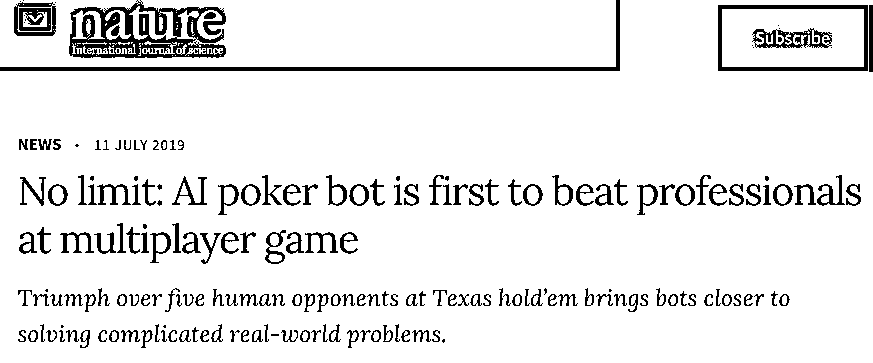

# 我有一个大胆的想法！

> 原文：[`mp.weixin.qq.com/s?__biz=MzAxNTc0Mjg0Mg==&mid=2653293529&idx=1&sn=3ffa2565d4dbae16c2cadebc763e822c&chksm=802dc9ccb75a40da0b046dc0f98f3bed09b1bf652c4e369fa8831a58ef622ef7d1bec79bb558&scene=27#wechat_redirect`](http://mp.weixin.qq.com/s?__biz=MzAxNTc0Mjg0Mg==&mid=2653293529&idx=1&sn=3ffa2565d4dbae16c2cadebc763e822c&chksm=802dc9ccb75a40da0b046dc0f98f3bed09b1bf652c4e369fa8831a58ef622ef7d1bec79bb558&scene=27#wechat_redirect)

**标星★公众号     **爱你们♥

来源：ai.facebook

编辑：金磊、大明 | 新智元

**前言**

AI 又完成了一项“里程碑式”的挑战。  

一款名叫“Pluribus”的 AI 扑克牌机器人在六人无限制德州扑克这项复杂游戏中，碾压了人类职业选手！——**这是 AI 机器人首次在规模超过两人的复杂对局中击败顶级人类玩家**。

这样的一项研究，你肯定会认为训练消耗的成本会非常大，对吧？

但是！恰恰相反！划重点：

> **Pluribus 的蓝图策略在 64 核 CPU 的服务器上训练了 8 天，使用 512 GB 的 RAM，没有使用 GPU。****在一般的云计算实例价格下，训练费用不到 150 美元！**

这与其他最近的 AI 突破性成果形成鲜明对比，其中包括那些涉及游戏中自对战的突破，训练成本动辄就需要几百万美元。

许多网友们纷纷感慨：“原来小资源的研究也能推动人工智能研究大步向前发展”。这项研究**让人们对如何构建通用的人工智能有了更好的基础理解**。

这项研究是由卡耐基梅隆大学与 Facebook 人工智能团队共同合作完成。目前，各大顶级期刊和知名媒体都在疯狂刷屏报道：

*https://www.nature.com/articles/d41586-019-02156-9*

*https://science.sciencemag.org/content/early/2019/07/10/science.aay2400*

https://www.techmeme.com/

那么这款德州扑克 AI 到底为何如此厉害？新智元带你慢慢揭秘。 

**Pluribus：面向“隐藏信息”更新算法，战胜职业牌手**

几十年来，德州扑克一直是人工智能领域最难以攻克的重大问题之一。因为扑克对局涉及“隐藏信息”。你不知道对手的牌是什么，要想在牌局中获胜，需要成功运用 bluff 和其他多种策略，这些策略并不适用于国际象棋、围棋等对局。这使得德州扑克成为 AI 难以攻克的堡垒之一。

近年来随着技术的进步，AI 在 1V1 德州扑克对局中，已经能击败顶级人类玩家。但如何开发出能够在 1 对多的牌局中战胜顶级玩家的 AI，仍是研究人员不断努力的目标。

Pluribus 是 Facebook 与卡内基梅隆大学合作开发的新型 AI 机器人，它成功实现了这一目标，击败了德州扑克精英人类玩家：比赛采用六人无限制德州扑克。**Pluribus 在“五个 AI 和一个人类玩家”和“一个 AI 和五个人类玩家”的比赛中都击败了人类职业玩家。**

在每个筹码价值 1 美元的假设下，Pluribus 每手牌平均能赢 5 美元，在与五名职业玩家的对战中，每小时能赢 1000 美元。可以说是取得了决定性胜利。

Pluribus 在此前的德州扑克 AI Libratus 的基础上进行了几项创新，实现了这一成果，Libratus 是 2017 年在双人无限注德州扑克中击败人类职业选手的 AI，我们还借助了 Tuomas Sandholm 在卡内基梅隆大学研究实验室开发的其他算法和代码。

特别是，Pluribus 采用了一种新的在线搜索算法，可以通过前面的几个步骤而不是仅仅搜索到游戏结束来有效地评估策略选择。Pluribus 还针对涉及“隐藏信息”的对战使用新的、更快的自对弈算法。**AI 只需非常少的处理能力和内存就能进行训练，只需价值不到 150 美元的云计算资源**。这种高效率与近期其他扑克 AI 项目形成鲜明对比，后者往往需要价值数百万美元的计算资源才能进行训练。

[`mp.weixin.qq.com/mp/readtemplate?t=pages/video_player_tmpl&action=mpvideo&auto=0&vid=wxv_894296080966483968`](https://mp.weixin.qq.com/mp/readtemplate?t=pages/video_player_tmpl&action=mpvideo&auto=0&vid=wxv_894296080966483968)

上面的视频中展示了 Pluribus 在对阵几位职业玩家时采用的牌局策略。(牌面已公开展示)

这些创新在德州扑克以外的领域也具有重要意义，因为双人零和博弈（一个玩家赢了，另一个玩家就要输）在休闲游戏中很常见，但在现实生活中非常罕见。而在真实场景中，比如对有害内容采取行动，应对网络安全挑战，以及管理在线拍卖、导航流量，这些行为通常涉及多个参与者，并涉及隐藏信息。我们的成果表明，AI 算法可以在双人零和博弈领域之外，也达到超过人类的表现。

**来自职业牌手的赞誉：和 AI 打牌压力山大**

> “与 Pluribus 比赛最激动的事就是应对其在翻牌前采取的复杂策略。与人类不同，Pluribus 在翻牌前会多次加注。这与人类对局的风格完全不同，很有意思。”

**Seth Davies，职业扑克选手**

> “我很高兴能够与机器人对战，这是一种独特的学习体验。我认为机器人玩得非常稳。当我的手牌不强时，AI 总能逼我做艰难的决定，而且 AI 在拥有强手牌时总能赢到钱，AI 做的很漂亮，这是一个有趣的挑战，我很高兴再次与它对战。”

**Trevor Savage，职业扑克选手**

> “Pluribus 是一个非常努力的对手，任何手牌你都很难压倒它。AI 非常善于在河牌轮下小注。非常擅长在手握好牌时尽量多赢。”

**Cris Ferguson，WSOP 冠军**

> “这个 AI 就是个 bluff 怪物。我觉得它比大多数人更有效率。你和它对战总能感觉到很大压力，你知道它随时可能在 bluff。”

**Jason Les，职业扑克选手**

> “每当和机器人玩牌时，我会选择一些新的策略。作为人类，我认为我们倾向于为自己过度简化对局，让对局策略更易于使用和记忆，更倾向于走捷径。机器人就不会走这种捷径，它的每个决定背后都有一个极其复杂而平衡的策略树。”

**Jimmy Chou，职业扑克玩家**

> “能与机器人对战，并看到它选择的一些策略真的令人难以置信。AI 是德州扑克发展过程中的一个重要组成部分，在面向未来的这一大步中获得第一手经验真是太棒了。”

**Michael Gagliano，职业扑克玩家**

**从双人对战到六人混战，产生了哪些新问题？**六人的德州扑克对战与之前的二人对战的 AI 基准测试相比，多了两个主要挑战。

**一、不再只是双人零和博弈**

此前，所有取得突破的 AI 仅限于那些只有两名玩家或两支球队参加的零和博弈对局（如跳棋，国际象棋，围棋、双人德州扑克，星际争霸 2 和 Dota 2 等）。

在这些对局中，AI 可以采用一种称为“纳什均衡”的策略。在双人和双队的零和博弈中，无论对手做什么，只要采用足够精确的纳什均衡策略，就能保证不输。（例如，“石头剪刀布”的纳什均衡策略是以相同的概率随机出石头、布或剪刀。）

尽管在任何有限制的对战中都会存在纳什均衡，但在三个或更多玩家参与的游戏中，纳什均衡难以有效计算。此外，在有两个以上玩家参与的游戏中，即使在精确的纳什均衡策略下，有时也无法避免失败。

在六人制德州扑克中，目标不应该是确定特定的博弈论解决方案的概念，而是**创建一个从长远来看，可以凭经验击败人类对手的 AI**。对于 AI 机器人来说，这通常被认为是“超人”的表现。

我们用来构建 Pluribus 的算法并不能保证在双人零和博弈之外的领域收敛到纳什均衡。尽管如此，Pluribus 在六人德州扑克中采用的策略始终能击败精英专业玩家，因此这些算法能够在超级玩家零和游戏之外的更广泛的场景中产生超人策略。

**二、要面对复杂环境下的“隐藏信息”**

没有其他游戏像扑克一样体现“隐藏信息”的挑战，每个玩家都拥有其他玩家所缺乏的信息（手牌）。一个成功的 AI 必须会推理这个隐藏信息，并仔细平衡策略，以保持对自身信息的不可预测，同时仍然采取良好的行动策略。例如，采用 bluff 偶尔会有效，但总用 bluff 就会容易被人摸透，可能会导致大量损失。因此，有必要仔细在“bluff”和“手握大牌下大注”的概率之间取得一个平衡。换句话说，**就是令不完全信息博弈中的行动策略，取决于选择某策略和选择其他动作的概率区分上。**

而在完全信息博弈中，玩家不必考虑这一点。国际象棋中的好手就是好手。但我们不可能将特定德州扑克牌局中的最佳策略与德州扑克的整体策略区分开来。

像 Libratus 这样的德州扑克 AI，结合了基于反事故遗憾最小化（CFR）理论中的合理的自对战算法和精心构建的搜索程序，来应对牌局中的隐藏信息。对于不完全的信息博弈，牌局中的玩家的增加，会让对局的复杂性呈现指数级增长。以前的技术无法扩展应用到六人对局中，即使计算量提升 10000 倍也不行。Pluribus 使用的新技术，比以前的任何技术更好地应对这一挑战。

**Pluribus 对战策略：从零开始自对战，8 天训练战胜职业高手**

Pluribus 在牌局中策略核心是通过自对战计算出来的，**AI 自己和自己进行对局，没有任何人类对局的数据作为输入**。AI 从零开始，一开始是完全是随机行动，随着牌技逐渐提升，学着确定哪些行动更好，确定各类行动的概率分布中哪些可以产生更好的结果。Pluribus 使用的自对战版本是迭代蒙特卡罗 CFR（MCCFR）算法的改进版。

[`mp.weixin.qq.com/mp/readtemplate?t=pages/video_player_tmpl&action=mpvideo&auto=0&vid=wxv_894393903208726529`](https://mp.weixin.qq.com/mp/readtemplate?t=pages/video_player_tmpl&action=mpvideo&auto=0&vid=wxv_894393903208726529)

上面的视频中显示了蒙特卡罗 CFR 算法通过评估实际和假设行动值，来更新遍历者策略的过程。在 Pluribus 中，出于优化目的，这种遍历实际上是以深度优先的方式完成的。

此时，探索其他假设的结果是可能的，因为 AI 正与自己进行对局。如果 AI 想知道选择了其他一些行动会发生什么事情，那么它只需自问应该如何回应该行动就行了。

在对局中的每个决策点中维持每个动作的 CFR，需要的计算资源比宇宙中原子总数还多。为了降低游戏的复杂性，我们忽略了一些操作，并通过抽取将类似的决策点放在一起。在抽象之后，划分在一起的决策点被视为相同决策点。

Pluribus 经过自对战，输出整个对战中的蓝图策略。在实际对局中，Pluribus 使用搜索算法改进了这个蓝图策略。但是，Pluribus 并没有根据其观察到的对手的倾向来调整策略。

上图显示了在 64 核 CPU 训练期间，Pluribus 的蓝图策略的改进过程。绩效是根据训练的最终快照来衡量的。

Pluribus 的蓝图策略在 64 核 CPU 的服务器上训练了 8 天，使用 512 GB 的 RAM，没有使用 GPU。在一般的云计算实例价格下，训练费用不到 150 美元。这与其他最近的 AI 突破性成果形成鲜明对比，其中包括那些涉及游戏中自对战的突破，训练成本一般需要几百万美元。由于算法的改进，我们能够在如此低的计算成本下实现“超人”的表现。

**超越人类的一个更有效的搜索策略**

由于无限制德州扑克的规模和复杂性，蓝图(blueprint)策略必然是粗粒度的。

在实际游戏中，Pluribus 通过实时搜索来确定针对其特定情况下的更好、更细粒度的策略，从而改进了蓝图策略。

目前，我们知道 AI 已经在许多游戏中大展拳脚，也使用了实时搜索，包括西洋双陆棋(double -ply search)、国际象棋(alpha-beta pruning search)和围棋(Monte Carlo tree search)。

但是，这些搜索方法**对不完全信息博弈不起任何作用**，因为它们没有考虑到对手在叶子节点之外转向不同策略的能力。这个弱点就导致搜索策略是非常脆弱且不平衡的，也因此使得 AI 无法解决这一挑战。

相反，Pluribus 使用了一种方法，在这种方法中，**搜索者明确地认为任何或所有玩家都可以在子游戏的叶子节点之外转向不同的策略。**

具体而言，研究人员不是假设所有玩家都根据叶子节点之外的单个固定策略进行游戏，而是假设每个玩家可以选择四种不同的策略来玩剩余的到达叶节点时的游戏。

**那么这四种策略是什么呢？**

首先是预先计算的蓝图策略；第二是蓝图策略的修改形式，这个策略偏向于折叠；第三是偏向于调用的蓝图策略；最后一个是偏向于 raising 的蓝图策略。

这种技术可以让搜索者找到一个更加平衡的策略，从而产生更强的整体性能。若是选了一个不平衡的策略，就会让对手转向其他延续策略，例如，在玩儿石头剪刀布的时候，若是你总出“石头”，对手就会出“布”来应对你。

在不完全信息游戏中，搜索的另一个主要挑战是玩家在特定情况下的最佳策略取决于他的对手如何看待他的游戏玩儿法。如果玩家从不“虚张声势”，那么他的对手就会知道若是一旦下了大赌注，他们就会做出让步。

为了应对这种情况，Pluribus 根据自己的策略，用每一只可能的手牌追踪它达到当前状态的概率。

无论 Pluribus 实际握的是哪张手牌，它都会首先计算每一张可能的手牌会如何行动——小心地在所有的手牌上平衡它的策略，让对手无法预测。一旦计算了所有手牌的这个平衡策略，Pluribus 就会为它实际持有的手牌执行一个操作。

在游戏过程当，Pluribus 在只**2 个 CPU**上运行。相比之下，AlphaGo 在 2016 年与顶级 Go 专业人士 Lee Sedol 的比赛中使用 1920 个 CPU 和 280 个 GPU 进行实时搜索。

Pluribus 还使用不到 128 GB 的内存。Pluribus 搜索单个子游戏所花费的时间在 1 秒到 33 秒之间变化，具体取决于具体情况。

平均而言，**Pluribus 的速度是典型人类职业选手的两倍**：在六人扑克中与自己的副本进行比赛时每手 20 秒。

**Pluribus 是如何对抗人类职业选手的？**

那么，此次与 AI 对抗的人类职业选手都是谁呢？

2000 年世界扑克大赛主赛事冠军 Chris " Jesus " Ferguson、 2012 年世界扑克大赛主赛事冠军 Greg Merson 以及四次世界扑克巡回赛冠军 Darren Elias。

完整的全明星阵容包括：Jimmy Chou、Seth Davies、Michael Gagliano、Anthony Gregg、Dong Kim、Jason Les、Linus Loeliger、Daniel McAulay、Nick Petrangelo、Sean Ruan、Trevor Savage 和 Jake Toole。

上述每一位职业选手在职业扑克比赛中都赢得了超过 100 万美元的奖金，其中许多人赢得了超过 1000 万美元的奖金。

人工智能系统在其他基准游戏中与人类对战时，机器有时一开始表现得很好，但最终由于人类玩家发现了它的漏洞而失败。

人工智能要想精通一款游戏，**即使人类对手有时间去适应，它也必须证明自己是能赢的**。而这次，在几天的时间里进行了数千次扑克比赛，给了人类职业选手充足的时间来寻找 AI 的弱点来适应。

Elias 说：“机器人不仅仅是跟普通的职业选手在比赛，而是在和世界上最顶尖的选手作战。”

这是 Pluribus 和职业玩家在实验中使用的界面

实验有**两种形式**：

*   5 个人类职业选手与 1 个 AI 共同玩儿游戏；

*   1 个人类职业选手与 5 个 AI 共同玩儿游戏。

在每一种情况下，游戏都有六名玩家在参与，每一手开始都有 10000 个筹码。小盲注是 50 片，大盲注是 100 片。

虽然扑克是一种技巧游戏，但也有很大的运气成分。对于顶级专业人士来说，仅仅因为运气不好，就在 1 万手扑克牌的过程中输掉钱是很常见的。

为了减少运气的成分，实验使用了一种版本的 AIVAT 方差减少(variance reduction)算法，该算法在保持样本无偏的情况下，对每种情况的值进行基线估计，以降低方差。

5 个人类职业选手+1 个 AI

在这个实验中，10000 手扑克牌被玩了 12 天。

每天从专业人员中挑选五名志愿者参与。根据他们的表现，将 50000 美元的奖金分配给人类专业人士，以激励他们发挥最佳水平。 

在应用 AIVAT 之后，Pluribus 的获胜率估计为每 100 手（5 bb / 100）约 5 个大盲注，这被认为是在对战人类精英对手时取得的很好的胜利(盈利，p 值为 0.021)。

如果每个筹码都值 1 美元，Pluribus 将会赢得平均每人 5 美元的奖金，并且每小时可以赚到 1000 美元。这一结果超过了职业选手在与职业、业余选手的混合比赛中获胜的预期。

Ferguson 在实验后感慨道：“Pluribus 是一个很难应付的对手。”

**5 个 AI+1 个人类职业选手**  

这个实验是由 Ferguson、Elias 和 Linus Loeliger 进行的。 许多人认为 Loeliger 是六人无限注德州扑克现金游戏中世界上最好的玩家。

每个人玩 5000 手扑克牌，桌上还有 5 个 Pluribus。Pluribus 并没有根据对手的情况调整策略，因此机器人之间的故意勾结不是问题。

总的来说，人类损失了 2.3 bb/100。Elias 下跌 4.0 bb/100(标准误差 2.2 bb/100)， Ferguson 下跌 2.5 bb/100(标准误差 2.0 bb/100)， Loeliger 下跌 0.5 bb/100(标准误差 1.0 bb/100)。

这张图显示了 Pluribus 在 10000 手实验中对职业扑克玩家的平均胜率。直线表示实际结果，虚线表示一个标准差

Elias 说：“它的主要优势是能够使用混合策略，这也是人类试图做的事情。对人类来说，这是一个执行的问题——以一种完全随机的方式，并始终如一地这样做。大多数人就是做不到。”

由于 Pluribus 的策略完全是在没有任何人类数据的情况下从自我游戏决定的，因此它也提供了一个外部视角，即在多人无限制德州扑克游戏中最优的游戏应该是什么样子。

虽然 Pluribus 最初尝试通过自玩离线计算蓝图策略时采用了 limping 策略，但随着游戏的继续，它逐渐放弃了这一策略。但是 Pluribus 不同意“民间”的观点，认为 donk 投注是一个错误；Pluribus 比专业人士更经常采用这样的策略。

Gagliano 说：“和扑克机器人比赛，看到它选择的一些策略，真是令人难以置信的美妙。”

这张图显示了 Pluribus 在与职业选手竞争时的筹码数量。直线表示实际结果，虚线表示一个标准差

**少量资源也推动人工智能发展：Pluribus 让通用 AI 有了更好的理解**

此前，人工智能在完全信息的双人 zero-sum 游戏中取得了一系列引人瞩目的成功。但现实世界中的大多数战略互动都涉及隐藏的信息，而不是两方的 zero-sum 博弈。

Pluribus 的成功表明，在大规模、复杂的多玩家设置中，尽管缺乏已知的对性能的强有力的理论保证，但精心构造的自我游戏搜索算法仍然可以成功。

Pluribus 的不同寻常之处还在于，它的训练和运行成本远低于近期其他用于基准游戏的人工智能系统。

该领域的一些专家担心，未来的人工智能研究将由拥有数百万美元计算资源的大型团队主导。

但是 Pluribus 是一个强有力的证据，证明了**只需少量资源的新方法也可以推动前沿人工智能研究。**

尽管 Pluribus 是为玩扑克而开发的，但所使用的技术并不针对扑克，也不需要开发任何专业领域知识。

这项研究 **让人们对如何构建通用的人工智能有了更好的基础理解**，它可以处理多智能体环境，既可以处理其他智能体，也可以处理人类，并让人们可以用人类能力的巅峰来衡量这一领域的进展。

当然，在 Pluribus 中采用的方法可能不会在所有多智能体设置中都成功。

在扑克游戏中，玩家交流和串通的机会是有限的。在构建非常简单的协调博弈时，现有的自我游戏算法可能无法找到一个好的策略。

然而，许多真实世界的交互——包括涉及欺诈预防、网络安全以及对有害内容采取行动的交互——可能被建模为涉及隐藏信息和/或多个智能体的场景，这些智能体之间的通信是有限的。

使 Pluribus 能够在牌桌上击败多个对手的技术可能有助于 AI 社区在这些和其他领域开发有效的策略。

*—End—*

量化投资与机器学习微信公众号，是业内垂直于**Quant**、**MFE**、**CST、AI**等专业的**主****流量化自媒体**。公众号拥有来自**公募、私募、券商、银行、海外**等众多圈内**10W+**关注者。每日发布行业前沿研究成果和最新量化资讯。

