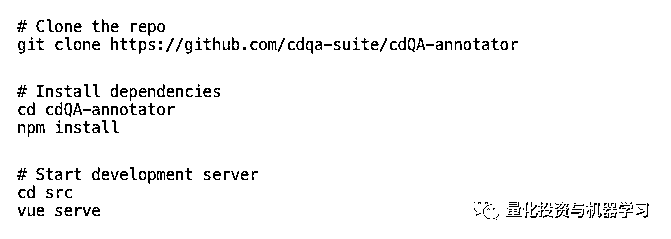

# 给力！使用 cdQA-suite 搭建自己的问答系统~

> 原文：[`mp.weixin.qq.com/s?__biz=MzAxNTc0Mjg0Mg==&mid=2653293515&idx=1&sn=d317c711d036fe8e96076c871f1e1408&chksm=802dc9deb75a40c8bd0c47765aefd0f3898743ae2e81cd19579ec02c77ef43ffdc364a7405da&scene=27#wechat_redirect`](http://mp.weixin.qq.com/s?__biz=MzAxNTc0Mjg0Mg==&mid=2653293515&idx=1&sn=d317c711d036fe8e96076c871f1e1408&chksm=802dc9deb75a40c8bd0c47765aefd0f3898743ae2e81cd19579ec02c77ef43ffdc364a7405da&scene=27#wechat_redirect)


**标星★公众号     **爱你们♥

作者：AndréMacedo Farias

便于：Remedios | 公众号翻译部

**近期原创文章：**

## ♥ [5 种机器学习算法在预测股价的应用（代码+数据）](https://mp.weixin.qq.com/s?__biz=MzAxNTc0Mjg0Mg==&mid=2653290588&idx=1&sn=1d0409ad212ea8627e5d5cedf61953ac&chksm=802dc249b75a4b5fa245433320a4cc9da1a2cceb22df6fb1a28e5b94ff038319ae4e7ec6941f&token=1298662931&lang=zh_CN&scene=21#wechat_redirect)

## ♥ [Two Sigma 用新闻来预测股价走势，带你吊打 Kaggle](https://mp.weixin.qq.com/s?__biz=MzAxNTc0Mjg0Mg==&mid=2653290456&idx=1&sn=b8d2d8febc599742e43ea48e3c249323&chksm=802e3dcdb759b4db9279c689202101b6b154fb118a1c1be12b52e522e1a1d7944858dbd6637e&token=1330520237&lang=zh_CN&scene=21#wechat_redirect)

## ♥ 2 万字干货：[利用深度学习最新前沿预测股价走势](https://mp.weixin.qq.com/s?__biz=MzAxNTc0Mjg0Mg==&mid=2653290080&idx=1&sn=06c50cefe78a7b24c64c4fdb9739c7f3&chksm=802e3c75b759b563c01495d16a638a56ac7305fc324ee4917fd76c648f670b7f7276826bdaa8&token=770078636&lang=zh_CN&scene=21#wechat_redirect)

## ♥ [机器学习在量化金融领域的误用！](http://mp.weixin.qq.com/s?__biz=MzAxNTc0Mjg0Mg==&mid=2653292984&idx=1&sn=3e7efe9fe9452c4a5492d2175b4159ef&chksm=802dcbadb75a42bbdce895c49070c3f552dc8c983afce5eeac5d7c25974b7753e670a0162c89&scene=21#wechat_redirect)

## ♥ [基于 RNN 和 LSTM 的股市预测方法](https://mp.weixin.qq.com/s?__biz=MzAxNTc0Mjg0Mg==&mid=2653290481&idx=1&sn=f7360ea8554cc4f86fcc71315176b093&chksm=802e3de4b759b4f2235a0aeabb6e76b3e101ff09b9a2aa6fa67e6e824fc4274f68f4ae51af95&token=1865137106&lang=zh_CN&scene=21#wechat_redirect)

## ♥ [如何鉴别那些用深度学习预测股价的花哨模型？](https://mp.weixin.qq.com/s?__biz=MzAxNTc0Mjg0Mg==&mid=2653290132&idx=1&sn=cbf1e2a4526e6e9305a6110c17063f46&chksm=802e3c81b759b597d3dd94b8008e150c90087567904a29c0c4b58d7be220a9ece2008956d5db&token=1266110554&lang=zh_CN&scene=21#wechat_redirect)

## ♥ [优化强化学习 Q-learning 算法进行股市](https://mp.weixin.qq.com/s?__biz=MzAxNTc0Mjg0Mg==&mid=2653290286&idx=1&sn=882d39a18018733b93c8c8eac385b515&chksm=802e3d3bb759b42d1fc849f96bf02ae87edf2eab01b0beecd9340112c7fb06b95cb2246d2429&token=1330520237&lang=zh_CN&scene=21#wechat_redirect)

## ♥ [WorldQuant 101 Alpha、国泰君安 191 Alpha](https://mp.weixin.qq.com/s?__biz=MzAxNTc0Mjg0Mg==&mid=2653290927&idx=1&sn=ecca60811da74967f33a00329a1fe66a&chksm=802dc3bab75a4aac2bb4ccff7010063cc08ef51d0bf3d2f71621cdd6adece11f28133a242a15&token=48775331&lang=zh_CN&scene=21#wechat_redirect)

## ♥ [基于回声状态网络预测股票价格（附代码）](https://mp.weixin.qq.com/s?__biz=MzAxNTc0Mjg0Mg==&mid=2653291171&idx=1&sn=485a35e564b45046ff5a07c42bba1743&chksm=802dc0b6b75a49a07e5b91c512c8575104f777b39d0e1d71cf11881502209dc399fd6f641fb1&token=48775331&lang=zh_CN&scene=21#wechat_redirect)

## ♥ [计量经济学应用投资失败的 7 个原因](https://mp.weixin.qq.com/s?__biz=MzAxNTc0Mjg0Mg==&mid=2653292186&idx=1&sn=87501434ae16f29afffec19a6884ee8d&chksm=802dc48fb75a4d99e0172bf484cdbf6aee86e36a95037847fd9f070cbe7144b4617c2d1b0644&token=48775331&lang=zh_CN&scene=21#wechat_redirect)

## ♥ [配对交易千千万，强化学习最 NB！（文档+代码）](http://mp.weixin.qq.com/s?__biz=MzAxNTc0Mjg0Mg==&mid=2653292915&idx=1&sn=13f4ddebcd209b082697a75544852608&chksm=802dcb66b75a4270ceb19fac90eb2a70dc05f5b6daa295a7d31401aaa8697bbb53f5ff7c05af&scene=21#wechat_redirect)

## ♥ [关于高盛在 Github 开源背后的真相！](https://mp.weixin.qq.com/s?__biz=MzAxNTc0Mjg0Mg==&mid=2653291594&idx=1&sn=7703403c5c537061994396e7e49e7ce5&chksm=802dc65fb75a4f49019cec951ac25d30ec7783738e9640ec108be95335597361c427258f5d5f&token=48775331&lang=zh_CN&scene=21#wechat_redirect)

## ♥ [新一代量化带货王诞生！Oh My God！](https://mp.weixin.qq.com/s?__biz=MzAxNTc0Mjg0Mg==&mid=2653291789&idx=1&sn=e31778d1b9372bc7aa6e57b82a69ec6e&chksm=802dc718b75a4e0ea4c022e70ea53f51c48d102ebf7e54993261619c36f24f3f9a5b63437e9e&token=48775331&lang=zh_CN&scene=21#wechat_redirect)

## ♥ [独家！关于定量/交易求职分享（附真实试题）](https://mp.weixin.qq.com/s?__biz=MzAxNTc0Mjg0Mg==&mid=2653291844&idx=1&sn=3fd8b57d32a0ebd43b17fa68ae954471&chksm=802dc751b75a4e4755fcbb0aa228355cebbbb6d34b292aa25b4f3fbd51013fcf7b17b91ddb71&token=48775331&lang=zh_CN&scene=21#wechat_redirect)

## ♥ [Quant 们的身份危机！](https://mp.weixin.qq.com/s?__biz=MzAxNTc0Mjg0Mg==&mid=2653291856&idx=1&sn=729b657ede2cb50c96e92193ab16102d&chksm=802dc745b75a4e53c5018cc1385214233ec4657a3479cd7193c95aaf65642f5f45fa0e465694&token=48775331&lang=zh_CN&scene=21#wechat_redirect)

## ♥ [拿起 Python，防御特朗普的 Twitter](https://mp.weixin.qq.com/s?__biz=MzAxNTc0Mjg0Mg==&mid=2653291977&idx=1&sn=01f146e9a88bf130ca1b479573e6d158&chksm=802dc7dcb75a4ecadfdbdace877ed948f56b72bc160952fd1e4bcde27260f823c999a65a0d6d&token=48775331&lang=zh_CN&scene=21#wechat_redirect)

## ♥ [AQR 最新研究 | 机器能“学习”金融吗？](http://mp.weixin.qq.com/s?__biz=MzAxNTc0Mjg0Mg==&mid=2653292710&idx=1&sn=e5e852de00159a96d5dcc92f349f5b58&chksm=802dcab3b75a43a5492bc98874684081eb5c5666aff32a36a0cdc144d74de0200cc0d997894f&scene=21#wechat_redirect)


**前言**

机器理解随着人工智能第一个概念的诞生开启了它的历史。杰出的艾兰图灵先生在他的著作《Computing Machinery and Intelligence》一书中提出了如今被称为图灵测试（The Turing test）的智能判定准则。大约 70 年之后，问答系统，作为机器理解的一个子领域，仍然是人工智能中最困难的任务之一。

不过，从去年开始，在深度学习研究的发展和迁移学习技巧的出现之下，自然语言处理（NLP）领域已经经历了一场快速的演变。强有力的预训练自然语言处理模型如 OpenAI-GPT，ELMo，BERT 和 XLNet。

随着这样的进程，一些改良过的 NLP 系统和应用应运而生。其中一个系统是**cdQA-suite**，这是我和同事在一起开发的。

***https://github.com/cdqa-suite/cdQA***


**Open-domain QA vs closed-domain QA**

当我们在考虑问答系统时，我们应当注意到两种不同的系统：**open-domain QA**（ODQA）系统和**closed-domain QA**（CDQA）系统。

ODQA 系统处理几乎所有的问题，并且能够仅仅依赖于通用知识本体和世界知识。这类系统的一个例子是 DrQA：

*https://github.com/facebookresearch/DrQA/*


这是一个 Facebook 研究团队开发的开放域问答系统，它使用了大量的维基百科的文章作为知识源。因为这些文档与一些不同的话题和科目有关，我们可以理解为什么这个系统被称为是一个开放域问答系统。

另一方面，CDQA 在某个特定的范畴（比如说，药品和自动维护）下解决问题，并且能够通过使用一个适合于一个特定领域的数据集的模型来开拓特定领域的知识。cdQA-suite 就是为方便任何想要建立一个 CDQA 的人使用而搭建的。

*https://cdqa-suite.github.io/cdQA-website/#about-us*


**cdQA-suite**


一个端到端的闭合域问答系统

cdQA-suite 包含三个模块：

**cdQA：**便捷的问答流程实现 Python 程序包

**cdQA-annotator：**为模型评估和性能调整实现问答数据集标注的工具

**cdQA-ui：**可以被连接到任何网页和可以被连接到后端系统的用户界面

我会解释每个模块是如何运作的，以及你在用你自己的数据建立问答系统时如何使用它们。

**cdQA**

cdQA 架构基于两个主要部分：**检索器**（Retriever）和**解读器**（Reader）。你可以在下图中了解系统机理。


cdQA 流程机理

当一个问题被送到这个系统时，检索器杂数据集中选择一系列最可能包含答案的文件。这基于与 DrQA 相同的检索器，它创造了基于一元和二元的 TF-IDF（term frequency–inverse document frequency）特征，并计算了问题语句和数据集中的每个文档的余弦相似性。

在选择了可能性最大的文档之后，系统把每一个文档分成段落，并将它们和问题一起发送至解读器，解读器基本上是一个预训练深度学习模型。模型使用 Pytorch 版本的著名自然语言处理模型 BERT：

*https://github.com/huggingface/pytorch-pretrained-BERT*


由 HuggingFace 提供：

*https://huggingface.co/*


然后，这个解读器输出它能在每个段落中找到的最可能的回答。在解读器之后，系统中的最后一层处理使用一个内部评分函数进行比较，并输出在这些分数中可能性最大的一个。

**使用 cdQA Python 程序包**

在开始使用这个程序包之前，让我们先把它下载好。你可以使用 pip install cdqa 下载它，但是在这个教程中，我们会从 GitHub 源来下载它，以便我运行下载预训练模型和 BNP 数据集（一个含从他们的公开新闻网页中导出文章的数据集）的脚本。


现在，你可以打开一个 jupyter notebook 然后跟宋以下步骤来看看 cdQA 如何运行。


你将得到如下输出：

问答系统流程预测的输出

你将注意到这个系统不仅仅输出了一个结果，还输出了结果所在的段落和该文档或文章的标题。

在以上的片段中，需要用预处理/过滤步骤来将法国巴黎银行的数据转化为以下结构：


   应当被输送至 cdQA 的数据及结构

如果你使用你自己的数据集，请保证你的数据矩阵是如下结构的。    

当使用模型的 CP 版本时，每次预测需要花费 10 到 20 秒来完成。这个中等的运行时间是因为 BERT 解读器，这是一个非常大的深度学习模型（有大约 110 兆个变量）。如果你有一个 GPU，你可以直接使用模型的 GPU 版本 models/bert_qa_vGPU-sklearn.joblib

这些与训练模型也可以在 cdQA 的发布页面上获取：

*https://github.com/cdqa-suite/cdQA/releases*


**解读器的训练和性能调整**

你也可以提高基于 SQuAD1.1 数据集预训练的解读器的表现。

*https://rajpurkar.github.io/SQuAD-explorer/*


如果你有一个与 SQuAD 相同格式的被注释的数据集（可以在 cdQA-annotator 的帮助下获得），你可以对解读器进行性能调整：


**请注意，这样的性能调整应当使用 GPU 进行，因为 BERT 模型太大以至于不能使用 CPU 来训练。**

你也可以在官方教程中寻找其他的方法来做相同的步骤：

*https://github.com/cdqa-suite/cdQA/tree/master/examples *

**CdQA-annotator**

为了使数据标注顺利进行，团队搭建了一个基于网页的应用——cdQA-annotator。

为了使用它，你应当将你自己的数据集转换为一个像 SQuAD 格式的 JSON 文件：


现在你可以下载这个标注器并运行它：



现在你可以打开 http://localhost:8080/ ，在加载了你的 JSON 文件之后，你会看到以下内容：


cdQA-annotator 界面

你只需要写一个问题，用鼠标光标高亮答案（答案会被自动写好）来开始标注问题-回答配对，然后点击 Add annotation ：


在标注之后，你可以下载并使用它来调整 BERT 解读器（方法参见上一节）。

**cdQA-ui**

我们也提供了一个基于网页的用户界面来与 cdQA 连结。在这一节中，我们会描述你能如何使用这个 UI 连接到 cdQA 后端。

首先，必须在你的位置（确认你在 cdQA 文件夹中运行）配置一个 cdQA RSET API：


接下来，你需要运行 cdQA-ui 程序包的下载指令：


然后，你启动开发服务器：


你现在可以通过 http://localhost:8080/ 进入页面程序。你也将看到以下图片：


cdQA-ui 的网页应用

因为应用以及通过 REST API 连接到后端，你可以问一个问题然后这个应用会显示一个答案和答案所在的文章内容以及文章的标题。


网页应用运行示例

**将界面嵌入一个网页**

如果你想将这个界面和你的网页结合起来，你只需要在你的 Vue app 上做以下的输入：


然后你将 cdQA 界面组成部分插入

```py
<CdqaUI api_endpoint_cpu="http://localhost:5000/api" :queries_examples="['What is Artificial Intelligence?', 'What is Blockchain?']">
</CdqaUI>
```

**示例**

你也可以在官方网页上获取应用的示例：

https://cdqa-suite.github.io/cdQA-website/#demo


**总结**

在这篇文章中，我介绍了用于配置端到端闭合域问答系统的软件套件 cdQA-suite。

如果你对这个项目感兴趣并想学到更多，随时可以登录官方 GitHub（https://github.com/cdqa-suite）进行查看。

我们近期发布了 cdQA 程序包的 1.0.2 版本，新版本具有很高的性能并展示了非常有价值的结果，也还有许多提高的空间。如果你想要对项目做出贡献，对提升提供帮助，你可以看看当前的问题：https://github.com/cdqa-suite/cdQA/issues。可以自行选择一个问题并 PullRequest。

*来源：**https://towardsdatascience.com/how-to-create-your-own-question-answering-system-easily-with-python-2ef8abc8eb5*


*—End—*

量化投资与机器学习微信公众号，是业内垂直于**Quant**、**MFE**、**CST、AI**等专业的**主****流量化自媒体**。公众号拥有来自**公募、私募、券商、银行、海外**等众多圈内**10W+**关注者。每日发布行业前沿研究成果和最新量化资讯。

