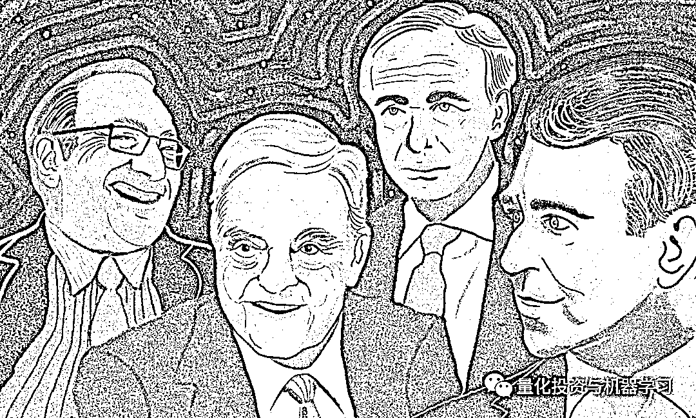
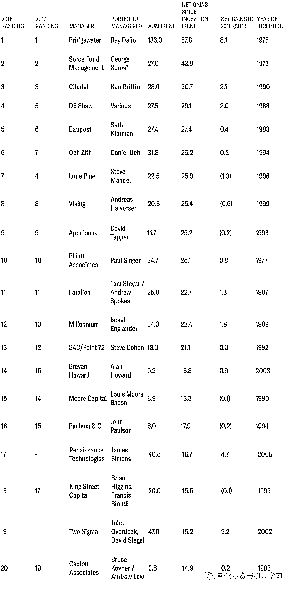
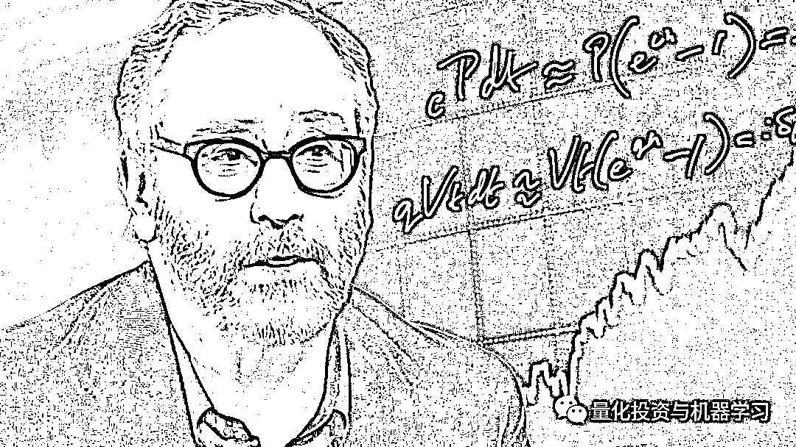
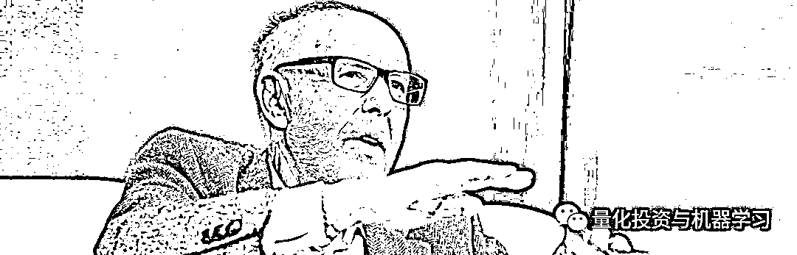
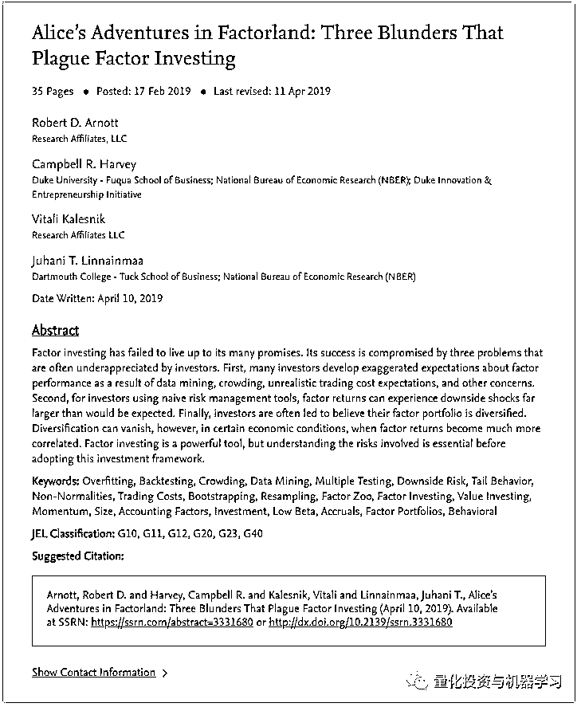
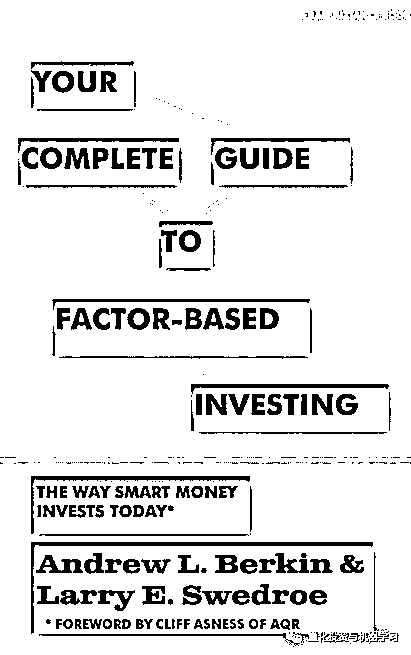
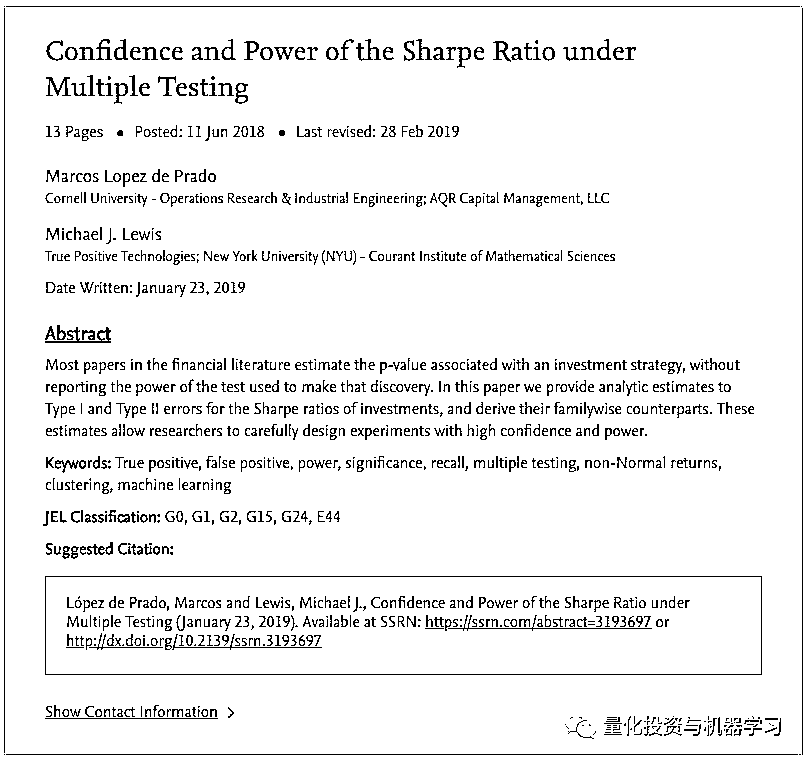
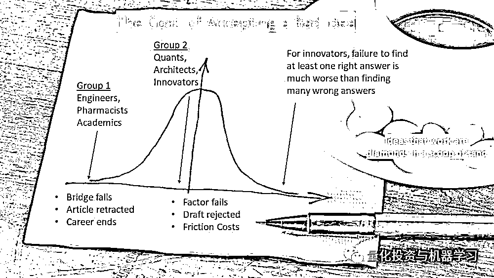
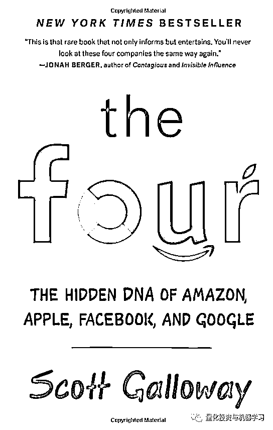

# Alpha 来自哪里？

> 原文：[`mp.weixin.qq.com/s?__biz=MzAxNTc0Mjg0Mg==&mid=2653293484&idx=1&sn=e96214f144e9add5b05dfd75d2874f0d&chksm=802dc9b9b75a40af23764342ac5a2f246d61f9286b4fae8ed1764e197402e46aa673a2453fef&scene=27#wechat_redirect`](http://mp.weixin.qq.com/s?__biz=MzAxNTc0Mjg0Mg==&mid=2653293484&idx=1&sn=e96214f144e9add5b05dfd75d2874f0d&chksm=802dc9b9b75a40af23764342ac5a2f246d61f9286b4fae8ed1764e197402e46aa673a2453fef&scene=27#wechat_redirect)

**标星★公众号     **爱你们♥

撰写综合：公众号海外部、LCH、Mikhail Samonov

**近期原创文章：**

## ♥ [5 种机器学习算法在预测股价的应用（代码+数据）](https://mp.weixin.qq.com/s?__biz=MzAxNTc0Mjg0Mg==&mid=2653290588&idx=1&sn=1d0409ad212ea8627e5d5cedf61953ac&chksm=802dc249b75a4b5fa245433320a4cc9da1a2cceb22df6fb1a28e5b94ff038319ae4e7ec6941f&token=1298662931&lang=zh_CN&scene=21#wechat_redirect)

## ♥ [Two Sigma 用新闻来预测股价走势，带你吊打 Kaggle](https://mp.weixin.qq.com/s?__biz=MzAxNTc0Mjg0Mg==&mid=2653290456&idx=1&sn=b8d2d8febc599742e43ea48e3c249323&chksm=802e3dcdb759b4db9279c689202101b6b154fb118a1c1be12b52e522e1a1d7944858dbd6637e&token=1330520237&lang=zh_CN&scene=21#wechat_redirect)

## ♥ 2 万字干货：[利用深度学习最新前沿预测股价走势](https://mp.weixin.qq.com/s?__biz=MzAxNTc0Mjg0Mg==&mid=2653290080&idx=1&sn=06c50cefe78a7b24c64c4fdb9739c7f3&chksm=802e3c75b759b563c01495d16a638a56ac7305fc324ee4917fd76c648f670b7f7276826bdaa8&token=770078636&lang=zh_CN&scene=21#wechat_redirect)

## ♥ [机器学习在量化金融领域的误用！](http://mp.weixin.qq.com/s?__biz=MzAxNTc0Mjg0Mg==&mid=2653292984&idx=1&sn=3e7efe9fe9452c4a5492d2175b4159ef&chksm=802dcbadb75a42bbdce895c49070c3f552dc8c983afce5eeac5d7c25974b7753e670a0162c89&scene=21#wechat_redirect)

## ♥ [基于 RNN 和 LSTM 的股市预测方法](https://mp.weixin.qq.com/s?__biz=MzAxNTc0Mjg0Mg==&mid=2653290481&idx=1&sn=f7360ea8554cc4f86fcc71315176b093&chksm=802e3de4b759b4f2235a0aeabb6e76b3e101ff09b9a2aa6fa67e6e824fc4274f68f4ae51af95&token=1865137106&lang=zh_CN&scene=21#wechat_redirect)

## ♥ [如何鉴别那些用深度学习预测股价的花哨模型？](https://mp.weixin.qq.com/s?__biz=MzAxNTc0Mjg0Mg==&mid=2653290132&idx=1&sn=cbf1e2a4526e6e9305a6110c17063f46&chksm=802e3c81b759b597d3dd94b8008e150c90087567904a29c0c4b58d7be220a9ece2008956d5db&token=1266110554&lang=zh_CN&scene=21#wechat_redirect)

## ♥ [优化强化学习 Q-learning 算法进行股市](https://mp.weixin.qq.com/s?__biz=MzAxNTc0Mjg0Mg==&mid=2653290286&idx=1&sn=882d39a18018733b93c8c8eac385b515&chksm=802e3d3bb759b42d1fc849f96bf02ae87edf2eab01b0beecd9340112c7fb06b95cb2246d2429&token=1330520237&lang=zh_CN&scene=21#wechat_redirect)

## ♥ [WorldQuant 101 Alpha、国泰君安 191 Alpha](https://mp.weixin.qq.com/s?__biz=MzAxNTc0Mjg0Mg==&mid=2653290927&idx=1&sn=ecca60811da74967f33a00329a1fe66a&chksm=802dc3bab75a4aac2bb4ccff7010063cc08ef51d0bf3d2f71621cdd6adece11f28133a242a15&token=48775331&lang=zh_CN&scene=21#wechat_redirect)

## ♥ [基于回声状态网络预测股票价格（附代码）](https://mp.weixin.qq.com/s?__biz=MzAxNTc0Mjg0Mg==&mid=2653291171&idx=1&sn=485a35e564b45046ff5a07c42bba1743&chksm=802dc0b6b75a49a07e5b91c512c8575104f777b39d0e1d71cf11881502209dc399fd6f641fb1&token=48775331&lang=zh_CN&scene=21#wechat_redirect)

## ♥ [计量经济学应用投资失败的 7 个原因](https://mp.weixin.qq.com/s?__biz=MzAxNTc0Mjg0Mg==&mid=2653292186&idx=1&sn=87501434ae16f29afffec19a6884ee8d&chksm=802dc48fb75a4d99e0172bf484cdbf6aee86e36a95037847fd9f070cbe7144b4617c2d1b0644&token=48775331&lang=zh_CN&scene=21#wechat_redirect)

## ♥ [配对交易千千万，强化学习最 NB！（文档+代码）](http://mp.weixin.qq.com/s?__biz=MzAxNTc0Mjg0Mg==&mid=2653292915&idx=1&sn=13f4ddebcd209b082697a75544852608&chksm=802dcb66b75a4270ceb19fac90eb2a70dc05f5b6daa295a7d31401aaa8697bbb53f5ff7c05af&scene=21#wechat_redirect)

## ♥ [关于高盛在 Github 开源背后的真相！](https://mp.weixin.qq.com/s?__biz=MzAxNTc0Mjg0Mg==&mid=2653291594&idx=1&sn=7703403c5c537061994396e7e49e7ce5&chksm=802dc65fb75a4f49019cec951ac25d30ec7783738e9640ec108be95335597361c427258f5d5f&token=48775331&lang=zh_CN&scene=21#wechat_redirect)

## ♥ [新一代量化带货王诞生！Oh My God！](https://mp.weixin.qq.com/s?__biz=MzAxNTc0Mjg0Mg==&mid=2653291789&idx=1&sn=e31778d1b9372bc7aa6e57b82a69ec6e&chksm=802dc718b75a4e0ea4c022e70ea53f51c48d102ebf7e54993261619c36f24f3f9a5b63437e9e&token=48775331&lang=zh_CN&scene=21#wechat_redirect)

## ♥ [独家！关于定量/交易求职分享（附真实试题）](https://mp.weixin.qq.com/s?__biz=MzAxNTc0Mjg0Mg==&mid=2653291844&idx=1&sn=3fd8b57d32a0ebd43b17fa68ae954471&chksm=802dc751b75a4e4755fcbb0aa228355cebbbb6d34b292aa25b4f3fbd51013fcf7b17b91ddb71&token=48775331&lang=zh_CN&scene=21#wechat_redirect)

## ♥ [Quant 们的身份危机！](https://mp.weixin.qq.com/s?__biz=MzAxNTc0Mjg0Mg==&mid=2653291856&idx=1&sn=729b657ede2cb50c96e92193ab16102d&chksm=802dc745b75a4e53c5018cc1385214233ec4657a3479cd7193c95aaf65642f5f45fa0e465694&token=48775331&lang=zh_CN&scene=21#wechat_redirect)

## ♥ [拿起 Python，防御特朗普的 Twitter](https://mp.weixin.qq.com/s?__biz=MzAxNTc0Mjg0Mg==&mid=2653291977&idx=1&sn=01f146e9a88bf130ca1b479573e6d158&chksm=802dc7dcb75a4ecadfdbdace877ed948f56b72bc160952fd1e4bcde27260f823c999a65a0d6d&token=48775331&lang=zh_CN&scene=21#wechat_redirect)

## ♥ [AQR 最新研究 | 机器能“学习”金融吗？](http://mp.weixin.qq.com/s?__biz=MzAxNTc0Mjg0Mg==&mid=2653292710&idx=1&sn=e5e852de00159a96d5dcc92f349f5b58&chksm=802dcab3b75a43a5492bc98874684081eb5c5666aff32a36a0cdc144d74de0200cc0d997894f&scene=21#wechat_redirect)

**正文**

# Warren Buffett（巴菲特）, George Soros（索罗斯）和 Ray Dalio（达利奥）他们之间是不能很好地完成彼此的工作滴。

每一大佬都有一套自己独特的投资风格。一种完全成熟的投资风格之所以独特，是因为它与投资者感知世界的方式、个性、认知能力、对资产价格可预测性的信念等，当然还有他们的经验和各种潜移默化的关系。

机构投资者最近更新了史上最佳对冲基金经理名单，我们不禁注意到，这些基金经理的投资理念各有不同。即使这些管理者属于相同的 HFRI 类别，但他们的风格也有明显的差异。

机构投资者- 2019 年 1 月 27 日

上表告诉我们一个道理：

**富人会越来越富，尤其是对冲基金经理**

尽管 2018 年对冲基金遭受金融危机以来的最差的表现，并且有 60%的基金亏损，根据数据跟踪商 HFR 称：**20 家最成功的对冲基金经理并没有受不利影响。****这群基金经理去年为他们的投资者净赚 232 亿美元。****相比之下，其他所有对冲基金经理为投资者带来的净损失为 642 亿美元。**

LCH Investments 董事长 Rick Sopher 在一份新闻稿中表示：**排名前 20 位的基金经理，要么在股市接近年底大幅下跌时设法避开了，要么采取了与股市走势无关的投资策略**。

LCH 根据基金经理自成立以来扣除费用后的净收益对他们进行排名。发现，前 20 位对冲基金经理在所有基金经理的总收益中贡献了 503 亿美元，占总收益的 45.6%，尽管他们仅占总资产的 17.9%。

达里奥的桥水显然是今年榜单的赢家。首先，它超过了去年的收入者，为投资者创造了总计 81 亿美元的净收益。自成立以来，桥水也排名第一，为投资者创造了 578 亿美元的总收益。去年该公司的旗舰产品 Pure Alpha 策略净收益为 14.6%。

**2018 年为投资者赚得最多钱的对冲基金经理是由计算机驱动的，他们使用系统性策略，而不承担重大的股市风险。****换句话说，他们并不依赖股市的走势来赚钱。****除了桥水，这些公司还包括文艺复兴和 Two Sigma。**

有趣的是，LCH 首次将西蒙斯的文艺复兴纳入榜单。尽管人们普遍认为该公司是有史以来最成功的对冲基金管理公司，但该公司过去并未上榜。

2018 年，该公司为投资者创造了 47 亿美元的利润，排名第二。自 2005 年成立以来，即文艺复兴开设额外基金吸收外部资本的时间——它为投资者创造了 167 亿美元的总收益，排名第 17 位。

由 John Overdeck 和 David Siegel 领导的 Two Sigma 去年为投资者赚了 32 亿美元，在前 20 家公司中排名第三。自成立以来，该公司排名第 19 位，资产 152 亿美元。

索罗斯的 Soros fund Management 自成立以来以 439 亿美元的资产规模继续位居第二。

Ken Griffin 's Citadel 自成立以来总市值 307 亿美元，仍居第三，去年为投资者赚得 21 亿美元。其 Kensington 和 Wellington 多策略基金去年的收益超过 9%。

**回到主题**

相反，在常规的投资管理工作中，这种风格的识别往往不是这样的。当基金经理更换公司时，标准化的操作保证了技能的可转移性：5 因子模型、优化器和 t-statistics；现金流折现估值模型 DCF ( Discounted Cash Flow ) 、分析师预估及管理 phone calls 为基本面股票分析师。不幸的是，这些技能通常都不能为客户带来长期价值；没有 Alpha，就没有较好的表现。

如果有一种标准化的学习投资标的方法，那么它将更接近技术工作而不是艺术工作。在这种情况下，上述名单的 20 位大佬，不久将被机器人取代。事实上。上面这份名单是如此多样化，而且每种风格的长期投资结果都是都非常出色的，这反映了投资和艺术之间的相似性。

事实上，**许多对冲基金更愿意聘用科学和哲学专业的学生，而不是金融专业的学生。因为，****他们在寻找那些喜欢解决尚无答案问题的人。**

下面是 D.E. Shaw 的一段话：

*“The cerebral computer scientist would go on to become a pioneer in a revolution in finance that would computerize the industry, turn long-standing practices on their head, and replace a culture of tough-guy traders with brainy eccentrics — not just math and science geeks, but musicians and writers — wearing jeans and T-shirts.”*

西蒙斯的一段话：

*“Be guided by beauty, Beauty is an aesthetic. There is beauty in things that work really well — the way a company is run, or the way a theorem comes out”*

**Alpha 来自哪里？**

我们的目标并不是最终出现在上面的名单中，而是通过团队发展来取得进步并产生 Alpha。

这里我们想讲讲大家很关心的 Alpha 问题。

**每个人都知道：****所****有的信息都在价格里。****所有的想法都已经探讨过了。****所有的数据都被发现了**。市场是不可能被战胜的。Alpha 死了......

这是投资管理的本质。每个管钱的人都有过这样的经历，但只有少数人能越过这堵墙。Alpha 很难被发现。

然后是金融之外的其他经济领域，众所周知的 Main-Street，它更加严峻。在自由市场中，所有利润都应归零。竞争应该会吞噬它们。那么，企业如何保持盈利呢？硅谷新成立的公司（假设成功）是如何赚钱的？苹果如何与微软竞争，花旗如何与富国银行（WELLS FARGO）竞争？**他们要么创新要么垄断。****或者说，他们首先进行创新，然后垄断**。后者在技术上是不允许的，所以我们将重点放在前者上。

**创新是企业成为持持续盈利的首要原因**。新的产品、新的解决方案、新的策略——所有这些都会给客户带来新的价值。看看沪深 300 成份股的公司，我们只能想象这些公司面临的竞争压力以及所有新进入者的担忧。然而，至少在平均水平上，它们还是设法保持了盈利。**那些成功的人，拥有创新的文化，不断把事情做得更好。****他们避免了“太大而不能创新”的陷阱，继续生活在不安的边缘，点点滴滴在为客户创造价值——****资产管理公司愿意为 Alpha 做同样的事情吗?**

再高一层呢？经济如何增长？在经典的索洛增长宏观经济增长模型中，GDP 增长是资本、劳动力和生产率的函数，巧合的是（也可能不是）它也被称为 Alpha。**就像经济体一样，资产管理公司可以在获取资本（软件、硬件、数据、另类数据）和劳动力（博士、CFA、数据科学家、纯数学家和物理学家）方面投入大量资金——但 Alpha 是另一回事。****这部分原因仅靠资本和劳动力的增长是无法解释的**。**Alpha 在创新的推动下提高了生产力**。许多拥有完美资本和劳动力资源的投资公司失去了领先优势。他们停止创新。他们的过程成了例行公事。没有什么新问题得到解决。

再上一层呢？地球上所有的生命是如何生长的？幸存下来的动物和植物——也都进化和适应了！你是愿意重新发现自己的投资优势，还是愿意在海底争夺食物？简而言之，生命似乎是预先设定好的，为了生存而创新。那么，生命是 Alpha 吗？

创新不仅仅是新奇。它也有实用的一面。它解决了一个以前没有解决过的问题。**一天中有百分之几的时间基金经理在解决以前没有解决过的问题？****回答那些没有回答的问题？**

相反，即使排除了他们的“繁忙/管理时间”，考虑一下投资专业人士花在阅读他人观点（如卖方报告和学术论文）上的“纯研究时间”占比；在静态模模型中修改参数并重复相同的失败过程？这就是创新的样子吗？

那么 Alpha 从何而来?

**也许是一张纸和一支笔**

首先写下一些很棒的问题：你的创新风格是什么样的?

**数据挖掘不是创新**

再回到前面的论述。在自己的工作和与团队成员的工作中发现好的苗子是有力的第一步。参与能够让这些苗子生长的研究，这样可以形成一种基于团队的风格。当然，这需要对第一类风险持开放态度，并有意义地降低第二类风险——因为在最坏的情况下，结果将是平均的，起点是当前的现状。  

什么是第一类、第二类风险呢？

包括投资在内的大多数决策中，犯错的方式有两种：

**1、做一些没用的事情（第一类错误）**

**2、不做那些本该起作用的事情（第二类错误）**

与几乎普遍的看法相反，数据挖掘形式的第一类错误是最常见的错误，详情见这篇论文：

Factor investing has failed to live up to its many promises. Its success is compromised by three problems that are often underappreciated by investors. First, **many investors develop exaggerated expectations about factor performance as a result of data mining, crowding, unrealistic trading cost expectations, and other concerns**. Second, for investors using naive risk management tools, factor returns can experience downside shocks far larger than would be expected. Finally, investors are often led to believe their factor portfolio is diversified. Diversification can vanish, however, in certain economic conditions, when factor returns become much more correlated. Factor investing is a powerful tool, but understanding the risks involved is essential before adopting this investment framework.

投资者和量化分析师尤其担心的是第一类错误，认为一个结果是真实的，却接受了一个虚假的结果。然而，还有另一种类型的错误潜伏在第二类错误，拒绝一个真实的结果，认为它是假的。

我们更觉得**第二类错误会更糟，因为它们最终会产生无差别和过度拥挤没有创新的模型中，因此没有 Alpha**。

假设有两个组：

第一个组属于第一类错误具有非常大的负成本，因为它可能产生致命的后果。例如，如果你正在建造一座桥，遵循指示是必要的，所以当第一辆卡车驶过桥时，桥仍然完好无损。开药方也是一样。没有太多的实验空间。我们很难对一些成功的桥梁和一些失败的桥梁进行平均。我们应不惜一切代价避免第一类错误的发送。

然而，在第二组中，第一类错误没有这样的负成本，而第二类错误有。例如，如果你需要发明一个更有效的桥，或者发现一个更好的治疗方法，那么拒绝一个可能很好的解决方案实际上是一个失败的决策。这个任务以创造性为重点，通常由建筑师、艺术家、作家、创新者、科学家和企业家来完成。对他们来说，第一类错误的成本要低得多——花几个小时来勾画一个新设计、起草一个想法、再做一个实验室实验等。另一方面，第二类错误让他们付出了很多代价。未能解决新问题、创新、发明和创造可能是“职业致命”的结果。在第二个任务中，一个正确的答案抵得上许多错误的答案。

测试一个新的投资策略应该属于哪一类呢？

考虑一下，对于一个接受“假”因子（有时被称为 p-Hacking）的量化分析师来说，第一类错误的代价是什么？虚假因子的预期回报是随机减去交易成本。参考《Your Complete Guide to factorbased Investing》。

在这里，公众号给大家普及一下什么事 p-Hacking：

**我们在统计时经常用到 P 值，一般认为 P≦0.05 有统计学意义。但是现在很多统计学家并不是这样认为，对于 P 值的滥用和误用进行了苛刻的批评**。因此出现了一个新词：P-hacking。

P-hacking 最早应该是美国宾夕法尼亚大学的 Simmons 和他的团队提出来的：

P-hacking 按照字面的意思来看是「P 值黑客]，但是实际上的意思科研动力认为是「P 值篡改」或者「P 值操纵」。这可能是在线都市词典收录的第一个统计词汇：

> *Exploiting –perhaps unconsciously - researcher degrees of freedom until p<.05.*

从词典给出的意思来看 P-hacking 是科研人员不断的尝试统计计算直到 p<.05，当然有时这可能是无意识的。在线都市词典还给出了例句：

> *That finding seems to have been obtained through p-hacking, the authors dropped one of the conditions so that the overall p-value would be less than .05.
> She is a p-hacker, she always monitors data while it is being collected.*

Simmons 等人也对 P-hacking 进行了定义：

> *P-hacking refers to the practice of reanalyzing data in many different ways to yield a target result. They, and more recently Motulsky, have described the variations on P-hacking, and the hazards, notably the likelihood of false positives—findings that statistics suggest are meaningful when they are no.*

有一些可重现性危机，一些科学家无法复制一些关键实验：

> *今年 8 月，《科学》杂志发表了一项名为“可复制性项目”（re - bility Project）的计划的成果。该计划是由非营利组织开放科学中心（Center for Open Science）协调的合作项目。参与者试图复制 100 个与实验相关的心理学研究，这些研究已经在三家著名的心理学杂志上发表。*
> 
> *媒体广泛报道的结果令人深思。只有 39 项研究被成功复制。*

我猜想，大部分原因是研究人员在发表具有统计学意义的结果之前进行了大量的试验。或者在试验过程中改变不同的参数。这就是所谓的**The garden of forking paths**，并不总是经过深思熟虑的。

文献地址：

***http://101.96.10.63/www.stat.columbia.edu/~gelman/research/unpublished/p_hacking.pdf***

> *Researcher degrees of freedom can lead to a multiple comparisons problem, even in settings where researchers perform only a single analysis on their data. The problem is there can be a large number of potential comparisons when the details of data analysis are highly contingent on data, without the researcher having to perform any conscious procedure of fishing or examining multiple p-values*

经济和金融预测很容易受到这些偏差的影响。听经济学家经常说，因子 X 的 N 月滞后是 y 的一个指标，为什么 N 个月滞后？1 - (N-1)的滞后还没有解决。

**回到主题**

预期结果只是略微负面（仅限交易成本）。另一方面，拒绝那些在统计上能带来正回报的因子的成本是多少？成本是正 Alpha 在整体模型中。

不幸的是，**越是试图减少第一类错误，第二类错误就越高**——使用 t 统计的一个常见量化实践就是这样做的，详见 Marcos Lopez de Prado 的《Confidence and Power of the Sharpe Ratio under Multiple Testing》论文。

思想的选择就像捡起一把石头，有的里面藏着钻石，有的只是灰尘。如果你高估了自己的想法有多准确，那么你选择的宝石就会比最理想的少，可能会错过钻石。与对好桥梁和坏桥梁进行平均不同，对好因子和坏因子进行平均可以使模型朝着其目标的方向发展，即提供正回报。

伟大的投资者意识到他们错过的机会和他们做错误投资一样重要。例如，巴菲特最大的错误包括很多第二类错误，比如没有购买谷歌和亚马逊等。

第二组的人们思考的一个例子：

**Shrewdly and publicly**

Mr. Bezos 将亚马逊的风险分为两类：

**1、那些走不回来的(“这是公司的未来”)**

**2、那些可以走回来的(“这行不通，我们走了”)**

Mr. Bezos 的观点是，亚马逊投资战略的关键是进行更多的第二类试验，包括飞行仓库或保护无人机免受攻击的系统。他们已经申请了这两项专利。第二类投资是廉价的，因为它们很可能在浪费太多钱之前就被扼杀了，而且它们会为塑造一家领先企业的形象方面会带来丰厚的红利。

亚马逊内容可参考此书

总而言之，传统的量化分析师（以及其他投资者）**不能提供持久的 Alpha 的原因不是因为过多的数据挖掘，而是因为缺乏一个个性化的创新流程来获取和实施新想法**。

我们也相信任何团队都有潜力开发出一种独特的创新风格。

**加油！****为了你们的 Alpha!**

*—End—*

量化投资与机器学习微信公众号，是业内垂直于**Quant**、**MFE**、**CST、AI**等专业的**主****流量化自媒体**。公众号拥有来自**公募、私募、券商、银行、海外**等众多圈内**10W+**关注者。每日发布行业前沿研究成果和最新量化资讯。

